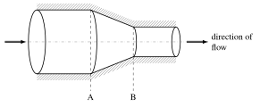
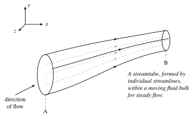



::: {.outcomes}
By the end of this chapter you should be able to:

- explain the difference between the control-volume and differential (fluid element) approaches, and between Eulerian and Lagrangian descriptions;
- derive the material derivative $D/Dt$ and separate the **local** and **convective** parts of the acceleration of a fluid element;
- calculate the vorticity of a velocity field and decide whether a flow is rotational or irrotational;
- relate shear stress to velocity gradient for a Newtonian fluid.
:::

## Introduction {#sec-intro}

When analysing fluid flow problems one can take two paths:

(i) Seek an estimate of gross effects (flow, forces, energy transfer) over a finite region or control volume [the typical approach used in L1 and L2 Fluids];
(ii) Seek the point-by-point details of an established or evolving flow pattern by analysing an infinitesimally small region of the flow [the approach adopted here], more specifically a **fluid element**.

In the above we choose to use the term "fluid element" rather than "fluid particle" because the latter is something rigid/solid which a fluid is not.

In fact, in its broadest sense:

::: {.callout-tip icon=false}
## Definition: a fluid
"A fluid (liquid or gas) is a substance that deforms continuously when subjected to a shear force and will continue to do so for as long as the force is applied."
:::

Unlike a solid, fluid motion occurs by convective and/or diffusive transport processes.

- Diffusive processes act to [stabilise]{.underline} a flow (bring it back to an equilibrium state) and are associated with the **viscous forces** present in the system.
- Convective transport acts to [destabilise]{.underline} a flow and is associated with the **inertia forces** present in the system.

The ratio of one to the other is encapsulated in a non-dimensional quantity expressed as the Reynolds number, $Re$:

::: {.callout-tip icon=false}
## Definition: Reynolds number

$$
Re = \frac{\text{inertia forces}}{\text{viscous forces}}
$$ {#eq-reynolds}

- $Re$ small ($Re \ll 1$) $\Rightarrow$ viscous forces dominate
- $Re$ large ($Re \gg 1$) $\Rightarrow$ inertia forces dominate
:::

Based on the above definition of a fluid we wish to determine how a fluid's velocity is distributed as it moves; the flow or motion being the result of one-or-more of:

- Pressure differences, measured in $\text{N m}^{-2}$ or Pa (force per unit area).
- Shear stresses, both normal and tangential, measured in $\text{N m}^{-2}$ (force per unit area).
- Body forces, measured in N, gravity being a typical example.

In general we need to determine the velocity field (a vector quantity having 3 components), the pressure, density and temperature fields (all scalar quantities) --- in total 6 variables all of which are functions of both space and time. To achieve this we need to formulate 6 mathematical relationships; all but one of which will be a differential equation. They are:

1. The **Equation of Continuity** --- a scalar equation --- which is a statement of the conservation of mass.
2. The **Equation of Conservation of Momentum** --- a vector equation leading to three scalar equations, one for each scalar velocity component.
3. The **Equation of Conservation of Fluid Energy** --- a scalar equation.
4. An **Equation of State**, which relates pressure, density and temperature to each other.

In their most general form, equations 1. to 3. are difficult/impossible to solve analytically in all but the simplest of cases. While the latter are informative and not to be dismissed, the majority of engineering problems of interest cannot be addressed in this way. The alternative is to solve such equations (one or more) by approximating them in a discrete form and solving them computationally with the aid, as necessary, of additional physical effects and corresponding modelling assumptions: the case of turbulent flow being an excellent example.

The main vehicle for determining the differential form of the equations in 1. to 3. is the **Continuum Hypothesis**:

::: {.callout-tip icon=false}
## Definition: the continuum hypothesis
A fluid is viewed and modelled as an infinitely divisible substance and defined as a **homogeneous continuum** in that it is uniform everywhere and contains no molecules or holes.
:::

Average behaviour only is sufficient over a small continuum fluid element, and what applies to one such element applies to the bulk at every point. Fluid dynamic equations, therefore, make reference to the velocity, pressure, temperature, etc., for a small fluid element. The velocity vector field is arguably the most important variable in fluid mechanics, since knowledge of it is more-or-less equivalent to solving a fluid flow problem.

If our reference co-ordinate system is fixed in space we observe the fluid as it passes by --- as if the observer is sitting at a fixed reference point in the fluid and watching the fluid motion. This is known formally as the **Eulerian** frame of reference; as opposed to a **Lagrangian** frame of reference which follows the motion of individual fluid elements --- as if the observer is no longer sitting at a fixed reference point in space but is attached to and moves with a fluid element.

The three equations of motion, underpinning the equation of conservation of fluid momentum, are obtained by applying Newton's 2nd Law of Motion (see Chapter 2), namely:

$$
\boxed{\text{Force} = \text{Rate of change of momentum}}
$$

which when the mass of the fluid element does not change, i.e. is conserved, can be written as:

$$
\boxed{\text{Force} = (\text{mass}) \times (\text{acceleration})}
$$

Hence we need to be able to represent the acceleration of a fluid element in terms of its velocity.

::: {.callout-caution collapse="true" icon=false}
## Check your understanding
1. You stand on a bridge and measure the water speed at one point under it with a probe. Are you using an Eulerian or a Lagrangian description?
2. Give one situation where the continuum hypothesis would break down.

*Answers:* (1) Eulerian --- you watch a fixed point in space while different fluid elements pass through it. (2) Any case where the molecular mean free path is not small compared with the length scale of interest, e.g. a very rarefied gas at high altitude, or gas flow in nano-scale channels.
:::

## Acceleration and Total Time Derivative {#sec-material-derivative}

Thus far we have refrained from specifying any particular coordinate system in which to work. For simplicity, and without loss of generality, we select a Cartesian system since, as we shall see here and subsequently, the outcome is a general representation that applies to *any* curvilinear coordinate system and there is no need, in addition to what is presented, to derive equivalent conservation equations in, for example, cylindrical or spherical polar coordinates.

So, taking the velocity vector field to be $\vect{q}(\vect{x},t)$[^bold] such that:

[^bold]: In this course, bold symbols represent vectors.

$$
\vect{q}(\vect{x},t) = u(x,y,z,t)\,\uvec{i} + v(x,y,z,t)\,\uvec{j} + w(x,y,z,t)\,\uvec{k},
$$

where $\uvec{i}, \uvec{j}, \uvec{k}$ are unit vectors in the $x, y$ and $z$ directions, respectively. The acceleration $\vect{a}(\vect{x},t)$ is given by:

$$
\vect{a} = \frac{d\vect{q}}{dt} = \frac{du}{dt}\uvec{i} + \frac{dv}{dt}\uvec{j} + \frac{dw}{dt}\uvec{k}.
$$

Remembering that $u, v$ and $w$ are each functions of the four independent variables $x, y, z$ and $t$, we can use the Chain Rule to determine $du/dt$, $dv/dt$ and $dw/dt$. For $du/dt$ we have:

$$
\frac{du(x,y,z,t)}{dt} = \frac{\partial u}{\partial t} + \frac{\partial u}{\partial x}\frac{dx}{dt} + \frac{\partial u}{\partial y}\frac{dy}{dt} + \frac{\partial u}{\partial z}\frac{dz}{dt}
$$

By definition $dx/dt = u$, $dy/dt = v$, $dz/dt = w$, the local velocity components, and so:

$$
\frac{du}{dt} = \frac{\partial u}{\partial t} + u\frac{\partial u}{\partial x} + v\frac{\partial u}{\partial y} + w\frac{\partial u}{\partial z} = \frac{\partial u}{\partial t} + (\vect{q} \cdot \del)u
$$ {#eq-dudt}

In the above analysis note the use of the compact scalar (dot) product involving $\vect{q}$ and the gradient operator $\del$ (see the [Appendix](#sec-appendix) for more information):

$$
u\frac{\partial}{\partial x} + v\frac{\partial}{\partial y} + w\frac{\partial}{\partial z} = \vect{q} \cdot \del, \quad \text{where } \del = \uvec{i}\frac{\partial}{\partial x} + \uvec{j}\frac{\partial}{\partial y} + \uvec{k}\frac{\partial}{\partial z}
$$

Similarly for $v$ and $w$, we have:

$$
\frac{dv}{dt} = \frac{\partial v}{\partial t} + (\vect{q} \cdot \del)v
$$ {#eq-dvdt}

$$
\frac{dw}{dt} = \frac{\partial w}{\partial t} + (\vect{q} \cdot \del)w
$$ {#eq-dwdt}

Combining @eq-dudt, @eq-dvdt and @eq-dwdt as the three components of a vector, we obtain the **total** acceleration:

$$
\begin{aligned}
\vect{a} = \frac{d\vect{q}}{dt} &= \underbrace{\frac{\partial \vect{q}}{\partial t}}_{\text{LOCAL}} + \underbrace{\left( u\frac{\partial \vect{q}}{\partial x} + v\frac{\partial \vect{q}}{\partial y} + w\frac{\partial \vect{q}}{\partial z} \right)}_{\text{CONVECTIVE (OR INERTIAL)}} \\
&= \frac{\partial \vect{q}}{\partial t} + (\vect{q} \cdot \del)\vect{q}
\end{aligned}
$$

The **local** acceleration vanishes if the flow is steady, i.e. independent of time. The 3 terms in brackets are called the **convective** acceleration which arises when a fluid element moves through regions of spatially varying velocity, for example through a nozzle or diffuser. The implication is that flow which is nominally steady because the local acceleration is zero may have large accelerations due to the convective acceleration term.

The above **total** time derivative --- sometimes called the **substantive** or **material** derivative --- may be applied to any variable, for example the pressure $p$:

$$
\frac{dp}{dt} = \frac{\partial p}{\partial t} + u\frac{\partial p}{\partial x} + v\frac{\partial p}{\partial y} + w\frac{\partial p}{\partial z} = \frac{\partial p}{\partial t} + (\vect{q} \cdot \del)p
$$

Whenever convective transport effects arise in the basic conservation laws of mass, momentum and energy, the associated differential equations are nonlinear and the flows they describe often more complicated than ones not involving convective changes. In @eq-dudt the convective terms are:

$$
u\frac{\partial u}{\partial x} + v\frac{\partial u}{\partial y} + w\frac{\partial u}{\partial z}
$$

each of which involves the product of a velocity and a velocity gradient and are thus nonlinear. Note that the total/substantive/material time derivative follows a fluid element of fixed identity; it is often assigned the special symbol $D/Dt$:

$$
\frac{D}{Dt} = \frac{d}{dt} = \frac{\partial}{\partial t} + (\vect{q} \cdot \del)
$$

an indication that it contains more than just $\partial/\partial t$. In fact it contains 4 terms in a three-dimensional solution space. So:

::: {.callout-tip icon=false}
## Key result: total derivative of the velocity vector

$$
\frac{D\vect{q}}{Dt} = \frac{\partial \vect{q}}{\partial t} + (\vect{q} \cdot \del)\vect{q}
$$ {#eq-material-derivative}
:::

::: {.callout-note icon=false}
## Worked example 1.1: acceleration from a velocity field
**Given:** the following Eulerian velocity vector field describing a fluid flow:
$$
\vect{q} = 3t\,\uvec{i} + xz\,\uvec{j} + ty^2\,\uvec{k}
$$
find the acceleration of a fluid element. *Try it before opening the solution.*

```{=html}
<details class="solution"><summary>Show solution</summary>
```

First note that: $u = 3t$, $v = xz$, $w = ty^2$.

Evaluate the vector derivatives required for @eq-material-derivative:
$$
\frac{\partial \vect{q}}{\partial t} = \uvec{i}\frac{\partial u}{\partial t} + \uvec{j}\frac{\partial v}{\partial t} + \uvec{k}\frac{\partial w}{\partial t} = 3\uvec{i} + y^2\uvec{k}
$$
$$
\frac{\partial \vect{q}}{\partial x} = z\uvec{j}, \quad \frac{\partial \vect{q}}{\partial y} = 2ty\uvec{k}, \quad \frac{\partial \vect{q}}{\partial z} = x\uvec{j}
$$
Substitute directly into @eq-material-derivative:
$$
\frac{D\vect{q}}{Dt} = \underbrace{(3\uvec{i} + y^2\uvec{k})}_{\partial \vect{q}/\partial t} + \underbrace{\left( 3t \cdot z\uvec{j} + xz \cdot 2ty\uvec{k} + ty^2 \cdot x\uvec{j} \right)}_{(\vect{q}\cdot\del)\vect{q}}
$$
Collecting terms leads to:
$$
\frac{D\vect{q}}{Dt} = 3\uvec{i} + (3tz + txy^2)\uvec{j} + (2xyzt + y^2)\uvec{k}
$$

If $\vect{q}$ is valid everywhere as given, then the above acceleration applies to all positions and times within the flow.

```{=html}
</details>
```
:::

### Physical meaning of convective acceleration {#sec-convective-meaning}

Another, less formal, way of understanding the physical meaning of the convective acceleration component of the total time derivative, @eq-material-derivative, is to consider the gross effect associated with the simple problem of steady fluid flow in a rigid converging channel, as illustrated in @fig-converging.

{#fig-converging width=85%}

The cross-sectional area at station B $<$ that at station A. Conservation of mass therefore requires that the velocity at B should be $>$ that at A. Thus a fluid element moving from station A to station B undergoes an acceleration due to an area change: **convective acceleration**.

::: {.content-visible when-format="html"}
The interactive figure below makes this concrete for a nozzle in which $u = V(t)\,(1 + 2x/L)$. The green probe is an Eulerian observer fixed in space; the red fluid element is followed in a Lagrangian sense. In steady flow the probe records a constant velocity, yet the element clearly speeds up. Tick *unsteady inflow* to add a local acceleration on top.
:::

::: {.content-visible when-format="html"}
<div class="widget" data-widget="nozzle"></div>
:::

::: {.content-visible when-format="pdf"}
*An interactive version of this figure is available in the online notes.*
:::

Another way to explain it is to use the idea of streamlines within a steady flow. A **streamline** is a trajectory/path within a fluid flow along which the fluid velocity at every point along it is always tangential, i.e. by definition there is no flow *across* a streamline. In a three-dimensional steady fluid flow we can trace out streamlines in close proximity to each other which make up a **streamtube**, as illustrated in @fig-streamtube.

{#fig-streamtube width=80%}

Since by definition there is no flow across a streamline there will be no flow across the surface of a streamtube made up of streamlines. Accordingly, fluid which enters the streamtube remains and flows within the streamtube between stations A and B. So, using the same argument as above, since the cross-sectional area at station B is smaller than that at A, the velocity at B is bigger than that at A. Thus a fluid element moving along the streamtube from A to B undergoes a **convective acceleration**.[^unsteady]

[^unsteady]: Note that in unsteady flow streamlines change from instant to instant and no longer coincide with the paths of fluid elements, so the streamtube argument above should be understood for steady flow; this does not detract from the usefulness of the analogy.

::: {.callout-note appearance="simple" icon=false}
## In practice: wind speed-up over hills
The same idea explains why wind turbines are often placed on hill tops. As the atmospheric flow is squeezed over a ridge, the streamtubes near the ground contract and the wind accelerates towards the crest, even when the approaching wind is steady. Because the power available in the wind scales with $U^3$, a modest speed-up over the crest gives a much larger gain in power.
:::

::: {.callout-caution collapse="true" icon=false}
## Check your understanding
1. Water flows *steadily* through a garden-hose nozzle. Is $\partial \vect{q}/\partial t$ zero? Is $D\vect{q}/Dt$ zero?
2. Why are the convective terms described as *nonlinear*?

*Answers:* (1) $\partial \vect{q}/\partial t = 0$ because the flow is steady, but $D\vect{q}/Dt \neq 0$: elements speed up as the cross-section shrinks, so the convective acceleration is non-zero. (2) Each term is a velocity multiplied by a velocity gradient, e.g. $u\,\partial u/\partial x$, so the unknown appears as a product with itself.
:::

::: {.try-problems}
**Try these problems:** [Problem 1.1](../problems/index.qmd#p1-1), [Problem 1.2](../problems/index.qmd#p1-2), [Problem 1.3](../problems/index.qmd#p1-3)
:::

## Vorticity {#sec-vorticity}

In a fluid in motion each fluid element comprising the bulk may be viewed as a non-rigid body. It is able to rotate, but it can also deform in the presence of an applied force such as shear stresses, the latter being small (negligible) where velocity gradients are small (negligible). In the case of a bulk uniform flow over a rigid surface the velocity gradients will only be nonzero close to the surface. Accordingly, with a fluid in motion a particular fluid element may or may not rotate (as well as deforming simultaneously if a force is present). If it rotates it does so about an axis at a definite rate, a measure of which is called the **vorticity** and may change as the fluid element moves. Vorticity has large values when the velocity changes significantly over a small spatial distance; it is important close to the surface of objects covered or surrounded by a moving fluid --- storms cannot exist without it, nor can aircraft fly with zero vorticity on the wing. Vorticity, $\vect{\xi} = (\xi_x\uvec{i} + \xi_y\uvec{j} + \xi_z\uvec{k})$, is defined as the curl of the velocity vector field (see the [Appendix](#sec-appendix)), namely:

::: {.callout-tip icon=false}
## Definition: vorticity

$$
\vect{\xi} = \text{curl }\vect{q} = \del \times \vect{q}
$$ {#eq-vorticity}
:::

$\vect{\xi}$ is the product of vector multiplication of the two vectors $\del$ and $\vect{q}$. Therefore, the axis of rotation is perpendicular to both of them. Vorticity measures the local rotation of a fluid element, where $[\xi_x, \xi_y, \xi_z]$ are the vorticity values about an axis normal to the $(yz, xz, xy)$ planes, respectively. In expanded form:

$$
\begin{aligned}
\vect{\xi} &= \xi_x\uvec{i} + \xi_y\uvec{j} + \xi_z\uvec{k} \\
&= \left(\frac{\partial w}{\partial y} - \frac{\partial v}{\partial z}\right)\uvec{i} + \left(\frac{\partial u}{\partial z} - \frac{\partial w}{\partial x}\right)\uvec{j} + \left(\frac{\partial v}{\partial x} - \frac{\partial u}{\partial y}\right)\uvec{k}
\end{aligned}
$$ {#eq-vorticity-components}

See the [Appendix](#sec-appendix) for the definition and derivation of the curl of a vector.

- If $\del \times \vect{q} \equiv 0$ the flow is said to be **irrotational**, which means that as a fluid element moves through a fluid it translates along its path without rotating locally.
- If the flow is **rotational** $(\del \times \vect{q} \neq 0)$ the fluid element rotates locally as it moves along its particular path.

These two conditions are illustrated in @fig-vorticity for the case of a steady bulk flow away from a surface and where the shear stresses present (that would deform a fluid element) are effectively zero.

{#fig-vorticity width=70%}

Whether an element rotates is a **local** property: it has nothing to do with whether the streamlines are curved.

::: {.content-visible when-format="html"}
Use the explorer below to compare a *free vortex* (circular streamlines, no rotation of the element) with *simple shear* (straight streamlines, but the element rotates). The cross at the centre of each element turns at the local angular velocity, which is half the vorticity.
:::

::: {.content-visible when-format="html"}
<div class="widget" data-widget="vorticity" data-field="vortex"></div>
:::

::: {.content-visible when-format="pdf"}
*An interactive version of this figure is available in the online notes.*
:::

Note that in close proximity to a surface, velocity gradients are significant and as such the influence of shear stresses (fluid friction, or drag) becomes important and in such regions a fluid element will also deform. All boundary layer flows, pipe flows, geophysical vortex cores, and turbulent flows exhibit vorticity and shear stresses. In the next section, we shall tie together the relationship between shear stresses and velocity gradients to the convective (inertial) acceleration.

::: {.callout-note icon=false}
## Worked example 1.2: vorticity of a 2D field
Given the velocity field $\vect{q} = (x^2 y)\,\uvec{i} + (3xy)\,\uvec{j} + 0\,\uvec{k}$, find the vorticity vector $\vect{\xi}$.

```{=html}
<details class="solution"><summary>Show solution</summary>
```

With $u = x^2y$, $v = 3xy$, $w = 0$ and nothing depending on $z$, using @eq-vorticity-components:

- $\xi_x = \dfrac{\partial w}{\partial y} - \dfrac{\partial v}{\partial z} = 0$
- $\xi_y = \dfrac{\partial u}{\partial z} - \dfrac{\partial w}{\partial x} = 0$
- $\xi_z = \dfrac{\partial v}{\partial x} - \dfrac{\partial u}{\partial y} = 3y - x^2$

$$
\vect{\xi} = (3y - x^2)\,\uvec{k}
$$

As expected for a two-dimensional flow in the $xy$-plane, the only non-zero component is about the $z$-axis. The flow is rotational except along the curve $y = x^2/3$.

```{=html}
</details>
```
:::

::: {.callout-note appearance="simple" icon=false}
## In practice: tip vortices
Each blade of a wind turbine (like each wing of an aircraft) sheds a concentrated **tip vortex**, a tube of high vorticity that spirals downstream in the wake. How stable these vortices are, and how they eventually break down, influences how quickly the wake mixes with the surrounding flow and recovers before it reaches the next turbine in a wind farm.
:::

::: {.try-problems}
**Try these problems:** [Problem 1.4](../problems/index.qmd#p1-4), [Problem 1.5](../problems/index.qmd#p1-5)
:::

## Shear Stress {#sec-shear-stress}

Having raised the issue of shear stress above in relation to real fluids we shall recap here how it is related to the velocity field within a flow. To this end we consider the simplified two-dimensional flow of a fluid trapped between two planar surfaces aligned parallel to each other and a small distance apart in which the body force due to gravity acting on a fluid element can be ignored. The lower surface is stationary and the upper one moves with speed $U$ due to the application of a shear stress $\tau$ as shown in @fig-couette.

{#fig-couette width=80%}

**Sign convention:** $u \uparrow$ as $y \uparrow$, so $du/dy$ is positive (+ve). So, for fluid element (1), $\tau$ is +ve; the element is sheared clockwise, and for element (2) it is the same. Now (shear stress) $\tau \propto$ (shear rate) $du/dy$ and in the special case when the two are related linearly:

::: {.callout-tip icon=false}
## Definition: Newtonian fluid

$$
\tau = \mu \frac{du}{dy}
$$ {#eq-newtonian}
:::

which is true if and only if the fluid is **Newtonian**; $\mu$ is called the **dynamic viscosity**. If the fluid is **non-Newtonian**, a more complex relationship exists between shear stress and shear rate.

::: {.callout-note icon=false}
## Worked example 1.3: shear stress in Couette flow
A Newtonian fluid with viscosity $\mu = 0.12$ Pa s flows between two plates separated by $h = 6$ mm. The top plate moves at $U = 0.45$ m/s. If the velocity varies linearly between the plates, compute the shear stress.

```{=html}
<details class="solution"><summary>Show solution</summary>
```

For simple Couette flow the velocity profile is linear, $u(y) = U y / h$, so the shear rate is uniform:
$$
\frac{du}{dy} = \frac{U}{h} = \frac{0.45}{0.006} = 75\ \text{s}^{-1}
$$
and from @eq-newtonian
$$
\tau = \mu \frac{du}{dy} = 0.12 \times 75 = 9\ \text{Pa}.
$$
Check the units: Pa s $\times$ s$^{-1}$ = Pa.

```{=html}
</details>
```
:::

## Summary of Key Relationships {#sec-summary}

::: {.callout-tip icon=false}
## Key formulas

1. **Total / substantive / material time derivative:**
$$
\frac{D\vect{q}}{Dt} = \underbrace{\frac{\partial \vect{q}}{\partial t}}_{\text{local acceleration}} + \underbrace{(\vect{q} \cdot \del)\vect{q}}_{\text{convective (or inertial) acceleration}}
$$

2. **Vorticity:**
$$
\vect{\xi} = \del \times \vect{q} = \left(\frac{\partial w}{\partial y} - \frac{\partial v}{\partial z}\right)\uvec{i} + \left(\frac{\partial u}{\partial z} - \frac{\partial w}{\partial x}\right)\uvec{j} + \left(\frac{\partial v}{\partial x} - \frac{\partial u}{\partial y}\right)\uvec{k}
$$

3. **Newtonian fluid (simple shear):** $\tau = \mu \, du/dy$

4. **Definitions:**
$$
\vect{q} = u\uvec{i} + v\uvec{j} + w\uvec{k} = (u,v,w), \qquad
\frac{D}{Dt} = \frac{\partial}{\partial t} + (\vect{q} \cdot \del)
$$
$$
\del = \uvec{i}\frac{\partial}{\partial x} + \uvec{j}\frac{\partial}{\partial y} + \uvec{k}\frac{\partial}{\partial z} = \left( \frac{\partial}{\partial x}, \frac{\partial}{\partial y}, \frac{\partial}{\partial z} \right)
\quad\therefore\quad (\vect{q} \cdot \del) = u\frac{\partial}{\partial x} + v\frac{\partial}{\partial y} + w\frac{\partial}{\partial z}
$$

**Note:** $\vect{q}\cdot\del \neq \del\cdot\vect{q} = \dfrac{\partial u}{\partial x}+\dfrac{\partial v}{\partial y}+\dfrac{\partial w}{\partial z}$ ($\del\cdot\vect{q}$ will arise in Chapter 2).
:::

These are also collected on the [Key equations](../resources/key-equations.qmd) page.

## Problem Solving Recipe {#sec-recipe}

The major objective of this course is to prepare you, the reader/student, to be in a position to solve interesting and industrially relevant fluid flow problems. To this end we shall solve a number of problems as we go along and you will be provided with a number of problems to attempt yourself which will help you:

(i) Gain a deeper understanding and appreciation for the subject area;
(ii) Gain in confidence in your ability to apply these fundamentals to the solution of engineering problems.

In this spirit the examination at the end of the academic year will not be a memory test; you will of course be required to understand the underlying physics and remember the basic parametric relationships in order to attempt the questions set. In short you will need to be a problem solver in the main. Problem solving is an acquired skill which involves developing a model for the problem being investigated, usually in the form of mathematical expressions (algebraic and/or differential), which are then solved and the results interpreted accordingly.

But where to begin?

In relation to the above question it is advised to adopt a consistent preferred approach to problem solving in contrast to a random one. You may well have a systematic procedure of your own --- if not I have found the one below to work well. It acts as a check list and aid in gathering the necessary information together from which a successful outcome will result. It is the one I shall adopt here. You will know when you are a competent practitioner when you reach the stage in your problem solving when the application of such a formal structure is no longer necessary. Everyone is different and you will know when the time is right.

The methodology I shall adopt will consist of the following steps:

A. Known
:   Carefully read the problem statement then state briefly and concisely what is known/specified/provided about the problem. Do not repeat the problem statement.

B. Find
:   Identify and state concisely what must be found.

C. Diagram
:   Draw a schematic of the physical system carefully identifying its boundaries. Think about the physical processes involved in the problem and label them and use arrows where appropriate. Check for symmetry.

D. Assumptions
:   List all the simplifying assumptions you feel to be relevant to the problem.

E. Properties
:   Unless they are provided, compile any fluid properties / data needed for subsequent calculations.

F. Analysis
:   Now begin your analysis of the problem. Apply appropriate conservation laws and simplify them according to D. Develop the analysis as completely as possible before substituting numerical values. Perform the necessary calculations or derivations.

G. Comments
:   As appropriate and certainly if requested discuss/interpret the results obtained. This may include a summary of the key conclusions, inference of trends, an interpretation of the assumptions employed, etc.

::: {.callout-important icon=false}
## Note
Do not underestimate the importance of carrying out steps A. to D. as they afford an important opportunity to carefully think about the problem before attempting a solution.
:::

## Appendix: Review of Vector Calculus {#sec-appendix}

### The gradient (of a scalar) {#sec-gradient .unnumbered}

In Cartesian coordinates the gradient:

$$
\text{grad} = \del = \uvec{i}\frac{\partial}{\partial x} + \uvec{j}\frac{\partial}{\partial y} + \uvec{k}\frac{\partial}{\partial z}
$$ {#eq-grad}

defines the vector differential operator (read *del* or *nabla*). The gradient of a **scalar** function $\phi$ (such as temperature, $T$, or pressure, $p$), written $\del \phi$ or grad $\phi$, is given by:

$$
\del \phi(x,y,z) = \uvec{i}\frac{\partial \phi}{\partial x} + \uvec{j}\frac{\partial \phi}{\partial y} + \uvec{k}\frac{\partial \phi}{\partial z}
$$

If the points $P$ and $P'$ lie on the surfaces $\phi = \text{constant}$ and $\phi + d\phi = \text{constant}$, respectively, and the infinitesimal distance between the two surfaces is given by $dn = \vect{n} \cdot d\vect{r}$, where $\vect{n}$ is the unit normal vector and $d\vect{r}$ is the distance between $P$ and $P'$, then:

$$
d\phi = \frac{\partial \phi}{\partial n}dn = \frac{\partial \phi}{\partial n}\vect{n} \cdot d\vect{r}
$$ {#eq-dphi}

From @eq-grad we can write:

$$
\begin{aligned}
d\phi &= \frac{\partial \phi}{\partial x}dx + \frac{\partial \phi}{\partial y}dy + \frac{\partial \phi}{\partial z}dz \\
&= \left( \uvec{i}\frac{\partial \phi}{\partial x} + \uvec{j}\frac{\partial \phi}{\partial y} + \uvec{k}\frac{\partial \phi}{\partial z} \right) \cdot (\uvec{i}\,dx + \uvec{j}\,dy + \uvec{k}\,dz) \\
&= (\del \phi) \cdot d\vect{r}
\end{aligned}
$$ {#eq-grad-phi}

The above is a very useful result as it is sometimes employed to define $\del$. Equating @eq-dphi and @eq-grad-phi gives:

$$
\del \phi = \frac{\partial \phi}{\partial n}\vect{n}
$$

Thus, the gradient $\del \phi$ extends in the direction in which the derivative $\partial \phi / \partial n$ is a maximum, and is equal to that maximum.

### The divergence and curl (of a vector) {#sec-div-curl .unnumbered}

(i) The divergence of a vector function $\vect{q}$, written $\del \cdot \vect{q}$ or div $\vect{q}$, is given by:

$$
\del \cdot \vect{q} = \frac{\partial u}{\partial x} + \frac{\partial v}{\partial y} + \frac{\partial w}{\partial z}
$$

where $\vect{q} = u\uvec{i} + v\uvec{j} + w\uvec{k}$. In a fluid, the divergence of the velocity vector field signifies the rate of volume flow with respect to the original volume, which is zero for an incompressible fluid.

(ii) The curl, or rotation, of the vector function $\vect{q}$, written $\del \times \vect{q}$ or curl $\vect{q}$ or rot $\vect{q}$, is given by:

$$
\begin{aligned}
\del \times \vect{q} &= \begin{vmatrix} \uvec{i} & \uvec{j} & \uvec{k} \\ \dfrac{\partial}{\partial x} & \dfrac{\partial}{\partial y} & \dfrac{\partial}{\partial z} \\ u & v & w \end{vmatrix} \\[4pt]
&= \left(\frac{\partial w}{\partial y} - \frac{\partial v}{\partial z}\right)\uvec{i} + \left(\frac{\partial u}{\partial z} - \frac{\partial w}{\partial x}\right)\uvec{j} + \left(\frac{\partial v}{\partial x} - \frac{\partial u}{\partial y}\right)\uvec{k}
\end{aligned}
$$

which defines the **vorticity** vector in fluid mechanics. If you would like a refresher on evaluating the determinant, [this short video](https://www.youtube.com/watch?v=Ia7Harz_TLk) walks through computing a curl with the determinant method.

You may find the below identities useful:

$$
\begin{aligned}
\del \cdot \del \phi &= \del^2 \phi = \frac{\partial^2 \phi}{\partial x^2} + \frac{\partial^2 \phi}{\partial y^2} + \frac{\partial^2 \phi}{\partial z^2} \\
(\del \cdot \del)\vect{q} &= \frac{\partial^2 \vect{q}}{\partial x^2} + \frac{\partial^2 \vect{q}}{\partial y^2} + \frac{\partial^2 \vect{q}}{\partial z^2} \\
\del \times (\del \phi) &= 0 \\
\del \cdot (\del \times \vect{q}) &= 0 \\
\del \times (\del \times \vect{q}) &= \del(\del \cdot \vect{q}) - \del^2 \vect{q}
\end{aligned}
$$

### The divergence theorem {#sec-divergence-theorem .unnumbered}

If $S$ denotes a surface bounding a volume $V$, and $\vect{n}$ is the unit vector normal to the surface, drawn pointing outward from the surface, then:

$$
\int_V \del \cdot \vect{q} \, dV = \int_S \vect{n} \cdot \vect{q} \, ds
$$

### Gradient, Laplacian, divergence and curl for any system of curvilinear coordinates {#sec-curvilinear .unnumbered}

$$
\del \phi = \frac{1}{h_1}\frac{\partial \phi}{\partial x_1}\uvec{e}_1
+ \frac{1}{h_2}\frac{\partial \phi}{\partial x_2}\uvec{e}_2
+ \frac{1}{h_3}\frac{\partial \phi}{\partial x_3}\uvec{e}_3
$$

$$
\del^2 \phi = \frac{1}{h_1 h_2 h_3}
\left\{
\frac{\partial}{\partial x_1}\left(\frac{h_2 h_3}{h_1}\frac{\partial \phi}{\partial x_1}\right)
+ \frac{\partial}{\partial x_2}\left(\frac{h_3 h_1}{h_2}\frac{\partial \phi}{\partial x_2}\right)
+ \frac{\partial}{\partial x_3}\left(\frac{h_1 h_2}{h_3}\frac{\partial \phi}{\partial x_3}\right)
\right\}
$$

$$
\del \cdot \vect{q} =
\frac{1}{h_1 h_2 h_3}
\left[
\frac{\partial}{\partial x_1}(h_2 h_3 q_1)
+ \frac{\partial}{\partial x_2}(h_3 h_1 q_2)
+ \frac{\partial}{\partial x_3}(h_1 h_2 q_3)
\right]
$$

$$
\begin{aligned}
\del \times \vect{q} &=
\frac{1}{h_1 h_2 h_3}
\Bigg(
h_1 \left[\frac{\partial(h_3 q_3)}{\partial x_2} - \frac{\partial(h_2 q_2)}{\partial x_3}\right]\uvec{e}_1 \\
&\qquad\qquad + h_2 \left[\frac{\partial(h_1 q_1)}{\partial x_3} - \frac{\partial(h_3 q_3)}{\partial x_1}\right]\uvec{e}_2 \\
&\qquad\qquad + h_3 \left[\frac{\partial(h_2 q_2)}{\partial x_1} - \frac{\partial(h_1 q_1)}{\partial x_2}\right]\uvec{e}_3
\Bigg) \\[4pt]
&\equiv \frac{1}{h_1 h_2 h_3}
\begin{vmatrix}
h_1 \uvec{e}_1 & h_2 \uvec{e}_2 & h_3 \uvec{e}_3 \\
\dfrac{\partial}{\partial x_1} & \dfrac{\partial}{\partial x_2} & \dfrac{\partial}{\partial x_3} \\
h_1 q_1 & h_2 q_2 & h_3 q_3
\end{vmatrix}
\end{aligned}
$$ {#eq-curl-curvilinear}

| Coordinates | $(h_1, h_2, h_3)$ | $(x_1, x_2, x_3)$ | $(\uvec{e}_1, \uvec{e}_2, \uvec{e}_3)$ |
|:--|:--|:--|:--|
| Cartesian | $(1, 1, 1)$ | $(x, y, z)$ | $(\uvec{i}, \uvec{j}, \uvec{k})$ |
| Cylindrical polar | $(1, r, 1)$ | $(r, \theta, z)$ | $(\uvec{e}_r, \uvec{e}_\theta, \uvec{e}_z)$ |
| Spherical polar | $(1, r, r\sin\theta)$ | $(r, \theta, \phi)$ | $(\uvec{e}_r, \uvec{e}_\theta, \uvec{e}_\phi)$ |

: Scale factors for common coordinate systems. In spherical polars $\theta$ is the polar angle measured from the $z$-axis and $\phi$ the azimuthal angle. {#tbl-scale-factors}

::: {.content-visible when-format="html"}
<script src="../assets/widgets/widgets.js"></script>
:::
