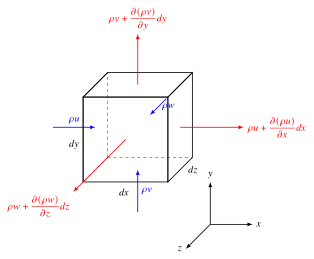
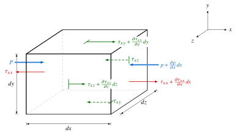
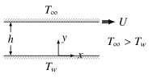



::: {.outcomes}
By the end of this chapter you should be able to:

- derive the continuity equation for a fluid element and write it in conservative and non-conservative form, including the incompressible special case $\del\cdot\vect{q} = 0$;
- derive the momentum equation from Newton's 2nd law, explain the stress notation $\tau_{ij}$ and the Newtonian constitutive relations, and reduce the result to the Navier--Stokes, incompressible Navier--Stokes and Euler equations;
- derive the energy equation from the 1st law of thermodynamics, distinguishing the total-energy and internal-energy forms and the role of the viscous dissipation function $\Phi$;
- simplify the governing equations for a given flow and check whether a proposed velocity or temperature field is an exact solution;
- state appropriate initial and boundary conditions at solid walls, inlets/outlets and fluid--fluid interfaces.
:::

**Differential forms of fluid flow behaviour:** what follows is the derivation of the fundamental conservation (transport) equations associated with the motion of a fluid:

::: {style="text-align: center"}
Continuity, Momentum, Energy
:::

We consider, for simplicity but without loss of generality, the use of a Cartesian coordinate frame of reference with velocity given by $\vect{q}(\vect{x},t)=(u(\vect{x},t), v(\vect{x},t), w(\vect{x},t))$ or $\vect{q}(\vect{x},t) = u(\vect{x},t)\,\uvec{i} + v(\vect{x},t)\,\uvec{j} + w(\vect{x},t)\,\uvec{k}$ with position $\vect{x} = (x,y,z) = x\uvec{i} + y\uvec{j} + z\uvec{k}$. We invoke the Continuum Hypothesis (see [Chapter 1](ch1.qmd#sec-intro)) and assume an infinitesimally small, three-dimensional fluid element of dimensions $dx$, $dy$ and $dz$ and volume $dV = dx\,dy\,dz$ to represent any part of the fluid bulk. We consider also both conservative (or divergence) and non-conservative (or non-divergence) forms of the equations.

## Continuity Equation: Conservation of Mass {#sec-continuity}

Since mass is not created or destroyed, in normal circumstances, mass conservation requires that for any fluid element:

$$
\underbrace{\left[ \begin{gathered} \text{MASS FLOW} \\ \text{OUT OF THE} \\ \text{FLUID ELEMENT} \end{gathered} \right]}_{(A)}
-
\underbrace{\left[ \begin{gathered} \text{MASS FLOW} \\ \text{INTO THE} \\ \text{FLUID ELEMENT} \end{gathered} \right]}_{(B)}
+
\underbrace{\left[ \begin{gathered} \text{RATE OF MASS} \\ \text{ACCUMULATED} \\ \text{IN THE} \\ \text{FLUID ELEMENT} \end{gathered} \right]}_{(C)}
\equiv 0
$$ {#eq-mass-balance}

and schematically is shown in @fig-mass-element.

{#fig-mass-element width=90%}

The fluid element has 6 sides; 3 across which there is an inflow of mass and 3 across which there is an outflow of mass associated with the three coordinate directions. Since $dx, dy$ and $dz$ are small then, considering the $x$-direction as an example, if the inflow of mass (per unit area) into the fluid element is $\rho u$, the outflow can be approximated from the first two terms of a Taylor series expansion, such that the outflow of mass (per unit area) is given by:

$$
\rho u + \frac{\partial (\rho u)}{\partial x}\, dx
$$

i.e. (value of the inflow at the left-hand face) + (gradient of the inflow) $\times$ (the distance over which it acts). We shall use this important approximation many times in the derivations which follow. Considering each of the terms in @eq-mass-balance:

**Terms (A) and (B):**

| Direction | Inflow | Outflow |
|:--|:--|:--|
| $x$-direction | $(\rho u)\,dy\,dz$ | $\left(\rho u + \dfrac{\partial (\rho u)}{\partial x}dx\right)dy\,dz$ |
| $y$-direction | $(\rho v)\,dx\,dz$ | $\left(\rho v + \dfrac{\partial (\rho v)}{\partial y}dy\right)dx\,dz$ |
| $z$-direction | $(\rho w)\,dx\,dy$ | $\left(\rho w + \dfrac{\partial (\rho w)}{\partial z}dz\right)dx\,dy$ |

**Term (C):** the rate at which mass is accumulated in the fluid element is

$$
\frac{\partial}{\partial t}(\rho\, dV) = \frac{\partial \rho}{\partial t}\, dx\,dy\,dz
$$

Inserting the expressions for (A), (B) and (C) into @eq-mass-balance gives:

$$
\begin{aligned}
\frac{\partial \rho}{\partial t}\, dx\,dy\,dz
&+ \bigg[ \left(\rho u + \frac{\partial (\rho u)}{\partial x}dx\right)dy\,dz + \left(\rho v + \frac{\partial (\rho v)}{\partial y}dy\right)dx\,dz \\
&\qquad + \left(\rho w + \frac{\partial (\rho w)}{\partial z}dz\right)dx\,dy \bigg] \\
&- \Big[ (\rho u)\,dy\,dz + (\rho v)\,dx\,dz + (\rho w)\,dx\,dy \Big] = 0
\end{aligned}
$$

i.e.

$$
\left[ \frac{\partial \rho}{\partial t} + \frac{\partial (\rho u)}{\partial x} + \frac{\partial (\rho v)}{\partial y} + \frac{\partial (\rho w)}{\partial z} \right] dx\,dy\,dz \equiv 0
$$

Since by definition $dx\,dy\,dz\neq 0$, we obtain:

::: {.callout-tip icon=false}
## Key result: continuity equation (Cartesian coordinates)

$$
\frac{\partial \rho}{\partial t} + \frac{\partial (\rho u)}{\partial x} + \frac{\partial (\rho v)}{\partial y} + \frac{\partial (\rho w)}{\partial z} = 0
$$ {#eq-continuity-cartesian}
:::

The above continuity equation can be written in more general and compact form using vector notation (see [Chapter 1](ch1.qmd#sec-div-curl)) as:

::: {.callout-tip icon=false}
## Key result: continuity equation, general vector form

$$
\frac{\partial \rho}{\partial t} + \text{div}(\rho \vect{q}) = 0
\qquad\text{or}\qquad
\frac{\partial \rho}{\partial t} + \del \cdot (\rho \vect{q}) = 0
$$ {#eq-continuity}

Note that the continuity equation is a **scalar** equation.
:::

@eq-continuity applies to any unsteady fluid flow, whether compressible or incompressible ($\rho = \text{constant}$) and is valid in any system of curvilinear coordinates. We just need to know the appropriate form for the term $\del \cdot (\rho \vect{q})$. The most commonly encountered alternative to Cartesian coordinates, $\vect{x}=(x,y,z)$, is the cylindrical polar coordinate system, $\vect{r}=(r,\theta,z)$ with $\vect{q} = (u_r(r,\theta,z,t), u_\theta(r,\theta,z,t), u_z(r,\theta,z,t))$. So, with reference to the [Appendix of Chapter 1](ch1.qmd#sec-curvilinear), the general continuity equation, @eq-continuity, in cylindrical polar coordinates is:

$$
\frac{\partial \rho}{\partial t} + \frac{1}{r}\left[\frac{\partial}{\partial r}(r\rho u_r) + \frac{\partial}{\partial \theta}(\rho u_\theta)\right] + \frac{\partial}{\partial z}(\rho u_z) = 0
$$ {#eq-continuity-cylindrical}

or, as it is sometimes written,

$$
\frac{\partial \rho}{\partial t} + \frac{\partial}{\partial r}(\rho u_r) + \frac{1}{r}\frac{\partial}{\partial \theta}(\rho u_\theta) + \frac{\partial}{\partial z}(\rho u_z) + \frac{\rho u_r}{r} = 0
$$

### Special cases {#sec-continuity-special}

**i) Steady compressible flow ($\rho \neq \text{constant}$)**

If the flow is steady, $\partial / \partial t = 0$ and all variables are functions of position only, in which case @eq-continuity, @eq-continuity-cartesian and @eq-continuity-cylindrical reduce to:

$$
\del \cdot (\rho \vect{q}) = 0,
$$

$$
\frac{\partial}{\partial x}(\rho u) + \frac{\partial}{\partial y}(\rho v) + \frac{\partial}{\partial z}(\rho w) = 0,
$$

and

$$
\frac{1}{r}\left[\frac{\partial}{\partial r}(r\rho u_r) + \frac{\partial}{\partial \theta}(\rho u_\theta)\right] + \frac{\partial}{\partial z}(\rho u_z) = 0,
$$

respectively.

**ii) Incompressible flow ($\rho = \text{constant}$)**

The case $\rho = \text{constant}$ results in a great simplification since $\partial \rho / \partial t = 0$ whether the flow is steady or unsteady. In this case @eq-continuity becomes:

$$
\del \cdot (\rho \vect{q}) = 0 \implies \rho\, \del \cdot \vect{q} = 0,
$$

so either $\rho = 0$ or $\del \cdot \vect{q} = 0$. The first of these is nonphysical, so $\del \cdot \vect{q} = 0$ for incompressible flow, in which case @eq-continuity reduces to:

::: {.callout-tip icon=false}
## Key result: incompressible continuity equation

$$
\del \cdot \vect{q} = 0
$$ {#eq-continuity-incompressible}

and therefore @eq-continuity-cartesian and @eq-continuity-cylindrical simplify to:

$$
\frac{\partial u}{\partial x} + \frac{\partial v}{\partial y} + \frac{\partial w}{\partial z} = 0,
\qquad
\frac{1}{r}\left[\frac{\partial}{\partial r}(r u_r) + \frac{\partial u_\theta}{\partial \theta}\right] + \frac{\partial u_z}{\partial z} = 0.
$$
:::

Note that the incompressible continuity equations, @eq-continuity-incompressible, are linear differential equations for which a wide variety of solutions are known; accordingly a great deal of time and effort is spent studying incompressible flows, which is an excellent first approximation since the majority of engineering flows encountered in practice are "approximately" incompressible; the obvious exception is high-speed, highly compressible gas flows. It is generally accepted that provided the Mach number

$$
Ma = \frac{|\vect{q}|}{a} \le 0.3,
$$

where $a$ is the speed of sound, a fluid (gas or liquid) flow can be treated as incompressible to a good approximation.

::: {.callout-note icon=false}
## Worked example 2.1: completing an incompressible velocity field
An incompressible velocity field is given by:
$$
u = a(x^2 - y^2); \quad v \text{ is unknown}; \quad w = b
$$
where $a$ and $b$ are constants. What must the form of the velocity component $v$ be? *Try it before opening the solution.*

```{=html}
<details class="solution"><summary>Show solution</summary>
```

@eq-continuity-incompressible applies, so
$$
\frac{\partial}{\partial x}\left[a(x^2 - y^2)\right] + \frac{\partial v}{\partial y} + \frac{\partial b}{\partial z} = 0,
$$
giving
$$
2ax + \frac{\partial v}{\partial y} = 0 \implies \frac{\partial v}{\partial y} = -2ax
$$
which when integrated partially with respect to $y$ gives
$$
v(x,y,z,t) = -2axy + f(x,z,t).
$$

The above is the only possible form for $v$ which satisfies the incompressible continuity equation. The function of integration, $f(x,z,t)$, is entirely arbitrary since it vanishes when $v$ is differentiated with respect to $y$.

```{=html}
</details>
```
:::

### Non-conservative form of the continuity equation {#sec-continuity-nonconservative}

Returning now to @eq-continuity, by expanding the $\del \cdot (\rho \vect{q})$ term, the equation can be written as:

$$
\frac{\partial \rho}{\partial t} + \rho\, \del \cdot \vect{q} + (\vect{q} \cdot \del)\rho = 0
$$

or, from the definition of the material derivative in [Chapter 1](ch1.qmd#sec-material-derivative), we obtain:

::: {.callout-tip icon=false}
## Key result: continuity equation, non-conservative form

$$
\frac{D\rho}{Dt} + \rho\, \del \cdot \vect{q} = 0,
$$ {#eq-continuity-nonconservative}

which is again a **scalar** equation.
:::

Although @eq-continuity and @eq-continuity-nonconservative are mathematically equivalent, they do not necessarily remain so when written in discrete form in order to obtain a numerical solution using, for example, a finite difference approximation for the derivatives. We shall return to this issue later in the course. For now remember/note that it is only @eq-continuity that is written in what is called **conservative** or **divergence** form. @eq-continuity-nonconservative is written in **non-conservative** or **non-divergence** form.

@eq-continuity is in **conservative** form because the two terms involved mirror exactly the physics:

- $\dfrac{\partial \rho}{\partial t}$ represents the time rate of change of mass per unit volume within the fluid element.
- $\del \cdot (\rho \vect{q})$ represents the flux of mass per unit volume through the sides of the fluid element, i.e. across its bounding surface.

By writing @eq-continuity in the form of @eq-continuity-nonconservative we have broken the link between @eq-mass-balance and the resulting differential equation embodying the same physics on a term-by-term basis. Whether one starts from the **conservative** or **non-conservative** form of the continuity equation is only really an issue if a numerical solution has to be sought. Exactly the same consideration is true in relation to the conservation of momentum and conservation of energy relationships derived subsequently. For this reason it is preferable to start from these equations written in **conservative** form. It is the above conservation equations and other transport equations written in conservative form that are the basis of the many commercially available software tools used on a regular basis in virtually every branch of engineering and associated industries.

::: {.callout-note appearance="simple" icon=false}
## In practice: why CFD codes use the conservative form
Most commercial and open-source CFD codes (finite-volume codes such as ANSYS Fluent or OpenFOAM) integrate the conservative equations over small control volumes ("cells"). The flux of mass, momentum or energy leaving one cell through a shared face is, by construction, exactly the flux entering its neighbour, so the discrete solution conserves these quantities however coarse the mesh. This matters most where the solution changes abruptly, for example across shock waves in compressible flow.
:::

::: {.callout-caution collapse="true" icon=false}
## Check your understanding
1. Which of these two-dimensional velocity fields could describe an incompressible flow? (a) $u = 2x,\ v = -2y$; (b) $u = xy,\ v = xy$.
2. In a *steady* but compressible flow (e.g. gas accelerating through a nozzle), is $\del\cdot\vect{q}$ zero?

*Answers:* (1) (a) yes: $\partial u/\partial x + \partial v/\partial y = 2 - 2 = 0$; (b) no: $y + x \neq 0$ in general. (2) Not in general. Steady flow gives $\del\cdot(\rho\vect{q}) = 0$, i.e. $\rho\,\del\cdot\vect{q} = -(\vect{q}\cdot\del)\rho$, which is non-zero wherever the density changes along the flow (in the nozzle the gas expands as it accelerates).
:::

::: {.try-problems data-sec="sec-continuity"}
**Try these problems:** [Problem 2.1](../problems/index.qmd#p2-1), [Problem 2.2](../problems/index.qmd#p2-2), [Problem 2.3](../problems/index.qmd#p2-3), [Problem 2.4](../problems/index.qmd#p2-4), [Problem 2.5](../problems/index.qmd#p2-5)
:::

## Equations of Motion: Conservation of Momentum {#sec-momentum}

Derivation of the equation of motion for a fluid (liquid and gas) is much more involved than the derivation of the continuity equation. However, we proceed in the same way. We consider the same fluid element to represent the fluid bulk but this time we are interested in all the forces which act upon it. These include:

- body forces, $\vect{F}$, per unit mass (such as gravity);
- pressure force per unit area;
- shear and normal stresses per unit area due to viscosity.

Once all of the above forces have been identified and expressed in the appropriate mathematical form, the next step is to apply Newton's 2nd Law of Motion to the fluid element relating their sum to the rate of change of momentum, i.e. the product of mass and acceleration when the mass does not change. In the following, we discuss each term of the conservation of momentum equation shown in @fig-momentum-diagram.

{#fig-momentum-diagram width=95%}

**Term (A):** the mass of a fluid element of dimensions $dx, dy$ and $dz$ is simply:

$$
dm = \rho\, dV = \rho \, dx\,dy\,dz.
$$

**Term (B):** unlike mass, momentum ($\vect{q}\,dm = \rho \vect{q}\, dV$) is a vector quantity, where $\vect{q}$ is made up of the scalar velocity components $u, v$ and $w$ in the $x, y$ and $z$ coordinate directions, respectively. Accordingly, we need to derive three conservation of momentum equations in total (one for each velocity component). So, for simplicity, we first consider only the $x$-direction and thus the $u$ velocity component. The total acceleration (local plus convective/inertial) in the $x$-direction of motion is given by $Du/Dt$.

**Term (C):** we take the body force per unit mass acting in the $x$-direction to be $F_x$; the total body force per unit mass is $\vect{F} = (F_x, F_y, F_z) = F_x\uvec{i} + F_y\uvec{j} + F_z\uvec{k}$, so the body force on the element in the $x$-direction is $\rho F_x\, dx\,dy\,dz$.

{#fig-momentum-x width=90%}

**Term (D):** the pressure force in the $x$-direction is:

$$
p\,dy\,dz - \left(p + \frac{\partial p}{\partial x}dx\right)dy\,dz = -\frac{\partial p}{\partial x}\,dx\,dy\,dz
$$

The two pressure force terms in the $x$-direction acting on $yz$ planes are shown in @fig-momentum-x.

### Surface stresses and the Newtonian constitutive relations {#sec-stresses}

**Term (E):** while it is a relatively simple matter to find expressions for the body force and pressure forces acting on a fluid element, the opposite is true for the normal and shear stresses. Shear stresses in particular deform the fluid element in the plane containing their line of action and the normal to the face on which they act. This is shown schematically in @fig-stress-notation for a two-dimensional fluid element, which is the same as a three-dimensional fluid element ignoring any such forces in the third direction. The dashed lines indicate the shape due to the stress applied.

{#fig-stress-notation width=90%}

Now, we consider the 3D fluid element shown in @fig-momentum-x, which shows both shear and normal stresses in the $x$-direction. The normal stress is denoted by $\tau_{xx}$. In addition, shear stresses $\tau_{xy}$ and $\tau_{xz}$ act tangentially and tend to deform the fluid element. In the stress notation used in continuum mechanics, the first subscript denotes the direction in which the stress acts, while the second subscript denotes the direction normal to the plane on which it acts. For example, the shear stress $\tau_{xy}$ represents a stress acting in the $x$-direction on a plane whose outward normal is in the $y$-direction. Stress components with identical subscripts correspond to normal stresses; these are also sometimes denoted by the symbol $\sigma$, so that the normal stress acting in the $x$-direction on an $x$-normal plane may be written as $\sigma_{xx}$ in some fluid mechanics textbooks. Expressing $\tau_{xy}, \tau_{yx}$ and $\tau_{xx}$, and the 6 other components associated with the $y$- and $z$-directions, in their most general sense mathematically is a long, complex and protracted exercise; the details of which are omitted and just the necessary expressions quoted subsequently. So the sum of forces due to the **shear and normal stresses** in the $x$-direction is:

$$
\begin{aligned}
&\left(\tau_{xx} + \frac{\partial \tau_{xx}}{\partial x}dx\right)dy\,dz - \tau_{xx}\,dy\,dz \\
+\, &\left(\tau_{xy} + \frac{\partial \tau_{xy}}{\partial y}dy\right)dx\,dz - \tau_{xy}\,dx\,dz \\
+\, &\left(\tau_{xz} + \frac{\partial \tau_{xz}}{\partial z}dz\right)dx\,dy - \tau_{xz}\,dx\,dy \\
=\, &\left(\frac{\partial \tau_{xx}}{\partial x} + \frac{\partial \tau_{xy}}{\partial y} + \frac{\partial \tau_{xz}}{\partial z}\right) dx\,dy\,dz
\end{aligned}
$$

Hence the sum of the forces acting in the $x$-direction, (C) + (D) + (E), is:

$$
\left[ \rho F_x - \frac{\partial p}{\partial x} + \left(\frac{\partial \tau_{xx}}{\partial x} + \frac{\partial \tau_{xy}}{\partial y} + \frac{\partial \tau_{xz}}{\partial z}\right) \right] dx\,dy\,dz
$$

So, applying Newton's 2nd Law in the $x$-direction leads to:

$$
\rho \, dx\,dy\,dz\, \frac{Du}{Dt} = \left[ \rho F_x - \frac{\partial p}{\partial x} + \left(\frac{\partial \tau_{xx}}{\partial x} + \frac{\partial \tau_{xy}}{\partial y} + \frac{\partial \tau_{xz}}{\partial z}\right) \right] dx\,dy\,dz
$$

i.e.

$$
\rho \frac{Du}{Dt} = \rho F_x - \frac{\partial p}{\partial x} + \frac{\partial \tau_{xx}}{\partial x} + \frac{\partial \tau_{xy}}{\partial y} + \frac{\partial \tau_{xz}}{\partial z}
$$ {#eq-momentum-x}

Similarly in the $y$- and $z$-directions:

$$
\begin{aligned}
\rho \frac{Dv}{Dt} &= \rho F_y - \frac{\partial p}{\partial y} + \frac{\partial \tau_{yx}}{\partial x} + \frac{\partial \tau_{yy}}{\partial y} + \frac{\partial \tau_{yz}}{\partial z} \\
\rho \frac{Dw}{Dt} &= \rho F_z - \frac{\partial p}{\partial z} + \frac{\partial \tau_{zx}}{\partial x} + \frac{\partial \tau_{zy}}{\partial y} + \frac{\partial \tau_{zz}}{\partial z}
\end{aligned}
$$ {#eq-momentum-yz}

For a Newtonian fluid, Stokes (1845) derived the following relationships for the shear and normal stresses:

::: {.callout-tip icon=false}
## Definition: Newtonian constitutive relations (Stokes)

$$
\begin{aligned}
\tau_{xx} &= \lambda(\del \cdot \vect{q}) + 2\mu \frac{\partial u}{\partial x}, &\qquad \tau_{xy} &= \tau_{yx} = \mu\left(\frac{\partial v}{\partial x} + \frac{\partial u}{\partial y}\right), \\
\tau_{yy} &= \lambda(\del \cdot \vect{q}) + 2\mu \frac{\partial v}{\partial y}, &\qquad \tau_{xz} &= \tau_{zx} = \mu\left(\frac{\partial w}{\partial x} + \frac{\partial u}{\partial z}\right), \\
\tau_{zz} &= \lambda(\del \cdot \vect{q}) + 2\mu \frac{\partial w}{\partial z}, &\qquad \tau_{yz} &= \tau_{zy} = \mu\left(\frac{\partial v}{\partial z} + \frac{\partial w}{\partial y}\right),
\end{aligned}
$$ {#eq-stokes}

where $\mu$ is the dynamic (molecular) viscosity coefficient and $\lambda$ is a second viscosity coefficient which Stokes hypothesised to be $\lambda = -\frac{2}{3}\mu$, a hypothesis which is still used today.
:::

For simple shear, $u = u(y)$ with $v = w = 0$, these reduce to $\tau_{xy} = \mu\, du/dy$, the [Newtonian relation of Chapter 1](ch1.qmd#sec-shear-stress). Substituting the above expressions into the $x$, $y$ and $z$ conservation of momentum equations gives:

::: {.callout-tip icon=false}
## Key result: conservation of momentum in Cartesian coordinates

$$
\begin{aligned}
\rho \frac{Du}{Dt} &= \rho F_x - \frac{\partial p}{\partial x} + \frac{\partial}{\partial x}\left\{ \mu \left[ 2\frac{\partial u}{\partial x} - \frac{2}{3}(\del \cdot \vect{q}) \right] \right\} \\
&\quad + \frac{\partial}{\partial y}\left[ \mu \left( \frac{\partial u}{\partial y} + \frac{\partial v}{\partial x} \right) \right] + \frac{\partial}{\partial z}\left[ \mu \left( \frac{\partial w}{\partial x} + \frac{\partial u}{\partial z} \right) \right] \\[6pt]
\rho \frac{Dv}{Dt} &= \rho F_y - \frac{\partial p}{\partial y} + \frac{\partial}{\partial y}\left\{ \mu \left[ 2\frac{\partial v}{\partial y} - \frac{2}{3}(\del \cdot \vect{q}) \right] \right\} \\
&\quad + \frac{\partial}{\partial z}\left[ \mu \left( \frac{\partial v}{\partial z} + \frac{\partial w}{\partial y} \right) \right] + \frac{\partial}{\partial x}\left[ \mu \left( \frac{\partial u}{\partial y} + \frac{\partial v}{\partial x} \right) \right] \\[6pt]
\rho \frac{Dw}{Dt} &= \rho F_z - \frac{\partial p}{\partial z} + \frac{\partial}{\partial z}\left\{ \mu \left[ 2\frac{\partial w}{\partial z} - \frac{2}{3}(\del \cdot \vect{q}) \right] \right\} \\
&\quad + \frac{\partial}{\partial x}\left[ \mu \left( \frac{\partial w}{\partial x} + \frac{\partial u}{\partial z} \right) \right] + \frac{\partial}{\partial y}\left[ \mu \left( \frac{\partial v}{\partial z} + \frac{\partial w}{\partial y} \right) \right]
\end{aligned}
$$ {#eq-ns-cartesian}

These are the so-called **Navier--Stokes** equations, written in scalar form in Cartesian coordinates, one for each velocity component.
:::

### Special cases {#sec-ns-special}

**i) Constant viscosity:** if the coefficient of dynamic viscosity is taken to be constant (a Newtonian fluid, see [§1.4 in Chapter 1](ch1.qmd#sec-shear-stress), whose viscosity does not vary through the flow, e.g. because temperature variations are small), @eq-ns-cartesian written in vector form reduces to the following compact form:

::: {.callout-tip icon=false}
## Key result: Navier--Stokes equations for constant viscosity

$$
\rho \frac{D\vect{q}}{Dt} = \rho \vect{F} - \del p + \mu \del^2 \vect{q} + \frac{\mu}{3}\del(\del \cdot \vect{q})
$$ {#eq-ns-vector}
:::

In the above equation $\del^2$ is the Laplacian operator, which in Cartesian coordinates is:

$$
\del^2 = \frac{\partial^2}{\partial x^2} + \frac{\partial^2}{\partial y^2} + \frac{\partial^2}{\partial z^2}
$$

and, acting on a scalar, in cylindrical polar coordinates is:

$$
\del^2 = \frac{\partial^2}{\partial r^2} + \frac{1}{r}\frac{\partial}{\partial r} + \frac{1}{r^2}\frac{\partial^2}{\partial \theta^2} + \frac{\partial^2}{\partial z^2}
$$

(when $\del^2$ acts on the *vector* $\vect{q}$ in cylindrical coordinates, extra terms appear in the $r$- and $\theta$-components because the unit vectors $\uvec{e}_r$ and $\uvec{e}_\theta$ change direction with $\theta$; see @eq-ns-cylindrical below).

Also note from [§1.2 in Chapter 1](ch1.qmd#sec-material-derivative) that in a Cartesian coordinate system the total derivative can be written as

$$
\frac{D}{Dt} = \frac{\partial}{\partial t} + \vect{q} \cdot \del
$$

in each coordinate direction. For cylindrical polar coordinates it has to be modified accordingly in the $\uvec{e}_r, \uvec{e}_\theta$ and $\uvec{e}_z$ directions such that for $\vect{q} = (u_r, u_\theta, u_z)$:

$$
\frac{D\vect{q}}{Dt} = \left(\frac{Du_r}{Dt} - \frac{u_\theta^2}{r}\right)\uvec{e}_r + \left(\frac{Du_\theta}{Dt} + \frac{u_r u_\theta}{r}\right)\uvec{e}_\theta + \frac{Du_z}{Dt}\,\uvec{e}_z
$$ {#eq-cyl-acceleration}

where, acting on each scalar component, $\dfrac{D}{Dt} = \dfrac{\partial}{\partial t} + u_r\dfrac{\partial}{\partial r} + \dfrac{u_\theta}{r}\dfrac{\partial}{\partial \theta} + u_z\dfrac{\partial}{\partial z}$. The extra terms are the centripetal ($-u_\theta^2/r$) and Coriolis-type ($u_r u_\theta/r$) accelerations that arise because $\uvec{e}_r$ and $\uvec{e}_\theta$ rotate as a fluid element moves around the axis.

**ii) Inviscid (non-viscous) flows:** for a fluid which exerts no shearing stresses at all (zero viscosity) @eq-ns-vector reduces to the following simple form:

::: {.callout-tip icon=false}
## Key result: Euler's equation for inviscid flows

$$
\frac{D\vect{q}}{Dt} = \vect{F} - \frac{1}{\rho}\del p
$$ {#eq-euler}
:::

@eq-euler is called Euler's equation and is valid for both incompressible and compressible flows. For incompressible flow the density $\rho$ is a constant while in the case of compressible flow (subsonic, transonic, supersonic, hypersonic) the mass density in general is a function of both pressure and temperature.

**iii) Incompressible flows with constant viscosity:** for incompressible fluids, from conservation of mass (@eq-continuity-incompressible) $\del \cdot \vect{q} = 0$. Therefore, if both the density $\rho$ and viscosity coefficient $\mu$ are constant, @eq-ns-vector reduces to:

::: {.callout-tip icon=false}
## Key result: incompressible Navier--Stokes equations

$$
\frac{D\vect{q}}{Dt} = \vect{F} - \frac{1}{\rho}\del p + \nu \del^2 \vect{q},
$$ {#eq-ns-incompressible}

where $\nu = \mu/\rho$ is the kinematic viscosity.
:::

For reference, in cylindrical polar coordinates the components of @eq-ns-incompressible (multiplied by $\rho$) are:

$$
\begin{aligned}
\rho\left(\frac{Du_r}{Dt} - \frac{u_\theta^2}{r}\right) &= \rho F_r - \frac{\partial p}{\partial r} + \mu \left( \del^2 u_r - \frac{u_r}{r^2} - \frac{2}{r^2}\frac{\partial u_\theta}{\partial \theta} \right) \\
\rho\left(\frac{Du_\theta}{Dt} + \frac{u_r u_\theta}{r}\right) &= \rho F_\theta - \frac{1}{r}\frac{\partial p}{\partial \theta} + \mu \left( \del^2 u_\theta + \frac{2}{r^2}\frac{\partial u_r}{\partial \theta} - \frac{u_\theta}{r^2} \right) \\
\rho \frac{Du_z}{Dt} &= \rho F_z - \frac{\partial p}{\partial z} + \mu \del^2 u_z
\end{aligned}
$$ {#eq-ns-cylindrical}

where $D/Dt$ and $\del^2$ are the scalar operators given above.

@eq-ns-incompressible is the one we shall focus on using in the present course, i.e. flows for which $\rho$ and $\mu$, hence $\nu$, are constant. Each of its terms can be interpreted as follows by considering motion in one direction of a three-dimensional system, for illustrative purposes, namely:

$$
\begin{aligned}
\underbrace{\frac{\partial u}{\partial t}}_{(A)} + \underbrace{\left( u\frac{\partial u}{\partial x} + v\frac{\partial u}{\partial y} + w\frac{\partial u}{\partial z} \right)}_{(B)}
&= \underbrace{F_x}_{(C)} - \underbrace{\frac{1}{\rho}\frac{\partial p}{\partial x}}_{(D)} \\
&\quad + \underbrace{\nu\left(\frac{\partial^2 u}{\partial x^2} + \frac{\partial^2 u}{\partial y^2} + \frac{\partial^2 u}{\partial z^2}\right)}_{(E)}
\end{aligned}
$$ {#eq-ns-incompressible-x}

**(A)**
:   Time-dependent local acceleration (= 0 for steady flow).

**(B)**
:   Convective acceleration terms. They involve the product of velocity and velocity gradients (1st derivatives in space) and represent the importance of the inertial forces in a system.

**(C)**
:   Represents the body force term (the most common being gravity).

**(D)**
:   Represents pressure forces in the fluid; the forces on the fluid are directly proportional to pressure gradients applied to the fluid.

**(E)**
:   Represents viscous forces --- note the 2nd derivatives with respect to space. So, unsteadiness is not required for viscous action to be important but the rate of change of velocity gradient is. This explains why viscosity is important when velocity gradients are high. In order to calculate viscous forces accurately a very accurate solution of the velocity field is required. Looking at @eq-ns-incompressible-x the viscous forces are going to be the most difficult to calculate even though they are linear, compared to the convective transport terms. Pressure and body force terms are much more straightforward.

::: {.callout-note icon=false}
## Worked example 2.2: does a velocity profile satisfy the Navier--Stokes equations?
Consider an incompressible steady flow with constant dynamic viscosity, $\mu$; the velocity components are given by:
$$
u(y) = U\frac{y}{h} + \frac{h^2}{2\mu}\left(-\frac{dp}{dx}\right)\frac{y}{h}\left(1 - \frac{y}{h}\right); \qquad v=w=0.
$$
Ignoring body forces, if $h$, $U$ and $dp/dx$ are all constant, $p=p(x)$, does $u(y)$ satisfy the equations of motion? *Try it before opening the solution.*

```{=html}
<details class="solution"><summary>Show solution</summary>
```

**Known:** flow is steady and incompressible, $\mu$ is constant as are $h$, $U$ and $dp/dx$; $p$ is a function of $x$ only.

**Find:** whether the given $u(y)$ satisfies the equations of motion.

**Diagram:** not necessary for this problem.

**Assumptions:** as given.

**Properties:** not necessary for this problem.

**Analysis:** for the given assumptions (steady, no body force), @eq-ns-incompressible becomes:
$$
(\vect{q} \cdot \del)\vect{q} = -\frac{1}{\rho}\del p + \frac{\mu}{\rho}\del^2 \vect{q}
$$
which in Cartesian coordinates gives:
$$
\begin{aligned}
\cancel{u\frac{\partial u}{\partial x}} + \cancel{v\frac{\partial u}{\partial y}} + \cancel{w\frac{\partial u}{\partial z}} &= -\frac{1}{\rho}\frac{\partial p}{\partial x} + \frac{\mu}{\rho} \left( \cancel{\frac{\partial^2 u}{\partial x^2}} + \frac{\partial^2 u}{\partial y^2} + \cancel{\frac{\partial^2 u}{\partial z^2}} \right) \\
\cancel{u\frac{\partial v}{\partial x}} + \cancel{v\frac{\partial v}{\partial y}} + \cancel{w\frac{\partial v}{\partial z}} &= \cancel{-\frac{1}{\rho}\frac{\partial p}{\partial y}} + \frac{\mu}{\rho} \left( \cancel{\frac{\partial^2 v}{\partial x^2}} + \cancel{\frac{\partial^2 v}{\partial y^2}} + \cancel{\frac{\partial^2 v}{\partial z^2}} \right) \\
\cancel{u\frac{\partial w}{\partial x}} + \cancel{v\frac{\partial w}{\partial y}} + \cancel{w\frac{\partial w}{\partial z}} &= \cancel{-\frac{1}{\rho}\frac{\partial p}{\partial z}} + \frac{\mu}{\rho} \left( \cancel{\frac{\partial^2 w}{\partial x^2}} + \cancel{\frac{\partial^2 w}{\partial y^2}} + \cancel{\frac{\partial^2 w}{\partial z^2}} \right)
\end{aligned}
$$

All the terms crossed out are zero because $u=u(y)$ only, $v$ and $w$ are zero and $p=p(x)$ only. All we are left with is:
$$
0 = -\frac{1}{\rho}\frac{dp}{dx} + \frac{\mu}{\rho}\frac{d^2 u}{dy^2}
\quad\Longleftrightarrow\quad
\frac{dp}{dx} = \mu\frac{d^2u}{dy^2}
$$

For the given $u(y)$,
$$
\frac{du}{dy} = \frac{U}{h} + \frac{h^2}{2\mu}\left(-\frac{dp}{dx}\right)\left(\frac{1}{h} - \frac{2y}{h^2}\right)
$$
so
$$
\begin{aligned}
\mu\frac{d^2u}{dy^2} &= \mu \frac{d}{dy}\left[ \frac{U}{h} + \frac{h^2}{2\mu}\left(-\frac{dp}{dx}\right)\left(\frac{1}{h} - \frac{2y}{h^2}\right) \right] \\
&= \mu \left[ \frac{h^2}{2\mu}\left(-\frac{dp}{dx}\right)\left(\frac{-2}{h^2}\right) \right] = \frac{dp}{dx}
\end{aligned}
$$

Q.E.D.

**Comment:** the given velocity distribution satisfies the equations of motion. (It also satisfies continuity, since $\partial u/\partial x = 0$, and the boundary conditions $u = 0$ at $y = 0$ and $u = U$ at $y = h$: it is the Couette--Poiseuille flow you will meet in the workshops.)

```{=html}
</details>
```
:::

::: {.callout-caution collapse="true" icon=false}
## Check your understanding
1. Euler's equation, @eq-euler, can enforce "no flow through a wall" but not "no slip at a wall". Why?
2. In Worked example 2.2, which physical terms survive, and what balance do they express?

*Answers:* (1) Dropping the viscous term removes the highest (second) spatial derivatives, so the equation can no longer accept as many boundary conditions; only the normal-velocity condition can be imposed. Reconciling inviscid flow with no slip is the job of the boundary layer ([Chapter 4](ch4.qmd)). (2) Only the pressure-gradient and viscous terms: the net pressure force on each element is balanced exactly by the net viscous force, with no acceleration.
:::

### Momentum equation in conservative form {#sec-momentum-conservative}

Unlike when we derived the continuity equation, @eq-continuity, and the result was a transport equation in **conservative** form, @eq-ns-cartesian and its special case @eq-ns-incompressible are in **non-conservative** form. We can, however, obtain the conservative form as follows. First, we write $\rho\, Du/Dt$ as

$$
\begin{aligned}
\rho \frac{Du}{Dt} &= \frac{D(\rho u)}{Dt} - u\frac{D\rho}{Dt} = \frac{D(\rho u)}{Dt} - u\left( \frac{\partial \rho}{\partial t} + (\vect{q} \cdot \del)\rho \right) \\
&= \frac{D(\rho u)}{Dt} - u\left( \frac{\partial \rho}{\partial t} + \del \cdot (\rho \vect{q}) - \rho(\del \cdot \vect{q}) \right) \\
&= \frac{D(\rho u)}{Dt} - u\Bigg( \underbrace{\left[\frac{\partial \rho}{\partial t} + \del \cdot (\rho \vect{q})\right]}_{=\,0 \text{ by continuity}} - \rho(\del \cdot \vect{q}) \Bigg) \\
&= \frac{\partial (\rho u)}{\partial t} + (\vect{q} \cdot \del)(\rho u) + \rho u (\del \cdot \vect{q}) \\
&= \frac{\partial (\rho u)}{\partial t} + \del \cdot (\rho u \vect{q})
\end{aligned}
$$ {#eq-mom-conservative-lhs}

where the continuity equation, @eq-continuity, was used in the third line. Similar equations to @eq-mom-conservative-lhs can also be obtained for the $y$- and $z$-directions. Inserting these results into @eq-ns-incompressible (multiplied by $\rho$) results in the Navier--Stokes equations for viscous incompressible flow (constant $\mu$) written in **divergence** or **conservative** form:

$$
\begin{aligned}
\frac{\partial (\rho u)}{\partial t} + \del \cdot (\rho u \vect{q}) &= \rho F_x - \frac{\partial p}{\partial x} + \mu \del^2 u \\
\frac{\partial (\rho v)}{\partial t} + \del \cdot (\rho v \vect{q}) &= \rho F_y - \frac{\partial p}{\partial y} + \mu \del^2 v \\
\frac{\partial (\rho w)}{\partial t} + \del \cdot (\rho w \vect{q}) &= \rho F_z - \frac{\partial p}{\partial z} + \mu \del^2 w
\end{aligned}
$$ {#eq-ns-conservative-components}

which are often written in compact vector form as:

::: {.callout-tip icon=false}
## Key result: conservative momentum equation (incompressible, constant $\mu$)

$$
\frac{\partial (\rho \vect{q})}{\partial t} + \del \cdot (\rho \vect{q}\vect{q}) = \rho \vect{F} - \del p + \mu \del^2 \vect{q}
$$ {#eq-ns-conservative}
:::

Because @eq-mom-conservative-lhs uses only the general continuity equation, the same conservative left-hand side may equally be combined with the general (compressible, variable-$\mu$) right-hand sides of @eq-ns-cartesian; this is the form quoted in the [summary](#sec-summary). As for the continuity equation, the above vector forms of the equation of motion are valid in any curvilinear coordinate system.

::: {.try-problems data-sec="sec-momentum"}
**Try these problems:** [Problem 2.6](../problems/index.qmd#p2-6), [Problem 2.7](../problems/index.qmd#p2-7), [Problem 2.8](../problems/index.qmd#p2-8), [Problem 2.9](../problems/index.qmd#p2-9), [Problem 2.10](../problems/index.qmd#p2-10), [Problem 2.11](../problems/index.qmd#p2-11), [Problem 2.12](../problems/index.qmd#p2-12), [Problem 2.16](../problems/index.qmd#p2-16), [Problem R.1](../problems/index.qmd#pR-1)
:::

## Conservation of Energy {#sec-energy}

In line with the derivation of the continuity and momentum conservation equations, we consider the conservation of energy for an infinitesimally small fluid element moving with the flow. This is shown schematically in @fig-energy-diagram in terms of the **1st Law of Thermodynamics**.

The energy balance and surface forces acting on a differential fluid element are also illustrated in @fig-energy-element. For the sake of clarity and to avoid cluttering the figure, the schematic shows forces acting in the $x$-direction only, which arise from pressure, $p$, as well as viscous shear and normal stresses, $\tau$. It further depicts the total energy (the sum of internal and kinetic energy), $\rho E$ per unit volume, as it enters and leaves the fluid element in the $x$-direction, represented by $u(\rho E)$ and $u(\rho E) + \frac{\partial}{\partial x}(u \rho E)dx$, respectively. Additionally, the figure accounts for the heat transferred due to temperature gradients in the $x$-direction per unit time per unit area, entering as $q_x$ and exiting as $q_x + \frac{\partial q_x}{\partial x}dx$. (The convective fluxes $u\rho E$ are what an observer sees for an element fixed in space: summed over all faces they give $\del\cdot(\rho E\vect{q})$, which together with $\partial(\rho E)/\partial t$ is exactly the conservative left-hand side derived below. For the element moving with the flow used in the derivation, they are accounted for by the material derivative $\rho\, DE/Dt$.)

In the following, we elaborate the terms in the energy equation as categorised in @fig-energy-diagram.

{#fig-energy-diagram width=85%}

{#fig-energy-element width=95%}

**Term (A):** the fluid element has two contributions to its energy:

- internal energy due to random molecular motion, denoted by $e$ (per unit mass);
- kinetic energy due to translational motion; the kinetic energy per unit mass being $|\vect{q}|^2/2$.

These comprise the total energy per unit mass, $E = e + |\vect{q}|^2/2$. So, the time rate of change of the total energy of the element is given by the total derivative, namely:

$$
\rho \frac{DE}{Dt}\, dx\,dy\,dz
$$

**Term (B):** we now turn our attention to the net flux of heat into the fluid element. It is comprised of volumetric heating from a source (exothermic or endothermic) together with heat transfer across the surfaces due to temperature gradients, i.e. thermal conduction. Heat transfer in a given direction, when expressed in dimensions of energy per unit time per unit area perpendicular to the direction of transfer, is called the **heat flux** in that direction: $q_x$ is therefore the heat flux in the $x$-direction; similarly for $q_y$ and $q_z$ in the $y$- and $z$-directions, respectively. Defining $\dot{Q}$ as the rate of volumetric heating per unit mass, the volumetric heating experienced by the fluid element is given by $\rho \dot{Q}\, dx\,dy\,dz$. The heat transferred in the $x$-direction into the fluid element by thermal conduction is:

$$
\left[q_x - \left(q_x + \frac{\partial q_x}{\partial x}dx\right)\right]dy\,dz = -\frac{\partial q_x}{\partial x}\,dx\,dy\,dz
$$

Similar expressions exist for the $y$- and $z$-directions, leading to the heating of the fluid by thermal conduction being given by:

$$
-\left( \frac{\partial q_x}{\partial x} + \frac{\partial q_y}{\partial y} + \frac{\partial q_z}{\partial z} \right) dx\,dy\,dz
$$

Accordingly, **term (B)** is given by:

$$
\left[ \rho \dot{Q} - \left( \frac{\partial q_x}{\partial x} + \frac{\partial q_y}{\partial y} + \frac{\partial q_z}{\partial z} \right) \right] dx\,dy\,dz
$$

Note that, making use of **Fourier's law**, we can write the heat fluxes in the above expression as:

$$
q_x = -k\frac{\partial T}{\partial x}, \quad q_y = -k\frac{\partial T}{\partial y}, \quad q_z = -k\frac{\partial T}{\partial z},
$$ {#eq-fourier}

i.e. the heat-flux vector $(q_x, q_y, q_z) = -k\,\del T$, where $k$ is the thermal conductivity (not necessarily constant). The negative sign indicates that heat flows down a temperature gradient (from hot to cold). Therefore, the above expression for **term (B)** becomes:

$$
\left[ \rho \dot{Q} + \frac{\partial}{\partial x}\left(k\frac{\partial T}{\partial x}\right) + \frac{\partial}{\partial y}\left(k\frac{\partial T}{\partial y}\right) + \frac{\partial}{\partial z}\left(k\frac{\partial T}{\partial z}\right) \right] dx\,dy\,dz
$$

**Terms (C)--(E):** the fact that we have already derived the conservation of momentum equation, which involves the same forces, makes our task easier. To appreciate this consider the simpler related problem of a particle in motion, the motion produced by a force $\vect{F}$ acting upon it. If the particle is at position $\vect{r}$ at time $t$ and at position $\vect{r} + d\vect{r}$ a small time $dt$ later, having been displaced through $d\vect{r}$, then by definition the **work done** on the particle in time $dt$ is equal to $\vect{F} \cdot d\vect{r}$. Hence the time rate of doing work on the particle is simply:

$$
\vect{F} \cdot \frac{d\vect{r}}{dt} = \vect{F} \cdot \vect{q}, \quad \text{where } \vect{q} = \frac{d\vect{r}}{dt} \text{ is the velocity.}
$$

What the above tells us is that the rate of doing work by a force exerted on a moving body is equal to the product of the force and the component of velocity in the direction of the force.

So in **term (C)**, for our fluid element, $dV = dx\,dy\,dz$, the rate at which work is done by the body force, $\vect{F} = (F_x, F_y, F_z)$ per unit mass, if the element is moving with velocity $\vect{q}$, is $\rho (\vect{F} \cdot \vect{q})\, dx\,dy\,dz$. With regard to **terms (D)** and **(E)**, the surface forces (pressure plus shear and normal stresses), consider just the forces in the $x$-direction as we did when deriving the conservation of momentum equation. The rate of work done on the moving fluid element by the pressure, shear and normal stresses in the $x$-direction is just the $x$-component of velocity, $u$, multiplied by the forces, and equals:

$$
\left[ -\frac{\partial (up)}{\partial x} + \frac{\partial}{\partial x}(u\tau_{xx}) + \frac{\partial}{\partial y}(u\tau_{xy}) + \frac{\partial}{\partial z}(u\tau_{xz}) \right] dx\,dy\,dz
$$

where forces in the +ve $x$-direction do +ve work and those in the −ve $x$-direction do −ve work.

Similarly, in the $y$- and $z$-directions:

$$
\left[ -\frac{\partial}{\partial y}(vp) + \frac{\partial}{\partial x}(v\tau_{yx}) + \frac{\partial}{\partial y}(v\tau_{yy}) + \frac{\partial}{\partial z}(v\tau_{yz}) \right] dx\,dy\,dz,
$$

and

$$
\left[ -\frac{\partial}{\partial z}(wp) + \frac{\partial}{\partial x}(w\tau_{zx}) + \frac{\partial}{\partial y}(w\tau_{zy}) + \frac{\partial}{\partial z}(w\tau_{zz}) \right] dx\,dy\,dz,
$$

respectively. So, the total net rate of work done on the fluid element is the sum of the surface contributions in the $x$-, $y$- and $z$-directions as well as the body force contribution, namely:

$$
\begin{aligned}
\rho(\vect{F} \cdot \vect{q})\,dx\,dy\,dz + \Bigg[ &\underbrace{-\left(\frac{\partial (up)}{\partial x} + \frac{\partial (vp)}{\partial y} + \frac{\partial (wp)}{\partial z}\right)}_{-\del \cdot (p\vect{q}) \text{ in vector notation}} \\
&+ \frac{\partial}{\partial x}(u\tau_{xx}) + \frac{\partial}{\partial y}(u\tau_{xy}) + \frac{\partial}{\partial z}(u\tau_{xz}) \\
&+ \frac{\partial}{\partial x}(v\tau_{yx}) + \frac{\partial}{\partial y}(v\tau_{yy}) + \frac{\partial}{\partial z}(v\tau_{yz}) \\
&+ \frac{\partial}{\partial x}(w\tau_{zx}) + \frac{\partial}{\partial y}(w\tau_{zy}) + \frac{\partial}{\partial z}(w\tau_{zz}) \Bigg] dx\,dy\,dz
\end{aligned}
$$

We now have all the necessary expressions for (A), (B), (C), (D) and (E). Therefore, the complete form of the energy equation can be written as:

$$
\begin{aligned}
\rho \frac{DE}{Dt} = \rho \dot{Q} &+ \underbrace{\frac{\partial}{\partial x}\left(k\frac{\partial T}{\partial x}\right) + \frac{\partial}{\partial y}\left(k\frac{\partial T}{\partial y}\right) + \frac{\partial}{\partial z}\left(k\frac{\partial T}{\partial z}\right)}_{\del \cdot (k \del T) \text{ in vector notation}} \\
&+ \rho \vect{F} \cdot \vect{q} - \del \cdot (p\vect{q}) \\
&+ \frac{\partial}{\partial x}(u\tau_{xx}) + \frac{\partial}{\partial y}(u\tau_{xy}) + \frac{\partial}{\partial z}(u\tau_{xz}) \\
&+ \frac{\partial}{\partial x}(v\tau_{yx}) + \frac{\partial}{\partial y}(v\tau_{yy}) + \frac{\partial}{\partial z}(v\tau_{yz}) \\
&+ \frac{\partial}{\partial x}(w\tau_{zx}) + \frac{\partial}{\partial y}(w\tau_{zy}) + \frac{\partial}{\partial z}(w\tau_{zz})
\end{aligned}
$$ {#eq-energy-expanded}

It is common to represent the nine terms in the last three lines as a single collective term, here denoted by $W_\tau$: the **rate of work done by the viscous (shear and normal) stresses** per unit volume,

$$
\begin{aligned}
W_\tau = \frac{\partial}{\partial x}\left(u\tau_{xx} + v\tau_{yx} + w\tau_{zx}\right) &+ \frac{\partial}{\partial y}\left(u\tau_{xy} + v\tau_{yy} + w\tau_{zy}\right) \\
&+ \frac{\partial}{\partial z}\left(u\tau_{xz} + v\tau_{yz} + w\tau_{zz}\right).
\end{aligned}
$$ {#eq-viscous-work}

::: {.callout-important icon=false}
## Note: $W_\tau$ is not the viscous dissipation function
Only part of $W_\tau$ is "lost". The part $u\left(\frac{\partial \tau_{xx}}{\partial x} + \frac{\partial \tau_{xy}}{\partial y} + \frac{\partial \tau_{xz}}{\partial z}\right) + \dots$ (velocity times net viscous force) changes the kinetic energy of the element, exactly as in the momentum equation. The remainder, the **viscous dissipation function** $\Phi$, is irreversibly converted into internal energy (heat). The split is made explicit in @sec-energy-internal, where $\Phi$ is defined in @eq-dissipation.
:::

Accordingly, in shorthand notation, the above becomes:

::: {.callout-tip icon=false}
## Key result: energy equation in non-conservative form

$$
\rho \frac{DE}{Dt} = \rho \dot{Q} + \del \cdot (k \del T) + \rho \vect{F} \cdot \vect{q} - \del \cdot (p \vect{q}) + W_\tau,
$$ {#eq-energy-E}

which is a **scalar** equation, written in non-conservative form.
:::

@eq-energy-E is the energy equation in non-conservative form, written in terms of the total energy $E$. Once again, as for the conservation of momentum equation, the non-conservative nature results from the application of the fundamental physical principle to a moving fluid element. The **conservative** form is easily obtained by reformulating the left-hand side of @eq-energy-E, namely:

$$
\begin{aligned}
\rho \frac{DE}{Dt} &= \frac{D}{Dt}(\rho E) - E\frac{D\rho}{Dt} \\
&= \frac{\partial (\rho E)}{\partial t} + \vect{q} \cdot \del (\rho E) - E\left( \frac{\partial \rho}{\partial t} + \vect{q} \cdot \del \rho \right) \\
&= \frac{\partial}{\partial t}(\rho E) + \del \cdot (\rho E \vect{q}) - \cancel{\rho E(\del \cdot \vect{q})} - E\Bigg( \underbrace{\frac{\partial \rho}{\partial t} + \del \cdot (\rho \vect{q})}_{=\,0 \text{ by continuity}} - \cancel{\rho\, \del \cdot \vect{q}} \Bigg) \\
\implies \rho \frac{DE}{Dt} &= \frac{\partial}{\partial t}(\rho E) + \del \cdot (\rho E \vect{q})
\end{aligned}
$$

(the two cancelled terms, $-\rho E\,\del\cdot\vect{q}$ and $+E\rho\,\del\cdot\vect{q}$, sum to zero), and so @eq-energy-E becomes:

::: {.callout-tip icon=false}
## Key result: conservative energy equation

$$
\frac{\partial}{\partial t}(\rho E) + \del \cdot (\rho E \vect{q}) = \rho \dot{Q} + \del \cdot (k \del T) + \rho \vect{F} \cdot \vect{q} - \del \cdot (p \vect{q}) + W_\tau
$$ {#eq-energy-E-conservative}
:::

### Energy equation in terms of the internal energy {#sec-energy-internal}

@eq-energy-E and @eq-energy-E-conservative are just one of many different forms of the energy equation; here $E = e + |\vect{q}|^2/2$, on which the left-hand side of the equation is based. It can be expressed alternatively in terms of just the internal energy, $e$, the static enthalpy, $h$, or the total enthalpy, $H_0 = h + |\vect{q}|^2/2$. Note that in each case the right-hand side of the equation also changes; for each of the different forms there are both conservative and non-conservative forms. Expressing the conservation of energy equation in terms of enthalpy is useful when dealing with fluid flows involving combustion processes, which are not considered in the present course. Accordingly, below we look at just one alternative form of the energy conservation equation, that for the internal energy, $e$. Starting with @eq-energy-E written in the expanded form of @eq-energy-expanded, we first cast it in the form dealing with $e$ only. To achieve this we multiply the equations for $Du/Dt$, $Dv/Dt$ and $Dw/Dt$ given in @eq-momentum-x and @eq-momentum-yz by $u$, $v$ and $w$, respectively, giving:

$$
\begin{aligned}
\rho \frac{D(u^2/2)}{Dt} &= \rho u F_x - u\frac{\partial p}{\partial x} + u\left(\frac{\partial \tau_{xx}}{\partial x} + \frac{\partial \tau_{xy}}{\partial y} + \frac{\partial \tau_{xz}}{\partial z}\right) \\
\rho \frac{D(v^2/2)}{Dt} &= \rho v F_y - v\frac{\partial p}{\partial y} + v\left(\frac{\partial \tau_{yx}}{\partial x} + \frac{\partial \tau_{yy}}{\partial y} + \frac{\partial \tau_{yz}}{\partial z}\right) \\
\rho \frac{D(w^2/2)}{Dt} &= \rho w F_z - w\frac{\partial p}{\partial z} + w\left(\frac{\partial \tau_{zx}}{\partial x} + \frac{\partial \tau_{zy}}{\partial y} + \frac{\partial \tau_{zz}}{\partial z}\right)
\end{aligned}
$$

We now add these three expressions together, noting that $u^2 + v^2 + w^2 = |\vect{q}|^2$, and so we get:

$$
\begin{aligned}
\rho \frac{D(|\vect{q}|^2/2)}{Dt} &= -\left( u\frac{\partial p}{\partial x} + v\frac{\partial p}{\partial y} + w\frac{\partial p}{\partial z} \right) \\
&\quad + u\left(\frac{\partial \tau_{xx}}{\partial x} + \frac{\partial \tau_{xy}}{\partial y} + \frac{\partial \tau_{xz}}{\partial z}\right) \\
&\quad + v\left(\frac{\partial \tau_{yx}}{\partial x} + \frac{\partial \tau_{yy}}{\partial y} + \frac{\partial \tau_{yz}}{\partial z}\right) \\
&\quad + w\left(\frac{\partial \tau_{zx}}{\partial x} + \frac{\partial \tau_{zy}}{\partial y} + \frac{\partial \tau_{zz}}{\partial z}\right) \\
&\quad + \underbrace{\rho(uF_x + vF_y + wF_z)}_{\rho \vect{F} \cdot \vect{q}}
\end{aligned}
$$

This is the **mechanical energy** equation: it contains no new physics, being simply the momentum equation dotted with $\vect{q}$. Subtracting it from @eq-energy-expanded, and using $\frac{\partial}{\partial x}(u\tau_{xx}) - u\frac{\partial \tau_{xx}}{\partial x} = \tau_{xx}\frac{\partial u}{\partial x}$ etc. and $-\del\cdot(p\vect{q}) + \vect{q}\cdot\del p = -p\,\del\cdot\vect{q}$, gives:

$$
\begin{aligned}
\rho \frac{De}{Dt} &= \rho \dot{Q} + \del \cdot (k \del T) - \underbrace{p\left(\frac{\partial u}{\partial x} + \frac{\partial v}{\partial y} + \frac{\partial w}{\partial z}\right)}_{p\,\del\cdot \vect{q}} \\
&\quad + \tau_{xx}\frac{\partial u}{\partial x} + \tau_{xy}\frac{\partial u}{\partial y} + \tau_{xz}\frac{\partial u}{\partial z} \\
&\quad + \tau_{yx}\frac{\partial v}{\partial x} + \tau_{yy}\frac{\partial v}{\partial y} + \tau_{yz}\frac{\partial v}{\partial z} \\
&\quad + \tau_{zx}\frac{\partial w}{\partial x} + \tau_{zy}\frac{\partial w}{\partial y} + \tau_{zz}\frac{\partial w}{\partial z}
\end{aligned}
$$ {#eq-energy-e-stress}

We see that for the energy equation written in this form the kinetic energy terms have dropped out and, more importantly, it does not explicitly contain the body force. Note also that compared to @eq-energy-expanded, where the shear and normal stresses multiplied by velocities appeared inside the $x$, $y$ and $z$ derivatives, in @eq-energy-e-stress they appear by themselves multiplied by velocity gradients. Also, it is worth noting that, as is the case for @eq-energy-E, it is in non-conservative form. We can go further in reducing the above expression by making use of the fact that $\tau_{xy} = \tau_{yx}$, $\tau_{xz} = \tau_{zx}$ and $\tau_{yz} = \tau_{zy}$ (see @eq-stokes). Symmetry between the shear stresses is necessary to keep the angular acceleration of a fluid element from going to infinity as $dx, dy$ and $dz \to 0$ (the net torque on the element scales with its volume times its size, whereas its moment of inertia scales with its volume times its size squared). In which case we get:

$$
\begin{aligned}
\rho \frac{De}{Dt} &= \rho \dot{Q} + \del \cdot (k \del T) - p\, \del \cdot \vect{q} + \tau_{xx}\frac{\partial u}{\partial x} + \tau_{yy}\frac{\partial v}{\partial y} + \tau_{zz}\frac{\partial w}{\partial z} \\
&\quad + \tau_{xy}\left(\frac{\partial u}{\partial y} + \frac{\partial v}{\partial x}\right) + \tau_{xz}\left(\frac{\partial u}{\partial z} + \frac{\partial w}{\partial x}\right) + \tau_{yz}\left(\frac{\partial v}{\partial z} + \frac{\partial w}{\partial y}\right).
\end{aligned}
$$

Going further still, we can use @eq-stokes for the shear and normal stresses to write:

$$
\begin{aligned}
\rho \frac{De}{Dt} &= \rho \dot{Q} + \del \cdot (k \del T) - p\, \del \cdot \vect{q} + \underbrace{\lambda \left(\frac{\partial u}{\partial x} + \frac{\partial v}{\partial y} + \frac{\partial w}{\partial z}\right)^2}_{\lambda (\del \cdot \vect{q})^2} \\
&\quad + \mu \left[ 2\left(\frac{\partial u}{\partial x}\right)^2 + 2\left(\frac{\partial v}{\partial y}\right)^2 + 2\left(\frac{\partial w}{\partial z}\right)^2 \right. \\
&\qquad\quad \left. + \left(\frac{\partial u}{\partial y} + \frac{\partial v}{\partial x}\right)^2 + \left(\frac{\partial u}{\partial z} + \frac{\partial w}{\partial x}\right)^2 + \left(\frac{\partial v}{\partial z} + \frac{\partial w}{\partial y}\right)^2 \right]
\end{aligned}
$$

or

::: {.callout-tip icon=false}
## Key result: energy equation in terms of internal energy $e$

$$
\rho \frac{De}{Dt} = \rho \dot{Q} + \del \cdot (k \del T) - p\, \del \cdot \vect{q} + \Phi,
$$ {#eq-energy-e}

where $\Phi$ is the **viscous dissipation function**:

$$
\begin{aligned}
\Phi = \lambda (\del \cdot \vect{q})^2 &+ \mu \left[ 2\left(\frac{\partial u}{\partial x}\right)^2 + 2\left(\frac{\partial v}{\partial y}\right)^2 + 2\left(\frac{\partial w}{\partial z}\right)^2 \right. \\
&\left. + \left(\frac{\partial u}{\partial y} + \frac{\partial v}{\partial x}\right)^2 + \left(\frac{\partial u}{\partial z} + \frac{\partial w}{\partial x}\right)^2 + \left(\frac{\partial v}{\partial z} + \frac{\partial w}{\partial y}\right)^2 \right]
\end{aligned}
$$ {#eq-dissipation}
:::

The conservative-form equivalent of @eq-energy-e is:

$$
\frac{\partial (\rho e)}{\partial t} + \del \cdot (\rho e \vect{q}) = \rho \dot{Q} + \del \cdot (k \del T) - p\, \del \cdot \vect{q} + \Phi
$$ {#eq-energy-e-conservative}

For the special case of incompressible flow, $\rho = \text{constant}$ and $\del \cdot \vect{q} = 0$. @eq-energy-e and @eq-energy-e-conservative simplify further since the term $\lambda (\del \cdot \vect{q})^2$ in $\Phi$ and the term $p\, \del \cdot \vect{q}$ are both zero. (With $\lambda = -\frac{2}{3}\mu$ one can show that $\Phi \ge 0$ always: viscous dissipation can only turn mechanical energy into heat, never the reverse.)

::: {.callout-note icon=false}
## Worked example 2.3: Couette flow with heat transfer
Consider the case of simple shear flow in the small fixed gap, $h$, between two horizontally aligned flat plates; the lower one is stationary and the upper one moving with a constant speed $U$ (@fig-couette-heat). The temperature of the stationary plate is a constant, $T_w$, while that of the moving plate is a constant, $T_\infty$. The dynamic viscosity, $\mu$, and thermal conductivity, $k$, of the fluid in the gap are constant.

The velocity and temperature distributions are given by:
$$
u = \frac{U y}{h}; \quad v=0; \quad w=0; \quad p = \text{constant}
$$
$$
\frac{T - T_w}{T_\infty - T_w} = \frac{y}{h} + \frac{\mu U^2}{2k(T_\infty - T_w)}\left(\frac{y}{h}\right)\left(1 - \frac{y}{h}\right)
$$ {#eq-couette-temperature}

Verify that the above are solutions of the energy equation. *Try it before opening the solution.*

{#fig-couette-heat width=42%}

```{=html}
<details class="solution"><summary>Show solution</summary>
```

**Known:** fluid and geometric properties; both $u$ and $T$ are functions of $y$ only.

**Find:** verify that $u(y)$ and $T(y)$ satisfy the energy (temperature) equation.

**Diagram:** see @fig-couette-heat.

**Assumptions:** flow is incompressible and steady, and $e = C_v T$ with $C_v$ constant.

**Properties:** not necessary for this problem.

**Analysis:** begin with the form of the energy equation given by @eq-energy-e:
$$
\rho\left[\frac{\partial e}{\partial t} + (\vect{q} \cdot \del)e\right] = \rho \dot{Q} + \del \cdot (k \del T) - p\, \del \cdot \vect{q} + \Phi
$$

Considering each term in the equation:

1. $\dfrac{\partial e}{\partial t} = 0$ since the flow is steady.
2. $(\vect{q} \cdot \del)e = C_v \left( u\dfrac{\partial T}{\partial x} + v\dfrac{\partial T}{\partial y} + w\dfrac{\partial T}{\partial z} \right) = 0$ (since $v=w=0$ and $T$ is a function of $y$ only: $u \neq 0$ but $\partial T/\partial x = 0$).
3. $\rho \dot{Q} = 0$ since no rate of volumetric heating is specified.
4. $\del \cdot (k \del T) = k \del^2 T$ since $k = \text{constant}$, and
   $$
   k \del^2 T = k \left( \frac{\partial^2 T}{\partial x^2} + \frac{\partial^2 T}{\partial y^2} + \frac{\partial^2 T}{\partial z^2} \right) = k \frac{d^2 T}{dy^2}
   $$
5. $-p\, \del \cdot \vect{q} = 0$ since the flow is incompressible.
6. Dissipation function $\Phi$, @eq-dissipation (with $\del\cdot\vect{q} = 0$):
   $$
   \begin{aligned}
   \Phi &= \mu \left[ 2\left(\frac{\partial u}{\partial x}\right)^2 + 2\left(\frac{\partial v}{\partial y}\right)^2 + 2\left(\frac{\partial w}{\partial z}\right)^2 + \left(\frac{\partial u}{\partial y} + \frac{\partial v}{\partial x}\right)^2 + \dots \right] \\
   &= \mu \left(\frac{du}{dy}\right)^2 \quad (\text{the only non-zero term})
   \end{aligned}
   $$

We are left with:
$$
0 = k \frac{d^2 T}{dy^2} + \mu \left(\frac{du}{dy}\right)^2 \implies k \frac{d^2 T}{dy^2} = -\mu \left(\frac{du}{dy}\right)^2 \qquad (*)
$$

From the velocity profile: $\dfrac{du}{dy} = \dfrac{U}{h}$.

From the temperature profile:
$$
\frac{dT}{dy} = \frac{T_\infty - T_w}{h} + \frac{\mu U^2}{2k}\left( \frac{1}{h} - \frac{2y}{h^2} \right),
\qquad
\frac{d^2 T}{dy^2} = \frac{\mu U^2}{2k}\left(-\frac{2}{h^2}\right) = -\frac{\mu U^2}{k h^2}
$$

Substituting into (*):
$$
k \left[ -\frac{\mu U^2}{k h^2} \right] = -\mu\left(\frac{U}{h}\right)^2 \quad \checkmark
$$

Q.E.D.

**Comment:** the given velocity and temperature distributions satisfy the energy equation. They also satisfy the boundary conditions: at $y = 0$, $u = 0$ and $T = T_w$; at $y = h$, $u = U$ and $T = T_\infty$.

```{=html}
</details>
```
:::

**Interpreting the result.** Writing $\eta = y/h$ and $\theta = (T - T_w)/(T_\infty - T_w)$, @eq-couette-temperature becomes

$$
\theta = \eta + \frac{Br}{2}\,\eta(1 - \eta), \qquad Br = \frac{\mu U^2}{k\,(T_\infty - T_w)},
$$ {#eq-brinkman}

where the **Brinkman number** $Br$ compares the heat generated by viscous dissipation with the heat conducted across the gap by the imposed temperature difference. For $Br = 0$ the profile is the linear conduction profile; viscous heating adds a parabolic "bulge". Setting $d\theta/d\eta = 0$ shows that the maximum temperature lies inside the fluid, at $\eta = \tfrac{1}{2} + 1/Br$, only when $Br > 2$. The heat fluxes from the fluid into the lower and upper plates are $k(T_\infty - T_w)(1 + Br/2)/h$ and $k(T_\infty - T_w)(Br/2 - 1)/h$ respectively; their sum, $\mu U^2/h$, equals the rate of viscous dissipation per unit plate area, which in turn equals the power $\tau U$ needed to drive the upper plate.

::: {.content-visible when-format="html"}
Explore this below: set $Br$ directly, or choose a fluid and $U$, $h$, $T_\infty - T_w$ to see how large $Br$ is in practice (compare oil with water and air).
:::

::: {.content-visible when-format="html"}
<div class="widget" data-widget="couette-heat"></div>
:::

::: {.content-visible when-format="pdf"}
*An interactive version of this figure is available in the online notes.*
:::

::: {.callout-note appearance="simple" icon=false}
## In practice: viscous heating in lubricating films
In journal bearings and gearboxes, including the gearboxes and main bearings of wind turbines, the load is carried by thin oil films that are sheared at high rates. For viscous oils the Brinkman number of such a film can be of order one or larger, so viscous dissipation noticeably heats the oil. Because oil viscosity falls steeply with temperature, this heating reduces the film's load-carrying capacity, which is why lubricant temperature is monitored and the oil is often cooled.
:::

::: {.callout-caution collapse="true" icon=false}
## Check your understanding
1. In Worked example 2.3 with $T_\infty = T_w$, where is the fluid hottest, and where does the heat generated by dissipation go?
2. When we pass from the total-energy equation, @eq-energy-E, to the internal-energy equation, @eq-energy-e, which terms disappear, and why?

*Answers:* (1) With equal wall temperatures the profile is $T - T_w = (\mu U^2/2k)\,\eta(1-\eta)$, symmetric with its maximum at mid-gap; the dissipated heat, $\mu U^2/h$ per unit area, is conducted out equally through the two plates. (2) The kinetic-energy, body-force and "velocity times net force" parts of the pressure and viscous work terms disappear, because together they form the mechanical energy equation (momentum dotted with $\vect{q}$). What remains of the surface work is $-p\,\del\cdot\vect{q}$ (reversible compression work) and $\Phi$ (irreversible dissipation).
:::

::: {.try-problems data-sec="sec-energy"}
**Try these problems:** [Problem 2.18](../problems/index.qmd#p2-18), [Problem 2.19](../problems/index.qmd#p2-19)
:::

## Summary of Key Relationships {#sec-summary}

We have spent time, which may have seemed tedious in places, deriving a set of very important equations on which the whole of theoretical and, increasingly, computational fluid dynamics is based. As such it is of paramount importance that you are familiar with them and understand their physical significance. The governing equations for an unsteady, three-dimensional, viscous, compressible flow are:

::: {.callout-tip icon=false}
## Key formulas

**Continuity equation:**
$$
\begin{aligned}
\frac{D\rho}{Dt} + \rho\, \del \cdot \vect{q} &= 0 \qquad (\text{non-conservative form}) \\
\frac{\partial \rho}{\partial t} + \del \cdot (\rho \vect{q}) &= 0 \qquad (\text{conservative form})
\end{aligned}
$$

**Momentum (Navier--Stokes) equations (Cartesian coordinates):**

$x$-component (non-conservative form):
$$
\begin{aligned}
\rho \frac{Du}{Dt} = \rho F_x - \frac{\partial p}{\partial x} &+ \frac{\partial}{\partial x}\left\{ \mu \left[ 2\frac{\partial u}{\partial x} - \frac{2}{3}\del \cdot \vect{q} \right] \right\} \\
&+ \frac{\partial}{\partial y}\left[ \mu \left(\frac{\partial u}{\partial y} + \frac{\partial v}{\partial x}\right) \right] + \frac{\partial}{\partial z}\left[ \mu \left(\frac{\partial w}{\partial x} + \frac{\partial u}{\partial z}\right) \right]
\end{aligned}
$$
(for the $y$- and $z$-components see @eq-ns-cartesian).

$x$-component (conservative form):
$$
\begin{aligned}
\frac{\partial (\rho u)}{\partial t} + \del \cdot (\rho u \vect{q}) = \rho F_x - \frac{\partial p}{\partial x} &+ \frac{\partial}{\partial x}\left\{ \mu \left[ 2\frac{\partial u}{\partial x} - \frac{2}{3}\del \cdot \vect{q} \right] \right\} \\
&+ \frac{\partial}{\partial y}\left[ \mu \left(\frac{\partial u}{\partial y} + \frac{\partial v}{\partial x}\right) \right] + \frac{\partial}{\partial z}\left[ \mu \left(\frac{\partial w}{\partial x} + \frac{\partial u}{\partial z}\right) \right]
\end{aligned}
$$
(the $y$- and $z$-components have left-hand sides $\partial(\rho v)/\partial t + \del\cdot(\rho v\vect{q})$ and $\partial(\rho w)/\partial t + \del\cdot(\rho w\vect{q})$, with the right-hand sides of @eq-ns-cartesian; for incompressible flow with constant $\mu$ they reduce to @eq-ns-conservative-components).

**Energy equation** (non-conservative and conservative forms):
$$
\begin{aligned}
\rho \frac{DE}{Dt} &= \rho \dot{Q} + \del \cdot (k \del T) + \rho \vect{F} \cdot \vect{q} - \del \cdot (p \vect{q}) + W_\tau \\
\frac{\partial}{\partial t}(\rho E) + \del \cdot (\rho E \vect{q}) &= \rho \dot{Q} + \del \cdot (k \del T) + \rho \vect{F} \cdot \vect{q} - \del \cdot (p \vect{q}) + W_\tau
\end{aligned}
$$
with $W_\tau$ the rate of work done by the viscous stresses, @eq-viscous-work, or, in terms of the internal energy, @eq-energy-e with the dissipation function $\Phi$ of @eq-dissipation.
:::

The above equations (in conservative or non-conservative form) comprise a coupled set of partial differential equations with the normal and shear stress terms expressed as functions of velocity gradients. There are 5 equations in total --- one continuity, three momentum, one energy --- and as written they contain 7 dependent variables: $p, \rho, T, E = e + (u^2+v^2+w^2)/2, u, v, w$. Since it is $p$, $\rho$, $T$ and the velocity vector field $\vect{q}=(u,v,w)$ that we are mainly interested in determining, two further relations are needed to close the system (7 equations for 7 unknowns): one expressing $e$, and hence $E$, in terms of $T$ (and $\vect{q}$), and one relating $p$, $\rho$ and $T$. If $\rho$ is constant, as in the case of incompressible flow, continuity and momentum alone determine $\vect{q}$ and $p$, and we need only find an appropriate relationship for $E$, or more exactly, $e$. The obvious and often used relationships come from the appropriate equations of state; for example

$$
e = C_v T,
$$

where $C_v$ is the specific heat at constant volume (for an ideal gas with constant specific heats $e = C_v T$, while it is the enthalpy that is $h = C_p T$, with $C_p$ the specific heat at constant pressure; for a liquid $C_v \approx C_p$, so either may be used), and, in the case of an ideal gas, $\rho = p/(RT)$, where $R$ is the specific gas constant.

### Conservative form: physical intuition {#sec-conservative-intuition}

In going from the non-conservative to the conservative form, for each of the three conservation equations, and vice versa, we note that it is only the left-hand side that changes; the right-hand side remains the same, which in the case of the continuity equation happens to be zero.

Looking at the left-hand side of each equation we have:

a) for the continuity equation:
$$
\frac{\partial \rho}{\partial t} + \del \cdot (\rho \vect{q}),
$$

b) for each of the momentum equations:
$$
\frac{\partial (\rho u)}{\partial t} + \del \cdot (\rho u \vect{q}); \quad \frac{\partial (\rho v)}{\partial t} + \del \cdot (\rho v \vect{q}); \quad \frac{\partial (\rho w)}{\partial t} + \del \cdot (\rho w \vect{q})
$$

c) and for the energy equation:
$$
\frac{\partial (\rho E)}{\partial t} + \del \cdot (\rho E \vect{q}).
$$

From the above expressions we see an obvious similarity in the structure of the left-hand side of the conservation equations. We can interpret what each of the two terms means physically as follows:

- The first term is simply the time rate of change per unit volume of the quantity being conserved.
- The physical interpretation of the second term requires more thought --- it represents the divergence of the quantity being conserved multiplied by the velocity vector field $\vect{q}$. To help with this we summarise the vector operations div, grad and curl, introduced in [Chapter 1](ch1.qmd#sec-appendix), below. If $\phi$ and $\vect{A}$ are any scalar or vector fields (in fluid mechanics $\phi$ might be $p$, $T$, $\rho$ or the velocity components $u, v, w$, and $\vect{A}$ the velocity field $\vect{q}$) then:
    i) $\text{grad}\, \phi = \del \phi$ points in the direction in which $\phi$ increases most rapidly, and its magnitude is that maximum rate of change.
    ii) $\text{div}\, \vect{A} = \del \cdot \vect{A}$ represents the net outflux of $\vect{A}$ per unit volume (and $\text{div}(\phi \vect{A}) = \del \cdot (\phi \vect{A})$ the net outflux of $\phi\vect{A}$).[^solenoidal]
    iii) $\text{curl}\, \vect{A} = \del \times \vect{A}$ represents the swirl of $\vect{A}$ per unit area.
    iv) $\del^2 \phi = \del \cdot (\del \phi)$ represents a measure of the difference between $\phi$ at a particular location and the average of $\phi$ around that location.

[^solenoidal]: For incompressible flow $\del\cdot\vect{q} = 0$; this is known as the **solenoidal** property.

So, in words, the left-hand side of the conservative form of each of the conservation equations reads:

$$
\left[ \begin{gathered} \text{THE TIME RATE OF} \\ \text{CHANGE OF THE} \\ \text{ASSOCIATED CONSERVED} \\ \text{QUANTITY PER} \\ \text{UNIT VOLUME} \end{gathered} \right]
+
\left[ \begin{gathered} \text{THE NET} \\ \text{OUTFLUX OF THE} \\ \text{ASSOCIATED CONSERVED} \\ \text{QUANTITY PER} \\ \text{UNIT VOLUME} \end{gathered} \right]
$$

Note the link between the second term in the above statement and the [divergence theorem](ch1.qmd#sec-divergence-theorem) quoted in the Appendix of Chapter 1. It is for this reason that the **conservative** form is sometimes called the **divergence** form.

### Key relations for incompressible flows of Newtonian, constant-$k$ fluids {#sec-incompressible-summary}

Obtaining and using the conservative form of the conservation equations is only really important in the context of having to obtain numerical/computational solutions for particular flow problems of interest, when over-simplification in order to derive an analytic solution would prove to be inaccurate for predicting what is happening, or, as is often the case in an industrial context, impossible to achieve --- examples include weather prediction; flow over road vehicles, aircraft, trains, buildings, etc.; flow within hostile environments such as nuclear reactors and combustion engines, etc. The list is endless. From an analytical perspective it is unimportant whether one begins with the conservative or non-conservative form of the governing conservation equations.

For the remainder of this course we shall work with a simplified set of the above equations, written in non-conservative form, when embarking on obtaining analytical solutions and useful predictive expressions. Accordingly, below we summarise the governing equations that we shall use for unsteady three-dimensional flow which is incompressible ($\rho = \text{constant}$), of a Newtonian fluid with constant viscosity $\mu$ and constant thermal conductivity $k$, using the energy equation expressed in terms of temperature $T$ as in @eq-energy-e, with $e = C_v T$ and $C_v$ a constant.

This gives:

::: {.callout-tip icon=false}
## Key formulas: incompressible flow, constant $\mu$ and $k$

**Continuity equation:**
$$
\del \cdot \vect{q} = 0, \qquad\text{i.e.}\qquad \frac{\partial u}{\partial x} + \frac{\partial v}{\partial y} + \frac{\partial w}{\partial z} = 0
$$

**Momentum equation:**
$$
\frac{D\vect{q}}{Dt} = \vect{F} - \frac{1}{\rho}\del p + \nu \del^2 \vect{q}
$$
or, in Cartesian coordinates:
$$
\begin{aligned}
\frac{\partial u}{\partial t} + u\frac{\partial u}{\partial x} + v\frac{\partial u}{\partial y} + w\frac{\partial u}{\partial z} &= F_x - \frac{1}{\rho}\frac{\partial p}{\partial x} + \nu\left(\frac{\partial^2 u}{\partial x^2} + \frac{\partial^2 u}{\partial y^2} + \frac{\partial^2 u}{\partial z^2}\right) \\
\frac{\partial v}{\partial t} + u\frac{\partial v}{\partial x} + v\frac{\partial v}{\partial y} + w\frac{\partial v}{\partial z} &= F_y - \frac{1}{\rho}\frac{\partial p}{\partial y} + \nu\left(\frac{\partial^2 v}{\partial x^2} + \frac{\partial^2 v}{\partial y^2} + \frac{\partial^2 v}{\partial z^2}\right) \\
\frac{\partial w}{\partial t} + u\frac{\partial w}{\partial x} + v\frac{\partial w}{\partial y} + w\frac{\partial w}{\partial z} &= F_z - \frac{1}{\rho}\frac{\partial p}{\partial z} + \nu\left(\frac{\partial^2 w}{\partial x^2} + \frac{\partial^2 w}{\partial y^2} + \frac{\partial^2 w}{\partial z^2}\right)
\end{aligned}
$$ {#eq-ns-final}

**Energy equation** (see @eq-energy-e), since $\del \cdot \vect{q} = 0$ and $k$ is constant:
$$
\rho \frac{De}{Dt} = \rho \dot{Q} + k \del^2 T + \Phi
\qquad\Longrightarrow\qquad
\rho C_v \frac{DT}{Dt} = \rho \dot{Q} + k \del^2 T + \Phi \quad (\text{with } e = C_v T)
$$
or, in Cartesian coordinates:
$$
\begin{aligned}
\rho C_v \left[ \frac{\partial T}{\partial t} + u\frac{\partial T}{\partial x} + v\frac{\partial T}{\partial y} + w\frac{\partial T}{\partial z} \right] &= \rho \dot{Q} + k\left[ \frac{\partial^2 T}{\partial x^2} + \frac{\partial^2 T}{\partial y^2} + \frac{\partial^2 T}{\partial z^2} \right] + \Phi
\end{aligned}
$$ {#eq-temperature}

where
$$
\begin{aligned}
\Phi = \mu \Bigg[ &2\left(\frac{\partial u}{\partial x}\right)^2 + 2\left(\frac{\partial v}{\partial y}\right)^2 + 2\left(\frac{\partial w}{\partial z}\right)^2 \\
&+ \left(\frac{\partial u}{\partial y} + \frac{\partial v}{\partial x}\right)^2 + \left(\frac{\partial u}{\partial z} + \frac{\partial w}{\partial x}\right)^2 + \left(\frac{\partial v}{\partial z} + \frac{\partial w}{\partial y}\right)^2 \Bigg]
\end{aligned}
$$ {#eq-dissipation-incompressible}
:::

See also the [exam formula sheet](../resources/formula-sheet.qmd), which lists the equations you will be given in the exam.

::: {.try-problems data-sec="sec-summary"}
:::

## Initial and Boundary Conditions {#sec-bcs}

The conservation equations derived thus far, in their different forms and special cases, are valid at any point in a fluid and govern the flow of the same. What distinguishes one fluid flow problem from the next, other than the level of physics involved, are the initial and boundary conditions that define the problem. Below we look at the physical variants of these in turn using Cartesian coordinates as a platform.

### Initial conditions {#sec-initial-conditions .unnumbered}

If a flow is unsteady (evolving), there must be an initial condition, or initial spatial distribution, known for each of the dependent variables:

$$
\text{at } t=0: \quad \rho,\ \vect{q},\ T,\ p = \text{known functions of } (x,y,z).
$$

Thereafter, or if the flow is steady (fully evolved), we must know something about the variables, or gradients of them, at each boundary enclosing the flow.

### Boundary conditions {#sec-boundary-conditions .unnumbered}

The three most commonly encountered boundary conditions that arise in fluid flow problems are:

i) **at a solid impermeable surface**;
ii) **at an inlet/outlet**: if we are dealing with a confined flow, such as in a pipe, the locations of the inlet and outlet are obvious; if we are looking at an unconfined flow, such as flow past a sphere, the inlet and outlet will have to be placed far enough away from the sphere for them not to affect the flow near the sphere;
iii) **at a fluid--fluid interface**: fluid--fluid interface boundary conditions are the most problematic to enforce since such an interface is non-planar (that is, curved) in many flow problems encountered in practice, and the boundary condition would then involve fluid property spatial gradients as well as surface tension associated with the curvature. The boundary conditions at a fluid--fluid interface given below consider the case of a flat interface only, for the sake of simplicity.

{#fig-boundary-conditions width=95%}

In the following, we discuss these three different types of boundary conditions for the example shown in @fig-boundary-conditions.

**i) Solid impermeable surface:** at such a surface it is assumed there is no slip and no temperature jump in a viscous heat-conducting fluid, hence:

$$
\vect{q}\big|_{\text{fluid}} = \vect{q}\big|_{\text{surface}}; \qquad T_{\text{fluid}} = T_{\text{surface}}
$$

(for example, if the surface is stationary, $\vect{q} = 0$).

**ii) Inlet/outlet:** here the complete distribution of velocity, pressure and temperature must be known, i.e.:

$$
\vect{q} = (u(y),0,0),\ p,\ T \ \text{ specified}
$$

Alternatively, if the outlet is far enough downstream that the flow there no longer changes in the streamwise direction:

$$
\begin{cases}
\vect{q},\ p,\ T \ \text{ specified} & \text{at the inlet;} \\[4pt]
\dfrac{\partial \vect{q}}{\partial x} = 0,\ \ \dfrac{\partial T}{\partial x} = 0 \ \text{ (zero streamwise gradients)},\ \ p \ \text{ specified} & \text{at the outlet.}
\end{cases}
$$

(The pressure itself must not be given a zero gradient at the outlet of, for example, a pressure-driven channel flow, where $dp/dx$ is constant and non-zero.)

**iii) Fluid--fluid interface:** this is the most complex of the three boundary condition types, even when curvature is neglected.

(a) The velocity must be continuous across the interface:
$$
\vect{q}\big|_{\text{fluid 1}} = \vect{q}\big|_{\text{fluid 2}}.
$$
Continuity of the normal (here vertical, $v$) component is the so-called **kinematic condition** (no fluid crosses the interface between two immiscible fluids); continuity of the tangential component ($u$) is the no-slip condition between the two fluids.

(b) The viscous shear stresses must balance:
$$
\tau\big|_{\text{fluid 1}} = \tau\big|_{\text{fluid 2}}
\qquad\text{i.e.}\qquad
\mu_1 \frac{du}{dy}\bigg|_{\text{fluid 1}} = \mu_2 \frac{du}{dy}\bigg|_{\text{fluid 2}}
$$
and also (for a flat interface, normal stress balance)
$$
p\big|_{\text{fluid 1}} = p\big|_{\text{fluid 2}}.
$$

(c) The heat transfer must be the same on both sides of the interface and so:
$$
q_y\big|_{\text{fluid 1}} = q_y\big|_{\text{fluid 2}}
$$
which, using Fourier's law, is equivalent to:
$$
k_1 \frac{dT}{dy}\bigg|_{\text{fluid 1}} = k_2 \frac{dT}{dy}\bigg|_{\text{fluid 2}}
$$

Note that, in the limit when the viscosity of fluid 2 is much less than that of fluid 1, for example when fluid 2 is a gas and fluid 1 a liquid, then at the interface, referred to as a **free surface**, we have:

$$
\begin{aligned}
&p_{\text{interface}} \approx p_{\text{atmospheric}} \\
&\mu_{\text{gas}} \ll \mu_{\text{liquid}} \implies \tau_{\text{gas}} \approx 0 \implies \frac{du}{dy}\bigg|_{\text{interface}} \approx 0 \quad (\text{liquid side}) \\
&k_{\text{gas}} \ll k_{\text{liquid}} \implies q_y\big|_{\text{gas}} \approx 0 \implies \frac{dT}{dy}\bigg|_{\text{interface}} \approx 0 \quad (\text{liquid side})
\end{aligned}
$$

This is as far as we wish to go apropos initial and boundary conditions that will be encountered in the problems to be explored subsequently.

::: {.callout-caution collapse="true" icon=false}
## Check your understanding
A thin film of oil flows steadily down a fixed inclined plate, with air above it. State the boundary conditions on the oil velocity $u(y)$ (with $y$ measured from the plate and film thickness $\delta$), and on the temperature if the plate is held at $T_p$.

*Answers:* at the plate, $y = 0$: $u = 0$ (no slip) and $T = T_p$ (no temperature jump). At the free surface, $y = \delta$: $du/dy \approx 0$ (negligible air shear stress), $p \approx p_{\text{atm}}$, and $dT/dy \approx 0$ (negligible heat flux into the air).
:::

::: {.try-problems data-sec="sec-bcs"}
**Try these problems:** [Problem 2.13](../problems/index.qmd#p2-13), [Problem 2.14](../problems/index.qmd#p2-14), [Problem 2.15](../problems/index.qmd#p2-15), [Problem 2.17](../problems/index.qmd#p2-17)
:::

::: {.content-visible when-format="html"}
<script src="../assets/widgets/ch2.js"></script>
:::
