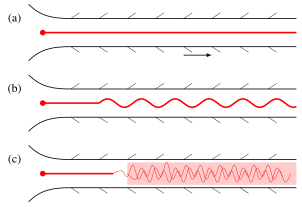
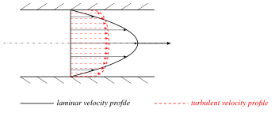
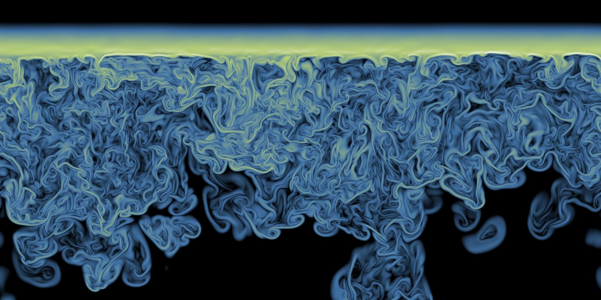
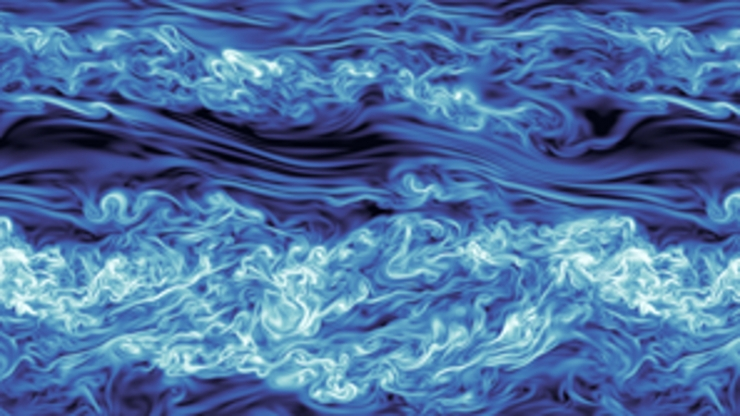
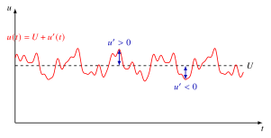
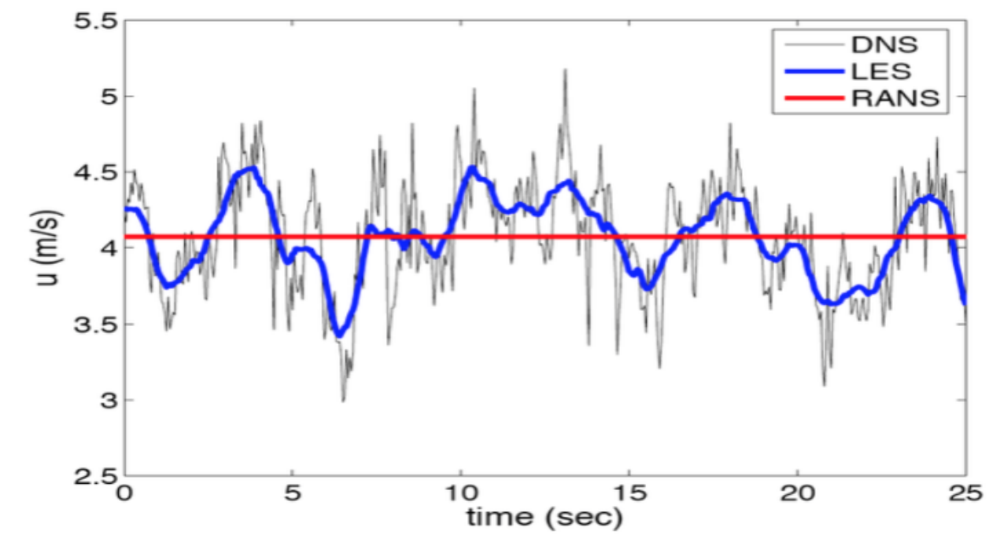
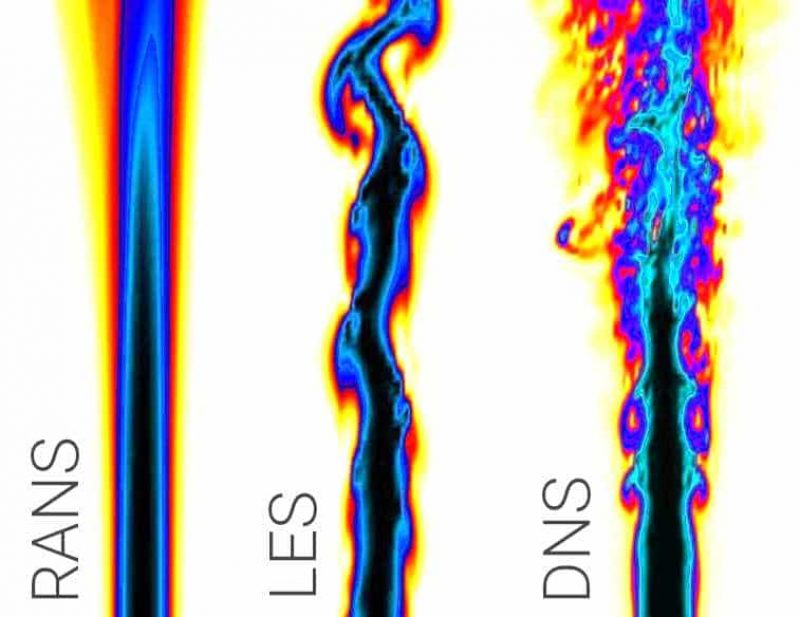
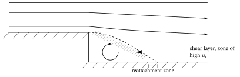



::: {.outcomes}
By the end of this chapter you should be able to:

- describe the main characteristics of turbulent flow and explain the **energy cascade**, Kolmogorov's hypotheses and the $-5/3$ law of the energy spectrum;
- estimate the Kolmogorov length, velocity and time scales, and explain why the scale ratio $l/\eta \sim Re^{3/4}$ makes direct numerical simulation so expensive;
- apply Reynolds decomposition and the averaging rules to derive the Reynolds-averaged Navier--Stokes (RANS) equations, and identify the Reynolds stresses and the closure problem;
- explain the Boussinesq eddy-viscosity hypothesis and the mixing-length, one-equation and $k$--$\varepsilon$ models, and compare their strengths and weaknesses with those of DNS, LES and Reynolds-stress models.
:::

**Incompressible turbulent flow.** Problems involving the motion of a fluid can be classified/arranged sequentially going from the least to the most difficult to solve: potential flow $\rightarrow$ viscous laminar flow $\rightarrow$ turbulent flow. Potential flow falls outside of the remit of the present course while [Chapter 2](ch2.qmd) developed the governing equations of incompressible flow in general and considered a class of viscous laminar flow problems in particular amenable to analytical solution. The term turbulent flow is reserved to denote a state of motion for which an irregular (mixing or eddying motion) appears superimposed on the main flow. This is not to say that the flow has simply become unstable, since such a flow may return to its initial stable state or a new stable state. In contrast, turbulent flows contain self-sustaining irregular velocity fluctuations.

## Historical Perspective {#sec-history}

The first systematic experimental investigation of transition to turbulent flow was undertaken by Osborne Reynolds (1883) using a glass tube containing flowing water fed by a reservoir to visualise the flow by injecting a thin stream of dye, from a point, into the main flow (@fig-reynolds-rig).

{#fig-reynolds-rig width=45%}

Reynolds found that:

{#fig-reynolds-dye width=75%}

(a) If the velocity of the water was sufficiently low, the coloured filament of dye remained straight and parallel to the wall of the tube along its length --- indicating the flow to be steady and orderly in behaviour. This flow type is clearly laminar. The fluid flow appears to be well-ordered and moves as parallel aligned fluid layers, one layer sliding over the next (@fig-reynolds-dye a).

(b) When the flow velocity was increased beyond a certain specific (critical) value the coloured filament was found to oscillate, with an unstable flow pattern extending along the whole length of the tube. This is called the transitional regime (@fig-reynolds-dye b).

(c) At higher flow speeds, after a very short distance, the filament mixed rapidly with the surrounding fluid flow and no discernible dye thread could be seen. This is a turbulent type of flow. The dye thread mixes with the mainstream flow and the fluid appears uniformly coloured from a short distance downstream onwards (@fig-reynolds-dye c). In this case there is superimposed on the mainstream, in the direction of the axis of the tube, a subsidiary cross-stream motion which promotes mixing; this subsidiary motion results in an exchange of momentum transversely. As a consequence, the velocity distribution across the tube for turbulent flow conditions is considerably more uniform than in laminar flow conditions. This difference is illustrated in @fig-velocity-profiles for the same flow rate in each case.

{#fig-dye-photo width=70%}

{#fig-velocity-profiles width=70%}

What we can deduce from the above discussion is that it would appear the most essential feature of a turbulent flow is the fact that at a given point in it, the velocity and pressure fields are not constant in time but exhibit very irregular, high frequency fluctuations. The velocity at a point can only be considered constant on the average (i.e. to have a mean value) and over a long period of time.

Reynolds was the first to investigate in more detail the transition from laminar to turbulent flow using the same experimental set-up. He discovered the law of similarity that bears his name, and which states that: "transition from laminar to turbulent flow occurs always at nearly the same Reynolds number, $Re$."
$$
Re = \frac{\rho U L}{\mu} = \frac{U L}{\nu},
$$
where $L$ is the diameter of the tubes used in his experiments and $U=Q/A$ is the mean flow velocity in the tube ($Q$ is the volumetric rate of flow; $A$ is the cross-sectional area of the tube). From his experiments he established the Reynolds number, $Re$, at which transition occurred, $Re_{\text{crit}}$, to be:
$$
Re_{\text{crit}} = \left(\frac{U L}{\nu}\right)_{\text{crit}} \approx 2300.
$$ {#eq-recrit}

The value 2300 depends very much on inlet conditions; by paying close attention to the inlet conditions, experiments by Schiller (1922) and Ekman (1910) succeeded in maintaining laminar flow, using similar apparatus, for Reynolds numbers up to 20,000 and 40,000, respectively. The final upper limit has yet to be determined but what is known, from numerous experiments, is that a lower bound for $Re_{\text{crit}}$ of about 2000 exists below which the flow remains laminar even in the presence of very strong disturbances. We shall not delve further into transition from laminar to turbulent flow, other than to say that for flow in tubes (i.e. pipes), the transition from laminar to turbulence is accompanied by a noticeable change in the resistance to flow. In laminar flow, the axial pressure gradient, which maintains the motion, is proportional to the velocity; in contrast, for turbulent flow, this pressure gradient is found to be approximately proportional to the square of the mean velocity. The increase in resistance to flow has its origins in the turbulent mixing motion. For flow in a tube/pipe, the pressure drop for turbulent flow can be hundreds of times greater than the value computed by laminar flow theory at the same Reynolds number. There are many other practical problems --- boundary layer, friction, heat transfer --- which cannot be calculated correctly without the consideration of turbulence.

::: {.try-problems data-sec="sec-history"}
:::

## What is Turbulent Flow? {#sec-what-is-turbulence}

Thus far our discussion has hinged on the physical phenomenon of the disorderliness and random irregularities of turbulent flow; we do not, as yet, have a clear-cut definition of turbulence. This is easier said than done but turbulent fluid motion is most commonly defined as:

::: {.callout-tip icon=false}
## Definition: turbulent flow
"An irregular condition of flow in which various quantities (e.g. velocity and pressure fields) exhibit a random variation with both time and space, such that statistically distinct average values can be discerned."
:::

The above kind of chaotic motion predominates in most flows which occur in nature. Similarly, most flows of engineering interest are turbulent:

(a) when objects such as ships, road vehicles, aircraft, etc., move through fluids the flow is invariably turbulent;
(b) similarly turbulence arises when fluids move through enclosures such as fans, pumps, ducts, pipes, etc.

In summary, there are two basically different approaches that can be adopted for describing and seeking an understanding of turbulent motion. They are (i) phenomenological, and (ii) statistical. In the former an expression for shear stresses in terms of some empirical exchange is established; in the latter the equations of motion are studied in terms of time-averaged quantities.

### How is turbulence generated? {#sec-turbulence-generation}

According to the definition suggested by the classical work of Taylor (1936) and von Kármán (1937), turbulence can be generated by (i) fluid flow past solid surfaces or (ii) by the flow of layers of fluid at different velocities past or over one another. This indicates that there are two distinct types of turbulence:

(1) Turbulence generated by viscous effects due to the presence of a solid wall or surface, designated **wall turbulence**.
(2) Turbulence, in the absence of a solid wall, or surface, generated by the flow of layers of fluid at different velocities, designated **free turbulence**.

Examples of (1) include the flow in ducts, conduits, past bodies, etc.; examples of (2) include jet mixing, wakes, shear layers, etc. While above, we have a strict definition of turbulent flow it is important to recognise that this is a product of current understanding and may (very likely will) have to be amended at some future date. However, what we can say, with some certainty, is that flows that are called turbulent do have certain properties in common. Below the major features/qualities of turbulent flows are outlined, with the caveat that some of them are not found in every turbulent flow.

::: {.try-problems data-sec="sec-what-is-turbulence"}
:::

## Characteristics of Turbulent Flow {#sec-characteristics}

Turbulence is a three-dimensional phenomenon!

**A. Turbulent flows experience irregular velocity fluctuations in all three spatial directions**, the intensity of which is variable but nominally 10% or less of the mean velocity. The time history of the velocity at a point might look like a random signal but there is a structure to the fluctuations. In this sense it is not strictly accurate to say the fluctuations are random.

**B. Irregularities in the velocity field have certain spatial structure known as eddies**, an apparently vague term that may be applied to any spatial flow pattern that persists for a short time. Such an eddy may appear like a vortex, a mushroom shaped feature, an embedded jet, or any other recognisable and discernible form. Eddies are not isolated; small eddies exist inside larger ones and even smaller eddies exist inside the small eddies. One of the main characteristics of turbulence is a continuous distribution of eddy size. Turbulence can therefore be thought of as a random collection of eddies which co-exist and feed off each other. These eddies span in size from a scale comparable with the geometry involved to a few micrometres. No successive image of a turbulent flow will look the same but may appear to contain coherent/recognisable patterns (@fig-turb-examples).

::: {#fig-turb-examples layout-ncol=2}
{#fig-turb-a}

{#fig-turb-b}

Visualisations of turbulent flows from numerical simulations. (a) A turbulent region bounded by a sharp, highly contorted interface with the surrounding non-turbulent fluid (black). (b) A stratified turbulent flow, in which the turbulence is patchy and layered. In both, eddies of a wide range of sizes coexist.
:::

**C. The rate at which energy is dissipated in a fluid**, denoted by $\varepsilon$ (per unit mass), is expressed as follows:

$$
\begin{aligned}
\varepsilon = 2\nu \Bigg[ &\left(\frac{\partial u}{\partial x}\right)^2 + \left(\frac{\partial v}{\partial y}\right)^2 + \left(\frac{\partial w}{\partial z}\right)^2 \\
&+ \frac{1}{2}\left(\frac{\partial u}{\partial y} + \frac{\partial v}{\partial x}\right)^2 + \frac{1}{2}\left(\frac{\partial u}{\partial z} + \frac{\partial w}{\partial x}\right)^2 + \frac{1}{2}\left(\frac{\partial v}{\partial z} + \frac{\partial w}{\partial y}\right)^2 \Bigg],
\end{aligned}
$$ {#eq-dissipation}

for flow described using a Cartesian coordinate system.[^phi] The significance of expression @eq-dissipation is that the dissipation, $\varepsilon$, is largest in regions where the velocity gradients are highest, suggesting that $\varepsilon$ is largest where the eddies are smallest, which has been verified many times experimentally.

[^phi]: Compare @eq-dissipation with the viscous dissipation function, $\Phi$, for incompressible flow in [Chapter 2](ch2.qmd#sec-energy-internal): $\varepsilon = \Phi/\rho$. In turbulence, $\varepsilon$ normally denotes the dissipation rate of the *turbulent* kinetic energy, i.e. the time average of @eq-dissipation evaluated with the fluctuating velocity components $u', v', w'$ introduced in @sec-reynolds-averaging.

The key ideas associated with items **B** and **C** above, namely (i) there is a wide range of length scales associated with turbulence, and (ii) dissipation of energy is associated with the smallest eddies, suggest an **energy cascade** in the case of turbulent flow (@sec-energy-cascade). Large eddies, length $l$, are unstable with a life span of the order of their turnover time, $l/u'$. These large scale eddies create smaller eddies; a process that is essentially inviscid at large Reynolds number. Eventually, the eddies created will be small enough for viscosity to become important, at $Re \approx 1$, and energy is dissipated by viscous action. The above process is accelerated if there is an obvious flow direction. Suitably aligned eddies become stretched as one end is forced to move faster than the other. The large eddies are dominated by inviscid effects conserving angular momentum in that as an eddy/vortex is elongated the rotational rate increases and the cross-sectional area reduces.

Fluid elements that at some point in time are separated by a long distance can be brought closer together by eddying motions in turbulent flows. A consequence is that heat, mass and momentum transfer are enhanced considerably. Such effective mixing gives rise to high values of diffusion coefficients for mass, momentum and heat. The important details of turbulence are small scale in character --- e.g. the eddies responsible for the decay of turbulence in gaseous mixtures are typically of the order of $0.1$ mm.

**D. Turbulence in a flow is self-sustaining.** Processes occur that generate more turbulence and maintain the irregular motion. Once a flow becomes unstable and turbulence develops, it does not simply die out and then repeat the process. Turbulence, once initiated, continues and perpetuates itself without diminishing.

**E. Gradients in the mean velocity profiles are another characteristic.** The consequent mean shear must exist for the turbulence to be self-sustaining. In shear layers, boundary layers, jets and wakes, the region where turbulence exists coincides with the region of mean shear.

**F. In confined flows, turbulence may grow to cover the entire flow**, but in all other cases the turbulent region has a limited extent. This is not to say that some fluid is always turbulent and other fluid is always non-turbulent. Another feature of turbulent flows is that they entrain non-turbulent fluid, so that the extent of the turbulent region grows. Consider a free jet as an example. The fluid that the jet is composed of continues to increase by the process of entrainment as the jet extends further from its source. Another good example of the entrainment of non-turbulent fluid by a free jet is the case of a turbulent diffusion flame formed by pure fuel issuing into ambient air. For the combustion process to be sustained, oxidant from the surrounding non-turbulent air has to be entrained at the edges of the fuel to form a combustible mixture.

**G. Turbulent flows are diffusive.** Just as random molecular motion in a gas is responsible for viscous diffusion, thermal diffusion and mass diffusion, a turbulent eddy can transport fluid from a region of low momentum and deposit it in a region of high momentum. Although the process is more complicated than this, turbulence clearly tends to mix fluid and therefore has a diffusive effect. Accordingly, the term eddy diffusion is often used to distinguish it from molecular diffusion; eddy diffusion can be [two orders of magnitude greater than molecular diffusion]{.underline}.

**H. All turbulent flows consist of processes that change the length scale of eddies**, a major characteristic of turbulent flow. These processes act to both increase and decrease the size of eddies. Turbulent eddies are continually being formed with smaller and smaller length scales, forming the basis of the energy cascade. There is a limit to the process in that as the spatial extent of an eddy becomes small enough viscous forces become significant. The viscous forces tend to destroy the smallest eddies and enforce a lower limit on the smallest eddy size that persists.

**I. Last but not least, the final major characteristic of turbulent flows is that they are dissipative** as noted in C. Any flow which is viscous suffers viscous dissipation but flows which are turbulent experience it to a greater extent since the small scale eddies involved have steep velocity gradients. The energy dissipated in the small scale eddies dominates that dissipated in the large scale eddies and in the mean flow. With reference to D., since the smallest eddies dissipate energy and are destroyed by the viscous forces present, the scale-changing process that produces smaller eddies is a necessary part of a self-sustaining turbulence.

::: {.callout-caution collapse="true" icon=false}
## Check your understanding
1. Behind a cylinder at $Re \approx 100$ a regular, periodic von Kármán vortex street forms. The flow is unsteady and full of vortices. Is it turbulent?
2. Why can there be no turbulence in a flow that is perfectly uniform (no mean shear) and has no source of energy, even if it was stirred at some earlier time?

*Answers:* (1) No. The shedding is periodic and repeatable (a single frequency), two-dimensional and has no continuous range of eddy sizes; it is laminar unsteady flow. Turbulence is irregular, three-dimensional and contains a wide range of scales (items A, B, H). (2) Turbulence is dissipative (item I): without mean shear (item E) or another energy source to keep feeding the large eddies, the cascade drains the kinetic energy into heat and the turbulence decays.
:::

::: {.try-problems data-sec="sec-characteristics"}
:::

## The Energy Cascade {#sec-energy-cascade}

Characteristics B, C, H and I above all point to the same physical picture: turbulence contains a wide range of eddy sizes, energy is fed in at the largest scales and it is dissipated at the smallest. This picture --- the **energy cascade** --- was put forward by Richardson (1922) and turned into a quantitative theory by Kolmogorov (1941). It underpins much of what follows: the size of the smallest eddies (@sec-length-scales), the cost of direct numerical simulation (@sec-modelling) and the dissipation rate $\varepsilon$ that appears in the $k$--$\varepsilon$ model (@sec-rans-models).

### Richardson's energy cascade {#sec-richardson}

Richardson summarised the idea in a famous verse (a parody of Jonathan Swift's verse about fleas):

> *Big whirls have little whirls that feed on their velocity,*
> *and little whirls have lesser whirls and so on to viscosity*
> *--- in the molecular sense.*
>
> --- L. F. Richardson, *Weather Prediction by Numerical Process* (1922)

In more detail, the cascade consists of three stages (@fig-cascade):

1. **Production.** The largest eddies have a size $l$ comparable with the width of the flow (the boundary-layer thickness, the width of a jet or wake, the diameter of a pipe) and a velocity $u_l$ comparable with the r.m.s. velocity fluctuation. Their Reynolds number $Re = u_l l/\nu$ is large, comparable with that of the flow itself, so viscosity has a negligible direct effect on them. They extract kinetic energy from the mean flow: the Reynolds stresses (@sec-turbulent-stresses) do work against the mean velocity gradients. This is why mean shear is needed for turbulence to be self-sustaining (item E).
2. **Transfer.** The large eddies are unstable and break up in about one turnover time, $\tau_l = l/u_l$, passing their energy to smaller eddies, mainly by vortex stretching (item C). These break up in turn, and so on. This transfer is an inertial, essentially inviscid process.
3. **Dissipation.** The process continues until the eddies are so small that their own Reynolds number is of order one. At this scale, called $\eta$, viscosity is effective and converts the kinetic energy of the eddies into internal energy (heat) at the rate $\varepsilon$.

{#fig-cascade width=55%}

If the turbulence is statistically steady, energy cannot accumulate at any scale. The rate at which energy is produced at the large scales, the rate at which it is passed through every intermediate scale and the rate at which it is dissipated at the smallest scales must therefore all be equal. In many shear flows (for example the logarithmic region of a turbulent boundary layer, [Chapter 4](ch4.qmd#sec-log-law)) production and dissipation are indeed nearly in local balance, so that production $\approx$ dissipation.

The rate of transfer is set by the large eddies, which hold a kinetic energy per unit mass of order $u_l^2$ and hand it on within a time of order $l/u_l$:

::: {.callout-tip icon=false}
## Key result: dissipation rate set by the large eddies

$$
\varepsilon \sim \frac{u_l^2}{l/u_l} = \frac{u_l^3}{l}
$$ {#eq-eps-scaling}
:::

The viscosity does not appear in @eq-eps-scaling. If we lower $\nu$ (raise $Re$) while keeping $u_l$ and $l$ fixed, the dissipation rate does not change; viscosity only decides *at what scale* the energy is dissipated, which moves to ever smaller eddies as $Re$ increases. The amount dissipated is decided by the large eddies, even though the dissipation itself takes place at the smallest scales. The same estimate, in the form $\varepsilon \sim k^{3/2}/l_s$, is used in the turbulence models of @sec-rans-models.

### Kolmogorov's hypotheses {#sec-kolmogorov-hypotheses}

Kolmogorov (1941) argued that, as energy passes down the cascade, the eddies progressively lose all information about the large-scale geometry and the directional effects of the mean flow. He made this precise in three hypotheses (stated here in the form used by Pope, *Turbulent Flows*, 2000):

::: {.callout-tip icon=false}
## Definition: Kolmogorov's hypotheses (1941)
1. **Local isotropy.** At sufficiently high Reynolds number, the small-scale turbulent motions ($\ell \ll l$) are statistically isotropic.
2. **First similarity hypothesis.** In every turbulent flow at sufficiently high Reynolds number, the statistics of the small-scale motions have a universal form that is uniquely determined by $\nu$ and $\varepsilon$.
3. **Second similarity hypothesis.** In every turbulent flow at sufficiently high Reynolds number, the statistics of the motions of scale $\ell$ in the range $l \gg \ell \gg \eta$ have a universal form that is uniquely determined by $\varepsilon$, independent of $\nu$.
:::

Here $\ell$ denotes the size of an arbitrary eddy, to be distinguished from the size $l$ of the largest eddies.

*Consequences of the first hypothesis.* If the smallest eddies depend only on $\nu$ (units $\text{m}^2\,\text{s}^{-1}$) and $\varepsilon$ (units $\text{m}^2\,\text{s}^{-3}$), then their length, velocity and time scales can only be the combinations of $\nu$ and $\varepsilon$ that have the right units:

$$
\eta = \left(\frac{\nu^3}{\varepsilon}\right)^{1/4}, \qquad
u_\eta = (\nu\varepsilon)^{1/4}, \qquad
\tau_\eta = \left(\frac{\nu}{\varepsilon}\right)^{1/2}.
$$ {#eq-kolmogorov-def}

These are the **Kolmogorov scales**. Note that $u_\eta\,\eta/\nu = 1$: the Reynolds number of the smallest eddies is exactly one, in line with stage 3 of the cascade. How small they are compared with the large eddies follows by combining @eq-kolmogorov-def with @eq-eps-scaling, which is done in @sec-length-scales: the ratio $l/\eta$ grows like $Re^{3/4}$.

*Consequences of the second hypothesis.* Between the largest and the smallest eddies lies the **inertial subrange**, $l \gg \ell \gg \eta$. There, the velocity and time scales of an eddy of size $\ell$ can depend only on $\varepsilon$ and $\ell$, so

$$
u(\ell) \sim (\varepsilon \ell)^{1/3}, \qquad \tau(\ell) \sim \frac{\ell}{u(\ell)} \sim \left(\frac{\ell^2}{\varepsilon}\right)^{1/3}.
$$ {#eq-inertial-scales}

Both decrease as $\ell$ decreases: smaller eddies are slower and live for a shorter time. The rate at which an eddy of size $\ell$ passes on its energy, $u(\ell)^2/\tau(\ell) \sim \varepsilon$, is the same for every $\ell$ in the inertial subrange, which is exactly the statement that the same energy flux passes through each scale. At the ends of the range @eq-inertial-scales gives $u(l) \sim u_l$ (recovering @eq-eps-scaling) and $u(\eta) \sim (\varepsilon\eta)^{1/3} = u_\eta$.

### The energy spectrum and the $-5/3$ law {#sec-five-thirds}

It is convenient to describe eddies of size $\ell$ by the **wavenumber** $\kappa = 2\pi/\ell$ (units rad m$^{-1}$): large eddies have small $\kappa$, small eddies large $\kappa$. The **energy spectrum** $E(\kappa)$ describes how the turbulent kinetic energy per unit mass, $k$ (@eq-tke), is shared among eddies of different sizes: $E(\kappa)\,d\kappa$ is the kinetic energy contained in motions with wavenumbers between $\kappa$ and $\kappa + d\kappa$, so that

$$
k = \int_0^\infty E(\kappa)\, d\kappa .
$$ {#eq-k-spectrum}

$E(\kappa)$ has units $\text{m}^3\,\text{s}^{-2}$. Because the velocity gradients associated with wavenumber $\kappa$ are proportional to $\kappa$, the dissipation is distributed according to the **dissipation spectrum** $D(\kappa) = 2\nu\kappa^2 E(\kappa)$, with (for homogeneous turbulence)

$$
\varepsilon = \int_0^\infty 2\nu\kappa^2 E(\kappa)\, d\kappa .
$$ {#eq-eps-spectrum}

The factor $\kappa^2$ weights the dissipation strongly towards the smallest eddies, which quantifies item C. At high Reynolds number the spectrum has three distinct ranges (@fig-spectrum):

- **Energy-containing range** ($\kappa \lesssim \kappa_{EI}$, eddies of size comparable with $l$). It contains most of the kinetic energy; this is where turbulence is produced from the mean flow. These eddies are anisotropic and depend on the geometry and boundary conditions of the particular flow, so this range is *not* universal.
- **Inertial subrange** ($\kappa_{EI} \ll \kappa \ll \kappa_{DI}$). Energy is neither produced nor dissipated here to any significant extent; it is simply transferred to smaller scales. By the second similarity hypothesis the spectrum depends only on $\varepsilon$ and $\kappa$.
- **Dissipation range** ($\kappa \gtrsim \kappa_{DI}$, i.e. $\kappa\eta \gtrsim 0.1$). Viscous effects are important, $E(\kappa)$ falls off very rapidly (exponentially), and most of the dissipation takes place here. By the first similarity hypothesis the spectrum depends only on $\varepsilon$, $\nu$ and $\kappa$.

The boundaries are not sharp; indicative values (Pope, 2000) are $\ell_{EI} \approx l/6$ and $\ell_{DI} \approx 60\eta$, with $\kappa = 2\pi/\ell$.

**The $-5/3$ law.** In the inertial subrange the second similarity hypothesis says that $E$ can depend only on $\varepsilon$ and $\kappa$, so we look for $E = C_K\,\varepsilon^{a}\kappa^{b}$ with $C_K$ a dimensionless constant. Writing the dimensions of each quantity in terms of length L and time T,

$$
[E] = \text{L}^3\text{T}^{-2}, \qquad [\varepsilon] = \text{L}^2\text{T}^{-3}, \qquad [\kappa] = \text{L}^{-1},
$$

and requiring both sides to have the same dimensions:

$$
\text{L}^3\,\text{T}^{-2} = \left(\text{L}^2\,\text{T}^{-3}\right)^{a}\left(\text{L}^{-1}\right)^{b} = \text{L}^{2a-b}\,\text{T}^{-3a}
\quad\Rightarrow\quad
\begin{cases}
\text{T:} & -2 = -3a \;\Rightarrow\; a = \tfrac{2}{3},\\[2pt]
\text{L:} & \phantom{-}3 = 2a - b \;\Rightarrow\; b = \tfrac{4}{3} - 3 = -\tfrac{5}{3}.
\end{cases}
$$

::: {.callout-tip icon=false}
## Key result: Kolmogorov's $-5/3$ law

$$
E(\kappa) = C_K\,\varepsilon^{2/3}\,\kappa^{-5/3}, \qquad \frac{1}{l} \ll \kappa \ll \frac{1}{\eta},
$$ {#eq-five-thirds}

where $C_K \approx 1.5$ is the (universal) Kolmogorov constant, determined from experiments.
:::

Dimensional analysis fixes the exponents but not the constant, which must be measured. On log--log axes @eq-five-thirds is a straight line of slope $-5/3$. It was first confirmed convincingly by measurements in a tidal channel, where the Reynolds number is very high (Grant, Stewart and Moilliet, 1962), and has since been observed in a great many flows. As a consistency check, the energy of the eddies around wavenumber $\kappa$ is of order $\kappa E(\kappa) \sim \varepsilon^{2/3}\kappa^{-2/3} \sim (\varepsilon\ell)^{2/3} \sim u(\ell)^2$, in agreement with @eq-inertial-scales.

The inertial subrange extends from $\kappa \sim 1/l$ to $\kappa \sim 1/\eta$, so its width is set by the ratio $l/\eta \sim Re^{3/4}$ derived in the next section. At low Reynolds numbers the energy-containing and dissipation ranges overlap and there is no inertial subrange: the $-5/3$ law is a high-Reynolds-number result.

{#fig-spectrum width=85%}

::: {.content-visible when-format="html"}
The interactive figure below plots a model spectrum (Pope, 2000) that has all three ranges and satisfies @eq-k-spectrum and @eq-eps-spectrum exactly. Move the Reynolds-number slider and watch the large scales stay put while the dissipation range moves to ever smaller scales ($L/\eta = Re_L^{3/4}$), opening up the inertial subrange. The *compensated* view, $E\kappa^{5/3}\varepsilon^{-2/3}$, makes the $-5/3$ law appear as a plateau at height $C_K$; the *premultiplied* view shows where the energy sits and where it is dissipated.
:::

::: {.content-visible when-format="html"}
<div class="widget" data-widget="spectrum"></div>
:::

::: {.content-visible when-format="pdf"}
*An interactive version of this figure is available in the online notes.*
:::

::: {.callout-note icon=false}
## Worked example 3.1: the cascade in the atmospheric boundary layer
In the atmospheric boundary layer the largest eddies have a size of about $l = 100$ m and a velocity of about $u_l = 1$ m/s. Estimate (a) the dissipation rate $\varepsilon$; (b) the velocity and turnover time of eddies of size 1 m and 1 cm; (c) the ratio $E(\kappa)$ for 1 cm eddies to $E(\kappa)$ for 1 m eddies, assuming both sizes lie in the inertial subrange.

```{=html}
<details class="solution"><summary>Show solution</summary>
```

(a) From @eq-eps-scaling:
$$
\varepsilon \sim \frac{u_l^3}{l} = \frac{1^3}{100} = 0.01\ \text{m}^2\,\text{s}^{-3}\ (= 0.01\ \text{W/kg}).
$$

(b) From @eq-inertial-scales, $u(\ell) \sim (\varepsilon\ell)^{1/3}$ and $\tau(\ell) \sim \ell/u(\ell)$:
$$
\ell = 1\ \text{m}: \quad u \sim (0.01 \times 1)^{1/3} = 0.22\ \text{m/s}, \qquad \tau \sim \frac{1}{0.22} \approx 4.6\ \text{s};
$$
$$
\ell = 1\ \text{cm}: \quad u \sim (0.01 \times 0.01)^{1/3} = 0.046\ \text{m/s}, \qquad \tau \sim \frac{0.01}{0.046} \approx 0.22\ \text{s}.
$$
Smaller eddies are slower and evolve much faster than larger ones.

(c) From @eq-five-thirds, with $\kappa = 2\pi/\ell$, the wavenumber ratio is $100$, so
$$
\frac{E(\kappa_{1\,\text{cm}})}{E(\kappa_{1\,\text{m}})} = \left(\frac{\kappa_{1\,\text{cm}}}{\kappa_{1\,\text{m}}}\right)^{-5/3} = 100^{-5/3} \approx 4.6 \times 10^{-4}.
$$
The small eddies carry very little energy, even though (as we shall see in @sec-length-scales) they are responsible for the dissipation.

```{=html}
</details>
```
:::

::: {.callout-note appearance="simple" icon=false}
## In practice: the $-5/3$ law in the wind
Sonic anemometers on meteorological masts at wind-farm sites typically record the wind velocity 10--20 times per second. The frequency spectrum of the streamwise velocity shows a clear $f^{-5/3}$ range at the higher frequencies. With Taylor's "frozen turbulence" hypothesis (eddies are swept past the sensor by the mean wind $U$ faster than they evolve, so a frequency $f$ corresponds to a wavenumber $\kappa_1 = 2\pi f/U$), this range can be fitted with the one-dimensional form of the law, $E_{11}(\kappa_1) = C_1\varepsilon^{2/3}\kappa_1^{-5/3}$ with $C_1 = \tfrac{18}{55}C_K \approx 0.49$, to estimate $\varepsilon$. The spectral models used to generate synthetic turbulent wind fields for wind-turbine load calculations (e.g. the Kaimal and Mann models in the IEC 61400-1 design standard) are built to reproduce this $-5/3$ behaviour at high frequencies.
:::

::: {.callout-caution collapse="true" icon=false}
## Check your understanding
1. The fan driving a wind tunnel is adjusted so that the dissipation rate $\varepsilon$ doubles. By what factor do (a) $E(\kappa)$ in the inertial subrange and (b) the Kolmogorov length scale $\eta$ change?
2. Why is the energy-containing range not universal, whereas the inertial subrange and dissipation range are?

*Answers:* (1) (a) $E \propto \varepsilon^{2/3}$, so it increases by $2^{2/3} \approx 1.59$; (b) $\eta \propto \varepsilon^{-1/4}$, so it decreases by a factor $2^{1/4} \approx 1.19$ (i.e. to 84% of its original value). (2) The large eddies are produced by the mean flow and are shaped by the geometry and boundary conditions of each particular flow; as energy cascades to smaller scales this information is lost (local isotropy), so the small scales depend only on $\varepsilon$ (and $\nu$).
:::

::: {.try-problems data-sec="sec-energy-cascade"}
:::

## Estimating Length Scales in a Turbulent Flow {#sec-length-scales}

We now make the link between the two ends of the cascade explicit and estimate how small the smallest eddies are compared with the largest ones.

Consider a fluid containing turbulence: $u_l$ is a typical velocity for the large scale eddies; $u_\eta$ a typical velocity for the small scale eddies; $l$ is the length scale for the larger eddies; $\eta$ the length scale of the smallest structure. Using an order of magnitude analysis the energy entering the eddy cascade can be related to the energy leaving it via viscous action. As discussed in @sec-energy-cascade, experimental evidence suggests that eddies break up on a timescale of the order of their turn-over times, so energy per unit mass is passed down from the largest eddies at a rate given by the fluid kinetic energy per unit mass per turn-over time, that is:
$$
u_l^2 / (l/u_l) = u_l^3/l
$$
For statistically steady flow this must be equal to the rate of dissipation of energy, $\varepsilon$, from the smallest scales (eddies). This rate of dissipation of energy is given by the rate at which the stress per unit mass is dissipated, that is given by:
$$
\varepsilon \sim \frac{\nu (u_\eta/\eta)}{(\eta/u_\eta)} = \frac{\nu u_\eta^2}{\eta^2}
$$
Equating the above two rates of energy transfer yields $u_l^3/l \sim \nu u_\eta^2 / \eta^2$ and based on the fact that at the smallest scales viscosity dominates and the Reynolds number for $\eta$ and $u_\eta$ is approximately 1; i.e. advection and diffusion time scales are the same:
$$
\frac{u_\eta \eta}{\nu} \sim 1, \quad \text{yielding:}
$$

::: {.callout-tip icon=false}
## Definition: Kolmogorov scales

$$
\begin{aligned}
\eta &\sim l\, Re^{-3/4} \quad \text{or} \quad \eta \sim l \left(\frac{u_l l}{\nu}\right)^{-3/4} \\
u_\eta &\sim u_l \left(\frac{u_l l}{\nu}\right)^{-1/4} \quad \text{or} \quad u_\eta \sim u_l\, Re^{-1/4} \\
\tau_\eta &\sim \frac{\eta}{u_\eta} = \frac{l}{u_l}\, Re^{-1/2} = \tau_l\, Re^{-1/2}; \qquad \tau_l = \frac{l}{u_l}
\end{aligned}
$$ {#eq-kolmogorov}

Here $Re = u_l l/\nu$ is the Reynolds number of the large eddies.
:::

where $\tau_\eta$ and $\tau_l$ are the timescales associated with the dynamics of the smallest and largest eddies, respectively. $\eta, u_\eta$ and $\tau_\eta$ are called the **Kolmogorov scales** after the Russian scientist (A. N. Kolmogorov) who formulated the idea. The length scale $l$ is called the **integral length scale**. Using $\varepsilon \sim u_l^3/l$ to eliminate $u_l$ and $l$, @eq-kolmogorov becomes $\eta \sim (\nu^3/\varepsilon)^{1/4}$, $u_\eta \sim (\nu\varepsilon)^{1/4}$ and $\tau_\eta \sim (\nu/\varepsilon)^{1/2}$: exactly the scales @eq-kolmogorov-def that follow from Kolmogorov's first similarity hypothesis. The ratio

$$
\frac{l}{\eta} \sim Re^{3/4}
$$ {#eq-scale-ratio}

measures the extent of the cascade, i.e. the width of the spectrum in @fig-spectrum. Despite the heuristic argument used to arrive at the relationships @eq-kolmogorov they are found to conform remarkably well with experimental data. So, as an example, when $Re = 10^5$ and the largest eddies are of a size $l = 0.01$ m, we can estimate the length scale of the smallest eddies to be:
$$
\eta \sim 0.01 \times (10^5)^{-3/4} = 1.8 \times 10^{-6}\ \text{m} \approx 2\ \mu\text{m}!
$$
Given the above discussion it is perhaps an understatement to say that the physical nature of turbulence and its development remains far from fully understood. That said, it can be investigated both experimentally and theoretically (mainly computationally) as a statistical phenomenon to reveal important aspects of the structure and consequence of turbulence.

While the equations developed in [Chapter 2](ch2.qmd) should embody all of the features and effects A. to I. there is no currently available computer large enough to solve them to the degree of resolution required to capture all the associated length scales and physics for most engineering flows; there is unlikely to be such computing power readily accessible for the foreseeable future. Modelling will therefore prevail for many years to come. Accordingly, the basic theoretical engineering approach used at present is the same as that adopted by Reynolds, when he decomposed the instantaneous velocity at a point in a turbulent flow into a mean part plus a fluctuation, to derive what are known as the Reynolds Averaged Navier--Stokes (RANS) equations which are much more amenable to solution by present day computers underpinned by turbulence models of varying degrees of complexity and usefulness.

::: {.callout-note icon=false}
## Worked example 3.2: Kolmogorov scales in the atmosphere
For the atmospheric boundary layer of Worked example 3.1 ($l = 100$ m, $u_l = 1$ m/s, air with $\nu = 1.5 \times 10^{-5}$ m$^2$/s), estimate the Kolmogorov length, velocity and time scales and the ratio $l/\eta$.

```{=html}
<details class="solution"><summary>Show solution</summary>
```

The large-eddy Reynolds number is
$$
Re = \frac{u_l l}{\nu} = \frac{1 \times 100}{1.5\times 10^{-5}} = 6.7 \times 10^{6}.
$$
From @eq-kolmogorov:
$$
\frac{l}{\eta} \sim Re^{3/4} = (6.7\times 10^6)^{3/4} \approx 1.3 \times 10^5
\quad\Rightarrow\quad \eta \sim \frac{100}{1.3\times 10^5} \approx 7.6 \times 10^{-4}\ \text{m} \approx 0.8\ \text{mm},
$$
$$
u_\eta \sim u_l Re^{-1/4} = \frac{1}{(6.7\times 10^6)^{1/4}} \approx 0.020\ \text{m/s}, \qquad
\tau_\eta \sim \frac{l}{u_l} Re^{-1/2} = \frac{100}{2.6\times 10^3} \approx 0.04\ \text{s}.
$$
Check with @eq-kolmogorov-def and $\varepsilon = 0.01$ m$^2$/s$^3$: $\eta = (\nu^3/\varepsilon)^{1/4} = \left((1.5\times10^{-5})^3/0.01\right)^{1/4} = 7.6\times 10^{-4}$ m, as before. The cascade spans five orders of magnitude in length scale, from 100 m eddies down to sub-millimetre ones.

```{=html}
</details>
```
:::

::: {.try-problems data-sec="sec-length-scales"}
**Try these problems:** [Problem 3.1](../problems/index.qmd#p3-1)
:::

## Reynolds Averaging for Turbulent Flow {#sec-reynolds-averaging}

{#fig-velocity-trace width=70%}

@fig-velocity-trace is a typical instantaneous velocity trace, in this case $u(t)$, at a point within a turbulent flow which can be separated into a mean motion and a fluctuating or eddying motion. The approach followed is to consider the global/average behaviour rather than instantaneous values of the fluctuating quantity(ies) involved, that is their time-averaged values --- mean velocities, mean stresses, etc. instead. Accordingly let $u, v, w$ be velocity components relative to Cartesian axes $(x,y,z)$, noting that they are also functions of time. Denoting the time-averaged (temporal mean) of the $u$-component of the instantaneous velocity by $U$ and its fluctuation (about the mean) by $u'$, we can write down the following relationships for velocity components and pressure (and similarly temperature if required):

$$
u = U + u'; \quad v = V + v'; \quad w = W + w'; \quad p = P + p'
$$ {#eq-decomposition}

The time averages (means) are defined at a fixed point in space and given by:

$$
U = \frac{1}{T}\int_{0}^{T} u \, dt, \quad \text{same for } V, W \text{ and } P,
$$ {#eq-time-average}

where $T$ is a sufficiently long time scale for the mean values to be completely independent of time.[^ensemble] Thus by definition the time averaged quantities describing the fluctuations are equal to zero, namely:

$$
\overline{u'} = \overline{v'} = \overline{w'} = \overline{p'} = 0
$$ {#eq-zero-mean}

[^ensemble]: If the mean flow itself changes slowly with time (e.g. a slowly pulsating flow), $T$ must be long compared with the time scale of the turbulent fluctuations but short compared with the time scale of the mean-flow variation; alternatively the mean is defined as an *ensemble* average over many repetitions of the same experiment. The averaging rules of @sec-averaging-rules hold for either definition, and the mean may then retain a time dependence, $\partial U/\partial t \neq 0$, as allowed for in @sec-rans.

Information, if required, regarding the fluctuating part of the flow can be obtained from the r.m.s. (root mean square) of the fluctuations, defined as:

$$
\sqrt{\overline{u'^2}} = \left( \frac{1}{T}\int_{0}^{T} u'^2 \, dt \right)^{1/2}
$$

Another useful measure is the **turbulence intensity**, $T_I$, defined as the r.m.s. of the fluctuations divided by a reference mean velocity, namely:

$$
T_I = \frac{\sqrt{\overline{u'^2}}}{U_{\infty}}; \quad \text{same for } v' \text{ and } w'
$$

Typical values might be $5\%$ at the inlet to a gas turbine or well below $1\%$ for the flow in a well designed wind tunnel (below $0.1\%$ in dedicated low-turbulence tunnels). Note also, that the kinetic energy, $k$, (per unit mass) associated with turbulence is defined as:

::: {.callout-tip icon=false}
## Definition: turbulent kinetic energy

$$
k = \frac{1}{2}\left(\overline{u'^2} + \overline{v'^2} + \overline{w'^2}\right)
$$ {#eq-tke}
:::

and is linked to $T_I$ via:

$$
T_I = \frac{\left(\frac{2}{3}k\right)^{1/2}}{U_{\infty}},
$$

where $U_{\infty}$ is a reference mean flow velocity, if the r.m.s. values of $u', v'$ and $w'$ are the same (i.e. isotropic turbulence).

::: {.content-visible when-format="html"}
The interactive figure below decomposes a synthetic turbulent velocity signal into its mean and fluctuation. Watch the cumulative mean (purple) settle towards $U$ as the record gets longer, compare the running average over a window $T$ (orange) for short and long windows, and switch the lower panel to $u'^2$ to see that its mean, unlike that of $u'$, is not zero.
:::

::: {.content-visible when-format="html"}
<div class="widget" data-widget="reynolds-decomp"></div>
:::

::: {.content-visible when-format="pdf"}
*An interactive version of this figure is available in the online notes.*
:::

::: {.callout-note icon=false}
## Worked example 3.3: turbulence intensity and turbulent kinetic energy
A three-component probe in the wake of a wind-turbine model measures a mean velocity $U = 8$ m/s and r.m.s. fluctuations $\sqrt{\overline{u'^2}} = 0.60$ m/s, $\sqrt{\overline{v'^2}} = 0.40$ m/s and $\sqrt{\overline{w'^2}} = 0.45$ m/s. Find (a) the streamwise turbulence intensity, (b) the turbulent kinetic energy $k$, and (c) the turbulence intensity based on $k$, taking $U_\infty = U$.

```{=html}
<details class="solution"><summary>Show solution</summary>
```

(a) $T_I = \sqrt{\overline{u'^2}}/U = 0.60/8 = 0.075$, i.e. $7.5\%$.

(b) From @eq-tke:
$$
k = \tfrac{1}{2}\left(0.60^2 + 0.40^2 + 0.45^2\right) = \tfrac{1}{2}(0.360 + 0.160 + 0.2025) = 0.361\ \text{m}^2/\text{s}^2 .
$$

(c) $T_I = \sqrt{2k/3}/U = \sqrt{0.241}/8 = 0.491/8 = 0.061$, i.e. $6.1\%$.

The two values differ because the turbulence is not isotropic: the streamwise fluctuations are larger than the other two components, so the $k$-based value (which assumes all three are equal) underestimates the streamwise intensity.

```{=html}
</details>
```
:::

::: {.callout-note appearance="simple" icon=false}
## In practice: turbulence intensity and wind turbines
In the atmospheric boundary layer the turbulence intensity at the hub height of a wind turbine is typically 5--15% (lower offshore, higher over rough or complex terrain), far higher than in a wind tunnel. It is one of the main parameters used to classify sites: the IEC 61400-1 design standard specifies reference values of 12%, 14% and 16% (at a mean wind speed of 15 m/s) for its turbulence categories. Turbulence matters in two ways: the fluctuations cause fatigue loads on the blades, but they also mix the slow-moving wake behind a turbine with the faster surrounding air, so that wakes recover more quickly when the ambient turbulence intensity is high.
:::

### Time averaging rules {#sec-averaging-rules}

If $f = F + f'$ and $g = G + g'$ are two dependent variables whose mean values are to be found, and $s$ denotes any one of the independent variables $x, y, z, t$, the following averaging rules apply:

::: {.callout-tip icon=false}
## Key result: Reynolds averaging rules

$$
\begin{aligned}
\overline{f'} &= \overline{g'} = 0, & \overline{F} &= F, \\
\overline{\frac{\partial f}{\partial s}} &= \frac{\partial \overline{f}}{\partial s} = \frac{\partial F}{\partial s}, & \overline{\int f \, ds} &= \int \overline{f} \, ds = \int F \, ds, \\
\overline{f+g} &= F + G, & \overline{f\, g} &= FG + \overline{f'g'}, \\
\overline{f\, G} &= FG, & \overline{f' G} &= 0.
\end{aligned}
$$ {#eq-averaging-rules}
:::

Since divergence (i.e. $\del \cdot$) and gradient (i.e. $\del$) operators are both differential operators, the above rules can be extended to fluctuating vector quantities, $\vect{a} = \vect{A} + \vect{a}'$, and their combinations with a fluctuating scalar quantity, $\psi = \Psi + \psi'$:

$$
\begin{aligned}
\overline{\del \cdot \vect{a}} &= \del \cdot \vect{A}, \\
\overline{\del \cdot (\psi \vect{a})} &= \del \cdot (\overline{\psi \vect{a}}) = \del \cdot (\Psi \vect{A}) + \del \cdot (\overline{\psi' \vect{a}'}), \\
\overline{\del \cdot (\del \psi)} &= \del \cdot (\del \Psi).
\end{aligned}
$$ {#eq-averaging-vector}

Before proceeding to formulate time averaged forms of the continuity and N--S equations for incompressible flow recall that the feature which is of fundamental importance to the nature of turbulent motion is how the fluctuations $u', v', w'$ influence the mean motion, $U, V, W$, in such a way that the latter exhibits an apparent increase in the resistance to deformation. That is, the presence of fluctuations manifests as an apparent increase in the viscosity of the fundamental flow. This increased apparent viscosity of the mean flow is central to all theoretical considerations of turbulent motion. We begin therefore by obtaining a closer insight into this phenomenon.

### Apparent turbulent stresses {#sec-turbulent-stresses}

Consider an elementary area $dA$ in a turbulent stream whose velocity components are $u, v, w$. The normal to $dA$ is imagined to be parallel to the $x$-axis and the directions $y$ and $z$ are in the plane of $dA$. The mass of fluid passing through $dA$ in time $dt$ is given by $\rho u \, dA \, dt$ and hence the flux of momentum in the $x$-direction, $dM_x$, is given by:
$$
dM_x = (dA \times \rho u \times dt) \times u = dA\, \rho u^2 dt;
$$
corresponding momentum fluxes in the $y$ and $z$ directions are $dM_y = dA\, \rho u v\, dt$ and $dM_z = dA\, \rho u w\, dt$, respectively. Remembering that for incompressible flow $\rho$ is a constant, we can calculate the following time-averages for the fluxes of momentum per unit time:
$$
\overline{dM_x} = dA\, \rho \overline{u^2}, \quad \overline{dM_y} = dA\, \rho \overline{uv}, \quad \overline{dM_z} = dA\, \rho \overline{uw}.
$$

Using @eq-decomposition we have that $u^2 = (U + u')^2 = U^2 + 2U u' + u'^2$ and on applying the rules @eq-averaging-rules we get $\overline{u^2} = U^2 + \overline{u'^2}$. Similarly $\overline{uv} = UV + \overline{u'v'}$, $\overline{uw} = UW + \overline{u'w'}$. Hence the expressions for the momentum fluxes per unit time become:
$$
\begin{aligned}
\overline{dM_x} &= dA\, \rho (U^2 + \overline{u'^2}), \\
\overline{dM_y} &= dA\, \rho (UV + \overline{u'v'}), \\
\overline{dM_z} &= dA\, \rho (UW + \overline{u'w'}).
\end{aligned}
$$
The above equations, denoting rate of change of momentum, have the dimensions of force. On dividing by $dA$ we obtain forces per unit area, i.e. stresses. Since the flux of momentum per unit time through the area is always equivalent to an equal but opposite force exerted on $dA$ by the surroundings, we can conclude that the area under consideration, which is normal to the $x$-axis, is acted upon by the stresses: $-\rho(U^2 + \overline{u'^2})$ in the $x$-direction, $-\rho(UV + \overline{u'v'})$ in the $y$-direction and $-\rho(UW + \overline{u'w'})$ in the $z$-direction. The first of these is a normal stress; the latter two are shearing stresses. It is thus observed that the superposition of fluctuations on the mean motion gives rise to three additional stresses:

$$
T_{xx}\big|_a = -\rho \overline{u'^2}; \quad T_{xy}\big|_a = -\rho \overline{u'v'}; \quad T_{xz}\big|_a = -\rho \overline{u'w'},
$$

acting on the elementary surface. They are termed "apparent", denoted by $|_a$, or "Reynolds" stresses for turbulent flow and must be added to the stresses caused by the mean flow as derived earlier for the case of laminar flow --- see [Chapter 2](ch2.qmd#sec-stresses). Corresponding expressions apply in the case of elementary areas normal to the two remaining axes $y$ and $z$. Together these form a complete stress tensor of turbulent flow:

$$
\left. \begin{pmatrix}
T_{xx} & T_{xy} & T_{xz} \\
T_{yx} & T_{yy} & T_{yz} \\
T_{zx} & T_{zy} & T_{zz}
\end{pmatrix} \right|_a = - \begin{pmatrix}
\rho \overline{u'^{2}} & \rho \overline{u'v'} & \rho \overline{u'w'} \\
\rho \overline{u'v'} & \rho \overline{v'^{2}} & \rho \overline{v'w'} \\
\rho \overline{u'w'} & \rho \overline{v'w'} & \rho \overline{w'^{2}}
\end{pmatrix}
$$ {#eq-reynolds-stress-tensor}

The time-averages of the mixed products of velocity fluctuations, such as $\overline{u'v'}$, are in general non-zero (they vanish only if the two fluctuations are uncorrelated), and the stress component $T_{xy}|_a = T_{yx}|_a = -\rho \overline{u'v'}$ can also be interpreted physically as the transport of $x$-momentum through a surface normal to the $y$-axis.

::: {.callout-caution collapse="true" icon=false}
## Check your understanding
1. In a boundary layer the mean velocity increases away from the wall, $\partial U/\partial y > 0$. A fluid lump moves *up* ($v' > 0$) from a slower layer. What sign of $u'$ does it most likely bring, and hence what is the sign of $\overline{u'v'}$ and of the Reynolds shear stress $-\rho\overline{u'v'}$?
2. $\overline{u'} = 0$ by definition. Why is $\overline{u'^2}$ not zero too?

*Answers:* (1) It arrives with the lower momentum of the layer it came from, so $u' < 0$; lumps moving down ($v'<0$) tend to bring $u'>0$. Either way $u'v' < 0$ on average, so $\overline{u'v'} < 0$ and $-\rho\overline{u'v'} > 0$: the Reynolds shear stress acts in the same sense as the viscous stress $\mu\,\partial U/\partial y$. (2) $u'^2 \geq 0$ at every instant, and it is strictly positive whenever the flow fluctuates, so its average cannot vanish; it is the (squared) r.m.s. value used in $T_I$ and $k$.
:::

::: {.try-problems data-sec="sec-reynolds-averaging"}
:::

## Time-averaged Continuity and Navier--Stokes Equations for Incompressible Flow {#sec-rans}

### The continuity equation {#sec-rans-continuity}

$$
\del \cdot \vect{q} = \frac{\partial u}{\partial x} + \frac{\partial v}{\partial y} + \frac{\partial w}{\partial z} = 0
$$

Time averaging:

$$
\begin{aligned}
\overline{\del \cdot \vect{q}} &= \overline{\frac{\partial u}{\partial x} + \frac{\partial v}{\partial y} + \frac{\partial w}{\partial z}} = 0 \\
&= \overline{\frac{\partial(U+u')}{\partial x}} + \overline{\frac{\partial(V+v')}{\partial y}} + \overline{\frac{\partial(W+w')}{\partial z}} = 0 \\
&= \frac{\partial U}{\partial x} + \overline{\frac{\partial u'}{\partial x}} + \frac{\partial V}{\partial y} + \overline{\frac{\partial v'}{\partial y}} + \frac{\partial W}{\partial z} + \overline{\frac{\partial w'}{\partial z}} = 0
\end{aligned}
$$

Since $\overline{\partial u'/\partial x} = \partial \overline{u'}/\partial x = 0$, etc., by virtue of @eq-zero-mean:

$$
\frac{\partial U}{\partial x} + \frac{\partial V}{\partial y} + \frac{\partial W}{\partial z} = 0 = \del \cdot \vect{Q},
$$

where $\vect{Q} = (U, V, W)$. Hence

::: {.callout-tip icon=false}
## Key result: time-averaged continuity

$$
\del \cdot \vect{Q} = 0
$$ {#eq-continuity-mean}
:::

Note that as a consequence of @eq-continuity-mean, the instantaneous continuity equation gives:

$$
\del \cdot \vect{q} = \del \cdot (\vect{Q} + \vect{q}') = \del \cdot \vect{Q} + \del \cdot \vect{q}' = 0 \quad \text{where } \vect{q}' = (u', v', w').
$$

Since $\del \cdot \vect{Q} = 0$, this implies

$$
\del \cdot \vect{q}' = \frac{\partial u'}{\partial x} + \frac{\partial v'}{\partial y} + \frac{\partial w'}{\partial z} = 0.
$$ {#eq-continuity-fluct}

### The N--S (momentum) equations {#sec-rans-momentum}

Ignoring for the sake of simplicity the presence of body forces, we have:

$$
\begin{aligned}
\rho\left[\frac{\partial u}{\partial t} + u\frac{\partial u}{\partial x} + v\frac{\partial u}{\partial y} + w\frac{\partial u}{\partial z}\right] &= -\frac{\partial p}{\partial x} + \mu \del^2 u, \\
\rho\left[\frac{\partial v}{\partial t} + u\frac{\partial v}{\partial x} + v\frac{\partial v}{\partial y} + w\frac{\partial v}{\partial z}\right] &= -\frac{\partial p}{\partial y} + \mu \del^2 v, \\
\rho\left[\frac{\partial w}{\partial t} + u\frac{\partial w}{\partial x} + v\frac{\partial w}{\partial y} + w\frac{\partial w}{\partial z}\right] &= -\frac{\partial p}{\partial z} + \mu \del^2 w.
\end{aligned}
$$ {#eq-ns}

Since the process of averaging will be the same for all three equations we consider just the $x$-momentum equation term by term:

1) Unsteady term:
$$
\overline{\rho \frac{\partial u}{\partial t}} = \rho\, \overline{\frac{\partial}{\partial t}(U+u')} = \rho \frac{\partial \overline{U}}{\partial t} + \rho \frac{\partial \overline{u'}}{\partial t}
= \underbrace{\rho \frac{\partial U}{\partial t}}_{\substack{\text{zero only if the flow is} \\ \text{stationary (steady)}}} + \underbrace{\rho \cancel{\frac{\partial \overline{u'}}{\partial t}}}_{\text{zero since } \overline{u'} = 0}
$$

2) Pressure term:
$$
\overline{\frac{\partial p}{\partial x}} = \overline{\frac{\partial (P+p')}{\partial x}} = \frac{\partial P}{\partial x} + \overline{\frac{\partial p'}{\partial x}} = \frac{\partial P}{\partial x} + \underbrace{\cancel{\frac{\partial \overline{p'}}{\partial x}}}_{\text{zero since } \overline{p'} = 0}
$$

3) Viscous term:
$$
\overline{\mu \del^2 u} = \mu\, \overline{\del^2 (U+u')} = \mu \left[\overline{\del^2 U} + \overline{\del^2 u'}\right] = \mu \left[\del^2 U + \underbrace{\cancel{\del^2 \overline{u'}}}_{\text{zero since } \overline{u'} = 0}\right]
$$

In each case the fluctuating part averages to zero by @eq-zero-mean and the averaging rules @eq-averaging-rules.

::: {.callout-important icon=false}
## Note: "steady" and "statistically stationary"
Defining a fluid flow as "steady" is generally reserved for laminar flows, which can also be unsteady. The word "unsteady" generally describes how a fluid flow will change with time. Unsteadiness that arises spontaneously, rather than being imposed by time-dependent boundary conditions, is normally associated with high Reynolds numbers. Turbulent flows are more precisely said to be "fluctuating with time". That said, in certain situations, certain turbulent flows can be considered to be "statistically stationary" or "statistically steady". But what we really mean is that while quantities like velocity and kinetic energy will fluctuate with time, on average they are constant --- i.e. their mean values do not change with time. So, turbulent flow is always unsteady (a function of time) because turbulence is a time-dependent phenomenon but it can be statistically stationary (steady). "Stationary state" describes a system/flow that does not change with time. "Steady state" refers exclusively to a system/flow that has reached a stable equilibrium state and then maintains that equilibrium state for all time.
:::

4) Convective (inertia) terms. Substituting @eq-decomposition and expanding:

$$
\begin{aligned}
&\overline{\rho \left[ u \frac{\partial u}{\partial x} + v \frac{\partial u}{\partial y} + w \frac{\partial u}{\partial z} \right]} \\
&\quad= \rho \left[ \overline{(U+u') \frac{\partial}{\partial x}(U+u')} + \overline{(V+v') \frac{\partial}{\partial y}(U+u')} + \overline{(W+w') \frac{\partial}{\partial z}(U+u')} \right] \\
&\quad= \rho \Bigg[ \overline{(U+u')\frac{\partial U}{\partial x} + (U+u')\frac{\partial u'}{\partial x}} + \overline{(V+v')\frac{\partial U}{\partial y} + (V+v')\frac{\partial u'}{\partial y}} \\
&\qquad\qquad + \overline{(W+w')\frac{\partial U}{\partial z} + (W+w')\frac{\partial u'}{\partial z}} \Bigg] \\
&\quad= \rho \Bigg[ U \frac{\partial U}{\partial x} + V \frac{\partial U}{\partial y} + W \frac{\partial U}{\partial z} + \underbrace{\overline{u' \frac{\partial U}{\partial x} + v' \frac{\partial U}{\partial y} + w' \frac{\partial U}{\partial z}}}_{=\,0 \text{ since } \overline{f'G} = 0} \\
&\qquad\qquad + \underbrace{\overline{U \frac{\partial u'}{\partial x} + V \frac{\partial u'}{\partial y} + W \frac{\partial u'}{\partial z}}}_{=\,0 \text{ since } \overline{u'} = 0} + \overline{u' \frac{\partial u'}{\partial x} + v' \frac{\partial u'}{\partial y} + w' \frac{\partial u'}{\partial z}} \Bigg]
\end{aligned}
$$

Using the product rule on each term of the last group, e.g. $v'\,\partial u'/\partial y = \partial (u'v')/\partial y - u'\,\partial v'/\partial y$, and then the averaging rules:

$$
\begin{aligned}
&\quad= \rho \left[ (\vect{Q} \cdot \del) U + \frac{\partial \overline{u'^2}}{\partial x} - \overline{u' \frac{\partial u'}{\partial x}} + \frac{\partial \overline{u'v'}}{\partial y} - \overline{u' \frac{\partial v'}{\partial y}} + \frac{\partial \overline{u'w'}}{\partial z} - \overline{u' \frac{\partial w'}{\partial z}} \right] \\
&\quad= \rho \Bigg[ (\vect{Q} \cdot \del) U - \underbrace{\overline{u' \left( \frac{\partial u'}{\partial x} + \frac{\partial v'}{\partial y} + \frac{\partial w'}{\partial z} \right)}}_{=\,0 \text{ by continuity of the fluctuations}} + \frac{\partial \overline{u'^2}}{\partial x} + \frac{\partial \overline{u'v'}}{\partial y} + \frac{\partial \overline{u'w'}}{\partial z} \Bigg] \\
&\quad= \rho \left[ (\vect{Q} \cdot \del) U + \frac{\partial \overline{u'^2}}{\partial x} + \frac{\partial \overline{u'v'}}{\partial y} + \frac{\partial \overline{u'w'}}{\partial z} \right]
\end{aligned}
$$

where the underbraced term vanishes by @eq-continuity-fluct. Following exactly the same procedure for the $y$ and $z$ momentum equations we get a similar form; all three equations when time averaged are thus:

::: {.callout-tip icon=false}
## Key result: Reynolds-averaged Navier--Stokes (RANS) equations (incompressible)

$$
\begin{aligned}
\rho\left(\frac{\partial U}{\partial t} + U\frac{\partial U}{\partial x} + V\frac{\partial U}{\partial y} + W\frac{\partial U}{\partial z}\right) &= -\frac{\partial P}{\partial x} + \mu \del^2 U \\
&\quad - \rho\left( \frac{\partial\overline{u'^2}}{\partial x} + \frac{\partial\overline{u'v'}}{\partial y} + \frac{\partial\overline{u'w'}}{\partial z} \right) \\
\rho\left(\frac{\partial V}{\partial t} + U\frac{\partial V}{\partial x} + V\frac{\partial V}{\partial y} + W\frac{\partial V}{\partial z}\right) &= -\frac{\partial P}{\partial y} + \mu \del^2 V \\
&\quad - \rho\left( \frac{\partial\overline{u'v'}}{\partial x} + \frac{\partial\overline{v'^2}}{\partial y} + \frac{\partial\overline{v'w'}}{\partial z} \right) \\
\rho\left(\frac{\partial W}{\partial t} + U\frac{\partial W}{\partial x} + V\frac{\partial W}{\partial y} + W\frac{\partial W}{\partial z}\right) &= -\frac{\partial P}{\partial z} + \mu \del^2 W \\
&\quad - \rho\left( \frac{\partial\overline{u'w'}}{\partial x} + \frac{\partial\overline{v'w'}}{\partial y} + \frac{\partial\overline{w'^2}}{\partial z} \right)
\end{aligned}
$$ {#eq-rans}
:::

The left hand sides of @eq-rans are formally identical to the standard N--S equations (see [Chapter 2](ch2.qmd#sec-ns-special)) when the body forces $\vect{F}=(F_x, F_y, F_z)$ are zero, with the velocity components $u, v, w$ replaced by their time-averages $U, V, W$, and the same is true of the pressure and viscous terms on the right hand side. However, in addition @eq-rans contain terms which depend on the turbulent fluctuations present, representing non-zero products of the fluctuating velocity terms. Comparing @eq-rans with the momentum equations written in terms of stresses in [Chapter 2](ch2.qmd#sec-momentum), we see that the additional terms can be interpreted as a stress tensor, the components of which are known as Reynolds stresses (termed apparent turbulent stresses in @sec-turbulent-stresses). If we denote these stresses by $T$, as opposed to $\tau$ used in the case of viscous stresses, we can write @eq-rans in the form:

$$
\begin{aligned}
\rho \frac{DU}{Dt} &= -\frac{\partial P}{\partial x} + \mu \del^2 U + \left( \frac{\partial T_{xx}}{\partial x} + \frac{\partial T_{xy}}{\partial y} + \frac{\partial T_{xz}}{\partial z} \right) \\
\rho \frac{DV}{Dt} &= -\frac{\partial P}{\partial y} + \mu \del^2 V + \left( \frac{\partial T_{yx}}{\partial x} + \frac{\partial T_{yy}}{\partial y} + \frac{\partial T_{yz}}{\partial z} \right) \\
\rho \frac{DW}{Dt} &= -\frac{\partial P}{\partial z} + \mu \del^2 W + \left( \frac{\partial T_{zx}}{\partial x} + \frac{\partial T_{zy}}{\partial y} + \frac{\partial T_{zz}}{\partial z} \right)
\end{aligned}
$$ {#eq-rans-T}

where $D/Dt = \partial/\partial t + (\vect{Q}\cdot\del)$ follows the mean flow, and

$$
\begin{pmatrix}
T_{xx} & T_{xy} & T_{xz} \\
T_{yx} & T_{yy} & T_{yz} \\
T_{zx} & T_{zy} & T_{zz}
\end{pmatrix}
=
-\begin{pmatrix}
\rho \overline{u'^2} & \rho \overline{u'v'} & \rho \overline{u'w'} \\
\rho \overline{v'u'} & \rho \overline{v'^2} & \rho \overline{v'w'} \\
\rho \overline{w'u'} & \rho \overline{w'v'} & \rho \overline{w'^2}
\end{pmatrix}.
$$ {#eq-reynolds-stress}

From the above argument it can be concluded that the components of the mean velocity of turbulent flow satisfy the same equations, i.e. @eq-rans-T, as those satisfied by laminar flow, except that the laminar stresses must be increased by additional stresses which are given by the stresses in the stress tensor @eq-reynolds-stress, the Reynolds stresses. Since these stresses are added to the laminar flow and have a similar influence on the nature of the flow, it is often stated that they are caused by **eddy viscosity**. The total stresses at a point are the sum of viscous and Reynolds stresses; on a face normal to the $x$-direction, for example, the three components are (excluding the pressure):

$$
2\mu \frac{\partial U}{\partial x} - \rho \overline{u'^2}, \qquad
\mu\left(\frac{\partial U}{\partial y} + \frac{\partial V}{\partial x}\right) - \rho \overline{u'v'}, \qquad
\mu\left(\frac{\partial U}{\partial z} + \frac{\partial W}{\partial x}\right) - \rho \overline{u'w'}.
$$

Generally speaking, the Reynolds stresses far exceed the viscous stresses everywhere within a flow except close to solid boundaries; more about this in [Chapter 4](ch4.qmd). What we note here is that @eq-rans are the starting point for modelling turbulent flow which we shall address next. Such models are essentially applicable to flow (away from solid boundaries) where the Reynolds number is high, $\sim 10^6$ and higher. Close to a solid boundary either the equations themselves have to be reformulated to cope with lower Reynolds numbers or the boundary condition has to be adapted accordingly. But more about this later in [Chapter 4](ch4.qmd#sec-log-law). Returning to @eq-rans we see that these equations plus the continuity equation @eq-continuity-mean comprise just 4 equations for 10 unknowns --- the 4 mean quantities $U, V, W$ and $P$ together with 6 Reynolds stresses:

$$
\underbrace{-\rho \overline{u'^2},\ -\rho \overline{v'^2},\ -\rho \overline{w'^2}}_{\text{normal stresses}}, \qquad \underbrace{-\rho \overline{u'v'},\ -\rho \overline{u'w'},\ -\rho \overline{v'w'}}_{\text{tangential stresses}}
$$

So **we are 6 equations short!** How we deal with this is the subject of the remainder of the chapter.

### Boundary conditions {#sec-rans-bcs}

The boundary conditions to be satisfied by the mean velocity components in @eq-rans are the same as in ordinary laminar flow, namely they all vanish at fixed solid walls (no-slip condition). Moreover all turbulent components must vanish there too and they will be very small in their immediate neighbourhood. It follows that all the Reynolds stresses vanish at solid walls and the only stresses which act near them are the viscous stresses of laminar flow as they, in general, do not vanish there. Furthermore, it is seen that in the immediate neighbourhood of a wall the Reynolds stresses are small compared to the viscous stresses and it follows that in every turbulent flow there exists a very thin layer next to a wall which, in essence, behaves like a laminar motion, which is known as the **laminar sublayer** (nowadays usually called the *viscous sublayer*, since the velocity fluctuations within it, although small, are not zero). The velocities within it are so small that the viscous forces dominate over the inertia forces, and the Reynolds stresses in it are negligible. Remember the Reynolds stress terms are from time-averaging the convective-acceleration, i.e. inertia, terms in the original Navier--Stokes equations. The sublayer is of great importance for turbulent flow because it is the focus of phenomena by which the shearing at a wall and hence viscous drag are determined. More about this in [Chapter 4](ch4.qmd#sec-log-law).

::: {.try-problems data-sec="sec-rans"}
**Try these problems:** [Problem 3.2](../problems/index.qmd#p3-2), [Problem 3.3](../problems/index.qmd#p3-3)
:::

## Turbulence Modelling for Incompressible Flows {#sec-modelling}

The modelling of turbulence has a long and distinguished history, spanning around 150 years, which accelerated considerably around 50 years ago, with the advent of and readily available access to digital computers. Throughout the latter period a sequence of modelling procedures of varying complexity has emerged, as captured in the listing below:

- **Direct Numerical Simulation:** based on solving the N--S equations for all of the turbulence scales involved.
- **Large Eddy Simulation:** based on a spatial filtering of the N--S equations.
- **Classical Models:** based on solving the Reynolds, or time-averaged N--S (i.e. RANS) equations. These include:
    - zero equation models
    - one equation models
    - two equation models
    - Reynolds stress equations

How the three approaches relate to the energy cascade of @sec-energy-cascade is summarised in @fig-dns-les-rans-cascade.

{#fig-dns-les-rans-cascade width=65%}

### Direct numerical simulation (DNS) {#sec-dns}

DNS takes the continuity and N--S equations as the starting point, for the instantaneous dependent variables --- $u, v, w, p$, etc., written as discrete analogues, and computes a transient solution on a sufficiently fine spatial mesh of discrete points with sufficiently small time steps to resolve the smallest turbulent eddies and fastest fluctuations --- i.e. there is **NO turbulence modelling** involved. This means that the whole range of spatial and temporal scales of the turbulence must be resolved in the computational mesh, from the smallest, dissipative scales (the Kolmogorov microscale), $\eta$, up to the integral scale, $l$. From @eq-kolmogorov, we have $\eta \sim l\, Re^{-3/4}$, where the integral length scale, $l$, usually depends on the spatial scale of the boundary conditions, which would be the whole geometry scale if the turbulence is enclosed. To satisfy the above requirements, the number of mesh points $N$, in a given mesh direction, with spacing, $h$, must satisfy $h \le \eta$, so that the Kolmogorov scale can be resolved, while $Nh \ge l$ so that the integral length scale is contained within the computational domain. From these two relationships $l/N \le \eta$ and therefore:

$$
N \ge Re^{3/4}.
$$

The above relationship implies that a three-dimensional DNS computation with $N$ mesh points in each coordinate direction will require $N^3$ mesh points in total, satisfying

$$
N^3 \ge Re^{9/4} \quad (\text{i.e. } Re^{2.25})
$$

Hence the memory storage requirements for a DNS grow very fast with the size of the Reynolds number. In addition, given the very large memory requirements, the time integration must be done explicitly; so in order to be accurate this must be performed with a small enough time increment, $\Delta t$, satisfying

$$
C = \frac{u_l \Delta t}{h} < 1,
$$

where $C$ is called the Courant number. The total time interval simulated is proportional to the turbulence time scale, $\tau_l$, given by $\tau_l = l/u_l$. Hence the number of time integration steps is proportional to $\tau_l / \Delta t = (l/u_l) / (C h / u_l) = l/(Ch)$ with $h = l/Re^{3/4}$. Consequently the number of time steps grows as a power law of the Reynolds number, $Re^{0.75}$. Adding this to the result above that the number of mesh points required grows like $Re^{2.25}$, we have that the total number of operations grows like $Re^3$.

The computational cost of DNS is very high. As an example, for an engineering flow with $Re = 10^6$ the estimate above gives of order $Re^3 = 10^{18}$ mesh-point updates; at (say) 100 floating-point operations per update this is about $10^{20}$ floating-point operations. Even if it were possible to get access to a supercomputer sustaining $46.6 \times 10^{12}$ floating-point operations per second it would take about $2 \times 10^6$ s, i.e. some 25 days, to compute a solution. And don't forget the size of the data files generated (terabytes) and the huge amount of time it would take to interrogate them! Clearly DNS currently remains an unrealistic proposition for solving practical engineering problems of industrial interest. Nevertheless it constitutes a useful tool for fundamental research into turbulence, for providing sub-grid scale models for use with large eddy simulations and for improving the models underpinning the RANS equations. It will not, however, be considered further.

### Large eddy simulation (LES) {#sec-les}

The principal idea behind LES is to reduce the computational cost of DNS by ignoring the smallest length scales which are the most computationally expensive to resolve. Filtering, which can be thought of as a local spatial averaging (and which, by removing the smallest eddies, also removes the fastest fluctuations), is used to effectively remove small scale information from any numerical solutions; nevertheless its effect has to be modelled since what goes on at the small scale plays a very important role in near wall flows, reacting flows and multiphase flows. The vehicle for this is called **sub-grid modelling**, the most common of which is attributed to Smagorinsky (1963), LES having its origins in relation to large scale climatic flows. We won't go into too much detail here but, as in the case of Reynolds averaging, in LES any field, such as velocity, pressure, etc., is written as the sum of a filtered and sub-filtered partition, i.e. any dependent variable $\phi$ would be expressed as

$$
\phi = \bar{\phi} + \phi',
$$

$\bar{\phi}$ being the filtered part and $\phi'$ the sub-filtered part. Note, LES filtering does not satisfy the properties of Reynolds averaging (in general $\bar{\bar{\phi}} \neq \bar{\phi}$ and $\overline{\phi'} \neq 0$). The basic underpinning of LES is that the large scale motions of turbulence are generally more energetic than the small scale ones. The latter are weaker and provide very little transport, unlike the large scales which are more effective at transporting the conserved flow properties (@fig-les-signal). LES is expensive but not as much as DNS for the same flow. As with DNS we do not consider LES any further.

{#fig-les-signal width=70%}

### Classical models {#sec-classical}

As engineers we are normally interested only in a few quantitative properties of a turbulent flow and such properties are usually averages with a distribution. In this sense perhaps LES and certainly DNS are essentially overkill (@fig-dns-les-rans). The RANS approach which we shall consider in detail in the next section is sometimes referred to as [one-point closure]{.underline}.

{#fig-dns-les-rans width=55%}

::: {.try-problems data-sec="sec-modelling"}
:::

## Zero, One, Two Equation and Reynolds Stress Models {#sec-rans-models}

The Reynolds Averaged Navier--Stokes (RANS) equations, @eq-rans, represent the starting point for the classical models of turbulent flow, or more precisely, the calculation of time-averages of the magnitudes that describe the flow. While the continuity and N--S equations for the velocity and pressure fields derived in various forms in [Chapter 2](ch2.qmd), are a closed equation set --- i.e. 4 equations in terms of 4 unknowns --- their time averaged counterparts are NOT. They comprise 4 equations containing 10 unknowns --- the 4 mean quantities $U, V, W$ and $P$ together with 6 Reynolds stresses $\overline{u'^2}, \overline{v'^2}, \overline{w'^2}, \overline{u'v'}, \overline{u'w'}$ and $\overline{v'w'}$. Time averaged equations for each of the Reynolds stresses can be formulated for the 6, second order, normal and shear stresses. However, these "new" equations for $\overline{u'^2}$, etc., will contain higher order unknown terms such as $\overline{u'^2 v'}$, etc. Similarly, equations can be developed for these terms but will contain even higher order unknowns, and so on. This, in relation to turbulence modelling, is known as the **closure problem**, i.e. whatever one does there are always more unknowns than actual equations available and the choice to be made is at what level to close the problem. Not surprisingly, it has become common practice to close the problem at the second order level (the level of the Reynolds stresses). That is to produce an approximation or "model" in terms of quantities that can be determined in order to calculate/represent the unknown Reynolds stresses. Accordingly, by turbulence modelling we mean the derivation of a set of equations which when solved in conjunction with the mean flow equations allow calculation of the relevant correlations and so simulate the behaviour of real turbulent flow in some important aspect(s).

### Some desirable attributes of turbulence models {#sec-model-attributes}

**A. Accuracy:** The model must simulate the main features of turbulent flow with sufficient accuracy. Model predictions should be verified with laboratory experimental data whenever possible.

**B. Breadth of applicability:** A single set of equations and numerical values of turbulence constants should be available to simulate a wide range of phenomena. We do not want to have to fudge the equations or constants every time we change the geometry of the flow.

**C. Simplicity:** The model should be simple to understand and implement --- the aim is to make it a tool for use by design engineers remote from specialist involvement.

**D. Economy:** As a design tool, the cost of running the model on a computer platform in terms of manpower, computing time and storage should represent an acceptably small fraction of the total investment. Particularly in the 21st century, the latter two items form an ever decreasing proportion of the cost.

The best choice of model will depend on the application and the amount of detailed knowledge of the flow required. For example, a boundary layer type flow will usually require the use of a simpler turbulence model than a flow with recirculation and swirl. In what follows we shall not consider a full 3D treatment of turbulence models since in order to do so conveniently requires a reasonable knowledge of tensor calculus to make the equations and models involved sufficiently compact; using vector calculus is an option but can be cumbersome too. Accordingly our focus will be a 2D treatment (of the *mean* flow) which is sufficient to develop the understanding and insight required. A key underpinning simplification throughout is use of the Boussinesq eddy viscosity model.

### The Boussinesq eddy viscosity model (EVM) {#sec-boussinesq}

Of the classical models, the mixing length model together with the $k$--$\varepsilon$ model and its variants are presently by far the most widely used and validated. They are based on the assumption that there exists an analogy between the action of viscous stresses and Reynolds stresses on the mean flow. As we have shown, both stresses appear on the right hand side of the momentum equations, see @eq-rans-T. For an incompressible fluid with constant dynamic viscosity the viscous stresses take the form:

$$
\tau_{ij} = \mu \left( \frac{\partial u_i}{\partial x_j} + \frac{\partial u_j}{\partial x_i} \right)
$$ {#eq-tau-ij}

I have used suffix notation above to simplify having to write each of them out. The convention of this notation is that $i$ or $j = 1, 2 \text{ or } 3$ corresponds to the $x, y$ or $z$-direction, respectively. For example:

$$
\tau_{12} = \tau_{xy} = \mu \left( \frac{\partial u_1}{\partial x_2} + \frac{\partial u_2}{\partial x_1} \right) = \mu \left( \frac{\partial u}{\partial y} + \frac{\partial v}{\partial x} \right),
$$

where $(x_1, x_2, x_3) = (x, y, z)$ and $(u_1, u_2, u_3) = (u, v, w)$. The first move in developing a turbulence model is attributed to Boussinesq (1877) who suggested that turbulence could be described by the same type of stress-strain relationship as in laminar Newtonian flow. Using the above suffix notation this leads to:

::: {.callout-tip icon=false}
## Definition: Boussinesq hypothesis

$$
T_{ij} = -\rho \overline{u_i' u_j'} = \mu_t \left( \frac{\partial U_i}{\partial x_j} + \frac{\partial U_j}{\partial x_i} \right) - \frac{2}{3}\rho k\, \delta_{ij},
$$ {#eq-boussinesq}
:::

where $\delta_{ij}$ is the Kronecker delta which is equal to 1 when $i=j$ and zero when $i \neq j$. Comparing the above for the mean velocities with @eq-tau-ij, we note it has an additional term which is non-zero for the normal stresses only. $k = \frac{1}{2}(\overline{u'^2} + \overline{v'^2} + \overline{w'^2})$ is the turbulent kinetic energy per unit mass (see @eq-tke). The first term on the right hand side of @eq-boussinesq relates to the Reynolds stresses expressed as gradients of the mean velocities. The second term on the right hand side is to ensure that we get the correct behaviour for the normal Reynolds stresses, which are $-\rho \overline{u'^2}$, $-\rho \overline{v'^2}$ and $-\rho \overline{w'^2}$. That is, using @eq-boussinesq:

$$
\begin{aligned}
-\rho \overline{u'^2} &= 2\mu_t \frac{\partial U}{\partial x} - \frac{2}{3}\rho k \\
-\rho \overline{v'^2} &= 2\mu_t \frac{\partial V}{\partial y} - \frac{2}{3}\rho k \\
-\rho \overline{w'^2} &= 2\mu_t \frac{\partial W}{\partial z} - \frac{2}{3}\rho k
\end{aligned}
$$

Summing gives:

$$
-\rho(\overline{u'^2} + \overline{v'^2} + \overline{w'^2}) = 2\mu_t \left( \frac{\partial U}{\partial x} + \frac{\partial V}{\partial y} + \frac{\partial W}{\partial z} \right) - 2\rho k
$$

Since $\del \cdot \vect{Q} = 0$ (see @eq-continuity-mean), we obtain:

$$
-\rho(2k) = -2\rho k,
$$

and so the behaviour is correct. The quantity $\mu_t$ in expression @eq-boussinesq is called the **turbulent** (or **eddy** or **effective**) **viscosity**. The kinematic equivalent is $\nu_t = \mu_t / \rho$. $\mu_t$ has units of Pa s and $\nu_t$ units of m$^2$ s$^{-1}$. Unlike molecular viscosity, $\mu_t$ (and $\nu_t$) is **not** a property of the fluid. Its value will vary from point to point in the flow, being determined largely by the local turbulence structure (i.e. it is an unknown quantity). Therefore $\mu_t$ itself does not constitute a model; it does, however, provide a framework for constructing one. The problem has shifted from quantifying each of the Reynolds stresses to one of specifying $\mu_t$.

Noting that most of the kinetic energy is contained in the large eddies of a turbulent flow (@sec-energy-cascade) and that these interact with the mean flow, then if we accept that the connection between the mean flow and large eddies is strong we can link the characteristic velocity scale of the large eddies with the mean flow properties. This has been found to work well for simple 2D turbulent flows (the Reynolds stresses appearing in the 2D mean-flow equations being $\overline{u'^2}, \overline{v'^2}, \overline{u'v'}$) where the only significant Reynolds stress is $T_{xy} = T_{yx} = -\rho \overline{u'v'}$ and the only significant velocity gradient is $\partial U / \partial y$. As such, in terms of @eq-boussinesq we have that

$$
\tau\big|_{\text{turb}} = -\rho \overline{u'v'} = \mu_t \frac{\partial U}{\partial y},
$$ {#eq-tau-turb}

holds for the 1D mean flow. It was Prandtl (1925) who suggested, based on an analogy with the kinetic theory of gases, that

$$
\mu_t \propto \rho\, l_s v_s
$$

where $l_s$ and $v_s$ are turbulent length and velocity scales, respectively, associated with the large eddies where the majority of turbulent kinetic energy is contained. Another way of arriving at the above is to look at the turbulent kinematic viscosity which has units of L$^2$T$^{-1}$ which from a dimensional argument suggests $\nu_t \propto l_s v_s \implies \mu_t \propto \rho\, l_s v_s$, or

$$
\mu_t = C_1 \rho\, l_s v_s,
$$ {#eq-mu-t}

where $C_1$ is a constant of proportionality. The EVM closes the problem by specifying both $l_s$ and $v_s$, i.e.

$$
\tau\big|_{\text{turb}} = -\rho \overline{u'v'} = \mu_t \frac{\partial U}{\partial y} = C_1 \rho\, l_s v_s \frac{\partial U}{\partial y}
$$

@eq-mu-t allows independent choice of $l_s$ and $v_s$ which can be specified via one of the following methods:

- providing algebraic expressions/formulae for $l_s$ and $v_s$;
- providing an algebraic expression/formula for one of them ($l_s$ or $v_s$) and a PDE for the other, with that quantity as the dependent variable;
- obtaining both $l_s$ and $v_s$ by solving PDEs.

### The zero equation model: Prandtl mixing length model (MLM) {#sec-mixing-length}

Prandtl arrived at the hypothesis, within the distance over which $u'$ and $v'$ are closely correlated, based on dimensional arguments that:

$$
v_s \propto l_s \left| \frac{\partial U}{\partial y} \right| \implies v_s= C_2\, l_s \left| \frac{\partial U}{\partial y} \right|,
$$ {#eq-vs-prandtl}

where $C_2$ is a constant of proportionality. Therefore, combining @eq-mu-t and @eq-vs-prandtl yields

$$
\mu_t = \rho C_1 C_2\, l_s^2 \left| \frac{\partial U}{\partial y} \right| = \rho\, l_m^2 \left| \frac{\partial U}{\partial y} \right|,
$$ {#eq-mu-t-mlm}

where $l_m$ is a new length scale and since $l_m$ remains an unknown (to be specified) the constants of proportionality are taken to be unity. @eq-mu-t-mlm leads to Prandtl's mixing length model, where $l_m$ is the **mixing length**. It is this length scale that accounts for the change in turbulence due to the flow. Hence combining @eq-tau-turb and @eq-mu-t-mlm we have that

::: {.callout-tip icon=false}
## Key result: Prandtl's mixing length model

$$
-\rho \overline{u'v'} = \mu_t \frac{\partial U}{\partial y} = \rho\, l_m^2 \left| \frac{\partial U}{\partial y} \right| \frac{\partial U}{\partial y}
$$ {#eq-mlm}
:::

So, in a 2D RANS calculation the above expression would influence both the $U$ and $V$ mean flow equations, see @eq-rans, via the term $\rho \overline{u'v'}$. @eq-mlm is an algebraic representation of the Reynolds stress and does not introduce another PDE into the problem. The success of the MLM is that $l_m$ can be specified quite easily for many 2D-like turbulent flow situations. For example:

| Flow type | Value of $l_m$ |
|:--|:--|
| Plane mixing layer | $0.07\,\delta$ ($\delta$ = layer width) |
| Plane wake | $0.16\,\delta$ ($\delta$ = wake width) |
| Plane jet | $0.09\,\delta$ |
| Round jet | $0.075\,\delta$ |
| Radial fan/jet | $0.125\,\delta$ ($\delta$ = jet half width) |

: Mixing lengths for some free shear flows. {#tbl-mixing-length}

The point to note is that the MLM is still used today and is not just a model of pure historical interest.

**Assessment of the MLM**

**Advantages:** It is easy to implement and inexpensive in terms of computational resource, plus easy to understand; it does not involve the solution of additional PDEs. It produces reasonably good results for thin shear layers, jets, wakes and boundary layers.

**Disadvantages:** On the axis of a jet, the mean rate of strain (i.e. velocity gradient) is zero; since @eq-mu-t-mlm returns $\mu_t = 0$ there will be no transfer of mass (or heat) across the jet. Yet in reality there will be rapid mixing of the fluid from one side of the jet to the other. The MLM is not suitable when turbulent transport by convection and diffusion is important --- for example in rapidly developing or recirculating flows.

::: {.callout-note icon=false}
## Worked example 3.4: eddy viscosity in a mixing layer
A plane mixing layer in air ($\rho = 1.2$ kg/m$^3$, $\mu = 1.8 \times 10^{-5}$ Pa s) has a width $\delta = 0.1$ m. At a point in the layer the mean velocity gradient is $\partial U/\partial y = 50$ s$^{-1}$. Use the mixing length model to estimate the eddy viscosity and the Reynolds shear stress, and compare them with the molecular viscosity and viscous shear stress.

```{=html}
<details class="solution"><summary>Show solution</summary>
```

From @tbl-mixing-length, $l_m = 0.07\,\delta = 0.007$ m. From @eq-mu-t-mlm:
$$
\nu_t = l_m^2 \left|\frac{\partial U}{\partial y}\right| = (0.007)^2 \times 50 = 2.45 \times 10^{-3}\ \text{m}^2/\text{s}, \qquad \mu_t = \rho \nu_t = 2.9 \times 10^{-3}\ \text{Pa s}.
$$
The Reynolds shear stress, @eq-mlm, and the viscous shear stress are
$$
-\rho\overline{u'v'} = \mu_t \frac{\partial U}{\partial y} = 2.9\times10^{-3} \times 50 \approx 0.15\ \text{Pa}, \qquad
\mu\frac{\partial U}{\partial y} = 1.8\times 10^{-5}\times 50 = 9\times10^{-4}\ \text{Pa}.
$$
So $\mu_t/\mu \approx 160$: the Reynolds stress is two orders of magnitude larger than the viscous stress, consistent with item G and with the statement that Reynolds stresses dominate away from walls.

```{=html}
</details>
```
:::

### The one-equation model {#sec-one-equation}

In order to calculate those flows for which the MLM is unsuitable more complex models are needed. Accordingly we now follow the second approach, that is to prescribe $l_s$ and obtain $v_s$ from the solution of a PDE. The model is based on the EVM, @eq-tau-turb. The name "one-equation" refers to the fact that now $v_s$ in @eq-mu-t is obtained from the solution of a suitable PDE. Kolmogorov (1942) and Prandtl (1945) independently proposed that:

$$
v_s \propto k^{1/2}
$$ {#eq-vs-k}

This is instead of relating the random velocity of turbulence to a mean velocity gradient as in the MLM, @eq-vs-prandtl; @eq-vs-k relates $v_s$ to a property of the turbulence itself! Substituting @eq-vs-k into @eq-mu-t leads to

$$
\mu_t = C_{\mu} \rho\, l_s k^{1/2},
$$ {#eq-mu-t-one-eq}

where $C_{\mu}$ is a turbulence constant of proportionality. The exact transport equation for $k$ is obtained by multiplying the N--S equation for each coordinate direction (here we stick to 2D flow and thus the $x$ and $y$ directions) by its corresponding fluctuating velocity, time averaging, and then summing the equations. For the case of steady, incompressible flow in two dimensions this leads to (proof omitted) the following equation for $k$:[^tke3d]

$$
\begin{aligned}
&\underbrace{\rho U \frac{\partial k}{\partial x} + \rho V \frac{\partial k}{\partial y}}_{(1)}
+ \underbrace{\frac{\partial}{\partial x}\left(\frac{1}{2}\rho \overline{u'^3} + \frac{1}{2}\rho \overline{u'v'^2}\right) + \frac{\partial}{\partial y}\left(\frac{1}{2}\rho \overline{v'^3} + \frac{1}{2}\rho \overline{u'^2 v'}\right)}_{(2)} \\
&\quad + \underbrace{\rho \left[ \overline{u'^2}\frac{\partial U}{\partial x} + \overline{u'v'}\frac{\partial U}{\partial y} + \overline{u'v'}\frac{\partial V}{\partial x} + \overline{v'^2}\frac{\partial V}{\partial y} \right]}_{(3)} \\
&\qquad = \underbrace{\left[ -\overline{u'\frac{\partial p'}{\partial x}} - \overline{v'\frac{\partial p'}{\partial y}} \right]}_{(4)}
+ \underbrace{\left[ \mu\overline{u' \del^2 u'} + \mu\overline{v' \del^2 v'} \right]}_{(5)}
\end{aligned}
$$ {#eq-k-exact}

[^tke3d]: Turbulence is always three-dimensional: even when the *mean* flow is two-dimensional ($W = 0$ and $\partial/\partial z = 0$ for mean quantities), $w' \neq 0$. The full equation therefore also contains $\frac{1}{2}\rho\overline{w'^2u'}$ and $\frac{1}{2}\rho\overline{w'^2v'}$ in term (2) and the corresponding $w'$ contributions to terms (4) and (5), and $k$ always includes $\frac{1}{2}\overline{w'^2}$ (@eq-tke). The production term (3) is unchanged. The simplified form above is sufficient to identify the physical processes, and the modelled equation @eq-k-model is the same in either case.

@eq-k-exact is basically a balanced transport equation, representative of 2D, steady-state flow. We now examine @eq-k-exact term by term.

**(1) Convection term:** represents the convection of $k$ by the mean velocities; it requires no modelling as it contains only mean velocities and spatial gradients of $k$.

**(2) Diffusion term:** represents the diffusion of $k$ by fluctuating velocities --- these are unknown higher order correlations and require modelling. Analogy with the diffusion of a scalar quantity, e.g. heat, enables the diffusion flux of $k$ to be assumed to be proportional to the gradient of $k$, that is:

$$
\begin{aligned}
-\frac{\rho}{2} \left( \frac{\partial \overline{u'^{3}}}{\partial x} + \frac{\partial \overline{u' v'^{2}}}{\partial x} \right) &= \frac{\partial}{\partial x} \left( \frac{\mu_t}{\sigma_k} \frac{\partial k}{\partial x} \right), \\
-\frac{\rho}{2} \left( \frac{\partial \overline{v'^{3}}}{\partial y} + \frac{\partial \overline{u'^{2} v'}}{\partial y} \right) &= \frac{\partial}{\partial y} \left( \frac{\mu_t}{\sigma_k} \frac{\partial k}{\partial y} \right),
\end{aligned}
$$

where $\sigma_k$ is another turbulence constant.

**(3) Production term:** these represent the production of $k$ by the Reynolds stresses working against the mean velocity gradients (the "production" stage of the cascade, @sec-richardson). The Reynolds stresses can be replaced by EVM expressions and this term requires no further modelling.

**(4) Diffusion of $k$ by the fluctuating pressure:** some models, as we shall do here, treat this term together with (2) --- in effect it is neglected and assumed embodied in (2). It requires modelling since it is an unknown correlation.

**(5) Dissipation term:** dissipation of $k$, as we have noted before, occurs mainly in the smallest eddies which are assumed isotropic.[^viscdiff] The rate of dissipation is governed by the large scale motion (@eq-eps-scaling) which is characterised by the velocity $v_s$ (i.e. $k^{1/2}$) and $l_s$. Denoting the dissipation by $\varepsilon$, we can write, using dimensional arguments, that

$$
\varepsilon = \frac{k^{3/2}}{l_s},
$$ {#eq-eps-k-ls}

where any constant of proportionality has been absorbed into the definition of $l_s$.

[^viscdiff]: Strictly, term (5) equals $\mu\,\del^2 k - \rho\varepsilon$: a viscous diffusion of $k$, which is negligible at high Reynolds number away from walls, minus the dissipation $\rho\varepsilon$, where $\varepsilon = \nu\,\overline{(\partial u_i'/\partial x_j)(\partial u_i'/\partial x_j)}$ (summed over $i$ and $j$). For high Reynolds number flow, term (5) $\approx -\rho\varepsilon$.

Based on the above modelling assumptions, together with the Reynolds stresses for $\overline{u'^2}, \overline{v'^2}, \overline{u'v'}$ given by @eq-boussinesq, the modelled equation for $k$ for high Reynolds number flow is:

::: {.callout-tip icon=false}
## Key result: modelled transport equation for the turbulent kinetic energy $k$

$$
\begin{aligned}
\underbrace{\rho U \frac{\partial k}{\partial x} + \rho V \frac{\partial k}{\partial y}}_{\rho\, Dk/Dt}
&= \underbrace{\frac{\partial}{\partial x}\left( \frac{\mu_t}{\sigma_k}\frac{\partial k}{\partial x} \right) + \frac{\partial}{\partial y}\left( \frac{\mu_t}{\sigma_k}\frac{\partial k}{\partial y} \right)}_{\text{diffusion}} \\
&\quad + \underbrace{\mu_t \left\{ 2\left( \left[\frac{\partial U}{\partial x}\right]^2 + \left[\frac{\partial V}{\partial y}\right]^2 \right) + \left( \frac{\partial U}{\partial y} + \frac{\partial V}{\partial x} \right)^2 \right\}}_{\text{production } (P_k)} - \underbrace{\rho \varepsilon}_{\text{dissipation}}
\end{aligned}
$$ {#eq-k-model}
:::

The specification of $l_s$ in @eq-mu-t-one-eq and hence via $\mu_t$ in @eq-k-model distinguishes the various one equation models --- in most cases it is just a simple empirical relationship as for the Prandtl MLM.

**Assessment of the one-equation model**

- It is superior to the MLM in that it accounts for convective and diffusive transport of the velocity scale, $v_s$.
- Its performance is only marginally superior to the much simpler MLM.
- Expressions for $l_s$ lack universal applicability; it cannot be prescribed easily other than for simple shear layer flows, e.g. boundary layers.
- $l_s$ is subject to transport processes in a similar manner to $k$, and hence $v_s$, e.g. in the case of recirculating and swirling flows.

### The two-equation $k$--$\varepsilon$ model {#sec-k-epsilon}

This model was developed because of the lack of a universal $l_s$ and the fact that the MLM contains an inherent weakness. Consider separating flow over a backward facing step shown in @fig-backward-step.

{#fig-backward-step width=80%}

At reattachment there is very high turbulence but the velocity gradients are low! The MLM gets it wrong because no account is taken of the turbulence convected from the highly turbulent shear layer where $\mu_t$ is high;

$$
\mu_t = \rho\, l_m^2 \left| \frac{\partial U}{\partial y} \right|
$$

is contrary to this since close to reattachment $\partial U/\partial y$ is very small. The $k$--$\varepsilon$ model, and its subsequent variants, provides a means of dealing with the turbulence convection. The name "two-equation model" refers to the fact that both $l_s$ and $v_s$ are obtained from solutions of transport equations --- as we have seen above the velocity scale $v_s$ is determined via $k$ as in the one-equation model. With hindsight we may say that the length scale, $l_s$, need not necessarily have the length scale itself as the dependent variable as in the case of $v_s$. Any combination of the form $z = k^m l_s^n$ would do since $k$ is known from solving @eq-k-model. In fact most alternatives suggested do not have $l_s$ as variable (see @tbl-second-variable). Even though these quantities define different physical processes, they are all effectively expressing different length scales. Some of them are based on intuition, but others, $\varepsilon$ and $kl$, are derived first in exact form from the N--S equations and then the unknown correlations are modelled.

| Proposer | $z$ (relation) | Symbol | Meaning |
|:--|:--|:--|:--|
| Kolmogorov (1942) | $k^{1/2}/l$ | $\omega$ | characteristic frequency |
| Rotta (1951) | $l$ | $l$ | integral length scale |
| Chou (1945); Davidov (1961); Harlow and Nakayama (1968); Jones and Launder (1972) | $k^{3/2}/l_s$ | $\varepsilon$ | rate of dissipation of $k$ |
| Rotta (1968) | $kl$ | $kl$ | $l$ = integral length scale |
| Saffman (1970); Spalding (1971) | $k/l_s^2$ | $\omega^2$; $W$ | mean-square turbulent vorticity |
| Wilcox (1988) | $k^{1/2}/l_s$ | $\omega$ | specific dissipation rate ($\propto\varepsilon/k$) |

: Historical development of the second variable in two-equation turbulence modelling. {#tbl-second-variable}

It is now commonly accepted that $\varepsilon$ is the preferred second variable and the $\varepsilon$ equation introduced by Jones and Launder is the most widely used second equation. The main advantage of $\varepsilon$ is that it works in both thin shear flows and in near wall flows without the need for wall-proximity corrections for the latter. At high Reynolds number where local isotropy prevails (@sec-kolmogorov-hypotheses), $\varepsilon$ can be expressed as the product of the kinematic viscosity and the mean-square fluctuating vorticity, $\varepsilon = \nu\,\overline{\vect{\xi}'\cdot\vect{\xi}'}$. An exact equation for $\varepsilon$ can be derived from the N--S equations. The derivation is too complex to be given here nor is it normally provided in textbooks. Even when using tensor notation it fills a page, and to write it out in full 2D form takes up to 6 pages. The resulting equation contains many complex correlations whose behaviour is unknown. With the exception of the convection terms, the diffusion, production and dissipation terms require drastic modelling assumptions in order to make the equation tractable. Accordingly the modelled $\varepsilon$ equation is taken to have the same form as the modelled $k$ equation.

**1) The modelled convection term is:**
$$
\rho U \frac{\partial \varepsilon}{\partial x} + \rho V \frac{\partial \varepsilon}{\partial y}
$$

**2) The modelled diffusion term is:**
$$
\frac{\partial}{\partial x}\left( \frac{\mu_t}{\sigma_\varepsilon}\frac{\partial \varepsilon}{\partial x} \right) + \frac{\partial}{\partial y}\left( \frac{\mu_t}{\sigma_\varepsilon}\frac{\partial \varepsilon}{\partial y} \right)
$$
where $\sigma_\varepsilon$ is a further turbulence constant.

**3) Production and 5) dissipation of $\varepsilon$** are modelled together, based on an analysis of the relevant terms in the exact equations and on dimensional analysis arguments. The model takes the following form:
$$
\frac{\varepsilon}{k}\left(C_{1\varepsilon} P_k - C_{2\varepsilon} D_k\right),
$$
where $P_k$ is the modelled production term of $k$ in @eq-k-model and $D_k = \rho\varepsilon$ is the modelled dissipation term of the $k$ equation, and where $C_{1\varepsilon}$ and $C_{2\varepsilon}$ are adjustable constants that allow for the correct proportionality between the terms in the $k$- and $\varepsilon$-equations. The modelled $\varepsilon$-equation in 2D is thus:

::: {.callout-tip icon=false}
## Key result: modelled transport equation for the dissipation rate $\varepsilon$

$$
\begin{aligned}
\rho \frac{\partial\varepsilon}{\partial t} + \underbrace{\rho U \frac{\partial \varepsilon}{\partial x} + \rho V \frac{\partial \varepsilon}{\partial y}}_{\text{(1) convection}}
&= \underbrace{\frac{\partial}{\partial x}\left( \frac{\mu_t}{\sigma_\varepsilon}\frac{\partial \varepsilon}{\partial x} \right) + \frac{\partial}{\partial y}\left( \frac{\mu_t}{\sigma_\varepsilon}\frac{\partial \varepsilon}{\partial y} \right)}_{\text{(2) diffusion}} \\
&\quad + \underbrace{C_{1\varepsilon} \frac{\varepsilon}{k}\, \mu_t \left\{ 2\left( \left[\frac{\partial U}{\partial x}\right]^2 + \left[\frac{\partial V}{\partial y}\right]^2 \right) + \left(\frac{\partial U}{\partial y} + \frac{\partial V}{\partial x}\right)^2 \right\}}_{\text{(3) production}} \\
&\quad - \underbrace{C_{2\varepsilon}\, \rho \frac{\varepsilon^2}{k}}_{\text{(5) dissipation}}
\end{aligned}
$$ {#eq-eps-model}
:::

When we solve for $k$ and $\varepsilon$ using @eq-k-model and @eq-eps-model, we define the velocity $v_s$ and length scale $l_s$ as:

$$
v_s = k^{1/2}, \qquad l_s = \frac{k^{3/2}}{\varepsilon}
$$

and from dimensional analysis we have $\mu_t \propto \rho\, v_s l_s$, i.e.

::: {.callout-tip icon=false}
## Key result: eddy viscosity in the $k$--$\varepsilon$ model

$$
\mu_t = C_\mu \rho \frac{k^2}{\varepsilon}
$$ {#eq-mu-t-k-eps}
:::

The $\mu_t$ is then available to the EVM which enables us to solve for the mean flow $U, V$ and $P$ using the RANS equations @eq-rans with Reynolds stresses given by @eq-boussinesq. The $k$--$\varepsilon$ equations contain 5 adjustable parameters, $C_\mu, \sigma_k, \sigma_\varepsilon, C_{1\varepsilon}$ and $C_{2\varepsilon}$. Their values have been determined, for a wide range of turbulent flows, by experimental data fitting to be:

$$
C_\mu = 0.09, \quad \sigma_k = 1.00, \quad \sigma_\varepsilon = 1.30, \quad C_{1\varepsilon} = 1.44, \quad C_{2\varepsilon} = 1.92.
$$ {#eq-k-eps-constants}

To obtain a computational solution we also need boundary conditions for $k$ and $\varepsilon$:

- **Inlet:** the distributions of $k$ and $\varepsilon$ must be specified.
- **Outlet or symmetry:** $\partial k/\partial n = 0$ and $\partial \varepsilon/\partial n = 0$.
- **Free stream:** $k$ and $\varepsilon$ must be given, or $\partial k/\partial n = 0$ and $\partial \varepsilon/\partial n = 0$.
- **Solid walls:** depending on $Re$ this could be the log-law of the wall. See [Chapter 4](ch4.qmd#sec-log-law).

**Assessment of the two-equation model**

**Advantages:** It is the simplest turbulence model for which only initial and/or boundary conditions need to be specified. Excellent performance against a wide range of industrially relevant flows. It is well established and widely used.

**Disadvantages:** Expensive compared to the MLM, with poor performance in the following situations:

i) certain confined flows;
ii) flows with large extra strains (e.g. where there are curved boundary layers, swirling flows);
iii) rotating flows;
iv) flows driven by anisotropy of the normal Reynolds stresses (e.g. fully developed flows in non-circular ducts).

In summary, the complete set of equations required to solve a 2D flow using the $k$--$\varepsilon$ model is provided in the [Appendix](#sec-appendix) at the end of this chapter.

::: {.callout-note icon=false}
## Worked example 3.5: eddy viscosity from $k$ and $\varepsilon$
A $k$--$\varepsilon$ computation of the flow of water ($\nu = 1.0\times10^{-6}$ m$^2$/s) behind a backward facing step gives, at a point in the shear layer, $k = 0.50$ m$^2$/s$^2$ and $\varepsilon = 2.0$ m$^2$/s$^3$. Find the turbulent velocity and length scales, the eddy viscosity and the ratio $\nu_t/\nu$. If the local mean shear is $\partial U/\partial y = 4$ s$^{-1}$ (all other gradients negligible), compare the production and dissipation of $k$.

```{=html}
<details class="solution"><summary>Show solution</summary>
```

Velocity and length scales:
$$
v_s = k^{1/2} = 0.71\ \text{m/s}, \qquad l_s = \frac{k^{3/2}}{\varepsilon} = \frac{0.354}{2.0} = 0.18\ \text{m}.
$$
Eddy viscosity from @eq-mu-t-k-eps (per unit density):
$$
\nu_t = C_\mu \frac{k^2}{\varepsilon} = 0.09 \times \frac{0.25}{2.0} = 1.1\times 10^{-2}\ \text{m}^2/\text{s}, \qquad \frac{\nu_t}{\nu} \approx 1.1 \times 10^{4}.
$$
With only $\partial U/\partial y$ non-zero, the production term in @eq-k-model reduces to $P_k = \mu_t (\partial U/\partial y)^2$, so per unit mass
$$
\frac{P_k}{\rho} = \nu_t \left(\frac{\partial U}{\partial y}\right)^2 = 1.1\times10^{-2} \times 16 = 0.18\ \text{m}^2/\text{s}^3 \quad\text{vs.}\quad \varepsilon = 2.0\ \text{m}^2/\text{s}^3 .
$$
Here dissipation exceeds local production by a factor of about 11: the turbulence at this point is not locally produced but has been convected and diffused from elsewhere (e.g. from the high-shear region of the shear layer) --- exactly the situation near reattachment that the MLM cannot represent.

```{=html}
</details>
```
:::

::: {.callout-caution collapse="true" icon=false}
## Check your understanding
1. Why does the mixing length model predict no mixing across the centreline of a jet, and how does the $k$--$\varepsilon$ model avoid this?
2. In the $\varepsilon$-equation, what sign must the dissipation term $C_{2\varepsilon}\rho\varepsilon^2/k$ carry for $\varepsilon$ to decay when there is no production, and why?

*Answers:* (1) In the MLM $\mu_t = \rho l_m^2|\partial U/\partial y|$, and $\partial U/\partial y = 0$ on the jet axis, so $\mu_t = 0$ there. In the $k$--$\varepsilon$ model $\mu_t = C_\mu\rho k^2/\varepsilon$ depends on the turbulence itself, and $k$ and $\varepsilon$ are convected and diffused onto the axis from the shear layers on either side, so $\mu_t \neq 0$. (2) It must appear with a minus sign on the right hand side (a sink). With no production, $\rho\,D\varepsilon/Dt = -C_{2\varepsilon}\rho\varepsilon^2/k < 0$, so $\varepsilon$ decays, just as $k$ decays through $-\rho\varepsilon$ in @eq-k-model. This is why $D_k$ in the production/dissipation model must be $+\rho\varepsilon$.
:::

### The Reynolds stress model (RSM) {#sec-rsm}

This is the most complex of the classical models and too complicated to derive here without recourse to considerable mathematical rigour. Suffice it to say that since it involves transport equations for each of the turbulent Reynolds stresses, all 6 of them for a 3D problem, it overcomes many of the drawbacks of the $k$--$\varepsilon$ model described above. As with the $k$--$\varepsilon$ model the RSM requires an equation for the dissipation of the turbulent kinetic energy, $\varepsilon$, and the one used in the $k$--$\varepsilon$ model is the one employed.

**Assessment of the Reynolds stress model**

**Advantages:** Potentially the most general of all the classical turbulence models; only initial and/or boundary conditions need to be supplied; very accurate calculation of the mean flow properties for wall jets, asymmetric channel and non-circular duct flows and also curved boundary flows.

**Disadvantages:** Very large associated computing costs (the model has 7 extra PDEs to solve --- one for each of the 6 Reynolds stresses in 3D and 1 for $\varepsilon$); not as widely validated as the MLM and $k$--$\varepsilon$ model; performs poorly in certain flow situations, e.g. axisymmetric jets and unconfined recirculating flows, due to the problems with the $\varepsilon$ equation.

::: {.try-problems data-sec="sec-rans-models"}
**Try these problems:** [Problem 3.4](../problems/index.qmd#p3-4), [Problem 3.5](../problems/index.qmd#p3-5), [Problem 3.6](../problems/index.qmd#p3-6), [Problem 3.7](../problems/index.qmd#p3-7)
:::

## Other Turbulence Models {#sec-other-models}

- **RNG $k$--$\varepsilon$:** introduces a random forcing function on the Navier--Stokes equations to represent the small scale turbulence; renormalisation group (RNG) methods are then used to remove the small scales systematically, which gives different values of the model constants and an additional term in the $\varepsilon$-equation.
- **$k$--$\omega$:** the $\omega$ represents the turbulent frequency (historically termed turbulent vorticity by Saffman) such that the turbulent velocity and length scales are given by $v_t = k^{1/2}$ and $l = k^{1/2}/\omega$, and then $\mu_t = \rho k/\omega$ is the associated EVM.
- **SST $k$--$\omega$:** this is essentially a blend of $k$--$\varepsilon$ and $k$--$\omega$; the $k$--$\varepsilon$ model is used in the fully turbulent region away from walls and the $k$--$\omega$ model is used in the near wall region.
- **Spalart--Allmaras (S--A):** this is a relatively recent model, developed in the early 1990s at Boeing. It is a one-equation model for the transport of an eddy viscosity parameter, $\tilde{\nu}$. This is related to the dynamic eddy (turbulent) viscosity by:
  $$
  \mu_t = \rho \tilde{\nu} f_v \left(\frac{\tilde{\nu}}{\nu}\right)
  $$
  where $f_v$ is the wall damping function with the property that it goes to zero at the wall. A transport equation for $\tilde{\nu}$ is based on the usual convection, diffusion, production and dissipation terms used to develop the standard $k$--$\varepsilon$ model. Since this is a one-equation model the turbulent length scale cannot be computed. However, $\kappa y$ ($\kappa$ here is the von Kármán constant, not a wavenumber) appears in the dissipation and production terms which therefore reveals $\kappa y$ to be the length scale. This length scale is also used as the mixing length to develop the log-law in the wall boundary layer; see [Chapter 4](ch4.qmd#sec-log-law). The S--A model has been shown to perform well for boundary layers with adverse pressure gradients, which is important for the prediction of stall; as such it has become popular in the fields of aerodynamics and turbomachinery. Because of the difficulty in defining the length scale, the model is unsuitable for more general internal flows. It also lacks sensitivity to transport processes in rapidly changing flows.

::: {.try-problems data-sec="sec-other-models"}
:::

## Appendix: Complete Set of 2D Equations for the $k$--$\varepsilon$ Model {#sec-appendix}

Extending the equations below to 3D should be relatively straightforward.

**a) RANS equations**

$$
\begin{aligned}
\rho\left(\frac{\partial U}{\partial t} + U\frac{\partial U}{\partial x} + V\frac{\partial U}{\partial y}\right) &= -\frac{\partial P}{\partial x} + \mu \del^2 U - \rho\left(\frac{\partial\overline{u'^2}}{\partial x} + \frac{\partial\overline{u'v'}}{\partial y}\right) \\
\rho\left(\frac{\partial V}{\partial t} + U\frac{\partial V}{\partial x} + V\frac{\partial V}{\partial y}\right) &= -\frac{\partial P}{\partial y} + \mu \del^2 V - \rho\left(\frac{\partial\overline{u'v'}}{\partial x} + \frac{\partial\overline{v'^2}}{\partial y}\right)
\end{aligned}
$$

**b) Reynolds stresses**

$$
-\rho \overline{u'v'} = \mu_t \left(\frac{\partial U}{\partial y} + \frac{\partial V}{\partial x}\right), \qquad
-\rho \overline{u'^2} = 2\mu_t \frac{\partial U}{\partial x} - \frac{2}{3}\rho k, \qquad
-\rho \overline{v'^2} = 2\mu_t \frac{\partial V}{\partial y} - \frac{2}{3}\rho k
$$

**c) Eddy viscosity**

$$
\mu_t = C_\mu \rho \frac{k^2}{\varepsilon}
$$

**d) Turbulent kinetic energy**

$$
k = \frac{1}{2}\left(\overline{u'^2} + \overline{v'^2} + \overline{w'^2}\right)
$$

(the fluctuations are three-dimensional even when the mean flow is two-dimensional, so $\overline{w'^2}$ must be retained; with this $k$, the three normal stresses from @eq-boussinesq sum correctly to $-2\rho k$).

**e) $k$--$\varepsilon$ model**

$$
\begin{aligned}
\rho\left(\frac{\partial k}{\partial t} + U\frac{\partial k}{\partial x} + V\frac{\partial k}{\partial y}\right) &= \frac{\partial}{\partial x}\left(\frac{\mu_t}{\sigma_k}\frac{\partial k}{\partial x}\right) + \frac{\partial}{\partial y}\left(\frac{\mu_t}{\sigma_k}\frac{\partial k}{\partial y}\right) + P_k - \rho \varepsilon \\
\rho\left(\frac{\partial \varepsilon}{\partial t} + U\frac{\partial \varepsilon}{\partial x} + V\frac{\partial \varepsilon}{\partial y}\right) &= \frac{\partial}{\partial x}\left(\frac{\mu_t}{\sigma_\varepsilon}\frac{\partial \varepsilon}{\partial x}\right) + \frac{\partial}{\partial y}\left(\frac{\mu_t}{\sigma_\varepsilon}\frac{\partial \varepsilon}{\partial y}\right) \\
&\quad + C_{1\varepsilon}\frac{\varepsilon}{k}P_k - C_{2\varepsilon}\rho\frac{\varepsilon^2}{k}
\end{aligned}
$$

where

$$
P_k = \mu_t \left\{ 2\left(\left[\frac{\partial U}{\partial x}\right]^2 + \left[\frac{\partial V}{\partial y}\right]^2\right) + \left(\frac{\partial U}{\partial y} + \frac{\partial V}{\partial x}\right)^2 \right\}
$$

and the constants are given in @eq-k-eps-constants.

**f) Continuity equation**

$$
\frac{\partial U}{\partial x} + \frac{\partial V}{\partial y} = 0
$$

::: {.try-problems data-sec="sec-appendix"}
:::

::: {.content-visible when-format="html"}
<script src="../assets/widgets/ch3.js"></script>
:::
