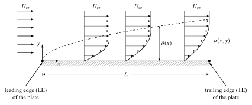
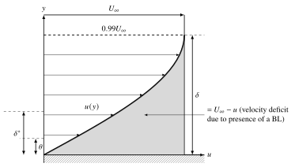
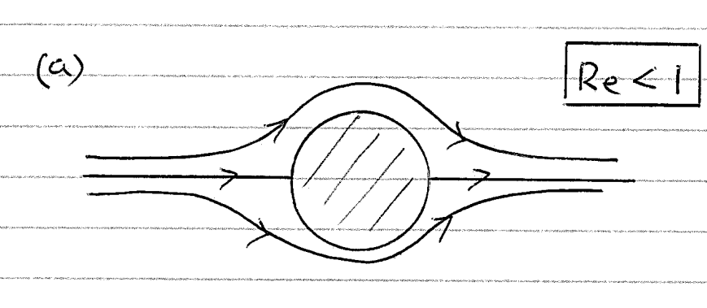
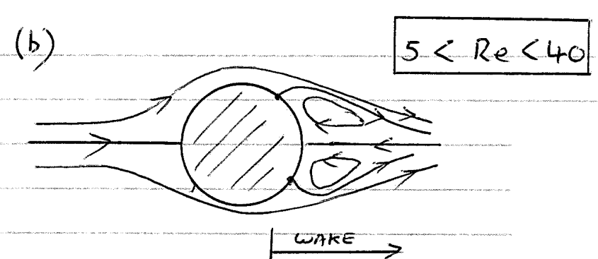
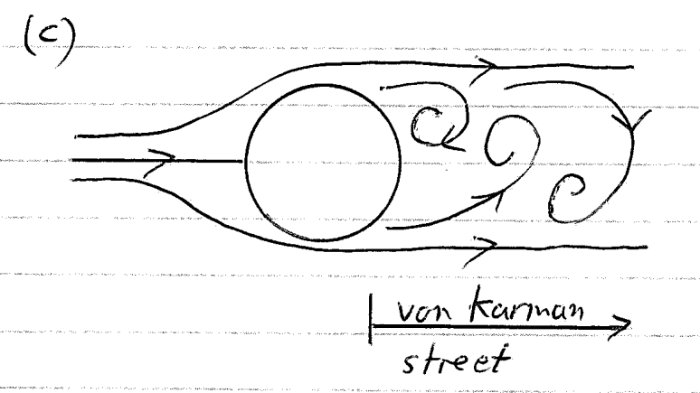



::: {.outcomes}
By the end of this chapter you should be able to:

- explain the boundary-layer concept and define and calculate the nominal, displacement and momentum thicknesses and the shape factor $H$;
- use an order-of-magnitude analysis to derive Prandtl's boundary-layer equations and the scalings $\delta/L \sim Re_L^{-1/2}$ and $C_f \sim Re_L^{-1/2}$;
- apply the Blasius solution and the momentum integral equation to laminar and turbulent flat-plate boundary layers, including combined laminar/turbulent plates (virtual origin);
- describe the structure of a turbulent boundary layer using wall units, the viscous sub-layer, the log law and the defect law;
- explain why and where boundary layers separate, and why turbulent boundary layers resist separation better than laminar ones.
:::

One of the most important advances in fluid mechanics was that made by Prandtl (1904) when he suggested that fluid motion around and through objects could be divided into two distinct regions: a thin region close to the surface of the object where frictional (viscous) effects are important; an outer region where they may be neglected. The influence of viscosity at high Reynolds numbers is confined to a very thin layer in the immediate neighbourhood of a solid surface/wall. The fact that at the surface the fluid adheres to it means that frictional forces retard the motion of the fluid in this thin layer. In it the velocity of the fluid increases from zero at the surface (no-slip) to its full value which corresponds to that of the external frictionless flow. It is this region of the flow that is termed the **Boundary Layer (BL)**; the entire concept being due to Prandtl.

It is convenient to split the topic of BLs into internal and external flow situations. While the PDEs describing them are essentially the same, the boundary conditions involved are different so that the resulting flows are entirely different. In the case of internal (confined) flows, viscous BLs grow from the containing side walls, meet downstream and can fill the entire confining geometry --- for example in the case of flows in pipes and ducts; viscous shear is the dominant effect. External flows on the other hand, are unconfined and free to expand no matter how thick the viscous layer concerned grows. Such immersed-body flows are commonly encountered in engineering investigations involving: aerodynamics (aircraft, missiles, projectiles, etc.); hydrodynamics (ships, sluice ways, submarines, etc.); transportation (cars, trucks, trains, bicycles, etc.); wind energy and power generation (buildings, bridges, wind turbines, turbomachinery, etc.).

The focus of this Chapter is, in the main, external flow; the less complicated scenario will be explored firstly, namely **laminar** BL flow, followed by **turbulent** BLs. In essence we shall be looking in particular at the basic character of flow with friction and will examine the methods for determining: the size of the BL; the resulting velocity distribution through a BL; the pressure distribution within a BL; the force (drag) exerted by a moving fluid at a solid surface/wall; and, finally, when and why a BL separates from the surface. However, before considering the details of the governing equations and the solution of BL flows we begin by making some general observations of engineering importance concerning the physical character of a BL.

## The Physical Characteristics of a BL {#sec-bl-physical}

Numerous experiments, involving flow visualisation, have revealed that in the case of flow over a flat plate, the thickness of the BL that forms increases along the plate in the direction of flow; this is illustrated diagrammatically in @fig-flat-plate-bl.

{#fig-flat-plate-bl width=90%}

In front of the leading edge (LE) of the plate the velocity distribution is uniform; with increasing distance from the LE, in the direction of flow, the thickness, $\delta$, of the retarding layer increases continuously (i.e. grows) as increasing quantities of fluid become affected. Even in the case of small fluid viscosity (i.e. large Reynolds number) the frictional shear stress $\tau = \mu\, \partial u / \partial y$ in the BL is large because $\partial u / \partial y$ is large. Outside of the BL, $\partial u / \partial y$ is small. Such a division (or demarcation) enables, as we shall see subsequently, a considerable simplification of the theory associated with BL flow.

How thin is "thin"? Experiments show that the relative thickness $\delta/L$ becomes smaller as the Reynolds number increases, and in the limit of frictionless flow ($\nu \to 0$) the BL vanishes altogether. In @sec-bl-equations a single order-of-magnitude analysis of the governing equations will make this precise, showing that $\delta/L \sim Re_L^{-1/2}$, and will at the same time tell us how the wall shear stress and the drag of the plate scale with the Reynolds number.

The decelerated fluid elements in the BL do not, in all cases, remain in the thin layer that adheres to a body surface along its whole wetted length (the region over which the fluid and surface are in contact --- for a body fully submerged within a moving fluid this will be its entire surface). In some cases the flow in the BL reverses and the decelerated fluid is forced away from the wall: the BL **separates**. Separation is responsible for the large drag of bluff bodies such as cylinders and spheres and for the stall of aerofoils. We return to it in @sec-separation, at the end of the chapter, once we have the tools (the BL equations, the shape factor and the turbulent BL) needed to explain it.

::: {.try-problems data-sec="sec-bl-physical"}
:::

## Definitions of Boundary Layer Thickness {#sec-bl-thickness}

Defining the boundary layer thickness (BLT) is somewhat arbitrary because the transition from the velocity in the BL to that outside the BL has to be continuous and take place asymptotically. However, this is of less importance practically since the velocity in the BL is found to quickly attain a value which is very close to the external velocity at a small distance from the surface. Below we provide commonly-used measures of the BLT, namely: the **nominal**, $\delta$, the **displacement**, $\delta^*$, and the **momentum**, $\theta$, thickness, as shown in @fig-bl-thickness and defined below.

{#fig-bl-thickness width=75%}

**i) Nominal thickness, $\delta$:** defined as the distance from the wall at which $u = 0.99\, U_\infty$; a simple definition which is widely used.

**ii) Displacement thickness, $\delta^*$:** defined by $\delta^* U_\infty = \int_{0}^{\infty} (U_\infty - u)\, dy$; which, dividing through by $U_\infty$, gives

::: {.callout-tip icon=false}
## Definition: displacement thickness

$$
\delta^* = \int_{0}^{\infty} \left(1 - \frac{u}{U_\infty}\right) dy
$$ {#eq-delta-star}
:::

which is equivalent to saying the BL displaces the external flow a distance $\delta^*$ from the surface due to the low mass flow within it.

**iii) Momentum thickness, $\theta$:** derived by considering the momentum lost as a consequence of the drag at the surface. The total lost momentum flux $= \rho \int_{0}^{\infty} (U_\infty - u)\, u\, dy$ which can be equated to the equivalent momentum flux in the mainstream contained within a strip of thickness $\theta$, namely $\rho U_\infty^2 \theta \times \text{unit width}$, giving:

$$
\rho U_\infty^2 \theta = \rho \int_{0}^{\infty} (U_\infty - u)\, u\, dy
$$

which, on dividing through by $\rho U_\infty^2$, gives:

::: {.callout-tip icon=false}
## Definition: momentum thickness

$$
\theta = \int_{0}^{\infty} \left(1 - \frac{u}{U_\infty}\right)\frac{u}{U_\infty}\, dy
$$ {#eq-theta}
:::

One can similarly define a kinetic energy thickness, $\delta_k$:
$$
\delta_k = \int_{0}^{\infty} \left(1 - \left[\frac{u}{U_\infty}\right]^2\right)\frac{u}{U_\infty}\, dy
$$
and an enthalpy thickness, $\delta_h$:
$$
\delta_h = \int_{0}^{\infty} \left(\frac{h}{h_\infty} - 1\right)\frac{\rho u}{\rho_\infty U_\infty}\, dy
$$
(note the density is likely to vary if the temperature changes).

### Shape factor {#sec-shape-factor}

It is convenient to define a shape factor, $H$, given by:

::: {.callout-tip icon=false}
## Definition: shape factor

$$
H = \frac{\delta^*}{\theta}
$$ {#eq-shape-factor}
:::

as it enables one to discriminate between a BL that is turbulent and one that is laminar. A turbulent BL is "fuller" as a result of turbulent momentum exchange via eddies (i.e. the Reynolds stresses). For a discussion of the characteristics of turbulence see [Chapter 3](ch3.qmd). For example, for flow over a flat plate: a laminar BL would have a $H$ value of $\approx 2.6$, while for a turbulent BL the value of $H$ would typically be $\approx 1.4$. So for the same $\delta^*$, $\theta$ is greater for a turbulent BL, i.e. $\theta_{\text{turb}} > \theta_{\text{lam}}$; implying the greater momentum loss represents a higher drag on the surface of the plate due to the turbulent (Reynolds) stresses in the BL. We shall see in @sec-separation that $H$ is also a useful indicator of how close a BL is to separating.

::: {.callout-caution collapse="true" icon=false}
## Check your understanding
1. Without calculating anything, put $\delta$, $\delta^*$ and $\theta$ in order of size for any BL profile with $0 \le u \le U_\infty$.
2. A BL has $\delta^* = 2$ mm on a wall of a wind tunnel. By how much should the wall be moved outwards so that the inviscid core sees the same mass flow as if there were no BL?

*Answers:* (1) $\theta < \delta^* < \delta$: the integrand of $\theta$ is the integrand of $\delta^*$ multiplied by $u/U_\infty \le 1$, and the integrand of $\delta^*$ is at most 1 and falls to (almost) zero for $y > \delta$. (2) By $\delta^* = 2$ mm: that is exactly the meaning of the displacement thickness.
:::

::: {.try-problems data-sec="sec-bl-thickness"}
**Try these problems:** [Problem 4.1](../problems/index.qmd#p4-1)
:::

## Boundary Layer Equations for 2D Flow {#sec-bl-equations}

Here we examine the limiting case of very small viscosity, namely large Reynolds number, recalling that in the bulk of the flow, that is away from the surface concerned, fluid inertia forces predominate with the influence of viscous forces being vanishingly small. In order to do so we consider the simplified case of the two-dimensional flow of a fluid with small viscosity along a body with a slender cross-section as illustrated in @fig-slender-body. With the exception of the immediate neighbourhood of the surface where the BL forms, the velocities are of the order of the approaching free stream, $U_{FS}$, and the streamline pattern and velocity distribution deviate only slightly from those in the surrounding frictionless flow.

{#fig-slender-body width=85%}

We now carry out an order-of-magnitude analysis of the continuity and Navier--Stokes equations, derived in [Chapter 2](ch2.qmd#sec-ns-special). This single analysis tells us (i) how thin the BL is, (ii) which terms of the equations can be dropped inside it, (iii) how the pressure varies across it and (iv) how the wall shear stress and the drag scale with the Reynolds number.

### Order-of-magnitude analysis {#sec-scaling}

In the context of the flow shown in @fig-slender-body, we begin by assuming the surface to be flat and coincident with the $x$-axis; the $y$-axis is perpendicular to it. In the absence of a body force (the effect of gravity in a BL will be negligible), the N--S equations for two-dimensional incompressible flow are:

$$
\frac{\partial u}{\partial t} + u\frac{\partial u}{\partial x} + v\frac{\partial u}{\partial y} = -\frac{1}{\rho}\frac{\partial p}{\partial x} + \frac{\mu}{\rho}\left(\frac{\partial^2 u}{\partial x^2} + \frac{\partial^2 u}{\partial y^2}\right)
$$ {#eq-ns-x}

$$
\frac{\partial v}{\partial t} + u\frac{\partial v}{\partial x} + v\frac{\partial v}{\partial y} = -\frac{1}{\rho}\frac{\partial p}{\partial y} + \frac{\mu}{\rho}\left(\frac{\partial^2 v}{\partial x^2} + \frac{\partial^2 v}{\partial y^2}\right)
$$ {#eq-ns-y}

We note, as stated in the caption of @fig-flat-plate-bl, that $\delta \ll L$; as a consequence $x$ and $y$ will scale differently, as indeed will $u$ and $v$!

Next we write the continuity and N--S equations in dimensionless form by referring all velocities to the freestream velocity $U_{FS}$ and by referring all linear dimensions to the characteristic length $L$ of the body, which is selected to ensure the dimensionless derivatives with respect to $x$ do not exceed unity in the region under consideration (i.e. the BL). The pressure is made dimensionless with respect to $\rho U_{FS}^2$ and the time with respect to $L/U_{FS}$. Accordingly the dimensionless quantities, denoted with a $\sim$ over the top, are:

$$
\begin{aligned}
\tilde{x} &= \frac{x}{L} \sim \mathcal{O}(1), & \tilde{y} &= \frac{y}{L} \sim \mathcal{O}(\epsilon), \quad \text{where } \epsilon = \frac{\delta}{L} \ll 1, \\
\tilde{u} &= \frac{u}{U_{FS}} \sim \mathcal{O}(1), & \tilde{v} &= \frac{v}{U_{FS}} \sim \mathcal{O}(?), \\
\tilde{t} &= \frac{t}{L/U_{FS}} \sim \mathcal{O}(1), & \tilde{p} &= \frac{p}{\rho U_{FS}^2} \sim \mathcal{O}(?),
\end{aligned}
$$

so that inside the BL $\partial/\partial \tilde{x} \sim \mathcal{O}(1)$ while $\partial/\partial \tilde{y} \sim \mathcal{O}(1/\epsilon)$: gradients across the layer are much larger than gradients along it. The Reynolds number is $Re = \rho U_{FS} L/\mu$.

**Continuity equation:** we write the continuity equation in dimensionless form to find the order of magnitude of $v$:

$$
\del \cdot \vect{q} = \frac{\partial u}{\partial x} + \frac{\partial v}{\partial y} = 0
\quad\Longrightarrow\quad
\frac{\partial \tilde{u}}{\partial \tilde{x}} + \frac{\partial \tilde{v}}{\partial \tilde{y}} = 0,
$$ {#eq-continuity-nd}

which in terms of orders of magnitude gives

$$
\frac{\mathcal{O}(1)}{\mathcal{O}(1)} + \frac{\mathcal{O}(?)}{\mathcal{O}(\epsilon)} = 0
\quad\Longrightarrow\quad
\frac{\partial \tilde{v}}{\partial \tilde{y}} \sim \frac{\mathcal{O}(\epsilon)}{\mathcal{O}(\epsilon)},
$$

hence by inspection $\tilde{v} \sim \mathcal{O}(\epsilon)$: the velocity normal to the wall is much smaller than the velocity along it.

**$x$-momentum equation:** @eq-ns-x in non-dimensional form becomes

$$
\frac{\partial \tilde{u}}{\partial \tilde{t}} + \tilde{u}\frac{\partial \tilde{u}}{\partial \tilde{x}} + \tilde{v}\frac{\partial \tilde{u}}{\partial \tilde{y}} = -\frac{\partial \tilde{p}}{\partial \tilde{x}} + \frac{1}{Re}\left( \frac{\partial^2 \tilde{u}}{\partial \tilde{x}^2} + \frac{\partial^2 \tilde{u}}{\partial \tilde{y}^2} \right).
$$ {#eq-xmom-nd}

It should come as no surprise that the Reynolds number appears in front of the viscous terms: scaling the inertia term $\rho u\, \partial u/\partial x$ with $U_{FS}$ and $L$ gives $\rho U_{FS}^2/L$, scaling the viscous term $\mu\, \partial^2 u/\partial x^2$ in the same way gives $\mu U_{FS}/L^2$, and their ratio is

$$
\frac{\rho U_{FS}^2/L}{\mu U_{FS}/L^2} = \frac{\rho U_{FS} L}{\mu} = \frac{U_{FS} L}{\nu} = Re_L.
$$

Expressed in terms of orders of magnitude, @eq-xmom-nd reads:

$$
\frac{\mathcal{O}(1)}{\mathcal{O}(1)} + \mathcal{O}(1)\frac{\mathcal{O}(1)}{\mathcal{O}(1)} + \mathcal{O}(\epsilon)\frac{\mathcal{O}(1)}{\mathcal{O}(\epsilon)} = -\frac{\partial \tilde{p}}{\partial \tilde{x}} + \frac{1}{Re}\left[ \frac{\mathcal{O}(1)}{\mathcal{O}(1)} + \frac{\mathcal{O}(1)}{\mathcal{O}(\epsilon^2)} \right]
$$

Noting that from the fundamental requirement of the analysis $\epsilon \ll 1$, the first viscous term is negligible compared with the second, and the above simplifies to

$$
\underbrace{\mathcal{O}(1)}_{\text{inertia effects}} = -\frac{\partial \tilde{p}}{\partial \tilde{x}} + \underbrace{\frac{1}{Re}\, \frac{1}{\mathcal{O}(\epsilon^2)}}_{\text{viscous effects}}
$$

Inside the BL, friction forces are, by definition, of the same order as inertia forces (outside it they are negligible). For the inertial effects to be of the same order as the viscous effects in the BL we therefore need

$$
\frac{1}{Re} \sim \epsilon^2 ,
$$ {#eq-re-epsilon}

i.e. the Reynolds number (based on a surface length $L$) must be large. In dimensional terms @eq-re-epsilon simply states that the inertia force per unit volume, $\rho u\, \partial u/\partial x \sim \rho U_{FS}^2/L$, balances the friction force per unit volume, $\partial \tau/\partial y = \mu\, \partial^2 u/\partial y^2 \sim \mu U_{FS}/\delta^2$ (recall $\partial u/\partial y \sim U_{FS}/\delta$ across the layer).

**$y$-momentum equation:** following the same procedure for @eq-ns-y we have

$$
\frac{\partial \tilde{v}}{\partial \tilde{t}} + \tilde{u}\frac{\partial \tilde{v}}{\partial \tilde{x}} + \tilde{v}\frac{\partial \tilde{v}}{\partial \tilde{y}} = -\frac{\partial \tilde{p}}{\partial \tilde{y}} + \frac{1}{Re}\left( \frac{\partial^2 \tilde{v}}{\partial \tilde{x}^2} + \frac{\partial^2 \tilde{v}}{\partial \tilde{y}^2} \right)
$$ {#eq-ymom-nd}

which, using $1/Re \sim \epsilon^2$, in order-of-magnitude terms gives:

$$
\frac{\mathcal{O}(\epsilon)}{\mathcal{O}(1)} + \mathcal{O}(1)\frac{\mathcal{O}(\epsilon)}{\mathcal{O}(1)} + \mathcal{O}(\epsilon)\frac{\mathcal{O}(\epsilon)}{\mathcal{O}(\epsilon)} = -\frac{\partial \tilde{p}}{\partial \tilde{y}} + \mathcal{O}(\epsilon^2)\left( \frac{\mathcal{O}(\epsilon)}{\mathcal{O}(1)} + \frac{\mathcal{O}(\epsilon)}{\mathcal{O}(\epsilon^2)} \right)
$$

Accordingly $\partial \tilde{p}/\partial \tilde{y} \sim \mathcal{O}(\epsilon)$, so the change in pressure across the layer, of thickness $\tilde{y} \sim \epsilon$, is only $\Delta \tilde{p} \sim \mathcal{O}(\epsilon^2)$. Because $\epsilon \ll 1$, the pressure variation across the boundary layer is negligible compared with the $\mathcal{O}(1)$ terms in the $x$-momentum equation. To leading order, we can approximate this as:

$$
\frac{\partial \tilde{p}}{\partial \tilde{y}} = 0.
$$ {#eq-dpdy-zero}

This is known as the **Prandtl boundary layer assumption**; that is, the pressure across the BL is uniform. Thus $p = p(x)$ only and is determined by the outer mainstream flow. The pressure in a direction normal to the BL is effectively constant and can be assumed equal to that at the outer edge of the BL where its value is determined by the frictionless flow there. It may therefore be regarded as a known function as far as the BL is concerned and it depends only on $x$ when the flow is steady.

At the outer edge of the BL, the parallel component of $u$ becomes equal to that in the outer flow, $U_\infty(x)$, assuming steady flow. Since there is no large velocity gradient here, the viscous terms in @eq-ns-x vanish for large values of $Re$, and consequently, in the outer flow we obtain:

$$
U_\infty \frac{dU_\infty}{dx} = -\frac{1}{\rho}\frac{dp}{dx}
$$ {#eq-outer-flow}

Note that the quantities in the above equation are dimensional! @eq-outer-flow is a function of $x$ only since $p = p(x)$ and $U_\infty = U_\infty(x)$, which we emphasise by writing $dp/dx$. Integrating gives Bernoulli's equation for the outer flow:

$$
p + \frac{1}{2}\rho U_\infty^2 = \text{constant}.
$$ {#eq-bernoulli}

Equivalently, the pressure gradient impressed on the BL is

$$
-\frac{1}{\rho}\frac{dp}{dx} = U_\infty \frac{dU_\infty}{dx}.
$$ {#eq-dpdx}

### Prandtl's boundary layer equations {#sec-prandtl-equations}

In summary we are in a position to write down the simplified continuity and Navier--Stokes equations known as **Prandtl's BL equations**, for steady flow. Reverting back to dimensional quantities, these equations, based on the BL assumption that $\delta/L = \epsilon \ll 1$, together with small kinematic viscosity and hence high $Re$, are:

::: {.callout-tip icon=false}
## Definition: Prandtl's BL equations (steady, 2D)

$$
\frac{\partial u}{\partial x} + \frac{\partial v}{\partial y} = 0
$$ {#eq-prandtl-continuity}

$$
u\frac{\partial u}{\partial x} + v\frac{\partial u}{\partial y} = -\frac{1}{\rho}\frac{dp}{dx} + \nu \frac{\partial^2 u}{\partial y^2}
$$ {#eq-prandtl-x}

with boundary conditions:

$$
\begin{aligned}
\text{at } y &= 0: \quad u = 0, \quad v = 0, \\
\text{at } y &= \infty: \quad u = U_\infty(x)
\end{aligned}
$$ {#eq-prandtl-bc}

(in practice the upper BC is applied at $y = \delta$).
:::

It is worth noting that the inviscid flow velocity $U_\infty(x)$ remains to be determined/specified. It defines the pressure distribution impressed on the BL via @eq-bernoulli and hence $dp/dx$ via @eq-dpdx.

The simplification achieved above is considerable:

- The nonlinear character of the N--S equations has been preserved but of the original equations, one equation (motion normal to the wall, i.e. the $y$-momentum equation) has been dropped completely.
- We are left with a system of two simultaneous equations for the two unknowns, $u$ and $v$.
- The pressure ceases to be an unknown function as it can be evaluated from the inviscid flow just outside the BL with the aid of Bernoulli's equation @eq-bernoulli.
- Furthermore, one viscous term in the remaining equation of motion ($\nu\, \partial^2 u/\partial x^2$) has also been dropped.

In the case of BL flow on curved surfaces at high Reynolds numbers, a similar set of equations, following a coordinate transformation, can be derived. They are omitted here since in general @eq-prandtl-continuity and @eq-prandtl-x together with the BCs @eq-prandtl-bc can be applied to BL flow on a curved surface also; provided that there are no large variations in curvature such as would occur near sharp edges.

### Consequences: BL thickness, wall shear stress and drag {#sec-bl-scaling}

The same analysis now gives us estimates of the BL thickness and of the friction drag. From the fact that $1/Re \sim \epsilon^2 = \delta^2/L^2$ (@eq-re-epsilon) we have that

$$
\frac{\mu}{\rho U_{FS} L} \sim \frac{\delta^2}{L^2}
\quad\Longrightarrow\quad
\delta \sim \sqrt{\frac{\nu L}{U_{FS}}}, \qquad
\frac{\delta}{L} \sim \sqrt{\frac{\nu}{U_{FS} L}} = \frac{1}{\sqrt{Re_L}}.
$$ {#eq-delta-scaling}

It can be seen from @eq-delta-scaling that the BL thickness, $\delta$, is proportional to $\sqrt{\nu}$ and to $\sqrt{L}$. If $L$ is replaced by the variable distance $x$ from the LE of the plate then $\delta$ increases proportionally with $\sqrt{x}$:

$$
\delta(x) \sim \sqrt{\frac{\nu x}{U_\infty}} .
$$ {#eq-delta-x-scaling}

Alternatively, @eq-delta-scaling tells us that the relative BL thickness, $\delta/L$, decreases with increasing $Re$ at a rate equal to $1/\sqrt{Re_L}$, so in the limiting case of frictionless flow, $\nu \to 0$ and $Re \to \infty$, the BL thickness vanishes.

We are now in a position to estimate the shear stress, $\tau|_{y=0}$, at the surface and consequently the total drag of the plate; $\tau|_{y=0}$ is given by

$$
\tau|_{y=0} = \mu \left( \frac{\partial u}{\partial y} \right)_{y=0} .
$$

For a flat plate $U_{FS} = U_\infty$. Using the estimate $(\partial u / \partial y)_{y=0} \sim U_\infty / \delta$ we obtain $\tau|_{y=0} \sim \mu U_\infty/\delta$ which, on inserting $\delta$ from @eq-delta-scaling, gives:

$$
\tau|_{y=0} \sim \mu U_\infty \sqrt{\frac{\rho U_\infty}{\mu L}} = \sqrt{\frac{\mu \rho U_\infty^3}{L}};
$$ {#eq-tauw-scaling}

thus the frictional shear stress at the wall will be proportional to $U_\infty^{3/2}$. We can now define a dimensionless stress with reference to the product $\rho U_\infty^2$:

$$
\frac{\tau|_{y=0}}{\rho U_\infty^2} \sim \sqrt{\frac{\mu}{\rho U_\infty L}} = \sqrt{\frac{\nu}{U_\infty L}} = \frac{1}{\sqrt{Re_L}}.
$$

The total drag, $D$, of the plate is of order $B \times L \times \tau|_{y=0}$ where $B$ is the width of the plate. Hence with the aid of @eq-tauw-scaling we have:

$$
D \sim B \sqrt{\rho \mu U_\infty^3 L}
$$ {#eq-drag-scaling}

Thus $D$ is seen to be proportional to $U_\infty^{3/2}$, and @eq-drag-scaling also tells us that doubling the length of the plate will not double the drag (it increases it by a factor $\sqrt{2}$). This can be understood by considering that the downstream section of the plate experiences a smaller shear stress than the leading (upstream) section because the BL is thicker towards the TE of the plate.

Finally we can write down an estimate for the dimensionless drag (skin-friction) coefficient for which the reference area is $A = B \times L$ (the conventional factor $\tfrac{1}{2}$ in the denominator is irrelevant for an order-of-magnitude estimate):

$$
C_D = \frac{D}{\rho U_\infty^2 A} \sim \frac{B\sqrt{\rho \mu U_\infty^3 L}}{\rho U_\infty^2\, B L} = \sqrt{\frac{\mu}{\rho L U_\infty}},
$$

or

::: {.callout-tip icon=false}
## Key result: laminar BL scaling

$$
\frac{\delta}{L} \sim \frac{1}{\sqrt{Re_L}}, \qquad
C_f \sim \frac{\tau|_{y=0}}{\rho U_\infty^2} \sim \frac{1}{\sqrt{Re_L}}, \qquad
D \sim B\sqrt{\rho\mu U_\infty^3 L}.
$$ {#eq-cf-scaling}
:::

It is important to note that in all of the estimates @eq-delta-scaling to @eq-cf-scaling we are short of constants of proportionality to make them applicable; these are supplied by the Blasius solution in the next section.

::: {.callout-caution collapse="true" icon=false}
## Check your understanding
1. Why can $\nu\,\partial^2 u/\partial x^2$ be dropped from the $x$-momentum equation, but not $\nu\,\partial^2 u/\partial y^2$?
2. The free-stream speed over a plate is increased by a factor of 4. By what factor do (a) $\delta$ at the trailing edge and (b) the laminar friction drag change?

*Answers:* (1) Inside the BL $\partial/\partial y \sim 1/\delta \gg \partial/\partial x \sim 1/L$, so $\partial^2 u/\partial x^2$ is smaller than $\partial^2 u/\partial y^2$ by a factor $\epsilon^2 = (\delta/L)^2$. The $y$-derivative term must be kept because it is what balances inertia inside the layer. (2) (a) $\delta \propto U_\infty^{-1/2}$, so $\delta$ halves; (b) $D \propto U_\infty^{3/2}$, so the drag increases by $4^{3/2} = 8$ (provided the BL stays laminar).
:::

::: {.try-problems data-sec="sec-bl-equations"}
**Try these problems:** [Problem 4.2](../problems/index.qmd#p4-2), [Problem 4.3](../problems/index.qmd#p4-3)
:::

## Blasius' Solution: Laminar Boundary Layer Flow Over a Flat Plate {#sec-blasius}

When the BL equations @eq-prandtl-continuity and @eq-prandtl-x are integrated, the velocity distribution can be determined. This in turn allows us to calculate the viscous drag (skin friction) on the surface by a simple process of integrating the shear stress at the surface, given by $\tau|_{y=0}$ where

$$
\tau|_{y=0} = \mu \left( \frac{\partial u}{\partial y} \right)_{y=0}.
$$

The viscous drag in the case of 2D flow is given by:

$$
D_f = b \int_{x=0}^{l} \tau|_{y=0} \cos \phi \, dx,
$$ {#eq-drag-integral}

where $b$ denotes the width of the surface perpendicular to the freestream, $l$ is the length of the surface, $\phi$ is the angle between the tangent to the surface and the freestream velocity $U_{FS}$, $x$ is measured along the surface (as in @fig-slender-body) and $s$ is the coordinate pointing in the direction of the freestream flow with the same origin as $x$ and $y$, as shown in @fig-slender-body, such that $ds = \cos \phi \, dx$: only the streamwise component of the wall shear force contributes to the drag, and $D_f = b\int \tau|_{y=0}\, ds$. For a flat plate at zero incidence ($\phi = 0$) $s$ and $x$ coincide and $l = L$, in which case $D_f$ becomes:

$$
D_f = b \int_{0}^{L} \mu \left( \frac{\partial u}{\partial y} \right)_{y=0} dx.
$$ {#eq-drag-plate}

In order to calculate the skin friction it is necessary to know the velocity gradient at the wall, which can be achieved only through the integration of the BL equations. If separation occurs before the trailing edge is reached, @eq-drag-plate is valid only up to the point of separation (see @sec-separation). Note also that if the laminar BL transforms at some point along the plate into a turbulent boundary layer then @eq-drag-plate applies only as far as the point of transition. Beyond this point there will be turbulent friction --- we shall discuss this in @sec-turbulent-bl to @sec-combined-bl.

Although the BL equations have been simplified to a great extent when compared to the continuity and N--S equations, they are still very difficult to solve. The integration of the BL equations is cumbersome and time consuming so that from an engineering point of view it is often sufficient to adopt an approximate method of solution to be applied in situations when an exact solution of the BL equations cannot be achieved without a considerable amount of work.

The classical and most widely used solution of the BL equations, which can be considered exact, is for flat plate flow as provided by Blasius in 1908; Blasius being a student of Prandtl. It is based on the assumption that the BL has a zero pressure gradient, $dp/dx = 0$, or $p = p_\infty \implies U_\infty(x) = U_\infty = \text{constant}$, and is summarised below for completeness.

### Blasius' derivation {#sec-blasius-derivation}

For the laminar flow of a viscous, incompressible fluid past a thin flat plate placed parallel to a uniform freestream velocity field, $U_{FS}$, the velocity $U_\infty(x)$ can be taken to be equal to $U_{FS}$ and therefore constant such that $dU_\infty/dx = 0$; the implication being, via @eq-dpdx, that the pressure in the BL is constant and $dp/dx = 0$ everywhere within the BL. In this case the Prandtl BL equations for steady flow reduce to

$$
\frac{\partial u}{\partial x} + \frac{\partial v}{\partial y} = 0
$$ {#eq-blasius-continuity}

$$
u\frac{\partial u}{\partial x} + v\frac{\partial u}{\partial y} = \nu \frac{\partial^2 u}{\partial y^2}
$$ {#eq-blasius-xmom}

in addition to which the following BCs have to be satisfied by $u$ and $v$:

$$
\begin{aligned}
\text{at } y &= 0: \quad u = v = 0, \\
\text{at } y &= \infty \ (\text{in practice } y \gtrsim \delta): \quad u = U_\infty .
\end{aligned}
$$ {#eq-blasius-pde-bc}

The characteristic parameters for the problem are $U_\infty, \nu, x, y$ --- i.e. the problem is defined completely by these 4 parameters and hence a nondimensional grouping of the same. To identify the grouping, Blasius made use of the following observation to employ an ingenious transformation of @eq-blasius-continuity and @eq-blasius-xmom and hence their solution. From the scaling analysis of @sec-bl-scaling, the local boundary layer thickness grows as (@eq-delta-x-scaling)

$$
\delta(x) \sim \sqrt{\frac{\nu x}{U_\infty}} .
$$

To solve the partial differential equations @eq-blasius-continuity and @eq-blasius-xmom, we seek a similarity solution. We introduce a dimensionless similarity variable, $\eta$, defined as:

$$
\eta = y \sqrt{\frac{U_\infty}{\nu x}}
$$ {#eq-blasius-eta}

**Physical interpretation:** why did Blasius choose this specific mathematical grouping? Recall from our scaling arguments that the boundary layer thickness grows proportionally to $\sqrt{\nu x / U_\infty}$. Therefore, our similarity variable $\eta$ is essentially a scaled vertical coordinate ($\eta \propto y/\delta(x)$). It implies that the dimensionless velocity profile should look identical at any location $x$ along the plate, provided we scale our physical distance from the wall ($y$) by a factor proportional to the local boundary layer thickness.

Using this similarity variable, we postulate that the nondimensional velocity profile depends only on $\eta$:

$$
\frac{u}{U_\infty} = f'(\eta)
$$ {#eq-blasius-fprime}

where the prime denotes differentiation with respect to $\eta$. Omitting the algebraic details (they are given in the box below), the following relationships emerge:

$$
v = \frac{1}{2}\sqrt{\frac{\nu U_\infty}{x}}\,[\eta f' - f], \qquad
\frac{\partial \eta}{\partial y} = \sqrt{\frac{U_\infty}{\nu x}}, \qquad
\frac{\partial \eta}{\partial x} = -\frac{1}{2}\frac{\eta}{x},
$$

$$
\frac{\partial u}{\partial x} = -\frac{U_\infty}{2}\frac{\eta}{x}f'', \qquad
\frac{\partial u}{\partial y} = U_\infty\sqrt{\frac{U_\infty}{\nu x}}\,f'', \qquad
\frac{\partial^2 u}{\partial y^2} = \frac{U_\infty^2}{\nu x}f'''
$$ {#eq-blasius-derivs}

and we arrive, after some more algebra, at the following single third-order nonlinear ODE for the unknown $f$:

::: {.callout-tip icon=false}
## Definition: the Blasius equation

$$
f''' + \frac{1}{2}ff'' = 0
$$ {#eq-blasius}

with associated BCs:

$$
\begin{aligned}
\text{at } \eta &= 0: \quad f = 0, \quad f' = 0, \\
\text{as } \eta &\to \infty: \quad f' = 1 .
\end{aligned}
$$ {#eq-blasius-bc}
:::

::: {.callout-note collapse="true" icon=false}
## The algebra behind @eq-blasius (optional)
Continuity is satisfied automatically by a stream function $\psi$ with $u = \partial\psi/\partial y$, $v = -\partial\psi/\partial x$. Choosing $\psi = \sqrt{\nu U_\infty x}\, f(\eta)$ gives $u = \sqrt{\nu U_\infty x}\, f'\, \partial\eta/\partial y = U_\infty f'$, which is @eq-blasius-fprime, and
$$
v = -\frac{\partial\psi}{\partial x} = -\frac{1}{2}\sqrt{\frac{\nu U_\infty}{x}}\, f - \sqrt{\nu U_\infty x}\, f' \frac{\partial \eta}{\partial x} = \frac{1}{2}\sqrt{\frac{\nu U_\infty}{x}}\,[\eta f' - f].
$$
Substituting @eq-blasius-derivs into the left-hand side of @eq-blasius-xmom:
$$
\begin{aligned}
u\frac{\partial u}{\partial x} + v\frac{\partial u}{\partial y}
&= -\frac{U_\infty^2}{2x}\,\eta f' f'' + \frac{U_\infty^2}{2x}\,(\eta f' - f)\, f'' \\
&= -\frac{U_\infty^2}{2x}\, f f'' ,
\end{aligned}
$$
while the right-hand side is $\nu\, \partial^2 u/\partial y^2 = (U_\infty^2/x)\, f'''$. Equating and cancelling $U_\infty^2/x$ gives $f''' + \tfrac{1}{2} f f'' = 0$. The BCs follow from $u = v = 0$ at $y = 0$ ($f' = 0$, $f = 0$) and $u \to U_\infty$ as $y \to \infty$ ($f' \to 1$).
:::

@eq-blasius is called the **Blasius equation**, the accurate numerical solution of which has been obtained by numerous authors; one that is often quoted is that of Howarth (1938). It is a boundary-value problem: $f''(0)$ is not known in advance, and is found by "shooting" --- guessing $f''(0)$, integrating outwards and adjusting the guess until $f' \to 1$. Doing this gives $f''(0) = 0.33206$. The solution is tabulated in @tbl-blasius (open the box) and plotted in the interactive figure below, which solves the equation in your browser in exactly this way.

::: {.callout-note collapse="true" icon=false}
## Numerical solution of the Blasius equation (table)

| $\eta$ | $f$ | $f'$ | $f''$ | $\eta$ | $f$ | $f'$ | $f''$ |
|:-:|:-:|:-:|:-:|:-:|:-:|:-:|:-:|
| 0.0 | 0.00000 | 0.00000 | 0.33206 | 4.6 | 2.88825 | 0.98268 | 0.02948 |
| 0.2 | 0.00664 | 0.06641 | 0.33198 | 4.8 | 3.08532 | 0.98779 | 0.02187 |
| 0.4 | 0.02656 | 0.13276 | 0.33147 | 5.0 | 3.28327 | 0.99154 | 0.01591 |
| 0.6 | 0.05973 | 0.19894 | 0.33008 | 5.2 | 3.48187 | 0.99425 | 0.01134 |
| 0.8 | 0.10611 | 0.26471 | 0.32739 | 5.4 | 3.68092 | 0.99616 | 0.00793 |
| 1.0 | 0.16557 | 0.32978 | 0.32301 | 5.6 | 3.88029 | 0.99748 | 0.00543 |
| 1.2 | 0.23795 | 0.39378 | 0.31659 | 5.8 | 4.07988 | 0.99838 | 0.00365 |
| 1.4 | 0.32298 | 0.45626 | 0.30787 | 6.0 | 4.27962 | 0.99897 | 0.00240 |
| 1.6 | 0.42032 | 0.51676 | 0.29666 | 6.2 | 4.47946 | 0.99936 | 0.00155 |
| 1.8 | 0.52952 | 0.57476 | 0.28293 | 6.4 | 4.67936 | 0.99961 | 0.00098 |
| 2.0 | 0.65002 | 0.62977 | 0.26675 | 6.6 | 4.87930 | 0.99977 | 0.00061 |
| 2.2 | 0.78119 | 0.68131 | 0.24835 | 6.8 | 5.07926 | 0.99986 | 0.00037 |
| 2.4 | 0.92229 | 0.72898 | 0.22809 | 7.0 | 5.27924 | 0.99992 | 0.00022 |
| 2.6 | 1.07251 | 0.77246 | 0.20645 | 7.2 | 5.47923 | 0.99996 | 0.00013 |
| 2.8 | 1.23098 | 0.81151 | 0.18401 | 7.4 | 5.67922 | 0.99998 | 0.00007 |
| 3.0 | 1.39681 | 0.84604 | 0.16136 | 7.6 | 5.87922 | 0.99999 | 0.00004 |
| 3.2 | 1.56909 | 0.87608 | 0.13913 | 7.8 | 6.07921 | 0.99999 | 0.00002 |
| 3.4 | 1.74695 | 0.90176 | 0.11788 | 8.0 | 6.27921 | 1.00000 | 0.00001 |
| 3.6 | 1.92953 | 0.92333 | 0.09809 | 8.2 | 6.47921 | 1.00000 | 0.00001 |
| 3.8 | 2.11603 | 0.94112 | 0.08013 | 8.4 | 6.67921 | 1.00000 | 0.00000 |
| 4.0 | 2.30575 | 0.95552 | 0.06423 | 8.6 | 6.87921 | 1.00000 | 0.00000 |
| 4.2 | 2.49804 | 0.96696 | 0.05052 | 8.8 | 7.07921 | 1.00000 | 0.00000 |
| 4.4 | 2.69236 | 0.97587 | 0.03897 |  |  |  |  |

: Numerical solution of the Blasius equation @eq-blasius, with $\eta = y\sqrt{U_\infty/\nu x}$ and $f' = u/U_\infty$. {#tbl-blasius}
:::

::: {.content-visible when-format="html"}
In the interactive figure the red curve is $u/U_\infty = f'(\eta)$ and the dashed purple curve is $f''(\eta)$, which is proportional to the shear stress $\mu\,\partial u/\partial y$ across the layer: it is largest at the wall and decays to zero at the edge of the BL. Move the probe to read off values and compare them with @tbl-blasius.
:::

::: {.content-visible when-format="html"}
<div class="widget" data-widget="blasius" data-approx="none"></div>
:::

::: {.content-visible when-format="pdf"}
*An interactive version of this figure is available in the online notes.*
:::

### Wall shear stress and skin friction {#sec-blasius-friction}

The shear stress on the plate's surface is easily calculated from the results of the Blasius solution:

$$
\tau|_{y=0} = \mu \left(\frac{\partial u}{\partial y}\right)_{y=0} = \frac{\mu U_\infty f''(0)}{\sqrt{\nu x/U_\infty}}
= \frac{0.332}{\sqrt{Re_x}}\, \rho U_\infty^2,
$$ {#eq-blasius-tauw}

where

$$
Re_x = \frac{U_\infty x}{\nu}.
$$

The [local]{.underline} skin-friction (or friction drag) coefficient is given by:

$$
C_f = \frac{\tau|_{y=0}}{\frac{1}{2}\rho U_\infty^2} = \frac{0.664}{\sqrt{Re_x}}
$$ {#eq-blasius-cf}

The total friction force (or drag) per unit width on one side of the plate, of length $L$, is given by:

$$
F = \int_{0}^{L} \tau|_{y=0}\, dx = 0.664\, \rho U_\infty^2 \sqrt{\frac{\nu L}{U_\infty}}
$$ {#eq-blasius-drag}

The [average]{.underline} skin friction (or drag) coefficient is given by:

$$
\overline{C}_f = \frac{F}{\frac{1}{2}\rho U_\infty^2 L} = \frac{1.328}{\sqrt{Re_L}}
$$ {#eq-blasius-cfbar}

These have exactly the form predicted by the scaling analysis, @eq-cf-scaling; the Blasius solution supplies the constants.

### Boundary layer thicknesses {#sec-blasius-thickness}

We can also use the Blasius solution to determine the different BLTs defined in @sec-bl-thickness.

**a) Nominal thickness $\delta$**

According to the BCs @eq-blasius-bc, the velocity in the BL approaches the freestream value asymptotically as $\eta \to \infty$. Therefore, it is customary to define the nominal boundary layer thickness, $\delta$, as the physical point where $u = 0.99 U_\infty$ (i.e. where $f' = 0.99$). From @tbl-blasius, this occurs at $\eta \approx 4.91$, customarily rounded to $\eta \approx 5.0$. Recalling the definition of $\eta$ from @eq-blasius-eta ($\eta = y \sqrt{U_\infty / \nu x}$), we can substitute $y = \delta$ and $\eta = 5.0$ to find the thickness:

$$
5.0 = \frac{\delta}{\sqrt{\nu x/U_\infty}} \quad \Rightarrow \quad \delta = 5.0 \sqrt{\frac{\nu x}{U_\infty}}
$$

Dividing both sides by $x$ yields the nondimensional form:

$$
\frac{\delta}{x} = \frac{5.0}{\sqrt{Re_x}}
$$ {#eq-blasius-delta}

**b) Displacement thickness $\delta^*$**

From @eq-delta-star,
$$
\delta^* = \int_{0}^{\infty} \left(1 - \frac{u}{U_\infty}\right) dy,
$$
which, written using Blasius variables ($y = \eta \sqrt{\nu x / U_\infty}$ and $dy = \sqrt{\nu x / U_\infty}\, d\eta$), becomes:
$$
\delta^* = \sqrt{\frac{\nu x}{U_\infty}} \int_{0}^{\infty} (1 - f')\, d\eta
= \sqrt{\frac{\nu x}{U_\infty}} \lim_{\eta \to \infty} [\eta - f(\eta)]
$$
which, on taking $\lim_{\eta \to \infty} [\eta - f(\eta)]$ to have the value 1.7208 based on the numerical solution (e.g. $8.8 - 7.07921$ in @tbl-blasius), gives
$$
\delta^* = 1.7208 \sqrt{\frac{\nu x}{U_\infty}},
$$
that is:
$$
\frac{\delta^*}{x} = \frac{1.7208}{\sqrt{Re_x}}
$$ {#eq-blasius-dstar}

**c) Momentum thickness $\theta$**

Defined by @eq-theta,
$$
\theta = \int_{0}^{\infty} \left(1 - \frac{u}{U_\infty}\right)\frac{u}{U_\infty}\, dy,
$$
which in Blasius variables becomes
$$
\theta = \sqrt{\frac{\nu x}{U_\infty}} \int_{0}^{\infty} f'(1 - f')\, d\eta,
$$
which can be evaluated numerically to give
$$
\theta = 0.664 \sqrt{\frac{\nu x}{U_\infty}}
$$
and thus
$$
\frac{\theta}{x} = \frac{0.664}{\sqrt{Re_x}} \quad \{ = C_f \}
$$ {#eq-blasius-theta}

(The equality $\theta/x = C_f$ is not a coincidence; it follows from the momentum integral equation of @sec-mie.) Using @eq-blasius-dstar and @eq-blasius-theta we get that for the Blasius solution the shape factor $H$ is given by:
$$
H = \frac{\delta^*}{\theta} = \frac{1.7208}{0.664} = 2.59
$$

The key features of the Blasius solution are that:

- it can be considered exact and the solution of choice for solving laminar BL flow over a flat plate, at zero angle of incidence to the freestream and of length $L$;
- the velocity at the edge of the BL is equal to that of the freestream and is a constant;
- the pressure gradient within the BL is zero.

::: {.callout-tip icon=false}
## Key result: the Blasius solution summarised

$$
\frac{\delta}{x} = 5.0\, Re_x^{-1/2}, \qquad
\frac{\delta^*}{x} = 1.7208\, Re_x^{-1/2}, \qquad
\frac{\theta}{x} = 0.664\, Re_x^{-1/2} \ \{ = C_f \},
$$

$$
\overline{C}_f = 1.328\, Re_L^{-1/2}, \qquad H = 2.59,
$$ {#eq-blasius-summary}

where $Re_x = U_\infty x/\nu$, $Re_L = U_\infty L/\nu$, $\overline{C}_f = \left(2\theta/x\right)_{x=L}$.

So $\delta$, $\delta^*$ and $\theta$ are all $\propto x^{1/2}$.
:::

::: {.callout-note icon=false}
## Worked example 4.1: laminar boundary layer on a flat plate
Air ($\nu = 1.5 \times 10^{-5}$ m²/s, $\rho = 1.2$ kg/m³) flows at $U_\infty = 5$ m/s over a smooth flat plate of length $L = 0.8$ m at zero incidence. Assuming the BL is laminar ($Re_{cr} = 5 \times 10^5$), find at the trailing edge $\delta$, $\delta^*$, $\theta$ and $\tau|_{y=0}$, and the friction drag per unit width on one side of the plate.

```{=html}
<details class="solution"><summary>Show solution</summary>
```

$Re_L = U_\infty L/\nu = 5 \times 0.8/1.5\times10^{-5} = 2.67 \times 10^5 < 5\times10^5$, so the BL is laminar along the whole plate and @eq-blasius-summary applies, with $\sqrt{Re_L} = 516.4$:

$$
\delta = \frac{5.0 \times 0.8}{516.4} = 7.75 \text{ mm}, \quad
\delta^* = \frac{1.7208 \times 0.8}{516.4} = 2.67 \text{ mm}, \quad
\theta = \frac{0.664 \times 0.8}{516.4} = 1.03 \text{ mm}.
$$

Wall shear stress at $x = L$, from @eq-blasius-tauw:
$$
\tau|_{y=0} = \frac{0.332 \times 1.2 \times 5^2}{516.4} = 0.0193 \text{ Pa}.
$$

Drag per unit width (one side), from @eq-blasius-cfbar:
$$
\overline{C}_f = \frac{1.328}{516.4} = 2.57\times 10^{-3}, \qquad
F = \overline{C}_f \cdot \tfrac{1}{2}\rho U_\infty^2 L = 2.57\times10^{-3} \times 15 \times 0.8 = 0.0309 \text{ N/m}.
$$

Check: $F = \rho U_\infty^2\, \theta(L) = 1.2 \times 25 \times 1.03\times10^{-3} = 0.0309$ N/m, as it must for zero pressure gradient (see @sec-mie). Note how thin the BL is: $\delta/L \approx 1\%$.

```{=html}
</details>
```
:::

::: {.try-problems data-sec="sec-blasius"}
**Try these problems:** [Problem 4.4](../problems/index.qmd#p4-4), [Problem 4.5](../problems/index.qmd#p4-5)
:::

## The Momentum Integral Equation (MIE) {#sec-mie}

The Blasius solution is the only exact solution of the BL equations that we shall use to calculate flat-plate BLs in this course. The important thing to note is that it began by Blasius' brilliant recognition that the velocity profile $u/U_\infty$ could be expressed through a single similarity variable, $f'(\eta)$ where $\eta \propto y/\delta(x)$, enabling $\tau|_{y=0}$, $C_f$ and $\overline{C}_f$ to be found, followed by expressions for $\delta/x$, $\delta^*/x$ and $\theta/x$. Instead, for the remainder of the course we shall investigate a particular approximate method of solution. That is, we shall not insist on satisfying the differential BL equations for every fluid element in the BL. Rather, we satisfy the BL equations near the wall and near the region of transition to the external flow by satisfying the BCs there, together with certain compatibility conditions. In the remainder of the BL only the mean of the differential equation is satisfied, the mean being taken over the whole thickness of the BL. Such a mean value is obtained from the momentum equation which is, in turn, derived from the equation of motion by integration over the BLT. This equation is derived below. It is known as the **Momentum Integral Equation (MIE)** of BL theory, or [von Kármán's integral condition]{.underline}. In doing so we restrict ourselves to steady, 2D, incompressible flow.

### Derivation {#sec-mie-derivation}

Consider a height $h$ above the surface which is everywhere outside of the BL; at the surface $y = 0$. Upon integrating the equation of motion @eq-prandtl-x, after replacing $-\frac{1}{\rho}\frac{dp}{dx}$ by $U_\infty \frac{dU_\infty}{dx}$ via @eq-dpdx, with respect to $y$ from $y = 0$ to $y = h$, we obtain

$$
\begin{aligned}
\int_{0}^{h} \left( u\frac{\partial u}{\partial x} + v\frac{\partial u}{\partial y} - U_\infty \frac{dU_\infty}{dx} \right) dy
&= \int_{0}^{h} \nu \frac{\partial^2 u}{\partial y^2}\, dy
= \nu \left[ \frac{\partial u}{\partial y} \right]_{0}^{h} \\
&= 0 - \nu \left( \frac{\partial u}{\partial y} \right)_{y=0} = -\frac{\tau|_{y=0}}{\rho}
\end{aligned}
$$ {#eq-mie-integrated}

Note that outside the BL, $\nu (\partial u/\partial y)_{y=h} = 0$, and the shear at the wall, $\tau|_{y=0}$, has been used to replace $\mu (\partial u/\partial y)_{y=0}$. So @eq-mie-integrated is valid for both laminar and turbulent flow on the condition that in the latter case $u$ and $v$ denote time-averaged values of the respective velocities. Also, using the continuity equation @eq-prandtl-continuity the $v$ velocity component can be replaced by $v = -\int_{0}^{y} (\partial u/\partial x)\, dy$, and consequently @eq-mie-integrated becomes:

$$
\int_{0}^{h} \left( u\frac{\partial u}{\partial x} - \frac{\partial u}{\partial y} \int_{0}^{y} \frac{\partial u}{\partial x}\, dy - U_\infty \frac{dU_\infty}{dx} \right) dy = -\frac{\tau|_{y=0}}{\rho}
$$

Integrating the second term on the left-hand side of the above equation by parts, we obtain:

$$
\int_{0}^{h} \left( \frac{\partial u}{\partial y} \int_{0}^{y} \frac{\partial u}{\partial x}\, dy \right) dy = \left[ u \int_{0}^{y} \frac{\partial u}{\partial x}\, dy \right]_{0}^{h} - \int_{0}^{h} u \frac{\partial u}{\partial x}\, dy
$$

and since $u = U_\infty$ at $y = h$ this is

$$
= U_\infty \int_{0}^{h} \frac{\partial u}{\partial x}\, dy - \int_{0}^{h} u \frac{\partial u}{\partial x}\, dy ,
$$

giving:

$$
\int_{0}^{h} \left( u\frac{\partial u}{\partial x} - \left[ U_\infty \frac{\partial u}{\partial x} - u \frac{\partial u}{\partial x} \right] - U_\infty \frac{dU_\infty}{dx} \right) dy = -\frac{\tau|_{y=0}}{\rho},
$$

i.e.,

$$
\int_{0}^{h} \left( 2u\frac{\partial u}{\partial x} - U_\infty \frac{\partial u}{\partial x} - U_\infty \frac{dU_\infty}{dx} \right) dy = -\frac{\tau|_{y=0}}{\rho}.
$$

Multiply by $-1$ and substitute $2u\,\partial u/\partial x = \partial(u^2)/\partial x$:

$$
\int_{0}^{h} \left( -\frac{\partial}{\partial x}(u^2) + U_\infty \frac{\partial u}{\partial x} + U_\infty \frac{dU_\infty}{dx} \right) dy = \frac{\tau|_{y=0}}{\rho}.
$$

Add and subtract $u\, dU_\infty/dx$ to set up the product rule:

$$
\int_{0}^{h} \left( U_\infty \frac{\partial u}{\partial x} + u\frac{dU_\infty}{dx} - \frac{\partial}{\partial x}(u^2) + U_\infty \frac{dU_\infty}{dx} - u\frac{dU_\infty}{dx} \right) dy = \frac{\tau|_{y=0}}{\rho}.
$$

Group the terms to apply the product rule $\partial(uU_\infty)/\partial x = U_\infty\, \partial u/\partial x + u\, dU_\infty/dx$:

$$
\int_{0}^{h} \left[ \frac{\partial}{\partial x}(uU_\infty) - \frac{\partial}{\partial x}(u^2) \right] dy + \int_{0}^{h} \frac{dU_\infty}{dx}(U_\infty - u)\, dy = \frac{\tau|_{y=0}}{\rho}.
$$

Factor out the derivatives and contract into the final form:

$$
\frac{d}{dx}\int_{0}^{h} u(U_\infty - u)\, dy + \frac{dU_\infty}{dx} \int_{0}^{h} (U_\infty - u)\, dy = \frac{\tau|_{y=0}}{\rho}.
$$

Since for both integrals the integrand vanishes outside of the BL, it is permissible to put $h = \infty$ and make use of the displacement and momentum BLTs defined earlier in @eq-delta-star and @eq-theta, namely:

$$
\delta^* U_\infty = \int_{0}^{\infty} (U_\infty - u)\, dy, \qquad
\theta U_\infty^2 = \int_{0}^{\infty} (U_\infty - u)\,u\, dy,
$$

and we are left with:

::: {.callout-tip icon=false}
## Key result: the momentum integral equation (MIE)

$$
\frac{d}{dx}(U_\infty^2 \theta) + \delta^* U_\infty \frac{dU_\infty}{dx} = \frac{\tau|_{y=0}}{\rho}
$$ {#eq-mie}
:::

@eq-mie is the **momentum integral equation** for steady, 2D, incompressible BLs and as long as no statement is made concerning $\tau|_{y=0}$ it applies to laminar and turbulent BLs alike. An equivalent form of @eq-mie can be written by expanding its first term as follows:

$$
\frac{d}{dx}(U_\infty^2 \theta) = U_\infty^2 \frac{d\theta}{dx} + 2\theta U_\infty \frac{dU_\infty}{dx};
$$

in which case @eq-mie becomes, on dividing through by $U_\infty^2$:

$$
\frac{d\theta}{dx} + 2\frac{\theta}{U_\infty}\frac{dU_\infty}{dx} + \frac{\delta^*}{U_\infty}\frac{dU_\infty}{dx} = \frac{\tau|_{y=0}}{\rho U_\infty^2}
$$

or

$$
\frac{d\theta}{dx} + (H+2)\frac{\theta}{U_\infty}\frac{dU_\infty}{dx} = \frac{C_f}{2}
$$ {#eq-mie-H}

where $C_f$ is the local skin friction coefficient (see @eq-blasius-cf). @eq-mie and @eq-mie-H are two different integral forms of the BL equations @eq-prandtl-continuity and @eq-prandtl-x.

### Some implications of the MIE {#sec-mie-implications}

- **A turbulent BL grows faster than a laminar one:** we know that at the wall
  $$
  \left(\frac{\partial u}{\partial y}\right)_{\text{turb}} > \left(\frac{\partial u}{\partial y}\right)_{\text{lam}}
  \quad\text{so}\quad
  (\tau|_{y=0})_{\text{turb}} > (\tau|_{y=0})_{\text{lam}} .
  $$
  From @eq-mie, if $U_\infty = \text{constant}$, this leads to
  $$
  \left(\frac{d\theta}{dx}\right)_{\text{turb}} > \left(\frac{d\theta}{dx}\right)_{\text{lam}} .
  $$

- **The pressure gradient affects BL growth:** replacing $U_\infty\, dU_\infty/dx$ by $-\frac{1}{\rho}\frac{dp}{dx}$ via @eq-dpdx, @eq-mie-H becomes:
  $$
  \frac{d\theta}{dx} = \frac{C_f}{2} + \frac{(H+2)}{\rho}\frac{\theta}{U_\infty^2}\frac{dp}{dx}
  $$ {#eq-mie-dpdx}

    - **Adverse pressure gradient**, $dp/dx$ positive: from @eq-mie-dpdx, $d\theta/dx > C_f/2$ $\implies$ an adverse pressure gradient leads to a **more rapid growth** of the BL (and, if strong enough, to separation; see @sec-separation).
    - **Favourable pressure gradient**, $dp/dx$ negative: from @eq-mie-dpdx, $d\theta/dx < C_f/2$ $\implies$ a favourable pressure gradient leads to a **less rapid growth** of the BL.
    - **Zero pressure gradient**, $dp/dx = 0$: in this case @eq-mie-dpdx becomes:
  $$
  \frac{d\theta}{dx} = \frac{C_f}{2} = \frac{\tau|_{y=0}}{\rho U_\infty^2}
  $$ {#eq-mie-zpg}

### Approximate solutions: assumed velocity profiles {#sec-approx-profiles}

We return now to the problem of laminar BL flow on a flat plate to find an approximate solution for $\delta/x$, $\delta^*/x$, $C_f$ and $\theta/x$ as a function of $Re_x^{-1/2}$ making use of the MIE. From @eq-theta, the BL momentum thickness is given by:

$$
\theta = \int_{0}^{\delta} \left(1 - \frac{u}{U_\infty}\right)\frac{u}{U_\infty}\, dy
$$

which we can write, using the change of variable $\eta = y/\delta$ (note: this $\eta$ is *not* the Blasius variable of @eq-blasius-eta, although both are proportional to $y/\delta(x)$), as

$$
\theta = \delta \int_{0}^{1} \left(1 - \frac{u}{U_\infty}\right)\frac{u}{U_\infty}\, d\eta
$$ {#eq-theta-eta}

In the exact Blasius solution, the velocity ratio is expressed as the derivative of the dimensionless stream function, $u/U_\infty = f'(\eta)$, and its exact shape is determined by solving the boundary layer differential equations. In contrast, the momentum integral method directly prescribes a guessed shape function, $u/U_\infty = F(\eta)$. For the problem considered here, we assume a parabolic form:

$$
\frac{u}{U_\infty} = a\eta^2 + b\eta + c
$$

where $a$, $b$ and $c$ are constants, such that:

- $u = 0$ at $\eta = 0$, i.e. at the surface of the plate ($y = 0$);
- $u = U_\infty$ at $\eta = 1$, i.e. at the edge of the BL ($y = \delta$);
- also at the edge of the BL, $du/d\eta = 0$ at $\eta = 1$.

Hence: at $\eta = 0$: $0 = c$; at $\eta = 1$: $1 = a + b + c$ and $0 = 2a + b$, giving $a = -1$, $b = 2$, $c = 0$ and hence

$$
\frac{u}{U_\infty} = 2\eta - \eta^2 \quad \text{for } \eta \le 1.
$$

Inserting in @eq-theta-eta, we can write:

$$
\begin{aligned}
\theta &= \delta \int_{0}^{1} (1 - 2\eta + \eta^2)(2\eta - \eta^2)\, d\eta
= \delta \int_{0}^{1} (2\eta - 5\eta^2 + 4\eta^3 - \eta^4)\, d\eta \\
&= \delta \left[ \eta^2 - \frac{5}{3}\eta^3 + \eta^4 - \frac{\eta^5}{5} \right]_{0}^{1} = \frac{2}{15}\delta
\end{aligned}
$$

The shear stress at the plate $(y = 0)$ is given by (since $u = U_\infty(2\eta - \eta^2)$ and $y = \delta \eta$)

$$
\tau|_{y=0} = \mu \left(\frac{du}{dy}\right)_{y=0} = \mu \frac{U_\infty}{\delta} \left( \frac{d}{d\eta}(2\eta - \eta^2) \right)_{\eta=0} = 2\mu \frac{U_\infty}{\delta}.
$$

Inserting the above expressions for $\theta$ and $\tau|_{y=0}$ into @eq-mie-zpg, for a BL with zero $dp/dx$, we have:

$$
\frac{d}{dx}\left(\frac{2}{15}\delta\right) = \frac{2}{15}\frac{d\delta}{dx} = \frac{2\mu}{\rho \delta U_\infty}
$$

which on separating variables and integrating gives

$$
\int 2\delta\, d\delta = \int \frac{30\mu}{\rho U_\infty}\, dx + c,
$$

but $c = 0$ since $\delta = 0$ at $x = 0$. Hence

$$
\delta^2 = \frac{30\mu}{\rho U_\infty}x \implies \delta = \sqrt{30}\left(\frac{x\nu}{U_\infty}\right)^{1/2}
$$

or

$$
\frac{\delta}{x} = \sqrt{30}\left(\frac{\nu}{U_\infty x}\right)^{1/2}, \quad \text{where } \frac{U_\infty x}{\nu} = Re_x .
$$

And so:

$$
\frac{\delta}{x} = 5.48\, Re_x^{-1/2}
$$ {#eq-parab-delta}

in which case we can write for the momentum thickness ($\theta = \tfrac{2}{15}\delta$) that:

$$
\frac{\theta}{x} = 0.730\, Re_x^{-1/2}
$$ {#eq-parab-theta}

The displacement thickness is given by:

$$
\delta^* = \int_{0}^{\delta} \left(1 - \frac{u}{U_\infty}\right) dy
= \delta \int_{0}^{1} (1 - 2\eta + \eta^2)\, d\eta
= \delta \left[ \eta - \eta^2 + \frac{\eta^3}{3} \right]_{0}^{1} = \frac{1}{3}\delta
$$

in which case, using @eq-parab-delta, $\delta^*/x = \frac{1}{3} \times 5.48\, Re_x^{-1/2}$, that is:

$$
\frac{\delta^*}{x} = 1.826\, Re_x^{-1/2}
$$ {#eq-parab-dstar}

Just like the Blasius solution, $\delta$, $\delta^*$ and $\theta$ are all $\propto x^{1/2}$; only the constants of proportionality are different. Note that, using the above procedure, we can develop expressions for BL growth for any assumed BL velocity profile. We consider now the shear stress at the wall:

$$
\tau|_{y=0} = \mu \left(\frac{du}{dy}\right)_{y=0} = \frac{\mu}{\delta} \left(\frac{du}{d\eta}\right)_{\eta=0},
$$

which, for the assumed velocity profile $u/U_\infty = 2\eta - \eta^2$, gives $\tau|_{y=0} = 2\mu U_\infty/\delta$. Making use of @eq-parab-delta, this becomes:

$$
\tau|_{y=0} = \frac{2\mu U_\infty}{5.48\, Re_x^{-1/2}\, x}.
$$

In which case the local skin friction, $C_f$, is given by:

$$
C_f = \frac{\tau|_{y=0}}{\frac{1}{2}\rho U_\infty^2} = \frac{4}{5.48} \times \frac{\mu U_\infty}{\rho U_\infty^2 x}\, Re_x^{1/2}
= 0.730\, Re_x^{-1/2}
$$ {#eq-parab-cf}

The average skin friction coefficient $\overline{C}_f$ from the start of the plate to its end is given by:

$$
\overline{C}_f = \frac{1}{L} \int_{0}^{L} C_f\, dx = \frac{0.730}{L} \int_{0}^{L} \left(\frac{\nu}{U_\infty x}\right)^{1/2} dx
= \frac{0.730}{L} \left(\frac{\nu}{U_\infty}\right)^{1/2} \left[ 2x^{1/2} \right]_{0}^{L} = 1.460\, Re_L^{-1/2}
$$ {#eq-parab-cfbar}

Note that:

$$
\overline{C}_f = \frac{2\theta|_{x=L}}{L}.
$$

This is because:

$$
\overline{C}_f = \frac{\int_{0}^{L} \tau|_{y=0}\, dx}{\frac{1}{2}\rho U_\infty^2 L} = \frac{\text{Drag per unit width}}{\frac{1}{2}\rho U_\infty^2 L}
$$

and, integrating @eq-mie-zpg from $0$ to $L$ (with $\theta = 0$ at the leading edge), the drag on the plate, per unit width, is

$$
\frac{1}{2}\rho U_\infty^2 L \times \overline{C}_f = \frac{1}{2}\rho U_\infty^2 L \times \frac{2\theta|_{x=L}}{L} = \rho U_\infty^2\, \theta|_{x=L},
$$

which equates to the lost momentum in the BL. This is what we would expect physically. Since the pressure is the same at the start and end of the plate ($dp/dx = 0 \implies p = p_\infty$ throughout the BL), there is no pressure force and the momentum equation gives:

$$
\text{Drag force} = \text{Lost momentum}.
$$

Finally:

$$
H = \frac{\delta^*}{\theta} = \frac{1.826}{0.730} = 2.5
$$

::: {.callout-tip icon=false}
## Key result: MIE solution for the assumed parabolic velocity profile

$$
\frac{\delta}{x} = 5.48\, Re_x^{-1/2}, \qquad
\frac{\delta^*}{x} = 1.826\, Re_x^{-1/2}, \qquad
\frac{\theta}{x} = 0.730\, Re_x^{-1/2},
$$

$$
\overline{C}_f = 1.460\, Re_L^{-1/2}, \qquad H = 2.5
$$ {#eq-parab-summary}

**Notes:** $\overline{C}_f = \left( 2\theta/x \right)_{x=L}$; $\;Re_x = U_\infty x/\nu$, $Re_L = U_\infty L/\nu$; $\;\delta$, $\delta^*$ and $\theta$ are all $\propto x^{1/2}$.
:::

Since $\delta/x = 5.48\, Re_x^{-1/2}$ can be written as $5.48 = (\delta/x)\, Re_x^{1/2}$, as can the other expressions, we can summarise the above solution and that of Blasius, together with those for other assumed velocity profiles, in the following tabular form.

| Profile | $\dfrac{\delta}{x}Re_x^{1/2}$ | $\dfrac{\delta^*}{x}Re_x^{1/2}$ | $\dfrac{\theta}{x}Re_x^{1/2}$ | $\overline{C}_f Re_L^{1/2}$ | $H = \dfrac{\delta^*}{\theta}$ |
|:--|:-:|:-:|:-:|:-:|:-:|
| **Blasius (exact solution)** | 5.00 | 1.7208 | 0.664 | 1.328 | 2.59 |
| **Parabolic** $u/U_\infty = 2\eta - \eta^2$ | 5.48 | 1.826 | 0.730 | 1.460 | 2.50 |
| **Cubic** $u/U_\infty = \tfrac{3}{2}\eta - \tfrac{1}{2}\eta^3$ | 4.64 | 1.740 | 0.646 | 1.293 | 2.69 |
| **Sine** $u/U_\infty = \sin(\pi\eta/2)$ | 4.80 | 1.743 | 0.655 | 1.310 | 2.66 |
| **Linear** $u/U_\infty = \eta$ | 3.46 | 1.732 | 0.577 | 1.155 | 3.00 |

: Momentum-integral solutions for assumed laminar profiles ($\eta = y/\delta$) compared with the Blasius solution. {#tbl-mie-profiles}

Although the above table shows the relative closeness of the solutions, when calculating laminar BL flow problems for a flat plate configuration, the Blasius solution should be used. Notice that the integral quantities $\delta^*$, $\theta$ and $\overline{C}_f$ are predicted much better than $\delta$ itself, because they do not depend on exactly where the profile is assumed to reach $U_\infty$. The approximate solutions, based on an assumed velocity profile through the BL, demonstrate the usefulness of the MIE which is valid for both laminar and turbulent BLs. Although illustrative, an assumed velocity profile takes on much greater importance in the case of turbulent BL flow over a flat plate, where one has no option but to assume a velocity profile! Turbulent BL flow is considered next.

::: {.content-visible when-format="html"}
The interactive figure below repeats the Blasius solution of @sec-blasius together with the approximate profiles, each drawn with its own momentum-integral $\delta(x)$; the table under the plot is computed on the page and reproduces @tbl-mie-profiles.
:::

::: {.content-visible when-format="html"}
<div class="widget" data-widget="blasius"></div>
:::

::: {.content-visible when-format="pdf"}
*An interactive version of this figure is available in the online notes.*
:::

::: {.callout-note icon=false}
## Worked example 4.2: the cubic profile
Repeat the momentum-integral analysis for the cubic profile $u/U_\infty = \tfrac{3}{2}\eta - \tfrac{1}{2}\eta^3$ ($\eta = y/\delta$). Check first that it satisfies sensible boundary conditions, then find $\delta/x$, $\theta/x$, $C_f$ and $H$.

```{=html}
<details class="solution"><summary>Show solution</summary>
```

*Boundary conditions:* $u = 0$ at $\eta = 0$; $u/U_\infty = \tfrac{3}{2} - \tfrac{1}{2} = 1$ and $d(u/U_\infty)/d\eta = \tfrac{3}{2} - \tfrac{3}{2}\eta^2 = 0$ at $\eta = 1$; and $d^2u/d\eta^2 = -3\eta = 0$ at the wall, which matches @eq-prandtl-x at $y = 0$ when $dp/dx = 0$ (an extra condition the parabola does not satisfy).

*Thicknesses:*
$$
\frac{\theta}{\delta} = \int_0^1 \left(\tfrac{3}{2}\eta - \tfrac{1}{2}\eta^3\right)\left(1 - \tfrac{3}{2}\eta + \tfrac{1}{2}\eta^3\right) d\eta = \frac{39}{280}, \qquad
\frac{\delta^*}{\delta} = \int_0^1 \left(1 - \tfrac{3}{2}\eta + \tfrac{1}{2}\eta^3\right) d\eta = \frac{3}{8}.
$$

*Wall shear:* $\tau|_{y=0} = \dfrac{\mu U_\infty}{\delta}\left(\tfrac{3}{2}\right) = \dfrac{3\mu U_\infty}{2\delta}$.

*MIE* (@eq-mie-zpg): $\dfrac{39}{280}\dfrac{d\delta}{dx} = \dfrac{3\nu}{2 U_\infty \delta}$, so $\delta\, d\delta = \dfrac{140}{13}\dfrac{\nu}{U_\infty}dx$ and $\delta^2 = \dfrac{280}{13}\dfrac{\nu x}{U_\infty}$:
$$
\frac{\delta}{x} = \sqrt{\frac{280}{13}}\, Re_x^{-1/2} = 4.64\, Re_x^{-1/2}, \qquad
\frac{\theta}{x} = \frac{39}{280}\times 4.64\, Re_x^{-1/2} = 0.646\, Re_x^{-1/2},
$$
$$
C_f = \frac{3\nu}{U_\infty\delta} = \frac{3}{4.64}\,Re_x^{-1/2} = 0.646\, Re_x^{-1/2}, \qquad
H = \frac{3/8}{39/280} = \frac{35}{13} = 2.69 .
$$

These are within about 3% of the Blasius values (except $\delta$, which depends on the arbitrary choice of where the profile meets $U_\infty$): a better-shaped profile gives a better answer.

```{=html}
</details>
```
:::

::: {.try-problems data-sec="sec-mie"}
**Try these problems:** [Problem 4.6](../problems/index.qmd#p4-6), [Problem 4.7](../problems/index.qmd#p4-7), [Problem 4.8](../problems/index.qmd#p4-8), [Problem 4.9](../problems/index.qmd#p4-9), [Problem 4.10](../problems/index.qmd#p4-10)
:::

## Turbulent Boundary Layers {#sec-turbulent-bl}

We can derive a similar set of BL equations to those for laminar BL flow, for the case of turbulent BL flow. With reference to the continuity and N--S equations derived in [Chapter 2](ch2.qmd#sec-ns-special), remember that when they are time averaged, as in [Chapter 3](ch3.qmd#sec-rans), for the case of turbulent flow, based on the ideas of Reynolds, the so-called Reynolds Averaged N--S (RANS) equations contain normal stresses $-\rho \overline{u'^2}$ etc. and shear stresses such as $-\rho \overline{u'v'}$, etc. (see the [turbulent stresses](ch3.qmd#sec-turbulent-stresses) of Chapter 3); six stresses in total. As in the case of laminar BL flow, we can carry out a similar analysis of the two-dimensional time-averaged continuity and momentum equations. This process for laminar BL flow gave rise to @eq-prandtl-continuity and @eq-prandtl-x and, as noted when deriving the MIE (@sec-mie), these equations similarly apply to turbulent flow if $u$ and $v$ are replaced by their mean, time-averaged, values $U$ and $V$, together with the appropriate form of $\tau|_{y=0}$.

The key assumption remains the same, namely that the BL is thin compared to its extent, $\delta/L \ll 1$. Omitting the derivation, which involves proceeding as in the case of laminar BL flow, we arrive at the following turbulent BL equations:

::: {.callout-tip icon=false}
## Definition: turbulent BL equations

$$
\frac{\partial U}{\partial x} + \frac{\partial V}{\partial y} = 0
$$ {#eq-tbl-continuity}

$$
U\frac{\partial U}{\partial x} + V\frac{\partial U}{\partial y} = -\frac{1}{\rho}\frac{dP_\infty}{dx} + \nu\frac{\partial^2 U}{\partial y^2} - \frac{\partial(\overline{u'v'})}{\partial y}
$$ {#eq-tbl-x}

with $U = V = 0$ at $y = 0$.
:::

Note that, in arriving at the above we have:

- applied the boundary layer approximation ($\delta \ll L$) to the $y$-momentum equation, which yields $\partial P/\partial y \approx -\rho\, \partial \overline{v'^2}/\partial y$. Integrating this shows that pressure varies slightly across the BL: $P(x,y) \approx P_\infty(x) - \rho \overline{v'^2}$;
- substituted this pressure relation into the $x$-momentum equation, which groups the normal stresses into the term $-\partial(\overline{u'^2} - \overline{v'^2})/\partial x$;
- as is customary, ignored this resulting normal-stress gradient term. This is not because the stresses are small (in fact, $\overline{u'^2}$ peaks near the wall), but because streamwise gradients ($\partial/\partial x$) are negligibly small compared to wall-normal gradients ($\partial/\partial y$) of the shear stress $\overline{u'v'}$.

Note too, the last two terms in @eq-tbl-x can be written as

$$
\nu \frac{\partial^2 U}{\partial y^2} - \frac{\partial (\overline{u'v'})}{\partial y} = \frac{1}{\rho}\frac{\partial}{\partial y}\left[\tau_{\text{lam}} + \tau_{\text{turb}}\right],
$$

remembering that

$$
\nu = \frac{\mu}{\rho}; \qquad \tau_{\text{lam}} = \mu \frac{\partial U}{\partial y}; \qquad \tau_{\text{turb}} = -\rho \overline{u'v'}.
$$

### Turbulent BL structure {#sec-tbl-structure}

Unlike a laminar BL, where the velocity profile varies smoothly from zero at the surface to the free-stream value at its outer edge, a large number of experiments have revealed that a turbulent BL consists of three regions, as illustrated in @fig-turbulent-bl:

1. A **laminar sub-layer** very close to the surface (extending to approximately $y = 0.003\delta$), sometimes called the viscous sub-layer.
2. An adjacent **turbulent region** (extending to approximately $y = 0.3\delta$), sometimes called the "log-layer" or "log-law of the wall region".
3. An adjacent **outer intermittent region** (extending to $\delta$), sometimes called the wake region.

{#fig-turbulent-bl width=75%}

Each of these regions is examined in turn in the next section.

::: {.try-problems data-sec="sec-turbulent-bl"}
**Try these problems:** [Problem 4.11](../problems/index.qmd#p4-11)
:::

## The Law of the Wall {#sec-log-law}

Close to the surface, velocity gradients in the $x$-direction are negligible compared to those in the $y$-direction. Furthermore, for a zero-pressure-gradient flat plate, the free-stream pressure is constant. Due to the thin boundary layer approximation, this means the pressure gradient throughout the layer is also zero:

$$
\frac{\partial U}{\partial x} \approx 0, \qquad \frac{dP}{dx} \approx \frac{dP_\infty}{dx} = 0 .
$$

Additionally, very close to the wall, the vertical velocity component $V \approx 0$. Hence, the boundary layer momentum equation @eq-tbl-x simplifies to:

$$
0 = \mu \frac{\partial^2 U}{\partial y^2} - \rho \frac{\partial}{\partial y}(\overline{u'v'})
$$ {#eq-near-wall}

Integrating @eq-near-wall with respect to $y$ yields:

$$
\mu \frac{\partial U}{\partial y} - \rho \overline{u'v'} = \text{constant} = \tau|_{y=0}
$$ {#eq-const-stress}

i.e. the total (laminar + turbulent) shear stress is constant across the near-wall region and equal to its value at the wall.

### The viscous sub-layer {#sec-viscous-sublayer}

In the **viscous sub-layer** ($0 < y < \delta_s$), we have $u' = v' \to 0$; therefore $\tau_{\text{lam}} \gg \tau_{\text{turb}}$. Viscosity dominates and $\tau \simeq \tau|_{y=0} = \mu (\partial U/\partial y)_{y=0} \implies \partial U/\partial y = \text{constant}$; which on integration leads to a linear profile for $U$, the constant of integration being zero since $U = 0$ at $y = 0$. That is:

$$
U = \frac{\tau|_{y=0}}{\rho \nu}\, y
$$

In accordance with standard notation used in the literature, we define a "wall friction" velocity:

::: {.callout-tip icon=false}
## Definition: friction velocity and wall units

$$
u_\tau = \sqrt{\frac{\tau|_{y=0}}{\rho}}, \qquad u^+ = \frac{U}{u_\tau}, \qquad y^+ = \frac{u_\tau y}{\nu}
$$ {#eq-friction-velocity}
:::

such that the expression for $U$ above can be written as:

$$
\frac{U}{u_\tau} = \frac{u_\tau y}{\nu}
\qquad\text{or}\qquad
u^+ = y^+
$$ {#eq-viscous-sublayer}

Note: do not confuse $u_\tau$ (a velocity) with $\mu_t$ (the eddy viscosity of [Chapter 3](ch3.qmd#sec-boussinesq))!

Looking more closely, we see that $y^+$ is a Reynolds number based on the wall friction velocity and the distance $y$ from the wall, i.e. $y^+ = u_\tau \rho y/\mu$. In practice the linear law @eq-viscous-sublayer holds for $y^+ \lesssim 5$.

### The log law {#sec-log-region}

In the **turbulent region** ($\delta_s < y < 0.3\delta$), as $y$ increases, the turbulent fluctuations grow rapidly from $y = \delta_s$ to $y = 0.3\delta$ (i.e. $\delta_s \times 10^2$) and so the term $-\rho \overline{u'v'}$ dominates in this region. Therefore $\tau_{\text{turb}} \gg \tau_{\text{lam}}$, and there will be a blending region (the buffer layer, $5 \lesssim y^+ \lesssim 30$) between the viscous sub-layer and turbulent regions where $\tau_{\text{turb}} \approx \tau_{\text{lam}}$.

Without proof we write that in the turbulent region:

$$
\frac{U}{u_\tau} = f\left(\frac{u_\tau y}{\nu}\right) \quad \text{i.e. } u^+ = f(y^+),
$$

which is a generalisation of @eq-viscous-sublayer, and we find that the functional relationship takes the form:

::: {.callout-tip icon=false}
## Key result: the log law (law of the wall)

$$
\frac{U}{u_\tau} = \frac{1}{\kappa} \ln\left(\frac{u_\tau y}{\nu}\right) + C, \qquad \text{or} \qquad u^+ = \frac{1}{\kappa} \ln(y^+) + C
$$ {#eq-log-law}

with $\kappa \approx 0.4$ (the von Kármán constant) and $C \approx 5.2$, valid for $30 \lesssim y^+$ up to $y \approx 0.2$--$0.3\,\delta$.
:::

@eq-log-law is known as the "**law of the wall**" and experiments suggest that $\kappa \approx 0.4$ and $C = 5.2$ (the values $\kappa = 0.41$, $C = 5.0$ are also widely used). We can obtain the same result as above by considering the mixing length model (MLM) of [Chapter 3](ch3.qmd#sec-mixing-length) in a BL.

{#fig-eddy width=55%}

Consider a typical eddy in a BL as shown schematically in @fig-eddy. The eddy of size $l$ and the turbulent vertical fluctuating velocities $v'$ mix fluid at higher and lower levels in the BL.

For a turbulent BL flow it might reasonably be expected that the eddy size is proportional to the distance from the surface, so $l_m \propto y$, i.e. $l_m = \kappa y$, where $l_m$ is the mixing length. For the turbulent region near the surface we find that the shear stress there is essentially constant (@eq-const-stress), so $\tau \approx \tau|_{y=0} = \text{constant}$; therefore we can write:

$$
\tau|_{y=0} = \rho\, l_m^2 \left|\frac{\partial U}{\partial y}\right|\frac{\partial U}{\partial y}
$$

Substituting $l_m = \kappa y$ and noting that $\partial U / \partial y$ is positive in the BL we get

$$
\tau|_{y=0} = \rho \kappa^2 y^2 \left(\frac{\partial U}{\partial y}\right)^2;
$$

which, when rearranged, gives:

$$
\frac{1}{u_\tau} \frac{\partial U}{\partial y} = \frac{1}{u_\tau}\sqrt{\frac{\tau|_{y=0}}{\rho}} \cdot \frac{1}{\kappa y} = \frac{1}{\kappa y}
$$

where we used the definition $u_\tau = \sqrt{\tau|_{y=0}/\rho}$ from @eq-friction-velocity. Integrating the above equation with respect to $y$ ($u_\tau$ and $\kappa$ are constants) gives:

$$
\frac{U}{u_\tau} = \frac{1}{\kappa} \ln(y) + C_1 ;
$$

to get this into the same form as @eq-log-law replace $C_1$ by $-\frac{1}{\kappa} \ln(\nu/u_\tau) + C$, giving

$$
\frac{U}{u_\tau} = \frac{1}{\kappa} \ln\left(\frac{u_\tau y}{\nu}\right) + C \quad \text{i.e. } u^+ = \frac{1}{\kappa} \ln(y^+) + C .
$$

@eq-log-law is sometimes written using $\log_{10}$, noting that

$$
\log_{10}(y^+) = \frac{\ln(y^+)}{\ln(10)} \implies \ln(y^+) = 2.30 \log_{10}(y^+)
$$

and thus, with the above values of $\kappa$ and $C$,

$$
u^+ = 5.75 \log_{10}(y^+) + 5.2
$$ {#eq-log-law-10}

@eq-log-law and @eq-log-law-10 apply to roughly $30 < y^+ < 500$ (the upper limit grows with Reynolds number; the log region ends at about $y \approx 0.2$--$0.3\,\delta$), and are relevant for use of the wall function in commercial CFD codes. (Remember the turbulence models based on the RANS equations of [Chapter 3](ch3.qmd#sec-rans-models) apply to mainstream turbulence and require the use of the above law at a confining surface to produce meaningful results.) Also note that pressure gradient effects render @eq-const-stress inaccurate for higher values of $y^+$ and as such the log law does not extend too far from a surface. A schematic is provided in @fig-log-law.

.](../figures/img/sketch-turbulent-boundary-layer-uy-near-the-wall.png){#fig-log-law width=75%}

### The outer region and the defect law {#sec-defect-law}

The **outer, intermittent region** ($y \gtrsim 0.3\delta$) of the boundary layer (also called the **wake region** or **defect layer**) is characterised by a highly irregular, time-varying interface. This fluctuating boundary separates the highly turbulent fluid of the boundary layer from the low-turbulence, essentially irrotational fluid of the mainstream flow. As the flow travels downstream, this fluctuating interface entrains non-turbulent fluid from the mainstream into the boundary layer, causing the boundary layer to grow.

Because this interface is constantly undulating, a fixed probe placed in the outer region will alternately register turbulent and non-turbulent flow. If we define $Y$ as the instantaneous height of this turbulent interface, measurements show that it fluctuates roughly between $y = 0.3\delta$ and a maximum of $y = \delta$ (or slightly beyond), with a mean position around $Y = 0.78\delta$. Consequently, at any downstream position $x$, we can define the **intermittency factor**, $\gamma(y)$, as the probability that the flow at height $y$ is turbulent (i.e., the probability of finding $Y > y$).

In this outer region, the direct influence of the fluid's kinematic viscosity $\nu$ becomes negligible, as large-scale turbulent eddies dominate momentum transfer. Viscosity's effect is only felt indirectly through the wall shear stress, represented by the friction velocity $u_\tau$. Instead of looking at the absolute velocity $U$, we analyse the **velocity deficit** $(U_\infty - U)$ --- how much the velocity lags behind the freestream. We can express this deficit as a function of the distance from the wall $y$, the boundary layer thickness $\delta$, and the friction velocity $u_\tau$:

$$
(U_\infty - U) = f(y, \delta, u_\tau)
$$

By applying dimensional analysis, this reduces to a dimensionless relationship known as the **velocity defect law**:

$$
\frac{U_\infty - U}{u_\tau} = g\left(\frac{y}{\delta}\right)
$$

.](../figures/img/sketch-turbulent-boundary-layer-uy-1.png){#fig-defect-law width=75%}

Experimental data show that where this outer region meets the inner logarithmic layer (shown in @fig-defect-law), the function takes the specific form:

$$
\frac{U_\infty - U}{u_\tau} = -\frac{1}{\kappa} \ln\left(\frac{y}{\delta}\right) + B
$$ {#eq-defect-law}

where $B$ is a constant (different from $C$ in @eq-log-law).

**Note 1:** In the outermost region nearing $y = \delta$, the velocity profile begins to deviate from this logarithmic relationship, a phenomenon often described by adding a wake function to the equation.

**Note 2:** In this analysis, we use the nominal boundary layer thickness $\delta$ (the point where $U \approx 0.99U_\infty$) rather than the displacement thickness $\delta^*$. While $\delta^*$ is more rigorously defined mathematically, $\delta$ is retained here because it represents the physical, measurable extent of the turbulent zone driving the velocity deficit.

::: {.callout-note icon=false}
## Worked example 4.3: wall units on a flat plate
At the trailing edge of a flat plate ($U_\infty = 20$ m/s, air with $\nu = 1.5\times10^{-5}$ m²/s, $Re_x = 4\times10^6$) the local skin-friction coefficient of the turbulent BL is $C_f = 2.76\times10^{-3}$ (from @sec-turbulent-flat-plate). Find the friction velocity, the thickness of the viscous sub-layer ($y^+ = 5$), the height at which $y^+ = 30$, and the mean velocity 1 mm from the wall predicted by the log law.

```{=html}
<details class="solution"><summary>Show solution</summary>
```

From $C_f = \tau|_{y=0}/\tfrac{1}{2}\rho U_\infty^2$ and @eq-friction-velocity, $u_\tau = U_\infty\sqrt{C_f/2} = 20\sqrt{1.38\times10^{-3}} = 0.743$ m/s.

The viscous length scale is $\nu/u_\tau = 1.5\times10^{-5}/0.743 = 2.02\times10^{-5}$ m $= 20.2$ μm. Hence

- viscous sub-layer: $y = 5\nu/u_\tau = 0.10$ mm;
- start of the log layer: $y = 30\nu/u_\tau = 0.61$ mm.

At $y = 1$ mm: $y^+ = 10^{-3}/2.02\times10^{-5} = 49.5$, inside the log layer, so
$$
U = u_\tau\left[\frac{1}{0.4}\ln(49.5) + 5.2\right] = 0.743\times(9.75 + 5.2) = 11.1 \text{ m/s}.
$$

The BL here is about 53 mm thick, so the viscous sub-layer occupies only $\approx 0.2\%$ of it, yet more than half of the velocity change ($11.1$ of $20$ m/s) has taken place within 1 mm of the wall. This is why a CFD mesh that resolves the sub-layer needs its first cell at $y^+ \approx 1$ (here 0.02 mm), and why wall functions based on @eq-log-law (first cell at $y^+ \approx 30$ or more) are so attractive.

```{=html}
</details>
```
:::

::: {.callout-note appearance="simple" icon=false}
## In practice: the log law in the atmosphere
The lowest part of the atmospheric boundary layer (the surface layer, very roughly the lowest 10% of it) also follows a log law when the atmosphere is neutrally stratified. Over land or sea the surface is aerodynamically rough, so there is no viscous sub-layer and the viscous length $\nu/u_\tau$ is replaced by a **roughness length** $z_0$: $U(z) = (u_\tau/\kappa)\ln(z/z_0)$. Typical values are $z_0 \approx 0.0002$ m over open sea, $\approx 0.03$ m over open farmland and $\approx 0.5$--$1$ m over forests and towns. Rougher terrain gives a stronger increase of wind speed with height (wind shear) across a wind-turbine rotor, and more turbulence. When the atmosphere is stably or unstably stratified, the profile departs from the simple log law.
:::

::: {.callout-caution collapse="true" icon=false}
## Check your understanding
1. Two turbulent BLs have the same $u_\tau$ but one is in water and one in air. Which has the thicker viscous sub-layer (in mm)?
2. Why is the outer region described by a *defect* law in $y/\delta$ rather than by $u^+ = f(y^+)$?

*Answers:* (1) The sub-layer thickness is $\approx 5\nu/u_\tau$, so with equal $u_\tau$ it is proportional to $\nu$: the air sub-layer is about 15 times thicker. (2) Far from the wall viscosity no longer matters directly; the large eddies scale with $\delta$, so the velocity deficit $(U_\infty - U)/u_\tau$ depends on $y/\delta$ and not on $y^+$ (which contains $\nu$).
:::

::: {.try-problems data-sec="sec-log-law"}
:::

## Turbulent BL Characteristics on a Flat Plate {#sec-turbulent-flat-plate}

We now develop expressions similar to those for laminar BL flow, for $\delta/x$, $\delta^*/x$, $\theta/x$ and $\overline{C}_f$, for turbulent BL flows. In order to achieve this, we begin by recapping what we know thus far. Namely:

1. The structure of a turbulent BL, as described above, is thought to consist of three distinct regions with no obvious continuous velocity profile spanning them to eventually merge smoothly with the flow external to the BL. This was far less of an issue in the case of laminar BL flow.
2. The turbulent BL equations @eq-tbl-continuity and @eq-tbl-x have no analytical solutions even for the case $dP_\infty / dx = 0$. This is unlike laminar BL flow where the approximation $dP_\infty / dx = 0$ leads to the classical Blasius solution of the laminar BL equations @eq-prandtl-continuity and @eq-prandtl-x.
3. The MIE, version @eq-mie or @eq-mie-H, is valid for both laminar and turbulent BL flow, provided the correct shear stress, $\tau|_{y=0}$, is specified.

Based on the above considerations, (3) offers us the only way forward currently, other than carrying out extensive DNS of the continuity and N--S equations for all the turbulent length scales: Kolmogorov to integral. However, unlike laminar BLs the question remains as to what form the assumed velocity distribution through a turbulent BL should take, as illustrated in @fig-turbulent-bl. Fortunately, experiments come to the rescue since it is found/observed in practice that a simple power-law profile for the velocity fits the BL quite well.

### Power-law profile analysis {#sec-power-law}

In the case of a turbulent BL, we adopt the following power-law velocity profile:

$$
\frac{U}{U_\infty} = \left(\frac{y}{\delta}\right)^n
$$ {#eq-power-law}

For the velocity deficit, this gives:

$$
\frac{U_\infty - U}{u_\tau} = \frac{U_\infty}{u_\tau}\left(1 - \left[\frac{y}{\delta}\right]^n\right)
$$

Typically $n = 1/7$ (e.g. at $Re_x = 6 \times 10^6$). Note that the power law @eq-power-law does not fit the viscous sub-layer since at $y = 0$, $\partial U/\partial y = \infty$, nor does it give $\partial U/\partial y = 0$ at $y = \delta$, as shown in @fig-power-law. However, it is extremely useful for applying the MIE and also for providing BCs for commercial CFD simulations.

{#fig-power-law width=45%}

For low speed, constant density (incompressible) flow the MIE can be used. Following along the same lines as the corresponding laminar BL analysis performed earlier, for zero pressure gradient in the BL, $dU_\infty/dx = 0$ and the MIE @eq-mie-H reduces to @eq-mie-zpg, namely:

$$
\frac{d\theta}{dx} = \frac{C_f}{2} = \frac{\tau|_{y=0}}{\rho U_\infty^2}.
$$

We now adopt the same approach to that used for a laminar BL on a flat plate making use of the power-law velocity profile given by @eq-power-law, written in the corresponding form:

$$
\frac{U}{U_\infty} = z^n, \quad \text{with } z = \frac{y}{\delta}.
$$

Working through the algebra to determine $\theta$, $\delta^*$ and $H$, we get that

$$
\theta = \frac{n}{(n+1)(2n+1)}\,\delta, \qquad
\delta^* = \frac{n}{n+1}\,\delta, \qquad
H = \frac{\delta^*}{\theta} = 2n+1 .
$$

For the typical value of $n = 1/7$, the above relationships become:

$$
\theta = \frac{7}{72}\,\delta, \qquad \frac{\delta^*}{\delta} = \frac{1}{8}, \qquad H = \frac{9}{7} = 1.29
$$ {#eq-theta-turb-power}

It is worth reminding ourselves that the corresponding $H$ for a laminar BL based on the Blasius solution is 2.59!

The problem going forward, given that at $y = 0$, $\partial U/\partial y = \infty$, is that $\tau|_{y=0} = \mu (\partial U/\partial y)_{y=0} = \infty$ and thus indeterminate. Consequently we need an expression for the shear stress at the surface of the plate from elsewhere. We can get one by analogy with pipe flow, by making use of the Blasius smooth pipe formula given by:

$$
\frac{\tau|_{y=0}}{\frac{1}{2}\rho U_{mean}^2} = 0.079 \left(\frac{U_{mean}d}{\nu}\right)^{-1/4},
$$

where $U_{mean}$ is the mean pipe velocity and $d$ the pipe diameter. For a BL, $U_\infty$ plays the role of the centre-line velocity $U_{max}$ of the pipe, with $U_{mean} \approx 0.8\, U_{max}$, and the BLT, $\delta$, is approximated as being equal to the pipe radius, so $\delta = d/2$. Thus

$$
\frac{\tau|_{y=0}}{\frac{1}{2}\rho (0.8 U_\infty)^2} = 0.079 \left(\frac{0.8 U_\infty\, 2\delta}{\nu}\right)^{-1/4}
$$

leading to:

$$
\tau|_{y=0} = \frac{0.079}{2}\,\rho\, (0.8 U_\infty)^2 \left(\frac{0.8 U_\infty\, 2\delta}{\nu}\right)^{-1/4}
$$

$$
\implies \frac{\tau|_{y=0}}{\frac{1}{2}\rho U_\infty^2} = C_f = 0.079 \times 0.8^2 \times (2 \times 0.8)^{-1/4} \left(\frac{U_\infty \delta}{\nu}\right)^{-1/4}
$$

i.e.

$$
C_f = 0.045 \left(\frac{U_\infty \delta}{\nu}\right)^{-1/4}
$$ {#eq-cf-delta-turb}

Substituting @eq-cf-delta-turb together with $\theta = (7/72)\,\delta$ from @eq-theta-turb-power into the MIE @eq-mie-zpg gives:

$$
\frac{7}{72}\frac{d\delta}{dx} = \frac{0.045}{2}\left(\frac{U_\infty \delta}{\nu}\right)^{-1/4}
$$

i.e.

$$
\delta^{1/4}\, d\delta = 0.0225 \times \frac{72}{7} \left(\frac{U_\infty}{\nu}\right)^{-1/4} dx .
$$

Integrating the above and noting that $\delta = 0$ at $x = 0$ gives:

$$
\frac{\delta^{5/4}}{1.25} = 0.0225 \times \frac{72}{7} \left(\frac{U_\infty}{\nu}\right)^{-1/4} x,
$$

which when rearranged leads to:

$$
\left(\frac{\delta}{x}\right)^{5/4} = 1.25 \times 0.0225 \times \frac{72}{7} \left(\frac{U_\infty x}{\nu}\right)^{-1/4}
$$

i.e.

$$
\frac{\delta}{x} = \left(1.25 \times 0.0225 \times \frac{72}{7}\right)^{4/5} \left(\frac{U_\infty x}{\nu}\right)^{-1/5}
$$

i.e.

$$
\frac{\delta}{x} = 0.3707\, Re_x^{-1/5}
$$ {#eq-turb-delta}

From @eq-turb-delta and @eq-theta-turb-power, we can also write

$$
\frac{\theta}{x} = 0.0360\, Re_x^{-1/5}
$$ {#eq-turb-theta}

$$
\frac{\delta^*}{x} = 0.0463\, Re_x^{-1/5}
$$ {#eq-turb-dstar}

Substituting @eq-turb-delta into @eq-cf-delta-turb gives:

$$
C_f = 0.0577\, Re_x^{-1/5}
$$ {#eq-turb-cf}

The average skin friction coefficient, $\overline{C}_f$, from the start of the plate to the end, is given by:

$$
\overline{C}_f = \frac{1}{L} \int_{0}^{L} C_f\, dx = \frac{0.0577}{L}\left(\frac{U_\infty}{\nu}\right)^{-1/5}\left[\frac{5}{4}x^{4/5}\right]_0^L = 0.0721\, Re_L^{-1/5}
$$ {#eq-turb-cfbar}

Note that:

(a) turbulent boundary layer growth is $\propto x^{4/5}$ compared to $\propto x^{1/2}$ for a laminar BL; the turbulent BL grows faster!
(b) $\overline{C}_f = 2\theta|_{x=L}/L$ because drag = momentum lost in a zero pressure gradient.
(c) When compared to experiments it is found that a more accurate result for $\overline{C}_f$ and $\theta/x$ is:
$$
\overline{C}_f = 0.0740\, Re_L^{-1/5}, \qquad \frac{\theta}{x} = 0.0370\, Re_x^{-1/5}
$$ {#eq-turb-exp}

::: {.callout-tip icon=false}
## Key result: the assumed power-law velocity profile solution summarised

$$
\frac{\delta}{x} = 0.3707\, Re_x^{-1/5}, \qquad
\frac{\delta^*}{x} = 0.0463\, Re_x^{-1/5}, \qquad
\frac{\theta}{x} = 0.0360\, Re_x^{-1/5},
$$

$$
C_f = 0.0577\, Re_x^{-1/5}, \qquad
\overline{C}_f = 0.0721\, Re_L^{-1/5}, \qquad
H = 1.29
$$ {#eq-turb-summary}

where $Re_x = U_\infty x/\nu$, $Re_L = U_\infty L/\nu$, $\overline{C}_f = \left(2\theta/x\right)_{x=L}$.

Note that $\delta$, $\delta^*$ and $\theta$ are all $\propto x^{4/5}$. If we take instead of the theoretical $\theta/x$ and $\overline{C}_f$ their experimentally determined relationships @eq-turb-exp, we have

$$
\frac{\theta}{x} = 0.0370\, Re_x^{-1/5}, \qquad
\overline{C}_f = 0.0740\, Re_L^{-1/5}, \qquad
H \approx 1.3\text{--}1.4 \ \text{(measured)}.
$$
:::

::: {.callout-note icon=false}
## Worked example 4.4: turbulent boundary layer on a flat plate
A flat plate of length $L = 3$ m is placed in an air stream ($\nu = 1.5\times10^{-5}$ m²/s, $\rho = 1.2$ kg/m³) at $U_\infty = 20$ m/s. A trip wire at the leading edge makes the BL turbulent from $x = 0$. Find $\delta$ and $\theta$ at the trailing edge and the friction drag per unit width (one side). How thick would the BL have been had it remained laminar?

```{=html}
<details class="solution"><summary>Show solution</summary>
```

$Re_L = 20 \times 3/1.5\times10^{-5} = 4\times10^6$ and $Re_L^{-1/5} = 0.0479$. From @eq-turb-summary:
$$
\delta = 0.3707 \times 3 \times 0.0479 = 53.2 \text{ mm}, \qquad
\theta = 0.0360 \times 3 \times 0.0479 = 5.17 \text{ mm}.
$$
Drag per unit width: $\overline{C}_f = 0.0721 \times 0.0479 = 3.45\times10^{-3}$, so
$$
D = \overline{C}_f \cdot \tfrac{1}{2}\rho U_\infty^2 L = 3.45\times10^{-3}\times 240 \times 3 = 2.48 \text{ N/m}
$$
($= \rho U_\infty^2\, \theta(L)$, as it must be). The empirical coefficient 0.0740 gives $\overline{C}_f = 3.54\times10^{-3}$ and $D = 2.55$ N/m.

A laminar BL would have had $\delta = 5.0 L\, Re_L^{-1/2} = 7.5$ mm and $\overline{C}_f = 1.328\,Re_L^{-1/2} = 0.66\times10^{-3}$: the turbulent BL is about 7 times thicker and has about 5 times the friction drag.

```{=html}
</details>
```
:::

::: {.try-problems data-sec="sec-turbulent-flat-plate"}
**Try these problems:** [Problem 4.12](../problems/index.qmd#p4-12), [Problem 4.13](../problems/index.qmd#p4-13), [Problem 4.14](../problems/index.qmd#p4-14)
:::

## Boundary Layer Transition {#sec-transition}

As a BL grows along a surface it can reach a stage where it becomes unstable. Turbulent spots form, merge and spread, making the BL transition to one which is turbulent. The transition takes place over a finite length; this is illustrated schematically in @fig-bl-transition.

{#fig-bl-transition width=100%}

Transition can occur in a number of ways:

- **Naturally:** with low turbulence in the freestream, a smooth surface and zero or weak pressure gradients, small disturbances in the laminar BL are amplified (an instability arises) which then break down into turbulence.
- **Large disturbance:** a rough surface or sudden change in geometry causing rapid transition.
- **Bypass transition:** occurs in flows with high freestream turbulence --- similar to the effect of a large disturbance (the natural instability route is "bypassed").
- **Separation bubble:** produced by a strong adverse pressure gradient, $dp/dx$ positive, resulting in laminar separation, transition in the separated shear layer and subsequent reattachment as a turbulent BL (see @sec-separation).

Transition is more likely to occur with:

- increasing $Re$;
- surface roughness;
- high freestream turbulence;
- adverse pressure gradient.

**Note:** while transition can occur in a favourable pressure gradient, separation requires an adverse pressure gradient.

::: {.callout-note appearance="simple" icon=false}
## In practice: leading-edge erosion of wind-turbine blades
On large wind-turbine blades the chord Reynolds number is several million, and modern aerofoils are designed to keep the BL laminar over part of the chord to reduce drag. Rain, hail and airborne particles gradually erode and roughen the leading edge; the roughness triggers early transition, so a thicker turbulent BL covers more of the blade. This increases drag and reduces maximum lift, which can lower the energy yield by several per cent. Leading-edge protection tapes and coatings, and periodic repairs, are used to limit this loss.
:::

::: {.try-problems data-sec="sec-transition"}
:::

## Combined Laminar and Turbulent Boundary Layers {#sec-combined-bl}

Consider the flow over a flat plate containing a part laminar and part turbulent BL as shown schematically in @fig-bl-transition-v2.

{#fig-bl-transition-v2 width=75%}

With reference to the figure:

- **Laminar section:** $\dfrac{\theta(x)}{x} = 0.664\, Re_x^{-1/2}$ (Blasius, @eq-blasius-theta)
- **Turbulent section:** $\dfrac{\theta(x)}{x-x_0} = 0.037\, Re_{x-x_0}^{-1/5}$ (@eq-turb-exp)

where $x_0$ is the physical coordinate of the "virtual" origin of the turbulent BL, and $Re_{x-x_0} = \rho U_\infty (x-x_0)/\mu$. Transition on a flat plate at $x = x_{cr}$ usually takes place between $Re_{cr} = 3 \times 10^5$ and $5\times 10^5$, where the critical Reynolds number is defined as $Re_{cr} = \rho U_\infty x_{cr}/\mu$.

At the transition point, the accumulated drag on the plate cannot change instantaneously, because that would require an infinite point-force. Therefore, the momentum thickness $\theta$ (which represents that accumulated drag) must be continuous. Even though the velocity profile drastically changes shape, the total momentum deficit right at the end of the laminar zone must equal the momentum deficit at the very start of the turbulent zone. Thus, $\theta_{\text{LAM}} = \theta_{\text{TURB}}$ at $x = x_{cr}$.

### Method of solution: the virtual origin {#sec-virtual-origin}

To model the combined boundary layer, let $x$ be the physical distance measured from the leading edge of the plate ($x = 0$). Because the turbulent region does not start with zero thickness at the transition point ($x = x_{cr}$), we model it as if it began growing from a fictitious point upstream called the **virtual origin**, located at physical coordinate $x_0$. This means the effective length of the turbulent boundary layer at any point $x > x_0$ is simply $(x - x_0)$. We link the two regions by enforcing the continuity of the momentum thickness ($\theta_{\text{LAM}} = \theta_{\text{TURB}}$ at $x = x_{cr}$):

**Step 1: find the momentum thickness at transition ($\theta_{cr}$).** Calculate the laminar momentum thickness exactly at the transition point $x_{cr}$:

$$
\frac{\theta_{cr}}{x_{cr}} = 0.664\, Re_{cr}^{-1/2} \quad \text{where} \quad Re_{cr} = \frac{\rho U_\infty x_{cr}}{\mu}
$$

**Step 2: determine the virtual origin ($x_0$).** At the transition point, the turbulent boundary layer has been growing for an effective length of $(x_{cr} - x_0)$. We equate our known $\theta_{cr}$ to the turbulent equation evaluated at this effective length:

$$
\theta_{cr} = 0.037\, (x_{cr} - x_0) \left[ \frac{\rho U_\infty (x_{cr} - x_0)}{\mu} \right]^{-1/5}
$$

Since $\theta_{cr}$ and $x_{cr}$ are known, we can solve this equation to find the coordinate of the virtual origin, $x_0$. Explicitly, multiplying by $U_\infty/\nu$ gives $Re_{\theta,cr} = 0.037\, Re_{x_{cr}-x_0}^{4/5}$, so

$$
Re_{x_{cr}-x_0} = \frac{U_\infty (x_{cr} - x_0)}{\nu} = \left(\frac{Re_{\theta,cr}}{0.037}\right)^{5/4}, \qquad Re_{\theta,cr} = \frac{U_\infty \theta_{cr}}{\nu}.
$$ {#eq-virtual-origin}

**Step 3: calculate turbulent properties downstream ($x > x_{cr}$).** For any physical position further down the plate, the relevant length for the turbulent equations is $(x - x_0)$. Therefore, the momentum thickness at any location $x > x_{cr}$ is:

$$
\theta(x) = 0.037\, (x - x_0) \left[ \frac{\rho U_\infty (x - x_0)}{\mu} \right]^{-1/5}
$$

This substitution --- replacing the standard $x$ with the effective length $(x - x_0)$ --- must be applied to all turbulent equations for boundary layer thickness $\delta$, displacement thickness $\delta^*$, and local skin friction $C_f$ in the downstream region.

### Drag calculation for combined boundary layers {#sec-combined-drag}

When a flat plate experiences both laminar and turbulent flow, the total drag force ($D_{\text{Total}}$) per unit width is the sum of the skin friction forces from both the laminar and turbulent regions. There are two ways to approach this calculation.

**Method 1: piecewise drag summation.** In this method, we calculate the drag for each region based on their respective physical boundaries and the coordinate system established by the virtual origin ($x_0$).

1. *The laminar section ($0 \le x \le x_{cr}$):* the drag is calculated using the average skin friction coefficient up to the transition point:
   $$
   D_{\text{LAM}} = \overline{C}_{f,\text{LAM}} \left( \frac{1}{2}\rho U_{\infty}^2 x_{cr} \right) \quad \text{where} \quad \overline{C}_{f,\text{LAM}} = 1.328\, Re_{cr}^{-1/2}
   $$
2. *The turbulent section ($x_{cr} \le x \le L$):* the turbulent drag acts over the physical length from $x_{cr}$ to $L$. To find this, we calculate the total momentum deficit at the end of the plate ($L$) and subtract the momentum deficit that was already present at the start of the turbulent zone ($x_{cr}$):
   $$
   D_{\text{TURB}} = \rho U_\infty^2 \left[ \theta(L) - \theta(x_{cr}) \right]
   $$
   where $\theta(L) = 0.037\, (L - x_0)\, Re_{L-x_0}^{-1/5}$ and $\theta(x_{cr}) = 0.037\, (x_{cr} - x_0)\, Re_{x_{cr}-x_0}^{-1/5}$.

The total drag is then $D_{\text{Total}} = D_{\text{LAM}} + D_{\text{TURB}}$.

**Method 2: the momentum integral shortcut (the elegant way).** We can bypass the piecewise summation entirely by recognising the physical meaning of the momentum thickness. According to the MIE, the total drag on the plate is exactly equal to the total momentum loss in the wake at the trailing edge. For a flat plate with zero pressure gradient ($dp/dx = 0$), the MIE is:

$$
\frac{d\theta}{dx} = \frac{C_f}{2} = \frac{\tau|_{y=0}}{\rho U_\infty^2}
$$

Rearranging for wall shear stress $\tau|_{y=0}$ and integrating along the length $L$:

$$
D_{\text{Total}} = \int_0^L \tau|_{y=0} \, dx = \rho U_\infty^2 \int_0^L \frac{d\theta}{dx} \, dx = \rho U_\infty^2 \left[ \theta(L) - \theta(0) \right]
$$

Since the boundary layer starts with zero thickness at the leading edge ($\theta(0) = 0$), we get:

$$
D_{\text{Total}} = \rho U_\infty^2\, \theta(L)
$$ {#eq-total-drag}

Because we ensured that $\theta$ is continuous at the transition point ($\theta_{\text{LAM}} = \theta_{\text{TURB}}$), the value of $\theta(L)$ calculated using the turbulent formula and the effective length $(L - x_0)$ already accounts for the entire drag history of the plate, including the laminar portion. This method is significantly faster and less prone to calculation errors.

::: {.callout-note icon=false}
## Worked example 4.5: plate with a laminar and a turbulent part
Repeat Worked example 4.4 ($L = 3$ m, $U_\infty = 20$ m/s, air) without the trip wire, assuming that transition occurs suddenly at $Re_{cr} = 5\times10^5$. Find the virtual origin and the friction drag per unit width (one side).

```{=html}
<details class="solution"><summary>Show solution</summary>
```

*Step 1.* $x_{cr} = Re_{cr}\,\nu/U_\infty = 5\times10^5 \times 1.5\times10^{-5}/20 = 0.375$ m and
$$
\begin{aligned}
\theta_{cr} &= 0.664\, x_{cr}\, Re_{cr}^{-1/2} = 0.664 \times 0.375/707.1 = 0.352 \text{ mm}, \\
Re_{\theta,cr} &= \frac{20 \times 3.52\times10^{-4}}{1.5\times10^{-5}} = 470.
\end{aligned}
$$

*Step 2.* From @eq-virtual-origin, $Re_{x_{cr}-x_0} = (470/0.037)^{5/4} = 1.35\times10^5$, so $x_{cr} - x_0 = 1.35\times10^5 \times 1.5\times10^{-5}/20 = 0.101$ m and
$$
x_0 = 0.375 - 0.101 = 0.274 \text{ m}.
$$

*Step 3 (Method 2).* $L - x_0 = 2.726$ m, $Re_{L-x_0} = 3.63\times10^6$:
$$
\begin{aligned}
\theta(L) &= 0.037 \times 2.726 \times (3.63\times10^6)^{-1/5} = 4.92 \text{ mm}, \\
D_{\text{Total}} &= \rho U_\infty^2\, \theta(L) = 1.2 \times 400 \times 4.92\times10^{-3} = 2.36 \text{ N/m}.
\end{aligned}
$$

*Check (Method 1).* $D_{\text{LAM}} = 1.328\,Re_{cr}^{-1/2}\times\tfrac{1}{2}\rho U_\infty^2 x_{cr} = 1.878\times10^{-3}\times 240\times0.375 = 0.169$ N/m and $D_{\text{TURB}} = 480\times(4.92 - 0.352)\times10^{-3} = 2.19$ N/m, total 2.36 N/m.

Hence $\overline{C}_f = 2\theta(L)/L = 3.28\times10^{-3}$, compared with $3.54\times10^{-3}$ for a fully turbulent plate (@eq-turb-exp) and $0.66\times10^{-3}$ for a fully laminar one: with only 12.5% of the plate laminar, the drag saving is about 7%.

```{=html}
</details>
```
:::

::: {.content-visible when-format="html"}
Explore these relations in the interactive figure below. Move $Re_{cr}$ to see how the virtual origin moves and how the drag changes; note that $\theta$ is continuous at transition while $\delta$ jumps, because the shape of the profile (and hence $H$) changes.
:::

::: {.content-visible when-format="html"}
<div class="widget" data-widget="bl-growth"></div>
:::

::: {.content-visible when-format="pdf"}
*An interactive version of this figure is available in the online notes.*
:::

::: {.try-problems data-sec="sec-combined-bl"}
**Try these problems:** [Problem 4.15](../problems/index.qmd#p4-15), [Problem 4.16](../problems/index.qmd#p4-16), [Problem 4.17](../problems/index.qmd#p4-17)
:::

## Boundary-Layer Separation {#sec-separation}

So far the BL has stayed attached to the surface. The decelerated fluid elements in the BL do not, however, in all cases remain in the thin layer adhering to the surface. In some cases the BL increases its thickness considerably in the direction of flow and the flow within the BL reverses. This forces the decelerated fluid elements outwards, with the result that the BL becomes separated (or detached) from the wall. This is termed **boundary layer separation (BLS)**, a phenomenon that is always associated with the formation of vortices and with large energy losses in the wake of a body. In this section we first look at what separation does to the flow around a bluff body, then explain why it happens and how it can be predicted, and finally why turbulent BLs are much better at resisting it.

### Flow past a circular cylinder {#sec-cylinder}

The sequence of images in @fig-cylinder, (a) to (c), for different Reynolds numbers ($Re = U_\infty d/\nu$, based on the cylinder diameter) illustrates the effect of BLS for the flow round a cylinder viewed in cross-section.

::: {#fig-cylinder layout="[[55,45],[55,45],[55,45]]" layout-valign="center"}



**(a) $Re < 1$:** the flow is symmetric (Stokes flow). The streamlines hug the body closely both upstream and downstream. No separation.



**(b) $5 < Re < 40$:** the flow has separated from the rear of the cylinder and is no longer symmetric fore and aft; a steady pair of recirculating vortices sits behind the cylinder. At $Re \approx 40$ an instability is observed in the wake.



**(c) $100 < Re < 200$:** vortices detach from the cylinder in a regular and periodic fashion and progress downstream; the flow is no longer steady (von Kármán vortex street). Beyond $Re \approx 200$ turbulence effects creep in: the wake becomes three-dimensional and increasingly turbulent, while the BL on the cylinder itself remains laminar up to $Re \approx 2\times10^5$. By $Re \approx 10^6$ the BL has become turbulent before separating and the flow is fully turbulent (see the drag crisis in @sec-drag-crisis).

Flow regimes past a circular cylinder for increasing Reynolds number.
:::

The **von Kármán vortex street** of @fig-cylinder(c) is a regular, alternating shedding of vortices from the two sides of the body. The shedding frequency $f_s$ is usually expressed as a Strouhal number $St = f_s d/U_\infty$, which is close to 0.2 for a circular cylinder over a wide range of Reynolds numbers ($\sim 300 < Re < 2\times10^5$). The alternating vortices produce an oscillating side force on the body, which is why tall chimneys, cables and offshore structures can be excited into vibration when the shedding frequency approaches one of their natural frequencies.

BLS occurs primarily in the case of flow past bluff bodies --- such as cylinders (shown in @fig-cylinder) and spheres. Behind such a body we find that there exists a region of strongly decelerated flow (a so-called wake) in which the pressure distribution deviates considerably from that which would be observed for the equivalent frictionless (ideal) fluid flow. In ideal flow the pressure recovers on the rear of a cylinder to the same value as on the front, and the net pressure force is zero; with separation the pressure on the rear stays low. The large drag experienced by bluff bodies can be explained by the existence of this large deviation in pressure distribution (the **pressure** or **form drag**), which in turn is a consequence of BLS. For a bluff body the pressure drag is much larger than the skin-friction drag.

### Why separation occurs: the adverse pressure gradient {#sec-adverse-dpdx}

If a BL experiences an **adverse (positive) pressure gradient**, the BL grows rapidly (as we saw from the MIE, @eq-mie-dpdx) and may even separate from the surface accompanied by local reverse flow. On the cylinder, for example, the ideal outer flow accelerates around the front ($dp/dx < 0$, favourable) to a maximum speed at the top and bottom, and then decelerates over the rear ($dp/dx > 0$, adverse): it is on the rear half that the BL separates. A second typical example is a stalled aerofoil, as illustrated in the schematic of @fig-aerofoil.

::: {#fig-aerofoil layout-ncol=2}
{#fig-aerofoil-attached}

{#fig-aerofoil-separated}

Schematic of streamline flow over a 2D aerofoil, before (a) and after (b) separation has occurred, which leads to a reduction of lift and an increase of drag.
:::

The first question to address is how retarded fluid in the BL can be transported into the mainstream flow, i.e. to determine when separation of the flow from the surface occurs. When a region with an adverse (positive) pressure gradient exists along the surface, retarded fluid elements cannot, in general, penetrate too far into the region of increased pressure owing to their small kinetic energy. Thus the BL is deflected from the surface, separates from it and moves into the mainstream as illustrated in @fig-separation-point; $S$ is the point of separation.

{#fig-separation-point width=50%}

### The separation criterion and the point of inflection {#sec-separation-criterion}

In general the fluid elements behind the point of separation follow the pressure gradient and move in a direction opposite to the external stream. The point of separation is defined as the limit between forward and reverse flow in the layer in the immediate vicinity of the surface, that is:

::: {.callout-tip icon=false}
## Definition: point of separation

$$
\left. \frac{\partial u}{\partial y} \right|_{y=0} = 0 \qquad (\text{i.e. } \tau|_{y=0} = 0)
$$ {#eq-separation}
:::

In order to answer the question of whether or where separation occurs, it is necessary, in general, to first integrate the BL equations for the given outer velocity $U_\infty(x)$; today this is routinely done numerically (with BL codes or CFD), and the Falkner--Skan solutions below are an exact example. A point to note at this stage, however, is that strictly speaking the BL equations are only valid up to the point where separation occurs. Heuristically we can get an equivalent handle on the phenomenon, as follows.

The fact that boundary layer separation in steady flow occurs only in a decelerated (adverse) flow where $dp/dx > 0$ can be inferred by examining the relationship between the pressure gradient and the velocity profile, $u(y)$. By evaluating the boundary layer momentum equation @eq-prandtl-x at the wall (where $u = v = 0$ at $y = 0$), we obtain the exact relationship between the pressure gradient and the curvature of the velocity profile at the surface:

$$
\mu \left. \frac{\partial^2 u}{\partial y^2} \right|_{y=0} = \frac{dp}{dx}
$$ {#eq-wall-curvature}

The curvature of the velocity profile in the immediate vicinity of the wall depends entirely on the sign of this pressure gradient:

- **Accelerated flow ($dp/dx < 0$):** the curvature at the wall is negative, $\partial^2 u/\partial y^2|_{y=0} < 0$. Because the velocity profile must eventually merge smoothly with the free-stream flow, $\partial^2 u/\partial y^2$ remains negative across the entire width of the boundary layer.
- **Decelerated flow ($dp/dx > 0$):** the curvature at the wall is initially positive, $\partial^2 u/\partial y^2|_{y=0} > 0$. However, to merge smoothly with the free-stream flow at the edge of the boundary layer, the curvature must eventually become negative.

Because the second derivative changes sign from positive at the wall to negative at the boundary layer edge, there must be a point within the boundary layer where $\partial^2 u/\partial y^2 = 0$. This represents a **point of inflection** in the velocity profile (illustrated schematically in @fig-dpdx-profiles). This inflection point is a geometric necessity for separation to occur. At the outer edge of the boundary layer, the velocity must smoothly merge with the free-stream, meaning the velocity gradient must eventually flatten out ($\partial u/\partial y \to 0$). If the slope at the wall were also zero, the profile would require an "S-shape" --- first steepening to accelerate the fluid away from the wall, and then flattening to match the free-stream. Without an inflection point to provide this necessary change in curvature, a zero velocity gradient at the wall would mathematically prevent the fluid from ever reaching the free-stream velocity $U_\infty$.

As the adverse pressure gradient continues downstream, it increasingly retards the momentum of the fluid near the wall. Because the inflection point geometrically permits the profile to recover and meet the free-stream conditions, the velocity gradient at the wall can be pushed all the way down to zero, @eq-separation. This defines the point of separation ($\tau|_{y=0} = 0$), beyond which regions of reverse flow develop. Therefore, because an inflection point is required for the wall slope to reach zero, separation can only occur when the outer mainstream flow is decelerating.

::: {#fig-dpdx-profiles layout-ncol=1}
{#fig-dpdx-a width=80%}

{#fig-dpdx-b width=80%}

Schematics of $u$, $\partial u/\partial y$ and $\partial^2 u/\partial y^2$ (the curvature) through a BL. An adverse pressure gradient ($dp/dx > 0$) induces a point of inflection within the boundary layer, which is a necessary geometric precursor to flow separation.
:::

### Laminar profiles with a pressure gradient: Falkner--Skan {#sec-falkner-skan}

The Blasius solution has a remarkable family of relatives that shows all of the above quantitatively. If the outer velocity varies as a power of the distance from the leading edge, $U_\infty(x) = K x^m$, the Prandtl equations again have similarity solutions $u/U_\infty = f'(\eta)$, now with $\eta = y\sqrt{(m+1)U_\infty(x)/(2\nu x)}$, where $f$ satisfies the **Falkner--Skan equation**

$$
f''' + f f'' + \beta\left(1 - f'^2\right) = 0, \qquad \beta = \frac{2m}{m+1},
$$ {#eq-falkner-skan}

with the same boundary conditions as the Blasius equation, @eq-blasius-bc. Positive $\beta$ corresponds to an accelerating outer flow (favourable pressure gradient; for $0 \le \beta \le 1$ this is the flow past a wedge of included angle $\beta\pi$, i.e. the slender body of @fig-slender-body with $2\phi = \beta\pi$, and $\beta = 1$ is the plane stagnation-point flow); $\beta = 0$ is the flat plate (with this choice of $\eta$, which is the Blasius $\eta$ divided by $\sqrt{2}$, the Blasius equation reads $f''' + ff'' = 0$); negative $\beta$ corresponds to a decelerating outer flow (adverse pressure gradient). At the wall @eq-falkner-skan gives $f'''(0) = -\beta$, which is exactly @eq-wall-curvature written in similarity variables.

Solving @eq-falkner-skan (by the same shooting method as for Blasius) shows that:

- for $\beta > 0$ the profile is fuller than Blasius and the wall shear stress is higher;
- for $\beta < 0$ the profile has a point of inflection, the wall shear $f''(0)$ falls and the shape factor $H$ rises (from 2.59 for the flat plate);
- at $\beta = -0.1988$ (i.e. $m = -0.0904$) the wall shear is zero, $f''(0) = 0$, and $H \approx 4.0$: this is the separation profile. For more negative $\beta$ there is no attached solution.

So a laminar BL can tolerate only a very mild deceleration: $U_\infty \propto x^{-0.09}$ corresponds to a fall in outer velocity of only about 6% each time $x$ doubles. Use the interactive figure to follow the profile, its slope (shear stress) and its curvature from a favourable pressure gradient to separation; compare the right-hand panels with @fig-dpdx-profiles.

::: {.content-visible when-format="html"}
<div class="widget" data-widget="falkner-skan"></div>
:::

::: {.content-visible when-format="pdf"}
*An interactive version of this figure is available in the online notes.*
:::

### Turbulent boundary layers resist separation: the drag crisis {#sec-drag-crisis}

Because the turbulent mixing (the Reynolds stresses) continually transports high-momentum fluid from the outer part of the BL towards the wall, the near-wall fluid of a turbulent BL has much more momentum than that of a laminar BL with the same thickness. This is the "fuller" profile with the lower shape factor of @sec-shape-factor ($H \approx 1.3$--$1.4$ against 2.59). A turbulent BL can therefore travel much further against an adverse pressure gradient before its wall shear stress falls to zero: while a laminar BL separates when $H$ has risen only modestly above its flat-plate value (to $\approx 4$ in the Falkner--Skan example), a turbulent BL starts with a much lower $H$ and has a long way to go.

This explains a striking observation for smooth cylinders and spheres, the **drag crisis**. For a smooth circular cylinder the drag coefficient is roughly constant, $C_D \approx 1.0$--$1.2$, for $10^3 \lesssim Re \lesssim 2\times10^5$; the BL on the cylinder is laminar and separates just ahead of the widest point (about $80^\circ$ from the front stagnation point), leaving a wide wake. At $Re \approx 2$--$5\times10^5$ the BL undergoes transition before it separates; the turbulent BL stays attached to about $120^\circ$, the wake becomes much narrower, the pressure on the rear recovers further, and $C_D$ drops abruptly to about 0.3. A smooth sphere behaves in the same way ($C_D \approx 0.47$ falling to roughly 0.1--0.2 near $Re \approx 3\times10^5$). The dimples on a golf ball trip the BL so that the crisis happens at a lower Reynolds number, within the range of a typical drive, roughly halving the drag.

### Key takeaways and engineering implications {#sec-separation-takeaways}

- **The precondition for separation:** flow separation of a BL on a smooth surface requires an adverse (decelerating) pressure gradient ($dp/dx > 0$). It cannot occur in favourable or zero pressure gradients. (At a sharp corner the local pressure gradient is extremely adverse, which is why flow separates from sharp edges.)
- **The consequence of separation:** avoiding separation is a primary goal in aerodynamic and hydrodynamic design. When flow separates, it fails to follow the contours of the surface, preventing pressure recovery at the rear of the body. This results in a large increase in pressure drag (form drag) and, in the case of lifting surfaces, a sudden and severe loss of lift (stall).
- **Properties of the wake:** once separation occurs, the resulting wake (or stall zone) is characterised by highly unsteady, recirculating flow with low mean velocities. Consequently, the pressure variation within this region is small, resulting in a relatively flat, low-pressure region that pulls back on the body.
- **The turbulent advantage:** a turbulent boundary layer is significantly more resistant to separation than a laminar one. Enhanced fluid mixing in turbulent flows transfers high-momentum fluid from the outer part of the BL down toward the wall. This re-energises the sluggish fluid near the surface, allowing it to overcome an adverse pressure gradient for a greater distance --- a physical mechanism routinely exploited in aerodynamic design (and the reason for the drag crisis above).
- **Strategies for flow control:** when separation cannot be avoided by geometry alone, the boundary layer can be controlled or delayed using several active and passive techniques:
    - *Fluid injection (blowing):* introducing high-velocity fluid directly into the boundary layer to accelerate it.
    - *Boundary layer suction:* extracting the low-momentum, deceleration-prone fluid near the wall through slots or porous surfaces.
    - *Boundary layer tripping:* using surface roughness or vortex generators to force an early transition to turbulence, or to mix high-momentum fluid towards the wall, thereby leveraging the enhanced momentum mixing described above.

  *Note:* while highly effective, active control methods (injection and suction) carry inherent energy penalties and impose additional systemic and financial costs.

::: {.callout-note appearance="simple" icon=false}
## In practice: stall and vortex generators on wind-turbine blades
Near the root of a wind-turbine blade the aerofoils are thick and the local angle of attack is high, so the BL on the suction side meets a strong adverse pressure gradient and tends to separate. Rows of small vane-type **vortex generators** are therefore often fitted there: they create streamwise vortices that carry high-momentum fluid towards the wall, the same mechanism that makes a turbulent BL more resistant to separation. Older *stall-regulated* turbines used separation deliberately: as the wind speed rose, the angle of attack increased until the blades stalled, limiting the power without any pitch mechanism.
:::

::: {.callout-caution collapse="true" icon=false}
## Check your understanding
1. Can a BL separate in a region where the outer flow is accelerating? What does @eq-wall-curvature say about the velocity profile there?
2. Roughening the surface of a smooth sphere *increases* the skin-friction drag, yet at $Re \approx 2\times10^5$ it can reduce the total drag a lot. Explain.

*Answers:* (1) No. With $dp/dx < 0$ the profile curvature is negative at the wall and throughout the layer, so there is no inflection point and $\partial u/\partial y$ at the wall cannot fall to zero. (2) The roughness trips the BL; the turbulent BL resists the adverse pressure gradient on the rear of the sphere and separates much further back. The wake narrows and the pressure (form) drag, which dominates for a bluff body, falls by much more than the friction drag rises.
:::

::: {.try-problems data-sec="sec-separation"}
**Try these problems:** [Problem 4.18](../problems/index.qmd#p4-18)
:::

::: {.content-visible when-format="html"}
<script src="../assets/widgets/ch4.js"></script>
:::
