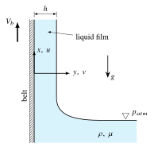
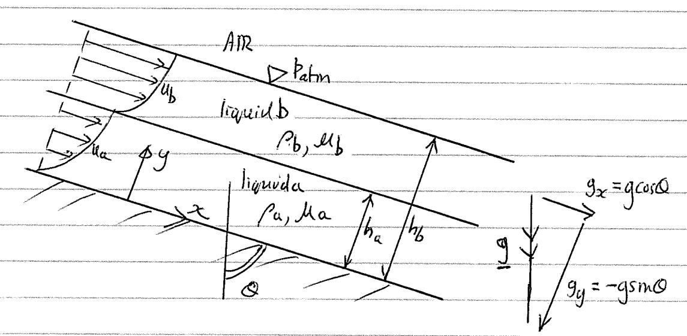
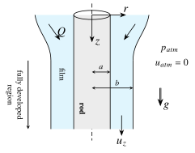

## Chapter 2 · Conservation Equations {#ch2}

### The continuity equation {#topic-continuity .unnumbered}

::: {.problem #p2-1 data-sec="ch2:sec-continuity-special" data-ch="2" data-d="1"}
### Problem 2.1 · Does this mass flux satisfy steady continuity? {.unnumbered}
<!-- origin: Sheet 1 Q4 -->

[[Difficulty: ★]{.tag .diff} Study first: [§2.1.1 Continuity: special cases](../notes/ch2.qmd#sec-continuity-special)]{.meta}

Determine if the following expressions for the momentum per unit volume satisfy the steady compressible form of the continuity equation:
(a) $\rho \vect{q} = 3x\,\uvec{i} - 3y^{2}\,\uvec{j} + \uvec{k}$,
(b) $\rho \vect{q} = 3x\,\uvec{i} - 3y\,\uvec{j} + \uvec{k}$,
(c) $\rho \vect{q} = 3x^{2}\,\uvec{i} - 3y^{2}\,\uvec{j} + 6(x-y)\,\uvec{k}$,
(d) $\rho \vect{q} = 3\,\uvec{i} + 6\,\uvec{j} + 10\,\uvec{k}$.

Hint

For steady flow $\partial\rho/\partial t = 0$, so continuity reduces to $\del\cdot(\rho\vect{q}) = 0$. You are given the components of $\rho\vect{q}$ directly, so you never need $\rho$ or $\vect{q}$ separately: just take the divergence and see whether it vanishes *everywhere*.

Final answer

(a) No: $\del\cdot(\rho\vect{q}) = 3 - 6y \neq 0$. (b) Yes. (c) No: $\del\cdot(\rho\vect{q}) = 6(x-y) \neq 0$. (d) Yes.

Full solution

The continuity equation in its most general form is
$$
\frac{\partial \rho}{\partial t} + \del \cdot (\rho \vect{q}) = 0,
$$
which, if the flow is steady as prescribed, becomes
$$
\del \cdot (\rho \vect{q}) = 0 .
\tag{1}
$$

(a) $\rho u = 3x$, $\rho v = -3y^2$, $\rho w = 1$:
$$
\del \cdot (\rho \vect{q}) = \frac{\partial(3x)}{\partial x} + \frac{\partial(-3y^2)}{\partial y} + \frac{\partial(1)}{\partial z} = 3 - 6y \neq 0
$$
Does **not** satisfy (1).

(b) $\rho u = 3x$, $\rho v = -3y$, $\rho w = 1$:
$$
\del \cdot (\rho \vect{q}) = \frac{\partial(3x)}{\partial x} + \frac{\partial(-3y)}{\partial y} + \frac{\partial(1)}{\partial z} = 3 - 3 + 0 = 0
$$
**Does** satisfy (1).

(c) $\rho u = 3x^2$, $\rho v = -3y^2$, $\rho w = 6(x-y)$:
$$
\begin{aligned}
\del \cdot (\rho \vect{q}) &= \frac{\partial(3x^2)}{\partial x} + \frac{\partial(-3y^2)}{\partial y} + \frac{\partial\left(6[x-y]\right)}{\partial z} \\
&= 6x - 6y + 0 = 6(x-y) \neq 0
\end{aligned}
$$
Does **not** satisfy (1) (it is satisfied only on the plane $x = y$, which is not enough).

(d) $\rho u = 3$, $\rho v = 6$, $\rho w = 10$:
$$
\del \cdot (\rho \vect{q}) = \frac{\partial(3)}{\partial x} + \frac{\partial(6)}{\partial y} + \frac{\partial(10)}{\partial z} = 0 + 0 + 0 = 0
$$
**Does** satisfy (1).

<label class="done"><input type="checkbox"> done</label>
:::

::: {.problem #p2-2 data-sec="ch2:sec-continuity-special" data-ch="2" data-d="1"}
### Problem 2.2 · Incompressible continuity and stagnation points {.unnumbered}
<!-- origin: Sheet 1 Q5. Solution corrected: (0,0) is a singular point, not a stagnation point. -->

[[Difficulty: ★]{.tag .diff} Study first: [§2.1.1 Continuity: special cases](../notes/ch2.qmd#sec-continuity-special)]{.meta}

Given $\vect{q} = u\,\uvec{i} + v\,\uvec{j}$ with
$$
\begin{aligned}
u &= U\left(1 + \frac{x}{x^{2} + y^{2}}\right), \\
v &= \frac{Uy}{x^{2} + y^{2}},
\end{aligned}
$$
is the incompressible form of the continuity equation satisfied? What are the values of $x$ and $y$ for the flow to be stagnant?

Hint

The flow is 2D, so check $\partial u/\partial x + \partial v/\partial y = 0$; the quotient rule does the work. For a stagnation point you need $u = 0$ *and* $v = 0$ at the same place: start with the simpler component. Be careful at the origin: is $\vect{q}$ even defined there?

Final answer

Yes, $\del\cdot\vect{q} = 0$ (everywhere except the origin, where $\vect{q}$ is singular). The only stagnation point is $(x,y) = (-1, 0)$.

Full solution

The incompressible ($\rho$ = constant) form of the continuity equation is
$$
\del \cdot \vect{q} = 0 .
$$
As the given $\vect{q}$ is two-dimensional ($\partial/\partial z = 0$), in component form this is
$$
\frac{\partial u}{\partial x} + \frac{\partial v}{\partial y} = 0 .
$$
With $u = U + Ux/(x^2+y^2)$ and $v = Uy/(x^2+y^2)$, the quotient rule gives
$$
\begin{aligned}
\frac{\partial u}{\partial x} &= U\,\frac{(x^2+y^2) - x\,(2x)}{(x^2+y^2)^2} = U\,\frac{y^2 - x^2}{(x^2+y^2)^2}, \\
\frac{\partial v}{\partial y} &= U\,\frac{(x^2+y^2) - y\,(2y)}{(x^2+y^2)^2} = U\,\frac{x^2 - y^2}{(x^2+y^2)^2},
\end{aligned}
$$
so
$$
\frac{\partial u}{\partial x} + \frac{\partial v}{\partial y} = U\,\frac{(y^2 - x^2) + (x^2 - y^2)}{(x^2+y^2)^2} = 0 ,
$$
and yes, continuity is satisfied (at every point except the origin, where $\vect{q}$ is not defined).

For the flow to be stagnant, $\vect{q} = u\,\uvec{i} + v\,\uvec{j} = 0$.

- $v = Uy/(x^2+y^2) = 0 \Rightarrow y = 0$.
- With $y = 0$: $u = U\left(1 + \dfrac{x}{x^2}\right) = U\left(1 + \dfrac{1}{x}\right) = 0 \Rightarrow x = -1$.

(Equivalently, $u = 0$ gives $x^2 + x + y^2 = 0$, i.e. $x = -\tfrac{1}{2} \pm \sqrt{\tfrac{1}{4} - y^2}$, which for $y = 0$ gives $x = 0$ or $x = -1$. The root $x = 0$ must be rejected: at the origin $x^2 + y^2 = 0$, the velocity is unbounded and we may not multiply through by $x^2+y^2$. This velocity field is a uniform stream plus a source located at the origin.)

For the flow to be stagnant: $y = 0$ and $x = -1$.

<label class="done"><input type="checkbox"> done</label>
:::

::: {.problem #p2-3 data-sec="ch2:sec-continuity-special" data-ch="2" data-d="2"}
### Problem 2.3 · Finding $u_r$ from continuity in polar coordinates {.unnumbered}
<!-- origin: Sheet 1 Q6 -->

[[Difficulty: ★★]{.tag .diff} Study first: [§2.1.1 Continuity: special cases](../notes/ch2.qmd#sec-continuity-special) and the [divergence in curvilinear coordinates](../notes/ch1.qmd#sec-curvilinear)]{.meta}

Given
$$
u_{\theta} = -U \sin \theta \left(1 + \frac{b^{2}}{r^{2}}\right) + \frac{\Gamma_{\infty}}{2\pi r}
$$
for a two-dimensional incompressible flow, determine the radial velocity component $u_{r}$; $b$, $\Gamma_{\infty}$ and $U$ are constants.

Hint

In cylindrical polar coordinates, $\del\cdot\vect{q} = \dfrac{1}{r}\dfrac{\partial (r u_r)}{\partial r} + \dfrac{1}{r}\dfrac{\partial u_\theta}{\partial \theta} + \dfrac{\partial u_z}{\partial z}$. Substitute $u_\theta$, then integrate with respect to $r$ at fixed $\theta$: the "constant" of integration can be any function of $\theta$.

Final answer

$$
u_r = U\cos\theta\left(1 - \frac{b^2}{r^2}\right) + \frac{f(\theta)}{r},
$$
with $f(\theta)$ an arbitrary function. (If $r = b$ is a solid cylinder, $u_r(b,\theta) = 0$ requires $f = 0$.)

Full solution

As specified, the flow is 2D ($\partial/\partial z = 0$) and incompressible, so continuity is $\del \cdot \vect{q} = 0$, which in cylindrical polar coordinates is
$$
\frac{\partial u_r}{\partial r} + \frac{u_r}{r} + \frac{1}{r}\frac{\partial u_{\theta}}{\partial \theta} + \cancel{\frac{\partial u_z}{\partial z}} = 0 .
\tag{1}
$$
Inserting the given $u_{\theta}$ into (1) (the circulation term does not depend on $\theta$ and drops out):
$$
\frac{\partial u_r}{\partial r} + \frac{u_r}{r} - \frac{U}{r} \cos \theta \left(1 + \frac{b^2}{r^2}\right) = 0 .
$$
Multiplying through by $r$:
$$
r\frac{\partial u_r}{\partial r} + u_r = \frac{\partial}{\partial r}(r u_r) = U \cos \theta \left(1 + \frac{b^2}{r^2}\right) .
$$
Integrating with respect to $r$ (remember $b$, $U$ and $\Gamma_\infty$ are constants):
$$
r u_r = U \cos \theta \left(r - \frac{b^2}{r}\right) + f(\theta)
\quad\Rightarrow\quad
u_r = U \cos \theta \left(1 - \frac{b^2}{r^2}\right) + \frac{f(\theta)}{r} .
$$

**Remark.** This is the flow past a circular cylinder of radius $b$ with circulation $\Gamma_\infty$. The surface $r = b$ is impermeable, $u_r(b,\theta) = 0$ for all $\theta$, which forces $f(\theta) = 0$.

<label class="done"><input type="checkbox"> done</label>
:::

::: {.problem #p2-4 data-sec="ch2:sec-continuity-special" data-ch="2" data-d="2"}
### Problem 2.4 · Differential and control-volume continuity agree {.unnumbered}
<!-- origin: Sheet 1 Q11 -->

[[Difficulty: ★★]{.tag .diff} Study first: [§2.1.1 Continuity: special cases](../notes/ch2.qmd#sec-continuity-special) and [the divergence theorem](../notes/ch1.qmd#sec-divergence-theorem)]{.meta}

By considering the problem of incompressible flow in a converging channel, show that the continuity equation for such a flow, $\del \cdot \vect{q} = 0$, is consistent with the conservation of mass result obtained from the control-volume approach, $u_{A}A_{A} = u_{B}A_{B}$, where $u_{A}$ and $u_{B}$ are the velocities at stations A and B normal to the corresponding cross-sectional areas $A_{A}$ and $A_{B}$, respectively.

Hint

Integrate $\del\cdot\vect{q} = 0$ over the volume of fluid between stations A and B, and turn the volume integral into a surface integral with the divergence theorem. Which parts of the bounding surface carry a flux, and in which direction does the outward normal point on each?

Final answer

$0 = \displaystyle\int_V \del\cdot\vect{q}\,dV = \oint_S \uvec{n}\cdot\vect{q}\,dS = -u_A A_A + u_B A_B$, hence $u_A A_A = u_B A_B$.

Full solution

Take a simple converging channel as the control volume:

{width=75% fig-alt="Converging channel; the shaded control volume is bounded by the inlet face S2 at station A, the walls S1 and S3, and the outlet face S4 at station B."}

From the control-volume approach we know that
$$
u_A A_A = u_B A_B .
\tag{1}
$$
The control volume has four sides, $S_1$, $S_2$, $S_3$, $S_4$, as shown; there is no flow across the walls $S_1$ and $S_3$, only across $S_2$ and $S_4$.

**Divergence theorem.** If $S$ denotes a surface bounding a fluid volume $V$ and $\uvec{n}$ is the unit normal pointing outwards from $S$ at every point on it, then
$$
\int_{V} \del \cdot \vect{q} \, dV = \oint_{S} \uvec{n} \cdot \vect{q} \, dS .
$$

- On $S_1$ and $S_3$ (impermeable walls): $\uvec{n} \cdot \vect{q} = 0$.
- On $S_2$, $\uvec{n}$ points in the $-x$ direction: $\displaystyle\int_{S_2} \uvec{n} \cdot \vect{q} \, dS = -u_A A_A$.
- On $S_4$, $\uvec{n}$ points in the $+x$ direction: $\displaystyle\int_{S_4} \uvec{n} \cdot \vect{q} \, dS = +u_B A_B$.

Since for incompressible flow $\del \cdot \vect{q} = 0$ at every point, the volume integral vanishes and therefore
$$
\oint_S \uvec{n} \cdot \vect{q} \, dS = 0
\;\Rightarrow\; -u_A A_A + u_B A_B = 0
\;\therefore\; u_A A_A = u_B A_B ,
$$
i.e. (1). (If the velocity is not uniform over a section, $u_A A_A$ is read as the volume flow rate $\int_{S_2} u\,dS$.)

<label class="done"><input type="checkbox"> done</label>
:::

::: {.problem #p2-5 data-sec="ch2:sec-continuity-nonconservative" data-ch="2" data-d="2"}
### Problem 2.5 · Gas compressed by a piston {.unnumbered}
<!-- origin: Sheet 1 Q9 -->

[[Difficulty: ★★]{.tag .diff} Study first: [§2.1 Continuity equation](../notes/ch2.qmd#sec-continuity) and [§2.1.2 Non-conservative form](../notes/ch2.qmd#sec-continuity-nonconservative)]{.meta}

A piston compresses gas in a cylinder by moving at constant speed $V$, as shown in the figure. The gas density and length at time $t = 0$ are $\rho_{0}$ and $L_{0}$, respectively. Let the gas velocity vary linearly from $u = V$ at the piston face to $u = 0$ at $x = L$. If the gas density varies only with time, find an expression for $\rho(t)$.

{width=60% fig-alt="Piston moving to the right at speed V into a closed cylinder of gas; x measured from the piston face, the end wall is at x = L(t)."}

Hint

Write $\del\cdot(\rho\vect{q}) = \rho\,\del\cdot\vect{q} + \vect{q}\cdot\del\rho$. If $\rho = \rho(t)$ only, the second term vanishes and the continuity equation becomes an ODE in time. You need $u(x)$ and also how the gas length $L$ changes with $t$.

Final answer

$$
\rho(t) = \rho_0\,\frac{L_0}{L_0 - Vt}
$$
(the mass $\rho L$ per unit cross-sectional area stays constant).

Full solution

$\rho$ depends on $t$ only, not on $x$, $y$ or $z$, so $\vect{q}\cdot\del\rho = 0$ and the general continuity equation
$$
\frac{\partial \rho}{\partial t} + \del \cdot (\rho \vect{q}) = 0
\quad\text{becomes}\quad
\frac{d\rho}{dt} + \rho\, \del \cdot \vect{q} = 0 ,
$$
i.e. the non-conservative form $D\rho/Dt + \rho\,\del\cdot\vect{q} = 0$ with $D\rho/Dt = d\rho/dt$. The problem is 1D ($v = w = 0$), so
$$
\frac{d\rho}{dt} + \rho \frac{\partial u}{\partial x} = 0 .
\tag{1}
$$
From the information given,
$$
u = V\left(1 - \frac{x}{L}\right), \qquad L = L_0 - Vt ,
\tag{2}
$$
with $u$ a function of $x$ (and $t$ through $L$). Substituting (2) in (1):
$$
\frac{d\rho}{dt} + \rho \frac{\partial}{\partial x} \left[ V\left(1 - \frac{x}{L}\right) \right] = 0
\quad\Rightarrow\quad
\frac{d\rho}{dt} = \frac{\rho V}{L} = \frac{\rho V}{L_0 - Vt} .
$$
Separating variables and integrating:
$$
\int_{\rho_0}^{\rho} \frac{d\rho}{\rho} = V \int_{0}^{t} \frac{dt}{L_0 - Vt}
\quad\Rightarrow\quad
\ln\frac{\rho}{\rho_0} = -\ln\left(1 - \frac{Vt}{L_0}\right),
$$
or
$$
\rho = \rho_0 \frac{L_0}{L_0 - Vt} .
$$
**Check:** $\rho L = \rho_0 L_0$, i.e. the mass of gas in the cylinder is conserved, as it must be.

<label class="done"><input type="checkbox"> done</label>
:::

### Stresses in a Newtonian fluid {#topic-stresses .unnumbered}

::: {.problem #p2-6 data-sec="ch2:sec-stresses" data-ch="2" data-d="1"}
### Problem 2.6 · Vorticity and viscous stresses of a 3D field {.unnumbered}
<!-- origin: Sheet 1 Q7 -->

[[Difficulty: ★]{.tag .diff} Study first: [§2.2.1 Surface stresses and Newtonian constitutive relations](../notes/ch2.qmd#sec-stresses) and [§1.3 Vorticity](../notes/ch1.qmd#sec-vorticity)]{.meta}

Given $\vect{q} = 3y\,\uvec{i} + 6x\,\uvec{j} + x^{2}\,\uvec{k}$, calculate the vorticity and the normal and shear stresses.

Hint

Vorticity: $\vect{\xi} = \del\times\vect{q}$. For the stresses use Stokes' relations, e.g. $\tau_{xx} = \lambda\,\del\cdot\vect{q} + 2\mu\,\partial u/\partial x$ and $\tau_{xy} = \mu(\partial v/\partial x + \partial u/\partial y)$. Check $\del\cdot\vect{q}$ first: if it is zero, the $\lambda$ terms disappear.

Final answer

$\vect{\xi} = -2x\,\uvec{j} + 3\,\uvec{k}$; $\;\tau_{xx} = \tau_{yy} = \tau_{zz} = 0$; $\;\tau_{xy} = 9\mu$, $\;\tau_{xz} = 2\mu x$, $\;\tau_{yz} = 0$.

Full solution

$$
\vect{q} = 3y\,\uvec{i} + 6x\,\uvec{j} + x^2\,\uvec{k} \quad\Rightarrow\quad u = 3y,\quad v = 6x,\quad w = x^2 .
$$

The vorticity is
$$
\begin{aligned}
\vect{\xi} &= \left( \frac{\partial w}{\partial y} - \frac{\partial v}{\partial z} \right)\uvec{i} + \left( \frac{\partial u}{\partial z} - \frac{\partial w}{\partial x} \right)\uvec{j} + \left( \frac{\partial v}{\partial x} - \frac{\partial u}{\partial y} \right)\uvec{k} \\
&= (0-0)\,\uvec{i} + (0-2x)\,\uvec{j} + (6-3)\,\uvec{k} = -2x\,\uvec{j} + 3\,\uvec{k} .
\end{aligned}
$$

$\vect{q}$ does not involve $t$, so the flow is steady. Although not specifically stated, check the divergence:
$$
\del \cdot \vect{q} = \frac{\partial (3y)}{\partial x} + \frac{\partial (6x)}{\partial y} + \frac{\partial (x^2)}{\partial z} = 0 + 0 + 0 = 0 ,
$$
so the flow is incompressible and the $\lambda\,\del\cdot\vect{q}$ terms in Stokes' relations vanish. The viscous normal stresses are
$$
\tau_{xx} = 2\mu \frac{\partial u}{\partial x} = 0, \qquad
\tau_{yy} = 2\mu \frac{\partial v}{\partial y} = 0, \qquad
\tau_{zz} = 2\mu \frac{\partial w}{\partial z} = 0,
$$
and the shear stresses are
$$
\begin{aligned}
\tau_{xy} = \tau_{yx} &= \mu \left( \frac{\partial v}{\partial x} + \frac{\partial u}{\partial y} \right) = \mu(6+3) = 9\mu, \\
\tau_{xz} = \tau_{zx} &= \mu \left( \frac{\partial w}{\partial x} + \frac{\partial u}{\partial z} \right) = \mu(2x+0) = 2\mu x, \\
\tau_{yz} = \tau_{zy} &= \mu \left( \frac{\partial v}{\partial z} + \frac{\partial w}{\partial y} \right) = \mu(0+0) = 0 .
\end{aligned}
$$
The total normal stress on, e.g., an $x$-face is $-p + \tau_{xx}$; here the viscous part is zero, so it is simply $-p$.

<label class="done"><input type="checkbox"> done</label>
:::

### Navier–Stokes and Euler equations: pressure from a known velocity field {#topic-ns-pressure .unnumbered}

::: {.problem #p2-7 data-sec="ch2:sec-ns-special" data-ch="2" data-d="1"}
### Problem 2.7 · Pressure gradient in a frictionless flow {.unnumbered}
<!-- origin: Sheet 1 Q12 -->

[[Difficulty: ★]{.tag .diff} Study first: [§2.2.2 Navier–Stokes equations: special cases](../notes/ch2.qmd#sec-ns-special) (Euler's equation)]{.meta}

A frictionless, incompressible steady flow field is given by $\vect{q} = 2xy\,\uvec{i} - y^{2}\,\uvec{j}$. Let the density be $\rho_{0}$ = constant and neglect gravity. Find an expression for the pressure gradient in the $x$ direction.

Hint

Frictionless means $\mu = 0$, so use Euler's equation, $D\vect{q}/Dt = \vect{F} - \del p/\rho$, with $\vect{F} = 0$. Only the convective acceleration survives in the $x$-component.

Final answer

$$
\frac{\partial p}{\partial x} = -2\rho_0\, x y^2
$$

Full solution

Assumptions: steady ($\partial/\partial t = 0$); 2D ($\partial/\partial z = 0$); no body forces; frictionless ($\mu = 0$, inviscid); incompressible ($\rho = \rho_0$ = constant). Given $u = 2xy$, $v = -y^2$.

Check that continuity is satisfied:
$$
\del \cdot \vect{q} = \frac{\partial u}{\partial x} + \frac{\partial v}{\partial y} = 2y + (-2y) = 0 . \quad\checkmark
$$

$x$-momentum (Navier–Stokes with the viscous term zero, i.e. Euler's equation):
$$
\frac{\partial u}{\partial t} + u\frac{\partial u}{\partial x} + v\frac{\partial u}{\partial y} + w\frac{\partial u}{\partial z} = F_x - \frac{1}{\rho_0}\frac{\partial p}{\partial x}
$$
so
$$
\begin{aligned}
(2xy)(2y) + (-y^2)(2x) &= -\frac{1}{\rho_0}\frac{\partial p}{\partial x} \\
\Rightarrow\quad 4xy^2 - 2xy^2 &= -\frac{1}{\rho_0}\frac{\partial p}{\partial x}
\quad\Rightarrow\quad
\frac{\partial p}{\partial x} = -2\rho_0\, x y^2 .
\end{aligned}
$$
(The same steps in $y$ give $\partial p/\partial y = -2\rho_0 y^3$.)

<label class="done"><input type="checkbox"> done</label>
:::

::: {.problem #p2-8 data-sec="ch2:sec-ns-special" data-ch="2" data-d="2"}
### Problem 2.8 · Plane stagnation-point flow: pressure, stresses and vorticity {.unnumbered}
<!-- origin: Sheet 1 Q10 -->

[[Difficulty: ★★]{.tag .diff} Study first: [§2.2.2 Navier–Stokes equations: special cases](../notes/ch2.qmd#sec-ns-special) and [§2.2.1 Stresses](../notes/ch2.qmd#sec-stresses)]{.meta}

Consider a two-dimensional steady velocity field of an incompressible fluid for which $u = a x$, $v = -a y$.
(a) Show that continuity is satisfied, (b) evaluate the pressure distribution $p(x,y)$, (c) evaluate the normal and shear stresses, (d) evaluate the vorticity, (e) is the flow irrotational?

Hint

For (b), write out the $x$- and $y$-components of the incompressible Navier–Stokes equations. The viscous terms vanish (why?), leaving $\partial p/\partial x$ and $\partial p/\partial y$. Integrate each, and match the two results: the "constant" of integration in the first is a function of $y$, and in the second a function of $x$.

Final answer

(a) $\del\cdot\vect{q} = a - a = 0$. (b) $p = C - \tfrac{1}{2}\rho a^2 (x^2 + y^2)$. (c) $\tau_{xx} = 2\mu a$, $\tau_{yy} = -2\mu a$, $\tau_{xy} = 0$. (d) $\vect{\xi} = 0$. (e) Yes, irrotational.

Full solution

Assumptions: steady; incompressible; $\mu$ = constant; 2D ($\partial/\partial z = 0$, $w = 0$); no body forces. Given $u = ax$, $v = -ay$, $w = 0$.

(a) $\del \cdot \vect{q} = \partial u/\partial x + \partial v/\partial y + \partial w/\partial z = a - a + 0 = 0$, so continuity is satisfied.

(b) $x$-direction Navier–Stokes:
$$
\frac{\partial u}{\partial t} + u\frac{\partial u}{\partial x} + v\frac{\partial u}{\partial y} + w\frac{\partial u}{\partial z} = F_x - \frac{1}{\rho}\frac{\partial p}{\partial x} + \nu \left( \frac{\partial^2 u}{\partial x^2} + \frac{\partial^2 u}{\partial y^2} + \frac{\partial^2 u}{\partial z^2} \right)
$$
i.e. $(ax)(a) + (-ay)(0) = -\dfrac{1}{\rho}\dfrac{\partial p}{\partial x} + \nu \times 0$, so
$$
\frac{\partial p}{\partial x} = -\rho a^2 x \quad\Rightarrow\quad p = -\frac{\rho a^2 x^2}{2} + f(y) .
\tag{1}
$$
$y$-direction: $(ax)(0) + (-ay)(-a) = -\dfrac{1}{\rho}\dfrac{\partial p}{\partial y} + \nu \times 0$, so
$$
\frac{\partial p}{\partial y} = -\rho a^2 y \quad\Rightarrow\quad p = -\frac{\rho a^2 y^2}{2} + g(x) .
\tag{2}
$$
Comparing (1) and (2) requires
$$
p(x,y) = -\frac{\rho a^2}{2}(x^2 + y^2) + C ,
$$
where $C$ is a constant (the pressure at the stagnation point, the origin).

(c) Since $\del \cdot \vect{q} = 0$, the viscous normal and shear stresses are
$$
\tau_{xx} = 2\mu \frac{\partial u}{\partial x} = 2\mu a, \qquad
\tau_{yy} = 2\mu \frac{\partial v}{\partial y} = -2\mu a,
$$
$$
\tau_{xy} = \tau_{yx} = \mu\left(\frac{\partial v}{\partial x} + \frac{\partial u}{\partial y}\right) = 0 .
$$
(The total normal stresses are $-p + 2\mu a$ and $-p - 2\mu a$.)

(d)
$$
\vect{\xi} = \left(\frac{\partial w}{\partial y} - \frac{\partial v}{\partial z}\right)\uvec{i} + \left(\frac{\partial u}{\partial z} - \frac{\partial w}{\partial x}\right)\uvec{j} + \left(\frac{\partial v}{\partial x} - \frac{\partial u}{\partial y}\right)\uvec{k} = 0 .
$$

(e) $\vect{\xi} = 0$; therefore the flow is irrotational.

<label class="done"><input type="checkbox"> done</label>
:::

::: {.problem #p2-9 data-sec="ch2:sec-ns-special" data-ch="2" data-d="2"}
### Problem 2.9 · An exact solution that obeys Bernoulli {.unnumbered}
<!-- origin: Sheet 1 Q13 -->

[[Difficulty: ★★]{.tag .diff} Study first: [§2.2.2 Navier–Stokes equations: special cases](../notes/ch2.qmd#sec-ns-special)]{.meta}

Show that the two-dimensional velocity $\vect{q} = kx\,\uvec{i} - ky\,\uvec{j}$, where $k$ is a constant, is an exact solution to the continuity equation. Using the Navier–Stokes equations for incompressible flow and neglecting gravity, derive an expression for the pressure field $p(x,y)$, relate it to the absolute velocity $|\vect{q}|^{2} = u^{2} + v^{2}$ and interpret the result you have obtained.

Hint

The steps are those of Problem 2.8. Once you have $p(x,y)$, notice that $x^2 + y^2$ can be written in terms of $u^2 + v^2$. What equation has the form $p + \tfrac{1}{2}\rho|\vect{q}|^2$ = constant, and why does it hold here even though the fluid is viscous?

Final answer

$$
p = C - \frac{\rho k^2}{2}(x^2 + y^2) \quad\Longleftrightarrow\quad p + \frac{1}{2}\rho\,|\vect{q}|^2 = C ,
$$
Bernoulli's equation (without the gravity term), valid throughout the flow.

Full solution

$u = kx$, $v = -ky$, $w = 0$. Assumptions: steady; 2D; no body forces; incompressible with $\rho$, $\mu$ constant.

Continuity: $\del \cdot \vect{q} = k - k = 0$, hence satisfied.

$x$-momentum:
$$
(kx)(k) + 0 = -\frac{1}{\rho}\frac{\partial p}{\partial x} + \nu \{ 0 + 0 \}
\quad\Rightarrow\quad
p = -\frac{\rho k^2 x^2}{2} + f_1(y) .
\tag{1}
$$
$y$-momentum:
$$
0 + (-ky)(-k) = -\frac{1}{\rho}\frac{\partial p}{\partial y} + \nu \{ 0 + 0 \}
\quad\Rightarrow\quad
p = -\frac{\rho k^2 y^2}{2} + f_2(x) .
\tag{2}
$$
Comparing (1) and (2):
$$
p = -\frac{\rho k^2}{2}(x^2 + y^2) + \text{constant} = -\frac{\rho}{2}(u^2 + v^2) + \text{constant},
$$
since $u^2 + v^2 = k^2(x^2 + y^2)$. Hence
$$
p + \frac{\rho}{2}\,|\vect{q}|^2 = \text{constant} .
$$

**Interpretation.** The given velocity field is an exact solution, and the pressure satisfies Bernoulli's equation, less the usual body-force term $\rho g h$, since body forces have been neglected. Two features make this possible although the fluid is viscous: the viscous term $\nu\del^2\vect{q}$ vanishes identically for this linear velocity field (viscous stresses exist, $\tau_{xx} = 2\mu k$, but they are uniform and exert no *net* force on a fluid element), and the flow is irrotational, so the Bernoulli constant is the same on every streamline, not just along each one.

<label class="done"><input type="checkbox"> done</label>
:::

::: {.problem #p2-10 data-sec="ch2:sec-ns-special" data-ch="2" data-d="2"}
### Problem 2.10 · Hagen–Poiseuille pipe flow: pressure and wall shear {.unnumbered}
<!-- origin: Sheet 1 Q14 -->

[[Difficulty: ★★]{.tag .diff} Study first: [§2.2.2 Navier–Stokes equations: special cases](../notes/ch2.qmd#sec-ns-special) and [§2.2.1 Stresses](../notes/ch2.qmd#sec-stresses)]{.meta}

For fully developed laminar flow in a pipe the velocity components are $u_{z} = U_{max}\left(1 - \dfrac{r^{2}}{R^{2}}\right)$, $u_{\theta} = u_{r} = 0$, which is an exact solution to the Navier–Stokes equations in cylindrical polar coordinates. Neglecting gravity, determine the pressure distribution $p(r,z)$ in the pipe and the shear stress $\tau_{rz}$ using $R$, $U_{max}$ and $\mu$ as parameters. Why does the maximum shear occur at the wall? Why does density not appear as a parameter?

Hint

Only the $z$-momentum equation is non-trivial; all convective terms vanish. Use the cylindrical Laplacian $\del^2 u_z = \dfrac{1}{r}\dfrac{\partial}{\partial r}\left(r\dfrac{\partial u_z}{\partial r}\right) + \dots$ to find $\partial p/\partial z$; the $r$- and $\theta$-equations tell you how $p$ depends on $r$ and $\theta$. Then $\tau_{rz} = \mu(\partial u_r/\partial z + \partial u_z/\partial r)$.

Final answer

$$
p = p_0 - \frac{4\mu U_{max}}{R^2}\,z, \qquad \tau_{rz} = -\frac{2\mu U_{max}\, r}{R^2},
$$
so $|\tau_{rz}|$ is largest at the wall, $2\mu U_{max}/R$. Density does not appear because the fluid particles do not accelerate: pressure and viscous forces balance exactly.

Full solution

Assumptions: steady and fully developed; only the axial velocity $u_z$ is non-zero ($u_r = u_\theta = 0$, unidirectional); incompressible; $\mu$, $\nu$ constant; no body forces.

Continuity:
$$
\del \cdot \vect{q} = \frac{1}{r}\frac{\partial}{\partial r}(r u_r) + \frac{1}{r}\frac{\partial u_{\theta}}{\partial \theta} + \frac{\partial u_z}{\partial z} = 0
$$
is satisfied since $u_r = u_\theta = 0$ and $u_z = f(r)$ only.

Since only the axial velocity is non-zero, consider the $z$-momentum equation:
$$
\begin{aligned}
&\cancel{\frac{\partial u_z}{\partial t}} + \underbrace{u_r \frac{\partial u_z}{\partial r} + \frac{u_{\theta}}{r} \frac{\partial u_z}{\partial \theta} + u_z \frac{\partial u_z}{\partial z}}_{=0 \text{ (unidirectional flow)}} \\
&\qquad = \cancel{F_z} - \frac{1}{\rho}\frac{\partial p}{\partial z} + \nu \left(\frac{1}{r}\frac{\partial}{\partial r}\left(r \frac{\partial u_z}{\partial r}\right) + \cancel{\frac{1}{r^2}\frac{\partial^2 u_z}{\partial \theta^2}} + \cancel{\frac{\partial^2 u_z}{\partial z^2}}\right)
\end{aligned}
$$
so
$$
\frac{1}{\rho}\frac{\partial p}{\partial z} = \frac{\nu}{r}\frac{d}{dr}\left(r \frac{du_z}{dr}\right) .
\tag{1}
$$
Substituting $u_z = U_{max}(1 - r^2/R^2)$:
$$
\frac{1}{\rho}\frac{\partial p}{\partial z} = \frac{\nu}{r}\frac{d}{dr} \left( r U_{max} \left(-\frac{2r}{R^2}\right) \right)
= -\frac{2\nu U_{max}}{r R^2} \frac{d}{dr}(r^2) = -\frac{4 \nu U_{max}}{R^2}
$$
$$
\Rightarrow\quad
\frac{\partial p}{\partial z} = -\frac{4 \mu U_{max}}{R^2} = \text{constant} .
$$
Integrating with respect to $z$:
$$
p = -\frac{4 \mu U_{max}}{R^2}\,z + f(r, \theta) .
\tag{2}
$$
The other two momentum equations (all terms zero except the pressure gradient) give $\partial p/\partial r = 0$ and $\partial p/\partial \theta = 0$, so $f(r,\theta)$ in (2) must be a constant:
$$
p = p_0 - \frac{4 \mu U_{max}}{R^2}\,z .
$$

Note that the given $u_z(r)$ is the solution of (1) with
$$
U_{max} = -\frac{R^2}{4\mu}\frac{dp}{dz}, \quad p \text{ a function of } z \text{ only},
$$
commonly known as the Hagen–Poiseuille solution for a horizontal pipe of radius $R$, driven by a constant pressure gradient $dp/dz$ (gravity negligible). You can establish this yourself by solving (1) with the boundary conditions $u_z = 0$ at $r = R$ (no slip) and $du_z/dr = 0$ at $r = 0$ (symmetry; equivalently, $u_z$ finite on the axis).

The shear stress is
$$
\tau_{zr} = \tau_{rz} = \mu\left(\frac{\partial u_r}{\partial z} + \frac{\partial u_z}{\partial r}\right),
$$
the first term of which is zero because $u_r = 0$, leaving
$$
\tau_{rz} = \mu \frac{\partial u_z}{\partial r} = \mu \frac{\partial}{\partial r} \left[U_{max}\left(1 - \frac{r^2}{R^2}\right)\right] = -\frac{2\mu U_{max}\, r}{R^2} .
$$
Its magnitude is a maximum at the wall, $r = R$, where $|\tau_{rz}| = 2\mu U_{max}/R$, and zero on the centreline.

**Why the maximum is at the wall.** Using $U_{max}$ above, $\tau_{rz} = \tfrac{r}{2}\,\dfrac{dp}{dz}$: a force balance on a cylinder of fluid of radius $r$ and length $\Delta z$ shows the pressure force grows like $\pi r^2$ while the shear acts on an area $2\pi r\Delta z$, so the shear needed to balance it grows linearly with $r$ and is largest at $r = R$. Equivalently, the velocity gradient is steepest at the wall.

**Why density does not appear.** In fully developed flow the fluid particles do not accelerate (the local and convective accelerations are both zero), and gravity is neglected. Density multiplies only the acceleration and the body force, so the momentum equation reduces to a balance between pressure and viscous forces, in which only $\mu$ appears.

<label class="done"><input type="checkbox"> done</label>
:::

### Exact solutions: unidirectional flows {#topic-exact-solutions .unnumbered}

::: {.problem #p2-11 data-sec="ch2:sec-ns-special" data-ch="2" data-d="1"}
### Problem 2.11 · Water between two parallel plates {.unnumbered}
<!-- origin: Sheet 1 Q21 -->

[[Difficulty: ★]{.tag .diff} Study first: [Workshop 1 (plane Couette and Poiseuille flow)](../workshops/workshop1.qmd) and [§2.2.2 Navier–Stokes equations: special cases](../notes/ch2.qmd#sec-ns-special)]{.meta}

Water flows between two large parallel plates, aligned horizontally, at a distance 1.5 mm apart. If the average flow velocity is $0.15\ \text{m s}^{-1}$, find: (a) the maximum velocity; (b) the pressure drop; (c) the wall shear stress. Take $\mu = 1.01 \times 10^{-3}\ \text{kg m}^{-1}\text{s}^{-1}$.

Hint

This is plane Poiseuille flow, solved in Workshop 1 for plates $2h$ apart: $u = u_{max}(1 - y^2/h^2)$ with $u_{max} = -\dfrac{h^2}{2\mu}\dfrac{dp}{dx}$. Integrate the profile to relate $u_{ave}$ to $u_{max}$. Watch out: here $2h = 1.5$ mm. The "pressure drop" is the pressure drop per unit length, $-dp/dx$.

Final answer

$u_{max} = \tfrac{3}{2}u_{ave} = 0.225\ \text{m s}^{-1}$; $\;dp/dx = -3\mu u_{ave}/h^2 = -808\ \text{Pa m}^{-1}$ (a pressure drop of 808 Pa per metre); $\;|\tau_w| = 3\mu u_{ave}/h = 0.606\ \text{Pa}$.

Full solution

Assumptions: steady; 2D in $(x,y)$; $\rho$ constant (its value is not needed since $u(y)$ is independent of $\rho$); $\mu$ constant and given; fully developed, so by continuity the flow is unidirectional, $u = u(y)$, $v = 0$. Gravity acts in $-y$ and only adds a hydrostatic variation of $p$ across the gap; it does not affect $u$.

We can proceed in one of two ways:

1. Solve the problem from scratch for plates a distance $h$ apart with the $x$-axis on the lower plate, with boundary conditions $u(0) = 0$ and $u(h) = 0$. The general solution is the same as in Workshop 1,
   $$
   u(y) = \frac{1}{2\mu}\frac{dp}{dx}y^2 + C_1 y + C_2 .
   $$
   $u(0) = 0 \Rightarrow C_2 = 0$; $\;u(h) = 0 \Rightarrow C_1 = -\dfrac{1}{2\mu}\dfrac{dp}{dx}h$, so
   $$
   u(y) = -\frac{1}{2\mu}\frac{dp}{dx}(hy - y^2) ,
   \tag{1}
   $$
   and find $u_{max}$, $dp/dx$ and $\tau_{xy}$ from this expression.

2. Alternatively, use the expression obtained in [Workshop 1](../workshops/workshop1.qmd) for plates $2h$ apart with the origin on the centreline,
   $$
   u(y) = -\frac{1}{2\mu}\frac{dp}{dx}h^2\left(1 - \frac{y^2}{h^2}\right) ,
   \tag{2}
   $$
   remembering that it was derived with a plate separation of $2h$!

Here we start from (2); it is left to the reader to show that (1) gives the same results.

(a) The velocity is a maximum at $y = 0$:
$$
u_{max} = -\frac{h^2}{2\mu}\frac{dp}{dx}, \qquad u(y) = u_{max}\left(1 - \frac{y^2}{h^2}\right) .
\tag{3}
$$
The volume flux per unit width is
$$
Q = \int_{-h}^{h} u\, dy = u_{max} \left[y - \frac{y^3}{3h^2}\right]_{-h}^{h} = \frac{4h}{3} u_{max}
$$
$$
\Rightarrow\quad
u_{ave} = \frac{Q}{2h} = \frac{2}{3}u_{max},
$$
so
$$
u_{max} = \frac{3}{2}u_{ave} = \frac{3}{2} \times 0.15 = 0.225\ \text{m s}^{-1} .
$$

(b) Equating this with (3):
$$
\frac{3}{2}u_{ave} = -\frac{h^2}{2\mu}\frac{dp}{dx} \quad\Rightarrow\quad \frac{dp}{dx} = -\frac{3\mu u_{ave}}{h^2} .
$$
With $h = 1.5\times 10^{-3}/2 = 0.75\times 10^{-3}$ m:
$$
\frac{dp}{dx} = -\frac{3 \times (1.01 \times 10^{-3}) \times 0.15}{(0.75 \times 10^{-3})^2} = -808\ \text{N m}^{-3},
$$
i.e. a pressure drop of 808 Pa per metre of channel.

(c)
$$
\begin{aligned}
\tau_{xy}\big|_{wall} &= \mu \left( \cancel{\frac{\partial v}{\partial x}} + \frac{\partial u}{\partial y} \right)\bigg|_{y=\pm h} \\
&= \mu \left[-\frac{2y}{h^2}u_{max}\right]_{y=\pm h} = \mp \frac{2\mu u_{max}}{h} = \mp \frac{3\mu u_{ave}}{h}
\end{aligned}
$$
(the velocity gradient is negative at $y = h$ and positive at $y = -h$). Also, differentiating (2) directly,
$$
\tau_{xy}\big|_{wall} = -\frac{1}{2}\frac{dp}{dx} \left[-2y\right]_{y=\pm h} = \pm h \frac{dp}{dx} ,
$$
so $|\tau_{w}| = 3\mu u_{ave}/h = h\,|dp/dx|$:
$$
|\tau_{w}| = 0.75 \times 10^{-3} \times 808 = 0.606\ \text{N m}^{-2} .
$$

Had the vorticity been required, only $\xi_z$ exists:
$$
\xi_z = \frac{\partial v}{\partial x} - \frac{\partial u}{\partial y} = \frac{2y\, u_{max}}{h^2}
$$
$$
\Rightarrow\quad
\xi_z\big|_{y=\pm h} = \pm \frac{3 u_{ave}}{h} = \pm \frac{3 \times 0.15}{0.75 \times 10^{-3}} = \pm 600\ \text{s}^{-1} .
$$

<label class="done"><input type="checkbox"> done</label>
:::

::: {.problem #p2-12 data-sec="ch2:sec-ns-special" data-ch="2" data-d="1"}
### Problem 2.12 · Oil film down an inclined plane {.unnumbered}
<!-- origin: Sheet 1 Q20 (original solution only referred to the class problem; a condensed solution has been written out) -->

[[Difficulty: ★]{.tag .diff} Study first: [Workshop 2 (gravity- and rotation-driven flows)](../workshops/workshop2.qmd), [§2.2.2 N–S special cases](../notes/ch2.qmd#sec-ns-special) and [§2.5 Boundary conditions](../notes/ch2.qmd#sec-bcs)]{.meta}

A thin film of oil flows over the lip of a reservoir and down a smooth plane inclined at an angle $\alpha$ to the horizontal. At some point down the plane the flow becomes fully developed, i.e. independent of $x$, the coordinate down the plane ($y$ is perpendicular to the plane). Derive an expression for the velocity profile across the film if the fully developed film thickness is $f$. The fluid has constant density and viscosity.

Hint

This is the film flow of Workshop 2 with $h$ replaced by $f$. Resolve gravity along and normal to the plane. The $y$-momentum equation gives a hydrostatic pressure that is independent of $x$, so the flow is driven by gravity alone. Boundary conditions: no slip at the plane, zero shear stress at the free surface.

Final answer

$$
u(y) = \frac{\rho g \sin \alpha}{2\mu}\,(2fy - y^2), \qquad 0 \le y \le f .
$$

Full solution

This is exactly the problem solved in [Workshop 2](../workshops/workshop2.qmd) with the film thickness $h$ replaced by $f$; the main steps are summarised here.

Fully developed means $\partial u/\partial x = 0$, so continuity gives $\partial v/\partial y = 0$; with $v = 0$ at the impermeable plane, $v = 0$ everywhere and the flow is unidirectional, $u = u(y)$. The body force is $\vect{F} = (g\sin\alpha,\, -g\cos\alpha)$.

- $y$-momentum: $0 = -\rho g\cos\alpha - \partial p/\partial y$. With $p = p_{atm}$ at $y = f$: $p = p_{atm} + \rho g\cos\alpha\,(f - y)$, independent of $x$, so $\partial p/\partial x = 0$.
- $x$-momentum: $0 = \rho g\sin\alpha + \mu\, d^2u/dy^2$, i.e.
$$
\frac{d^2 u}{dy^2} = -\frac{\rho g \sin\alpha}{\mu} \quad\Rightarrow\quad u = -\frac{\rho g\sin\alpha}{2\mu}y^2 + C_1 y + C_2 .
$$

Boundary conditions: no slip, $u(0) = 0 \Rightarrow C_2 = 0$; no shear at the free surface, $du/dy = 0$ at $y = f$ $\Rightarrow C_1 = \rho g f\sin\alpha/\mu$. Hence
$$
u(y) = \frac{\rho g \sin \alpha}{2\mu}(2fy - y^2) .
$$
The maximum velocity is at the free surface, $u(f) = \rho g f^2\sin\alpha/(2\mu)$, and the flow rate per unit width is $q = \rho g f^3 \sin\alpha/(3\mu)$.

<label class="done"><input type="checkbox"> done</label>
:::

::: {.problem #p2-13 data-sec="ch2:sec-bcs" data-ch="2" data-d="2"}
### Problem 2.13 · Film dragged up by a moving belt {.unnumbered}
<!-- origin: Sheet 1 Q22 -->

[[Difficulty: ★★]{.tag .diff} Study first: [§2.5 Initial and boundary conditions](../notes/ch2.qmd#sec-bcs), [§2.2.2 N–S special cases](../notes/ch2.qmd#sec-ns-special) and [Workshop 2](../workshops/workshop2.qmd)]{.meta}

A wide belt moving vertically upwards with constant speed $V_{b}$ passes through a tank containing a viscous liquid; in doing so it picks up a film of fluid of thickness $h$. Gravity acts so as to make the fluid drain down the belt. Assuming constant dynamic viscosity $\mu$, find an expression for the average velocity of the film as it is dragged up the belt, assuming also that the flow is fully developed. In addition, assume that the resulting flow is steady and laminar.

Hint

Take $x$ upwards along the belt (the flow direction) and $y$ across the film. As for the inclined film, the pressure is atmospheric throughout, so the $x$-momentum equation balances gravity ($F_x = -g$) against viscous diffusion. The boundary conditions are $u = V_b$ at the belt (no slip on a *moving* wall) and $du/dy = 0$ at the free surface.

Final answer

$$
u(y) = V_b - \frac{\rho g}{2\mu}(2hy - y^2), \qquad
V_{ave} = V_b - \frac{\rho g h^2}{3\mu} ,
$$
so there is a net upward flow only if $V_b > \rho g h^2/(3\mu)$.

Full solution

Assumptions: steady and fully developed ($\partial u/\partial x = 0$); 2D ($\partial/\partial z = 0$); $\rho$, $\mu$ constant (incompressible); the body force is gravity.

{width=45% fig-alt="A belt moving up at speed Vb out of a liquid bath carries a film of thickness h; x points up along the belt, y across the film, gravity acts downwards."}

**Continuity:**
$$
\del \cdot \vect{q} = \cancel{\frac{\partial u}{\partial x}} + \frac{\partial v}{\partial y} = 0 .
\tag{1}
$$
Integrating (1) with respect to $y$ gives $v = f(x)$. At $y = 0$ (the belt), $v = 0$, so $f(x) = 0$ and $v = 0$ everywhere: the flow is unidirectional, $u = u(y)$.

**$y$-momentum:**
$$
\rho \left( \cancel{\frac{\partial v}{\partial t}} + \cancel{u\frac{\partial v}{\partial x}} + \cancel{v\frac{\partial v}{\partial y}} \right) = \cancel{\rho F_y} - \frac{\partial p}{\partial y} + \mu \left( \cancel{\frac{\partial^2 v}{\partial x^2}} + \cancel{\frac{\partial^2 v}{\partial y^2}} \right)
$$
Since $v = 0$ everywhere, the flow is steady and gravity acts purely in the $x$-direction ($F_y = 0$), this reduces to $\partial p/\partial y = 0$: $p$ is independent of $y$. At the free surface, $y = h$, the pressure is atmospheric, so $p = p_{atm}$ throughout the film, and consequently $\partial p/\partial x = 0$ too.

**$x$-momentum:**
$$
\rho \left( \cancel{\frac{\partial u}{\partial t}} + \cancel{u\frac{\partial u}{\partial x}} + \cancel{v\frac{\partial u}{\partial y}} \right) = \rho F_x - \cancel{\frac{\partial p}{\partial x}} + \mu \left( \cancel{\frac{\partial^2 u}{\partial x^2}} + \frac{\partial^2 u}{\partial y^2} \right)
$$
With $F_x = -g$:
$$
\frac{d^2 u}{dy^2} = \frac{\rho g}{\mu}
\quad\Rightarrow\quad
\frac{du}{dy} = \frac{\rho g}{\mu} y + C_1 .
\tag{2}
$$
At the free surface there is zero shear, $du/dy = 0$ at $y = h$, so $C_1 = -\rho g h/\mu$ and
$$
\frac{du}{dy} = \frac{\rho g}{\mu}(y - h)
\quad\Rightarrow\quad
u(y) = \frac{\rho g}{2\mu}(y^2 - 2hy) + C_2 .
$$
At the surface of the belt, $y = 0$, there is no slip, $u(0) = V_b$, so $C_2 = V_b$:
$$
u(y) = V_b + \frac{\rho g}{2\mu}(y^2 - 2hy) .
$$

The average film velocity is $V_{ave} = Q/h$, where $Q$ is the flow rate per unit belt width:
$$
Q = \int_{0}^{h} u\, dy = \left[\frac{\rho g}{2\mu}\left(\frac{y^3}{3} - hy^2\right) + V_b y\right]_0^h = V_b h - \frac{\rho g h^3}{3\mu} ,
$$
so
$$
V_{ave} = \frac{Q}{h} = V_b - \frac{\rho g h^2}{3\mu} .
$$

There is a net upward flow of liquid (positive $V_{ave}$ and $Q$) if and only if
$$
V_b > \frac{\rho g h^2}{3\mu} .
$$
You might want to revisit the inclined-film problem of [Workshop 2](../workshops/workshop2.qmd), let the plane move with velocity $V_I$ in the negative $x$-direction (up the slope), and see how the solution differs from the above.

<label class="done"><input type="checkbox"> done</label>
:::

::: {.problem #p2-14 data-sec="ch2:sec-bcs" data-ch="2" data-d="3"}
### Problem 2.14 · Two immiscible films down an incline {.unnumbered}
<!-- origin: Sheet 1 Q23. Sign error corrected in the final expression for u_a. -->

[[Difficulty: ★★★]{.tag .diff} Study first: [§2.5 Initial and boundary conditions](../notes/ch2.qmd#sec-bcs) (fluid–fluid interface) and [Workshop 2](../workshops/workshop2.qmd)]{.meta}

Two immiscible fluid films, one lying directly above the other, flow down a planar surface inclined at an angle $\theta$ to the vertical. Starting with the Navier–Stokes equations for incompressible flow with constant properties, obtain expressions for the velocity profile in each of the fluid films, assuming the flow to be fully developed.

Let $h_{a}$ be the thickness of the lower film and $h_{b}$ the thickness of the two films combined; the subscripts $a$ and $b$ denote fluid $a$ and fluid $b$, the corresponding velocity profiles being $u_{a}(y)$ and $u_{b}(y)$, where $y$ is the coordinate perpendicular to the plane.

{width=80% fig-alt="Hand sketch: liquid a of thickness h_a on an inclined plane, liquid b above it up to y = h_b, air above; x down the slope, y normal to it; gravity components g cos(theta) along and -g sin(theta) normal to the plane."}

Hint

In each layer the equation is the same as for a single film, $d^2u/dy^2 = -g\cos\theta/\nu$, but with its own $\nu$; so you have four constants. The four conditions are: no slip at the plane; at the interface, equal velocities *and* equal shear stresses ($\mu_a\,du_a/dy = \mu_b\,du_b/dy$); zero shear at the free surface. Apply the free-surface and wall conditions first.

Final answer

$$
\begin{aligned}
u_a(y) &= \frac{g h_a^2 \cos \theta}{\nu_a} \left[ \left( 1 + \frac{\rho_b}{\rho_a} \left(\frac{h_b}{h_a} - 1\right) \right) \frac{y}{h_a} - \frac{1}{2} \left(\frac{y}{h_a}\right)^2 \right], \quad 0 \le y \le h_a, \\
u_b(y) &= \frac{g\cos\theta}{\nu_b}\left(h_b y - \frac{y^2}{2}\right) + \frac{g\cos\theta\, h_a^2}{2}\left(\frac{1}{\nu_a} - \frac{1}{\nu_b}\right) \\
&\quad + g\cos\theta\, h_a (h_b - h_a)\left(\frac{\rho_b}{\rho_a\nu_a} - \frac{1}{\nu_b}\right), \quad h_a \le y \le h_b .
\end{aligned}
$$

Full solution

Two-layer fully developed flow down an inclined plane. Assumptions: plane inclined at $\theta$ to the vertical; steady; 2D ($\partial/\partial z = 0$); $\rho$, $\mu$ (hence $\nu$) constant in each layer; gravity is the body force. We seek $u_a$ and $u_b$ in terms of $h_a$, $h_b$, $\nu_a$, $\nu_b$, $\rho_a$, $\rho_b$, $\theta$ and $y$.

**Continuity:**
$$
\del \cdot \vect{q} = \frac{\partial u}{\partial x} + \frac{\partial v}{\partial y} + \cancel{\frac{\partial w}{\partial z}} = 0 .
$$
Since the flow is fully developed, $u$ does not depend on $x$, so $\partial v/\partial y = 0$ and $v = f(x)$; the impermeable plane requires $v = 0$ at $y = 0$, so $v = 0$ everywhere and $u = u(y)$ only (unidirectional flow in each layer).

**$x$- and $y$-momentum** (the convective acceleration terms are always zero for unidirectional flow):
$$
\begin{aligned}
0 &= -\frac{\partial p}{\partial x} + \rho g \cos\theta + \mu \frac{\partial^2 u}{\partial y^2}, \\
0 &= -\frac{\partial p}{\partial y} - \rho g \sin\theta .
\end{aligned}
\tag{1}
$$
Integrating the $y$-equation:
$$
p = -\rho g \sin \theta\, y + f(x) .
\tag{2}
$$
In fluid $b$ ($\rho = \rho_b$), using $p = p_{atm}$ at $y = h_b$:
$$
p = p_{atm} + \rho_b g (h_b - y) \sin \theta, \qquad h_a \le y \le h_b .
$$
Denoting the interface pressure by $p_I = p(h_a) = p_{atm} + \rho_b g (h_b - h_a)\sin\theta$, in fluid $a$ ($\rho = \rho_a$):
$$
p = p_I + \rho_a g (h_a - y) \sin \theta, \qquad 0 \le y \le h_a .
$$
The pressure throughout both films is a function of $y$ only, so $\partial p/\partial x = 0$, and the $x$-equation in (1) reduces in each layer to
$$
\frac{d^2 u}{dy^2} = -\frac{g \cos \theta}{\nu} .
\tag{3}
$$
This is a second-order ODE, so we need two boundary conditions per layer, four in total.

**Boundary conditions:**

A. No slip at the plane, and equal velocities at the liquid–liquid interface:
$$
u_a(0) = 0, \qquad u_a(h_a) = u_b(h_a) = u_I ,
\tag{4}
$$
where $u_I$ is the interface velocity.

B. At the interface $y = h_a$ the shear stresses of the two fluids must balance, $\tau_{xy}|_a = \tau_{xy}|_b$:
$$
\mu_a \frac{du_a}{dy} = \mu_b \frac{du_b}{dy} \quad \text{at } y = h_a .
\tag{5}
$$

C. At the liquid–air interface the velocity and shear stress should strictly be continuous with those of the air, but enforcing this would require us to solve for the motion of the air too! Instead we assume, to a very good approximation, that since $\mu_{air} \ll \mu_b$ the air exerts negligible shear on the film:
$$
\frac{du_b}{dy} = 0 \quad \text{at } y = h_b .
\tag{6}
$$

Integrating (3) in each film:
$$
u_a(y) = -\frac{g\cos \theta}{2\nu_a}\, y^2 + C_1 y + C_2, \qquad
u_b(y) = -\frac{g\cos \theta}{2\nu_b}\, y^2 + C_3 y + C_4 .
$$

- $u_a(0) = 0$ gives $C_2 = 0$.
- (6) gives $C_3 = \dfrac{g h_b \cos \theta}{\nu_b}$.
- (5), with $\mu = \rho\nu$, gives $\rho_a\nu_a\left(-\dfrac{g h_a\cos\theta}{\nu_a} + C_1\right) = \rho_b g (h_b - h_a)\cos\theta$, i.e.
$$
C_1 = \frac{g h_a \cos \theta}{\nu_a} \left[ \frac{\rho_b}{\rho_a} \left( \frac{h_b}{h_a} - 1 \right) + 1 \right] .
$$

- Velocity continuity at $y = h_a$, (4), gives
$$
C_4 = \frac{g h_a^2 \cos \theta}{\nu_a} \left[ \frac{1}{2} + \frac{1}{2}\frac{\nu_a}{\nu_b} + \left(\frac{\rho_b}{\rho_a} - \frac{\nu_a}{\nu_b}\right)\frac{h_b}{h_a} - \frac{\rho_b}{\rho_a} \right] .
$$

Inserting the constants:
$$
u_a(y) = \frac{g h_a^2 \cos \theta}{\nu_a} \left[ \left( 1 + \frac{\rho_b}{\rho_a} \left(\frac{h_b}{h_a} - 1\right) \right) \frac{y}{h_a} - \frac{1}{2} \left(\frac{y}{h_a}\right)^2 \right]
$$
$$
\begin{aligned}
u_b(y) = \frac{g h_a^2 \cos \theta}{\nu_a} \bigg[ &\frac{1}{2} + \frac{1}{2}\frac{\nu_a}{\nu_b} - \frac{\rho_b}{\rho_a} + \left(\frac{\rho_b}{\rho_a} - \frac{\nu_a}{\nu_b}\right)\frac{h_b}{h_a} \\
&+ \frac{\nu_a}{\nu_b}\frac{h_b}{h_a}\frac{y}{h_a} - \frac{1}{2}\frac{\nu_a}{\nu_b}\left(\frac{y}{h_a}\right)^2 \bigg]
\end{aligned}
$$
(the second can be rearranged into the form given in the final answer).

**Check:** putting $h_a = h_b = h$, $\nu_a = \nu_b = \nu$ and $\rho_a = \rho_b = \rho$ in either expression retrieves the single-layer solution $u = \dfrac{g\cos\theta}{2\nu}(2hy - y^2)$ of [Workshop 2](../workshops/workshop2.qmd), which contains $\sin\alpha$ instead of $\cos\theta$ because there the plane was inclined at $\alpha$ to the *horizontal*. Read all problem specifications (and exam questions) carefully!

<label class="done"><input type="checkbox"> done</label>
:::

::: {.problem #p2-15 data-sec="ch2:sec-bcs" data-ch="2" data-d="3"}
### Problem 2.15 · Non-Newtonian channel flow with a lubricating carrier layer {.unnumbered}
<!-- origin: Revision class Practice Question 1, merged with the supervised problem class (week II) problem on the same flow, which supplied part (v). Fixes: (1) the solution said gravity acts in the z-direction; with horizontal plates and y perpendicular to them, gravity acts in -y and only adds a hydrostatic pressure variation across the channel. (2) "fully developed and uni-directional" replaced by the continuity argument (one follows from the other). (3) The carrier-layer viscosity is written mu_c (the original used mu for both fluids although the carrier fluid has a lower viscosity). (4) Added a note on the sign convention for (du/dy)^n with du/dy < 0. -->
<!-- REVIEW (MB): carrier-layer viscosity renamed mu_c in part (iv) and in the solution; please check. -->

[[Difficulty: ★★★]{.tag .diff} Study first: [§2.2.1 Stresses and constitutive relations](../notes/ch2.qmd#sec-stresses), [the momentum equations](../notes/ch2.qmd#sec-momentum), [boundary conditions](../notes/ch2.qmd#sec-bcs) and [Workshop 1](../workshops/workshop1.qmd)]{.meta}

Without making any assumptions about the nature of the viscosity or density of a fluid, the general continuity and Navier–Stokes equations in Cartesian coordinates are
$$
\frac{\partial\rho}{\partial t} + \del \cdot (\rho\vect{q}) = 0
$$
and
$$
\begin{aligned}
\rho\frac{Du}{Dt} &= \rho F_{x} - \frac{\partial p}{\partial x} + \frac{\partial\tau_{xx}}{\partial x} + \frac{\partial\tau_{xy}}{\partial y} + \frac{\partial\tau_{xz}}{\partial z} \\
\rho\frac{Dv}{Dt} &= \rho F_{y} - \frac{\partial p}{\partial y} + \frac{\partial\tau_{yx}}{\partial x} + \frac{\partial\tau_{yy}}{\partial y} + \frac{\partial\tau_{yz}}{\partial z} \\
\rho\frac{Dw}{Dt} &= \rho F_{z} - \frac{\partial p}{\partial z} + \frac{\partial\tau_{zx}}{\partial x} + \frac{\partial\tau_{zy}}{\partial y} + \frac{\partial\tau_{zz}}{\partial z}
\end{aligned}
$$
where the normal stresses are
$$
\begin{aligned}
\tau_{xx} &= \mu\left(2\frac{\partial u}{\partial x} - \frac{2}{3}\del \cdot \vect{q}\right), \quad
\tau_{yy} = \mu\left(2\frac{\partial v}{\partial y} - \frac{2}{3}\del \cdot \vect{q}\right), \\
\tau_{zz} &= \mu\left(2\frac{\partial w}{\partial z} - \frac{2}{3}\del \cdot \vect{q}\right)
\end{aligned}
$$
and the tangential (shear) stresses are
$$
\begin{aligned}
\tau_{xy} &= \tau_{yx} = \mu\left(\frac{\partial v}{\partial x} + \frac{\partial u}{\partial y}\right)^n, \qquad
\tau_{xz} = \tau_{zx} = \mu\left(\frac{\partial w}{\partial x} + \frac{\partial u}{\partial z}\right)^n, \\
\tau_{yz} &= \tau_{zy} = \mu\left(\frac{\partial v}{\partial z} + \frac{\partial w}{\partial y}\right)^n
\end{aligned}
$$
such that the fluid is Newtonian when $n=1$ and non-Newtonian otherwise.

Consider steady, fully developed, two-dimensional, incompressible, laminar flow between two horizontal flat parallel plates, driven by a constant pressure gradient, the purpose being to transport a non-Newtonian fluid. To increase the flow rate it is proposed to introduce a thin carrier layer of a low-viscosity Newtonian fluid (viscosity $\mu_c$) of thickness $h$, separating the non-Newtonian bulk flow, of thickness $2H$, from each plate, so that the plates are a total distance $2(H+h)$ apart, with $h \ll H$.

(i) Sketch the problem using Cartesian coordinates $(x, y)$, with $x$ along the centre/symmetry line between the plates in the direction of flow and $y$ perpendicular to it, and list any assumptions, additional to those above, needed to reduce the governing equations to a form that can be solved analytically.

(ii) List the boundary conditions at the surfaces of the plates, at the interfaces between the two fluids (where the velocity is $u_{i}$) and at the centre/symmetry plane.

(iii) Show that the velocity profile in the non-Newtonian bulk layer is
$$
u(y) = \frac{n}{n+1}\left(\frac{1}{\mu}\frac{dp}{dx}\right)^{\frac{1}{n}}\left(y^{\frac{n+1}{n}} - H^{\frac{n+1}{n}}\right) + u_{i} .
$$

(iv) Show that the velocity profile in the upper Newtonian carrier layer is
$$
u(y) = \frac{1}{2\mu_c}\frac{dp}{dx}\,[H+h-y]^{2} + \left(\frac{u_{i}}{h} - \frac{1}{2\mu_c}\frac{dp}{dx}\,h\right)[H+h-y] .
$$
Is the velocity profile in the lower carrier layer the same as that in the upper one?

(v) Use continuity of shear stress at the interfaces to find $u_{i}$, and hence explain why the carrier layer increases the flow rate.

Hint

Follow the [solving strategy](../resources/solving-strategy.qmd): "fully developed" plus continuity gives $v = 0$ and $u = u(y)$, so all normal stresses vanish and only $\tau_{xy} = \mu(du/dy)^n$ survives. The $x$-momentum equation becomes $dp/dx = \frac{d}{dy}\left[\mu (du/dy)^n\right]$. In the bulk, integrate once and use symmetry at $y = 0$; then use $u = u_i$ at $y = H$. In the carrier layer ($n = 1$, viscosity $\mu_c$) the substitution $Y = H + h - y$ makes the boundary conditions ($u = 0$ at $Y=0$, $u = u_i$ at $Y = h$) tidy. For (v), integrating $dp/dx = d\tau_{xy}/dy$ once shows that $\tau_{xy}$ is linear in $y$; because the shear stress is continuous at the interfaces, the *same* straight line holds across all three layers.

Final answer

\(ii) $y = 0$: $du/dy = 0$, $v = 0$ (symmetry); $y = \pm H$: $u = u_i$ in both fluids and equal shear stresses; $y = \pm(H+h)$: $u = v = 0$ (no slip, no penetration).

\(iii), (iv): as stated.
The lower carrier layer is the mirror image of the upper one: replace $y$ by $-y$, i.e. $[H + h + y]$ in place of $[H + h - y]$.

\(v) $u_i = -\dfrac{1}{2\mu_c}\dfrac{dp}{dx}\,h\,(2H + h)$, and the carrier-layer profile becomes $u = -\dfrac{1}{2\mu_c}\dfrac{dp}{dx}\left[(H+h)^2 - y^2\right]$. A small $\mu_c$ gives a large $u_i$: the whole bulk slides along on the carrier layers, which increases the flow rate.

Full solution

**(i) Sketch and assumptions.**

{width=75% fig-alt="Sketch of two stationary horizontal plates a distance 2(H+h) apart. Thin Newtonian carrier layers of thickness h lie against each plate; the non-Newtonian bulk fluid of thickness 2H fills the middle. Axes x along the centreline and y perpendicular to it; interface velocity u_i at y = plus or minus H."}

Given: stationary plates; $dp/dx$ = constant. Additional assumptions:

- the plates are infinitely long and wide, so the flow is two-dimensional ($w = 0$, $\partial/\partial z = 0$);
- each fluid has constant properties ($\rho$, $\mu$, $n$ in the bulk; $\rho_c$, $\mu_c$ in the carrier layers); the fluids are immiscible and the interfaces are flat, at $y = \pm H$;
- body forces can be ignored in the $x$-momentum equation: the plates are horizontal, so gravity acts in the $-y$ direction and only adds a hydrostatic variation of pressure across the channel ($\partial p/\partial y = -\rho g$), which does not affect the flow; we therefore set $F_x = F_y = 0$ and work with the pressure variation due to the flow;
- the flow is symmetric about the centreline $y = 0$.

**(ii) Boundary conditions.**
1. At $y = 0$: $\partial u/\partial y = 0$, $v = 0$ (symmetry plane).
2. At $y = \pm H$: $u = u_{i}$ in both fluids and $\tau_{xy}\big|_{\text{Newtonian}} = \tau_{xy}\big|_{\text{non-Newtonian}}$ (continuity of velocity and of shear stress across the interface).
3. At $y = \pm(H+h)$: $u = 0$, $v = 0$ (no slip, no penetration).

**(iii) Non-Newtonian bulk flow.** Continuity: since the flow is incompressible ($\rho$ = constant), $\partial\rho/\partial t = 0$ and $\del\cdot(\rho\vect{q}) = \rho\,\del\cdot\vect{q}$, so
$$
\del \cdot \vect{q} = 0 \quad\Longrightarrow\quad \frac{\partial u}{\partial x} + \frac{\partial v}{\partial y} = 0 \qquad (4)
$$
The flow is fully developed, $\partial u/\partial x = 0$, so (4) gives $\partial v/\partial y = 0$; with $v = 0$ at the walls this means $v = 0$ everywhere, i.e. the flow is unidirectional. With $w = 0$ as well, $u = u(y)$ only.

The $x$- and $y$-momentum equations become
$$
\rho \cancelto{0}{\frac{\partial u}{\partial t}} + \rho \left( u \cancelto{0}{\frac{\partial u}{\partial x}} + \cancelto{0}{v} \frac{\partial u}{\partial y} \right) = \rho \cancelto{0}{F_{x}} - \frac{\partial p}{\partial x} + \frac{\partial \tau_{xx}}{\partial x} + \frac{\partial \tau_{xy}}{\partial y}
$$
$$
\rho \cancelto{0}{\frac{\partial v}{\partial t}} + \rho \left( u \cancelto{0}{\frac{\partial v}{\partial x}} + \cancelto{0}{v \frac{\partial v}{\partial y}} \right) = \rho \cancelto{0}{F_{y}} - \cancelto{0}{\frac{\partial p}{\partial y}} + \frac{\partial \tau_{yx}}{\partial x} + \frac{\partial \tau_{yy}}{\partial y}
$$
(steady flow; $\partial u/\partial x = 0$ from continuity; $v = 0$ everywhere). So we are left with
$$
0 = -\frac{dp}{dx} + \frac{\partial \tau_{xx}}{\partial x} + \frac{\partial \tau_{xy}}{\partial y} \quad (5), \qquad
0 = \frac{\partial \tau_{yx}}{\partial x} + \frac{\partial \tau_{yy}}{\partial y} \quad (6)
$$
The normal stresses vanish:
$$
\tau_{xx} = \mu \left( 2\cancelto{0}{\frac{\partial u}{\partial x}} - \frac{2}{3}\cancelto{0}{\del \cdot \vect{q}} \right) = 0, \qquad
\tau_{yy} = \mu \left( 2\cancelto{0}{\frac{\partial v}{\partial y}} - \frac{2}{3}\cancelto{0}{\del \cdot \vect{q}} \right) = 0
$$
and the shear stress is
$$
\tau_{xy} = \tau_{yx} = \mu \left( \cancelto{0}{\frac{\partial v}{\partial x}} + \frac{\partial u}{\partial y} \right)^n = \mu \left( \frac{du}{dy} \right)^n
$$
Hence (6) becomes $0 = 0$ and (5) becomes the ODE
$$
\frac{dp}{dx} = \frac{d}{dy} \left[ \mu \left( \frac{du}{dy} \right)^n \right] \qquad (8)
$$
to be solved for $u(y)$, remembering that $dp/dx$ is constant. Integrating once:
$$
\mu \left( \frac{du}{dy} \right)^n = \frac{dp}{dx}\,y + C_{1}
$$
and from B.C. 1, $du/dy = 0$ at $y=0$, so $C_{1}=0$. Hence $(du/dy)^n = \frac{1}{\mu}\frac{dp}{dx}\,y$. Raising both sides to the power $1/n$ and writing $A = \left(\frac{1}{\mu}\frac{dp}{dx}\right)^{1/n}$:
$$
\frac{du}{dy} = A\, y^{1/n} \qquad (9)
$$
(For $y > 0$ and $dp/dx < 0$ both sides are negative. Powers of negative quantities are to be read as sign-preserving, $(-a)^{1/n} = -a^{1/n}$; this is what the power-law model means when written properly as $\tau_{xy} = \mu\,|du/dy|^{n-1}\,du/dy$.) Integrating,
$$
u(y) = mA\, y^{1/m} + C_{2}, \qquad m = \frac{n}{n+1}
$$
Using B.C. 2, $u = u_{i}$ at $y=H$: $C_{2} = u_{i} - mA H^{1/m}$, so $u(y) = u_{i} + mA \left( y^{1/m} - H^{1/m} \right)$, i.e.
$$
u(y) = \frac{n}{n+1}\left(\frac{1}{\mu}\frac{dp}{dx}\right)^{\frac{1}{n}} \left( y^{\frac{n+1}{n}} - H^{\frac{n+1}{n}} \right) + u_{i} \qquad (10)
$$
*Check:* if the bulk fluid is Newtonian ($n=1$), (10) becomes $u(y) = \frac{1}{2\mu}\frac{dp}{dx}(y^2 - H^2) + u_{i}$: at $y = \pm H$, $u = u_i$ as it should be, and at $y = 0$, $du/dy = \frac{1}{\mu}\frac{dp}{dx}\,y = 0$, as it should be.

**(iv) Upper Newtonian carrier layer.** Start from (8) with $n=1$ and the constant viscosity $\mu_c$ of the carrier fluid. The algebra is easier with the coordinate $Y = (H+h) - y$ measured from the upper plate:
$$
y = H+h \;\Rightarrow\; Y = 0,\; u=0 \quad (11), \qquad
y = H \;\Rightarrow\; Y = h,\; u=u_{i} \quad (12)
$$
Since $d^2/dy^2 = d^2/dY^2$, we need to solve
$$
\frac{dp}{dx} = \mu_c\frac{d^{2}u}{dY^{2}}
\quad\Rightarrow\quad
u(Y) = \frac{1}{2\mu_c}\frac{dp}{dx}\,Y^{2} + C_{3}Y + C_{4}
$$
B.C. (11) gives $C_{4} = 0$, and B.C. (12) gives $u_{i} = \frac{1}{2\mu_c}\frac{dp}{dx}h^{2} + C_{3}h$, i.e. $C_{3} = \frac{u_{i}}{h} - \frac{1}{2\mu_c}\frac{dp}{dx}\,h$. So
$$
u(y) = \frac{1}{2\mu_c}\frac{dp}{dx}\,(H+h-y)^{2} + \left(\frac{u_{i}}{h} - \frac{1}{2\mu_c}\frac{dp}{dx}\,h\right)(H+h-y) \qquad (13)
$$
*Check:* at $y=H+h$, $u = 0$; at $y=H$, $u = \frac{1}{2\mu_c}\frac{dp}{dx}h^{2} + \left(\frac{u_{i}}{h} - \frac{1}{2\mu_c}\frac{dp}{dx}h\right)h = u_{i}$.

**Lower carrier layer.** For the lower layer we write $Y = H+h+y$ and use $u = 0$ at $y = -(H+h)$ and $u = u_{i}$ at $y = -H$, giving
$$
u(y) = \frac{1}{2\mu_c}\frac{dp}{dx}\,(H+h+y)^{2} + \left(\frac{u_{i}}{h} - \frac{1}{2\mu_c}\frac{dp}{dx}\,h\right)(H+h+y) \qquad (14)
$$
which is the mirror image of (13) about the centreline, as expected from the symmetry of the problem. (13) and (14) can be combined into one expression for both layers:
$$
u(y) = \frac{1}{2\mu_c}\frac{dp}{dx}\,(H+h+\alpha y)^{2} + \left(\frac{u_{i}}{h} - \frac{1}{2\mu_c}\frac{dp}{dx}\,h\right)(H+h+\alpha y),
$$
$$
\alpha = \begin{cases} -1, & y \ge 0 \\ +1, & y \le 0 \end{cases}
$$

**(v) The interface velocity.** Velocity continuity alone leaves $u_i$ undetermined; the second interface condition in B.C. 2, continuity of shear stress, fixes it. Integrating (8) once in the carrier layer ($n = 1$, viscosity $\mu_c$) gives $\tau_{xy} = \frac{dp}{dx}\,y + C$. Matching the bulk stress $\tau_{xy} = \frac{dp}{dx}\,y$ (from (iii), with $C_1 = 0$) at $y = H$ gives $C = 0$, so the shear stress is the same straight line right across the channel, in all three layers:
$$
\tau_{xy} = \frac{dp}{dx}\,y . \qquad (15)
$$
In the upper carrier layer, differentiating (13) with $dY/dy = -1$,
$$
\frac{du}{dy}\bigg|_{y=H} = -\frac{du}{dY}\bigg|_{Y=h} = -\left(\frac{1}{\mu_c}\frac{dp}{dx}\,h + \frac{u_i}{h} - \frac{1}{2\mu_c}\frac{dp}{dx}\,h\right) = -\frac{u_i}{h} - \frac{1}{2\mu_c}\frac{dp}{dx}\,h .
$$
Setting $\mu_c\, du/dy = \frac{dp}{dx}\,H$ at $y = H$, from (15):
$$
-\frac{\mu_c u_i}{h} - \frac{1}{2}\frac{dp}{dx}\,h = \frac{dp}{dx}\,H
\quad\Rightarrow\quad
u_i = -\frac{1}{2\mu_c}\frac{dp}{dx}\,h\,(2H + h) . \qquad (16)
$$
Since $dp/dx < 0$, $u_i > 0$. Substituting (16) back into (13) and (14), the carrier-layer profile simplifies to
$$
u(y) = -\frac{1}{2\mu_c}\frac{dp}{dx}\left[(H+h)^2 - y^2\right], \qquad H \le |y| \le H + h ,
$$
exactly the Poiseuille parabola that would fill the whole channel if it contained only the carrier fluid. The carrier layers do not "know" what fluid is in the core, because the shear-stress distribution (15) is fixed by the pressure gradient alone.

**Why the carrier layer helps.** $u_i$ depends only on the carrier fluid and is large when $\mu_c$ is small: the low-viscosity layers let the whole bulk slide along at $u_i$, and the bulk's own shearing, (10), is added on top. This is why the carrier layer increases the flow rate.

<label class="done"><input type="checkbox"> done</label>
:::

::: {.problem #p2-16 data-sec="ch2:sec-ns-special" data-ch="2" data-d="2"}
### Problem 2.16 · Concentric cylinders with the outer one rotating {.unnumbered}
<!-- origin: Sheet 1 Q17. Explanation of superposition corrected (the centripetal term is not zero; the theta-equation is linear). -->

[[Difficulty: ★★]{.tag .diff} Study first: [Workshop 2 (flow between concentric cylinders)](../workshops/workshop2.qmd) and [§2.2.2 N–S special cases](../notes/ch2.qmd#sec-ns-special)]{.meta}

With reference to the flow between long concentric cylinders considered in [Workshop 2](../workshops/workshop2.qmd), modify the analysis to find the velocity $u_{\theta}$ when the inner cylinder (radius $R_i$) is fixed and the outer cylinder (radius $R_o$) rotates with angular velocity $\Omega_{o}$. May this solution be added to the Workshop 2 solution to represent the flow caused when both inner and outer cylinders rotate? Explain your conclusion.

Hint

The governing equation and its general solution, $u_\theta = C_1 r + C_2/r$, are unchanged; only the boundary conditions differ ($u_\theta = 0$ at $R_i$, $u_\theta = \Omega_o R_o$ at $R_o$). For the second part, ask whether the equation that determines $u_\theta$ is linear. Is the $r$-momentum equation linear too?

Final answer

$$
u_\theta(r) = \frac{\Omega_o R_o^2}{R_o^2 - R_i^2}\left(r - \frac{R_i^2}{r}\right) .
$$
Yes for the velocity: the $\theta$-momentum equation and the boundary conditions are linear, so the two velocity fields add. The pressure fields do *not* add, since $\partial p/\partial r = \rho u_\theta^2/r$ is nonlinear.

Full solution

In Workshop 2 we found the general solution, before the boundary conditions are applied, to be
$$
u_{\theta}(r) = C_1 r + \frac{C_2}{r} .
$$
For this problem the boundary conditions (no slip) are:

- at $r = R_i$: $u_{\theta} = 0 \Rightarrow C_1 R_i + C_2/R_i = 0$;
- at $r = R_o$: $u_{\theta} = \Omega_o R_o \Rightarrow C_1 R_o + C_2/R_o = \Omega_o R_o$.

Solving for $C_1$ and $C_2$:
$$
C_1 = \frac{\Omega_o R_o^2}{R_o^2 - R_i^2}, \qquad C_2 = -\frac{\Omega_o R_o^2 R_i^2}{R_o^2 - R_i^2},
$$
$$
u_{\theta}(r) = \frac{\Omega_o R_o \left(\dfrac{r}{R_i} - \dfrac{R_i}{r}\right)}{\dfrac{R_o}{R_i} - \dfrac{R_i}{R_o}} = \frac{\Omega_o R_o^2}{R_o^2 - R_i^2}\left(r - \frac{R_i^2}{r}\right) .
$$

**Superposition.** The velocity field $u_\theta(r)$ (with $u_r = u_z = 0$) is determined by the $\theta$-momentum equation,
$$
0 = \mu\left(\frac{d^2 u_\theta}{dr^2} + \frac{1}{r}\frac{du_\theta}{dr} - \frac{u_\theta}{r^2}\right),
$$
in which the convective terms, including $u_r u_\theta/r$, are zero. This equation is *linear* in $u_\theta$, and so are the boundary conditions. The sum of the Workshop 2 solution (inner cylinder at $\Omega_i$, outer fixed) and the solution above therefore satisfies the same equation with $u_\theta = \Omega_i R_i$ at $R_i$ and $\Omega_o R_o$ at $R_o$. So yes, the velocity fields may be added:
$$
u_\theta(r) = \frac{1}{R_o^2 - R_i^2}\left[\left(\Omega_o R_o^2 - \Omega_i R_i^2\right) r + \left(\Omega_i - \Omega_o\right)\frac{R_i^2 R_o^2}{r}\right] .
$$
Note, however, that not all convective terms are zero: the centripetal acceleration $-u_\theta^2/r$ appears in the $r$-momentum equation, $\partial p/\partial r = \rho u_\theta^2/r$. This is nonlinear in $u_\theta$, so the *pressure* fields of the two flows cannot simply be added; the pressure of the combined flow must be recomputed from the combined $u_\theta$.

<label class="done"><input type="checkbox"> done</label>
:::

::: {.problem #p2-17 data-sec="ch2:sec-bcs" data-ch="2" data-d="3"}
### Problem 2.17 · Liquid film draining down a vertical rod {.unnumbered}
<!-- origin: Sheet 1 Q18 -->

[[Difficulty: ★★★]{.tag .diff} Study first: [§2.5 Initial and boundary conditions](../notes/ch2.qmd#sec-bcs), [§2.2.2 N–S special cases](../notes/ch2.qmd#sec-ns-special) and [Workshop 2](../workshops/workshop2.qmd)]{.meta}

Consider a viscous film of liquid draining uniformly down the side of a vertical cylindrical rod, as shown in the figure. At some distance down the rod the film is fully developed, with constant outer radius $b$ and $u_{z} = u_{z}(r)$, $u_{\theta} = u_{r} = 0$. Assume that the outer atmosphere offers no shear resistance ($\mu_{atm} = 0$ effectively). Derive a differential equation for $u_{z}$, state the proper boundary conditions and solve for the film velocity distribution. What is the relationship between $b$, the radius of the rod $a$, and the volume flow rate $Q$?

Hint: $Q = \displaystyle\int_{a}^{b} u_{z}\, 2\pi r\, dr$.

{width=50% fig-alt="Vertical rod of radius a with a liquid film of outer radius b draining downwards; z points down, gravity acts down, atmosphere at p_atm."}

Hint

This is the cylindrical version of the inclined film: gravity ($F_z = +g$, with $z$ downwards) balances viscous diffusion, $\nu\,\dfrac{1}{r}\dfrac{d}{dr}\left(r\dfrac{du_z}{dr}\right)$, and the pressure is atmospheric throughout. The general solution contains $\ln r$. Use no slip at $r = a$ and zero shear at $r = b$. For $Q$, you will need $\int r\ln r\,dr$ (by parts).

Final answer

$$
\frac{1}{r}\frac{d}{dr}\left(r\frac{du_z}{dr}\right) = -\frac{\rho g}{\mu}, \qquad
u_z(r) = \frac{\rho g b^2}{2\mu} \ln\frac{r}{a} - \frac{\rho g}{4\mu}(r^2 - a^2),
$$
$$
Q = \frac{\pi \rho g}{8\mu}\left[4b^4\ln\frac{b}{a} - 3b^4 + 4a^2b^2 - a^4\right] .
$$

Full solution

Assumptions: steady and fully developed; only the axial velocity is non-zero, $u_r = u_\theta = 0$, $u_z = u_z(r)$ (unidirectional); incompressible; $\mu$ constant; gravity is the body force, $F_z = +g$ with $z$ pointing down.

Continuity:
$$
\del \cdot \vect{q} = \frac{1}{r}\frac{\partial}{\partial r}(r u_r) + \frac{1}{r}\frac{\partial u_{\theta}}{\partial \theta} + \frac{\partial u_z}{\partial z} = 0
$$
is satisfied since $u_r = u_\theta = 0$ and $u_z = f(r)$ only.

The $r$- and $\theta$-momentum equations reduce to $\partial p/\partial r = 0$ and $\partial p/\partial\theta = 0$, so $p$ is uniform across the film; since $p = p_{atm}$ at the free surface $r = b$ for every $z$, $p = p_{atm}$ everywhere and there is no axial pressure gradient. As in Problem 2.10, only the $z$-momentum equation remains:
$$
\begin{aligned}
&\cancel{\frac{\partial u_z}{\partial t}} + \underbrace{(\vect{q} \cdot \del)u_z}_{=0 \text{ (unidirectional)}} \\
&\qquad = \underbrace{F_z}_{g} - \cancel{\frac{1}{\rho}\frac{\partial p}{\partial z}} + \nu \left[ \frac{1}{r}\frac{\partial}{\partial r}\left(r \frac{\partial u_z}{\partial r}\right) + \cancel{\frac{1}{r^2}\frac{\partial^2 u_z}{\partial \theta^2}} + \cancel{\frac{\partial^2 u_z}{\partial z^2}} \right]
\end{aligned}
$$
leaving
$$
\frac{1}{r}\frac{d}{dr}\left(r \frac{du_z}{dr}\right) = -\frac{\rho g}{\mu} .
\tag{1}
$$
Integrating twice with respect to $r$:
$$
\frac{du_z}{dr} = -\frac{\rho g r}{2\mu} + \frac{C_1}{r}, \qquad
u_z = -\frac{\rho g r^2}{4\mu} + C_1 \ln r + C_2 .
$$
Boundary conditions:

- $u_z(a) = 0$: no slip at the rod;
- $du_z/dr = 0$ at $r = b$: no shear stress at the free surface.

At $r = b$: $0 = -\dfrac{\rho g b}{2\mu} + \dfrac{C_1}{b} \Rightarrow C_1 = \dfrac{\rho g b^2}{2\mu}$. At $r = a$: $0 = -\dfrac{\rho g a^2}{4\mu} + C_1 \ln a + C_2 \Rightarrow C_2 = \dfrac{\rho g a^2}{4\mu} - \dfrac{\rho g b^2}{2\mu}\ln a$. Hence
$$
u_z(r) = \frac{\rho g b^2}{2\mu} \ln\frac{r}{a} - \frac{\rho g}{4\mu}(r^2 - a^2) .
$$

The flow rate is $Q = \displaystyle\int_{a}^{b} u_z\, 2\pi r\, dr$. Using $\displaystyle\int_a^b r\ln\frac{r}{a}\,dr = \frac{b^2}{2}\ln\frac{b}{a} - \frac{b^2 - a^2}{4}$ (by parts) and $\displaystyle\int_a^b r(r^2 - a^2)\,dr = \frac{(b^2 - a^2)^2}{4}$:
$$
\begin{aligned}
Q &= \frac{\pi \rho g a^4}{8\mu} \left\{ \frac{4b^2}{a^2} - 3\frac{b^4}{a^4} - 1 + 4\frac{b^4}{a^4} \ln\frac{b}{a} \right\} \\
&= \frac{\pi \rho g}{8\mu}\left[4b^4\ln\frac{b}{a} - 3b^4 + 4a^2b^2 - a^4\right] .
\end{aligned}
$$
This relation fixes the film radius $b$ for a given rod radius $a$ and flow rate $Q$ (it has to be solved numerically for $b$).

<label class="done"><input type="checkbox"> done</label>
:::

### The energy equation {#topic-energy .unnumbered}

::: {.problem #p2-18 data-sec="ch2:sec-energy-internal" data-ch="2" data-d="2"}
### Problem 2.18 · The entropy equation {.unnumbered}
<!-- origin: Sheet 1 Q15. Solution generalised: the original assumed Drho/Dt = 0 ("by definition"); the result holds for compressible flow too once the -p div q term is kept. -->

[[Difficulty: ★★]{.tag .diff} Study first: [§2.3.1 Energy equation in terms of internal energy](../notes/ch2.qmd#sec-energy-internal)]{.meta}

Manipulate the differential energy equation for the internal energy $e$ to show that the rate of change of entropy $s$ in a Newtonian fluid with constant thermal conductivity $k$ is given by
$$
\rho T \frac{Ds}{Dt} = \rho \dot{Q} + k \del^{2} T + \Phi ,
$$
where $\Phi$ is the viscous dissipation function.

Hint: recall from thermodynamics that $e = h - p/\rho$ and $T\,ds = dh - dp/\rho$.

Hint

Start from $\rho\,De/Dt = \rho\dot{Q} + k\del^2T - p\,\del\cdot\vect{q} + \Phi$. Substitute $e = h - p/\rho$ and expand $D(p/\rho)/Dt$ with the quotient rule; the term containing $D\rho/Dt$ can be rewritten using the continuity equation. Finally, the thermodynamic relation holds following a fluid element: $T\,Ds/Dt = Dh/Dt - (1/\rho)\,Dp/Dt$.

Final answer

The $p$ terms cancel: $\rho\dfrac{De}{Dt} + p\,\del\cdot\vect{q} = \rho\dfrac{Dh}{Dt} - \dfrac{Dp}{Dt} = \rho T\dfrac{Ds}{Dt}$, which gives the required result, for compressible as well as incompressible flow.

Full solution

Begin with the energy equation in terms of the internal energy $e$, for constant $k$:
$$
\rho \frac{De}{Dt} = \rho \dot{Q} + k \del^2 T - p\,\del\cdot\vect{q} + \Phi .
\tag{1}
$$
Let $e = h - p/\rho$, where $h$ is the enthalpy. Then
$$
\frac{De}{Dt} = \frac{Dh}{Dt} - \frac{D}{Dt}\left(\frac{p}{\rho}\right)
= \frac{Dh}{Dt} - \frac{1}{\rho}\frac{Dp}{Dt} + \frac{p}{\rho^2}\frac{D\rho}{Dt} .
$$
From the non-conservative form of continuity, $D\rho/Dt = -\rho\,\del\cdot\vect{q}$, so
$$
\rho\frac{De}{Dt} = \rho\frac{Dh}{Dt} - \frac{Dp}{Dt} - p\,\del\cdot\vect{q} ,
$$
and (1) becomes (the $p\,\del\cdot\vect{q}$ terms cancel)
$$
\rho \frac{Dh}{Dt} - \frac{Dp}{Dt} = \rho \dot{Q} + k\del^2 T + \Phi .
\tag{2}
$$
Finally, introduce the thermodynamic relation $T\,ds = dh - dp/\rho$, applied following a fluid element:
$$
\frac{Dh}{Dt} = T \frac{Ds}{Dt} + \frac{1}{\rho}\frac{Dp}{Dt} ,
$$
which, substituted into (2), gives
$$
\rho\left(T \frac{Ds}{Dt} + \frac{1}{\rho}\frac{Dp}{Dt}\right) - \frac{Dp}{Dt} = \rho \dot{Q} + k\del^2 T + \Phi
$$
$$
\Rightarrow\quad
\rho T \frac{Ds}{Dt} = \rho \dot{Q} + k\del^2 T + \Phi ,
$$
as required. For incompressible flow, $D\rho/Dt = 0$ and $\del\cdot\vect{q} = 0$, and the same steps apply with both of those terms simply absent. Since $\Phi \ge 0$, viscous dissipation can only *increase* the entropy of a fluid element; heat addition and conduction can change it either way.

<label class="done"><input type="checkbox"> done</label>
:::

::: {.problem #p2-19 data-sec="ch2:sec-energy-internal" data-ch="2" data-d="2"}
### Problem 2.19 · Conduction between stationary concentric cylinders {.unnumbered}
<!-- origin: Sheet 1 Q19 -->

[[Difficulty: ★★]{.tag .diff} Study first: [§2.3.1 Energy equation in terms of internal energy](../notes/ch2.qmd#sec-energy-internal), [§2.4 Summary](../notes/ch2.qmd#sec-summary) and [Workshop 2](../workshops/workshop2.qmd)]{.meta}

Suppose that, for the flow between long concentric cylinders considered in Workshop 2 and Problem 2.16, neither cylinder is moving. The fluid has constant $\rho$, $\mu$, $k$, $C_{v}$, $C_{p}$. What, then, is the steady flow solution for $u_{\theta}(r)$? For this condition, suppose that the inner and outer cylinder surface temperatures are $T_{i}$ and $T_{o}$ respectively. Simplify the differential energy equation appropriately for this problem, state the boundary conditions and find the temperature distribution in the fluid. Neglect gravity.

Hint

Apply no slip on two stationary walls to $u_\theta = C_1 r + C_2/r$. With the fluid at rest, which terms of $\rho C_v\,DT/Dt = \rho\dot{Q} + k\del^2T + \Phi$ survive? Use the cylindrical Laplacian and the axial symmetry of the problem.

Final answer

$u_\theta = 0$ (the fluid is at rest); the energy equation reduces to $\del^2 T = 0$, i.e. $\dfrac{1}{r}\dfrac{d}{dr}\left(r\dfrac{dT}{dr}\right) = 0$, and
$$
T(r) = T_i + (T_o - T_i)\,\frac{\ln(r/R_i)}{\ln(R_o/R_i)} .
$$

Full solution

As in Problem 2.16, the general solution before the boundary conditions are applied is
$$
u_{\theta}(r) = C_1 r + \frac{C_2}{r} .
$$
Now there is no slip at both cylinder surfaces, which are stationary:

- $u_\theta(R_i) = 0 = C_1 R_i + C_2/R_i$;
- $u_\theta(R_o) = 0 = C_1 R_o + C_2/R_o$,

which gives $C_1 = C_2 = 0$, so $u_\theta(r) = 0$. The fluid is stationary (remember $u_r = u_z = 0$), as expected: there is nothing in the system to drive a flow.

The energy equation for incompressible flow with constant $k$, taking $e = C_v T$, is
$$
\rho C_v \left[\frac{\partial T}{\partial t} + (\vect{q} \cdot \del)T\right] = \rho \dot{Q} + k\del^2 T + \Phi ,
\tag{1}
$$
with

- $\partial T/\partial t = 0$ (steady);
- $(\vect{q} \cdot \del)T = 0$ (all velocities are zero);
- $\rho\dot{Q} = 0$ (no volumetric heating);
- $\Phi = 0$ (all velocities, hence all velocity gradients, are zero).

So (1) is simply $k\del^2 T = 0$, and since $k$ is a non-zero constant, $\del^2 T = 0$. In cylindrical polar coordinates
$$
\del^2 T = \frac{1}{r}\frac{\partial}{\partial r}\left(r\frac{\partial T}{\partial r}\right) + \frac{1}{r^2}\frac{\partial^2 T}{\partial \theta^2} + \frac{\partial^2 T}{\partial z^2} = 0 .
$$
The cylinders are long and the wall temperatures are uniform, so the problem is axisymmetric ($\partial/\partial\theta = 0$) and there is no $z$-dependence; $T = T(r)$ only and
$$
\frac{1}{r}\frac{d}{dr}\left(r\frac{dT}{dr}\right) = 0
\quad\Rightarrow\quad
r\frac{dT}{dr} = C_1
\quad\Rightarrow\quad
T = C_1 \ln r + C_2 .
\tag{2}
$$
Boundary conditions (no temperature jump at the walls):
$$
T(R_i) = T_i = C_1 \ln R_i + C_2, \qquad T(R_o) = T_o = C_1 \ln R_o + C_2 .
$$
Subtracting: $T_o - T_i = C_1 \ln(R_o/R_i)$, so
$$
C_1 = \frac{T_o - T_i}{\ln(R_o/R_i)}, \qquad C_2 = T_i - \frac{T_o - T_i}{\ln(R_o/R_i)} \ln R_i .
$$
Putting $C_1$ and $C_2$ in (2):
$$
T(r) = T_i + \frac{T_o - T_i}{\ln(R_o/R_i)} \left(\ln r - \ln R_i\right) = T_i + (T_o - T_i) \frac{\ln(r/R_i)}{\ln(R_o/R_i)} ,
$$
the classical result for steady radial conduction through a cylindrical shell. The heat flux $-k\,dT/dr = -kC_1/r$ falls off as $1/r$, so that the heat flow per unit length, $2\pi r \times (-k\,dT/dr)$, is the same at every radius.

<label class="done"><input type="checkbox"> done</label>
:::
