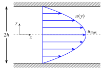
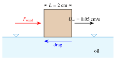
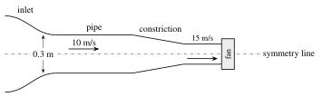
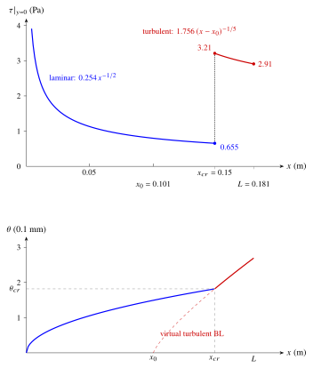

## Chapter 4 · Boundary Layers {#ch4}

<!-- origin: Sheet 3 (Q1-Q12, Q16-Q21). Q13, Q14 and Q15 (Thwaites' method) were dropped: Thwaites' method has been removed from the course. -->

### Boundary-layer thicknesses {#topic-bl-thickness .unnumbered}

::: {.problem #p4-1 data-sec="ch4:sec-bl-thickness" data-ch="4" data-d="1"}
### Problem 4.1 · Energy thickness of two simple profiles {.unnumbered}
<!-- origin: Sheet 3 Q7 -->

[[★ warm-up]{.tag .diff} Study first: [§4.2 Definitions of boundary-layer thickness](../notes/ch4.qmd#sec-bl-thickness)]{.meta}

The energy thickness is sometimes used to evaluate the loss of kinetic energy of the flow in a laminar boundary layer. Defining the energy thickness as
$$
\delta_e = \int_0^{\delta} \left(1 - \frac{u^2}{U_{\infty}^2}\right)\frac{u}{U_{\infty}}\,dy ,
$$
calculate its value for (a) a linear velocity profile, $u/U_{\infty} = y/\delta$; (b) a cubic profile, $u/U_{\infty} = \frac{3}{2}(y/\delta) - \frac{1}{2}(y/\delta)^3$.

Hint

To simplify the calculus, introduce the non-dimensional coordinate $\eta = y/\delta$ (so $dy = \delta\,d\eta$, limits 0 to 1) before integrating. For (b), expand $(3\eta - \eta^3)^3$ with the binomial formula.

Final answer

\(a) $\delta_e = \delta/4 = 0.25\,\delta$; (b) $\delta_e = \dfrac{69}{320}\,\delta \approx 0.216\,\delta$.

(a) $\delta_e/\delta$ = <input type="text" inputmode="decimal"> 
(b) $\delta_e/\delta$ = <input type="text" inputmode="decimal"> 

Full solution

With $\eta = y/\delta$, $dy = \delta\,d\eta$ and the limits $[0,\delta]\to[0,1]$:
$$
\delta_e = \delta \int_0^1 \frac{u}{U_{\infty}} \left( 1 - \left(\frac{u}{U_{\infty}}\right)^2 \right) d\eta
$$

**(a) Linear profile**, $u/U_\infty = \eta$:
$$
\delta_e = \delta \int_0^1 \left( \eta - \eta^3 \right) d\eta = \delta \left[ \frac{\eta^2}{2} - \frac{\eta^4}{4} \right]_0^1 = \delta \left( \frac{1}{2} - \frac{1}{4} \right) = \frac{1}{4}\delta = 0.25\,\delta
$$

**(b) Cubic profile**, $u/U_\infty = \frac{1}{2}(3\eta - \eta^3)$:
$$
\delta_e = \delta \int_0^1 \left[ \frac{1}{2}(3\eta - \eta^3) - \frac{1}{8}(3\eta - \eta^3)^3 \right] d\eta
$$
Expanding with $(a-b)^3 = a^3 - 3a^2b + 3ab^2 - b^3$:
$$
(3\eta - \eta^3)^3 = 27\eta^3 - 27\eta^5 + 9\eta^7 - \eta^9
$$
so that
$$
\begin{aligned}
\delta_e &= \delta \int_0^1 \left[ \left(\frac{3}{2}\eta - \frac{1}{2}\eta^3\right) - \frac{1}{8} \left( 27\eta^3 - 27\eta^5 + 9\eta^7 - \eta^9 \right) \right] d\eta \\
&= \delta \left[ \left( \frac{3}{4} - \frac{1}{8} \right) - \frac{1}{8} \left( \frac{27}{4} - \frac{9}{2} + \frac{9}{8} - \frac{1}{10} \right) \right] \\
&= \delta \left[ \frac{5}{8} - \frac{1}{8}\cdot\frac{131}{40} \right] = \frac{200 - 131}{320}\,\delta = \frac{69}{320}\,\delta \approx 0.216\,\delta
\end{aligned}
$$

<label class="done"><input type="checkbox"> done</label>
:::

### The boundary-layer equations {#topic-bl-equations .unnumbered}

::: {.problem #p4-2 data-sec="ch4:sec-bl-equations" data-ch="4" data-d="2"}
### Problem 4.2 · Special cases of the Prandtl equations {.unnumbered}
<!-- origin: Sheet 3 Q1. Old reference "equations (4.17) and (4.18)" replaced by the equations written out. Part (c) originally read "v ∝ ν" while the solution used v = ν; reworded as v = cν (c constant), with (d) the case c = 1 m^-1. -->
<!-- REVIEW (MB): parts (c)/(d) reworded so that they are dimensionally consistent (v = c nu, c in 1/m); please check this is what was intended. -->

[[★★ core]{.tag .diff} Study first: [§4.3 The boundary-layer equations](../notes/ch4.qmd#sec-bl-equations)]{.meta}

The Prandtl boundary-layer equations for steady, two-dimensional, incompressible flow are
$$
\frac{\partial u}{\partial x} + \frac{\partial v}{\partial y} = 0, \qquad
u\frac{\partial u}{\partial x} + v\frac{\partial u}{\partial y} = -\frac{1}{\rho}\frac{dp}{dx} + \nu \frac{\partial^2 u}{\partial y^2}.
$$
Reduce them to a simpler form for:

(a) flow over a flat plate;
(b) the case $\tau_{xy} = C_1$ (a constant);
(c) the special case in which the transverse velocity is uniform and proportional to the kinematic viscosity, $v = c\,\nu$, where $c$ is a constant (with units of 1/length);
(d) solve the equations for the special case $c = 1\ \text{m}^{-1}$ (so that $v$ is numerically equal to $\nu$ in SI units) and $dp/dx = 0$.

Hint

\(a) What is $dp/dx$ along a flat plate? (b) With $\tau_{xy} = \mu\,\partial u/\partial y$ constant, the viscous term vanishes; then integrate in $x$. (c) If $v$ is uniform, what does continuity say about $\partial u/\partial x$? You will end up with an equation in which one side depends only on $y$ and the other only on $x$. (d) The result of (c) is a linear second-order ODE with constant coefficients.

Final answer

(a) $u\,\partial u/\partial x + v\,\partial u/\partial y = \nu\,\partial^2 u/\partial y^2$.
(b) $\tfrac{1}{2}\rho u^2 + p = -\dfrac{C_1}{\nu}\displaystyle\int v\,dx + f(y)$.
(c) $u = u(y)$ only, and $\dfrac{d^2 u}{dy^2} - c\,\dfrac{du}{dy} = \dfrac{1}{\mu}\dfrac{dp}{dx} = \text{constant}$.
(d) $u = b_1 e^{y} + b_2$ ($y$ in metres), with $b_1$, $b_2$ set by the boundary conditions.

Full solution

**(a)** For flow past a flat plate the pressure gradient is zero, $dp/dx = 0$, so the momentum equation reduces to
$$
u\frac{\partial u}{\partial x} + v\frac{\partial u}{\partial y} = \nu\frac{\partial^2 u}{\partial y^2}
$$

**(b)** If the shear stress is constant, $\tau_{xy} = \mu\,\partial u/\partial y = C_1$, the viscous term is $\partial \tau_{xy}/\partial y = \mu\,\partial^2 u/\partial y^2 = 0$, and the momentum equation reduces to
$$
u\frac{\partial u}{\partial x} + v\frac{\partial u}{\partial y} = -\frac{1}{\rho}\frac{dp}{dx}
$$
Noting that $u\,\partial u/\partial x = \frac{1}{2}\partial u^2/\partial x$ and substituting $\partial u/\partial y = C_1/\mu$:
$$
\frac{1}{2}\frac{\partial u^2}{\partial x} + \frac{1}{\rho}\frac{dp}{dx} = -v\,\frac{C_1}{\mu}
$$
Multiplying by $\rho$ and integrating with respect to $x$ (at fixed $y$, so the "constant" may depend on $y$):
$$
\frac{1}{2}\rho u^2 + p = -\frac{C_1}{\nu} \int v \, dx + f(y)
$$
So the total pressure (static + dynamic) can be determined if we know how the transverse velocity $v$ varies along the flow.

**(c)** If $v = c\nu$ is uniform, $\partial v/\partial y = 0$, and continuity gives $\partial u/\partial x = 0$: $u$ is a function of $y$ only. The momentum equation becomes
$$
c\nu\frac{du}{dy} = -\frac{1}{\rho}\frac{dp}{dx} + \nu\frac{d^2 u}{dy^2}
\quad\Rightarrow\quad
\frac{d^2 u}{dy^2} - c\,\frac{du}{dy} = \frac{1}{\rho\nu}\frac{dp}{dx} = \frac{1}{\mu}\frac{dp}{dx}
$$
The left-hand side is a function of $y$ only, while the right-hand side is a function of $x$ only. This can only be true if both sides are equal to the same constant: the pressure gradient must be uniform.

**(d)** With $c = 1\ \text{m}^{-1}$ and $dp/dx = 0$:
$$
\frac{d^2 u}{dy^2} - \frac{du}{dy} = 0 \quad \Rightarrow \quad \frac{d}{dy}\left(\frac{du}{dy}\right) = \frac{du}{dy}
\quad\Rightarrow\quad
\frac{d(du/dy)}{du/dy} = dy
$$
Integrating:
$$
\ln\left(\frac{du}{dy}\right) = y + C_a \quad \Rightarrow \quad \frac{du}{dy} = b_1 e^y
\quad\Rightarrow\quad
u = b_1 e^y + b_2
$$
where $b_1$ and $b_2$ are constants of integration. Two boundary conditions, on the velocity or the stress at specific boundaries of the flow, are needed to evaluate them.

*Comment.* Here $v>0$ (fluid is *blown* away from the wall) and $e^{y}$ grows without bound, so no non-trivial solution can satisfy both $u(0)=0$ and $u \to U_\infty$ far from the wall. With *suction* ($c<0$) the solution decays instead and gives the asymptotic suction profile of [Problem 4.18](#p4-18).

<label class="done"><input type="checkbox"> done</label>
:::

::: {.problem #p4-3 data-sec="ch4:sec-bl-equations" data-ch="4" data-d="2"}
### Problem 4.3 · Is channel flow a boundary layer? {.unnumbered}
<!-- origin: Sheet 3 Q12 -->

[[★★ core]{.tag .diff} Study first: [§4.3 The boundary-layer equations](../notes/ch4.qmd#sec-bl-equations) and [Workshop 1](../workshops/workshop1.qmd)]{.meta}

Discuss whether fully developed laminar incompressible flow between parallel plates (see [Workshop 1](../workshops/workshop1.qmd)) is an exact solution of the boundary-layer equations and boundary conditions. In what sense, if any, are duct flows also boundary-layer flows?

Hint

Write down the plane Poiseuille solution, $u(y)$ with $v = 0$, and substitute it into the Prandtl equations term by term. Then think about what happens to the boundary layers growing on the two walls near the entrance of a duct.

Final answer

Yes: with $u = \dfrac{h^2}{2\mu}\left(-\dfrac{dp}{dx}\right)\left(1 - \dfrac{y^2}{h^2}\right)$, $v = 0$ and $\partial p/\partial y = 0$, the Prandtl equations are satisfied exactly (and so are the full N–S equations). A fully developed duct flow is a flow in which the boundary layers from opposite walls have merged, so the whole duct is filled with boundary layer; the centreline velocity $u_{\max}$ plays the role of $U_\infty$.

Full solution

{width=55% fig-alt="Parabolic velocity profile between two parallel plates a distance 2h apart, with maximum velocity on the centreline."}

For fully developed laminar incompressible flow between parallel plates the pressure gradient is constant and negative, $dp/dx = \text{constant} < 0$. In Workshop 1 we found the exact solution of the Navier–Stokes equations for this flow:
$$
u(y) = \frac{h^2}{2\mu} \left(-\frac{dp}{dx}\right) \left(1 - \frac{y^2}{h^2}\right), \qquad v = 0
$$
with $\partial p/\partial y = 0$ and the no-slip conditions $u(\pm h) = 0$ satisfied.

**Does it satisfy the boundary-layer equations?** Yes. Continuity is satisfied since $\partial u/\partial x = 0$ and $v = 0$. In the momentum equation both convective terms vanish, leaving $0 = -\frac{1}{\rho}\frac{dp}{dx} + \nu\frac{d^2u}{dy^2}$, which is exactly the equation solved in Workshop 1. In boundary-layer theory we use an order-of-magnitude analysis to argue that $v \ll u$ and $\partial p/\partial y \approx 0$; for fully developed parallel-plate flow $v$ is *exactly* zero and $\partial p/\partial y$ is *exactly* zero, so the flow is an exact solution of both the full Navier–Stokes equations and the reduced boundary-layer equations. (The outer condition $u \to U_\infty$ is replaced by the symmetry condition $\partial u/\partial y = 0$ on the centreline.)

**In what sense are duct flows also boundary-layer flows?** The "free-stream" velocity of boundary-layer theory corresponds to the maximum (centreline) velocity of the duct:
$$
U_{\infty} \leftrightarrow u_{\max} = -\frac{dp}{dx}\, \frac{h^2}{2\mu}
$$
Duct flows are boundary-layer flows in which the boundary layers growing from the opposite walls have met in the centre of the channel. Once this happens the flow is fully developed: the boundary layer cannot grow any further because it is constrained by the walls, and the entire duct is filled with boundary layer. (Unlike an external boundary layer there is then no inviscid core, so $dp/dx$ is set by the wall friction rather than by Bernoulli's equation in an outer flow.)

<label class="done"><input type="checkbox"> done</label>
:::

### Blasius' solution {#topic-blasius .unnumbered}

::: {.problem #p4-4 data-sec="ch4:sec-blasius" data-ch="4" data-d="1"}
### Problem 4.4 · Force to push a cube floating on oil {.unnumbered}
<!-- origin: Sheet 3 Q4. Added a caveat: Re_L is about 1, far outside the range of validity of boundary-layer theory. -->
<!-- REVIEW (MB): with Re_L ≈ 1 the Blasius result is only an order-of-magnitude estimate; a caveat has been added to the solution. Please check whether U = 0.05 cm/s is the intended speed. -->

[[★ warm-up]{.tag .diff} Study first: [§4.4 Blasius' solution](../notes/ch4.qmd#sec-blasius)]{.meta}

A solid cube with sides of 2 cm floats on the surface of an oil bath ($\mu = 8.1 \times 10^{-3}$ Pa s, $\rho = 860\ \text{kg m}^{-3}$). What wind force must be applied to the cube to keep it moving at a constant velocity of 0.05 cm/s? Assume that the drag is predominantly due to skin friction on the bottom face of the cube.

{width=60% fig-alt="A cube floating on an oil bath, pushed by a wind force and moving at 0.05 cm/s, with a drag force acting on its bottom face."}

Hint

Since the cube moves at constant velocity it is in equilibrium: the wind force must exactly balance the skin-friction drag exerted by the oil on the wetted bottom face. Compute $Re_L$ first to decide which drag law applies.

Final answer

$Re_L \approx 1.06$ (laminar), $\overline{C_f} = 1.29$, $F_{\text{wind}} \approx 5.5 \times 10^{-8}$ N (an order-of-magnitude estimate only, since $Re_L$ is so small).

$F_{\text{wind}}$ = <input type="text" inputmode="decimal"> $\times 10^{-8}$ N 

Full solution

**Physical model.** The cube moves at constant velocity, so the net force on it is zero: the required wind force equals the skin-friction drag exerted by the stationary oil on the bottom face of the moving cube.

**Flow parameters.** The kinematic viscosity of the oil is
$$
\nu = \frac{\mu}{\rho} = \frac{8.1 \times 10^{-3}}{860} = 9.419 \times 10^{-6}\ \text{m}^2\,\text{s}^{-1}
$$
The velocity of the cube relative to the oil is $U_{\infty} = 0.05\ \text{cm s}^{-1} = 5\times10^{-4}\ \text{m s}^{-1}$ and the length of the wetted face in the direction of motion is $L = 0.02$ m, so
$$
Re_L = \frac{U_{\infty}L}{\nu} = \frac{5\times10^{-4} \times 0.02}{9.419 \times 10^{-6}} = 1.06
$$

**Drag force.** Since $Re_L \approx 1.06 \ll 5 \times 10^5$ the flow is certainly laminar, and we use the Blasius result for the average skin-friction coefficient:
$$
\overline{C_f} = 1.328\, Re_L^{-1/2} = \frac{1.328}{\sqrt{1.06}} = 1.289
$$
On the wetted face of area $A = 0.02 \times 0.02 = 4 \times 10^{-4}\ \text{m}^2$:
$$
\begin{aligned}
F_{\text{wind}} = D &= \frac{1}{2}\rho U_{\infty}^2 A\, \overline{C_f} = \frac{1}{2} (860) (5\times10^{-4})^2 (4 \times 10^{-4}) (1.289) \\
&= 5.54 \times 10^{-8}\ \text{N}
\end{aligned}
$$

*Caveat.* Boundary-layer theory assumes $Re_L \gg 1$ (so that $\delta \ll L$). Here $Re_L \approx 1$ and the Blasius formula would give $\delta \approx 5L/\sqrt{Re_L} \approx 5L$, so the "boundary layer" is as thick as the cube is long. The answer should therefore be read as an order-of-magnitude estimate of a tiny force, not as an accurate value.

<label class="done"><input type="checkbox"> done</label>
:::

::: {.problem #p4-5 data-sec="ch4:sec-blasius" data-ch="4" data-d="2"}
### Problem 4.5 · Polished flat plate in air and in water {.unnumbered}
<!-- origin: Sheet 3 Q8. Water momentum thickness 0.48 mm corrected to 0.47 mm (rounding). -->

[[★★ core]{.tag .diff} Study first: [§4.4 Blasius' solution](../notes/ch4.qmd#sec-blasius) and [§4.9 Transition](../notes/ch4.qmd#sec-transition)]{.meta}

A highly polished, sharp-edged flat plate of length $L = 1$ m and width $W = 3$ m is immersed parallel to a smooth free stream of velocity $U_{\infty} = 2\ \text{m s}^{-1}$. Find the drag force on one side of the plate, and the boundary-layer thickness $\delta$, displacement thickness $\delta^*$ and momentum thickness $\theta$ at the trailing edge, for

(a) air ($\rho = 1.23\ \text{kg m}^{-3}$, $\nu = 1.46 \times 10^{-5}\ \text{m}^2\,\text{s}^{-1}$);
(b) water ($\rho = 1000\ \text{kg m}^{-3}$, $\nu = 1.02 \times 10^{-6}\ \text{m}^2\,\text{s}^{-1}$).

Hint

Because the plate is highly polished and sharp-edged, and the free stream is smooth, you may assume that transition is delayed until $Re_{cr} = 3 \times 10^6$. Check $Re_L$ for each fluid, then use the Blasius results $\overline{C_f} = 1.328\,Re_L^{-1/2}$, $\delta/x = 5.0\,Re_x^{-1/2}$, $\delta^*/x = 1.721\,Re_x^{-1/2}$, $\theta/x = 0.664\,Re_x^{-1/2}$.

Final answer

Both boundary layers are laminar.
(a) Air: $Re_L = 1.37\times10^5$, $D = 0.0265$ N, $\delta = 13.5$ mm, $\delta^* = 4.65$ mm, $\theta = 1.79$ mm.
(b) Water: $Re_L = 1.96\times10^6$, $D = 5.69$ N, $\delta = 3.57$ mm, $\delta^* = 1.23$ mm, $\theta = 0.474$ mm.

(a) $D$ = <input type="text" inputmode="decimal"> N 
(a) $\delta$ = <input type="text" inputmode="decimal"> mm 
(a) $\delta^*$ = <input type="text" inputmode="decimal"> mm 
(a) $\theta$ = <input type="text" inputmode="decimal"> mm 
(b) $D$ = <input type="text" inputmode="decimal"> N 
(b) $\delta$ = <input type="text" inputmode="decimal"> mm 
(b) $\delta^*$ = <input type="text" inputmode="decimal"> mm 
(b) $\theta$ = <input type="text" inputmode="decimal"> mm 

Full solution

**(a) Air.** The Reynolds number at the trailing edge is
$$
Re_L = \frac{U_{\infty}L}{\nu} = \frac{2.0 \times 1.0}{1.46 \times 10^{-5}} = 1.37 \times 10^5
$$
Since $Re_L < 3 \times 10^6$ (the critical Reynolds number for this highly polished plate) the boundary layer is laminar over the whole plate. From Blasius,
$$
\overline{C_f} = 1.328\, Re_L^{-1/2} = 1.328 \times (1.37 \times 10^5)^{-1/2} = 0.00359
$$
and the drag on one side of the plate, of area $A = 1.0 \times 3.0 = 3.0\ \text{m}^2$, is
$$
D = \frac{1}{2}\rho U_{\infty}^2 A\, \overline{C_f} = \frac{1}{2} (1.23) (2.0)^2 (3.0) (0.00359) = 0.0265\ \text{N}
$$
The boundary-layer thicknesses at $x = L$ are
$$
\begin{aligned}
\delta &= \frac{5.0\, L}{\sqrt{Re_L}} = \frac{5.0 \times 1.0}{\sqrt{1.37 \times 10^5}} = 0.0135\ \text{m} = 13.5\ \text{mm} \\
\delta^* &= \frac{1.7208\, L}{\sqrt{Re_L}} = \frac{1.7208}{5.0}\, \delta \approx 0.344 \times 13.5\ \text{mm} = 4.65\ \text{mm} \\
\theta &= \frac{0.664\, L}{\sqrt{Re_L}} = \frac{\delta^*}{H} = \frac{4.65\ \text{mm}}{2.59} = 1.79\ \text{mm}
\end{aligned}
$$

**(b) Water.**
$$
Re_L = \frac{2.0 \times 1.0}{1.02 \times 10^{-6}} = 1.96 \times 10^6
$$
This is fairly close to, but still below, $3 \times 10^6$, so we assume the flow remains laminar. (If it were turbulent we would have to use the turbulent power-law relationships instead of Blasius.)
$$
\overline{C_f} = 1.328 \times (1.96 \times 10^6)^{-1/2} = 0.000948
$$
$$
D = \frac{1}{2} (1000) (2.0)^2 (3.0) (0.000948) = 5.69\ \text{N}
$$
The drag in water is about 215 times that in air, despite the higher $Re_L$ and lower drag coefficient: this reflects the much higher density of water (1000 vs 1.23 kg m$^{-3}$).
$$
\begin{aligned}
\delta &= \frac{5.0 \times 1.0}{\sqrt{1.96 \times 10^6}} = 0.00357\ \text{m} = 3.57\ \text{mm} \\
\delta^* &= \frac{1.7208}{5.0}\, \delta \approx 0.344 \times 3.57\ \text{mm} = 1.23\ \text{mm} \\
\theta &= \frac{0.664}{5.0}\, \delta \approx 0.1328 \times 3.57\ \text{mm} = 0.474\ \text{mm}
\end{aligned}
$$
The water boundary layer is about 3.8 times thinner than the air boundary layer, which is the square root of the ratio of the kinematic viscosities, $\sqrt{\nu_{\text{air}}/\nu_{\text{water}}} = 3.78$.

<label class="done"><input type="checkbox"> done</label>
:::

### The momentum integral equation and approximate profiles {#topic-mie .unnumbered}

::: {.problem #p4-6 data-sec="ch4:sec-mie" data-ch="4" data-d="1"}
### Problem 4.6 · Friction force equals momentum deficit {.unnumbered}
<!-- origin: Sheet 3 Q20 -->

[[★ warm-up]{.tag .diff} Study first: [§4.5 The momentum integral equation](../notes/ch4.qmd#sec-mie)]{.meta}

Given that the momentum integral equation (MIE) for a zero-pressure-gradient boundary layer has the form
$$
\frac{\tau|_{y=0}}{\rho U_{\infty}^2} = \frac{d\theta}{dx},
$$
show that the friction force per unit width for any such boundary layer, over a length $x$, is $\rho U_{\infty}^2 \theta$.

Hint

Multiply by $dx$ and integrate from the leading edge (where $\theta = 0$) to $x$. What is $U_\infty$ doing along the plate?

Final answer

$$
\frac{F}{W} = \int_0^x \tau|_{y=0}\, dx = \rho U_\infty^2 \int_0^{\theta} d\theta = \rho U_\infty^2\, \theta(x)
$$
and hence $\overline{C_f} = 2\theta(L)/L$.

Full solution

Rearranging the MIE and separating variables:
$$
\tau|_{y=0} = \rho U_{\infty}^2 \frac{d\theta}{dx} \quad\Rightarrow\quad \tau|_{y=0} \, dx = \rho U_{\infty}^2 \, d\theta
$$
Integrate from the leading edge ($x=0$, $\theta=0$) to a distance $x$ (where the momentum thickness is $\theta$). For zero pressure gradient $U_{\infty}$ is constant, so $\rho U_\infty^2$ comes out of the integral:
$$
\int_0^x \tau|_{y=0} \, dx = \rho U_{\infty}^2 \int_0^{\theta} d\theta = \rho U_{\infty}^2\, \theta
$$
The integral of the local wall shear stress over the length $x$ is the total skin-friction force (drag) per unit width, $F/W$. Hence
$$
\frac{F}{W} = \rho U_{\infty}^2\, \theta
$$
The momentum thickness is a direct measure of the drag accumulated upstream. Dividing by $\frac{1}{2}\rho U_\infty^2 L$ gives the useful result $\overline{C_f} = 2\theta(L)/L$.

<label class="done"><input type="checkbox"> done</label>
:::

::: {.problem #p4-7 data-sec="ch4:sec-mie" data-ch="4" data-d="2"}
### Problem 4.7 · Cubic laminar profile and the MIE {.unnumbered}
<!-- origin: Sheet 3 Q2. Old reference "Eq. 4.41" replaced by the formula. -->

[[★★ core]{.tag .diff} Study first: [§4.5 The momentum integral equation](../notes/ch4.qmd#sec-mie) and [§4.4 Blasius' solution](../notes/ch4.qmd#sec-blasius)]{.meta}

Experimental data for laminar flow over a flat plate at zero incidence suggest that
$$
\frac{u}{U_{\infty}} = a\left(\frac{y}{\delta}\right) + b\left(\frac{y}{\delta}\right)^3
$$
is a good approximation for the velocity through the boundary layer.

(a) Using appropriate boundary conditions, evaluate the constants $a$ and $b$.
(b) Using the momentum integral equation (MIE), obtain expressions for the boundary-layer thickness $\delta$, displacement thickness $\delta^*$, momentum thickness $\theta$ and the wall shear stress $\tau|_{y=0}$.
(c) Compare your results with the average skin-friction coefficient of Blasius, $\overline{C_f} = 1.328\,Re_L^{-1/2}$.

Hint

\(a) Two conditions at $y=\delta$ are needed: $u = U_\infty$ and $du/dy = 0$ ($u = 0$ at the wall is automatic). (b) Compute $\theta$ in terms of $\delta$ using $\eta = y/\delta$, compute $\tau|_{y=0} = \mu\,(du/dy)_{y=0}$, substitute both into $\tau|_{y=0} = \rho U_\infty^2\,d\theta/dx$ and integrate with $\delta(0)=0$. (c) Use $\overline{C_f} = 2\theta(L)/L$ ([Problem 4.6](#p4-6)).

Final answer

(a) $a = 3/2$, $b = -1/2$.
(b) $\theta = \frac{39}{280}\delta$, $\delta^* = \frac{3}{8}\delta$, and
$\dfrac{\delta}{x} = \dfrac{4.64}{\sqrt{Re_x}}$, $\dfrac{\delta^*}{x} = \dfrac{1.74}{\sqrt{Re_x}}$, $\dfrac{\theta}{x} = \dfrac{0.646}{\sqrt{Re_x}}$, $\tau|_{y=0} = 0.323\,\rho U_\infty^2\, Re_x^{-1/2}$.
(c) $\overline{C_f} = 1.293\, Re_L^{-1/2}$, about 3% below Blasius.

$\delta\sqrt{Re_x}/x$ = <input type="text" inputmode="decimal"> 
$\theta\sqrt{Re_x}/x$ = <input type="text" inputmode="decimal"> 
$\delta^*\sqrt{Re_x}/x$ = <input type="text" inputmode="decimal"> 
$\overline{C_f}\sqrt{Re_L}$ = <input type="text" inputmode="decimal"> 

Full solution

**(a)** The profile must satisfy the flat-plate boundary conditions:

- no slip at the wall: $u = 0$ at $y = 0$ (automatically satisfied);
- $u = U_{\infty}$ at $y = \delta$: $1 = a + b$;
- smooth merging with the free stream, $du/dy = 0$ at $y = \delta$: since $\dfrac{du}{dy} = U_{\infty} \left[ \dfrac{a}{\delta} + \dfrac{3b y^2}{\delta^3} \right]$, this gives $a + 3b = 0$.

Solving $a + b = 1$ and $a + 3b = 0$ gives $b = -1/2$, $a = 3/2$:
$$
\frac{u}{U_{\infty}} = \frac{3}{2}\left(\frac{y}{\delta}\right) - \frac{1}{2}\left(\frac{y}{\delta}\right)^3
$$

**(b)** For a flat plate ($dp/dx = 0$) the MIE is $\tau|_{y=0} = \rho U_{\infty}^2\, d\theta/dx$.

*Step 1: momentum thickness.* With $\eta = y/\delta$, $dy = \delta\,d\eta$:
$$
\begin{aligned}
\theta &= \int_0^{\delta} \frac{u}{U_{\infty}}\left(1 - \frac{u}{U_{\infty}}\right)dy
= \delta \int_0^1 \left( \frac{3}{2}\eta - \frac{1}{2}\eta^3 \right) \left( 1 - \frac{3}{2}\eta + \frac{1}{2}\eta^3 \right) d\eta \\
&= \delta \int_0^1 \left( \frac{3}{2}\eta - \frac{9}{4}\eta^2 - \frac{1}{2}\eta^3 + \frac{3}{2}\eta^4 - \frac{1}{4}\eta^6 \right) d\eta \\
&= \delta \left( \frac{3}{4} - \frac{3}{4} - \frac{1}{8} + \frac{3}{10} - \frac{1}{28} \right) = \frac{39}{280}\,\delta
\end{aligned}
$$

*Step 2: wall shear stress.*
$$
\tau|_{y=0} = \mu \frac{du}{dy}\Big|_{y=0} = \mu U_{\infty} \left[ \frac{3}{2\delta} - \frac{3y^2}{2\delta^3} \right]_{y=0} = \frac{3\mu U_{\infty}}{2\delta}
$$

*Step 3: solve the MIE for $\delta$.*
$$
\frac{3\mu U_{\infty}}{2\delta} = \frac{39}{280}\,\rho U_{\infty}^2 \frac{d\delta}{dx}
\quad\Rightarrow\quad
\delta \, d\delta = \frac{3 \times 280}{2 \times 39} \frac{\nu}{U_{\infty}} \, dx = \frac{140}{13} \frac{\nu}{U_{\infty}} \, dx
$$
Integrating with $\delta = 0$ at $x = 0$:
$$
\frac{\delta^2}{2} = \frac{140}{13} \frac{\nu x}{U_{\infty}} \quad \Rightarrow \quad \delta = \sqrt{\frac{280}{13} \frac{\nu x}{U_{\infty}}} \approx 4.64 \sqrt{\frac{\nu x}{U_{\infty}}}
\quad\Rightarrow\quad
\frac{\delta}{x} = \frac{4.64}{\sqrt{Re_x}}
$$

*Step 4: $\theta$, $\delta^*$ and $\tau|_{y=0}$ in terms of $Re_x$.*
$$
\frac{\theta}{x} = \frac{39}{280} \cdot \frac{4.64}{\sqrt{Re_x}} = \frac{0.646}{\sqrt{Re_x}}
$$
$$
\begin{aligned}
\delta^* &= \int_0^{\delta} \left(1 - \frac{u}{U_{\infty}}\right)dy = \delta \int_0^1 \left( 1 - \frac{3}{2}\eta + \frac{1}{2}\eta^3 \right) d\eta \\
&= \delta \left[ \eta - \frac{3}{4}\eta^2 + \frac{1}{8}\eta^4 \right]_0^1 = \frac{3}{8}\delta
\quad\Rightarrow\quad
\frac{\delta^*}{x} = \frac{1.74}{\sqrt{Re_x}}
\end{aligned}
$$
$$
\tau|_{y=0} = \frac{3\mu U_{\infty}}{2\delta} = \frac{3\mu U_{\infty}}{2} \cdot \frac{\sqrt{Re_x}}{4.64\, x} = 0.323\, \frac{\mu U_{\infty}}{x} \sqrt{Re_x} = 0.323\, \rho U_{\infty}^2\, Re_x^{-1/2}
$$

**(c)** Instead of integrating the local shear stress, use the MIE result of [Problem 4.6](#p4-6): the drag on one side of a plate of width $W$ is $D = W\rho U_\infty^2\, \theta(L)$, so
$$
\overline{C_f} = \frac{D}{\frac{1}{2}\rho U_{\infty}^2 L W} = \frac{2\theta(L)}{L} = 2 \times 0.646\, Re_L^{-1/2} = 1.293\, Re_L^{-1/2}
$$

**Comparison with Blasius:**

| quantity | cubic profile | Blasius | difference |
|:--|:--|:--|:--|
| $\tau\vert_{y=0}/(\rho U_\infty^2 Re_x^{-1/2})$ | 0.323 | 0.332 | 3% lower |
| $\delta\sqrt{Re_x}/x$ | 4.64 | 5.0 | 7% lower |
| $\theta\sqrt{Re_x}/x$ | 0.646 | 0.664 | 3% lower |
| $\delta^*\sqrt{Re_x}/x$ | 1.74 | 1.72 | 1% higher |
| $\overline{C_f}\sqrt{Re_L}$ | 1.293 | 1.328 | 3% lower |

<label class="done"><input type="checkbox"> done</label>
:::

::: {.problem #p4-8 data-sec="ch4:sec-mie" data-ch="4" data-d="2"}
### Problem 4.8 · Sine-wave laminar profile {.unnumbered}
<!-- origin: Sheet 3 Q9 -->

[[★★ core]{.tag .diff} Study first: [§4.5 The momentum integral equation](../notes/ch4.qmd#sec-mie)]{.meta}

If the velocity profile through a laminar boundary layer can be written as
$$
\frac{u}{U_{\infty}} = \sin\left(\frac{\pi y}{2\delta}\right),
$$
obtain expressions for $\delta^*$, $\theta$, $\delta$, $C_f$ and $H$. How do these compare with their Blasius equivalents?

Hint

Use the MIE as in [Problem 4.7](#p4-7). To make the integration simpler use $\eta = y/\delta$ and the identity $\sin^2 z = \frac{1}{2}(1 - \cos 2z)$. For the local $C_f$, note that $\theta \propto x^{1/2}$, so $d\theta/dx = \theta/(2x)$.

Final answer

$\delta^* = \dfrac{\pi-2}{\pi}\delta = 0.363\,\delta$, $\theta = \dfrac{4-\pi}{2\pi}\delta = 0.137\,\delta$, and
$\dfrac{\delta}{x} = \dfrac{4.80}{\sqrt{Re_x}}$, $\dfrac{\theta}{x} = \dfrac{0.655}{\sqrt{Re_x}}$, $\dfrac{\delta^*}{x} = \dfrac{1.743}{\sqrt{Re_x}}$, $C_f = \dfrac{0.655}{\sqrt{Re_x}}$, $H = 2.66$: all within about 1–3% of Blasius except $\delta$ (4% low).

$\delta\sqrt{Re_x}/x$ = <input type="text" inputmode="decimal"> 
$C_f\sqrt{Re_x}$ = <input type="text" inputmode="decimal"> 
$H$ = <input type="text" inputmode="decimal"> 

Full solution

**1. Thicknesses.** With $\eta = y/\delta$ the profile is $u/U_{\infty} = \sin(\pi\eta/2)$.
$$
\begin{aligned}
\delta^* &= \delta \int_0^1 \left[ 1 - \sin\left(\frac{\pi}{2}\eta\right) \right] d\eta
= \delta \left[ \eta + \frac{2}{\pi}\cos\left(\frac{\pi}{2}\eta\right) \right]_0^1 \\
&= \delta \left[ 1 - \frac{2}{\pi} \right] = \frac{\pi - 2}{\pi}\,\delta \approx 0.3634\,\delta
\end{aligned}
$$
$$
\begin{aligned}
\theta &= \delta \int_0^1 \left[ \sin\left(\frac{\pi}{2}\eta\right) - \sin^2\left(\frac{\pi}{2}\eta\right) \right] d\eta \\
&= \delta \int_0^1 \left[ \sin\left(\frac{\pi}{2}\eta\right) - \frac{1}{2}\left(1 - \cos(\pi\eta)\right) \right] d\eta \\
&= \delta \left[ -\frac{2}{\pi}\cos\left(\frac{\pi}{2}\eta\right) - \frac{1}{2}\eta + \frac{1}{2\pi}\sin(\pi\eta) \right]_0^1 \\
&= \delta \left( \frac{2}{\pi} - \frac{1}{2} \right) = \frac{4 - \pi}{2\pi}\,\delta \approx 0.1366\,\delta
\end{aligned}
$$

**2. Wall shear stress.**
$$
\tau|_{y=0} = \mu \frac{du}{dy}\Big|_{y=0} = \mu U_{\infty} \left[ \frac{\pi}{2\delta} \cos\left(\frac{\pi y}{2\delta}\right) \right]_{y=0} = \frac{\pi\mu U_{\infty}}{2\delta}
$$

**3. MIE.** Substituting into $\tau|_{y=0} = \rho U_{\infty}^2\, d\theta/dx$:
$$
\frac{\pi\nu}{2U_{\infty}\delta} = \frac{4 - \pi}{2\pi}\, \frac{d\delta}{dx}
\quad\Rightarrow\quad
\delta \, d\delta = \frac{\pi^2}{4 - \pi}\, \frac{\nu}{U_{\infty}}\, dx
$$
Integrating from the leading edge ($x=0$, $\delta=0$):
$$
\frac{\delta^2}{2} = \frac{\pi^2}{4 - \pi}\, \frac{\nu x}{U_{\infty}} \quad \Rightarrow \quad \delta = \sqrt{\frac{2\pi^2}{4 - \pi}} \sqrt{\frac{\nu x}{U_{\infty}}}
$$
$$
\frac{\delta}{x} = \frac{4.795}{\sqrt{Re_x}} \approx 4.80\, Re_x^{-1/2}
$$

**4. Remaining parameters and comparison with Blasius.**

- Momentum thickness: $\dfrac{\theta}{x} = 0.1366 \times \dfrac{4.795}{\sqrt{Re_x}} = 0.655\, Re_x^{-1/2}$ (Blasius $0.664$: 1.3% lower).
- Displacement thickness: $\dfrac{\delta^*}{x} = 0.3634 \times \dfrac{4.795}{\sqrt{Re_x}} = 1.743\, Re_x^{-1/2}$ (Blasius $1.7208$: 1.3% higher).
- Shape factor: $H = \delta^*/\theta = 1.743/0.655 = 2.66$ (Blasius 2.59: slightly higher).
- Local skin friction: from the MIE, $C_f = 2\,d\theta/dx$. Since $\theta \propto x^{1/2}$, $d\theta/dx = \theta/(2x)$, so $C_f = \theta/x = 0.655\, Re_x^{-1/2}$ (Blasius $0.664$: 1.3% lower).
- Boundary-layer thickness: $4.80$ vs Blasius $5.0$ (4% lower).

On the whole the sine profile compares extremely well with the exact Blasius solution, mostly within 1–2%.

<label class="done"><input type="checkbox"> done</label>
:::

::: {.problem #p4-9 data-sec="ch4:sec-mie" data-ch="4" data-d="2"}
### Problem 4.9 · Pohlhausen's quartic profile {.unnumbered}
<!-- origin: Sheet 3 Q10 -->

[[★★ core]{.tag .diff} Study first: [§4.5 The momentum integral equation](../notes/ch4.qmd#sec-mie)]{.meta}

Repeat [Problem 4.8](#p4-8) using the polynomial velocity profile for a laminar boundary layer suggested by Pohlhausen:
$$
\frac{u}{U_{\infty}} = 2\left(\frac{y}{\delta}\right) - 2\left(\frac{y}{\delta}\right)^3 + \left(\frac{y}{\delta}\right)^4
$$
Does this profile satisfy the boundary conditions of laminar flat-plate boundary-layer flow?

Hint

The steps are the same as in [Problem 4.8](#p4-8). For the boundary conditions, check the kinematic conditions at the wall and at the edge of the layer, and also the condition obtained by evaluating the boundary-layer momentum equation *at the wall* (where $u = v = 0$).

Final answer

$\delta^* = \frac{3}{10}\delta$, $\theta = \frac{37}{315}\delta$, $\tau|_{y=0} = 2\mu U_\infty/\delta$, and
$\dfrac{\delta}{x} = \dfrac{5.84}{\sqrt{Re_x}}$, $\dfrac{\theta}{x} = \dfrac{0.685}{\sqrt{Re_x}}$, $\dfrac{\delta^*}{x} = \dfrac{1.751}{\sqrt{Re_x}}$, $C_f = \dfrac{0.685}{\sqrt{Re_x}}$, $H = 2.554$.
Yes: $u(0) = 0$, $u(\delta) = U_\infty$, $\partial u/\partial y|_\delta = 0$ and $\partial^2 u/\partial y^2|_0 = 0$ are all satisfied.

$\delta\sqrt{Re_x}/x$ = <input type="text" inputmode="decimal"> 
$C_f\sqrt{Re_x}$ = <input type="text" inputmode="decimal"> 
$H$ = <input type="text" inputmode="decimal"> 

Full solution

**Part 1: boundary-layer parameters.** Having worked through related problems in full ([Problems 4.1](#p4-1), [4.7](#p4-7) and [4.8](#p4-8)), it is a useful exercise to work through the algebra of this one yourself. With $\eta = y/\delta$ the profile is $u/U_{\infty} = 2\eta - 2\eta^3 + \eta^4$ and
$$
\delta^* = \delta \int_0^1 \left(1 - 2\eta + 2\eta^3 - \eta^4\right) d\eta,
$$
$$
\theta = \delta \int_0^1 \left(2\eta - 2\eta^3 + \eta^4\right)\left(1 - 2\eta + 2\eta^3 - \eta^4\right) d\eta
$$
Expanding the polynomials and integrating term by term gives
$$
\delta^* = \frac{3}{10}\,\delta \qquad \text{and} \qquad \theta = \frac{37}{315}\,\delta
$$
The wall shear stress is
$$
\tau|_{y=0} = \mu \frac{U_{\infty}}{\delta} \left[ 2 - 6\eta^2 + 4\eta^3 \right]_{\eta=0} = \frac{2\mu U_{\infty}}{\delta}
$$
Substituting into the MIE ($\tau|_{y=0} = \rho U_{\infty}^2\, d\theta/dx$) and separating variables:
$$
\delta \, d\delta = \frac{630}{37} \frac{\nu}{U_{\infty}}\, dx
\quad\Rightarrow\quad
\frac{\delta}{x} = \sqrt{\frac{1260}{37}}\; Re_x^{-1/2} \approx 5.836\, Re_x^{-1/2}
$$
Hence:

- momentum thickness: $\theta/x = \frac{37}{315} \times 5.836\, Re_x^{-1/2} = 0.685\, Re_x^{-1/2}$;
- displacement thickness: $\delta^*/x = \frac{3}{10} \times 5.836\, Re_x^{-1/2} = 1.751\, Re_x^{-1/2}$;
- local skin friction: $C_f = \dfrac{\tau|_{y=0}}{\frac{1}{2}\rho U_{\infty}^2} = \dfrac{4\nu}{U_{\infty}\delta} = 0.685\, Re_x^{-1/2}$;
- shape factor: $H = \dfrac{3/10}{37/315} = \dfrac{945}{370} \approx 2.554$.

Compare these with the table of results for the other approximate profiles in [the notes](../notes/ch4.qmd#sec-mie) and with Blasius ($0.664$, $1.721$, $0.664$, $2.59$).

**Part 2: boundary conditions.**

1. *No slip at the plate:* at $\eta=0$, $u/U_{\infty} = 0$. Satisfied.
2. *Smooth merging with the free stream:* at $\eta=1$, $u/U_{\infty} = 2 - 2 + 1 = 1$, and $\partial u/\partial y = \frac{U_{\infty}}{\delta} (2 - 6\eta^2 + 4\eta^3) = 0$ at $\eta = 1$. Satisfied.
3. *Zero curvature at the wall (dynamic condition):* evaluating the boundary-layer momentum equation at the wall,
$$
\left( u\frac{\partial u}{\partial x} + v\frac{\partial u}{\partial y} \right)_{y=0} = -\frac{1}{\rho}\frac{dp}{dx} + \nu \left( \frac{\partial^2 u}{\partial y^2} \right)_{y=0}
$$
Since $u = v = 0$ at the wall and $dp/dx = 0$ for a flat plate, this requires $(\partial^2 u/\partial y^2)_{y=0} = 0$. For our profile
$$
\frac{\partial^2 u}{\partial y^2} = \frac{U_{\infty}}{\delta^2} \left( -12\eta + 12\eta^2 \right) = 0 \quad\text{at}\quad \eta = 0 .
$$
Satisfied (in fact the curvature also vanishes at $\eta = 1$).

Therefore the Pohlhausen profile satisfies all the boundary conditions of laminar flat-plate boundary-layer flow.

<label class="done"><input type="checkbox"> done</label>
:::

::: {.problem #p4-10 data-sec="ch4:sec-mie" data-ch="4" data-d="2"}
### Problem 4.10 · Why does an exponential profile fail? {.unnumbered}
<!-- origin: Sheet 3 Q11 -->

[[★★ core]{.tag .diff} Study first: [§4.5 The momentum integral equation](../notes/ch4.qmd#sec-mie) and [§4.3 The boundary-layer equations](../notes/ch4.qmd#sec-bl-equations)]{.meta}

The velocity profile
$$
\frac{u}{U_{\infty}} = 1 - e^{-4.605\, y/\delta}
$$
is a smooth curve that satisfies $u=0$ at $y=0$ and reaches $u \approx 0.99\, U_{\infty}$ at $y=\delta$. It would therefore seem a reasonable substitute for the polynomial flat-plate profiles of the notes. Yet, when it is used in a momentum-integral analysis for a flat plate, it gives the poor result $\delta/x = 9.2\,Re_x^{-1/2}$, about 80% above the Blasius value. What is the physical or mathematical reason for this inaccuracy?

Hint

Evaluate the boundary-layer momentum equation at the wall, $y = 0$, for a flat plate. What does it require of $\partial^2 u/\partial y^2$ there? Then check the exponential profile.

Final answer

At the wall a zero-pressure-gradient boundary layer must have $(\partial^2 u/\partial y^2)_{y=0} = 0$. The exponential profile has $(\partial^2 u/\partial y^2)_{y=0} = -21.2\, U_\infty/\delta^2 \neq 0$: a strongly negative wall curvature, which corresponds to a strongly favourable pressure gradient, not a flat plate.

Full solution

The exponential profile satisfies the no-slip condition ($u=0$ at $y=0$) and merges smoothly with the free stream ($u \approx U_{\infty}$ at $y=\delta$), but it fails to satisfy a crucial **dynamic** boundary condition for a zero-pressure-gradient flat plate.

Evaluate the boundary-layer $x$-momentum equation at the wall:
$$
\left( u\frac{\partial u}{\partial x} + v\frac{\partial u}{\partial y} \right)_{y=0} = -\frac{1}{\rho}\frac{dp}{dx} + \nu \left( \frac{\partial^2 u}{\partial y^2} \right)_{y=0}
$$
Since $u = v = 0$ at the wall (no slip, no penetration) and $dp/dx = 0$, the equation requires
$$
\left( \frac{\partial^2 u}{\partial y^2} \right)_{y=0} = 0
$$
For the exponential profile:
$$
\frac{\partial u}{\partial y} = U_{\infty} \frac{4.605}{\delta}\, e^{-4.605 y/\delta},
$$
$$
\frac{\partial^2 u}{\partial y^2} = -U_{\infty} \left( \frac{4.605}{\delta} \right)^2 e^{-4.605 y/\delta} = -\frac{21.2\, U_{\infty}}{\delta^2}\, e^{-4.605 y/\delta}
$$
so at the wall
$$
\left( \frac{\partial^2 u}{\partial y^2} \right)_{y=0} = -\frac{21.2\, U_{\infty}}{\delta^2} \neq 0
$$

**Conclusion.** The curvature at the wall is strongly *negative*. Since $\mu(\partial^2 u/\partial y^2)_{y=0} = dp/dx$ at a wall, negative wall curvature is the signature of a strongly **favourable pressure gradient** ($dp/dx < 0$), not of a flat plate. Because the shape of the profile is wrong for the physics of a flat plate (in particular its wall gradient is too large relative to its momentum thickness), the momentum-integral analysis badly overpredicts the boundary-layer growth.

*Remark.* This exponential shape is not useless: it is the exact *asymptotic suction profile* of [Problem 4.18](#p4-18). There $v = -V_s \neq 0$ at the wall, so the wall condition becomes $\nu\,\partial^2u/\partial y^2 = -V_s\,\partial u/\partial y$, which the exponential satisfies.

<label class="done"><input type="checkbox"> done</label>
:::

### Turbulent boundary layers {#topic-turbulent-bl .unnumbered}

::: {.problem #p4-11 data-sec="ch4:sec-turbulent-bl" data-ch="4" data-d="2"}
### Problem 4.11 · Thin-shear-layer equations for axisymmetric turbulent flow {.unnumbered}
<!-- origin: Sheet 3 Q18. Assumption list corrected/completed: "small transverse gradients" relabelled as slow streamwise (axial) development; added dP/dr ≈ 0, U_r << U_z and the neglect of axial stress gradients. -->

[[★★ core]{.tag .diff} Study first: [§4.6 Turbulent boundary layers](../notes/ch4.qmd#sec-turbulent-bl), [the boundary-layer equations](../notes/ch4.qmd#sec-bl-equations) and [§3.7 The RANS equations](../notes/ch3.qmd#sec-rans)]{.meta}

The boundary-layer (thin-shear-layer) approximation of the Reynolds-averaged Navier–Stokes equations for an axisymmetric incompressible turbulent flow is
$$
U_z \frac{\partial U_z}{\partial z} + U_r \frac{\partial U_z}{\partial r} = -\frac{1}{\rho}\frac{dP_w}{dz} - \frac{1}{r}\frac{\partial}{\partial r}\left[ r\,\overline{u_r'u_z'} - \nu r \frac{\partial U_z}{\partial r} \right]
$$
where $z$ is the axial direction and $P_w$ is the static pressure at the wall or at the edge of the shear layer. The corresponding continuity equation is
$$
\frac{\partial U_z}{\partial z} + \frac{1}{r}\frac{\partial(r U_r)}{\partial r} = 0 .
$$
State the assumptions made for these approximations to be valid. State, with explanations, which terms in the momentum equation must be retained in the following cases:

(i) the development of a pipe flow, before it becomes a fully developed turbulent flow;
(ii) the fully turbulent core of a fully developed pipe flow;
(iii) the downstream region of a fully developed round turbulent free jet.

Hint

Think about how Prandtl's equations were obtained from the N–S equations: what is assumed about the thickness of the layer, the size of the radial velocity, the axial derivatives and the pressure across the layer? For each case ask: does $U_z$ change with $z$? Is there an imposed pressure gradient? Are viscous stresses comparable with Reynolds stresses?

Final answer

Assumptions: steady (in the mean), axisymmetric with no swirl; thin layer ($\delta/L \ll 1$) so $U_r \ll U_z$ and $\partial/\partial z \ll \partial/\partial r$; axial diffusion terms negligible; pressure constant across the layer ($P = P_w(z)$); high Reynolds number.
\(i) all terms; (ii) $0 = -\frac{1}{\rho}\frac{dP_w}{dz} - \frac{1}{r}\frac{\partial}{\partial r}\left(r\,\overline{u_r'u_z'}\right)$; (iii) $U_z \frac{\partial U_z}{\partial z} + U_r \frac{\partial U_z}{\partial r} = -\frac{1}{r}\frac{\partial}{\partial r}\left(r\,\overline{u_r'u_z'}\right)$.

Full solution

**Part 1: assumptions.** The thin-shear-layer approximations rely on:

- **Steady mean flow:** the mean flow is independent of time ($\partial/\partial t = 0$).
- **Axisymmetry:** the mean flow is two-dimensional and axisymmetric, so all derivatives with respect to the azimuthal angle vanish ($\partial/\partial \theta = 0$) and there is no swirl ($U_\theta = 0$).
- **Thin layer:** the shear-layer thickness $\delta$ is much smaller than the length $L$ over which the flow develops in the axial direction, $\delta/L \ll 1$. Consequently the radial velocity is small, $U_r \ll U_z$.
- **Slow streamwise (axial) development:** axial derivatives are much smaller than radial ones, $\partial U_z/\partial z \ll \partial U_z/\partial r$, so axial diffusion terms ($\nu\,\partial^2 U_z/\partial z^2$ and $\partial \overline{u_z'^2}/\partial z$) are negligible compared with the radial ones.
- **No pressure variation across the layer:** the radial momentum equation reduces to $\partial P/\partial r \approx 0$, so the pressure is imposed from the wall/edge, $P = P_w(z)$.
- **High Reynolds number**, so that the layer is thin and turbulent.

**Part 2: flow cases.**

**(i) Developing pipe flow.** Before the flow is fully developed the boundary layers are still growing, so the core flow accelerates along the pipe: $\partial U_z/\partial z \neq 0$, and by continuity $U_r \neq 0$. Near the wall both the Reynolds shear stress ($-\rho\overline{u_r'u_z'}$) and the viscous shear stress ($\mu\,\partial U_z/\partial r$) are important, and a pressure gradient ($dP_w/dz \neq 0$) drives the flow and accelerates the core. *Conclusion:* essentially all terms in the momentum equation are significant and must be retained.

**(ii) Fully turbulent core of a fully developed pipe flow.** The velocity profile no longer changes in the axial direction, $\partial U_z/\partial z = 0$. Continuity then gives $\partial(rU_r)/\partial r = 0$, so $rU_r$ = constant $= 0$ (from $r = 0$, or from the wall), i.e. $U_r = 0$. Both convective terms on the left-hand side vanish. In the turbulent core the viscous stress is negligible compared with the Reynolds stress. *Conclusion:* only the pressure-gradient and Reynolds-stress terms are retained:
$$
0 = -\frac{1}{\rho}\frac{dP_w}{dz} - \frac{1}{r}\frac{\partial}{\partial r}\left[ r\,\overline{u_r'u_z'} \right]
$$

**(iii) Round turbulent free jet (far downstream).** For a jet discharging into quiescent surroundings the pressure everywhere in the jet is essentially the ambient pressure, so $dP_w/dz \approx 0$. Being fully turbulent and far from any wall, the viscous stresses are again negligible compared with the Reynolds stresses. But the jet is continuously spreading and entraining fluid, so $\partial U_z/\partial z \neq 0$ and $U_r \neq 0$: the convective terms remain. *Conclusion:* the convective terms and the Reynolds-stress term are retained:
$$
U_z \frac{\partial U_z}{\partial z} + U_r \frac{\partial U_z}{\partial r} = - \frac{1}{r}\frac{\partial}{\partial r}\left[ r\,\overline{u_r'u_z'} \right]
$$

<label class="done"><input type="checkbox"> done</label>
:::

### Turbulent flat-plate boundary layers {#topic-turbulent-flat-plate .unnumbered}

::: {.problem #p4-12 data-sec="ch4:sec-turbulent-flat-plate" data-ch="4" data-d="2"}
### Problem 4.12 · The 1/8th power-law profile {.unnumbered}
<!-- origin: Sheet 3 Q5. Old reference "equation (4.67)" replaced by the formula and a link. -->

[[★★ core]{.tag .diff} Study first: [§4.8 Turbulent flat-plate boundary layers](../notes/ch4.qmd#sec-turbulent-flat-plate)]{.meta}

Calculate the turbulent boundary-layer thickness $\delta$ if the velocity profile is given by the power law
$$
\frac{u}{U_{\infty}} = \left(\frac{y}{\delta}\right)^{1/8},
$$
making use of the empirical shear-stress relationship
$$
C_f = \frac{\tau|_{y=0}}{\frac{1}{2}\rho U_{\infty}^2} = 0.045\left(\frac{\nu}{U_{\infty}\delta}\right)^{1/4}.
$$

Hint

The notes perform the same derivation with the MIE and the 1/7th power law; apply the same method here. Compute $\theta/\delta$ for the 1/8th profile (with $\eta = y/\delta$), equate $\rho U_\infty^2\,d\theta/dx$ to the empirical $\tau|_{y=0}$, separate variables and integrate with $\delta(0)=0$.

Final answer

$\theta = \frac{4}{45}\delta$ and $\delta = 0.398\, x\, Re_x^{-1/5}$ (compared with $0.371\,x\,Re_x^{-1/5}$ for the 1/7th law).

$\delta\,Re_x^{1/5}/x$ = <input type="text" inputmode="decimal"> 

Full solution

**1. Governing equations.** The empirical relationship gives
$$
\tau|_{y=0} = 0.0225\, \rho U_{\infty}^2 \left(\frac{\nu}{U_{\infty}\delta}\right)^{1/4}
$$
and for a flat plate ($dp/dx = 0$) the MIE is $\tau|_{y=0} = \rho U_{\infty}^2\, d\theta/dx$.

**2. Momentum thickness.** With $\eta = y/\delta$:
$$
\begin{aligned}
\theta &= \delta \int_0^1 \eta^{1/8} \left(1 - \eta^{1/8}\right) d\eta = \delta \int_0^1 \left(\eta^{1/8} - \eta^{1/4}\right) d\eta \\
&= \delta \left[ \frac{8}{9}\eta^{9/8} - \frac{4}{5}\eta^{5/4} \right]_0^1 = \delta \left( \frac{8}{9} - \frac{4}{5} \right) = \frac{4}{45}\,\delta
\end{aligned}
$$

**3. Solve for $\delta$.** Equating the MIE and empirical expressions:
$$
\frac{4}{45}\, \rho U_{\infty}^2 \frac{d\delta}{dx} = 0.0225\, \rho U_{\infty}^2 \left(\frac{\nu}{U_{\infty}\delta}\right)^{1/4}
$$
$$
\Rightarrow\quad
\frac{d\delta}{dx} = \frac{45}{4} \times 0.0225 \left(\frac{\nu}{U_{\infty}}\right)^{1/4} \delta^{-1/4} = 0.2531 \left(\frac{\nu}{U_{\infty}}\right)^{1/4} \delta^{-1/4}
$$
Separating variables and integrating with $\delta = 0$ at $x = 0$:
$$
\delta^{1/4} \, d\delta = 0.2531 \left(\frac{\nu}{U_{\infty}}\right)^{1/4} dx
\quad\Rightarrow\quad
\frac{4}{5} \delta^{5/4} = 0.2531 \left(\frac{\nu}{U_{\infty}}\right)^{1/4} x
$$
$$
\Rightarrow\quad \delta^{5/4} = 0.3164 \left(\frac{\nu}{U_{\infty}}\right)^{1/4} x
$$
Raising both sides to the power $4/5$:
$$
\delta = (0.3164)^{4/5} \left(\frac{\nu}{U_{\infty}}\right)^{1/5} x^{4/5} = 0.398 \left(\frac{\nu}{U_{\infty}}\right)^{1/5} x^{4/5}
\quad\Rightarrow\quad
\delta = 0.398\, x\, Re_x^{-1/5}
$$
This is about 7% thicker than the 1/7th-power-law result, $\delta = 0.371\,x\,Re_x^{-1/5}$, with the same $x^{4/5}$ growth.

<label class="done"><input type="checkbox"> done</label>
:::

::: {.problem #p4-13 data-sec="ch4:sec-turbulent-flat-plate" data-ch="4" data-d="1"}
### Problem 4.13 · Growth law from a wall-stress power law {.unnumbered}
<!-- origin: Sheet 3 Q6. Added the restriction 0 < n < 1 needed for theta(0) = 0. -->

[[★ warm-up]{.tag .diff} Study first: [§4.8 Turbulent flat-plate boundary layers](../notes/ch4.qmd#sec-turbulent-flat-plate) and [§4.5 The MIE](../notes/ch4.qmd#sec-mie)]{.meta}

A boundary layer is turbulent from the leading edge to the trailing edge of a smooth flat plate. The shape of the velocity profile is assumed to be similar at all positions along the plate. If the wall shear stress $\tau|_{y=0}$ is inversely proportional to $x^n$, where $n$ is a positive constant ($n < 1$), show that the boundary-layer thickness obeys the power law $\delta \propto x^{1-n}$.

Hint

Start with the MIE for a zero-pressure-gradient flat plate and integrate it. What does the assumption of "similar" velocity profiles imply about the ratio $\theta/\delta$?

Final answer

$d\theta/dx \propto x^{-n} \Rightarrow \theta \propto x^{1-n}$, and similar profiles mean $\theta/\delta$ = constant, so $\delta \propto x^{1-n}$. (For the 1/7th law, $n = 1/5$ and $\delta \propto x^{4/5}$.)

Full solution

For a flat plate ($dp/dx = 0$) the MIE is $\tau|_{y=0} = \rho U_{\infty}^2\, d\theta/dx$. With $\tau|_{y=0} \propto x^{-n}$, and $\rho U_\infty^2$ constant,
$$
\frac{d\theta}{dx} \propto x^{-n}
\quad\Rightarrow\quad
\theta \propto \frac{x^{1-n}}{1-n} + C
$$
The boundary layer starts at the leading edge, $\theta = 0$ at $x = 0$, so $C = 0$ (this requires $n < 1$; for $n \ge 1$ the integral diverges at $x = 0$). Dropping the constant factor $1/(1-n)$:
$$
\theta \propto x^{1-n}
$$
*Similarity:* if the velocity profile has the same shape at all positions, $u/U_\infty = f(y/\delta)$, then $\theta = \delta\int_0^1 f(1-f)\,d\eta$, i.e. $\theta/\delta$ is a constant. Since $\theta$ and $\delta$ are directly proportional,
$$
\delta \propto x^{1-n}
$$
which is the required result. For example, the 1/7th-power-law analysis gives $\tau|_{y=0} \propto x^{-1/5}$ and hence $\delta \propto x^{4/5}$.

<label class="done"><input type="checkbox"> done</label>
:::

::: {.problem #p4-14 data-sec="ch4:sec-turbulent-flat-plate" data-ch="4" data-d="3"}
### Problem 4.14 · Boundary layer in a small wind tunnel {.unnumbered}
<!-- origin: Sheet 3 Q19. Now uses the formula-sheet values theta/x = 0.037 Re^-1/5, delta*/x = 0.0463 Re^-1/5 and H = 1.29 (original: theta/x = 0.036 with H = 1.25). (b) delta* 2.446 -> 2.52 mm; (c) theta3 0.524 -> 0.531 mm, delta*3 0.656 -> 0.682 mm. -->

[[★★★ challenge]{.tag .diff} Study first: [§4.8 Turbulent flat-plate boundary layers](../notes/ch4.qmd#sec-turbulent-flat-plate), [Blasius' solution](../notes/ch4.qmd#sec-blasius) and [§4.5 The MIE](../notes/ch4.qmd#sec-mie)]{.meta}

A small wind tunnel consists of a smooth inlet, a length of 0.3 m diameter pipe, a constriction, and a fan which sucks air from the atmosphere. The velocity in the pipe section is 10 m/s, the air density is $1.2\ \text{kg m}^{-3}$ and the dynamic viscosity of the air is $1.8 \times 10^{-5}$ kg/(m s).

{width=80% fig-alt="Wind tunnel with smooth inlet, a 0.3 m diameter pipe at 10 m/s, a constriction accelerating the flow to 15 m/s, and a fan."}

(a) Assuming that a laminar boundary layer starts at the entrance to the pipe section and undergoes transition at the end of the pipe section, calculate the length of the pipe section, taking the transition Reynolds number as $5 \times 10^5$. Calculate the momentum thickness, displacement thickness and the frictional drag on the pipe wall at the transition point.
(b) If instead transition takes place over a much shorter length, such that the boundary layer is essentially turbulent throughout the pipe section, estimate the displacement thickness at the end of the pipe.
(c) The constriction increases the velocity to 15 m/s over a short length. Assuming that wall friction in the constriction can be neglected, estimate the momentum and displacement thicknesses at the end of the constriction for the turbulent case (b).

Hint

The boundary layer is thin compared with the pipe radius, so treat the pipe wall as a flat plate of width $\pi D$. (a) Blasius; the drag is $\rho U_\infty^2\theta \times \pi D$ ([Problem 4.6](#p4-6)). (b) Use the 1/7th-power-law results. (c) Use the MIE with pressure gradient, $\dfrac{d\theta}{dx} + (H+2)\dfrac{\theta}{U_\infty}\dfrac{dU_\infty}{dx} = \dfrac{C_f}{2}$: with no wall friction the right-hand side is zero, so you can separate variables and integrate directly (take $H$ constant).

Final answer

(a) $L = 0.75$ m, $\theta = 0.704$ mm, $\delta^* = 1.83$ mm, $F = 0.0797$ N.
(b) $\theta = 2.01$ mm, $\delta^* = 2.52$ mm.
(c) $\theta_3 = \theta_2 (15/10)^{-(H+2)} \approx 0.531$ mm, $\delta^*_3 \approx 0.682$ mm.

(a) $L$ = <input type="text" inputmode="decimal"> m 
(a) $\theta$ = <input type="text" inputmode="decimal"> mm 
(a) $\delta^*$ = <input type="text" inputmode="decimal"> mm 
(a) $F$ = <input type="text" inputmode="decimal"> N 
(b) $\delta^*$ = <input type="text" inputmode="decimal"> mm 
(c) $\theta_3$ = <input type="text" inputmode="decimal"> mm 
(c) $\delta^*_3$ = <input type="text" inputmode="decimal"> mm 

Full solution

Throughout we treat the pipe wall as a flat plate of width $\pi D$; this is justified because the boundary layer turns out to be much thinner than the pipe radius (a few mm compared with 150 mm).

**(a) Laminar pipe section.** Transition at $Re_{cr} = 5 \times 10^5$ fixes the length of the pipe section:
$$
\begin{aligned}
Re_{cr} = \frac{\rho U_{\infty} x_{cr}}{\mu} \quad \Rightarrow \quad 5 \times 10^5 &= \frac{1.2 \times 10.0 \times x_{cr}}{1.8 \times 10^{-5}} = 6.67 \times 10^5\, x_{cr} \\
\Rightarrow\quad x_{cr} &= 0.75\ \text{m}
\end{aligned}
$$
At $x = 0.75$ m, from Blasius:
$$
\theta = \frac{0.664\, x}{\sqrt{Re_x}} = \frac{0.664 \times 0.75}{\sqrt{5 \times 10^5}} = 7.04 \times 10^{-4}\ \text{m} = 0.704\ \text{mm},
$$
$$
\delta^* = H\theta = 2.59 \times 0.704\ \text{mm} = 1.82\ \text{mm}
$$
(using $\delta^* = 1.7208\,x/\sqrt{Re_x}$ directly gives 1.825 mm). For the friction drag, $\overline{C_f} = 1.328\, (5 \times 10^5)^{-1/2} = 1.878 \times 10^{-3}$ and the wetted area is $A = \pi D L = \pi \times 0.3 \times 0.75$:
$$
F = \frac{1}{2}\rho U_{\infty}^2 A\, \overline{C_f} = \frac{1}{2}(1.2)(10.0)^2 (\pi \times 0.3 \times 0.75) (1.878 \times 10^{-3}) = 0.0797\ \text{N}
$$
*Check:* for a zero-pressure-gradient boundary layer the drag per unit width is $\rho U_{\infty}^2 \theta$ ([Problem 4.6](#p4-6)); here the "width" is the circumference $\pi D$, so $F = 1.2 \times 100 \times (7.04 \times 10^{-4}) \times (\pi \times 0.3) = 0.0797$ N.

**(b) Turbulent pipe section.** Using the turbulent flat-plate results from the formula sheet, $\theta/x = 0.037\, Re_x^{-1/5}$ and $\delta^*/x = 0.0463\, Re_x^{-1/5}$, at $x = 0.75$ m with $Re_x^{-1/5} = (5\times10^5)^{-1/5} = 0.0725$:
$$
\theta = 0.037 \times 0.75 \times 0.0725 = 2.01 \times 10^{-3}\ \text{m} = 2.01\ \text{mm},
$$
$$
\delta^* = 0.0463 \times 0.75 \times 0.0725 = 2.52 \times 10^{-3}\ \text{m} = 2.52\ \text{mm}.
$$
The turbulent boundary layer is about $\delta = 0.37\,x\,Re_x^{-1/5} \approx 20$ mm thick, still small compared with the 150 mm radius.

**(c) The constriction.** Start from the MIE with pressure gradient:
$$
\frac{d\theta}{dx} + (H+2)\frac{\theta}{U_{\infty}}\frac{dU_{\infty}}{dx} = \frac{C_f}{2}
$$
Neglecting wall friction in the short constriction, $C_f/2 \approx 0$:
$$
\frac{1}{\theta}\frac{d\theta}{dx} + \frac{H+2}{U_{\infty}}\frac{dU_{\infty}}{dx} = 0
$$
Separating variables and integrating from state 2 (end of pipe) to state 3 (end of constriction), with $H$ assumed constant:
$$
\int_{\theta_2}^{\theta_3} \frac{d\theta}{\theta} = -(H+2) \int_{U_{\infty,2}}^{U_{\infty,3}} \frac{dU_{\infty}}{U_{\infty}}
\quad\Rightarrow\quad
\ln\frac{\theta_3}{\theta_2} = -(H+2)\ln\frac{U_{\infty,3}}{U_{\infty,2}}
$$
$$
\Rightarrow\quad
\frac{\theta_3}{\theta_2} = \left(\frac{U_{\infty,3}}{U_{\infty,2}}\right)^{-(H+2)}
$$
With $H = 1.29$, $-(H+2) = -3.29$, and $U_{\infty,2} = 10$, $U_{\infty,3} = 15$ m/s, $\theta_2 = 2.01$ mm:
$$
\frac{\theta_3}{\theta_2} = (1.5)^{-3.29} = 0.264
\quad\Rightarrow\quad
\theta_3 = 0.264 \times 2.01\ \text{mm} = 0.531\ \text{mm},
$$
$$
\delta^*_3 = H\theta_3 = 1.29 \times 0.531\ \text{mm} = 0.682\ \text{mm}
$$
The strongly favourable pressure gradient in the constriction thins the boundary layer considerably.

<label class="done"><input type="checkbox"> done</label>
:::

### Combined laminar and turbulent boundary layers {#topic-combined-bl .unnumbered}

::: {.problem #p4-15 data-sec="ch4:sec-combined-bl" data-ch="4" data-d="3"}
### Problem 4.15 · Deriving Prandtl's transition correction {.unnumbered}
<!-- origin: Sheet 3 Q3. Old reference "equation (4.69)" replaced by the formula and a link. -->

[[★★★ challenge]{.tag .diff} Study first: [§4.10 Combined laminar and turbulent boundary layers](../notes/ch4.qmd#sec-combined-bl) and [§4.8 Turbulent flat-plate boundary layers](../notes/ch4.qmd#sec-turbulent-flat-plate)]{.meta}

The average skin-friction (drag) coefficient for a fully turbulent boundary layer on a flat plate of length $L$ and width $W$ is (see the notes)
$$
\overline{C_f} = \frac{D}{\frac{1}{2}\rho U_{\infty}^2\, L W} = 0.074\, Re_L^{-1/5} .
$$
This assumes the boundary layer is turbulent over the whole plate. If the plate has a sharp leading edge, however, the boundary layer is initially laminar and becomes turbulent only beyond a critical distance $x_{cr}$. To account for this, Prandtl suggested the modification
$$
\overline{C_f} = 0.074\, Re_L^{-1/5} - A\, Re_L^{-1} \qquad \text{for } 5 \times 10^5 < Re_L < 10^7, \qquad (*)
$$
where the constant $A$ depends on the critical Reynolds number $Re_{cr}$ at which transition occurs:

| $Re_{cr}$ | $3 \times 10^5$ | $4 \times 10^5$ | $5 \times 10^5$ | $6 \times 10^5$ | $10^6$ |
|:--|:--|:--|:--|:--|:--|
| $A$ | 1060 | 1400 | 1700 | 2080 | 3340 |

Derive the constant $A$ of equation $(*)$ for a smooth flat plate of unit width. Assume the flow is laminar up to $x_{cr}$ and turbulent for $x_{cr} \le x \le L$, with transition at $Re_{cr} = U_{\infty}x_{cr}/\nu = 5 \times 10^5$. For this derivation assume that the virtual origin of the turbulent boundary layer is at the leading edge ($x_0 = 0$).

Hint

Total drag = (laminar drag on $0 \le x \le x_{cr}$, from Blasius) + (turbulent drag on $x_{cr} \le x \le L$). With $x_0 = 0$ the turbulent part is the fictitious all-turbulent drag up to $L$ minus that up to $x_{cr}$; use $D = \rho U_\infty^2\theta$ per unit width with $\theta = 0.037\,x\,Re_x^{-1/5}$ (consistent with $0.074\,Re_L^{-1/5}$). Finally write $x_{cr}/L = Re_{cr}/Re_L$.

Final answer

$$
A = 0.074\, Re_{cr}^{4/5} - 1.328\, Re_{cr}^{1/2} \approx 1743 \quad\text{for } Re_{cr} = 5\times10^5,
$$
consistent with the tabulated $A = 1700$.

$A$ = <input type="text" inputmode="decimal"> 

Full solution

We sum the drag piecewise. As stated, we use Prandtl's simplification that the turbulent boundary layer behaves as if it had started at the leading edge ($x_0 = 0$): we take the fictitious turbulent drag over the whole plate, subtract the fictitious turbulent drag over the laminar portion, and add back the actual laminar drag.

**1. Laminar section ($0 \le x \le x_{cr}$).** From Blasius,
$$
D_{\text{lam}} = \overline{C}_{f,\text{lam}} \left( \frac{1}{2}\rho U_{\infty}^2\, x_{cr} W \right), \qquad \overline{C}_{f,\text{lam}} = 1.328\, Re_{cr}^{-1/2}
$$
so for unit width, $D_{\text{lam}} = 0.664\, \rho U_{\infty}^2\, x_{cr}\, Re_{cr}^{-1/2}$.

**2. Turbulent section ($x_{cr} \le x \le L$).** With $x_0 = 0$, the turbulent drag over the physical length from $x_{cr}$ to $L$ is the momentum deficit at $L$ minus the fictitious momentum deficit at $x_{cr}$:
$$
D_{\text{turb}} = \rho U_\infty^2 \left[ \theta_{\text{turb}}(L) - \theta_{\text{turb}}(x_{cr}) \right]
= \rho U_\infty^2 \left[ 0.037\, L\, Re_L^{-1/5} - 0.037\, x_{cr}\, Re_{cr}^{-1/5} \right]
$$
using the flat-plate turbulent momentum thickness $\theta = 0.037\, x\, Re_x^{-1/5}$ (which is what $\overline{C_f} = 2\theta(L)/L = 0.074\,Re_L^{-1/5}$ implies).

**3. Total drag and $\overline{C_f}$.**
$$
\begin{aligned}
\overline{C_f} &= \frac{D_{\text{lam}} + D_{\text{turb}}}{\frac{1}{2}\rho U_{\infty}^2 L} \\
&= \frac{2}{L} \left[ 0.664\, x_{cr}\, Re_{cr}^{-1/2} + 0.037\, L\, Re_L^{-1/5} - 0.037\, x_{cr}\, Re_{cr}^{-1/5} \right]
\end{aligned}
$$
$$
\overline{C_f} = 0.074\, Re_L^{-1/5} - 0.074\, \frac{x_{cr}}{L}\, Re_{cr}^{-1/5} + 1.328\, \frac{x_{cr}}{L}\, Re_{cr}^{-1/2}
$$
Writing the length ratio as a ratio of Reynolds numbers, $x_{cr}/L = Re_{cr}/Re_L$:
$$
\begin{aligned}
\overline{C_f} &= 0.074\, Re_L^{-1/5} - 0.074\, \frac{Re_{cr}^{4/5}}{Re_L} + 1.328\, \frac{Re_{cr}^{1/2}}{Re_L} \\
&= 0.074\, Re_L^{-1/5} - \frac{1}{Re_L} \left[ 0.074\, Re_{cr}^{4/5} - 1.328\, Re_{cr}^{1/2} \right]
\end{aligned}
$$
Comparing with $\overline{C_f} = 0.074\, Re_L^{-1/5} - A\, Re_L^{-1}$:
$$
A = 0.074\, Re_{cr}^{4/5} - 1.328\, Re_{cr}^{1/2}
$$
For $Re_{cr} = 5 \times 10^5$:
$$
A = 0.074 \times 36\,239 - 1.328 \times 707.1 = 2681.7 - 939.0 = 1742.6
$$
so $A \approx 1743$, consistent with the tabulated value $A = 1700$. The same formula reproduces the rest of the table too: $A = 1055$, $1403$, $2074$ and $3341$ for $Re_{cr} = 3\times10^5$, $4\times10^5$, $6\times10^5$ and $10^6$.

<label class="done"><input type="checkbox"> done</label>
:::

::: {.problem #p4-16 data-sec="ch4:sec-combined-bl" data-ch="4" data-d="2"}
### Problem 4.16 · Laminar, transitional or tripped: drag on a large plate {.unnumbered}
<!-- origin: Sheet 3 Q17. Numbers recomputed: (a) 36.6 N -> 36.8 N; (b) Cf 0.0028 -> 0.00277, F 248 N -> 245 N; (c) F 264 N -> 265 N. -->

[[★★ core]{.tag .diff} Study first: [§4.10 Combined laminar and turbulent boundary layers](../notes/ch4.qmd#sec-combined-bl), [transition](../notes/ch4.qmd#sec-transition) and [§4.7 The log law](../notes/ch4.qmd#sec-log-law)]{.meta}

To estimate the average skin-friction coefficient $\overline{C_f}$ for different flat-plate boundary-layer regimes, Prandtl proposed two empirical correlations:

1. *Transitional formula*, for a plate on which the flow starts laminar and becomes turbulent:
$\overline{C_f} = 0.074\,Re_L^{-1/5} - A\,Re_L^{-1}$ for $5 \times 10^5 \le Re_L \le 10^7$, where $A$ accounts for the reduced drag of the initial laminar region (e.g. $A=1700$ for $Re_{cr} = 5 \times 10^5$; see [Problem 4.15](#p4-15)).
2. *Fully turbulent formula*, for a plate on which the flow is turbulent from the leading edge, based on the log law:
$\overline{C_f} = \dfrac{0.455}{(\log_{10} Re_L)^{2.58}}$ for $10^6 \le Re_L \le 10^9$.

Using the appropriate expressions, estimate the total frictional drag on a plate of length $L = 3$ m and width $W = 10$ m placed in a wind tunnel at zero incidence in a free stream of 50 m/s, if:

(a) the boundary layer is artificially kept laminar over the entire surface;
(b) the boundary layer undergoes natural transition at $Re_{cr} = 5 \times 10^5$;
(c) the boundary layer is tripped to be turbulent over the entire surface.

What do you observe about the results of (b) and (c)? Assume the tunnel walls have no effect, $\rho = 1.18\ \text{kg m}^{-3}$ and $\nu = 14.7 \times 10^{-6}\ \text{m}^2\,\text{s}^{-1}$.

Hint

Compute $Re_L$ first. Remember that the plate has **two** wetted sides, so the total drag is $2 \times \frac{1}{2}\rho U_\infty^2 (LW)\,\overline{C_f}$. Use Blasius for (a).

Final answer

$Re_L = 1.02\times10^7$. (a) $\overline{C_f} = 4.16\times10^{-4}$, $F = 36.8$ N; (b) $\overline{C_f} = 2.77\times10^{-3}$, $F = 245$ N; (c) $\overline{C_f} = 2.99\times10^{-3}$, $F = 265$ N. (b) and (c) differ by only about 8%: the laminar region ($x_{cr} \approx 0.15$ m) is a small fraction of the 3 m plate.

(a) $F$ = <input type="text" inputmode="decimal"> N 
(b) $F$ = <input type="text" inputmode="decimal"> N 
(c) $F$ = <input type="text" inputmode="decimal"> N 

Full solution

The plate Reynolds number at the trailing edge is
$$
Re_L = \frac{U_{\infty}L}{\nu} = \frac{50 \times 3}{14.7 \times 10^{-6}} = 1.02 \times 10^7
$$
The wetted area of *one* side is $A = L \times W = 30\ \text{m}^2$; the total drag acts on both sides, so
$F = 2 \times \frac{1}{2}\rho U_{\infty}^2 A\, \overline{C_f} = \rho U_{\infty}^2 A\, \overline{C_f} = 1.18 \times 50^2 \times 30 \times \overline{C_f} = 88\,500\, \overline{C_f}$ N.

**(a) Fully laminar.** From Blasius:
$$
\overline{C_f} = 1.328\, Re_L^{-1/2} = \frac{1.328}{(1.02 \times 10^7)^{1/2}} = 4.16\times10^{-4}
$$
$$
\Rightarrow\quad
F = 88\,500 \times 4.16\times10^{-4} = 36.8\ \text{N}
$$

**(b) Transition at $Re_{cr} = 5 \times 10^5$.** There is a laminar region followed by a turbulent one, so we use the transitional formula with $A = 1700$, which subtracts the "missing" turbulent drag at the front of the plate:
$$
\overline{C_f} = \frac{0.074}{(1.02 \times 10^7)^{1/5}} - \frac{1700}{1.02 \times 10^7} = 0.002934 - 0.000167 = 0.00277
$$
$$
\Rightarrow\quad
F = 88\,500 \times 0.00277 = 245\ \text{N}
$$
($Re_L$ is very slightly above the stated upper limit of $10^7$, which is acceptable for an estimate.)

**(c) Fully turbulent.** The flow is turbulent from the leading edge, so there is no laminar region to correct for and the $-A/Re_L$ term does not apply. Since $Re_L$ slightly exceeds $10^7$ we use the fully turbulent (log-law based) formula:
$$
\overline{C_f} = \frac{0.455}{[\log_{10}(1.02 \times 10^7)]^{2.58}} = 0.00299
\quad\Rightarrow\quad
F = 88\,500 \times 0.00299 = 265\ \text{N}
$$

**Observations.** The skin-friction coefficients for (b) (0.00277) and (c) (0.00299) differ by only about 8%, so the total drag is almost the same whether the flow transitions naturally or is turbulent from the start. Physically, the laminar portion ($x_{cr} = 5\times10^5 \nu/U_\infty \approx 0.15$ m) is only about 5% of the 3 m plate, so its effect on the average drag is small. Both are about seven times the fully laminar drag of (a): keeping a boundary layer laminar is very valuable for drag reduction.

<label class="done"><input type="checkbox"> done</label>
:::

::: {.problem #p4-17 data-sec="ch4:sec-combined-bl" data-ch="4" data-d="3"}
### Problem 4.17 · Wall shear stress along a plate with transition {.unnumbered}
<!-- origin: Sheet 3 Q21. Intermediate value (x_cr - x0)^{4/5} ≈ 0.0232 corrected to 0.0895 (final x0 = 0.1011 m was already correct). Hand sketch (sketch_shear_stress.png) replaced by a to-scale TikZ figure. -->

[[★★★ challenge]{.tag .diff} Study first: [§4.10 Combined laminar and turbulent boundary layers](../notes/ch4.qmd#sec-combined-bl)]{.meta}

For boundary-layer flow over a flat plate of length 181 mm the free-stream velocity is 30 m/s ($\rho = 1.2\ \text{kg m}^{-3}$, $\mu = 1.8 \times 10^{-5}$ kg/(m s)). Transition is known to occur at a Reynolds number of 300 000. Determine, and sketch, the local wall shear stress $\tau|_{y=0}$ along the plate, including numerical values of the shear stress at the important points along the plate.

Hint

Find $x_{cr}$. Upstream use Blasius, $\tau|_{y=0} = 0.332\,\rho U_\infty^2 Re_x^{-1/2}$. Downstream, the turbulent layer grows from a virtual origin $x_0$ found by matching momentum thickness at $x_{cr}$: $0.664\,x_{cr}Re_{cr}^{-1/2} = 0.037\,(x_{cr}-x_0)\,Re_{x_{cr}-x_0}^{-1/5}$. Then use the turbulent local friction consistent with that $\theta$, i.e. $C_f = 2\,d\theta/dx = 0.0592\,Re_{x-x_0}^{-1/5}$.

Final answer

$x_{cr} = 150$ mm; laminar $\tau|_{y=0} = 0.254\,x^{-1/2}$ Pa ($x$ in m), infinite at the leading edge and 0.655 Pa just before transition; virtual origin $x_0 = 101$ mm; turbulent $\tau|_{y=0} = 1.756\,(x - 0.1011)^{-1/5}$ Pa, jumping to 3.21 Pa at $x_{cr}$ and falling to 2.91 Pa at the trailing edge.

$\tau|_{y=0}$ just before transition = <input type="text" inputmode="decimal"> Pa 
$x_0$ = <input type="text" inputmode="decimal"> mm 
$\tau|_{y=0}$ just after transition = <input type="text" inputmode="decimal"> Pa 
$\tau|_{y=0}$ at $x = L$ = <input type="text" inputmode="decimal"> Pa 

Full solution

**1. Transition point.**
$$
\begin{aligned}
Re_{cr} = \frac{\rho U_{\infty} x_{cr}}{\mu} \quad \Rightarrow \quad 3 \times 10^5 &= \frac{1.2 \times 30.0 \times x_{cr}}{1.8 \times 10^{-5}} = 2.0 \times 10^6\, x_{cr} \\
\Rightarrow\quad x_{cr} &= 0.15\ \text{m} = 150\ \text{mm}
\end{aligned}
$$
Since $x_{cr} = 150$ mm is less than $L = 181$ mm, the plate has a combined laminar and turbulent boundary layer.

**2. Laminar shear stress ($0 < x < x_{cr}$).** From Blasius:
$$
\begin{aligned}
\tau|_{y=0} &= \frac{C_f}{2} \rho U_{\infty}^2 = 0.332\, \rho U_{\infty}^2 \left( \frac{\rho U_{\infty} x}{\mu} \right)^{-1/2} \\
&= 0.332\, (1.2)^{1/2} (1.8 \times 10^{-5})^{1/2} (30)^{3/2}\, x^{-1/2} = 0.2535\, x^{-1/2}\ \text{Pa}
\end{aligned}
$$
At the leading edge $\tau|_{y=0} \to \infty$; at $x = x_{cr} = 0.15$ m, $\tau|_{y=0} = 0.2535\,(0.15)^{-1/2} = 0.655$ Pa.

**3. Virtual origin $x_0$.** The turbulent boundary layer is assumed to have grown from a virtual origin $x_0$ upstream of the transition point, found by equating the laminar momentum thickness at $x_{cr}$ to the turbulent momentum thickness evaluated over the effective distance $x_{cr} - x_0$. The laminar momentum thickness at transition is
$$
\theta_{cr} = \frac{0.664\, x_{cr}}{\sqrt{Re_{cr}}} = \frac{0.664 \times 0.15}{\sqrt{3 \times 10^5}} = 1.818 \times 10^{-4}\ \text{m}
$$
Setting this equal to the turbulent momentum thickness $\theta = 0.037\, (\nu/U_{\infty})^{1/5} (x_{cr} - x_0)^{4/5}$:
$$
\begin{aligned}
(x_{cr} - x_0)^{4/5} &= \frac{1.818 \times 10^{-4}}{0.037} \left( \frac{1.2 \times 30}{1.8 \times 10^{-5}} \right)^{1/5} \\
&= 4.915\times10^{-3} \times 18.21 = 0.0895
\end{aligned}
$$
$$
x_{cr} - x_0 = (0.0895)^{5/4} = 0.0489\ \text{m}
\quad\Rightarrow\quad
x_0 = 0.15 - 0.0489 = 0.1011\ \text{m}
$$

**4. Turbulent shear stress ($x_{cr} < x \le L$).** The local skin-friction coefficient consistent with $\theta = 0.037\,(x-x_0)\,Re_{x-x_0}^{-1/5}$ is $C_f = 2\,d\theta/dx = 0.0592\,Re_{x-x_0}^{-1/5}$, so
$$
\begin{aligned}
\tau|_{y=0} &= \frac{0.0592}{2}\, \rho U_{\infty}^2 \left( \frac{\rho U_{\infty} (x - x_0)}{\mu} \right)^{-1/5} \\
&= 0.0296\, (1.2)^{4/5} (1.8 \times 10^{-5})^{1/5} (30)^{9/5}\, (x - 0.1011)^{-1/5} \\
&= 1.756\, (x - 0.1011)^{-1/5}\ \text{Pa}
\end{aligned}
$$
At $x = x_{cr} = 0.15$ m: $\tau|_{y=0} = 1.756\,(0.0489)^{-1/5} = 3.21$ Pa. At $x = L = 0.181$ m: $\tau|_{y=0} = 1.756\,(0.0799)^{-1/5} = 2.91$ Pa.

**5. Sketch.** The wall shear stress falls as $x^{-1/2}$ along the laminar part, jumps by a factor of about 5 at transition (the virtual-origin model makes the jump instantaneous), and then falls slowly as $(x-x_0)^{-1/5}$. The momentum thickness, by contrast, is continuous at $x_{cr}$ by construction.

{width=95% fig-alt="Wall shear stress along the plate: laminar decay from infinity to 0.655 Pa at x = 0.15 m, a jump to 3.21 Pa, then a slow decrease to 2.91 Pa at x = 0.181 m. Below, the momentum thickness grows continuously, with the turbulent curve starting from the virtual origin at x = 0.101 m."}

<label class="done"><input type="checkbox"> done</label>
:::

### Separation and its control {#topic-separation .unnumbered}

::: {.problem #p4-18 data-sec="ch4:sec-separation" data-ch="4" data-d="3"}
### Problem 4.18 · Preventing separation by wall suction {.unnumbered}
<!-- origin: Sheet 3 Q16 -->

[[★★★ challenge]{.tag .diff} Study first: [§4.11 Boundary-layer separation](../notes/ch4.qmd#sec-separation), [the MIE](../notes/ch4.qmd#sec-mie) and [§4.3 The boundary-layer equations](../notes/ch4.qmd#sec-bl-equations)]{.meta}

**Part 1.** Consider the effectiveness of separation prevention by boundary-layer suction for a laminar boundary layer on a porous flat plate with continuous suction. We look at a limiting case of the Prandtl equations in which gradients with respect to $x$ can be neglected compared with gradients with respect to $y$, so that the equations become
$$
v\frac{du}{dy} = \nu\frac{d^2u}{dy^2}, \qquad \frac{dv}{dy} = 0,
$$
with boundary conditions $u=0$, $v=-V_s$ at $y=0$ and $u \to U_{\infty}$ as $y \to \infty$. Then $v = -V_s$ everywhere and the momentum equation becomes $\dfrac{d^2u/dy^2}{du/dy} = -\dfrac{V_s}{\nu}$, whose solution is
$$
\frac{u}{U_{\infty}} = 1 - e^{-V_s y/\nu}.
$$
Find the displacement thickness $\delta^*$ and momentum thickness $\theta$, and show that the profile can be rewritten as $u/U_{\infty} = 1 - e^{-y/(2\theta)}$.

**Part 2.** For flow over a plate with suction, the MIE becomes
$$
U_{\infty}^2 \frac{d\theta}{dx} + (2\theta + \delta^*)\,U_{\infty} \frac{dU_{\infty}}{dx} + U_{\infty}V_s = \frac{\tau|_{y=0}}{\rho}
$$
(in the original derivation of the MIE we took $v=0$ at $y=0$, rather than $v=-V_s$, hence the additional suction term $U_{\infty}V_s$). Using the Pohlhausen velocity profile $u/U_{\infty} = 6\eta^2 - 8\eta^3 + 3\eta^4$ (with $\eta = y/\delta$), and assuming the boundary-layer thickness is constant, show that the required suction velocity is
$$
V_s = -\frac{22}{35}\, \delta\, \frac{dU_{\infty}}{dx}.
$$

Hint

Part 1: integrate from $y = 0$ to $\infty$; both integrals are elementary exponentials. Part 2: before substituting into the MIE, evaluate the velocity gradient of the given polynomial at the wall to find $\tau|_{y=0}$; constant $\delta$ means $d\theta/dx = 0$.

Final answer

Part 1: $\delta^* = \nu/V_s$, $\theta = \nu/(2V_s)$ (so $H = 2$), hence $V_s/\nu = 1/(2\theta)$ and $u/U_\infty = 1 - e^{-y/(2\theta)}$.
Part 2: $\delta^* = \frac{2}{5}\delta$, $\theta = \frac{4}{35}\delta$, $\tau|_{y=0} = 0$, so $\frac{22}{35}\delta\,U_\infty\,dU_\infty/dx + U_\infty V_s = 0$, giving $V_s = -\frac{22}{35}\delta\,dU_\infty/dx$ (positive, i.e. suction, in an adverse gradient).

$2\theta/\delta + \delta^*/\delta$ = <input type="text" inputmode="decimal"> 

Full solution

**Part 1: the asymptotic suction profile.** With $u/U_{\infty} = 1 - e^{-V_s y/\nu}$, integrating from $y=0$ to $y \to \infty$:
$$
\delta^* = \int_0^{\infty} \left(1 - \frac{u}{U_{\infty}}\right)dy = \int_0^{\infty} e^{-V_s y/\nu}\, dy = \left[ -\frac{\nu}{V_s} e^{-V_s y/\nu} \right]_0^{\infty} = \frac{\nu}{V_s}
$$
$$
\begin{aligned}
\theta &= \int_0^{\infty} \left(1 - e^{-V_s y/\nu}\right) e^{-V_s y/\nu}\, dy = \int_0^{\infty} \left(e^{-V_s y/\nu} - e^{-2V_s y/\nu}\right) dy \\
&= \frac{\nu}{V_s} - \frac{\nu}{2V_s} = \frac{\nu}{2V_s}
\end{aligned}
$$
From $\theta = \nu/(2V_s)$ we have $V_s/\nu = 1/(2\theta)$; substituting into the profile:
$$
\frac{u}{U_{\infty}} = 1 - e^{-(V_s/\nu)\,y} = 1 - e^{-y/(2\theta)}
$$
The boundary-layer thickness does not grow with $x$: it is fixed by the balance between viscous diffusion away from the wall and suction towards it. (Compare with [Problem 4.10](#p4-10).)

**Part 2: the Pohlhausen suction profile.** For $u/U_{\infty} = 6\eta^2 - 8\eta^3 + 3\eta^4$, with $dy = \delta\, d\eta$:
$$
\begin{aligned}
\delta^* &= \delta \int_0^1 \left( 1 - 6\eta^2 + 8\eta^3 - 3\eta^4 \right) d\eta = \delta \left[ \eta - 2\eta^3 + 2\eta^4 - \frac{3}{5}\eta^5 \right]_0^1 \\
&= \delta \left( 1 - 2 + 2 - \frac{3}{5} \right) = \frac{2}{5}\,\delta
\end{aligned}
$$
$$
\theta = \delta \int_0^1 (6\eta^2 - 8\eta^3 + 3\eta^4) \left( 1 - 6\eta^2 + 8\eta^3 - 3\eta^4 \right) d\eta = \frac{4}{35}\,\delta
$$
(expanding and integrating term by term is left as an exercise to verify). The wall shear stress is
$$
\tau|_{y=0} = \mu \frac{U_{\infty}}{\delta} \left[ 12\eta - 24\eta^2 + 12\eta^3 \right]_{\eta=0} = 0
$$
so this profile is on the point of separation: suction is needed to keep it there rather than let it separate.

Substituting into the MIE with suction, and using $d\theta/dx = 0$ (constant $\delta$):
$$
U_{\infty}^2 (0) + \left( \frac{8}{35} + \frac{2}{5} \right)\delta\, U_{\infty} \frac{dU_{\infty}}{dx} + U_{\infty}V_s = 0
$$
Dividing by $U_{\infty}$:
$$
\left( \frac{8}{35} + \frac{14}{35} \right) \delta \frac{dU_{\infty}}{dx} + V_s = 0
\quad\Rightarrow\quad
V_s = -\frac{22}{35}\, \delta\, \frac{dU_{\infty}}{dx}
$$
In an adverse pressure gradient $dU_\infty/dx < 0$, so $V_s > 0$: fluid must be sucked out through the wall, at a rate proportional to the deceleration of the outer flow, to prevent separation.

<label class="done"><input type="checkbox"> done</label>
:::
