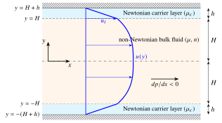

## Exam-style practice {#revision}

<!-- origin: Revision class (ENGI4427/44710 practice questions 2024-25). Practice Question 2 (laminar boundary layer on a symmetrical aerofoil) was dropped: every part after the sketch uses Thwaites' method, which has been removed from the course. -->

This practice question is much more complicated than anything you are likely to meet in the examination. The solution includes all the working so that it is easy to follow; such fine detail would not be expected in the examination, but it is useful to the marker, and the question is a good way to sharpen the basic differentiation and integration skills you will need.

::: {.problem #pR-1 data-sec="ch2:sec-stresses" data-ch="R" data-d="3"}
### Problem R.1 · Non-Newtonian channel flow with a lubricating carrier layer {.unnumbered}
<!-- origin: Revision class Practice Question 1. Fixes: (1) the solution said gravity acts in the z-direction; with horizontal plates and y perpendicular to them, gravity acts in -y and only adds a hydrostatic pressure variation across the channel. (2) "fully developed and uni-directional" replaced by the continuity argument (one follows from the other). (3) The carrier-layer viscosity is written mu_c (the original used mu for both fluids although the carrier fluid has a lower viscosity). (4) Added a note on the sign convention for (du/dy)^n with du/dy < 0. -->
<!-- REVIEW (MB): carrier-layer viscosity renamed mu_c in part (iv) and in the solution; please check. -->

[[★★★ challenge]{.tag .diff} Study first: [§2.2.1 Stresses and constitutive relations](../notes/ch2.qmd#sec-stresses), [the momentum equations](../notes/ch2.qmd#sec-momentum), [boundary conditions](../notes/ch2.qmd#sec-bcs) and [Workshop 1](../workshops/workshop1.qmd)]{.meta}

Without making any assumptions about the nature of the viscosity or density of a fluid, the general continuity and Navier–Stokes equations in Cartesian coordinates are
$$
\frac{\partial\rho}{\partial t} + \del \cdot (\rho\vect{q}) = 0
$$
and
$$
\begin{aligned}
\rho\frac{Du}{Dt} &= \rho F_{x} - \frac{\partial p}{\partial x} + \frac{\partial\tau_{xx}}{\partial x} + \frac{\partial\tau_{xy}}{\partial y} + \frac{\partial\tau_{xz}}{\partial z} \\
\rho\frac{Dv}{Dt} &= \rho F_{y} - \frac{\partial p}{\partial y} + \frac{\partial\tau_{yx}}{\partial x} + \frac{\partial\tau_{yy}}{\partial y} + \frac{\partial\tau_{yz}}{\partial z} \\
\rho\frac{Dw}{Dt} &= \rho F_{z} - \frac{\partial p}{\partial z} + \frac{\partial\tau_{zx}}{\partial x} + \frac{\partial\tau_{zy}}{\partial y} + \frac{\partial\tau_{zz}}{\partial z}
\end{aligned}
$$
where the normal stresses are
$$
\begin{aligned}
\tau_{xx} &= \mu\left(2\frac{\partial u}{\partial x} - \frac{2}{3}\del \cdot \vect{q}\right), \quad
\tau_{yy} = \mu\left(2\frac{\partial v}{\partial y} - \frac{2}{3}\del \cdot \vect{q}\right), \\
\tau_{zz} &= \mu\left(2\frac{\partial w}{\partial z} - \frac{2}{3}\del \cdot \vect{q}\right)
\end{aligned}
$$
and the tangential (shear) stresses are
$$
\begin{aligned}
\tau_{xy} &= \tau_{yx} = \mu\left(\frac{\partial v}{\partial x} + \frac{\partial u}{\partial y}\right)^n, \qquad
\tau_{xz} = \tau_{zx} = \mu\left(\frac{\partial w}{\partial x} + \frac{\partial u}{\partial z}\right)^n, \\
\tau_{yz} &= \tau_{zy} = \mu\left(\frac{\partial v}{\partial z} + \frac{\partial w}{\partial y}\right)^n
\end{aligned}
$$
such that the fluid is Newtonian when $n=1$ and non-Newtonian otherwise.

Consider steady, fully developed, two-dimensional, incompressible, laminar flow between two horizontal flat parallel plates, driven by a constant pressure gradient, the purpose being to transport a non-Newtonian fluid. To increase the flow rate it is proposed to introduce a thin carrier layer of a low-viscosity Newtonian fluid (viscosity $\mu_c$) of thickness $h$, separating the non-Newtonian bulk flow, of thickness $2H$, from each plate, so that the plates are a total distance $2(H+h)$ apart, with $h \ll H$.

(i) Sketch the problem using Cartesian coordinates $(x, y)$, with $x$ along the centre/symmetry line between the plates in the direction of flow and $y$ perpendicular to it, and list any assumptions, additional to those above, needed to reduce the governing equations to a form that can be solved analytically.

(ii) List the boundary conditions at the surfaces of the plates, at the interfaces between the two fluids (where the velocity is $u_{i}$) and at the centre/symmetry plane.

(iii) Show that the velocity profile in the non-Newtonian bulk layer is
$$
u(y) = \frac{n}{n+1}\left(\frac{1}{\mu}\frac{dp}{dx}\right)^{\frac{1}{n}}\left(y^{\frac{n+1}{n}} - H^{\frac{n+1}{n}}\right) + u_{i} .
$$

(iv) Show that the velocity profile in the upper Newtonian carrier layer is
$$
u(y) = \frac{1}{2\mu_c}\frac{dp}{dx}\,[H+h-y]^{2} + \left(\frac{u_{i}}{h} - \frac{1}{2\mu_c}\frac{dp}{dx}\,h\right)[H+h-y] .
$$
Is the velocity profile in the lower carrier layer the same as that in the upper one?

Hint

Follow the [solving strategy](../resources/solving-strategy.qmd): "fully developed" plus continuity gives $v = 0$ and $u = u(y)$, so all normal stresses vanish and only $\tau_{xy} = \mu(du/dy)^n$ survives. The $x$-momentum equation becomes $dp/dx = \frac{d}{dy}\left[\mu (du/dy)^n\right]$. In the bulk, integrate once and use symmetry at $y = 0$; then use $u = u_i$ at $y = H$. In the carrier layer ($n = 1$, viscosity $\mu_c$) the substitution $Y = H + h - y$ makes the boundary conditions ($u = 0$ at $Y=0$, $u = u_i$ at $Y = h$) tidy.

Final answer

\(ii) $y = 0$: $du/dy = 0$, $v = 0$ (symmetry); $y = \pm H$: $u = u_i$ in both fluids and equal shear stresses; $y = \pm(H+h)$: $u = v = 0$ (no slip, no penetration).

\(iii), (iv): as stated.
The lower carrier layer is the mirror image of the upper one: replace $y$ by $-y$, i.e. $[H + h + y]$ in place of $[H + h - y]$.

Full solution

**(i) Sketch and assumptions.**

{width=75% fig-alt="Sketch of two stationary horizontal plates a distance 2(H+h) apart. Thin Newtonian carrier layers of thickness h lie against each plate; the non-Newtonian bulk fluid of thickness 2H fills the middle. Axes x along the centreline and y perpendicular to it; interface velocity u_i at y = plus or minus H."}

Given: stationary plates; $dp/dx$ = constant. Additional assumptions:

- the plates are infinitely long and wide, so the flow is two-dimensional ($w = 0$, $\partial/\partial z = 0$);
- each fluid has constant properties ($\rho$, $\mu$, $n$ in the bulk; $\rho_c$, $\mu_c$ in the carrier layers); the fluids are immiscible and the interfaces are flat, at $y = \pm H$;
- body forces can be ignored in the $x$-momentum equation: the plates are horizontal, so gravity acts in the $-y$ direction and only adds a hydrostatic variation of pressure across the channel ($\partial p/\partial y = -\rho g$), which does not affect the flow; we therefore set $F_x = F_y = 0$ and work with the pressure variation due to the flow;
- the flow is symmetric about the centreline $y = 0$.

**(ii) Boundary conditions.**
1. At $y = 0$: $\partial u/\partial y = 0$, $v = 0$ (symmetry plane).
2. At $y = \pm H$: $u = u_{i}$ in both fluids and $\tau_{xy}\big|_{\text{Newtonian}} = \tau_{xy}\big|_{\text{non-Newtonian}}$ (continuity of velocity and of shear stress across the interface).
3. At $y = \pm(H+h)$: $u = 0$, $v = 0$ (no slip, no penetration).

**(iii) Non-Newtonian bulk flow.** Continuity: since the flow is incompressible ($\rho$ = constant), $\partial\rho/\partial t = 0$ and $\del\cdot(\rho\vect{q}) = \rho\,\del\cdot\vect{q}$, so
$$
\del \cdot \vect{q} = 0 \quad\Longrightarrow\quad \frac{\partial u}{\partial x} + \frac{\partial v}{\partial y} = 0 \qquad (4)
$$
The flow is fully developed, $\partial u/\partial x = 0$, so (4) gives $\partial v/\partial y = 0$; with $v = 0$ at the walls this means $v = 0$ everywhere, i.e. the flow is unidirectional. (Fully developed and unidirectional are therefore not two separate assumptions: one follows from the other through continuity.) With $w = 0$ as well, $u = u(y)$ only.

The $x$- and $y$-momentum equations become
$$
\rho \cancelto{0}{\frac{\partial u}{\partial t}} + \rho \left( u \cancelto{0}{\frac{\partial u}{\partial x}} + \cancelto{0}{v} \frac{\partial u}{\partial y} \right) = \rho \cancelto{0}{F_{x}} - \frac{\partial p}{\partial x} + \frac{\partial \tau_{xx}}{\partial x} + \frac{\partial \tau_{xy}}{\partial y}
$$
$$
\rho \cancelto{0}{\frac{\partial v}{\partial t}} + \rho \left( u \cancelto{0}{\frac{\partial v}{\partial x}} + \cancelto{0}{v \frac{\partial v}{\partial y}} \right) = \rho \cancelto{0}{F_{y}} - \cancelto{0}{\frac{\partial p}{\partial y}} + \frac{\partial \tau_{yx}}{\partial x} + \frac{\partial \tau_{yy}}{\partial y}
$$
(steady flow; $\partial u/\partial x = 0$ from continuity; $v = 0$ everywhere). So we are left with
$$
0 = -\frac{dp}{dx} + \frac{\partial \tau_{xx}}{\partial x} + \frac{\partial \tau_{xy}}{\partial y} \quad (5), \qquad
0 = \frac{\partial \tau_{yx}}{\partial x} + \frac{\partial \tau_{yy}}{\partial y} \quad (6)
$$
The normal stresses vanish:
$$
\tau_{xx} = \mu \left( 2\cancelto{0}{\frac{\partial u}{\partial x}} - \frac{2}{3}\cancelto{0}{\del \cdot \vect{q}} \right) = 0, \qquad
\tau_{yy} = \mu \left( 2\cancelto{0}{\frac{\partial v}{\partial y}} - \frac{2}{3}\cancelto{0}{\del \cdot \vect{q}} \right) = 0
$$
and the shear stress is
$$
\tau_{xy} = \tau_{yx} = \mu \left( \cancelto{0}{\frac{\partial v}{\partial x}} + \frac{\partial u}{\partial y} \right)^n = \mu \left( \frac{du}{dy} \right)^n
$$
Hence (6) becomes $0 = 0$ and (5) becomes the ODE
$$
\frac{dp}{dx} = \frac{d}{dy} \left[ \mu \left( \frac{du}{dy} \right)^n \right] \qquad (8)
$$
to be solved for $u(y)$, remembering that $dp/dx$ is constant. Integrating once:
$$
\mu \left( \frac{du}{dy} \right)^n = \frac{dp}{dx}\,y + C_{1}
$$
and from B.C. 1, $du/dy = 0$ at $y=0$, so $C_{1}=0$. Hence $(du/dy)^n = \frac{1}{\mu}\frac{dp}{dx}\,y$. Raising both sides to the power $1/n$ and writing $A = \left(\frac{1}{\mu}\frac{dp}{dx}\right)^{1/n}$:
$$
\frac{du}{dy} = A\, y^{1/n} \qquad (9)
$$
(For $y > 0$ and $dp/dx < 0$ both sides are negative. Powers of negative quantities are to be read as sign-preserving, $(-a)^{1/n} = -a^{1/n}$; this is what the power-law model means when written properly as $\tau_{xy} = \mu\,|du/dy|^{n-1}\,du/dy$.) Integrating,
$$
u(y) = mA\, y^{1/m} + C_{2}, \qquad m = \frac{n}{n+1}
$$
Using B.C. 2, $u = u_{i}$ at $y=H$: $C_{2} = u_{i} - mA H^{1/m}$, so $u(y) = u_{i} + mA \left( y^{1/m} - H^{1/m} \right)$, i.e.
$$
u(y) = \frac{n}{n+1}\left(\frac{1}{\mu}\frac{dp}{dx}\right)^{\frac{1}{n}} \left( y^{\frac{n+1}{n}} - H^{\frac{n+1}{n}} \right) + u_{i} \qquad (10)
$$
*Check:* if the bulk fluid is Newtonian ($n=1$), (10) becomes $u(y) = \frac{1}{2\mu}\frac{dp}{dx}(y^2 - H^2) + u_{i}$: at $y = \pm H$, $u = u_i$ as it should be, and at $y = 0$, $du/dy = \frac{1}{\mu}\frac{dp}{dx}\,y = 0$, as it should be.

**(iv) Upper Newtonian carrier layer.** Start from (8) with $n=1$ and the constant viscosity $\mu_c$ of the carrier fluid. The algebra is easier with the coordinate $Y = (H+h) - y$ measured from the upper plate:
$$
y = H+h \;\Rightarrow\; Y = 0,\; u=0 \quad (11), \qquad
y = H \;\Rightarrow\; Y = h,\; u=u_{i} \quad (12)
$$
Since $d^2/dy^2 = d^2/dY^2$, we need to solve
$$
\frac{dp}{dx} = \mu_c\frac{d^{2}u}{dY^{2}}
\quad\Rightarrow\quad
u(Y) = \frac{1}{2\mu_c}\frac{dp}{dx}\,Y^{2} + C_{3}Y + C_{4}
$$
B.C. (11) gives $C_{4} = 0$, and B.C. (12) gives $u_{i} = \frac{1}{2\mu_c}\frac{dp}{dx}h^{2} + C_{3}h$, i.e. $C_{3} = \frac{u_{i}}{h} - \frac{1}{2\mu_c}\frac{dp}{dx}\,h$. So
$$
u(y) = \frac{1}{2\mu_c}\frac{dp}{dx}\,(H+h-y)^{2} + \left(\frac{u_{i}}{h} - \frac{1}{2\mu_c}\frac{dp}{dx}\,h\right)(H+h-y) \qquad (13)
$$
*Check:* at $y=H+h$, $u = 0$; at $y=H$, $u = \frac{1}{2\mu_c}\frac{dp}{dx}h^{2} + \left(\frac{u_{i}}{h} - \frac{1}{2\mu_c}\frac{dp}{dx}h\right)h = u_{i}$.

**Lower carrier layer.** For the lower layer we write $Y = H+h+y$ and use $u = 0$ at $y = -(H+h)$ and $u = u_{i}$ at $y = -H$, giving
$$
u(y) = \frac{1}{2\mu_c}\frac{dp}{dx}\,(H+h+y)^{2} + \left(\frac{u_{i}}{h} - \frac{1}{2\mu_c}\frac{dp}{dx}\,h\right)(H+h+y) \qquad (14)
$$
which is the mirror image of (13) about the centreline, as expected from the symmetry of the problem. (13) and (14) can be combined into one expression for both layers:
$$
u(y) = \frac{1}{2\mu_c}\frac{dp}{dx}\,(H+h+\alpha y)^{2} + \left(\frac{u_{i}}{h} - \frac{1}{2\mu_c}\frac{dp}{dx}\,h\right)(H+h+\alpha y),
$$
$$
\alpha = \begin{cases} -1, & y \ge 0 \\ +1, & y \le 0 \end{cases}
$$

*Going further (not required).* The interface velocity follows from the stress condition in (2). Integrating (8) once in the carrier layer gives $\tau_{xy} = \frac{dp}{dx}\,y + C$, and matching the bulk stress $\tau_{xy} = \frac{dp}{dx}\,y$ at $y = H$ gives $C = 0$: the shear stress is $\frac{dp}{dx}\,y$ right across the channel. Then $\mu_c\, du/dy = \frac{dp}{dx}\,y$ with $u = 0$ at $y = H+h$ gives
$$
u_i = -\frac{1}{2\mu_c}\frac{dp}{dx}\left[(H+h)^2 - H^2\right] = -\frac{1}{2\mu_c}\frac{dp}{dx}\,h\,(2H + h),
$$
which is large when $\mu_c$ is small: the low-viscosity carrier layer lets the whole bulk slide along, and this is why it increases the flow rate.

<label class="done"><input type="checkbox"> done</label>
:::
