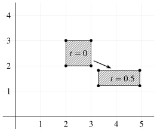



::: {.callout-note icon=false}
## How to use this page

- These problems serve two purposes: (i) to aid your understanding of the material covered in the course notes, and (ii) to show how the governing equations are used to solve a particular class of fluid flows amenable to analytic solution.
- Each problem says which part of the notes to **study first**. Just reading the notes is not sufficient in itself; using the knowledge you have gained to solve problems is a crucial part of your studies.
- Help is layered: open the **hint** if you are stuck, check your **final answer**, and only then read the **full solution**. You will learn significantly more by struggling with a problem than by reading the answer.
- Tick **done** when you have solved a problem; your progress is saved in this browser only.
:::

Chapter:
<button data-f="ch" data-v="all" class="on">All</button>
<button data-f="ch" data-v="1">1 · Preliminaries</button>
Difficulty:
<button data-f="d" data-v="all" class="on">All</button>
<button data-f="d" data-v="1">★</button>
<button data-f="d" data-v="2">★★</button>
<button data-f="d" data-v="3">★★★</button>

Problems for Chapters 2--4 will be added here as each chapter is released.

## Chapter 1 · Preliminaries {#ch1}

### Acceleration and the material derivative {#topic-material-derivative .unnumbered}

::: {.problem #p1-1 data-ch="1" data-d="1"}
### Problem 1.1 · Acceleration in an unsteady 3D flow {.unnumbered}

[[★ warm-up]{.tag .diff} Study first: [§1.2 Acceleration and total time derivative](../notes/ch1.qmd#sec-material-derivative)]{.meta}

An idealised velocity vector field is given by $\vect{q} = 4tx\,\uvec{i} - 2t^{2}y\,\uvec{j} + 4xz\,\uvec{k}$. Is this flow steady or unsteady? Is it two or three dimensional? At the point $(x,y,z) = (-1,1,0)$ determine (a) the acceleration vector and (b) any unit vector normal to the acceleration vector.

Hint

Read off $u$, $v$, $w$. Does $t$ appear explicitly? How many velocity components are non-zero? Then apply $Du/Dt = \partial u/\partial t + u\,\partial u/\partial x + v\,\partial u/\partial y + w\,\partial u/\partial z$ (and the same for $v$ and $w$), and only substitute the point at the end. For (b), remember that two vectors are perpendicular when their dot product is zero: look at which component of $\vect{a}$ vanishes at the point.

Final answer

Unsteady and three-dimensional. (a) $\vect{a} = -4(1+4t^2)\,\uvec{i} + 4t(t^3-1)\,\uvec{j}$ at $(-1,1,0)$. (b) e.g. $\uvec{k}$.

Full solution

- The flow is unsteady ($\partial/\partial t \neq 0$) because $t$ appears explicitly in the components of $\vect{q}$.
- The flow is 3D because all three velocity components are non-zero.

The acceleration is $\vect{a} = D\vect{q}/Dt = \left( \partial/\partial t + (\vect{q} \cdot \del) \right) \vect{q}$ with $u = 4tx$, $v = -2t^2 y$, $w = 4zx$.

(a)
$$
\begin{aligned}
a_x &= \frac{\partial u}{\partial t} + u\frac{\partial u}{\partial x} + v\frac{\partial u}{\partial y} + w\frac{\partial u}{\partial z} = 4x + (4tx)(4t) + 0 + 0 = 4x + 16t^2 x \\
a_y &= \frac{\partial v}{\partial t} + u\frac{\partial v}{\partial x} + v\frac{\partial v}{\partial y} + w\frac{\partial v}{\partial z} = -4ty + 0 + (-2t^2y)(-2t^2) + 0 = -4ty + 4t^4 y \\
a_z &= \frac{\partial w}{\partial t} + u\frac{\partial w}{\partial x} + v\frac{\partial w}{\partial y} + w\frac{\partial w}{\partial z} = 0 + (4tx)(4z) + 0 + (4zx)(4x) = 16txz + 16x^2 z
\end{aligned}
$$
$$
\Rightarrow \vect{a} = 4x(1+4t^2)\,\uvec{i} + 4ty(t^3 - 1)\,\uvec{j} + 16xz(t+x)\,\uvec{k}
$$
At $(x,y,z) = (-1, 1, 0)$:
$$
\vect{a} = -4(1+4t^2)\,\uvec{i} + 4t(t^3 - 1)\,\uvec{j} + 0\,\uvec{k}
$$

(b) At $(-1, 1, 0)$ there are many unit vectors normal to $\vect{a}$; the obvious one is simply $\uvec{k}$, since $\vect{a}\cdot\uvec{k} = 0$.

<label class="done"><input type="checkbox"> done</label>
:::

::: {.problem #p1-2 data-ch="1" data-d="2"}
### Problem 1.2 · Convective acceleration in a nozzle {.unnumbered}

[[★★ core]{.tag .diff} Study first: [§1.2.1 Physical meaning of convective acceleration](../notes/ch1.qmd#sec-convective-meaning)]{.meta}

Flow through the converging nozzle shown in the figure can be approximated by a 1D velocity distribution: $u = V_{0}(1 + 2x/L)$, $v = 0$, $w = 0$.
(a) Find a general expression for the fluid acceleration in the nozzle; (b) for the specific case $V_{0} = 3\ \text{m s}^{-1}$ and $L = 0.1$ m determine the acceleration at the entrance and at the exit. If instead the velocity has the form $\vect{q} = V_{0}(1 + x/L)\,\uvec{i}$ determine (c) the fluid acceleration at $x = L$ and (d) the time required for a fluid element to travel from $x = 0$ to $x = L$.

{width=55% fig-alt="Converging nozzle with inlet velocity V0 at x = 0 and exit velocity 3V0 at x = L."}

Hint

The flow is steady and one-dimensional, so only one term of the material derivative survives: $a_x = u\,\partial u/\partial x$. For (d), the position of a fluid element obeys $dx/dt = u(x)$: separate the variables and integrate from $x=0$ to $x=L$. You can check (a)--(b) with the interactive nozzle in the notes.

Final answer

(a) $a_x = \dfrac{2V_0^2}{L}\left(1 + \dfrac{2x}{L}\right)$
(b) check yours: entrance $a_x$ = <input type="text" inputmode="decimal"> m/s²  exit $a_x$ = <input type="text" inputmode="decimal"> m/s² 
(c) $a_x(L) = 2V_0^2/L$
(d) $t = \dfrac{L}{V_0}\ln 2$

Full solution

The flow is steady, $\partial/\partial t = 0$, and 1D so $\partial/\partial y = \partial/\partial z = 0$ and $v = w = 0$. Only the convective term $u\,\partial u/\partial x$ survives.

(a)
$$
a_x = u\frac{\partial u}{\partial x} = V_0\left(1 + \frac{2x}{L}\right) \times \frac{2V_0}{L} = \frac{2V_0^2}{L}\left(1 + \frac{2x}{L}\right)
$$

(b) For $V_0 = 3\ \text{m s}^{-1}$ and $L = 0.1$ m:
$$
a_x = \frac{2 \times 3^2}{0.1}\left(1 + \frac{2x}{0.1}\right) = 180(1 + 20x)
\;\Rightarrow\; a_x|_{x=0} = 180\ \text{m s}^{-2}, \quad a_x|_{x=0.1} = 540\ \text{m s}^{-2}
$$

If instead $\vect{q} = V_0 (1 + x/L)\,\uvec{i}$ then, as above, only the convective term remains:
$$
a_x = u\frac{\partial u}{\partial x} = V_0 \left(1 + \frac{x}{L}\right) \frac{V_0}{L} = \frac{V_0^2}{L} \left(1 + \frac{x}{L}\right)
$$

(c) At $x = L$: $a_x = 2V_0^2/L$.

(d) The trajectory of a fluid element follows from $u = dx/dt$:
$$
\frac{dx}{dt} = V_0\left(1 + \frac{x}{L}\right)
\;\Rightarrow\;
\int_{0}^{L} \frac{dx}{1 + x/L} = \int_{0}^{t} V_0\, dt
\;\Rightarrow\;
L \ln 2 = V_0 t
\;\Rightarrow\;
t_{0 \to L} = \frac{L}{V_0} \ln 2
$$

For comparison, in the original nozzle, $u = V_0(1 + 2x/L)$, the same steps give $\tfrac{L}{2}\ln(1 + 2x/L) = V_0 t$ and so $t_{0\to L} = \tfrac{L}{2V_0}\ln 3$: shorter, because the fluid accelerates more.

<label class="done"><input type="checkbox"> done</label>
:::

::: {.problem #p1-3 data-ch="1" data-d="1"}
### Problem 1.3 · Acceleration and $Dp/Dt$ in a 2D flow {.unnumbered}

[[★ warm-up]{.tag .diff} Study first: [§1.2 Acceleration and total time derivative](../notes/ch1.qmd#sec-material-derivative)]{.meta}

A two-dimensional velocity field is given by $\vect{q} = (x^{2} - y^{2} + x)\,\uvec{i} - (2xy + y)\,\uvec{j}$. At $(x,y) = (1,2)$, determine (a) the accelerations $a_{x}$ and $a_{y}$, (b) the velocity. If the pressure field $p = 3x^{3} - 4y^{2}$ is associated with the above velocity field, determine $Dp/Dt$ at $(x,y) = (1,2)$.

Hint

Steady and 2D, so $\partial/\partial t = 0$ and the $w$ terms vanish. The material derivative of the scalar $p$ uses exactly the same operator: $Dp/Dt = \partial p/\partial t + u\,\partial p/\partial x + v\,\partial p/\partial y$.

Final answer

$a_x$ = <input type="text" inputmode="decimal"> 
$a_y$ = <input type="text" inputmode="decimal"> 
$Dp/Dt$ = <input type="text" inputmode="decimal"> 

$\vect{a} = 18\,\uvec{i} + 26\,\uvec{j}$, $\;\vect{q} = -2\,\uvec{i} - 6\,\uvec{j}$, $\;Dp/Dt = 78$ (units consistent with those of $\vect{q}$ and $p$).

Full solution

$u = x^2 - y^2 + x$, $v = -(2xy + y)$, $w = 0$; steady ($\partial/\partial t = 0$) and 2D ($\partial/\partial z = 0$).

(a)
$$
\begin{aligned}
a_x &= u\frac{\partial u}{\partial x} + v\frac{\partial u}{\partial y} = (x^2 - y^2 + x)(2x + 1) + (-2xy - y)(-2y) = (2x+1)\left[(x^2 - y^2 + x) + 2y^2\right] \\
a_y &= u\frac{\partial v}{\partial x} + v\frac{\partial v}{\partial y} = (x^2 - y^2 + x)(-2y) + (-2xy - y)(-2x - 1) = -2y(x^2 - y^2 + x) + (2x+1)^2 y
\end{aligned}
$$
At $(1,2)$: $a_x = 3 \times [(1-4+1) + 8] = 18$ and $a_y = -4(1-4+1) + 9 \times 2 = 8 + 18 = 26$, giving $\vect{a} = 18\,\uvec{i} + 26\,\uvec{j}$.

(b) At $(1,2)$: $\vect{q} = (1 - 4 + 1)\,\uvec{i} - (4+2)\,\uvec{j} = -2\,\uvec{i} - 6\,\uvec{j}$.

With $p = 3x^3 - 4y^2$, which does not depend on time:
$$
\begin{aligned}
\frac{Dp}{Dt} &= \underbrace{\frac{\partial p}{\partial t}}_{=0} + u \frac{\partial p}{\partial x} + v \frac{\partial p}{\partial y} = (x^2 - y^2 + x)(9x^2) - (2xy + y)(-8y) \\
&= 9x^2(x^2 - y^2 + x) + 8y^2(2x + 1)
\end{aligned}
$$
At $(1,2)$: $Dp/Dt = 9(1 - 4 + 1) + 32(2 + 1) = -18 + 96 = 78$.

<label class="done"><input type="checkbox"> done</label>
:::

### Vorticity {#topic-vorticity .unnumbered}

::: {.problem #p1-4 data-ch="1" data-d="2"}
### Problem 1.4 · Vorticity in cylindrical polar coordinates {.unnumbered}

[[★★ core]{.tag .diff} Study first: [§1.3 Vorticity](../notes/ch1.qmd#sec-vorticity) and the [curl in curvilinear coordinates](../notes/ch1.qmd#sec-curvilinear)]{.meta}

For the following velocity expressions, calculate the components of vorticity $\xi_{r}$, $\xi_{\theta}$ and $\xi_{z}$:

(a) $u_{r} = \dfrac{1}{r}$; $u_{\theta} = r^{3}$; $u_{z} = 2r \cos \theta$
(b) $u_{r} = \left(1 - \dfrac{a^{3}}{r^{3}}\right) \cos \theta$; $u_{\theta} = -\dfrac{1}{2}\left(2 + \dfrac{a^{3}}{r^{3}}\right) \sin \theta$
(c) $u_{r} = e^{-\theta}$; $u_{\theta} = e^{-i\theta}$
(d) $u_{r} = r \sin \theta$; $u_{\theta} = 2r \cos \theta$

<!-- REVIEW (MB): part (c) u_theta = e^{-i theta} looks like a typo for e^{-theta}? Solution kept as in the original sheet. -->

Hint

Use the curl in curvilinear coordinates from the appendix with $(h_1,h_2,h_3) = (1, r, 1)$ and $(x_1,x_2,x_3) = (r,\theta,z)$. Writing it out gives
$$
\xi_r = \frac{1}{r}\frac{\partial u_z}{\partial \theta} - \frac{\partial u_\theta}{\partial z}, \quad
\xi_\theta = \frac{\partial u_r}{\partial z} - \frac{\partial u_z}{\partial r}, \quad
\xi_z = \frac{1}{r}\left(\frac{\partial (r u_\theta)}{\partial r} - \frac{\partial u_r}{\partial \theta}\right).
$$
Where a component is not given, take it as zero.

Final answer

(a) $\vect{\xi} = -2\sin\theta\,\uvec{e}_r - 2\cos\theta\,\uvec{e}_\theta + 4r^2\,\uvec{e}_z$
(b) $\vect{\xi} = 0$: irrotational
(c) $\vect{\xi} = \dfrac{1}{r}\left(e^{-i\theta} + e^{-\theta}\right)\uvec{e}_z$
(d) $\vect{\xi} = 3\cos\theta\,\uvec{e}_z$

Full solution

In cylindrical polar coordinates $\vect{\xi} = (\xi_r, \xi_{\theta}, \xi_z)$ is given by:
$$
\vect{\xi} = \del \times \vect{q} = \frac{1}{r}\left(\frac{\partial u_z}{\partial \theta} - \frac{\partial(r u_{\theta})}{\partial z}\right)\uvec{e}_r + \left(\frac{\partial u_r}{\partial z} - \frac{\partial u_z}{\partial r}\right)\uvec{e}_\theta + \frac{1}{r}\left(\frac{\partial(r u_{\theta})}{\partial r} - \frac{\partial u_r}{\partial \theta}\right)\uvec{e}_z
$$

(a)
$$
\vect{\xi} = \frac{1}{r}\left(\frac{\partial(2r \cos \theta)}{\partial \theta} - \cancel{\frac{\partial(r^4)}{\partial z}}\right)\uvec{e}_r + \left(\cancel{\frac{\partial(r^{-1})}{\partial z}} - \frac{\partial(2r \cos \theta)}{\partial r}\right)\uvec{e}_\theta + \frac{1}{r}\left(\frac{\partial(r^4)}{\partial r} - \cancel{\frac{\partial(r^{-1})}{\partial \theta}}\right)\uvec{e}_z
$$
$$
= -2\sin\theta \, \uvec{e}_r - 2\cos\theta \, \uvec{e}_\theta + 4r^2 \, \uvec{e}_z
$$

(b) Only $\xi_z$ can be non-zero:
$$
\begin{aligned}
\xi_z &= \frac{1}{r} \left( \frac{\partial}{\partial r}\left[-\frac{r}{2}\left(2+\frac{a^3}{r^3}\right)\sin\theta\right] - \frac{\partial}{\partial \theta}\left[\left(1-\frac{a^3}{r^3}\right)\cos\theta\right] \right) \\
&= \frac{1}{r} \left( \left[-1 + \frac{a^3}{r^3}\right]\sin\theta + \left[1 - \frac{a^3}{r^3}\right]\sin\theta \right) = 0
\end{aligned}
$$
so the flow is **irrotational**.

(c)
$$
\xi_z = \frac{1}{r} \left( \frac{\partial}{\partial r}(r e^{-i\theta}) - \frac{\partial}{\partial \theta}(e^{-\theta}) \right) = \frac{1}{r} \left( e^{-i\theta} + e^{-\theta} \right)
$$

(d)
$$
\xi_z = \frac{1}{r} \left( \frac{\partial}{\partial r}(2r^2\cos\theta) - \frac{\partial}{\partial \theta}(r\sin\theta) \right) = \frac{1}{r} \left( 4r\cos\theta - r\cos\theta \right) = 3\cos\theta
$$

<label class="done"><input type="checkbox"> done</label>
:::

::: {.problem #p1-5 data-ch="1" data-d="2"}
### Problem 1.5 · Following a fluid element in stagnation-point flow {.unnumbered}

[[★★ core]{.tag .diff} Study first: [§1.3 Vorticity](../notes/ch1.qmd#sec-vorticity) and the [divergence](../notes/ch1.qmd#sec-div-curl) in the appendix]{.meta}

Consider the simple flow defined by $\vect{q} = x\,\uvec{i} - y\,\uvec{j}$. At time $t = 0$, consider the rectangular fluid element defined by the lines $x = 2$, $x = 3$ and $y = 2$, $y = 3$. Determine and draw to scale the location of this fluid element at time $t = 0.5$ s. Relate this new fluid element shape to whether the flow is irrotational or incompressible and comment on that.

Hint

Each point of the element moves with the local velocity: $dx/dt = x$ and $dy/dt = -y$. Integrate these to find where each edge has moved to. Compare the area before and after (what does $\del\cdot\vect{q}$ tell you?), and check whether the edges have turned (what is $\xi_z$?). You can watch this flow in the vorticity explorer in the notes: choose *stagnation-point flow*.

Final answer

At $t = 0.5$ s the element occupies $3.30 \le x \le 4.95$, $1.21 \le y \le 1.82$. Its area is still 1 (incompressible, $\del\cdot\vect{q} = 0$) and its edges remain parallel to the axes (irrotational, $\xi_z = 0$).

Full solution

$$
u = x, \quad v = -y \;\Rightarrow\; \frac{\partial u}{\partial x} + \frac{\partial v}{\partial y} = 1 - 1 = 0 = \del \cdot \vect{q}
$$
so the flow is incompressible and the fluid element should retain its volume (here, area) with time. Also $\xi_z = \partial v/\partial x - \partial u/\partial y = 0$, so the flow is irrotational.

The trajectories, found by integration in the $x$ and $y$ directions, are:
$$
\frac{dx}{dt} = x \Rightarrow x = x_0 e^t, \qquad \frac{dy}{dt} = -y \Rightarrow y = y_0 e^{-t}
$$
where $x_0$ and $y_0$ are the positions at $t=0$. At $t = 0.5$ s:

- $x=2$ moves to $x = 2 e^{0.5} = 3.30$, and $x=3$ moves to $x = 3 e^{0.5} = 4.95$
- $y=2$ moves to $y = 2 e^{-0.5} = 1.21$, and $y=3$ moves to $y = 3 e^{-0.5} = 1.82$

Original area: $1 \times 1 = 1$. New area: $(3-2)e^{0.5} \times (3-2)e^{-0.5} = 1.65 \times 0.61 = 1$, exactly as before.

{width=60%}

The area is unchanged (incompressible), and the element has been stretched in $x$ and squashed in $y$ without its edges turning: there is no rotation of the fluid element, so the flow is also irrotational.

<label class="done"><input type="checkbox"> done</label>
:::

