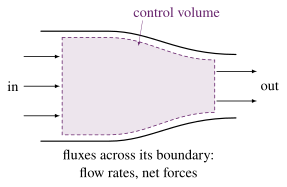
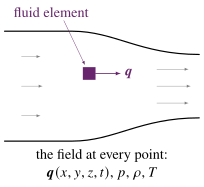
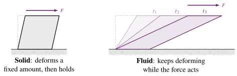
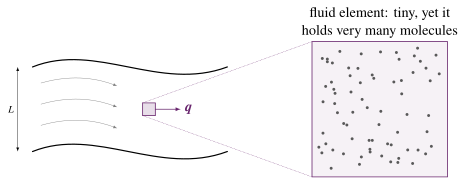
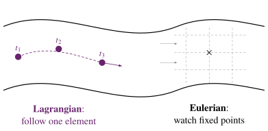

## Two approaches to fluid mechanics



[[📖 Notes §1.1](../notes/ch1.qmd#sec-intro)]{.notes-link}

Two complementary viewpoints:

:::: {.columns}
::: {.column width="50%"}
**Control-volume approach** (L1–L2): conservation laws over a finite region; devices such as pumps, turbines and ducts.

{height="300px"}
:::
::: {.column .fragment width="50%"}
**Differential approach** (this course): the pointwise behaviour of *fluid elements*.

{height="300px"}
:::
::::

::: {.notes}
OPENING: This first lecture sets the conceptual foundations needed for the differential analysis of fluid motion. They have seen fluids before, but always at the control-volume level. Here we shift to analysing fields: velocity, pressure, density defined at every point. This is essential for later derivations of continuity, Navier–Stokes, and energy equations. Make clear that this pointwise viewpoint is what enables CFD and many modern engineering analyses.

Highlight how the control-volume approach is good for global quantities (flow rate, forces, power), whereas the differential approach enables modelling of velocity gradients, shear stresses, vorticity, and instabilities. The shift to the Eulerian field description is a major step forward.
:::

## Definition of a fluid

::: {.callout-tip icon=false}
## A fluid is:
*a substance that deforms continuously when subjected to a shear force.*
:::

Implications:

- Fluids cannot sustain a shear force at rest.
- Even tiny shear forces cause ongoing deformation.
- A shear force acts *tangentially* (parallel) to the surface.

::: {.fragment}
{height="230px"}
:::

::: {.notes}
Use the comparison with solids: solids can support a shear force without flowing; fluids cannot. This behaviour defines fluids functionally rather than by molecular structure. It's a key concept for understanding viscosity and shear-driven flows later.

Shear force acts parallel, not perpendicular, to a surface.
:::

## Inertial vs viscous effects: Reynolds number

Two competing physical influences:

- **Inertial forces**: due to fluid momentum.
- **Viscous forces**: due to momentum diffusion.

$$
Re = \frac{\text{inertial forces}}{\text{viscous forces}}
   = \frac{\text{convective transport}}{\text{diffusive transport}}
   \;\sim\; \frac{\text{destabilising}}{\text{stabilising}}
$$

::: {.fragment}
- $Re \ll 1$: viscous-dominated, smooth creeping motion.
- $Re \gg 1$: inertia-dominated, possible turbulence.
:::

::: {.notes}
Discuss classic examples: microfluidics (Re tiny), river flow (Re large), aerodynamics (Re very large). Students should appreciate how Re governs qualitative flow behaviour and determines modelling strategy.

Also discuss convective vs diffusive process and how it relates to the Re number definition.
:::

## Unknown fields in fluid mechanics

:::: {.columns}
::: {.column width="47%"}
**Six unknown fields** (general flow):

- velocity $\vect{q} = (u, v, w) = u\,\uvec{i} + v\,\uvec{j} + w\,\uvec{k}$ **(3)**
- pressure $p$ **(1)**
- density $\rho$ **(1)**
- temperature $T$ **(1)**
:::
::: {.column .fragment width="53%"}
**Six equations** connect them:

- continuity (mass) **(1)**
- momentum, i.e. force = mass × acceleration **(3)**
- energy **(1)**
- equation of state, e.g. ideal gas $p = \rho R T$ **(1)**
:::
::::

[$\uvec{i}, \uvec{j}, \uvec{k}$: unit vectors in the $x$, $y$, $z$ directions.]{.small}

::: {.notes}
This produces a tightly coupled system of PDEs. Analytical solutions exist only for special cases; most engineering flows require numerical methods. Important to emphasise that the equations stem from universal physical principles, not empirical correlations.

Momentum equation: body forces like gravity, shear stress and pressure gradient forces ...
:::

## Continuum hypothesis

Assumptions:

- Fluid behaves as a **continuous medium**.
- Properties represent averages over volumes that are still large compared with molecular scales.
- Quantities like $u(x,y,z,t)$ are smooth functions.

::: {.fragment}
{height="230px"}

problem scale $L$ $\;\gg\;$ fluid element $\;\gg\;$ molecular scale
:::

::: {.notes}
Writing equations in differential form is the key for solving these equations numerically. Note that within each element we assume changes in fluid properties are negligible.

Clarify that although fluids are molecular, for most engineering scales the continuum approximation is extraordinarily accurate. Mention regimes where it breaks down: very high vacuums, micro/nano devices, rarefied gas dynamics.
:::

## Eulerian vs Lagrangian descriptions

Two representations:

- **Lagrangian**: follow a tagged fluid element.
- **Eulerian**: observe flow properties at fixed spatial points.

We prefer the **Eulerian** viewpoint.

::: {.fragment}
{height="330px"}
:::

::: {.notes}
Use a simple analogy: standing on a bridge watching water pass (Eulerian) vs attaching a tracker to a leaf and following it downstream (Lagrangian). The material derivative is the link between these descriptions.
:::

## The velocity field

Velocity is a vector field:

$$
\vect{q}(x,y,z,t) = u\,\uvec{i} + v\,\uvec{j} + w\,\uvec{k}
$$

**Goal:** determine the acceleration experienced by a moving fluid element, because Newton's 2nd law needs

$$
\boxed{\text{Force} = (\text{mass}) \times (\text{acceleration})}
$$

::: {.notes}
Emphasise why we need to know acceleration and its importance in the momentum equation.
:::

## Material derivative: chain rule

[[📖 Notes §1.2](../notes/ch1.qmd#sec-material-derivative)]{.notes-link}

For a fluid element moving along a path, $u = u\big(x(t),y(t),z(t),t\big)$:

$$
\frac{du}{dt} = \frac{\partial u}{\partial t} + \frac{\partial u}{\partial x}\underbrace{\frac{dx}{dt}}_{=\,u} + \frac{\partial u}{\partial y}\underbrace{\frac{dy}{dt}}_{=\,v} + \frac{\partial u}{\partial z}\underbrace{\frac{dz}{dt}}_{=\,w}
$$

::: {.fragment}
The element's position changes at the local velocity, so

$$
\underbrace{\frac{du}{dt}}_{\substack{\text{following the element}\\ \text{(Lagrangian)}}} = \underbrace{\frac{\partial u}{\partial t} + u\frac{\partial u}{\partial x} + v\frac{\partial u}{\partial y} + w\frac{\partial u}{\partial z}}_{\text{evaluated from the Eulerian field } u(x,y,z,t)}
$$

Similarly for $v$ and $w$.
:::

::: {.notes}
Explain step-by-step: $u(x(t),y(t),z(t),t)$ is a composite function, so its derivative must account for how the fluid element moves through the field. Students should see why spatial gradients contribute to acceleration.
:::

## Compact notation: the operator $\vect{q}\cdot\del$

The gradient operator and its dot product with $\vect{q}$:

$$
\del = \left(\frac{\partial}{\partial x}, \frac{\partial}{\partial y}, \frac{\partial}{\partial z}\right) = \uvec{i}\,\frac{\partial}{\partial x} + \uvec{j}\,\frac{\partial}{\partial y} + \uvec{k}\,\frac{\partial}{\partial z}
\qquad
\vect{q}\cdot\del = u\frac{\partial}{\partial x} + v\frac{\partial}{\partial y} + w\frac{\partial}{\partial z}
$$

::: {.fragment}
So each component reads

$$
\frac{du}{dt} = \frac{\partial u}{\partial t} + (\vect{q}\cdot\del)\,u, \qquad
\frac{dv}{dt} = \frac{\partial v}{\partial t} + (\vect{q}\cdot\del)\,v, \qquad
\frac{dw}{dt} = \frac{\partial w}{\partial t} + (\vect{q}\cdot\del)\,w
$$
:::

::: {.fragment}
**Careful:** $\;\vect{q}\cdot\del \neq \del\cdot\vect{q}$. For two vectors $\vect{a}\cdot\vect{b} = \vect{b}\cdot\vect{a}$, but $\del$ is an operator: $\vect{q}\cdot\del$ is an operator waiting to act on something, while $\del\cdot\vect{q} = \partial u/\partial x + \partial v/\partial y + \partial w/\partial z$ is a number at each point (the divergence, Chapter 2).
:::

::: {.notes}
Write ∇ as a vector of derivatives first, then form the dot product with q. The order matters: q·∇ is a scalar differential operator, ∇·q is the divergence that will appear in the continuity equation next week.
:::

## Vector form of the material derivative

$$
\frac{D\vect{q}}{Dt} = \frac{\partial \vect{q}}{\partial t} + (\vect{q}\cdot\del)\vect{q}
$$

$D/Dt$ (also written $d/dt$) is the **total**, or **material**, derivative: the rate of change *following the fluid element*.

Two contributions:

- **Local acceleration**: $\dfrac{\partial\vect{q}}{\partial t}$ (zero in steady flow)
- **Convective acceleration**: $(\vect{q}\cdot\del)\vect{q}$ (nonlinear!)

::: {.notes}
Stress that the convective term is nonlinear since velocity multiplies velocity gradients. This is one of the reasons the Navier–Stokes equations are difficult to solve. Even steady flows may have significant acceleration due to convection.
:::

## Quick question {.poll}

Water flows **steadily** through a converging nozzle. A fluid element moves from the wide inlet to the narrow exit. Its acceleration is...

1. zero, because the flow is steady
2. non-zero, because of the **local** term $\partial\vect{q}/\partial t$
3. [non-zero, because of the **convective** term $(\vect{q}\cdot\del)\vect{q}$]{.fragment .highlight-current-green}
4. impossible to say without the pressure field

::: {.fragment}
**C.** Steady means $\partial\vect{q}/\partial t = 0$ at every fixed point, but the element moves into a region of higher velocity.
:::

::: {.notes}
Peer-instruction moment: ask them to vote (hands, or the in-class polling tool), then discuss with a neighbour for one minute and vote again before revealing. Common misconception: "steady" means "no acceleration".
:::

## Example: material derivative

Find the acceleration of a fluid element in the velocity field $\;\vect{q} = 3t\,\uvec{i} + xz\,\uvec{j} + t y^2\,\uvec{k}$

::: {.fragment}
$u = 3t,\; v = xz,\; w = t y^2 \qquad \dfrac{\partial \vect{q}}{\partial t} = 3\uvec{i} + y^2\uvec{k}$
:::

::: {.fragment}
$\vect{q}\cdot\del = 3t\,\dfrac{\partial}{\partial x} + xz\,\dfrac{\partial}{\partial y} + ty^2\,\dfrac{\partial}{\partial z}$
:::

::: {.fragment}
$\dfrac{\partial \vect{q}}{\partial x} = z\,\uvec{j}, \quad \dfrac{\partial \vect{q}}{\partial y} = 2ty\,\uvec{k}, \quad \dfrac{\partial \vect{q}}{\partial z} = x\,\uvec{j}$
:::

::: {.fragment}
$(\vect{q}\cdot\del)\vect{q} = 3t \cdot z\,\uvec{j} + xz \cdot 2ty\,\uvec{k} + ty^2 \cdot x\,\uvec{j}$
:::

::: {.fragment .answer-box}
$$
\frac{D\vect{q}}{Dt} = 3\,\uvec{i} + (3tz + txy^2)\,\uvec{j} + (2xyzt + y^2)\,\uvec{k}
$$
:::

::: {.notes}
Encourage students to try deriving this live with you before revealing each step (press → to reveal the next line; press C to draw on the slide). It reinforces the chain-rule interpretation of the material derivative.

1. Identify components: u = 3t, v = xz, w = ty².
2. Time derivatives: ∂u/∂t = 3, ∂v/∂t = 0, ∂w/∂t = y².
3. Spatial derivatives as shown.
4. Evaluate (q·∇)q term by term.
5. Add local + convective contributions.
:::

## Physical meaning of convective acceleration

[[📖 Notes §1.2.1](../notes/ch1.qmd#sec-convective-meaning)]{.notes-link}

{width=85%}

::: {.fragment}
$A_B < A_A$ and $A_A u_A = A_B u_B \;\Rightarrow\; u_B > u_A$: elements accelerate even though the flow is steady.
:::

::: {.fragment}
Steady: $\partial/\partial t = 0$, but the convective term survives: $(\vect{q}\cdot\del)\vect{q} \to u\,\dfrac{\partial u}{\partial x} \neq 0$.
:::

::: {.notes}
Use this figure to reinforce the idea of convective acceleration. Point out that:

- The cross-sectional area at station B is smaller than at A.
- For incompressible steady flow, conservation of mass requires A_A u_A = A_B u_B.
- Therefore A_B < A_A ⇒ u_B > u_A, so a fluid element moving from A to B experiences an increase in speed.

Emphasise: the flow can be steady (no explicit time dependence), yet fluid elements still accelerate because they move into regions of different local velocity — this is the essence of convective acceleration.
:::

## See it: following an element through a nozzle

::: {.notes}
Live demo. Point at the green probe (Eulerian observer: velocity constant in steady flow) versus the red element (Lagrangian: speeds up). Then tick "unsteady inflow" to add a local acceleration that is the same everywhere in phase; the orange bar now oscillates on top of the blue convective bar.

With V0 = 3 m/s, L = 0.1 m this is exactly Problem 1.2 — students can use it to check part (b) later.
:::

## Streamtube interpretation

{height="360px"}

No flow crosses the wall of a streamtube, so the same argument applies: as the tube narrows from A to B the element speeds up.

::: {.fragment}
**Steady** ($\partial/\partial t = 0$) does **not** mean $D/Dt = 0$.
:::

::: {.notes}
Explain that a streamtube is a bundle of streamlines such that there is no flow across its mantle. Fluid entering at A remains within the streamtube and exits at B. For incompressible steady flow, the volume flow rate is constant, so A_A u_A = A_B u_B. Just as in the converging duct, this implies acceleration of fluid elements in the streamtube as the area shrinks.
:::

## Lecture 1: summary

- Introduced the differential (field) approach to fluid mechanics.
- Defined the continuum hypothesis and Eulerian vs Lagrangian views.
- Derived the **material derivative**:
  $$
  \frac{D\vect{q}}{Dt} = \frac{\partial\vect{q}}{\partial t} + (\vect{q}\cdot\del)\vect{q}
  $$
- Interpreted **convective acceleration** using a converging duct and a streamtube.

**Before next lecture:** try [Problems 1.1–1.3](../problems/index.qmd#topic-material-derivative).

::: {.notes}
Use this slide to close Lecture 1. Emphasise again that the material derivative and convective acceleration are central to understanding fluid motion. In the next lecture, you will add another key concept: vorticity, which quantifies local rotation of fluid elements.
:::

