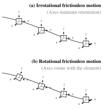
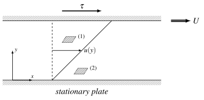

## Last time



$$
\frac{D\vect{q}}{Dt} = \underbrace{\frac{\partial \vect{q}}{\partial t}}_{\text{local}} + \underbrace{(\vect{q}\cdot\del)\vect{q}}_{\text{convective}}
$$

Today: how does a fluid element **rotate**, and how is **shear stress** linked to velocity gradients?

::: {.notes}
Two-minute recap. Ask: "in steady flow through a nozzle, which term is non-zero?" (convective).
:::

## Local rotation of fluid elements

[[📖 Notes §1.3](../notes/ch1.qmd#sec-vorticity)]{.notes-link}

As fluid moves, each fluid element may:

- translate,
- deform,
- rotate.

The measure of local rotation is the **vorticity** vector:
$$
\vect{\xi} = \del \times \vect{q}
$$

::: {.notes}
Introduce the idea that fluid elements are deformable and may rotate, unlike rigid bodies. Show that rotation relates to velocity gradients. Explain that vorticity is a vector pointing along the local axis of rotation, and its magnitude represents twice the angular velocity of the fluid element.

ξ is pronounced "ksai".
:::

## Definition of vorticity

$$
\vect{\xi} =
\left(\frac{\partial w}{\partial y} - \frac{\partial v}{\partial z}\right)\uvec{i}
+ \left(\frac{\partial u}{\partial z} - \frac{\partial w}{\partial x}\right)\uvec{j}
+ \left(\frac{\partial v}{\partial x} - \frac{\partial u}{\partial y}\right)\uvec{k}
$$

- $\xi_x$ = rotation about the $x$-axis
- $\xi_y$ = rotation about the $y$-axis
- $\xi_z$ = rotation about the $z$-axis

[Refresher: [computing a curl with the determinant method](https://www.youtube.com/watch?v=Ia7Harz_TLk) (video).]{.small}

::: {.notes}
Write down the vector formula using a determinant, then expand to show how velocity gradients generate rotation. Emphasise that vorticity is zero for flows where neighbouring streamlines do not twist relative to each other.
:::

## Rotational vs irrotational flows

:::: {.columns}
::: {.column width="42%"}
- If $\del \times \vect{q} = 0$: **irrotational flow** (fluid element translates but does not spin).
- If $\del \times \vect{q} \neq 0$: **rotational flow**.
:::
::: {.column width="58%"}
{height="540px"}
:::
::::

::: {.notes}
Stress that irrotational flow is an idealisation that holds away from boundaries in many high-Reynolds-number flows. Rotational flow is found in vortex cores, shear layers, wakes, boundary layers, turbulence.

Top (a): irrotational — the element may translate and even deform, but its axes maintain the same orientation relative to a fixed frame: ξ = 0.
Bottom (b): rotational — as the element moves along the streamline, its local axes rotate: ξ ≠ 0.
:::

## Quick question {.poll}

Which flow has **zero** vorticity (away from the centre/walls)?

1. A whirlpool with circular streamlines, $u_\theta = \Gamma / 2\pi r$
2. Flow between two plates, $u = Uy/h$ (straight, parallel streamlines)
3. Both
4. Neither

::: {.fragment}
**A.** The whirlpool (free vortex) is irrotational; the shear flow, with *straight* streamlines, is rotational: $\xi_z = -U/h$. Let's see why.
:::

::: {.notes}
Vote, discuss with a neighbour, vote again. Most students pick B (or "neither"): the classic misconception that curved streamlines mean rotation. Resolve it with the explorer on the next slide.
:::

## See it: does the element rotate?

::: {.notes}
Start with the free vortex: the elements orbit the centre but the cross does not turn. Switch to simple shear: straight streamlines, yet the cross turns clockwise and the element shears. Then solid-body rotation (ξ = 2Ω), then stagnation-point flow (Problem 1.5: stretched, not rotated).

Stress that this is a local concept: global curvature of streamlines does not necessarily imply local rotation of the element. What matters is whether the element itself spins about its centre.
:::

## Example: vorticity

Given the velocity field
$$
\vect{q} = (x^2 y)\,\uvec{i} + (3xy)\,\uvec{j} + 0\,\uvec{k}
$$
find the vorticity vector $\vect{\xi}$.

::: {.fragment}
$\xi_x = \dfrac{\partial w}{\partial y} - \dfrac{\partial v}{\partial z} = 0, \qquad \xi_y = \dfrac{\partial u}{\partial z} - \dfrac{\partial w}{\partial x} = 0$
:::

::: {.fragment}
$\xi_z = \dfrac{\partial v}{\partial x} - \dfrac{\partial u}{\partial y} = 3y - x^2$
:::

::: {.fragment .answer-box}
$$
\vect{\xi} = (3y - x^2)\,\uvec{k}
$$
:::

::: {.notes}
Full derivation: ∂w/∂y − ∂v/∂z = 0; ∂u/∂z − ∂w/∂x = 0; ∂v/∂x = 3y, ∂u/∂y = x², so ξz = 3y − x². This is a good moment to reinforce the "rotation about z" meaning: a 2D flow in the xy-plane can only have a z-component of vorticity.
:::

## Shear stress in fluid motion: Couette flow

[[📖 Notes §1.4](../notes/ch1.qmd#sec-shear-stress)]{.notes-link}

Real fluids resist relative motion between layers. This resistance is quantified by the **shear stress** $\tau$.

{width=70%}

::: {.notes}
Introduce the idea that fluid layers slide past one another with different velocities. This generates internal friction — viscosity. The goal today is to link velocity gradients with shear stress, leading to Newton's law of viscosity.

Key points:
- The bottom plate is stationary; the top plate moves at speed U.
- No-slip condition: fluid touching each plate has the same velocity as that plate.
- As a result, u(y) increases linearly from 0 to U.
- Fluid elements tilt (shear deformation), indicating internal shear forces.

Mention that this idealised Couette flow is the canonical example of simple shear.
:::

## Velocity gradient and shear

Let $u(y)$ be the horizontal velocity between two plates a distance $h$ apart:

$$
u \uparrow \quad\text{as}\quad y \uparrow \qquad\Rightarrow\qquad \frac{du}{dy} > 0
$$

**Sign convention:** with $du/dy > 0$, $\tau$ is positive and elements are sheared clockwise.

::: {.notes}
Explain physically: the fluid touching the top plate moves fastest, the fluid touching the bottom plate is stationary (no-slip condition). Therefore, velocity changes linearly between the plates in simple shear. This gradient is responsible for internal shear stresses.
:::

## Newton's law of viscosity

For a **Newtonian fluid**:

$$
\tau = \mu \frac{du}{dy}
$$

where $\tau$ = shear stress, $\mu$ = dynamic viscosity, $du/dy$ = shear rate.

Non-Newtonian fluids (polymers, blood, slurries) need more complex relations.

::: {.notes}
Clarify that this is an empirical constitutive law. Most common fluids (water, air, oils) behave as Newtonian over wide ranges of strain rates. Stress that Newton's law links kinematics (du/dy) to dynamics (τ), completing the momentum equation closure for simple fluids.
:::

## Example: shear stress

A Newtonian fluid with viscosity $\mu = 0.12$ Pa s flows between two plates separated by 6 mm. The top plate moves at $U = 0.45$ m/s. If the velocity varies linearly, compute the shear stress.

::: {.fragment}
$u(y) = \dfrac{U}{h}\,y \quad\Rightarrow\quad \dfrac{du}{dy} = \dfrac{U}{h} = \dfrac{0.45}{0.006} = 75\ \text{s}^{-1}$
:::

::: {.fragment .answer-box}
$$
\tau = \mu \frac{du}{dy} = 0.12 \times 75 = 9\ \text{Pa}
$$
:::

::: {.notes}
Encourage students to check units: Pa·s × s⁻¹ = Pa.
:::

## Lecture 2: summary

- Introduced **vorticity** $\vect{\xi} = \del \times \vect{q}$: the local rotation (spin) of fluid elements.
- Distinguished **irrotational** (no spin) from **rotational** flows; curved streamlines ≠ rotation.
- Introduced **shear stress** and related it to velocity gradients.
- For a Newtonian fluid in simple shear: $\tau = \mu\, du/dy$.

**Before next lecture:** try [Problems 1.4–1.5](../problems/index.qmd#topic-vorticity) and read the [Problem solving recipe](../notes/ch1.qmd#sec-recipe).

::: {.notes}
Summarise the key messages:
- Vorticity is fundamental to shear layers, wakes, vortices, boundary layers, and turbulence.
- Regions of high vorticity are typically where interesting dynamical behaviour occurs (mixing, dissipation, etc.).

Reinforce that the constitutive relation closes the momentum equations for Newtonian fluids, enabling derivation of the Navier–Stokes equations. Preview next steps: combining material derivative, stress, and continuity to obtain the full momentum equations.
:::

