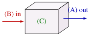
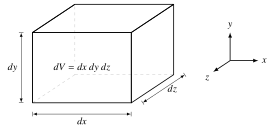
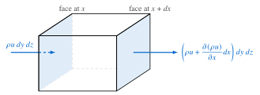
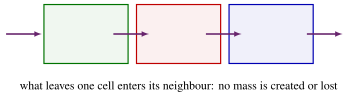
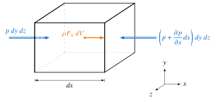
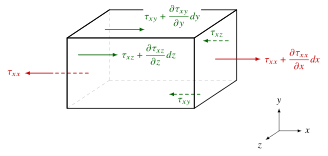
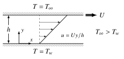
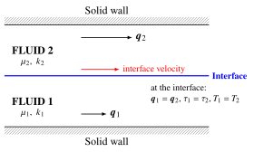
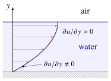

## Differential forms of fluid motion



[[📖 Notes Ch. 2](../notes/ch2.qmd)]{.notes-link}

**Goal:** derive the fundamental transport equations:

1. **Mass** (continuity)
2. **Momentum** (Navier–Stokes)
3. **Energy**

::: {.fragment style="text-align:center; margin-top:0.8em"}
**The approach:**

Physical laws &nbsp; **+** &nbsp; infinitesimal element ($dx, dy, dz$)

$\Big\downarrow$

**Differential equations** 
[(valid at every point in the flow)]{.small}
:::

::: {.notes}
OPENING: Introduction to Chapter 2. We move from the conceptual definitions of Chapter 1 to the rigorous derivation of the governing equations. These are the "transport equations":
1. Conservation of mass (continuity)
2. Conservation of momentum (Navier–Stokes)
3. Conservation of energy
:::

## Conservation of mass: the concept

[[📖 Notes §2.1](../notes/ch2.qmd#sec-continuity)]{.notes-link}

Mass conservation requires that for any fluid element:

$$
\underbrace{\left[ \begin{gathered} \text{Mass flow} \\ \text{OUT} \end{gathered} \right]}_{\text{(A)}}
-
\underbrace{\left[ \begin{gathered} \text{Mass flow} \\ \text{IN} \end{gathered} \right]}_{\text{(B)}}
+
\underbrace{\left[ \begin{gathered} \text{Rate of mass} \\ \text{ACCUMULATION} \end{gathered} \right]}_{\text{(C)}}
= 0
$$

:::: {.columns}
::: {.column width="40%"}
{height="170px"}
:::
::: {.column .fragment width="60%"}
**(C)**: mass in the element $m = \rho\, dV$, so
$$
\frac{\partial m}{\partial t} = \frac{\partial (\rho\, dV)}{\partial t} = \frac{\partial \rho}{\partial t}\, dx\,dy\,dz
$$
**(A), (B)**: next slides.
:::
::::

::: {.notes}
Start by establishing the physical principle before the maths. Draw a simple box on the board to represent the control volume.

- (A) Mass leaving the faces (flux out).
- (B) Mass entering the faces (flux in).
- (C) Mass accumulating inside (density change).
:::

## The infinitesimal fluid element

Consider a small element of volume $dV = dx\,dy\,dz$.

{height="250px" fig-align="center"}

**Taylor series approximation:** since $dx$ is small, the outflow is approximated as
$$
\phi(x+dx) = \phi(x) + \frac{\partial \phi}{\partial x}\, dx + \underbrace{\frac{1}{2}\frac{\partial^2 \phi}{\partial x^2}(dx)^2 + \dots}_{\approx\, 0 \text{ as } dx \to 0} \;\approx\; \phi(x) + \frac{\partial \phi}{\partial x}\, dx
$$

::: {.notes}
Explain why we use a Taylor series. We neglect higher-order terms ($dx^2$, etc.) because as the element shrinks to a point, those terms vanish much faster than the linear term.
:::

## Derivation: $x$-direction balance

Let's sum the mass flow in the $x$-direction:

{height="170px" fig-align="center"}

**Inflow:** $(\rho u)\, dy\,dz$ &emsp;&emsp; **Outflow:** $\left( \rho u + \dfrac{\partial (\rho u)}{\partial x}dx \right) dy\,dz$

::: {.fragment}
**Net outflow (out − in):** 
$\displaystyle \left[\rho u + \frac{\partial (\rho u)}{\partial x}dx\right]dy\,dz - \rho u\,dy\,dz = \frac{\partial (\rho u)}{\partial x}\,dx\,dy\,dz = \frac{\partial (\rho u)}{\partial x}\,dV$
:::

::: {.fragment}
Similarly, faces normal to $y$: $\;\dfrac{\partial (\rho v)}{\partial y}\,dV$ &emsp; faces normal to $z$: $\;\dfrac{\partial (\rho w)}{\partial z}\,dV$
:::

::: {.notes}
Write this derivation on the slide (press C to draw), then reveal:

Net = Out − In
= [ρu + ∂(ρu)/∂x dx] dy dz − [ρu] dy dz
= ∂(ρu)/∂x dx dy dz
= ∂(ρu)/∂x dV
:::

## The continuity equation (general)

Summing the $x$, $y$, $z$ net outflows and adding the accumulation term:

$$
\frac{\partial \rho}{\partial t}\, dx\,dy\,dz + \left[ \frac{\partial (\rho u)}{\partial x} + \frac{\partial (\rho v)}{\partial y} + \frac{\partial (\rho w)}{\partial z} \right] dx\,dy\,dz = 0
$$

::: {.fragment}
Dividing by the volume $dV$:
$$
\frac{\partial \rho}{\partial t} + \frac{\partial (\rho u)}{\partial x} + \frac{\partial (\rho v)}{\partial y} + \frac{\partial (\rho w)}{\partial z} = 0
$$
:::

::: {.fragment}
With the divergence $\;\del\cdot\vect{a} = \dfrac{\partial a_x}{\partial x} + \dfrac{\partial a_y}{\partial y} + \dfrac{\partial a_z}{\partial z}\;$ and $\;\vect{q} = (u, v, w)$:
$$
\boxed{\;\frac{\partial \rho}{\partial t} + \del \cdot (\rho \vect{q}) = 0\;}
$$
:::

::: {.notes}
This is the general form. Valid for:

- compressible or incompressible,
- steady or unsteady,
- viscous or inviscid flow.
:::

## Special cases

[[📖 Notes §2.1.1](../notes/ch2.qmd#sec-continuity-special)]{.notes-link}

**1. Steady flow:** $\partial/\partial t = 0$. Properties depend on position only.
$$
\del \cdot (\rho \vect{q}) = 0
$$

::: {.fragment}
**2. Incompressible flow:** density $\rho = \text{constant}$.

- $\partial \rho / \partial t = 0$, and $\rho$ can be pulled out of the divergence: $\;\rho\, \del \cdot \vect{q} = 0$.
- $\rho = 0$ is non-physical, so

$$
\boxed{\;\del \cdot \vect{q} = 0\;}
$$

*This applies to almost all liquids and low-speed gases ($Ma = U/c < 0.3$, with $c$ the speed of sound).*
:::

::: {.notes}
Emphasise that for incompressible flow, the equation becomes purely geometric (kinematic). It says nothing about forces, only that volume is conserved.
:::

## Quick question {.poll}

Which 2D velocity field could describe an **incompressible** flow?

1. $u = x, \quad v = y$
2. [$u = x^2, \quad v = -2xy$]{.fragment .highlight-current-green}
3. $u = y, \quad v = y$
4. $u = xy, \quad v = xy$

::: {.fragment}
**B.** $\dfrac{\partial u}{\partial x} + \dfrac{\partial v}{\partial y} = 2x - 2x = 0$. The others give $2$, $1$ and $x + y$.
:::

::: {.notes}
Peer-instruction moment: give them 30 s to vote individually (hands or the polling tool), then one minute to convince a neighbour, then vote again before revealing. Common slip: differentiating u with respect to y (option C looks "balanced" because both components are y). Stress that only ∂u/∂x and ∂v/∂y enter ∇·q.
:::

## Example: continuity equation

An **incompressible** velocity field is given by
$$
u = a(x^2 - y^2), \qquad w = b, \qquad v \text{ unknown,}
$$
where $a$ and $b$ are constants. Determine the form of $v$.

::: {.fragment}
Using $\del \cdot \vect{q} = 0$: $\quad \dfrac{\partial u}{\partial x} + \dfrac{\partial v}{\partial y} + \dfrac{\partial w}{\partial z} = 0$
:::

::: {.fragment}
Substitute: $\quad 2ax + \dfrac{\partial v}{\partial y} + 0 = 0 \;\Rightarrow\; \dfrac{\partial v}{\partial y} = -2ax$
:::

::: {.fragment}
Integrate with respect to $y$ (holding $x$, $z$, $t$ fixed): $\;\displaystyle\int \frac{\partial v}{\partial y}\, dy = \int -2ax\, dy$
:::

::: {.fragment .answer-box}
$$
v = -2axy + f(x,z,t)
$$
:::

::: {.notes}
Let students attempt it first (1–2 minutes), then reveal step by step.

1. Write ∇·q = 0 in Cartesian form.
2. ∂u/∂x = 2ax and ∂w/∂z = 0, so ∂v/∂y = −2ax.
3. Integrating a partial derivative: the "constant" of integration can be any function of the other variables, f(x, z, t). Continuity alone cannot determine it; we would need boundary conditions (e.g. v = 0 on a wall y = 0 gives f = 0).
:::

## Conservative vs non-conservative

[[📖 Notes §2.1.2](../notes/ch2.qmd#sec-continuity-nonconservative)]{.notes-link}

The equation we just derived is the **conservative form**:
$$
\frac{\partial \rho}{\partial t} + \del \cdot (\rho \vect{q}) = 0
$$

**Physical meaning:**

- Explicitly represents fluxes through the "boundaries" of fluid elements.
- Preferred for numerical simulations (CFD).

::: {.fragment}
{height="170px" fig-align="center"}
:::

::: {.notes}
"Conservative" means it strictly conserves the quantity (mass) inside the box. If density goes up, it MUST be because mass flowed in through the boundary.
:::

## Deriving the non-conservative form

We can expand the divergence term using the product rule:
$$
\del \cdot (\rho \vect{q}) = \vect{q} \cdot \del \rho + \rho\, \del \cdot \vect{q}
$$

::: {.fragment}
Substitute this back into the continuity equation:
$$
\underbrace{\frac{\partial \rho}{\partial t} + \vect{q} \cdot \del \rho}_{D\rho/Dt} + \rho\, \del \cdot \vect{q} = 0
$$
:::

::: {.fragment}
Using the material derivative from Chapter 1, $\;\dfrac{d}{dt} = \dfrac{D}{Dt} = \dfrac{\partial}{\partial t} + (\vect{q}\cdot\del)$:
$$
\boxed{\;\frac{D\rho}{Dt} + \rho\, \del \cdot \vect{q} = 0\;}
\qquad \text{non-conservative form of continuity}
$$
:::

::: {.notes}
Remind them: D/Dt = ∂/∂t + q·∇ (Chapter 1).

This form follows a MOVING fluid particle. It says: "The density of a specific chunk of fluid changes if the chunk gets squashed or expanded."
:::

## Conservation of momentum

[[📖 Notes §2.2](../notes/ch2.qmd#sec-momentum)]{.notes-link}

We apply Newton's 2nd law to the fluid element:
$$
\sum \vect{F} = m\, \vect{a}
$$

A vector equation, i.e. three scalar ones: $\quad \sum F_x = m\,a_x, \quad \sum F_y = m\,a_y, \quad \sum F_z = m\,a_z$

::: {.fragment}
What forces act on the fluid?

- **Body forces:** act on the bulk mass (e.g. gravity).
- **Surface forces:** act on the faces.
  - Normal forces (pressure + normal stress).
  - Tangential forces (shear stress).
:::

::: {.notes}
Momentum is a VECTOR equation. We will derive it for the x-direction first.

- m = ρ dV
- a = Du/Dt (total acceleration: local + convective)
:::

## Forces in $x$: body force and pressure

{height="370px" fig-align="center"}

::: {.fragment}
Net pressure force:
$\quad p\,dy\,dz - \left(p + \dfrac{\partial p}{\partial x}dx\right)dy\,dz = -\dfrac{\partial p}{\partial x}\,dx\,dy\,dz = -\dfrac{\partial p}{\partial x}\,dV$
:::

::: {.notes}
Action (press C to draw over the figure, or reveal step by step):

1. Body force vector (ρ F_x dV) inside the box, where F_x is the body force per unit mass.
2. Pressure (p) on the LEFT face (pushing in).
3. Pressure (p + ∂p/∂x dx) on the RIGHT face (pushing in).
4. Write the sum below.
:::

## Understanding stress notation

[[📖 Notes §2.2](../notes/ch2.qmd#sec-stresses)]{.notes-link}

**Subscript convention:** $\tau_{ij}$

- $i$: direction in which the force (stress) acts.
- $j$: direction normal to the face on which it acts.

{height="290px" fig-align="center"}

Symmetry: $\;\tau_{ij} = \tau_{ji}$, e.g. $\tau_{xy} = \tau_{yx}$. &emsp; [Normal stresses are sometimes written $\sigma_{xx}$.]{.small}

::: {.notes}
Use the diagram from the notes here. $\tau_{xy}$ acts in the x-direction on a face whose normal is in the y-direction.

Shear stresses ($\tau_{xy}$) cause deformation (shape change). Normal stresses ($\tau_{xx}$) cause expansion/compression.

Textbooks differ on the order of the subscripts (many use the opposite convention: first index = face normal). For a Newtonian fluid $\tau_{ij} = \tau_{ji}$, so the equations are the same either way.
:::

## Forces in $x$: viscous stresses

{height="420px" fig-align="center"}

[On the faces at $x+dx$, $y+dy$, $z+dz$ the stresses act in $+x$; on the opposite (hidden, dashed) faces they act in $-x$.]{.small}

::: {.notes}
Same element, now with the viscous stresses that act in the x-direction (pressure was on the previous slide).

- Red: normal stress τ_xx on the two x-faces (outward = positive).
- Green: shear stresses τ_xy (on the y-faces) and τ_xz (on the z-faces).
- On each pair of faces the value at the far face is expanded with a Taylor series, exactly as for the mass flux, so only the derivative survives in the net force (next slide).
:::

## Summing the forces in $x$

Summing all surface forces in the $x$-direction:

**Pressure force (net):**
$$
-\frac{\partial p}{\partial x}\, dx\,dy\,dz
$$

**Viscous stress force (net):**
$$
\Bigg( \underbrace{\frac{\partial \tau_{xx}}{\partial x}}_{\substack{\text{normal stress}\\ x\text{-faces}}} + \underbrace{\frac{\partial \tau_{xy}}{\partial y} + \frac{\partial \tau_{xz}}{\partial z}}_{\substack{\text{shear stresses}\\ y\text{- and } z\text{-faces}}} \Bigg)\, dx\,dy\,dz
$$

::: {.notes}
Walk through the pressure cancellation: p − (p + ∂p/∂x dx) = −∂p/∂x dx. This explains why the PRESSURE GRADIENT drives flow, not pressure itself.

Same for each stress pair, e.g. (τ_xy + ∂τ_xy/∂y dy) dx dz − τ_xy dx dz = ∂τ_xy/∂y dx dy dz.
:::

## Equation of motion ($x$-direction)

Mass $\times$ acceleration = forces, per unit volume (mass $= \rho\,dV$, acceleration $= Du/Dt$):

$$
\underbrace{\rho \frac{Du}{Dt}}_{\text{mass}\,\times\,\text{accel.}} = \underbrace{\rho F_x}_{\text{body force}} \underbrace{- \frac{\partial p}{\partial x}}_{\text{pressure}} + \underbrace{\left( \frac{\partial \tau_{xx}}{\partial x} + \frac{\partial \tau_{xy}}{\partial y} + \frac{\partial \tau_{xz}}{\partial z} \right)}_{\text{viscous stresses}}
$$

[$\rho F_x$: body force per unit volume ($F_x$ per unit mass). Often gravity is the only body force.]{.small}

[Similarly in $y$ and $z$ (with $\tau_{yx}, \tau_{yy}, \tau_{yz}$ and $\tau_{zx}, \tau_{zy}, \tau_{zz}$).]{.small}

::: {.fragment}
**The problem:** we have too many unknowns (3 velocities + pressure + 6 stresses).
We need a link between **stress** and **motion**.
:::

::: {.notes}
This equation is valid for SOLIDS too! To make it a "fluid" equation, we need a constitutive law.

- For solids: Hooke's law (stress ~ strain).
- For fluids: Newton's law (stress ~ strain RATE).

Count: 4 equations (continuity + 3 momentum) for 10 unknowns (u, v, w, p and 6 independent stresses) in incompressible flow.
:::

## Stokes' relations: Newtonian fluid

[[📖 Notes §2.2](../notes/ch2.qmd#sec-stresses)]{.notes-link}

Stokes' relations for a Newtonian fluid (with Stokes' hypothesis $\lambda = -\tfrac{2}{3}\mu$):

$$
\tau_{xy} = \tau_{yx} = \mu \left( \frac{\partial v}{\partial x} + \frac{\partial u}{\partial y} \right)
$$

$$
\tau_{xx} = 2\mu \frac{\partial u}{\partial x} - \frac{2}{3}\mu\, (\del \cdot \vect{q})
$$

[and similarly for $\tau_{yz}$, $\tau_{zx}$, $\tau_{yy}$, $\tau_{zz}$.]{.small}

::: {.fragment}
Compactly (index notation): $\;\tau_{ij} = \tau_{ji} = \mu\left(\dfrac{\partial u_i}{\partial x_j} + \dfrac{\partial u_j}{\partial x_i}\right) - \dfrac{2}{3}\mu\,(\del\cdot\vect{q})\,\delta_{ij}$. &emsp; Incompressible: $\del\cdot\vect{q} = 0$.
:::

- $\mu$: dynamic viscosity.
- Relates stress directly to **velocity gradients**.

::: {.notes}
Mention that the 2/3 term vanishes for incompressible flow, because ∇·q = 0 there.

The shear stress formula should look familiar from Chapter 1 (Couette flow was just τ = μ du/dy).
:::

## The Navier–Stokes equations

[[📖 Notes §2.2](../notes/ch2.qmd#sec-ns-special)]{.notes-link}

Substituting the stresses back into the equation of motion.

**Assumptions:** incompressible ($\rho$ constant); constant viscosity ($\mu$ constant); body force = gravity ($\vect{F} = \vect{g}$).

::: {.fragment}
$$
\boxed{\;\rho \frac{D\vect{q}}{Dt} = -\del p + \mu \del^2 \vect{q} + \rho \vect{g}\;} \qquad \vect{q} = (u, v, w)
$$
:::

::: {.fragment}
Laplacian: $\;\del^2 = \dfrac{\partial^2}{\partial x^2} + \dfrac{\partial^2}{\partial y^2} + \dfrac{\partial^2}{\partial z^2}$

e.g. $\;(\mu \del^2 \vect{q})_x = \mu \del^2 u = \mu\left(\dfrac{\partial^2 u}{\partial x^2} + \dfrac{\partial^2 u}{\partial y^2} + \dfrac{\partial^2 u}{\partial z^2}\right)$
:::

::: {.notes}
This is the most famous equation in fluid dynamics. Write out the Laplacian term for them:

∇²u = ∂²u/∂x² + ∂²u/∂y² + ∂²u/∂z².

It represents diffusion of momentum.
:::

## Physical interpretation of terms

Dividing by $\rho$ (with $\nu = \mu/\rho$):

$$
\underbrace{\frac{\partial \vect{q}}{\partial t}}_{\text{local accel.}}
+
\underbrace{(\vect{q}\cdot\del)\vect{q}}_{\text{convective accel.}}
=
\underbrace{-\frac{1}{\rho}\del p}_{\text{pressure force}}
+
\underbrace{\nu \del^2 \vect{q}}_{\text{viscous force}}
+
\underbrace{\vect{g}}_{\text{gravity}}
$$

[(all forces per unit mass)]{.small}

::: {.fragment}
$x$-component:
$$
\frac{\partial u}{\partial t} + u\frac{\partial u}{\partial x} + v\frac{\partial u}{\partial y} + w\frac{\partial u}{\partial z} = -\frac{1}{\rho}\frac{\partial p}{\partial x} + \nu \del^2 u + g_x
$$
[$\nu = \mu/\rho$: kinematic viscosity. &emsp; With $z$ pointing up, $\vect{g} = (0, 0, -g)$.]{.small}
:::

::: {.notes}
This is the NON-CONSERVATIVE form.

Ask: which term makes the equation hard to solve? Answer: the convective acceleration (q·∇)q. It makes the PDE non-linear.
:::

## Quick question {.poll}

Steady flow between two infinitely long parallel plates: $u = u(y)$, $v = w = 0$, gravity acts in $-y$. Which terms of the **$x$-momentum** N–S equation survive?

1. All of them
2. [Only $-\partial p/\partial x$ and $\mu\, \partial^2 u/\partial y^2$]{.fragment .highlight-current-green}
3. Only the convective term and $-\partial p/\partial x$
4. Only $\mu\, \partial^2 u/\partial y^2$

::: {.fragment}
**B.** Steady: $\partial u/\partial t = 0$; $u\,\partial u/\partial x = 0$ and $v = w = 0$, so $(\vect{q}\cdot\del)u = 0$; $g_x = 0$. Left with $0 = -\dfrac{\partial p}{\partial x} + \mu \dfrac{d^2 u}{d y^2}$ (D only if there is no imposed pressure gradient).
:::

::: {.notes}
Vote, discuss with a neighbour, vote again. Many students pick C because "the fluid is moving, so there must be convective acceleration".

Note we only needed to say the flow is unidirectional (v = w = 0): continuity then gives ∂u/∂x = 0, i.e. the flow is also fully developed. This sets up next week (Couette and Poiseuille flows).
:::

## Conservation of energy

[[📖 Notes §2.3](../notes/ch2.qmd#sec-energy)]{.notes-link}

::: {.callout-tip icon=false}
## First law of thermodynamics
Rate of change of energy = net heat added + net work done
:::

Total energy = internal energy + kinetic energy: $\;E = e + \tfrac{1}{2}|\vect{q}|^2$, with $e = C_v T$.

Skipping the derivation (see [Lecture Notes §2.3](../notes/ch2.qmd#sec-energy)), the final equation for an incompressible ($\rho$ constant), constant-property ($C_v$, $k$ constant) fluid is:

$$
\boxed{\;\rho C_v \frac{DT}{Dt} = k \del^2 T + \Phi + \rho \dot{Q}\;}
$$

::: {.notes}
Talking points:

- Start by grounding them: this is just the First Law of Thermodynamics.
- Why temperature? We convert from total energy (E) to temperature (T) because that is what we measure in engineering (internal energy e = C_v T).
- Assumptions: this equation assumes ρ, k and C_v are constant (for an incompressible fluid C_v = C_p).
- The terms: we have conduction, dissipation, and a new term Q̇ for internal heat sources (per unit mass).
:::

## Physical interpretation of terms (energy)

$$
\Large
\color{#0066CC}{\rho C_v \frac{DT}{Dt}}
=
\color{#CC0000}{k \del^2 T}
+
\color{#006600}{\Phi}
+
\color{#E67800}{\rho \dot{Q}}
$$

:::: {.columns}
::: {.column width="48%"}
::: {.fragment fragment-index=1}
[**(I) Change in internal energy**]{style="color:#0066CC"}

- Includes **local** and **convection** terms: $\dfrac{DT}{Dt} = \dfrac{\partial T}{\partial t} + (\vect{q}\cdot\del)T$.
:::

::: {.fragment fragment-index=3}
[**(III) Viscous dissipation**]{style="color:#006600"}

- Friction $\rightarrow$ heat.
- Never negative ($\Phi \ge 0$).
:::
:::

::: {.column width="48%"}
::: {.fragment fragment-index=2}
[**(II) Thermal conduction**]{style="color:#CC0000"}

- Diffusion of heat.
- Driven by temperature gradients.
:::

::: {.fragment fragment-index=4}
[**(IV) Heat generation**]{style="color:#E67800"}

- Internal heat source.
- e.g. chemical reaction.
:::
:::
::::

::: {.notes}
Explanation guide:

- Blue (LHS, I): the net result. How the particle's temperature actually changes.
- Red (II): heat spreading out (like a hot spoon in coffee).
- Green (III): fluid friction. Just like rubbing hands warms them up, shearing fluid creates heat. Φ is a sum of squares of velocity gradients, so it can never cool the fluid.
- Orange (IV): "magic" heat appearing from inside (microwaves, combustion).
:::

## Example: heated Couette flow

[[📖 Notes §2.3](../notes/ch2.qmd#sec-energy-internal)]{.notes-link}

:::: {.columns}
::: {.column width="50%"}
{height="230px"}
:::
::: {.column width="50%"}
[Lower plate stationary at $T_w$; upper plate moving at $U$, held at $T_\infty$. Constant $\mu$, $k$; steady, incompressible.]{.small}

Given: $\;u = \dfrac{Uy}{h}, \quad v = w = 0, \quad p = \text{const}$
:::
::::

$$
\frac{T - T_w}{T_\infty - T_w} = \frac{y}{h} + \frac{\mu U^2}{2k(T_\infty - T_w)}\,\frac{y}{h}\left(1 - \frac{y}{h}\right)
$$

**Task:** verify that these satisfy the energy equation
$\;\rho C_v \dfrac{DT}{Dt} = k \del^2 T + \Phi + \rho \dot{Q}$.

::: {.notes}
Set the problem and give them two minutes to decide which terms vanish before moving on. Known: u and T are functions of y only. Find: verify u(y) and T(y) satisfy the temperature equation.
:::

## Heated Couette flow: verification

::: {.fragment}
**LHS:** steady, $v = w = 0$, $T = T(y)$ $\;\Rightarrow\; DT/Dt = 0$. &emsp; **Source:** $\dot{Q} = 0$.
:::

::: {.fragment}
**Conduction:** $k\del^2 T = k\, d^2 T/dy^2$. &emsp; **Dissipation:** only $\partial u/\partial y \neq 0$, so $\Phi = \mu (du/dy)^2 = \mu U^2/h^2$.
:::

::: {.fragment}
So we need $\;k\, d^2T/dy^2 + \mu U^2/h^2 = 0$. &emsp; From the given profile:
$$
\frac{d^2 T}{dy^2} = \frac{\mu U^2}{2k}\left(-\frac{2}{h^2}\right) = -\frac{\mu U^2}{k h^2}
$$
:::

::: {.fragment .answer-box}
$$
k\,\frac{d^2T}{dy^2} + \Phi = -\frac{\mu U^2}{h^2} + \frac{\mu U^2}{h^2} = 0 \quad \checkmark
$$
:::

::: {.notes}
Term by term: (1) steady, so ∂T/∂t = 0; (2) convection u ∂T/∂x + v ∂T/∂y + w ∂T/∂z = 0 because T = T(y) and v = w = 0; (3) Q̇ = 0, no volumetric heating; (4) k∇²T = k d²T/dy²; (5) Φ = μ(du/dy)², the only non-zero velocity gradient.

Physical message: the linear part of T is pure conduction between the plates; the parabolic part is the viscous heating. Its size relative to the imposed temperature difference is the Brinkman number Br = μU²/[k(T∞ − T_w)]. With θ = (T − T_w)/(T∞ − T_w) and η = y/h: dθ/dη = 1 + (Br/2)(1 − 2η), so for Br > 2 the temperature maximum lies inside the gap and heat flows from the fluid into the hotter moving plate.
:::

## See it: Couette flow with viscous heating

::: {.notes}
Live demo of the example just verified. Start with negligible viscous heating (small Brinkman number Br = μU²/[k(T∞ − T_w)]): the temperature profile is linear (pure conduction). Increase U (or Br): the parabolic viscous-heating part grows; at Br = 2 the temperature gradient at the moving plate is zero, and for Br > 2 the maximum temperature moves inside the gap.
:::

## Initial and boundary conditions

[[📖 Notes §2.5](../notes/ch2.qmd#sec-bcs)]{.notes-link}

The Navier–Stokes equations are universal. The **physics of a specific problem** is defined by the constraints we apply.

::: {.fragment}
**1. Initial conditions** (time, for unsteady flows): at $t = 0$ we must know a snapshot of the entire domain:
$$
\vect{q},\ p,\ T = \text{known functions of } (x,y,z) \text{ at } t = 0
$$
:::

::: {.fragment}
**2. Boundary conditions** (space, for all flows): conditions at the edges of the domain.

1. **Solid impermeable surface** (walls)
2. **Inlet / outlet** (open boundaries)
3. **Fluid–fluid interface** (multi-phase)
:::

::: {.notes}
Talking points:

- Universal vs specific: the equations don't change, but flow in a pipe vs flow over a wing is different purely because of these conditions.
- Initial: only needed if the flow changes over time (unsteady).
- Boundary: needed for everything. We will look at the 3 types next.
:::

## Common boundary conditions

**A. Solid impermeable wall**

- **No-slip condition:** fluid velocity matches the wall velocity: $\;\vect{q}_{\text{fluid}} = \vect{q}_{\text{wall}}$ (usually $0$)
- **Thermal condition:** temperature is continuous: $\;T_{\text{fluid}} = T_{\text{wall}}$

::: {.fragment}
**B. Inlet & outlet**

- Specify the exact profiles ($\vect{q}$, $T$, $p$).
- Or, far enough downstream, assume the flow is fully developed (stops changing):
  $\;\partial \phi/\partial x = 0$ for $\phi = u, v, w$ (often also $T$), **but not** $p$: in fully developed pipe flow $\partial p/\partial x$ is constant and non-zero.
:::

::: {.notes}
No-slip and no temperature jump hold for a viscous, heat-conducting fluid (continuum). If the wall is stationary, q = 0 at the wall.

The zero-gradient outlet condition is applied to the velocity (and usually temperature), not to the pressure: the pressure gradient is exactly what drives a fully developed pipe flow.
:::

## Fluid–fluid interface (schematic)

{height="440px" fig-align="center"}

::: {.notes}
Two immiscible fluids between two walls, with a flat interface. The velocity is continuous across the interface (red arrow: both fluids move with the same velocity there), and the shear stress exerted by one fluid on the other must balance.
:::

## Interface equations

[[📖 Notes §2.5](../notes/ch2.qmd#sec-bcs)]{.notes-link}

At a flat interface (normal to $y$) between two immiscible fluids:

**1. Kinematic condition (motion)**
$$
\vect{q}_1 = \vect{q}_2
$$

**2. Dynamic condition (forces)**
$$
p_1 = p_2 \quad \text{and} \quad \tau_1 = \tau_2, \ \text{ i.e. } \ \mu_1 \frac{\partial u_1}{\partial y} = \mu_2 \frac{\partial u_2}{\partial y}
$$

**3. Thermal condition**
$$
T_1 = T_2 \quad \text{and} \quad k_1 \frac{\partial T_1}{\partial y} = k_2 \frac{\partial T_2}{\partial y}
$$

::: {.notes}
- Kinematic: the fluids move together; no slip between them.
- Dynamic: action equals reaction. p₁ = p₂ holds for a flat interface; a curved interface adds a surface-tension pressure jump (not needed in this course).
- Thermal: no temperature jump, and the heat flux (Fourier's law, q_y = −k ∂T/∂y) is continuous.
:::

## Special case: the free surface

:::: {.columns}
::: {.column width="64%"}
**Scenario:** liquid (e.g. water) meeting gas (e.g. air).

**1. Shear stress balance (dynamic condition):**
$$
\tau_{\text{liquid}} = \tau_{\text{gas}} \;\Rightarrow\; \mu_L \left(\frac{\partial u}{\partial y}\right)_L = \mu_G \left(\frac{\partial u}{\partial y}\right)_G
$$
:::
::: {.column width="36%"}
{height="200px"}
:::
::::

::: {.fragment}
**2. Approximation:** gas is much less viscous than liquid ($\mu_G \ll \mu_L$):
$$
\left(\frac{\partial u}{\partial y}\right)_L = \frac{\mu_G}{\mu_L}\left(\frac{\partial u}{\partial y}\right)_G \approx 0
\quad\Longrightarrow\quad
\boxed{\left(\frac{\partial u}{\partial y}\right)_{\text{liquid}} \approx 0}
$$

[Similarly $p_{\text{liquid}} \approx p_{\text{atm}}$ and, since $k_G \ll k_L$, $(\partial T/\partial y)_{\text{liquid}} \approx 0$.]{.small}
:::

::: {.notes}
The free-surface condition is the limit of the interface conditions when the second fluid is a gas: the gas cannot exert a significant shear stress (or conduct much heat), so the liquid sees a stress-free (and nearly adiabatic) surface. This is the condition we will use for film flows down an incline.
:::

## Chapter 2: summary

[[📖 Notes §2.4](../notes/ch2.qmd#sec-summary)]{.notes-link}

For an incompressible, Newtonian fluid with constant properties we derived the equations conserving mass, momentum and energy:

1. **Continuity:** $\quad \del \cdot \vect{q} = 0$
2. **Momentum (Navier–Stokes):** $\quad \dfrac{D\vect{q}}{Dt} = -\dfrac{1}{\rho}\del p + \nu \del^2 \vect{q} + \vect{g}$
3. **Energy:** $\quad \rho C_v \dfrac{DT}{Dt} = k \del^2 T + \Phi + \rho \dot{Q}$

…plus initial and boundary conditions (no slip, inlet/outlet, interfaces, free surface).

**Before next lecture:** try the [Chapter 2 problems](../problems/index.qmd#ch2) and review the [summary of key relations](../notes/ch2.qmd#sec-summary).

::: {.notes}
Next week: we will apply these equations to solve real problems (Couette flow, Poiseuille flow) where many terms will cancel out, making the maths solvable.
:::

