## Context: the spectrum of fluid motion



Fluid mechanics problems range from simple to chaotic:

1. **Potential flow**
    - Inviscid, irrotational.
    - Mathematically elegant, physically limited.
2. **Viscous laminar flow**
    - Ordered, layered motion.
    - Amenable to analytical solution (e.g. Poiseuille flow).
3. **Turbulent flow**
    - The focus of this chapter.
    - Most practical engineering flows fall here.

::: {.notes}
OPENING: 2-hour lecture plan.
1. Context: laminar vs turbulent.
2. History: Osborne Reynolds.
3. Physics: eddies, energy cascade, dissipation.
4. Scales: Kolmogorov theory and the −5/3 law.
5. Maths: Reynolds averaging.
6. RANS equations and the closure problem.

Instructor note:

- Potential flow: remind them this is useful for outer aerodynamics (lift) but fails inside pipes or boundary layers because it ignores viscosity.
- Laminar: "laminar" comes from "lamina" (layer). Imagine a deck of cards sliding over each other. It's predictable.
- Turbulence: this is the reality for 99% of engineering. Cars, planes, pumps, atmospheric flows. It is the "graveyard of theories" because it's so hard to solve.
:::

## What is turbulence?

[[📖 Notes §3.2](../notes/ch3.qmd#sec-what-is-turbulence)]{.notes-link}

::: {.callout-tip icon=false}
## Definition
Turbulence is a state of motion where an **irregular mixing motion** (eddies) is superimposed on the main flow.
:::

**Crucial distinction:**

- It is **not** just "unstable flow".
- An unstable flow might transition to a new stable state.
- Turbulence is **self-sustaining** and continuous.

::: {.notes}
Key concept:

- Ask the class: "Is a ball balanced on a needle turbulent?" No, it's unstable. It falls once and stops.
- Turbulence is chaotic but deterministic. It looks random, but it still follows the Navier–Stokes equations.
- It is characterised by vorticity. If there is no spin/rotation, it isn't turbulence (it might just be a wave).
:::

## Osborne Reynolds (1883)

[[📖 Notes §3.1](../notes/ch3.qmd#sec-history)]{.notes-link}

:::: {.columns}
::: {.column width="55%"}
The first systematic investigation of transition.

**The setup:**

- Glass tube with water fed by a reservoir.
- Dye injected at the centreline.
- Velocity varied to find the "critical" point.
:::
::: {.column width="45%"}
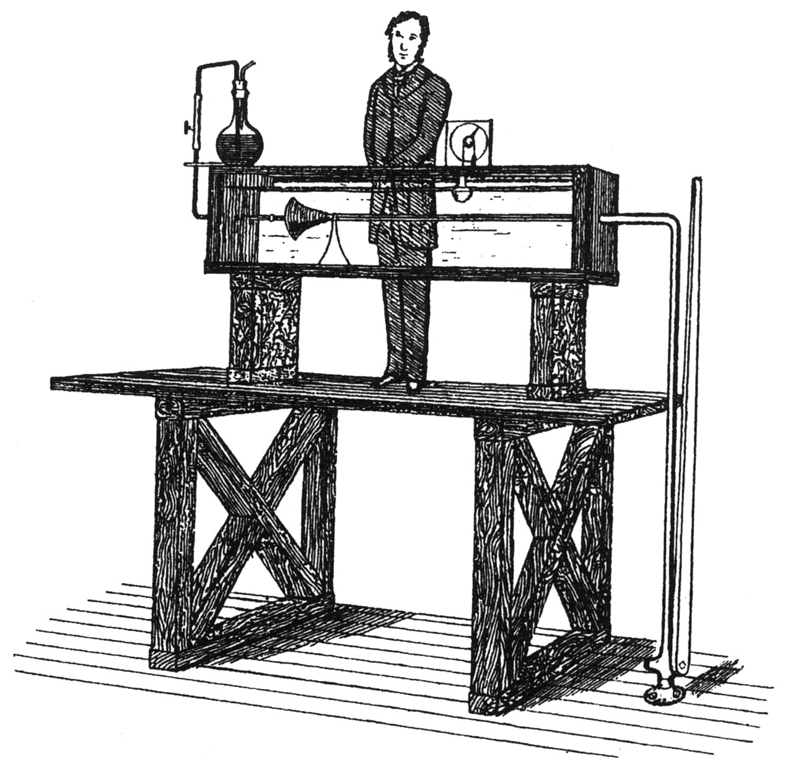{height="470px"}
:::
::::

::: {.notes}
Historical context:

- Osborne Reynolds didn't discover turbulence (da Vinci drew it!), but he quantified the transition.
- This experiment is still performed in undergraduate labs today (at L2 if you are on the MEng).
- The key was the "bell mouth" inlet (visible in the sketch) to ensure the flow started very smoothly. Any roughness at the start would ruin the experiment.
:::

## Reynolds' observations: laminar

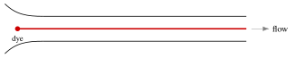{height="210px" fig-align="center"}

**(a) Low velocity:**

- Dye filament remains straight and parallel.
- Fluid moves in sliding layers (laminae).
- No cross-stream mixing.

::: {.notes}
Visual description:

- The dye line looks like a glass rod. It is perfectly steady.
- This means momentum is only transferred by molecular diffusion (viscosity), which is very slow.
:::

## Reynolds' observations: transitional

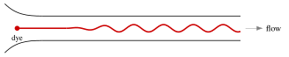{height="210px" fig-align="center"}

**(b) Critical velocity:**

- Filament begins to oscillate.
- Unstable flow pattern along the length.
- Intermittent bursts of turbulence.

::: {.notes}
Intermittency:

- This is the most dangerous regime for engineers.
- The flow flashes between laminar and turbulent.
- Imagine driving a car where the drag coefficient doubles every few seconds randomly. That is the transitional regime.
:::

## Reynolds' observations: turbulent

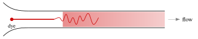{height="210px" fig-align="center"}

**(c) High velocity:**

- Dye mixes rapidly and disappears.
- **Mechanism:** subsidiary cross-stream motion.
- Momentum is exchanged transversely.

::: {.notes}
Mixing:

- The dye "disappears" because it is spread across the whole pipe cross-section almost instantly.
- This "subsidiary motion" (sideways movement) is the hallmark of turbulence. Even though the pipe points in x, fluid is moving in y and z.
:::

## Comparison of velocity profiles

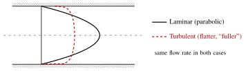{height="340px" fig-align="center"}

::: {.fragment}
Same flow rate, but the turbulent profile is flatter in the core and **much steeper at the wall** ⇒ higher wall shear stress $\tau_w = \mu\,(dU/dy)_{\text{wall}}$.
:::

::: {.notes}
Graph explanation:

- Laminar: parabola. Fluid at the centre moves fast, fluid near the wall is slow.
- Turbulent: "plug-like" flow. The mixing carries fast fluid from the centre towards the walls.
- Both profiles are drawn for the same flow rate (same mean velocity), so the comparison is fair: the laminar centreline velocity is 2× the mean, the turbulent one only about 1.15× the mean.
- Consequence: look at the slope at the wall (y = R). The turbulent slope is much steeper.
- Steeper slope = higher shear stress (τ_wall = μ dU/dy at the wall).
- This is why pumping turbulent water requires more power (more friction).
:::

## L2 lab experiment: flash vs long exposure

:::: {.columns}
::: {.column width="50%"}
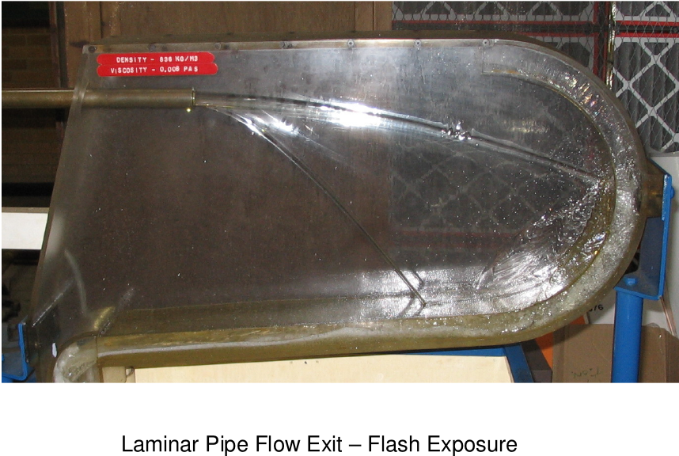{height="255px"}

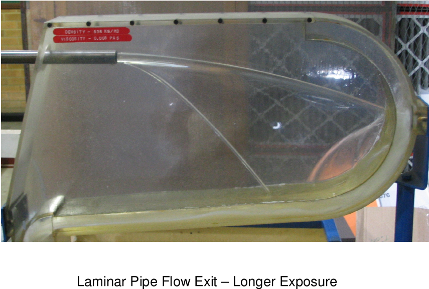{height="255px"}
:::
::: {.column width="50%" .fragment}
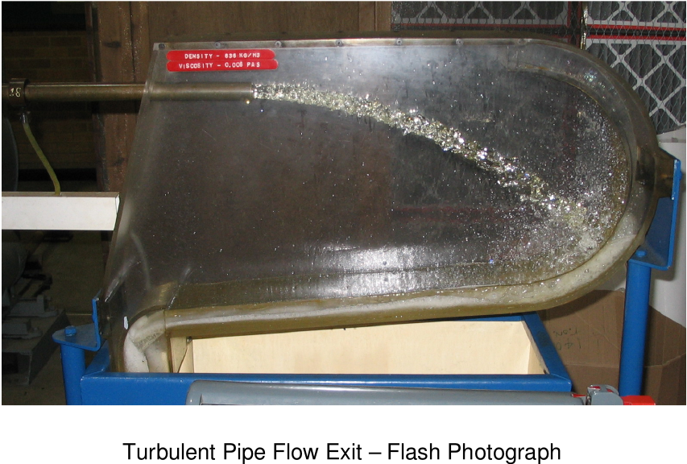{height="255px"}

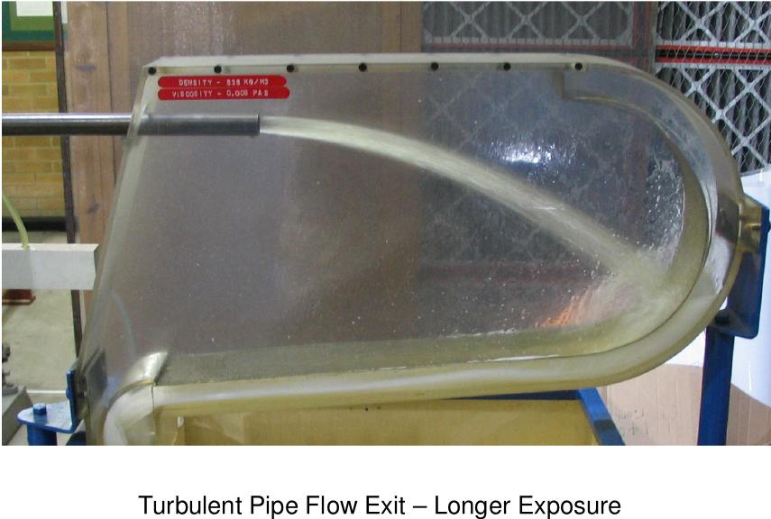{height="255px"}
:::
::::

::: {.notes}
Borrowed from the L2 pipe-flow experiment (in use since 1965): the jet leaving the end of the pipe, photographed with a flash (top: an instant) and with a longer exposure (bottom: a time average).

- Laminar (left): flash and long exposure look the same. The flow is steady: the instantaneous flow IS the mean flow.
- Turbulent (right, press →): the flash shows a rough, broken-up, irregular jet; the long exposure shows a smooth, well-defined jet.
- Message: a turbulent flow is unsteady at every instant, yet it has a well-defined average. The long exposure is a "Reynolds average" taken by the camera. Keep this picture in mind when we introduce Reynolds averaging later today.
:::

## Why does the profile change?

**Laminar:**

- Momentum transfer is by molecular viscosity only.
- Slow process → parabolic shape.

**Turbulent:**

- Eddies physically move high-momentum fluid from the centre towards the wall.
- This "mixes" the profile, making it flatter (more uniform).
- **Result:** higher velocity gradient at the wall → higher friction.

::: {.notes}
Analogy:

- Imagine a crowded corridor.
- Laminar: people walk in lanes. Fast in the middle, slow at the edges. No bumping.
- Turbulent: people run diagonally, bumping into each other. The fast people bump into the slow people at the walls, speeding them up. The profile flattens out.
:::

## The Reynolds number

Transition is governed by the ratio of inertia to viscosity:

$$
Re = \frac{\rho U L}{\mu} = \frac{U L}{\nu}
$$

- **Critical Re ($Re_{\text{crit}}$):** $\approx 2300$ for pipe flow (based on diameter and mean velocity).
- **Lower bound:** below about 2000, pipe flow remains laminar even with strong disturbances.

::: {.notes}
Is 2300 a hard limit? No. Schiller (1922) and Ekman (1910) maintained laminar flow up to Re = 20,000 and 40,000 respectively by paying close attention to the inlet conditions and eliminating disturbances. But in engineering, 2300 is the safe assumption.

Formula breakdown:

- Numerator (UL): destabilising effect (inertia).
- Denominator (ν): stabilising effect (viscosity/damping).
:::

## Defining turbulence

[[📖 Notes §3.2](../notes/ch3.qmd#sec-what-is-turbulence)]{.notes-link}

A precise definition is difficult, but commonly:

> "An irregular condition of flow in which quantities (velocity, pressure) exhibit random variation with time and space, yet distinct average values can be discerned."
>
> — Hinze (1975)

::: {.notes}
We start the "phenomenology" of turbulence: classification and description of what we observe, without an underlying unifying theory. Turbulence is difficult, so we begin by describing it.

Hinze (1975) gave this definition.

- Note the phrase "distinct average values".
- If the average keeps changing wildly, it might be a transient flow, not statistically steady turbulence.
- We rely on this "stationarity" to do the maths later (Reynolds averaging).
:::

## Classification by source

How is turbulence generated?

1. **Wall turbulence**
    - Generated by viscous shear at a solid boundary.
    - Examples: pipes, ducts, boundary layers.
2. **Free turbulence**
    - Generated by layers of fluid moving at different velocities (shear layers).
    - Examples: jets, wakes, mixing layers.

::: {.notes}
Examples:

- Wall: air over a wing, water in a hose.
- Free: smoke rising from a cigarette, the exhaust behind a car (wake).
- Free turbulence spreads more easily because there is no wall to restrict the eddies.
:::

## Characteristic A: fluctuations

[[📖 Notes §3.3](../notes/ch3.qmd#sec-characteristics)]{.notes-link}

**Irregularity:**

- Fluctuations occur in all 3 spatial directions ($u', v', w'$).
- Even if the mean flow is 1D (e.g. a pipe), the turbulence is 3D.

**Intensity:**

- Fluctuations are typically $\lesssim 10\%$ of the mean velocity (more in jets and wakes).
- They look random, but contain structure.

::: {.notes}
3D nature:

- This is crucial. Real turbulence is always three-dimensional.
- Vortex stretching (which sustains turbulence) requires 3 dimensions.
- If you simulate flow in 2D, you suppress the main mechanism of turbulence. (Strictly two-dimensional "turbulence" exists only as an idealisation, e.g. soap films or the very large scales of the atmosphere, and it behaves very differently: no vortex stretching, energy goes to larger scales.)
:::

## Characteristic B: eddies

**Structure of turbulence:**

- Turbulence is a collection of **eddies**.
- An eddy is a swirling patch of fluid that persists for a short time.

**Hierarchy:**

- Large eddies contain smaller eddies.
- Small eddies contain even smaller ones.

::: {.notes}
Quote: Lewis Fry Richardson (1922):
"Big whirls have little whirls that feed on their velocity, and little whirls have lesser whirls and so on to viscosity."

- Large eddies = size of the geometry (integral scale).
- Small eddies = size where viscosity acts (Kolmogorov scale).
:::

## Characteristic C: dissipation

**Energy loss:** turbulent kinetic energy is converted into heat by **viscous dissipation**, at a rate $\varepsilon$ (W/kg):

$$
\varepsilon = 2\nu\left[\overline{\left(\frac{\partial u'}{\partial x}\right)^2} + \overline{\left(\frac{\partial v'}{\partial y}\right)^2} + \overline{\left(\frac{\partial w'}{\partial z}\right)^2} + \frac{1}{2}\overline{\left(\frac{\partial u'}{\partial y} + \frac{\partial v'}{\partial x}\right)^2} + \dots\right]
$$

**Key insight:**

- Dissipation depends on velocity **gradients**.
- Gradients are steepest at the **smallest scales**.
- Therefore, dissipation happens primarily at the micro-scale.

::: {.notes}
The dots stand for the two remaining shear terms, ½(∂u'/∂z + ∂w'/∂x)² and ½(∂v'/∂z + ∂w'/∂y)², all time-averaged. It is the fluctuating velocity gradients that matter (ε = 2ν × mean of s'_ij s'_ij).

Interpretation:

- Large eddies have high energy but low gradients (they rotate slowly as a bulk).
- Small eddies have low energy but massive gradients (viscosity shears them apart).
- Result: production happens at large scales, dissipation happens at small scales.
:::

## The energy cascade

[[📖 Notes §3.4](../notes/ch3.qmd#sec-energy-cascade)]{.notes-link}

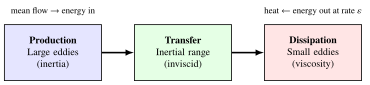{height="250px" fig-align="center"}

- Large eddies (unstable) break up.
- Energy is passed down the cascade.
- Viscosity finally kills the energy at the bottom (eddy Reynolds number $\approx 1$).

::: {.notes}
The bucket brigade:

- Imagine a line of people passing water buckets.
- Person 1 (mean flow) fills the bucket.
- Persons 2…99 pass it down (inertial range).
- Person 100 (viscosity) dumps it on the ground (heat).
- If person 1 stops filling, the line empties. Turbulence decays.

We will make this quantitative later today (Kolmogorov scales and the −5/3 law).
:::

## Characteristic D: self-sustaining

- Turbulence is not a transient event.
- Once initiated, it feeds on the mean-flow shear to maintain itself.
- If you remove the shear (e.g. stop the pump), turbulence decays.

::: {.notes}
Vortex stretching:

- The mechanism for this is "vortex stretching".
- As a vortex tube is stretched, it spins faster (conservation of angular momentum), extracting energy from the mean flow.
- Without shear, there is nothing to stretch the vortices, and viscosity eats them.
:::

## Characteristic E: diffusivity

**The "eddy viscosity" concept:**

- Turbulence mixes fluid much faster than molecular diffusion.
- It transports:
    - momentum (drag),
    - heat (cooling),
    - mass (combustion mixing).

*Eddy diffusion can be $100\times$ stronger than molecular diffusion (often far more).*

::: {.notes}
Why do we stir coffee?

- Molecular diffusion would take days to mix sugar and milk.
- By creating turbulence (spoon), we increase the diffusivity by orders of magnitude.
- In engines, we need turbulence to mix fuel and air before the spark fires.
:::

## Characteristic F: entrainment

:::: {.columns}
::: {.column width="45%"}
- Turbulent flows spread.
- They "eat" non-turbulent fluid at their boundaries.
- **Example:** a jet exiting a nozzle spreads and slows down as it entrains stationary fluid.
:::
::: {.column width="55%"}
{height="290px"}
:::
::::

::: {.notes}
Visual:

- Look at a contrail behind a plane. It starts thin and grows wider.
- The turbulent wake is capturing the quiet air around it and making it turbulent.
- In the sketch: the jet widens downstream and the velocity profile becomes bell-shaped; the momentum flux is conserved but shared with more and more entrained fluid, so the centreline velocity falls.
:::

## Estimating length scales

[[📖 Notes §3.5](../notes/ch3.qmd#sec-length-scales)]{.notes-link}

We have two extremes:

1. **Integral scale ($l$):** the size of the largest eddies (geometry dependent).
2. **Kolmogorov scale ($\eta$):** the size of the smallest eddies (viscosity dependent).

**How small is $\eta$?** We use an order-of-magnitude analysis.

::: {.notes}
Separation of scales:

- l is limited by walls (e.g. diameter of the pipe).
- η is limited by how "sticky" the fluid is.
- As the Reynolds number goes up, l stays the same, but η gets smaller and smaller. The gap widens.
:::

## Length scales: more than meets the eye

::: {style="text-align:center"}
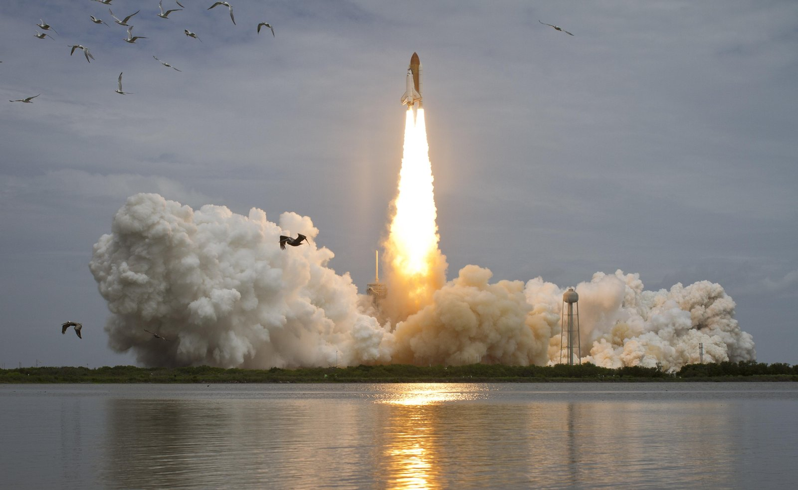{height="500px"}
:::

::: {.notes}
Space Shuttle Atlantis, STS-135 launch (NASA). Ask: what is the biggest eddy you can see? (The exhaust cloud: tens to hundreds of metres.) What is the smallest? (Far too small to see: the Kolmogorov scale here is well below a millimetre.) The same flow contains eddies spanning five or more orders of magnitude in size.

If time allows, show some in-class examples from "An Album of Fluid Motion" (Milton Van Dyke).
:::

## Energy balance

**1. Energy entering the cascade:** rate $\sim$ kinetic energy / turnover time

$$
\text{Rate in} \sim \frac{u_l^2}{l/u_l} = \frac{u_l^3}{l}
$$

**2. Energy dissipated at the bottom:** rate $\sim$ viscous stress work

$$
\varepsilon \sim \frac{\nu u_\eta^2}{\eta^2}
$$

**Assumption:** equilibrium (rate in = rate out $=\varepsilon$).

::: {.notes}
Kolmogorov's first hypothesis:

- The small scales forget the geometry. They are isotropic (same in all directions) and universal.
- The rate of energy arriving from big eddies must equal the rate of energy burned by viscosity.
- ε is constant down the cascade.
:::

## Kolmogorov scales: derivation

At the smallest scale viscosity dominates (eddy Reynolds number $\approx 1$):
$$
\frac{u_\eta \eta}{\nu} \sim 1
$$

::: {.fragment}
Combining with $\varepsilon \sim \nu u_\eta^2/\eta^2$: $\quad \eta = \left(\dfrac{\nu^3}{\varepsilon}\right)^{1/4}, \quad u_\eta = (\nu\varepsilon)^{1/4}, \quad \tau_\eta = \left(\dfrac{\nu}{\varepsilon}\right)^{1/2}$
:::

::: {.fragment}
and with $\varepsilon \sim u_l^3/l$, $\;Re_l = u_l l/\nu$:

**Kolmogorov microscales:**

::: {.answer-box}
$$
\eta \sim l\, Re_l^{-3/4}, \qquad u_\eta \sim u_l\, Re_l^{-1/4}, \qquad \tau_\eta \sim \tau_l\, Re_l^{-1/2}
$$
:::
:::

::: {.notes}
The power law:

- Focus on η ~ Re^(−3/4), i.e. l/η ~ Re^(3/4).
- This explains why high-speed flows (high Re) have tiny micro-structures.
- If you double the speed, the smallest eddies shrink significantly (by a factor 2^(3/4) ≈ 1.7).

Algebra if asked: from u_η = ν/η and ε = ν u_η²/η² we get ε = ν³/η⁴, so η = (ν³/ε)^(1/4). Then η/l = (ν³/(ε l⁴))^(1/4) = (ν/(u_l l))^(3/4) using ε = u_l³/l. Note Re_l is the Reynolds number of the large eddies (u_l, l), not necessarily the bulk Re of the device; they are usually of similar order.
:::

## Kolmogorov's two hypotheses

[[📖 Notes §3.4](../notes/ch3.qmd#sec-energy-cascade)]{.notes-link}

:::: {.columns}
::: {.column width="38%"}
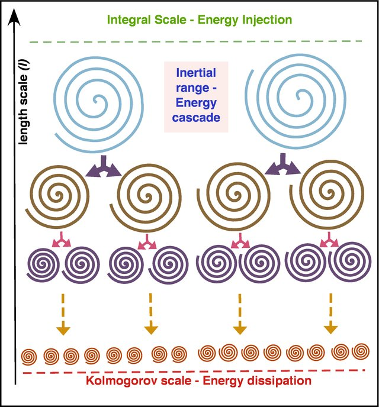{height="470px"}
:::
::: {.column width="62%"}
::: {.incremental}
- **Small scales** ($\ell \sim \eta$): isotropic and universal; depend only on $\nu$ and $\varepsilon$.
- **Inertial subrange** ($l \gg \ell \gg \eta$): eddies just pass energy on; statistics depend **only on $\varepsilon$** (not $\nu$, not geometry).
- This range exists only at high Re, because $l/\eta \sim Re_l^{3/4}$ is then large.
:::
:::
::::

::: {.notes}
NEW slide (energy cascade and −5/3 law, requested after last year's feedback).

- Richardson's picture (1922): energy enters at the integral scale, is handed down through a sequence of ever smaller eddies, and is dissipated at the Kolmogorov scale.
- Kolmogorov (1941) made this quantitative with two similarity hypotheses. First: at sufficiently high Re the small-scale motions are statistically isotropic and universal, determined by ν and ε only (that is why η, u_η, τ_η are built from ν and ε). Second: in the intermediate range of scales, l ≫ ℓ ≫ η, the statistics are determined by ε alone; viscosity is not yet important there.
- Emphasise: ε plays two roles. It is the rate at which energy is passed down (the flux through the inertial range) and the rate at which it is finally dissipated. In equilibrium they are equal.
- The width of the inertial range grows with Re: l/η ~ Re^(3/4). For Re = 10^4 that is 1000; for a lab pipe it may barely exist.
:::

## The −5/3 law

:::: {.columns}
::: {.column width="44%"}
Energy spectrum $E(\kappa)$: TKE per unit wavenumber, $\;k = \int_0^\infty E\,d\kappa$.

Inertial subrange: $E = f(\varepsilon, \kappa)$ only.

::: {.fragment}
$[E] = \text{m}^3\text{s}^{-2}, \; [\varepsilon] = \text{m}^2\text{s}^{-3}, \; [\kappa] = \text{m}^{-1}$
:::

::: {.fragment}
$E = C\,\varepsilon^a\kappa^b$:

- s: $\;-2 = -3a \Rightarrow a = \tfrac{2}{3}$
- m: $\;3 = 2a - b \Rightarrow b = -\tfrac{5}{3}$
:::
:::
::: {.column width="56%"}
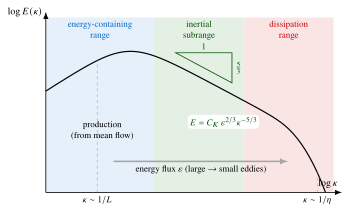{width="100%"}
:::
::::

::: {.fragment .answer-box}
$E(\kappa) = C_K\,\varepsilon^{2/3}\kappa^{-5/3}, \quad C_K \approx 1.5, \qquad$ valid for $1/l \ll \kappa \ll 1/\eta$
:::

::: {.notes}
NEW slide. Derive it live on the board.

- κ = 2π/ℓ is the wavenumber of an eddy of size ℓ. E(κ)dκ is the turbulent kinetic energy (per unit mass) contained in eddies with wavenumbers between κ and κ + dκ, so E has units (m²/s²)/(1/m) = m³/s².
- Kolmogorov's second hypothesis says E can depend only on ε and κ in the inertial subrange. Only one combination has the right units: ε^(2/3) κ^(−5/3). The constant C_K (Kolmogorov constant) ≈ 1.5 is found from experiments.
- On log–log axes this is a straight line of slope −5/3. It is one of the best-confirmed results in turbulence: it has been measured in wind tunnels, tidal channels, the atmosphere and in DNS.
- Read the figure from left to right: energy-containing range (production from the mean flow, κ ~ 1/l, geometry dependent); inertial subrange (−5/3, transfer only); dissipation range (κ ~ 1/η, spectrum falls off steeply as viscosity converts energy into heat).
- Link to the next lecture: DNS must resolve everything up to κ ~ 1/η; RANS models the whole spectrum.
:::

## See it: the energy spectrum

[[📖 Notes §3.4](../notes/ch3.qmd#sec-energy-cascade)]{.notes-link}

::: {.notes}
Live demo. Increase Re with the slider: the energy-containing end stays put (fixed by the geometry, κ ~ 1/l), while the dissipation end moves to ever higher wavenumbers, so the −5/3 inertial subrange gets wider: l/η ~ Re^(3/4). Ask: by how much does l/η grow if Re goes up by a factor of 10^4? (10^3.) This is the root cause of the cost of DNS that we will see in Part 2.
:::

## Quick question {.poll}

The Reynolds number of a flow is increased **16-fold** (same geometry, same integral scale $l$). The Kolmogorov length scale $\eta$ becomes...

1. 16 times smaller
2. [8 times smaller]{.fragment .highlight-current-green}
3. 4 times smaller
4. unchanged: it depends only on the geometry

::: {.fragment}
**B.** $\eta/l \sim Re^{-3/4}$, so $\eta$ changes by $16^{-3/4} = 2^{-3} = 1/8$.
:::

::: {.notes}
Peer-instruction moment: ask them to vote (hands, or the in-class polling tool), then discuss with a neighbour for one minute and vote again before revealing. Common wrong answers: A (assuming η ∝ 1/Re) and D (confusing η with the integral scale l, which IS set by the geometry).
:::

## Worked example: the smallest eddies

Flow over a car: $Re = 10^6$, integral scale $l = 1$ m. Estimate $\eta$ and the number of grid cells needed to resolve it.

::: {.fragment}
$\eta \sim l\, Re^{-3/4} = 1 \times (10^6)^{-3/4} = 10^{-4.5} \approx 3\times10^{-5}\ \text{m}$
:::

::: {.fragment .answer-box}
$$
\eta \approx 30\ \mu\text{m}
$$
:::

::: {.fragment}
**The challenge:** grid cells $\approx 30\ \mu$m wide, i.e. $(l/\eta)^3 \sim Re^{9/4} \approx 10^{13.5}$ cells: tens of **trillions**.
:::

::: {.notes}
Computational cost:

- The number of grid points needed for 3D DNS scales as Re^(9/4).
- For a car (Re = 10^6): (10^6)^2.25 ≈ 10^13.5 ≈ 3 × 10^13 grid points.
- This is why direct numerical simulation (DNS) is impossible for industrial flows. We can't resolve η.
- (The original slide said "billions of cells"; the estimate actually gives tens of trillions, which makes the point even more strongly.)
:::

## Conclusion on scales

- We cannot afford to resolve all scales for engineering problems.
- **Direct numerical simulation (DNS)** is restricted to low Re and simple geometries.
- **Solution:** we need to **model** the turbulence.

::: {.notes}
Transition to modelling:

- Since we can't calculate every eddy, we will try to calculate the average effect of the eddies.
- This leads us to Reynolds averaging.
:::

## The concept

[[📖 Notes §3.6](../notes/ch3.qmd#sec-reynolds-averaging)]{.notes-link}

Since we can't track every eddy, we track the **statistics**.

We decompose every variable into:

1. a time-averaged mean ($U$),
2. a fluctuating component ($u'$).

::: {.notes}
The engineering approach:

- An engineer designing a pipeline doesn't care that the velocity at t = 5.001 s is 10.2 m/s.
- They care that the average velocity is 10 m/s, so they can calculate the flow rate and pressure drop.
- Recall the long-exposure photograph of the turbulent jet: that is the mean flow.
:::

## Reynolds decomposition

:::: {.columns}
::: {.column width="50%"}
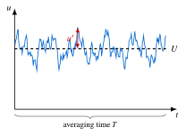{height="300px"}
:::
::: {.column width="50%"}
$$
\begin{aligned}
u(\vect{x},t) &= U(\vect{x}) + u'(\vect{x},t)\\
v(\vect{x},t) &= V(\vect{x}) + v'(\vect{x},t)\\
w(\vect{x},t) &= W(\vect{x}) + w'(\vect{x},t)\\
p(\vect{x},t) &= P(\vect{x}) + p'(\vect{x},t)
\end{aligned}
$$
:::
::::

**Definition of the mean:**
$$
U = \frac{1}{T}\int_{t_0}^{t_0+T} u \, dt
$$

::: {.notes}
Time interval T:

- T must be long enough to smooth out the fluctuations (T ≫ eddy time scale).
- But short enough that the global flow doesn't change (e.g. if the pump is slowly ramping up).
:::

## Properties of the mean

By definition:
$$
\overline{u'} = \frac{1}{T}\int_{t_0}^{t_0+T} (u - U) \, dt = U - U = 0
$$

**Important:** the average of the fluctuation is **zero**:

::: {.answer-box}
$$
\overline{u'} = 0, \quad \overline{v'} = 0, \quad \overline{w'} = 0, \quad \overline{p'} = 0
$$
:::

::: {.notes}
Common mistake:

- Students often think the mean of u'² is zero. It is not!
- The average of the value is zero (positives cancel negatives).
- The average of the square is always positive (energy).
:::

## Turbulence intensity

If the mean of $u'$ is zero, how do we measure turbulence strength? We use the **root mean square (RMS)**:

$$
u'_{\text{rms}} = \sqrt{\overline{u'^2}}
$$

**Turbulence intensity ($T_I$):**
$$
T_I = \frac{\sqrt{\overline{u'^2}}}{U_{\text{ref}}}
$$

::: {.notes}
Typical values:

- Wind tunnel (low turbulence): T_I < 0.1%.
- Pipe flow: T_I ≈ 5%.
- Jet engine exhaust: T_I > 20%.

(In wind energy, the turbulence intensity of the incoming wind, typically 5–15%, is a key design input for fatigue loads and for how quickly turbine wakes recover.)
:::

## See it: mean and fluctuations

[[📖 Notes §3.6](../notes/ch3.qmd#sec-reynolds-averaging)]{.notes-link}

::: {.notes}
Live demo. Point out: (1) the mean U is a single number for a statistically steady signal; (2) the running average converges only when the averaging window T is long compared with the slowest fluctuations: shorten the window and the "mean" wanders; (3) the mean of u' is zero but the mean of u'² is not, and its square root divided by U is the turbulence intensity.
:::

## Averaging rules: linear operations

[[📖 Notes §3.6.1](../notes/ch3.qmd#sec-averaging-rules)]{.notes-link}

Let $f = F + f'$ and $g = G + g'$ be flow variables.

**1. Sums:** $\quad\overline{f + g} = \overline{f} + \overline{g} = F + G$

**2. Derivatives:** $\quad\overline{\dfrac{\partial f}{\partial x}} = \dfrac{\partial \overline{f}}{\partial x} = \dfrac{\partial F}{\partial x}$

**3. Constants:** $\quad\overline{c\, f} = c\, F$

::: {.notes}
Commutation:

- Averaging commutes with differentiation and integration.
- This makes the linear parts of the Navier–Stokes equations easy to handle.
:::

## Averaging rules: non-linear operations

**This is where the physics happens.**

Consider the product $f g$ (e.g. $u v$ in momentum transport):

$$
\overline{f g} = \overline{(F+f')(G+g')} = \overline{FG + Fg' + f'G + f'g'}
$$

Apply the average to each term...

::: {.notes}
The trap:

- Is the average of the product equal to the product of the averages?
- Is the mean of fg equal to (mean of f) × (mean of g)?
- NO. Not if the fluctuations are correlated.
:::

## Step-by-step average

1. $\overline{FG} = FG$ (the mean of a constant is the constant).
2. $\overline{Fg'} = F\,\overline{g'} = F\cdot 0 = 0$.
3. $\overline{f'G} = G\,\overline{f'} = G\cdot 0 = 0$.
4. $\overline{f'g'} \neq 0$ (fluctuations can be correlated!).

**The Reynolds product rule:**

::: {.answer-box}
$$
\overline{f g} = FG + \overline{f'g'}
$$
:::

::: {.notes}
Correlation:

- If u' is positive (moving right) whenever v' is negative (moving down), consistently, then the mean of u'v' will be a negative number, not zero.
- This represents a net transport of properties.
:::

## Quick question {.poll}

For a turbulent flow with $u = U + u'$, $v = V + v'$, which of these is **in general non-zero**?

1. $\overline{u'}$
2. $\overline{U v'}$
3. [$\overline{u'v'}$]{.fragment .highlight-current-green}
4. $\overline{\partial u'/\partial x}$

::: {.fragment}
**C.** A, B and D are all averages of a single fluctuation (times a mean): zero. Only the **correlation** of two fluctuations survives.
:::

::: {.notes}
Vote, discuss with a neighbour, vote again. D catches some students: averaging commutes with differentiation, so the mean of ∂u'/∂x = ∂(mean of u')/∂x = 0. This single surviving term is exactly what will appear in the RANS equations on the next slides.
:::

## Goal: the RANS equations

[[📖 Notes §3.7](../notes/ch3.qmd#sec-rans)]{.notes-link}

**RANS** = **R**eynolds-**A**veraged **N**avier–**S**tokes equations.

We want equations that solve for the **mean flow** ($U, V, W, P$).

We start with the instantaneous Navier–Stokes equations and apply time averaging.

::: {.notes}
Why?

- If we solve this new equation, we get U.
- We don't need a trillion grid cells any more. We just need enough to resolve the gradients of U.
- This makes simulation possible on a standard workstation.
:::

## 1. Continuity equation

**Instantaneous:**
$$
\frac{\partial u}{\partial x} + \frac{\partial v}{\partial y} + \frac{\partial w}{\partial z} = 0
$$

**Average it:**
$$
\overline{\frac{\partial u}{\partial x}} + \dots = \frac{\partial U}{\partial x} + \frac{\partial V}{\partial y} + \frac{\partial W}{\partial z} = 0
$$

**Result:** the mean continuity equation is identical in form to the instantaneous one.

::: {.notes}
Good news:

- Conservation of mass (for incompressible flow) is linear.
- The equation doesn't change form: ∇·U = 0.
- Subtracting the two equations also gives ∇·u' = 0: the fluctuations are divergence-free too. We use both facts on the next slides.
:::

## 2. Momentum equation ($x$-direction)

**Instantaneous:**
$$
\rho \left( \frac{\partial u}{\partial t} + u\frac{\partial u}{\partial x} + v\frac{\partial u}{\partial y} + w\frac{\partial u}{\partial z} \right) = -\frac{\partial p}{\partial x} + \mu \nabla^2 u
$$

Let's average the linear terms first:

- $\overline{\partial p/\partial x} \rightarrow \partial P/\partial x$
- $\overline{\mu \nabla^2 u} \rightarrow \mu \nabla^2 U$
- $\overline{\partial u/\partial t} \rightarrow \partial U/\partial t$

::: {.notes}
Steady mean flow:

- Even if the turbulence (u') is changing rapidly with time, the mean (U) can be steady (∂U/∂t = 0).
- Example: a pipe running at constant flow rate.
:::

## Averaging the convective term

Non-linear. Using continuity, write it in **conservative form**:
$$
u\frac{\partial u}{\partial x} + v\frac{\partial u}{\partial y} + w\frac{\partial u}{\partial z} = \frac{\partial (u^2)}{\partial x} + \frac{\partial (uv)}{\partial y} + \frac{\partial (uw)}{\partial z}
$$

::: {.fragment}
Product rule: $\;\overline{u^2} = U^2 + \overline{u'^2}, \quad \overline{uv} = UV + \overline{u'v'}, \quad \overline{uw} = UW + \overline{u'w'}$
:::

::: {.fragment}
So (using mean continuity for the first group):
$$
\overline{\frac{\partial (u^2)}{\partial x} + \dots} = \underbrace{U\frac{\partial U}{\partial x} + V\frac{\partial U}{\partial y} + W\frac{\partial U}{\partial z}}_{\text{mean convection}} + \frac{\partial \overline{u'^2}}{\partial x} + \frac{\partial \overline{u'v'}}{\partial y} + \frac{\partial \overline{u'w'}}{\partial z}
$$
:::

::: {.notes}
The villain:

- The convective term (inertia) is responsible for turbulence.
- It is the only non-linear term in the equation.
- Averaging it produces the extra "fluctuation" terms.

Step by step: u ∂u/∂x + v ∂u/∂y + w ∂u/∂z = ∂(u²)/∂x + ∂(uv)/∂y + ∂(uw)/∂z − u(∂u/∂x + ∂v/∂y + ∂w/∂z), and the bracket is zero by continuity. (Note: u ∂u/∂x on its own is ½ ∂(u²)/∂x, not ∂(u²)/∂x; the conservative form needs all three terms together.) The same trick backwards, with ∇·U = 0, turns ∂(U²)/∂x + ∂(UV)/∂y + ∂(UW)/∂z into the mean convection U ∂U/∂x + V ∂U/∂y + W ∂U/∂z.
:::

## Rearranging

We move the new fluctuation terms to the right-hand side:

$$
\rho \frac{\bar{D} U}{\bar{D} t} = -\frac{\partial P}{\partial x} + \mu \nabla^2 U - \rho \frac{\partial \overline{u'^2}}{\partial x} - \rho\frac{\partial \overline{u'v'}}{\partial y} - \rho\frac{\partial \overline{u'w'}}{\partial z}
$$

with the mean-flow material derivative $\dfrac{\bar{D}}{\bar{D}t} = \dfrac{\partial}{\partial t} + U\dfrac{\partial}{\partial x} + V\dfrac{\partial}{\partial y} + W\dfrac{\partial}{\partial z}$.

We group these new terms as a stress tensor.

::: {.notes}
Why move it?

- Mathematically, it comes from the acceleration (LHS).
- Physically, it acts like a force (RHS).
- We move it to the RHS to treat it as an "apparent stress".

Stress that D̄/D̄t follows the MEAN flow (U, V, W), not the instantaneous velocity.
:::

## The RANS equation

**Reynolds-averaged Navier–Stokes ($x$-momentum):**

::: {.answer-box}
$$
\rho \frac{\bar{D} U}{\bar{D} t} = -\frac{\partial P}{\partial x} + \mu \nabla^2 U
\underbrace{- \rho \left[ \frac{\partial \overline{u'^2}}{\partial x} + \frac{\partial \overline{u'v'}}{\partial y} + \frac{\partial \overline{u'w'}}{\partial z} \right]}_{\text{turbulent stresses}}
$$
:::

*It looks like laminar flow, but with extra stresses.* (Similarly for $y$ and $z$.)

::: {.notes}
RANS:

- This is the most famous equation in engineering fluid dynamics.
- It underpins the turbulence models in CFD codes like ANSYS Fluent, STAR-CCM+ and OpenFOAM.
- But... we don't know the value of the term in the brackets!
:::

## Physical interpretation

[[📖 Notes §3.6.2](../notes/ch3.qmd#sec-turbulent-stresses)]{.notes-link}

The term $-\rho \overline{u'v'}$ represents:

- **Momentum transport:** eddies moving $x$-momentum in the $y$-direction.
- **Apparent stress:** it acts as a force on the mean flow.
- **Magnitude:** usually much larger than the viscous stress $\mu\, \partial U/\partial y$ (except very close to a wall).

We call these the **Reynolds stresses**.

::: {.notes}
Analogy:

- Imagine two trains running side by side. Fast train and slow train.
- Viscosity: people reach across and hold hands (weak drag).
- Turbulence: people jump back and forth between trains.
- When a fast person jumps to the slow train, they speed it up. When a slow person jumps to the fast train, they slow it down.
- This exchange of mass carries momentum → force.

Very close to a wall the fluctuations are damped and the viscous stress dominates again (the viscous sublayer, Chapter 4).
:::

## The Reynolds stress tensor

$$
\tau_{\text{turb}} =
-\rho \begin{pmatrix}
\overline{u'^2} & \overline{u'v'} & \overline{u'w'} \\
\overline{v'u'} & \overline{v'^2} & \overline{v'w'} \\
\overline{w'u'} & \overline{w'v'} & \overline{w'^2}
\end{pmatrix}
$$

- **Diagonal** ($\overline{u'^2}$, …): normal stresses (turbulent pressure).
- **Off-diagonal** ($\overline{u'v'}$, …): shear stresses.

::: {.notes}
Symmetry:

- The tensor is symmetric: mean of u'v' = mean of v'u'.
- This creates 6 new unknowns.
- Half the trace gives the turbulent kinetic energy per unit mass, k = ½(mean u'² + mean v'² + mean w'²), which we will need in Part 2.
:::

## The closure problem

**The counting game**

- **Unknowns (10):**
    - 3 mean velocities ($U, V, W$)
    - 1 pressure ($P$)
    - 6 Reynolds stresses ($\overline{u'^2}, \overline{u'v'}$, …)
- **Equations (4):**
    - 1 continuity
    - 3 momentum

**10 unknowns > 4 equations.**

::: {.notes}
Can we derive more equations?

- Yes, we can write an equation for the mean of u'v'.
- But that equation will contain triple products like the mean of u'v'w'.
- If we write equations for the triples, we get quadruples.
- It is an infinite hierarchy that never closes.
:::

## Part 1: summary

- Turbulence: irregular, 3D, rotational, self-sustaining, diffusive, dissipative; it has well-defined **averages**.
- **Energy cascade:** produced at $l$, transferred through the inertial subrange with $E(\kappa) = C_K\varepsilon^{2/3}\kappa^{-5/3}$, dissipated at $\eta \sim l\,Re^{-3/4}$.
- **Reynolds averaging:** $u = U + u'$, $\;\overline{u'} = 0$, $\;\overline{fg} = FG + \overline{f'g'}$.
- **RANS:** mean-flow equations with extra **Reynolds stresses** $-\rho\overline{u_i'u_j'}$ ⇒ the **closure problem**.

**Next lecture:** turbulence models (mixing length, $k$–$\varepsilon$, …) that relate the Reynolds stresses to the mean flow.

**Before next lecture:** try the [Chapter 3 problems](../problems/index.qmd#ch3) on scales and Reynolds averaging.

::: {.notes}
Problem: the RANS equations are unclosed. We cannot solve them directly.

Solution: we need turbulence models. These are mathematical formulas that estimate the Reynolds stresses based on the mean flow (U, V, W). Examples: mixing length, k–ε, k–ω. This will be the topic of the next lecture.

Preview: we will learn how to link the mean of u'v' to the mean gradient dU/dy. This is the Boussinesq approximation (eddy viscosity).
:::

