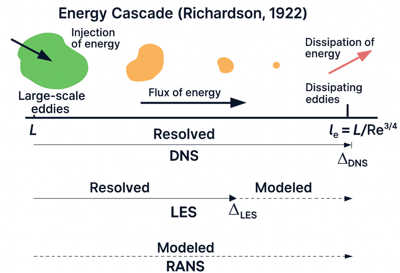
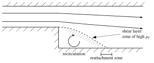
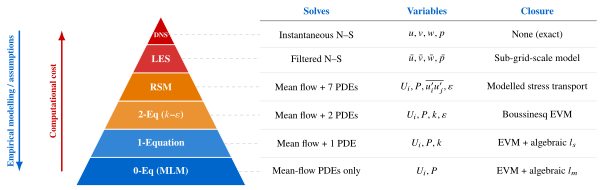

## Last time



$$
\rho \frac{\bar{D} U_i}{\bar{D} t} = -\frac{\partial P}{\partial x_i} + \mu \nabla^2 U_i - \frac{\partial \left(\rho\overline{u_i'u_j'}\right)}{\partial x_j}
$$

- Averaging the N–S equations produced **6 unknown Reynolds stresses** $-\rho\overline{u_i'u_j'}$.
- 4 equations, 10 unknowns: the **closure problem**.

Today: how do we **model** the Reynolds stresses?

::: {.notes}
OPENING: Welcome back. Today we are looking at turbulence modelling, a topic with 140 years of history, accelerated heavily in the last 50 years by computers.

Two-minute recap of Part 1. The equation is the RANS x-, y- and z-momentum equations written compactly (summation over the repeated index j). Ask: "where did the extra term come from?" (Averaging the non-linear convective term.)
:::

## A brief history

[[📖 Notes §3.8](../notes/ch3.qmd#sec-modelling)]{.notes-link}

**The modelling of turbulence:**

- Spans roughly 140 years of distinguished history.
- Accelerated considerably about 50 years ago.
- **Why?** The advent of, and readily available access to, digital computers.

::: {.fragment}
Throughout this period, a sequence of modelling procedures of varying complexity has emerged.
:::

::: {.notes}
Emphasise that analytical solutions are nearly impossible for real-world turbulent flows; computational power was the true catalyst for this field.
:::

## Categories of turbulence models

We can categorise these procedures into three main approaches:

::: {.incremental}
1. **Direct numerical simulation (DNS):** solving the N–S equations for *all* turbulence scales.
2. **Large eddy simulation (LES):** based on spatial (or temporal) filtering of the N–S equations.
3. **Classical models (RANS):** solving the Reynolds time-averaged N–S equations. Includes:
    - zero-equation models,
    - one-equation models,
    - two-equation models,
    - Reynolds stress equation models.
:::

::: {.notes}
Give a brief roadmap. We will briefly touch on DNS and LES, but the bulk of this lecture will focus on classical (RANS) models.
:::

## What each approach resolves

[[📖 Notes §3.4](../notes/ch3.qmd#sec-energy-cascade)]{.notes-link}

::: {style="text-align:center"}
{height="520px"}
:::

::: {.notes}
Recall the energy cascade from Part 1: energy is injected at the large scale L, passed down to smaller and smaller eddies, and dissipated at the Kolmogorov scale η = L/Re^(3/4) (labelled l_e in the figure).

- DNS: the grid spacing Δ_DNS must reach η, so every scale is resolved, nothing is modelled.
- LES: the grid (filter) width Δ_LES sits somewhere in the inertial subrange; the large energetic eddies are resolved, the small ones are modelled.
- RANS: the whole spectrum is modelled; only the mean flow is computed.

Keep this picture in mind for the rest of the lecture: moving down the figure, cost falls and modelling assumptions grow.
:::

## Direct numerical simulation (DNS)

[[📖 Notes §3.8](../notes/ch3.qmd#sec-modelling)]{.notes-link}

**The concept:**

- Takes the continuity and N–S equations as the starting point for the instantaneous variables ($u, v, w, p$).
- Computes a transient solution on a *very fine* spatial mesh with *very small* time steps.
- **Crucial point:** there is **no turbulence modelling** involved!

::: {.notes}
DNS is the ground truth. It is a numerical solution of the exact equations, with no modelling assumptions (only discretisation errors).
:::

## DNS: scale resolution requirements

:::: {.columns}
::: {.column width="40%"}
{height="440px"}
:::
::: {.column width="60%"}
DNS must resolve the *entire* range of scales:

- smallest: **Kolmogorov microscale** $\eta$,
- largest: **integral scale** $l$.

::: {.fragment}
Recall $\eta \sim l\, Re^{-3/4}$. Mesh spacing $h$ and $N$ points per direction:
$$
h \le \eta \quad\text{and}\quad Nh \ge l
$$
$$
\Rightarrow\; \frac{l}{N} \le \eta \;\Rightarrow\; N \ge \frac{l}{\eta} \sim Re^{3/4}
$$
:::
:::
::::

::: {.notes}
The grid must be fine enough to capture the smallest eddies (h ≤ η) and the domain must be big enough to contain the largest ones (Nh ≥ l). Combining: N ≥ l/η ~ Re^(3/4) points in EACH direction.
:::

## DNS: computational cost (mesh)

For a three-dimensional DNS computation:

- $N$ mesh points in each coordinate direction,
- total mesh points $= N^3$.

::: {.fragment}
**Memory storage requirement:**

::: {.answer-box}
$$
N^3 \ge Re^{9/4} \quad (\text{i.e. } Re^{2.25})
$$
:::
:::

::: {.fragment}
The memory storage requirements for DNS grow *very fast* as the Reynolds number increases.
:::

::: {.notes}
Example: Re = 10^4 needs about 10^9 points; Re = 10^6 needs about 3 × 10^13.
:::

## DNS: computational cost (time)

Time integration is explicit (memory limits), so the time step $\Delta t$ is limited by the Courant number:
$$
C = \frac{u_l\, \Delta t}{h} < 1
$$

::: {.fragment}
- Total simulated time $\propto \tau_l = l/u_l$.
- Number of time steps $\propto \dfrac{\tau_l}{\Delta t} = \dfrac{l/u_l}{C h/u_l} = \dfrac{l}{C h}$.
- With $h = \eta \sim l\,Re^{-3/4}$: time steps scale as $Re^{3/4}$.
:::

::: {.fragment .answer-box}
Operations $\propto$ mesh points $\times$ time steps $\propto Re^{9/4} \times Re^{3/4} = \mathbf{Re^3}$
:::

::: {.notes}
The time step must be small enough that a fluid particle does not cross more than one cell per step (Courant condition), and we must simulate for several large-eddy turnover times to get meaningful statistics.
:::

## Quick question {.poll}

A DNS of a channel flow takes **one week** on a supercomputer. A colleague wants the same flow at **twice** the Reynolds number. Roughly how long will it take?

1. 2 weeks
2. 4 weeks
3. [8 weeks]{.fragment .highlight-current-green}
4. 16 weeks

::: {.fragment}
**C.** Cost $\propto Re^3$: $2^3 = 8$ times longer (and $2^{9/4} \approx 4.8$ times more memory).
:::

::: {.notes}
Vote, discuss with a neighbour, vote again. Students who pick B have usually multiplied only the mesh (Re^(9/4) ≈ 4.8, rounded to 4) and forgotten the extra time steps (Re^(3/4) ≈ 1.7). This scaling is why DNS has only crept up in Re over decades despite huge increases in computer power.
:::

## Worked example: is DNS practical?

Engineering flow at $Re = 10^6$, on a supercomputer delivering $46.6\times10^{12}$ flops (floating-point operations per second).

::: {.fragment}
Mesh: $N^3 \sim Re^{9/4} = 10^{13.5} \approx 3\times10^{13}$ points; time steps $\sim Re^{3/4} \approx 3\times10^4$
:::

::: {.fragment}
Operations $\sim Re^3 = 10^{18}$ point-updates; at $\sim 100$ flops per point per step $\Rightarrow \sim 10^{20}$ flops
:::

::: {.fragment .answer-box}
$t \approx \dfrac{10^{20}}{46.6\times10^{12}} \approx 2\times10^6\ \text{s} \approx 25\ \text{days}$ (plus terabytes of data)
:::

::: {.fragment}
**Conclusion:** unrealistic for practical industrial problems. Useful *only* for fundamental research and for providing data to improve LES and RANS models.
:::

::: {.notes}
Re^3 = 10^18 counts point-updates (mesh points × time steps), not floating-point operations; each update costs of order 10^2 flops, so ≈ 10^20 flops, which gives about 25 days at peak speed (real codes rarely reach peak, so in practice longer still). A common slip is to divide 10^18 by the machine speed, which gives only about 6 hours.

And don't forget the size of the data files generated (terabytes) and the huge amount of time it would take to interrogate them.
:::

## Large eddy simulation (LES)

[[📖 Notes §3.8](../notes/ch3.qmd#sec-modelling)]{.notes-link}

**The principal idea:**

- Reduce the DNS cost by not resolving the smallest length scales (the most computationally expensive).
- **Filtering** (a local spatial, or temporal, average) removes the small-scale information.

::: {.fragment}
**The catch:** the effect of the small scales on the resolved flow *must* be modelled; this is especially important near walls and in reacting or multiphase flows.

- Vehicle: **sub-grid-scale modelling** (e.g. Smagorinsky, 1963).
:::

::: {.notes}
The filter width is normally tied to the grid size Δ: eddies larger than Δ are computed, smaller ones are modelled by the sub-grid-scale (SGS) model. The Smagorinsky model is itself an eddy-viscosity model, ν_sgs = (C_s Δ)² |S̄|, so the ideas we develop for RANS today reappear in LES.
:::

## LES: filtered and sub-filter parts

In LES, any variable $\phi$ is partitioned as
$$
\phi = \bar{\phi} + \phi'
$$
where $\bar{\phi}$ is the **filtered** (resolved) part and $\phi'$ the **sub-filter** part.

{height="360px" fig-align="center"}

::: {.notes}
The figure compares a velocity signal at one point: DNS (thin black line, all fluctuations), LES (thick blue line, large-scale fluctuations only, the fast small-scale wiggles are filtered out) and RANS (red line, only the mean).

Careful with notation: here the overbar means FILTERED, not time-averaged, and φ' is the sub-filter part, not the turbulent fluctuation of Reynolds averaging. Unlike the Reynolds average, the filtered value still varies in time.
:::

## Why does LES work?

::: {.callout-tip icon=false}
## Why LES works
Large-scale motions are more energetic and transport the conserved flow properties (momentum, heat, mass). Small scales are weaker and provide little transport.
:::

*Note: still very computationally expensive. We will not consider it further in this module.*

::: {.notes}
Because the small scales are close to universal (Kolmogorov's hypotheses from Part 1), they are also easier to model than the geometry-dependent large eddies. That is the second reason why LES is attractive: it models only the part of the turbulence that is most universal.
:::

## DNS vs LES vs RANS

::: {style="text-align:center"}
{height="540px"}
:::

::: {.notes}
Instantaneous snapshots of the same jet computed three ways (colour shows the concentration of the jet fluid).

- RANS: smooth, steady, symmetric; this is the mean field.
- LES: the large-scale meandering and big eddies are captured, but the finest structure is missing.
- DNS: all scales, including the fine-grained mixing at the edges.

Ask: which one would an engineer designing 50 variants of a burner choose? (RANS.) Which would a researcher developing a new model need? (DNS.)
:::

## The engineering approach: RANS

[[📖 Notes §3.8](../notes/ch3.qmd#sec-modelling)]{.notes-link}

As engineers, we only need a few quantitative properties of a turbulent flow (averages with a distribution).

- DNS and LES are essentially overkill for daily engineering design.
- **Alternative:** the Reynolds-averaged Navier–Stokes (RANS) approach.
- Also known as **one-point closure**.

::: {.notes}
"One-point closure": the models relate the Reynolds stresses at a point to mean-flow quantities at the same point (no information about correlations between two different points is used).
:::

## The closure problem

[[📖 Notes §3.7](../notes/ch3.qmd#sec-rans)]{.notes-link}

RANS equations are the starting point, but they present a massive mathematical hurdle.

::: {.fragment}
**Standard N–S equations:** 4 equations, 4 unknowns ($u, v, w, p$). *Closed.*
:::

::: {.fragment}
**Time-averaged RANS equations:** 4 equations, but **10 unknowns**!

- 4 mean quantities: $U, V, W, P$
- 6 Reynolds stresses: $\overline{u'^2}, \overline{v'^2}, \overline{w'^2}, \overline{u'v'}, \overline{u'w'}, \overline{v'w'}$
:::

::: {.notes}
Same counting game as at the end of Part 1.
:::

## The closure problem: where to close?

If we formulate equations for the 6 Reynolds stresses, they will contain *higher-order* unknowns (e.g. $\overline{u'^2 v'}$).

::: {.callout-warning icon=false}
## The closure problem
Whatever one does, there are always more unknowns than equations available. The choice is at what level to "close" the problem.
:::

::: {.fragment}
**Solution:** derive a **model** that approximates the unknown Reynolds stresses in terms of known quantities:

- **eddy-viscosity models** (mixing length, $k$–$\varepsilon$): model the stresses directly from the mean flow;
- **Reynolds stress models**: solve (modelled) transport equations for the stresses themselves.
:::

::: {.notes}
Strictly, eddy-viscosity models close the equations at the level of the second moments themselves (they express the Reynolds stresses, which are second-order correlations, through mean-flow gradients; sometimes called first-order closure), whereas Reynolds stress models keep transport equations for the second moments and model the third-order terms (second-order closure). Both are covered today.
:::

## Desirable model attributes

[[📖 Notes §3.9](../notes/ch3.qmd#sec-rans-models)]{.notes-link}

What makes a "good" turbulence model for engineers?

::: {.incremental}
- **Accuracy:** simulates the main features well; verified against experimental data.
- **Breadth of applicability:** works for many geometries without re-tuning constants every time.
- **Simplicity:** easy to understand and implement for design engineers.
- **Economy:** reasonable cost in terms of manpower, computing time and storage.
:::

::: {.notes}
These attributes conflict: the most accurate and general models (RSM) are the least simple and economical. Keep this list in mind when we assess each model.
:::

## Eddy viscosity model (EVM)

[[📖 Notes §3.9.2](../notes/ch3.qmd#sec-boussinesq)]{.notes-link}

The most widely used classical models (mixing length, $k$–$\varepsilon$) rely on a specific assumption:

::: {.callout-tip icon=false}
## The core analogy
There exists an analogy between the action of **viscous stresses** and **Reynolds stresses** on the mean flow.
:::

::: {.fragment}
For an incompressible Newtonian fluid, the viscous stresses are
$$
\tau_{ij} = \mu \left( \frac{\partial u_i}{\partial x_j} + \frac{\partial u_j}{\partial x_i} \right), \qquad \text{e.g.}\quad \tau_{xy} = \mu \left( \frac{\partial u}{\partial y} + \frac{\partial v}{\partial x} \right)
$$
:::

::: {.notes}
Recall from Chapter 2 (constitutive relations): viscous stress is proportional to the rate of strain. Boussinesq's idea: maybe the turbulent stresses behave the same way, with a much larger "viscosity".
:::

## Boussinesq hypothesis (1877)

Boussinesq suggested that turbulence follows the same stress–strain relationship as laminar Newtonian flow:

::: {.answer-box}
$$
-\rho\, \overline{u_i' u_j'} = \mu_t \left( \frac{\partial U_i}{\partial x_j} + \frac{\partial U_j}{\partial x_i} \right) - \frac{2}{3}\rho k\, \delta_{ij}
$$
:::

::: {.fragment}
- $\delta_{ij}$: Kronecker delta ($1$ if $i=j$, else $0$).
- $k = \frac{1}{2}\left(\overline{u'^2} + \overline{v'^2} + \overline{w'^2}\right)$: turbulent kinetic energy per unit mass.
:::

::: {.notes}
Write the left-hand side as T_ij (the Reynolds stress tensor, −ρ u_i'u_j' averaged). The first term is the viscous-stress analogue with μ replaced by μ_t; the second term is explained on the next slide.
:::

## Understanding the Boussinesq hypothesis

Why the term $-\tfrac{2}{3}\rho k\,\delta_{ij}$? It gives the correct **normal stresses** ($i = j$):
$$
-\rho\, \overline{u'^2} = 2\mu_t \frac{\partial U}{\partial x} - \tfrac{2}{3}\rho k, \quad
-\rho\, \overline{v'^2} = 2\mu_t \frac{\partial V}{\partial y} - \tfrac{2}{3}\rho k, \quad
-\rho\, \overline{w'^2} = 2\mu_t \frac{\partial W}{\partial z} - \tfrac{2}{3}\rho k
$$

::: {.fragment}
Summing:
$$
-\rho\left(\overline{u'^2} + \overline{v'^2} + \overline{w'^2}\right) = 2\mu_t \underbrace{\left( \frac{\partial U}{\partial x} + \frac{\partial V}{\partial y} + \frac{\partial W}{\partial z} \right)}_{= 0 \text{ (continuity)}} - 2\rho k
$$
:::

::: {.fragment}
Result: $-\rho(2k) = -2\rho k$ (*behaviour is correct!*)
:::

::: {.notes}
Without the −(2/3)ρk δ_ij term the sum of the three normal stresses would be zero, i.e. k = 0, which is impossible since each mean square fluctuation is positive. The extra term shares the turbulent kinetic energy equally between the three normal stresses (an isotropic assumption, which is also the model's main weakness).
:::

## Turbulent (eddy) viscosity, $\mu_t$

The quantity $\mu_t$ is the **turbulent (eddy) viscosity**.

- Units: Pa s (kinematic $\nu_t = \mu_t/\rho$ in m²/s).
- **Crucial difference:** $\mu_t$ is **not** a property of the fluid!
- It varies from point to point, depending on the local turbulence structure.

::: {.fragment}
**The new problem:** $\mu_t$ itself is not a model; it is a framework. The problem has shifted from finding 6 Reynolds stresses to finding a way to specify $\mu_t$.
:::

::: {.notes}
μ is a thermodynamic property (depends on the fluid and temperature); μ_t is a property of the FLOW. In a typical turbulent shear flow μ_t is hundreds or thousands of times larger than μ (see the worked example later).
:::

## Linking $\mu_t$ to flow scales

For a simple 1D mean flow (e.g. a shear layer):
$$
\tau_{\text{turb}} = -\rho\, \overline{u'v'} = \mu_t \frac{\partial U}{\partial y}
$$

::: {.fragment}
Prandtl (1925) used an analogy with the kinetic theory of gases:
$$
\mu_t \propto \rho\, l_s v_s
$$
where $l_s$ and $v_s$ are the turbulent length and velocity scales of the large, energy-containing eddies.
:::

::: {.fragment}
**General EVM equation:** $\quad\boxed{\mu_t = C_1 \rho\, l_s v_s}$

How we choose $l_s$ and $v_s$ defines our specific turbulence model.
:::

::: {.notes}
Kinetic theory: molecular viscosity μ ∝ ρ × (mean free path) × (mean molecular speed). Prandtl replaced the molecules by eddies: the mean free path by an eddy length scale and the molecular speed by an eddy velocity scale. It is the large eddies that do most of the transport, so these are the scales to use.
:::

## Zero-equation model: mixing length

[[📖 Notes §3.9.3](../notes/ch3.qmd#sec-mixing-length)]{.notes-link}

Prandtl proposed that the velocity scale depends on the mean velocity gradient:
$$
v_s = C_2\, l_s \left| \frac{\partial U}{\partial y} \right| \quad\xrightarrow{\;\mu_t = C_1 \rho\, l_s v_s\;}\quad \mu_t = \rho\, C_1 C_2\, l_s^2 \left| \frac{\partial U}{\partial y} \right| = \rho\, l_m^2 \left| \frac{\partial U}{\partial y} \right|
$$

::: {.fragment}
**Prandtl's mixing length model (MLM):**

::: {.answer-box}
$$
-\rho\, \overline{u'v'} = \rho\, l_m^2 \left| \frac{\partial U}{\partial y} \right| \frac{\partial U}{\partial y}
$$
:::

*No PDEs are solved: $l_m$ (the mixing length) is specified algebraically.*
:::

::: {.notes}
The modulus makes the turbulent shear stress have the same sign as ∂U/∂y (μ_t must be positive). The constants C1 C2 are absorbed into the single mixing length l_m = sqrt(C1 C2) l_s.
:::

## MLM: typical mixing lengths

$l_m$ can be specified easily for many 2D-like flows:

| Flow type | Value of $l_m$ |
|:--|:--|
| Plane mixing layer | $0.07\,\delta$ ($\delta$ = layer width) |
| Plane wake | $0.16\,\delta$ ($\delta$ = wake half-width) |
| Plane jet | $0.09\,\delta$ ($\delta$ = jet half-width) |
| Round jet | $0.075\,\delta$ ($\delta$ = jet half-width) |
| Radial fan/jet | $0.125\,\delta$ ($\delta$ = jet half-width) |

*Note: the MLM is still used today and is not a model of pure historical interest!*

::: {.notes}
Point out that l_m is a constant fraction of the local width of the shear layer: the eddies scale with the layer. Near a wall, l_m = κy (κ ≈ 0.41) instead, which leads directly to the logarithmic law of the wall in Chapter 4.
:::

## Quick question {.poll}

Prandtl's MLM says $\mu_t = \rho\, l_m^2 \left|\partial U/\partial y\right|$. Where in a **round turbulent jet** does the model predict **no turbulent mixing**, although the fluid there is highly turbulent?

1. At the nozzle lip
2. [On the jet centreline (axis)]{.fragment .highlight-current-green}
3. At the outer edge of the jet
4. Nowhere: the MLM is fine everywhere in a jet

::: {.fragment}
**B.** On the axis $U$ is a maximum, so $\partial U/\partial y = 0 \Rightarrow \mu_t = 0$: no turbulent mixing across the axis, which physically makes no sense.
:::

::: {.notes}
Vote, discuss, vote again. C is a good distractor: ∂U/∂y also goes to zero at the outer edge, but there the turbulence really does die out (intermittent edge, non-turbulent ambient fluid), so μ_t → 0 is roughly correct. On the axis the turbulence is intense but the gradient vanishes: the flaw.
:::

## Assessment of the MLM

**Advantages:**

- Easy to implement, understand, and very cheap computationally.
- Good for thin shear layers: jets, wakes, boundary layers.

::: {.fragment}
**Disadvantages:**

- On the axis of a jet, the velocity gradient $\partial U/\partial y = 0$.
- The model predicts $\mu_t = 0$ (no turbulent mixing across the axis). **Incorrect!**
- Fails when convective/diffusive transport of turbulence is important (e.g. recirculating flows).
:::

::: {.notes}
The common root of the failures: in the MLM the turbulence at a point depends only on the LOCAL mean velocity gradient. Turbulence that is produced elsewhere and carried (convected or diffused) to the point is ignored. The next models fix this by solving transport equations.
:::

## The one-equation model

[[📖 Notes §3.9.4](../notes/ch3.qmd#sec-one-equation)]{.notes-link}

To fix the MLM issues, we need a transport PDE for $v_s$.

Kolmogorov (1942) and Prandtl (1945) proposed tying $v_s$ to the turbulent kinetic energy $k$:
$$
v_s \propto k^{1/2}
$$

::: {.fragment}
Substituting into the EVM:
$$
\mu_t = C_\mu\, \rho\, l_s\, k^{1/2}
$$
Now we must solve a transport PDE for $k$.
:::

::: {.notes}
k^(1/2) has units of velocity and is a natural measure of the strength of the velocity fluctuations. Crucially, k can be transported: turbulence produced in one place can be carried elsewhere.
:::

## Exact transport equation for $k$

Derived from the N–S equations (2D, steady; terms with $w'$ omitted for brevity):

$$
\small
\begin{aligned}
&\underbrace{\rho U \frac{\partial k}{\partial x} + \rho V \frac{\partial k}{\partial y}}_{\text{① convection}}
+ \underbrace{\frac{\partial}{\partial x}\!\left(\tfrac{1}{2}\rho \overline{u'^3} + \tfrac{1}{2}\rho \overline{u'v'^2}\right) + \frac{\partial}{\partial y}\!\left(\tfrac{1}{2}\rho \overline{v'^3} + \tfrac{1}{2}\rho \overline{u'^2 v'}\right)}_{\text{② turbulent diffusion}} \\
&+ \underbrace{\rho \left[ \overline{u'^2}\frac{\partial U}{\partial x} + \overline{u'v'}\left(\frac{\partial U}{\partial y} + \frac{\partial V}{\partial x}\right) + \overline{v'^2}\frac{\partial V}{\partial y} \right]}_{\text{③ production (}-P_k\text{)}} \\
&= \underbrace{-\,\overline{u'\frac{\partial p'}{\partial x}} - \overline{v'\frac{\partial p'}{\partial y}}}_{\text{④ pressure diffusion}}
+ \underbrace{\mu\,\overline{u' \nabla^2 u'} + \mu\,\overline{v' \nabla^2 v'}}_{\text{⑤ viscous diffusion + dissipation}}
\end{aligned}
$$

::: {.notes}
Point out the sheer number of unknown higher-order correlations (like the triple velocity products in term ②). This is the perfect setup for the next slide, where we explain why drastic modelling assumptions are necessary!

The pressure term is the average of u'∂p'/∂x (not u' times the mean of ∂p'/∂x, which is zero); it equals −∂(mean p'u')/∂x − ∂(mean p'v')/∂y because the fluctuations are divergence-free. Term ③ sits on the left with a + sign, so it equals −P_k, where P_k = −ρ(mean u_i'u_j') ∂U_i/∂x_j is the (usually positive) production. Term ⑤ = μ∇²k − (viscous dissipation); at high Re it is dominated by the dissipation −ρε.
:::

## Modelling the $k$ equation

We must model the unknown correlations:

- **Diffusion ② and ④:** proportional to the gradient of $k$ (like heat diffusion):
$$
\tfrac{1}{2}\rho\,\overline{u_i'u_i'u_j'} + \overline{p'u_j'} \approx -\frac{\mu_t}{\sigma_k}\frac{\partial k}{\partial x_j}
$$
- **Dissipation ⑤:** governed by the large-scale motion (the cascade!). From dimensional arguments:
$$
\varepsilon = \frac{k^{3/2}}{l_s}
$$
- **Production ③:** use the Boussinesq hypothesis for $\overline{u'^2}, \overline{u'v'}, \overline{v'^2}$.

::: {.notes}
Why is dissipation set by the LARGE eddies even though it happens at the smallest scales? Because of the energy cascade (Part 1): in equilibrium the rate at which energy is dissipated equals the rate at which the large eddies hand it down, ε ~ u_l³/l. With u_l ~ k^(1/2) and l ~ l_s this is ε ~ k^(3/2)/l_s. Strictly ε ∝ k^(3/2)/l_s; the proportionality constant is absorbed into the definition of l_s, consistent with l_s = k^(3/2)/ε used in the k–ε model later.

σ_k is a turbulent Prandtl number for k (≈ 1).
:::

## Modelled transport equation for $k$

$$
\begin{aligned}
\underbrace{\rho U \frac{\partial k}{\partial x} + \rho V \frac{\partial k}{\partial y}}_{\text{convection } \left(\rho\, \bar{D}k/\bar{D}t\right)}
&= \underbrace{\frac{\partial}{\partial x}\left( \frac{\mu_t}{\sigma_k}\frac{\partial k}{\partial x} \right) + \frac{\partial}{\partial y}\left( \frac{\mu_t}{\sigma_k}\frac{\partial k}{\partial y} \right)}_{\text{diffusion}} \\
&\quad + \underbrace{\mu_t \left\{ 2\left[ \left(\frac{\partial U}{\partial x}\right)^2 + \left(\frac{\partial V}{\partial y}\right)^2 \right] + \left( \frac{\partial U}{\partial y} + \frac{\partial V}{\partial x} \right)^2 \right\}}_{\text{production } (P_k)}
- \underbrace{\rho\, \varepsilon}_{\text{dissipation}}
\end{aligned}
$$

::: {.fragment}
*But wait... we still have to specify the length scale $l_s$ algebraically!*
:::

::: {.notes}
Molecular diffusion of k (μ ∂k/∂x_j) is neglected compared with turbulent diffusion (high Re). The production term is what you get by substituting the Boussinesq stresses into −ρ(mean u_i'u_j')∂U_i/∂x_j; the −(2/3)ρk δ_ij part drops out by continuity. P_k is always ≥ 0 in this model.
:::

## Assessment of the one-equation model

**Advantages:**

- Superior to the MLM: accounts for convective/diffusive transport of the velocity scale $v_s$.

::: {.fragment}
**Disadvantages:**

- Performance is only marginally better than the MLM.
- Expressions for $l_s$ lack universal applicability.
- $l_s$ should logically be subject to transport processes too (especially in swirling/recirculating flows).
:::

::: {.notes}
This motivates a second transport equation, for a quantity that carries the length-scale information.
:::

## Motivation for two equations ($k$–$\varepsilon$)

[[📖 Notes §3.9.5](../notes/ch3.qmd#sec-k-epsilon)]{.notes-link}

**Why do we need a second PDE?** Consider a backward-facing step.

{height="380px" fig-align="center"}

::: {.notes}
Describe the flow: the boundary layer separates at the step corner, forming a free shear layer (dashed line = dividing streamline). Below it there is a recirculation bubble; the shear layer reattaches to the bottom wall a few step heights downstream. The shear layer is a zone of intense turbulence production (large ∂U/∂y, high μ_t).
:::

## Failure of the MLM on the step

At the reattachment zone:

- Very high turbulence ($k$ is large).
- But mean velocity gradients ($\partial U/\partial y$) are **low**.

::: {.fragment}
MLM states: $\mu_t = \rho\, l_m^2 \left|\partial U/\partial y\right|$

::: {.callout-warning icon=false}
## The problem
The MLM predicts very low $\mu_t$ at reattachment! It ignores the turbulence convected down from the highly turbulent shear layer.
:::
:::

::: {.notes}
The turbulence wasn't created at the reattachment point: it was convected (carried) there from the shear layer upstream. Takeaway: we cannot just rely on local gradients; we must solve transport PDEs that track how turbulence (both its intensity and its length scale) moves.
:::

## Choosing the second variable

We need a transport equation for the length scale $l_s$. Any combination $Z = k^m l_s^n$ works.

| Proposer (year) | Variable (relation) | Meaning |
|:--|:--|:--|
| Kolmogorov (1942) | $\omega \;(k^{1/2}/l_s)$ | characteristic frequency |
| Rotta (1951) | $l_s$ | integral length scale |
| Chou (1945) / Jones & Launder (1972) | $\varepsilon \;(k^{3/2}/l_s)$ | rate of dissipation of $k$ |
| Saffman (1970) / Spalding (1971) | $\omega^2, W \;(k/l_s^2)$ | mean-square turbulent vorticity |
| Wilcox (1988) | $\omega \;(k^{1/2}/l_s)$ | specific dissipation rate ($\varepsilon/k$) |

: {.small}

::: {.fragment}
**Verdict:** $\varepsilon$ is the preferred second variable. It works in thin shear flows and near walls without wall-proximity corrections.
:::

::: {.notes}
Once we have k and any one of these variables we can recover l_s, and hence μ_t. The ε equation (in the form of Jones & Launder) became the most widely used. Its advantage, according to the notes: it works both in thin shear flows and in near-wall flows without the extra wall-proximity correction terms that the other length-scale equations need. (It still needs wall functions or low-Re damping at the wall itself: see the boundary-condition slide.)
:::

## The modelled $\varepsilon$ equation

The exact $\varepsilon$ equation is horrendous (it takes 6 pages to write out in 2D!). We drastically model it to match the form of the $k$ equation:

$$
\begin{aligned}
\underbrace{\rho U \frac{\partial \varepsilon}{\partial x} + \rho V \frac{\partial \varepsilon}{\partial y}}_{\text{convection}}
&= \underbrace{\frac{\partial}{\partial x}\left( \frac{\mu_t}{\sigma_\varepsilon}\frac{\partial \varepsilon}{\partial x} \right) + \frac{\partial}{\partial y}\left( \frac{\mu_t}{\sigma_\varepsilon}\frac{\partial \varepsilon}{\partial y} \right)}_{\text{diffusion}} \\
&\quad + \underbrace{C_{1\varepsilon}\, \frac{\varepsilon}{k}\, P_k}_{\text{production}}
- \underbrace{C_{2\varepsilon}\, \rho\, \frac{\varepsilon^2}{k}}_{\text{destruction}}
\end{aligned}
$$

with $P_k = \mu_t \left\{ 2\left[ \left(\frac{\partial U}{\partial x}\right)^2 + \left(\frac{\partial V}{\partial y}\right)^2 \right] + \left(\frac{\partial U}{\partial y} + \frac{\partial V}{\partial x}\right)^2 \right\}$ (as in the $k$ equation).

::: {.notes}
Each source/sink term of the k equation is multiplied by ε/k (an inverse time scale of the large eddies) and by a constant. Point out the near-identical structure of the two equations.
:::

## Completing the $k$–$\varepsilon$ model

Now we solve PDEs for both $k$ and $\varepsilon$, and set
$$
v_s = k^{1/2}, \qquad l_s = \frac{k^{3/2}}{\varepsilon}
$$

::: {.fragment}
Substituting into the EVM ($\mu_t \propto \rho\, v_s l_s$):

::: {.answer-box}
$$
\mu_t = C_\mu\, \rho\, \frac{k^2}{\varepsilon}
$$
:::
:::

::: {.notes}
k^(1/2) × k^(3/2)/ε = k²/ε. This is the one formula of the k–ε model that students must remember.
:::

## The 5 constants of $k$–$\varepsilon$

The equations contain 5 adjustable constants. They were determined by data-fitting over a wide range of turbulent flows:

| $C_\mu$ | $\sigma_k$ | $\sigma_\varepsilon$ | $C_{1\varepsilon}$ | $C_{2\varepsilon}$ |
|:--:|:--:|:--:|:--:|:--:|
| 0.09 | 1.00 | 1.30 | 1.44 | 1.92 |

::: {.notes}
Point out that these are standard and usually hard-coded into CFD software like ANSYS Fluent or OpenFOAM.

Example of where they come from: C2ε is fixed by experiments on decaying grid turbulence (no production; k decays as a power law in time); C_μ comes from shear flows near walls in local equilibrium, where −(mean u'v')/k ≈ 0.3 = sqrt(C_μ).
:::

## Worked example: how big is $\mu_t$?

A $k$–$\varepsilon$ computation of an air flow ($\rho = 1.2$ kg/m³, $\mu = 1.8\times10^{-5}$ Pa s) gives, at one point, $k = 0.5$ m²/s² and $\varepsilon = 2$ m²/s³. Find $\mu_t$, $l_s$ and $\mu_t/\mu$.

::: {.fragment}
$v_s = k^{1/2} = 0.71$ m/s, $\qquad l_s = \dfrac{k^{3/2}}{\varepsilon} = \dfrac{0.354}{2} = 0.18$ m
:::

::: {.fragment}
$\mu_t = C_\mu \rho \dfrac{k^2}{\varepsilon} = 0.09 \times 1.2 \times \dfrac{0.25}{2} = 0.0135$ Pa s
:::

::: {.fragment .answer-box}
$\mu_t \approx 1.4\times10^{-2}$ Pa s $\;\Rightarrow\; \mu_t/\mu \approx 750$
:::

::: {.notes}
The point: the eddy viscosity is hundreds of times the molecular viscosity, which is why the Reynolds stresses dominate the viscous stresses away from walls (Part 1). And μ_t is not a fluid property: at a different point in the same flow, k and ε, and hence μ_t, are different.

Check of numbers: k^(3/2) = 0.5^1.5 = 0.354; 0.354/2 = 0.177 m; 0.09 × 1.2 × 0.125 = 0.0135; 0.0135/1.8e−5 = 750.
:::

## Boundary conditions for $k$–$\varepsilon$

To solve over the computational domain, we need BCs:

- **Inlet:** specify distributions of $k$ and $\varepsilon$.
- **Outlet / symmetry:** $\dfrac{\partial k}{\partial n} = 0$ and $\dfrac{\partial \varepsilon}{\partial n} = 0$.
- **Free stream:** specify values, or set zero normal gradients.
- **Solid walls:** typically requires the log-law of the wall (Chapter 4).

::: {.notes}
Inlet values are often estimated from a turbulence intensity and a length scale: k = (3/2)(U T_I)², ε = C_μ^(3/4) k^(3/2)/l. Near walls the standard (high-Re) k–ε model is not integrated down to the wall; instead "wall functions" based on the log law (Chapter 4) bridge the viscous sublayer.
:::

## Assessment of the $k$–$\varepsilon$ model

**Advantages:**

- Simplest general turbulence model (only initial and/or boundary conditions needed).
- Excellent performance for a wide range of industrial flows.
- Highly established: the "workhorse" of modern CFD.

::: {.fragment}
**Disadvantages:**

- More expensive than the MLM (two extra PDEs).
- Poor performance in highly swirling/rotating flows, curved boundary layers, and flows driven by anisotropy of the normal stresses (e.g. secondary flows in non-circular ducts).
:::

::: {.notes}
The common root of the disadvantages: a single isotropic eddy viscosity cannot represent the different normal stresses (anisotropy) or the effects of rotation and curvature on the turbulence.
:::

## Reynolds stress model (RSM)

[[📖 Notes §3.9.6](../notes/ch3.qmd#sec-rsm)]{.notes-link}

The most complex of the classical models.

- Abandons the isotropic Boussinesq eddy-viscosity assumption.
- Solves a transport equation for **each** of the 6 Reynolds stresses.
- Plus 1 equation for the dissipation $\varepsilon$.
- **Total: 7 extra PDEs!**

::: {.notes}
The exact transport equations for the Reynolds stresses can be derived from the N–S equations; the production terms are exact, but the triple correlations, pressure–strain and dissipation terms must still be modelled.
:::

## Assessment of the RSM

**Advantages:**

- Most general classical model.
- Very accurate for asymmetric channels, non-circular ducts and curved boundary flows.

::: {.fragment}
**Disadvantages:**

- Large computational cost.
- Less widely validated than $k$–$\varepsilon$.
- Ironically, struggles in some simpler flows (axisymmetric jets) due to lingering issues with the $\varepsilon$ equation.
:::

::: {.notes}
The RSM is only as good as its ε equation, which it shares with k–ε.
:::

## Other notable models

[[📖 Notes §3.10](../notes/ch3.qmd#sec-other-models)]{.notes-link}

- **RNG $k$–$\varepsilon$:** derived with renormalisation-group (RNG) methods, which represent the small-scale turbulence by a random forcing function and remove it systematically.
- **$k$–$\omega$:** uses $\omega$ (turbulent frequency) instead of $\varepsilon$:
  $v_s = k^{1/2}, \; l_s = k^{1/2}/\omega \;\Rightarrow\; \mu_t = \rho\, k/\omega$.
- **SST $k$–$\omega$ (shear stress transport):** a clever blend. Uses $k$–$\omega$ near the walls and $k$–$\varepsilon$ away from walls (free-stream turbulent region).

::: {.notes}
k–ω behaves well near walls (it can be integrated through the viscous sublayer) but is sensitive to the free-stream value of ω; k–ε is the opposite. SST blends the two to get the best of both, and is a common default in aerodynamics and wind energy CFD.
:::

## Spalart–Allmaras (S–A) model

- Developed in the early 1990s at Boeing.
- A customised one-equation model for aerodynamic applications.
- Solves a transport equation for an eddy-viscosity variable $\tilde{\nu}$:
$$
\mu_t = \rho\, \tilde{\nu}\, f_{v1}\!\left(\frac{\tilde{\nu}}{\nu}\right)
$$

::: {.fragment}
**Pros and cons:**

- Good for predicting boundary-layer flows with adverse pressure gradients (approaching stall). Popular in aerospace and turbomachinery.
- Unsuitable for general internal flows because the length scale is based on the wall distance ($\kappa y$).
:::

::: {.notes}
f_v1 is a damping function that makes μ_t go to zero correctly near walls.
:::

## Turbulence modelling hierarchy: summary

::: {style="text-align:center"}
{width="100%"}
:::

::: {.notes}
Read the pyramid from bottom to top: each step up solves more equations and makes fewer empirical assumptions, at higher computational cost. RANS models (bottom four) compute only the mean flow; LES computes the large eddies; DNS computes everything.
:::

## Part 2: summary

- **DNS** resolves all scales: cost $\propto Re^3$ ⇒ research only. **LES** resolves large eddies and models the small ones.
- **RANS** + **Boussinesq**: $-\rho\overline{u_i'u_j'} = \mu_t\left(\partial U_i/\partial x_j + \partial U_j/\partial x_i\right) - \tfrac{2}{3}\rho k\,\delta_{ij}$, with $\mu_t = C_1\rho\, l_s v_s$.
- **MLM:** $\mu_t = \rho l_m^2|\partial U/\partial y|$ (algebraic). **One-equation:** $\mu_t = C_\mu \rho\, l_s k^{1/2}$.
- **$k$–$\varepsilon$:** $\mu_t = C_\mu\rho k^2/\varepsilon$, two transport PDEs, 5 constants. **RSM:** 7 PDEs, no eddy viscosity.

**Before next lecture:** try the [Chapter 3 problems](../problems/index.qmd#ch3) on turbulence modelling.

::: {.notes}
Close Chapter 3. Key messages: (1) the choice of model is a trade-off between cost and generality (desirable attributes); (2) every RANS model is an answer to the closure problem; (3) the eddy-viscosity idea and the log law of the wall (needed for the wall boundary conditions) lead straight into Chapter 4, turbulent boundary layers.
:::

