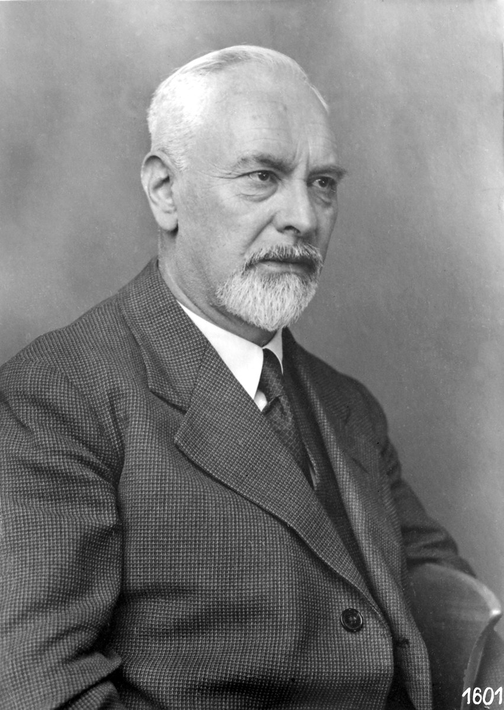

## How to use these slides



::: {.callout-important icon=false}
## Slides = summary, notes = full details
These slides are a **high-level summary** to guide our session. They **do not replace** the detailed [Chapter 4 notes](../notes/ch4.qmd).

To fully grasp the derivations and succeed in this module, you **must study the detailed written notes**.
:::

::: {.notes}
OPENING: Welcome to Chapter 4. Today we are exploring Boundary Layers, a concept that revolutionized fluid mechanics. Over the next 120 minutes, we'll cover the physics, the governing equations, and both exact and approximate mathematical solutions. (Flow separation now comes at the end of the chapter, in Part 2, once we have both laminar and turbulent boundary layers.)

Remind students verbally: Slides = summary, Notes = full details needed for exams.
:::

## Outline

:::: {.columns}
::: {.column width="50%"}
**Part 1 (today): laminar BLs**

- 4.1 Physical characteristics of a BL
- 4.2 Definitions of BL thickness
- 4.3 BL equations & scaling analysis
- 4.4 Blasius' solution
- 4.5 Momentum integral equation
:::
::: {.column width="50%"}
[**Part 2: turbulent BLs & separation**]{style="color:#6b6b6b"}

::: {style="color:#6b6b6b"}
- 4.6–4.8 Turbulent BLs
- 4.9 Transition
- 4.10 Combined laminar/turbulent BLs
- 4.11 Boundary-layer separation
:::
:::
::::

::: {.notes}
The section numbers match the online notes, so students can jump from any slide to the relevant notes section using the 📖 button in the top-right corner.
:::

## Prandtl's breakthrough (1904)

[[📖 Notes §4.1](../notes/ch4.qmd#sec-bl-physical)]{.notes-link}

:::: {.columns}
::: {.column width="27%"}
{height="250px"}

[**Ludwig Prandtl** (1875–1953)]{.smaller}
:::
::: {.column width="73%"}
**A historic advance in fluid mechanics:**

::: {.incremental}
- Prandtl suggested dividing fluid motion around objects into **two distinct regions**.
- **Inner region:** a thin layer close to the surface where frictional (viscous) effects are dominant.
- **Outer region:** where viscous effects may be neglected (frictionless/inviscid flow).
:::
:::
::::

::: {.fragment}
::: {.callout-tip icon=false}
## The boundary layer (BL)
Due to the **no-slip condition**, friction retards the flow, so the velocity increases from zero at the wall to $U_\infty$ across a very thin layer.
:::
:::

::: {.notes}
Before 1904, engineers struggled to reconcile ideal frictionless flow with real-world drag. Prandtl's demarcation solved this by confining the complex viscous math to a very thin layer.
:::

## Internal vs external flows

**Internal (confined) flows:**

- Viscous BLs grow from the containing side walls.
- They eventually meet downstream and fill the entire confining geometry (e.g. pipes, ducts).
- Viscous shear is the dominant effect everywhere downstream.

::: {.fragment}
**External (unconfined) flows:**

- Free to expand no matter how thick the viscous layer grows.
- Examples: aircraft, cars, wind turbines, submarines.
:::

::: {.fragment}
*Our focus in this chapter is primarily on **external flows**.*
:::

::: {.notes}
Link back to Workshop 2 / pipe flow: fully developed pipe flow is exactly the "BLs have merged" limit of an internal flow.
:::

## Boundary-layer growth on a flat plate

{height="430px" fig-align="center"}

[Laminar parallel flow at zero angle of incidence ($\delta/L \ll 1$; BL thickness exaggerated).]{.small}

::: {.notes}
Walk the students through the leading edge, the continuous growth of δ(x), and the shape of the velocity profile u(x,y).
:::

## Shear stress inside the BL

- Outside the BL: $\partial u / \partial y$ is small.
- Inside the BL the frictional shear stress is
  $$ \tau = \mu \frac{\partial u}{\partial y} $$
- Even if the fluid has a small viscosity (high $Re$), $\tau$ is large because the gradient $\partial u / \partial y$ is large.

::: {.fragment}
::: {.callout-tip icon=false}
## Why the split helps
This demarcation vastly simplifies the theory: we analyse the outer flow with inviscid methods (Bernoulli) and the inner flow with the viscous boundary-layer equations.
:::
:::

::: {.notes}
Forward pointer: the BL does not always stay attached to the surface. We return to this (boundary-layer separation) as the final topic of the chapter, in Part 2.
:::

## How do we define the edge of the BL?

[[📖 Notes §4.2](../notes/ch4.qmd#sec-bl-thickness)]{.notes-link}

{height="520px" fig-align="center"}

::: {.notes}
Point out the velocity deficit region. Explain that defining δ is somewhat arbitrary because the velocity approaches U∞ asymptotically.
:::

## Definitions of BL thickness

**1. Nominal thickness, $\delta$:**

- The simplest and most widely used definition.
- The distance from the wall at which $u = 0.99\, U_\infty$.

::: {.fragment}
**2. Displacement thickness, $\delta^*$:**

- The distance the external flow is displaced outwards due to the velocity deficit in the BL:
$$ \delta^* = \int_{0}^{\infty} \left(1 - \frac{u}{U_\infty}\right) dy $$
:::

::: {.notes}
δ* has a clean physical meaning: the mass-flow deficit in the BL equals the flow that would pass through a layer of thickness δ* at speed U∞. Equivalently, the outer inviscid flow "sees" the body thickened by δ*.
:::

## Definitions of BL thickness (cont.) {.smaller}

**3. Momentum thickness, $\theta$:** represents the momentum lost as a consequence of the drag at the surface:
$$ \theta = \int_{0}^{\infty} \left(1 - \frac{u}{U_\infty}\right)\frac{u}{U_\infty}\, dy $$

::: {.fragment}
**Shape factor, $H$:**
$$ H = \frac{\delta^*}{\theta} $$

- Used to discriminate between laminar and turbulent boundary layers.
- Laminar BL: $H \approx 2.6$; turbulent BL: $H \approx 1.3$–$1.4$ (turbulent profiles are "fuller", so $\delta^*$ and $\theta$ are closer together).
:::

::: {.notes}
Note the ordering δ > δ* > θ for any monotonic profile. The momentum thickness is the one that links directly to drag (we will see D = ρU∞²θ(L) per unit width for a flat plate).
:::

## Quick question {.poll}

For the (crude) **linear** profile $u/U_\infty = y/\delta$ (for $y \le \delta$), the shape factor $H = \delta^*/\theta$ is...

1. 1.29
2. 2.0
3. 2.59
4. [3.0]{.fragment .highlight-current-green}

::: {.fragment}
**D.** With $\eta = y/\delta$: $\delta^* = \delta\int_0^1 (1-\eta)\,d\eta = \delta/2$ and $\theta = \delta\int_0^1 \eta(1-\eta)\,d\eta = \delta/6$, so $H = 3$.
:::

::: {.notes}
Peer instruction: one minute to work it out individually, vote, then discuss with a neighbour and re-vote. 1.29 is the turbulent 1/7 power-law value and 2.59 is Blasius — both appear later. The linear profile has the largest H of all the laminar profiles we will compare (see the comparison table at the end of the lecture).
:::

## Simplifying the N–S equations

[[📖 Notes §4.3](../notes/ch4.qmd#sec-bl-equations)]{.notes-link}

{height="300px" fig-align="center"}

- We examine the limiting case of very small viscosity (large $Re$).
- We use scaling arguments ($\epsilon = \delta/L \ll 1$) to reduce the full 2D steady Navier–Stokes equations — **one** order-of-magnitude analysis gives both the BL equations and the size of the BL.

::: {.notes}
Flow past a body of slender cross-section; the BL thickness has been exaggerated to aid understanding. x runs along the surface and y normal to it. Outside the BL the velocities are of the order of U_FS and the flow is essentially the frictionless one.

This is now the single, complete scaling analysis of the chapter: we will get v ~ εU, δ/L ~ Re^(-1/2), ∂p/∂y ≈ 0, and then the wall-shear and drag scalings, all from the same argument.
:::

## Order of magnitude: continuity

Non-dimensional variables (a tilde denotes a non-dimensional quantity), with $\epsilon = \delta/L$:
$$
\tilde{x} = \frac{x}{L} \sim \mathcal{O}(1), \quad \tilde{y} = \frac{y}{L} \sim \mathcal{O}(\epsilon), \quad \tilde{u} = \frac{u}{U_{FS}} \sim \mathcal{O}(1), \quad \tilde{v} = \frac{v}{U_{FS}}
$$

::: {.fragment}
Continuity, $\dfrac{\partial \tilde{u}}{\partial \tilde{x}} + \dfrac{\partial \tilde{v}}{\partial \tilde{y}} = 0$, requires both terms to be the same size:
$$ \frac{\mathcal{O}(1)}{\mathcal{O}(1)} \sim \frac{\mathcal{O}(\tilde{v})}{\mathcal{O}(\epsilon)} \quad\Longrightarrow\quad \tilde{v} \sim \mathcal{O}(\epsilon) $$
The wall-normal velocity $v$ is very small compared with $u$.
:::

::: {.notes}
Inside the BL y only ranges over 0 to δ, so ỹ is of order ε. Pressure is scaled with ρU_FS² and Re = U_FS L/ν.
:::

## Order of magnitude: $x$-momentum

$$
\underbrace{\tilde{u}\frac{\partial \tilde{u}}{\partial \tilde{x}}}_{1} + \underbrace{\tilde{v}\frac{\partial \tilde{u}}{\partial \tilde{y}}}_{\epsilon\cdot\frac{1}{\epsilon}=1} = -\frac{\partial \tilde{p}}{\partial \tilde{x}} + \frac{1}{Re}\Big( \underbrace{\frac{\partial^2 \tilde{u}}{\partial \tilde{x}^2}}_{1} + \underbrace{\frac{\partial^2 \tilde{u}}{\partial \tilde{y}^2}}_{1/\epsilon^2} \Big)
$$

::: {.fragment}
- $\partial^2 \tilde u/\partial \tilde x^2 \ll \partial^2 \tilde u/\partial \tilde y^2$: streamwise diffusion is negligible.
- Inside the BL, viscous and inertia terms **must be of the same order** (otherwise there would be no BL):
:::

::: {.fragment .answer-box}
$$
\frac{1}{Re}\,\frac{1}{\epsilon^2} \sim 1 \quad\Longrightarrow\quad \frac{\delta}{L} \sim \frac{1}{\sqrt{Re_L}}, \qquad Re_L = \frac{U_{FS} L}{\nu}
$$
:::

::: {.notes}
This replaces the old "quick estimate" (inertia ~ viscous force) that used to appear at the start of the chapter: it is the same balance, but now it comes out of the full non-dimensional equations, together with the information about which terms can be dropped.

In dimensional form the balance reads ρU²/L ~ μU/δ², i.e. inertia per unit volume ~ viscous force per unit volume.
:::

## Order of magnitude: $y$-momentum {.smaller}

Following the same procedure for the $y$-momentum equation, all convective and viscous terms are $\mathcal{O}(\epsilon)$, which leaves
$$ \frac{\partial \tilde{p}}{\partial \tilde{y}} \sim \mathcal{O}(\epsilon) \quad\Longrightarrow\quad \frac{\partial p}{\partial y} \approx 0 $$

::: {.fragment}
**The Prandtl boundary-layer assumption:**

- The pressure across the boundary layer is **uniform**: $p = p(x)$ only.
- The pressure within the BL is dictated entirely by the *outer frictionless flow*.
:::

::: {.fragment}
Bernoulli for the steady outer flow, $p + \tfrac{1}{2}\rho U_\infty^2 = \text{const}$, differentiated with respect to $x$:
$$ -\frac{1}{\rho}\frac{dp}{dx} = U_\infty \frac{dU_\infty}{dx} $$
:::

::: {.notes}
Here U∞(x) denotes the velocity of the outer (inviscid) flow just outside the BL; for a flat plate it is constant. The pressure is "impressed" on the BL by the outer flow.
:::

## Scaling: boundary-layer thickness

From $\delta/L \sim Re_L^{-1/2}$ (and applying it at any station $x$):
$$
\delta \sim \sqrt{\frac{\nu x}{U_\infty}} \qquad\Longleftrightarrow\qquad \frac{\delta}{x} \sim \frac{1}{\sqrt{Re_x}}, \quad Re_x = \frac{U_\infty x}{\nu}
$$

::: {.callout-tip icon=false}
## Key insights
- $\delta$ grows proportionally to $\sqrt{x}$ along the plate.
- As $Re \to \infty$ (frictionless limit), $\delta/L \to 0$.
:::

::: {.notes}
The scaling gives the exponent, not the constant. Blasius' exact solution (next section) will give δ/x = 5.0 Re_x^(-1/2).
:::

## Scaling: shear stress and drag {.smaller}

Wall shear stress:
$$ \tau|_{y=0} \sim \mu \frac{U_\infty}{\delta} \sim \mu U_\infty \sqrt{\frac{\rho U_\infty}{\mu L}} = \sqrt{\frac{\mu \rho U_\infty^3}{L}} $$

::: {.fragment}
Total drag on one side of a plate of width $B$ and length $L$:
$$ D \sim B\, L\, \tau|_{y=0} \sim B \sqrt{\rho \mu U_\infty^3 L} $$
:::

::: {.fragment}
Drag coefficient:
$$ C_D = \frac{D}{\tfrac{1}{2}\rho U_\infty^2 B L} \sim \frac{1}{\sqrt{Re_L}} $$
:::

::: {.notes}
Emphasize that doubling the plate length does NOT double the drag (D ∝ L^(1/2)), because the BL gets thicker downstream, reducing the local velocity gradient and thus the local shear stress. Also D ∝ U∞^(3/2).
:::

## Quick question {.poll}

On a flat plate with a laminar BL, station 2 is **four times** further from the leading edge than station 1. Compared with station 1, at station 2...

1. $\delta$ is 4× larger and $\tau_w$ is 4× smaller
2. [$\delta$ is 2× larger and $\tau_w$ is 2× smaller]{.fragment .highlight-current-green}
3. $\delta$ is 2× larger and $\tau_w$ is unchanged
4. $\delta$ is 16× larger and $\tau_w$ is 4× smaller

::: {.fragment}
**B.** $\delta \propto \sqrt{x}$ and $\tau_w \sim \mu U_\infty/\delta \propto x^{-1/2}$.
:::

::: {.notes}
Vote, discuss in pairs, re-vote. Follow-up question: how does the drag on the whole plate change if we make it 4× longer? (Answer: 2× — D ∝ √L.)
:::

## Prandtl's BL equations (steady, 2D)

Reverting to dimensional quantities, we arrive at the simplified system:

::: {.callout-tip icon=false}
## Prandtl's boundary-layer equations
::: {style="font-size:1.25em"}
$$
\begin{aligned}
\text{Continuity:} \quad & \frac{\partial u}{\partial x} + \frac{\partial v}{\partial y} = 0 \\
x\text{-momentum:} \quad & u\frac{\partial u}{\partial x} + v\frac{\partial u}{\partial y} = -\frac{1}{\rho}\frac{dp}{dx} + \nu \frac{\partial^2 u}{\partial y^2}
\end{aligned}
$$
:::
:::

**Boundary conditions:**
$$
y = 0: \; u = 0,\; v = 0 \qquad\quad y \to \infty \;(\text{or } \delta): \; u = U_\infty(x)
$$

::: {.notes}
Emphasize the massive simplifications: We dropped the entire y-momentum equation. The pressure p(x) is no longer an unknown; it is a forced input from the outer flow.

Next we solve these equations exactly for the simplest case: the flat plate (Blasius).
:::

## The flat-plate problem

[[📖 Notes §4.4](../notes/ch4.qmd#sec-blasius)]{.notes-link}

To calculate the viscous drag on a plate of width $b$, we need to integrate the wall shear stress:
$$ D_f = b \int_{0}^{L} \mu \left( \frac{\partial u}{\partial y} \right)_{y=0} dx $$
We must find $u(x,y)$ by integrating the BL equations.

::: {.fragment}
**The Blasius solution (1908):**

- Flow over a thin flat plate.
- Zero pressure gradient: $dp/dx = 0 \implies U_\infty = \text{const}$.
- Exact solution of the BL equations.
:::

::: {.notes}
Blasius was Prandtl's student; this was one of the first applications of the BL equations.
:::

## The similarity variable

Blasius assumed that the dimensionless velocity profile depends only on a scaled wall-normal coordinate.

::: {.callout-tip icon=false}
## Similarity variable $\eta$
::: {style="font-size:1.25em"}
$$ \eta = y \sqrt{\frac{U_\infty}{\nu x}}, \qquad \frac{u}{U_\infty} = f'(\eta) $$
:::
:::

The velocity profile therefore looks identical at any location $x$, provided we scale $y$ by the local BL thickness (since $\delta(x) \propto \sqrt{\nu x / U_\infty}$ — exactly the scaling we found in §4.3).

::: {.notes}
f(η) is a dimensionless stream function, ψ = √(νxU∞) f(η), so that u = ∂ψ/∂y = U∞ f'(η) and continuity is satisfied automatically.
:::

## The Blasius equation

Using the similarity variable, the PDEs transform into a single third-order, nonlinear ordinary differential equation:

::: {.callout-tip icon=false}
## Blasius equation
::: {style="font-size:1.25em"}
$$ f''' + \frac{1}{2}ff'' = 0 $$
with boundary conditions
$$
\eta = 0: \; f = 0,\; f' = 0 \qquad\quad \eta \to \infty: \; f' = 1
$$
:::
:::

This equation is solved numerically (e.g. Howarth, 1938).

::: {.notes}
Three boundary conditions for a third-order ODE, but split between the two ends: this is a boundary-value problem. In practice we "shoot": guess f''(0), integrate outwards, and adjust until f'(∞) = 1. The answer is f''(0) = 0.33206.
:::

## The Blasius numerical solution

[[📖 Notes §4.4](../notes/ch4.qmd#sec-blasius)]{.notes-link}

:::: {.columns}
::: {.column width="52%"}
::: {.small}
| $\eta$ | $f$ | $f'=u/U_\infty$ | $f''$ |
|:--:|:--:|:--:|:--:|
| 0 | 0 | 0 | **0.33206** |
| 0.8 | 0.10611 | 0.26471 | 0.32739 |
| 1.6 | 0.42032 | 0.51676 | 0.29666 |
| 2.4 | 0.92229 | 0.72898 | 0.22809 |
| 3.2 | 1.56909 | 0.87608 | 0.13913 |
| 4.0 | 2.30575 | 0.95552 | 0.06423 |
| 4.8 | 3.08532 | 0.98779 | 0.02187 |
| 5.0 | 3.28327 | **0.99154** | 0.01591 |
| 6.0 | 4.27962 | 0.99897 | 0.00240 |
| 8.0 | 6.27921 | 1.00000 | 0.00001 |
:::
:::
::: {.column width="48%"}
**Reading the table:**

::: {.incremental}
- $f''(0) = 0.33206$ sets the **wall shear stress** (next slide).
- $f' = 0.99$ is reached at $\eta \approx 4.91$, rounded to $5.0$: the **BL thickness** $\delta/x = 5.0\,Re_x^{-1/2}$.
- For large $\eta$, $\eta - f \to 1.7208$: the **displacement thickness** $\delta^*/x = 1.7208\,Re_x^{-1/2}$.
:::

[Full table (every 0.2 in $\eta$) in the notes, §4.4.]{.small}
:::
::::

::: {.notes}
The full table (every 0.2 in η) is in the notes, §4.4, as a collapsible table next to the same interactive plot.

Three things to read off the table:
1. f''(0) = 0.33206 gives the wall shear stress, τ_w = μU∞ √(U∞/νx) f''(0) — this is where the 0.332 on the next slides comes from.
2. f' = 0.99 is reached at η ≈ 4.91, which we round to 5.0: this is δ/x = 5.0 Re_x^(-1/2).
3. For large η, η − f → 1.7208 (e.g. 8 − 6.27921 = 1.72079): this is δ*/x √Re_x, because δ* = √(νx/U∞) ∫(1 − f') dη = √(νx/U∞) [η − f]∞.
:::

## See it: the Blasius solution

::: {.notes}
Live demo. The red curve is u/U∞ = f'(η), solved in the browser by shooting on f''(0); the dashed purple curve is f''(η), proportional to the shear stress across the layer (largest at the wall). Move the probe to read off values and compare with the table on the previous slide.

Later today, come back to this slide and tick the approximate profiles (parabolic, cubic, sine, linear) — these are exactly the profiles we feed into the momentum integral equation, and the readout table gives their δ, δ*, θ, C̄f and H.
:::

## Results from the Blasius solution {.smaller}

From the numerical solution, with $f''(0) = 0.332$:

- Local wall shear stress:
  $$ \tau|_{y=0} = \mu U_\infty \sqrt{\frac{U_\infty}{\nu x}}\, f''(0) = \frac{0.332}{\sqrt{Re_x}}\, \rho U_\infty^2 $$
- Local skin-friction coefficient:
  $$ C_f =\frac{\tau|_{y=0}}{\frac{1}{2}\rho U^2_{\infty}}= \frac{0.664}{\sqrt{Re_x}} $$
- Average skin-friction coefficient over a plate of length $L$:
  $$ \overline{C}_f = \frac{1}{L}\int_0^L C_f\, dx = \frac{1.328}{\sqrt{Re_L}} $$

::: {.notes}
Compare with the scaling analysis: τ_w ∝ x^(-1/2) and C_f ∝ Re^(-1/2) exactly as predicted — the exact solution supplies the constant. The average is twice the local value at x = L because ∫ x^(-1/2) dx = 2 x^(1/2).
:::

## Boundary-layer thicknesses (Blasius) {.smaller}

Using the numerical solution ($f' = 0.99$ at $\eta \approx 4.9 \approx 5.0$), we get exact expressions for the BL dimensions:
$$
\begin{aligned}
\frac{\delta}{x} &= 5.0\, Re_x^{-1/2} \\
\frac{\delta^*}{x} &= 1.7208\, Re_x^{-1/2} \\
\frac{\theta}{x} &= 0.664\, Re_x^{-1/2} \quad \{ = C_f \}
\end{aligned}
$$

::: {.fragment}
**Shape factor:**
$$ H = \frac{\delta^*}{\theta} = \frac{1.7208}{0.664} = 2.59 $$
*Note: all thicknesses grow in proportion to $x^{1/2}$.*
:::

::: {.notes}
θ/x √Re_x = 0.664 is numerically equal to C_f √Re_x: this is no coincidence — for a flat plate the MIE (next section) says dθ/dx = C_f/2, and with θ ∝ x^(1/2), dθ/dx = θ/(2x).
:::

## Worked example: laminar flat plate

Air ($\rho = 1.2$ kg/m³, $\nu = 1.5\times10^{-5}$ m²/s) flows at $U_\infty = 5$ m/s over a smooth flat plate of length $L = 1$ m. Find $\delta$ at the trailing edge and the drag per unit width (one side).

::: {.fragment}
$Re_L = \dfrac{U_\infty L}{\nu} = \dfrac{5 \times 1}{1.5\times10^{-5}} = 3.33\times10^{5}$ (laminar: below $\approx 5\times10^5$)
:::

::: {.fragment}
$\delta(L) = \dfrac{5.0\,L}{\sqrt{Re_L}} = \dfrac{5.0}{577} = 8.7\ \text{mm}, \qquad \overline{C}_f = \dfrac{1.328}{\sqrt{Re_L}} = 2.30\times10^{-3}$
:::

::: {.fragment .answer-box}
$$
\frac{D}{b} = \tfrac{1}{2}\rho U_\infty^2 L\, \overline{C}_f = 0.5 \times 1.2 \times 5^2 \times 1 \times 2.30\times10^{-3} \approx 0.035\ \text{N/m}
$$
:::

::: {.notes}
Let them try each step before revealing. Check: the same answer follows from D/b = ρU∞²θ(L) with θ(L) = 0.664 L/√Re_L = 1.15 mm — a result we will derive in Part 2 from the MIE. Note how thin the BL is: under 1 cm after a metre of plate.
:::

## Moving beyond exact solutions

[[📖 Notes §4.5](../notes/ch4.qmd#sec-mie)]{.notes-link}

- The Blasius solution is exact but applies ONLY to laminar flow over a flat plate ($dp/dx=0$).
- For geometries with pressure gradients, or for **turbulent flow**, exact solutions are generally impossible.
- **Alternative approach:** the momentum integral method.

::: {.fragment}
Instead of satisfying the PDEs for every fluid particle, we integrate the equations across the entire boundary layer ($y=0$ to $y=h$, with $h$ outside the BL) and satisfy the "mean" momentum balance.
:::

::: {.notes}
This is the von Kármán (1921) approach. Same philosophy as a control-volume analysis: we give up the details of the profile and keep only integral quantities such as δ* and θ.
:::

## Deriving the MIE

Integrate the momentum equation (with $-\frac{1}{\rho}\frac{dp}{dx} = U_\infty \frac{dU_\infty}{dx}$) with respect to $y$:
$$ \int_{0}^{h} \left( u\frac{\partial u}{\partial x} + v\frac{\partial u}{\partial y} - U_\infty \frac{dU_\infty}{dx} \right) dy = \int_{0}^{h} \nu \frac{\partial^2 u}{\partial y^2}\, dy $$

::: {.fragment}
- The right-hand side evaluates to $\nu\left[\dfrac{\partial u}{\partial y}\right]_0^h = -\dfrac{\tau|_{y=0}}{\rho}$.
- Using continuity ($v = -\int_0^y \frac{\partial u}{\partial x}\, dy$) and integration by parts, the left-hand side is transformed algebraically into terms involving $\delta^*$ and $\theta$.
:::

::: {.notes}
The full derivation is in the notes (§4.5). Students should be able to reproduce the main steps: substitute v from continuity, integrate the v ∂u/∂y term by parts, and collect terms into the definitions of δ* and θ.
:::

## The momentum integral equation

::: {.callout-tip icon=false}
## Momentum integral equation (MIE)
::: {style="font-size:1.25em"}
$$ \frac{d}{dx}(U_\infty^2 \theta) + \delta^* U_\infty \frac{dU_\infty}{dx} = \frac{\tau|_{y=0}}{\rho} $$
:::
:::

::: {.fragment}
An equivalent form, obtained by expanding the derivative and dividing by $U_\infty^2$:
$$ \frac{d\theta}{dx} + (H+2)\frac{\theta}{U_\infty}\frac{dU_\infty}{dx} = \frac{C_f}{2} $$

**Crucial note:** the MIE is valid for **both laminar and turbulent** boundary layers (using time-averaged values for turbulence).
:::

::: {.notes}
The MIE is exact (no approximation beyond the BL equations themselves); the approximation enters only when we guess the velocity profile.
:::

## Implications of the MIE {.smaller}

Substitute the outer-flow pressure gradient $-\frac{1}{\rho}\frac{dp}{dx} = U_\infty \frac{dU_\infty}{dx}$:
$$ \frac{d\theta}{dx} = \frac{C_f}{2} + \frac{(H+2)}{\rho}\frac{\theta}{U_\infty^2}\frac{dp}{dx} $$

::: {.fragment}
- **Adverse pressure gradient** ($dp/dx > 0$): $\dfrac{d\theta}{dx} > \dfrac{C_f}{2} \implies$ rapid growth of the BL.
- **Favourable pressure gradient** ($dp/dx < 0$): $\dfrac{d\theta}{dx} < \dfrac{C_f}{2} \implies$ slower BL growth.
- **Zero pressure gradient** ($dp/dx = 0$): $\dfrac{d\theta}{dx} = \dfrac{C_f}{2}$.
:::

::: {.notes}
Highlight that turbulent BLs grow faster than laminar ones because the wall shear stress C_f is significantly higher for turbulent flow.

The rapid growth in an adverse pressure gradient is the first hint of separation, which we study at the end of Part 2.
:::

## Using the MIE: approximate solutions

How do we use the MIE for a flat plate ($dp/dx=0$)?
$$ \frac{d\theta}{dx} = \frac{\tau|_{y=0}}{\rho U_\infty^2} $$

**Method:**

1. **Guess** a shape for the velocity profile: $u/U_\infty = f(\eta)$ with $\eta = y/\delta$.
2. Make it satisfy the boundary conditions (e.g. $u=0$ at the wall, $u=U_\infty$ at the edge).
3. Compute $\theta(\delta)$ and $\tau|_{y=0}(\delta)$ from this guessed profile.
4. Substitute into the MIE and solve for $\delta(x)$.

::: {.notes}
Note η here is y/δ — not the Blasius similarity variable. Make this explicit to avoid confusion.
:::

## Example: parabolic profile {.smaller}

Assume a parabolic shape, $\dfrac{u}{U_\infty} = a\eta^2 + b\eta + c$ with $\eta = y/\delta$.

::: {.fragment}
BCs $u(0)=0$, $u(\delta)=U_\infty$, $\partial u/\partial y\,(\delta)=0$ give: $\dfrac{u}{U_\infty} = 2\eta - \eta^2$.
:::

::: {.fragment}
Momentum thickness:
$$ \theta = \delta \int_{0}^{1} (1 - 2\eta + \eta^2)(2\eta - \eta^2)\, d\eta = \frac{2}{15}\delta $$
:::

::: {.fragment}
Wall shear stress:
$$ \tau|_{y=0} = \mu \frac{U_\infty}{\delta} \left[ \frac{d}{d\eta}(2\eta-\eta^2) \right]_{\eta=0} = \frac{2\mu U_\infty}{\delta} $$
:::

::: {.notes}
Three coefficients need three conditions: no slip at the wall, matching U∞ at the edge, and a smooth (zero-gradient) join at the edge.
:::

## Solving for the parabolic profile {.smaller}

Insert these into the MIE ($\frac{d\theta}{dx} = \frac{\tau_w}{\rho U_\infty^2}$):
$$ \frac{d}{dx}\left(\frac{2}{15}\delta\right) = \frac{2\mu U_\infty}{\rho\, \delta\, U_\infty^2} $$

::: {.fragment}
Separate variables and integrate (with $\delta = 0$ at $x = 0$):
$$ \int 2\delta\, d\delta = \int \frac{30\nu}{U_\infty}\, dx \implies \delta^2 = \frac{30\nu x}{U_\infty} $$
:::

::: {.fragment .answer-box}
$$ \frac{\delta}{x} = \frac{\sqrt{30}}{\sqrt{Re_x}} \approx 5.48\, Re_x^{-1/2} $$
:::

::: {.notes}
Remind students that the Blasius exact solution yielded a coefficient of 5.0. 5.48 is a very respectable engineering approximation for just guessing a parabola!
:::

## Comparison of laminar BL profiles

| Profile | $\frac{\delta}{x}Re_x^{1/2}$ | $\frac{\delta^*}{x}Re_x^{1/2}$ | $\frac{\theta}{x}Re_x^{1/2}$ | $\overline{C}_f Re_L^{1/2}$ | $H = \frac{\delta^*}{\theta}$ |
|:--|:--:|:--:|:--:|:--:|:--:|
| **Blasius (exact)** | **5.00** | **1.7208** | **0.664** | **1.328** | **2.59** |
| Parabolic ($2\eta - \eta^2$) | 5.48 | 1.826 | 0.730 | 1.460 | 2.50 |
| Sine ($\sin\frac{\pi \eta}{2}$) | 4.80 | 1.743 | 0.655 | 1.310 | 2.66 |
| Linear ($\eta$) | 3.46 | 1.732 | 0.578 | 1.155 | 3.00 |

: {tbl-colwidths="[30,14,14,14,14,14]"}

- The assumed profiles provide reasonably accurate results quickly.
- Blasius should be used for laminar flat plates, but assuming velocity profiles becomes **vital** for turbulent boundary layers (Part 2).

::: {.notes}
Go back to the Blasius widget ("See it: the Blasius solution") and tick the boxes to overlay the parabolic and sine profiles on the exact solution: the integral quantities are much less sensitive to the guessed shape than δ itself, which is why the method works.
:::

## Part 1: summary

- Prandtl: thin viscous **boundary layer** + inviscid outer flow; $p = p(x)$ is imposed by the outer flow.
- Thicknesses $\delta$, $\delta^*$, $\theta$ and shape factor $H = \delta^*/\theta$.
- One scaling analysis gives the BL equations **and** $\delta/L \sim Re_L^{-1/2}$, $C_f \sim Re^{-1/2}$.
- Blasius (flat plate, laminar): $\delta/x = 5.0\,Re_x^{-1/2}$, $C_f = 0.664\,Re_x^{-1/2}$, $H = 2.59$.
- MIE: $\dfrac{d\theta}{dx} + (H+2)\dfrac{\theta}{U_\infty}\dfrac{dU_\infty}{dx} = \dfrac{C_f}{2}$, valid for laminar **and** turbulent BLs.

**Before next lecture:** try the [Chapter 4 problems](../problems/index.qmd#ch4) on BL thickness, Blasius and the MIE.

::: {.notes}
Next time (Part 2): turbulent boundary layers (structure, log law, power-law analysis with the MIE), transition, combined laminar/turbulent BLs and, finally, boundary-layer separation.
:::

