## Outline



:::: {.columns}
::: {.column width="50%"}
[**Part 1: laminar BLs**]{style="color:#6b6b6b"}

::: {style="color:#6b6b6b"}
- 4.1 Physical characteristics of a BL
- 4.2 Definitions of BL thickness
- 4.3 BL equations & scaling analysis
- 4.4 Blasius' solution
- 4.5 Momentum integral equation
:::
:::
::: {.column width="50%"}
**Part 2 (today): turbulent BLs & separation**

- 4.6 Turbulent BL equations & structure
- 4.7 The law of the wall
- 4.8 Turbulent BL on a flat plate
- 4.9 Transition
- 4.10 Combined laminar/turbulent BLs
- 4.11 Boundary-layer separation
:::
::::

::: {.notes}
OPENING: Welcome back to Chapter 4. Last time we covered the physics of the boundary layer, the governing (Prandtl) equations with the scaling analysis, the exact Blasius solution and the momentum integral equation. Today we move to turbulent boundary layers, transition, combined laminar/turbulent boundary layers and, finally, boundary-layer separation, which brings together everything we have learned about pressure gradients, laminar and turbulent BLs.

Remind students verbally: Slides = summary, Notes = full details needed for exams. The section numbers match the online notes (📖 button, top right).
:::

## Turbulent boundary layers: introduction

[[📖 Notes §4.6](../notes/ch4.qmd#sec-turbulent-bl)]{.notes-link}

**From laminar to turbulent:**

::: {.incremental}
- We can derive BL equations for turbulent flow similar to those for laminar flow.
- Based on Reynolds' ideas, we use the time-averaged N–S equations (RANS).
- RANS introduces normal stresses ($-\rho \overline{u'^2}$) and shear stresses ($-\rho \overline{u'v'}$).
- The key assumption remains: the BL is thin compared to its extent ($\delta/L \ll 1$).
:::

::: {.notes}
Remind students of Chapter 3 where time-averaging was introduced. Emphasize that the "thinness" assumption is what allows us to simplify the N-S equations, just like in the laminar case.
:::

## Turbulent BL equations

Omitting the full derivation (which parallels the laminar case), applying the boundary-layer approximations yields:

::: {.fragment}
::: {.callout-tip icon=false}
## Turbulent BL equations
::: {style="font-size:1.25em"}
$$
\frac{\partial U}{\partial x} + \frac{\partial V}{\partial y} = 0
$$
$$
U\frac{\partial U}{\partial x} + V\frac{\partial U}{\partial y} = -\frac{1}{\rho}\frac{dP_\infty}{dx} + \nu\frac{\partial^2 U}{\partial y^2} - \frac{\partial(\overline{u'v'})}{\partial y}
$$
**Boundary conditions:** at $y=0$: $U=V=0$.
:::
:::
:::

::: {.notes}
Point out the extra term on the right side of the momentum equation. This is the Reynolds shear stress gradient, which is the hallmark of turbulent flow.
:::

## Simplifying the stresses

**Key notes on the derivation:**

::: {.incremental}
- $y$-momentum yields $P(x,y) \approx P_\infty(x) - \rho \overline{v'^2}$: the pressure varies slightly across the BL.
- The $x$-momentum equation then groups the normal stresses: $-\dfrac{\partial}{\partial x}\left(\overline{u'^2} - \overline{v'^2}\right)$.
- We **ignore** this normal-stress gradient term. Why?
- Streamwise gradients ($\partial/\partial x$) are negligibly small compared with wall-normal gradients ($\partial/\partial y$) of the shear stress $\overline{u'v'}$.
:::

::: {.notes}
It is not that the normal stresses are small (u'² actually peaks near the wall); it is their streamwise gradient that is small compared with the wall-normal gradient of u'v'.
:::

## Total shear stress

The last two terms of the momentum equation can be grouped to show the total effective shear stress:

::: {.callout-tip icon=false}
## Combined stresses
::: {style="font-size:1.25em"}
$$
\nu \frac{\partial^2 U}{\partial y^2} - \frac{\partial (\overline{u'v'})}{\partial y} = \frac{1}{\rho}\frac{\partial}{\partial y}\left[\tau_{\text{lam}} + \tau_{\text{turb}}\right]
$$
:::
:::

::: {.fragment}
where we recall
$$
\tau_{\text{lam}} = \mu \frac{\partial U}{\partial y}, \qquad \tau_{\text{turb}} = -\rho\, \overline{u'v'}
$$
:::

::: {.notes}
Make sure they understand that near the wall, lam dominates, but further out, turb dominates. This sets up the structure of the BL.
:::

## Structure of a turbulent BL

:::: {.columns}
::: {.column width="58%"}
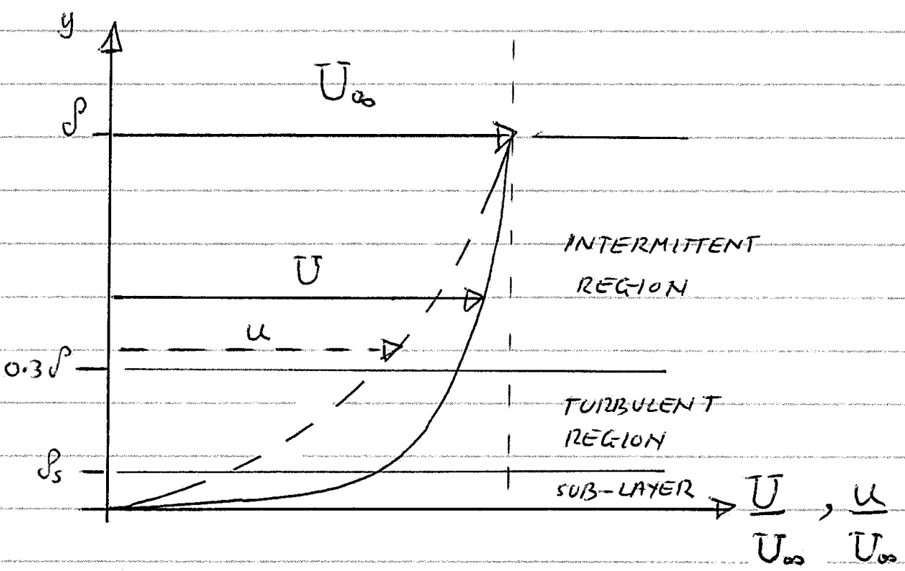{height="330px"}
:::
::: {.column width="42%"}
::: {.small}
**Three distinct regions:**

::: {.incremental}
1. **Laminar sub-layer** (viscous sub-layer): very close to the surface ($y \lesssim 0.003\delta$).
2. **Turbulent region** (log layer): adjacent region ($y \lesssim 0.3\delta$).
3. **Outer intermittent region** (wake region): extending to $\delta$.
:::
:::
:::
::::

::: {.fragment}
::: {.callout-tip icon=false}
## Fuller profile
The turbulent profile is significantly fuller and blunter than the laminar one: a direct result of enhanced momentum mixing.
:::
:::

::: {.notes}
Solid line: turbulent mean velocity profile U/U∞; dashed: a typical laminar profile u/U∞ for comparison. The viscous sub-layer is extremely thin (δ_s ≈ 0.003δ), yet it is where most of the velocity change takes place. Same picture as turbulent pipe flow in Chapter 3.
:::

## Near the wall: governing equations

[[📖 Notes §4.7](../notes/ch4.qmd#sec-log-law)]{.notes-link}

For a zero-pressure-gradient flat plate, close to the surface: $\;\partial U/\partial x \approx 0$, $\;dP/dx \approx dP_\infty/dx = 0$, $\;V \approx 0$.

::: {.fragment}
Applying these to the BL momentum equation (multiplied by $\rho$):
$$
\require{cancel}
\rho\, \cancelto{0}{U\frac{\partial U}{\partial x}} + \rho\, \cancelto{0}{V\frac{\partial U}{\partial y}} = -\cancelto{0}{\frac{dP_\infty}{dx}} + \mu\frac{\partial^2 U}{\partial y^2} - \rho\frac{\partial(\overline{u'v'})}{\partial y}
$$
:::

::: {.fragment}
Integrating with respect to $y$ gives a **constant total shear stress**:

::: {.answer-box}
$$
\mu \frac{\partial U}{\partial y} - \rho\, \overline{u'v'} = \text{constant} = \tau|_{y=0}
$$
:::
:::

::: {.notes}
The total (laminar + turbulent) shear stress is constant across the near-wall region and equal to its value at the wall. Both the viscous sub-layer and the log law follow from this one result.
:::

## 1. The viscous sub-layer ($0 < y < \delta_s$)

In the viscous sub-layer the turbulent fluctuations vanish ($u', v' \to 0$), so $\tau_{\text{lam}} \gg \tau_{\text{turb}}$.

::: {.fragment}
Viscosity dominates:
$$
\tau \simeq \tau|_{y=0} = \mu \left(\frac{\partial U}{\partial y}\right)_{y=0} \quad\Longrightarrow\quad \frac{\partial U}{\partial y} = \text{constant}
$$
:::

::: {.fragment}
Integrating (with $U = 0$ at $y = 0$) gives a **linear profile**:
$$
U = \frac{\tau|_{y=0}}{\rho \nu}\, y
$$
:::

::: {.notes}
ρν = μ, so this is just τ_w = μ U/y: a Couette-like linear profile, very close to the wall.
:::

## Non-dimensionalising: $u^+$ and $y^+$

We define a **wall friction velocity**: $\;u_\tau = \sqrt{\tau|_{y=0}/\rho}$

*Note: do not confuse $u_\tau$ (a velocity) with $\mu_t$ (the eddy viscosity)!*

::: {.fragment}
Substituting $u_\tau$ into the linear profile gives the non-dimensional law of the wall for the sub-layer:

::: {.callout-tip icon=false}
## Viscous sub-layer
::: {style="font-size:1.25em"}
$$
u^+ = y^+, \qquad u^+ = \frac{U}{u_\tau}, \quad y^+ = \frac{u_\tau y}{\nu}
$$
:::
:::

$y^+$ is essentially a local Reynolds number. In practice $u^+ = y^+$ holds for $y^+ \lesssim 5$.
:::

::: {.notes}
U = τ_w y/(ρν) = u_τ² y/ν, so U/u_τ = u_τ y/ν. The quantity ν/u_τ is the viscous length scale: y⁺ measures the distance from the wall in units of it.
:::

## 2. The turbulent region (log layer)

In the region $\delta_s < y < 0.3\delta$ the turbulent fluctuations grow rapidly: $-\rho\overline{u'v'}$ dominates ($\tau_{\text{turb}} \gg \tau_{\text{lam}}$).

::: {.fragment}
The relationship generalises to $u^+ = f(y^+)$. Experiments and theory show that it takes a logarithmic form:

::: {.callout-tip icon=false}
## The law of the wall (log law)
::: {style="font-size:1.25em"}
$$
\frac{U}{u_\tau} = \frac{1}{\kappa} \ln\left(\frac{u_\tau y}{\nu}\right) + C, \qquad\text{or}\qquad u^+ = \frac{1}{\kappa} \ln(y^+) + C
$$
:::
:::
:::

::: {.fragment}
Experiments suggest the **von Kármán constant** $\kappa \approx 0.4$ and $C \approx 5.2$; valid for roughly $30 \lesssim y^+$ up to $y \approx 0.2$–$0.3\,\delta$.
:::

::: {.notes}
Between the viscous sub-layer and the log layer there is a blending region, the buffer layer (5 ≲ y⁺ ≲ 30), where laminar and turbulent stresses are comparable. κ = 0.41, C = 5.0 are also widely used.
:::

## The near-wall profile in wall units

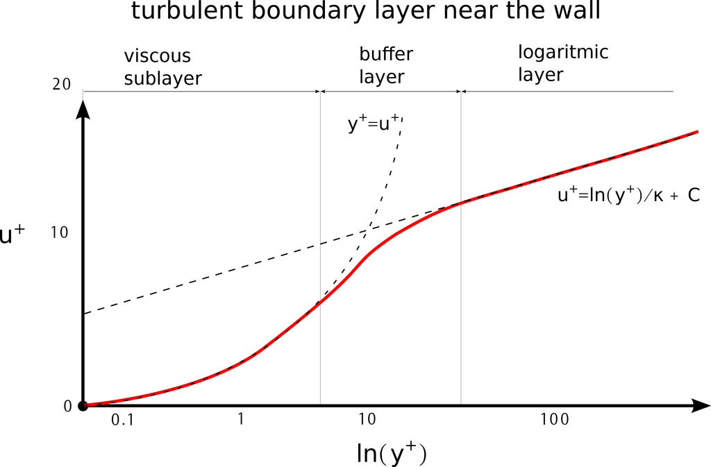{height="520px" fig-align="center"}

[Near-wall detail of a turbulent BL ($y^+$ on a log scale). Adapted from CFD Support.]{.small}

::: {.notes}
Point out the three ranges on the log axis: linear sub-layer (y⁺ < 5, which looks curved on a log axis), buffer layer (5–30) and the straight log-law line beyond y⁺ ≈ 30.
:::

## Log law from the mixing-length model

:::: {.columns}
::: {.column width="42%"}
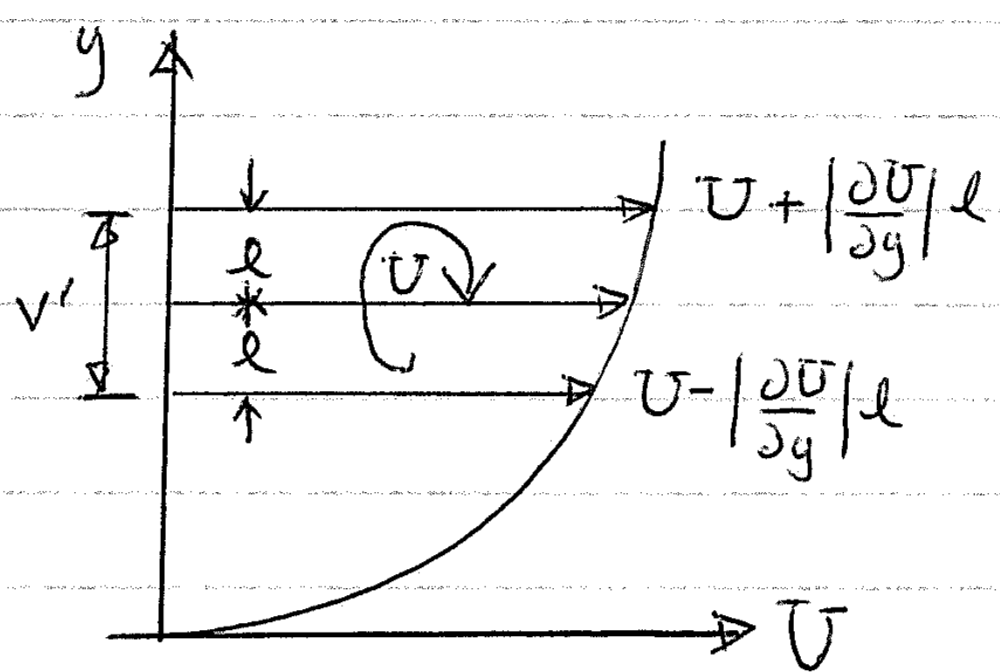{height="200px"}
:::
::: {.column width="58%"}
Prandtl's mixing-length model (MLM):

::: {.incremental}
- Eddy size $\propto$ wall distance: $l_m = \kappa y$.
- Shear stress roughly constant, $\tau \approx \tau|_{y=0}$:
  $\;\tau|_{y=0} = \rho\, l_m^2 \left(\dfrac{\partial U}{\partial y}\right)^2$
:::
:::
::::

::: {.fragment}
Substituting $l_m = \kappa y$ and $u_\tau = \sqrt{\tau|_{y=0}/\rho}$ recovers the log law exactly:
$$
\frac{1}{u_\tau} \frac{\partial U}{\partial y} = \frac{1}{\kappa y} \;\Longrightarrow\; \frac{U}{u_\tau} = \frac{1}{\kappa}\ln y + C_1, \quad C_1 = -\frac{1}{\kappa}\ln\frac{\nu}{u_\tau} + C
$$
:::

::: {.notes}
The mixing-length model was introduced in Chapter 3. Near the wall the eddies cannot be larger than their distance from the wall, so l_m ∝ y is a natural choice; the constant of proportionality is the von Kármán constant.
:::

## The full turbulent BL profile

{height="520px" fig-align="center"}

[Inner region (viscous sub-layer and log layer) and outer (defect) region. Adapted from CFD Support.]{.small}

::: {.notes}
Mention to the students that these curves form the basis of "Wall Functions" used in commercial CFD software.
:::

## 3. The outer intermittent region ($y \gtrsim 0.3\delta$)

- Also known as the **wake region** or **defect layer**.
- Characterised by a highly irregular, time-varying interface between the turbulent BL fluid and the (nearly irrotational) outer flow.

::: {.fragment}
- Viscosity ($\nu$) effects are negligible here; large eddies dominate.
:::

::: {.notes}
A fixed probe in the outer region alternately sees turbulent and non-turbulent fluid; the intermittency factor γ(y) is the fraction of time the flow at height y is turbulent (details in the notes). The fluctuating interface entrains outer fluid, which is how the BL grows.
:::

## The velocity defect law

Instead of the absolute velocity $U$, we analyse the **velocity deficit** $(U_\infty - U)$.

::: {.fragment}
Applying dimensional analysis:
$$
\frac{U_\infty - U}{u_\tau} = g\left(\frac{y}{\delta}\right)
$$
:::

::: {.fragment}
Where the outer region meets the log layer, it takes the form:

::: {.callout-tip icon=false}
## Velocity defect law
::: {style="font-size:1.25em"}
$$
\frac{U_\infty - U}{u_\tau} = -\frac{1}{\kappa} \ln\left(\frac{y}{\delta}\right) + B
$$
with $B$ a constant (different from $C$ in the log law).
:::
:::
:::

::: {.notes}
Explain that δ used here is the nominal thickness (≈ 0.99U∞) because it represents the physical boundary of the turbulent zone.

Far from the wall viscosity drops out, so ν cannot appear: the deficit depends on y/δ, not on y⁺.
:::

## Quick question {.poll}

A turbulent BL in air ($\nu = 1.5\times10^{-5}$ m²/s) has a friction velocity $u_\tau = 0.75$ m/s. The viscous sub-layer ($y^+ \lesssim 5$) is about...

1. 0.01 mm thick
2. [0.1 mm thick]{.fragment .highlight-current-green}
3. 1 mm thick
4. 1 cm thick

::: {.fragment}
**B.** $y = 5\nu/u_\tau = 5 \times 1.5\times10^{-5}/0.75 = 1\times10^{-4}$ m $= 0.1$ mm: a tiny fraction of a BL that is typically several centimetres thick.
:::

::: {.notes}
Peer instruction: vote individually, discuss with a neighbour for a minute, vote again. Follow-up: in water with the same u_τ, the sub-layer would be about 15 times thinner (ν is 15 times smaller). Link to CFD: a mesh that resolves the sub-layer needs its first cell at y⁺ ≈ 1 (here 0.02 mm); wall functions allow y⁺ ≈ 30 or more.
:::

## Turbulent BL on a flat plate: the challenge

[[📖 Notes §4.8](../notes/ch4.qmd#sec-turbulent-flat-plate)]{.notes-link}

::: {.incremental}
1. The 3 regions have no single, continuous analytical velocity profile.
2. The turbulent BL equations have **no analytical solutions** (even for $dP_\infty/dx = 0$, unlike the laminar Blasius solution).
3. The momentum integral equation (MIE) is valid, *if* we specify the velocity profile $U(y)$ and $\tau|_{y=0}$ correctly.
:::

::: {.fragment}
**Solution:** use experimental observation.
:::

::: {.notes}
Point (3) is the way forward: we used it already for laminar BLs with assumed profiles. Experiments show a simple power law fits a turbulent BL profile well.
:::

## The power-law profile

:::: {.columns}
::: {.column width="45%"}
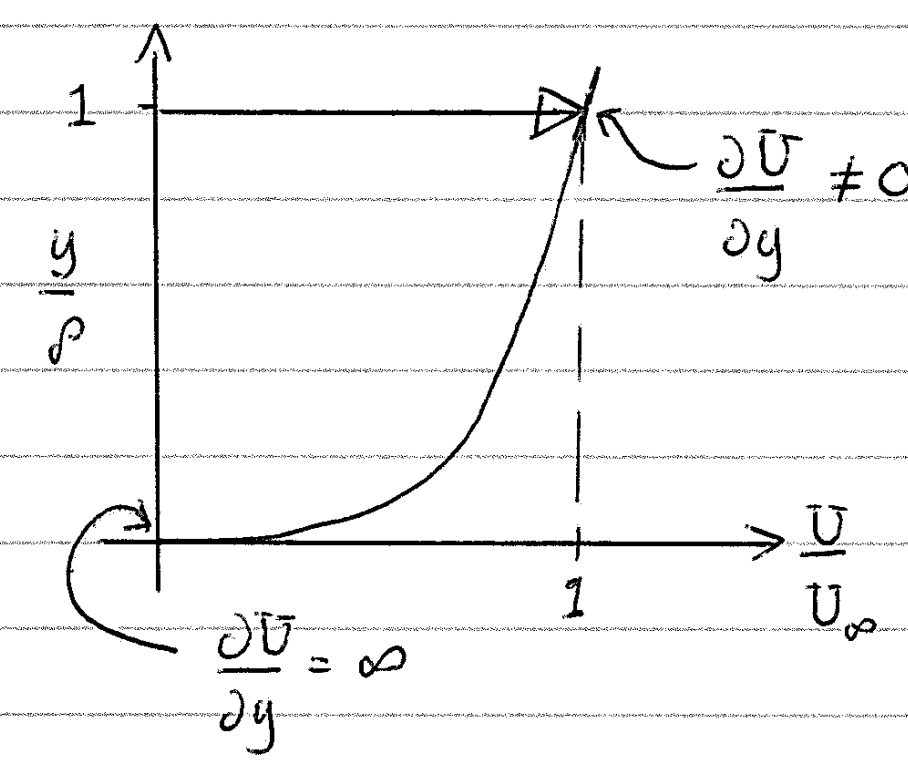{height="330px"}
:::
::: {.column width="55%"}
We adopt the empirical profile:
$$
\frac{U}{U_\infty} = \left(\frac{y}{\delta}\right)^n
$$

::: {.incremental}
- Typically $n = 1/7$.
- **Flaws:** it fails at $y=0$ ($\partial U/\partial y = \infty$) and at $y=\delta$ ($\partial U/\partial y \neq 0$).
:::
:::
::::

::: {.fragment}
Despite these flaws, it is excellent for integrating across the BL in the MIE.
:::

::: {.notes}
The integrals θ and δ* are insensitive to the local details at y = 0 and y = δ, which is why the power law works well in the MIE even though it gives an infinite wall shear stress.
:::

## Applying the MIE: integral thicknesses

For a zero-pressure-gradient flow, the MIE reduces to:
$$
\frac{d\theta}{dx} = \frac{C_f}{2} = \frac{\tau|_{y=0}}{\rho U_\infty^2}
$$

::: {.fragment}
To solve this, substitute the power-law profile $U/U_\infty = (y/\delta)^n$ into:
:::

::: {.incremental}
- **Momentum thickness:** $\displaystyle \theta = \int_0^\delta \frac{U}{U_\infty} \left(1 - \frac{U}{U_\infty}\right) dy = \frac{n}{(n+1)(2n+1)}\,\delta$
- **Displacement thickness:** $\displaystyle \delta^* = \int_0^\delta \left(1 - \frac{U}{U_\infty}\right) dy = \frac{n}{n+1}\,\delta$
:::

::: {.fragment}
*Evaluating these integrals algebraically gives the results for any chosen value of $n$!*
:::

::: {.notes}
With z = y/δ: θ/δ = ∫(zⁿ − z²ⁿ) dz = 1/(n+1) − 1/(2n+1) = n/[(n+1)(2n+1)], and δ*/δ = 1 − 1/(n+1) = n/(n+1). Hence H = 2n + 1.
:::

## The 1/7th power-law results

::: {.callout-tip icon=false}
## Integral properties ($n = 1/7$)
::: {style="font-size:1.25em"}
$$
\theta = \frac{7}{72}\,\delta, \qquad \delta^* = \frac{1}{8}\,\delta, \qquad H = \frac{\delta^*}{\theta} = \frac{9}{7} \approx 1.29
$$
:::
:::

::: {.fragment}
*Comparison:* recall that for a laminar BL (Blasius) $H = 2.59$. The lower $H$ in turbulent flows reflects the fuller velocity profile.
:::

::: {.notes}
H = 2n + 1 = 9/7 = 1.286. Measured shape factors of zero-pressure-gradient turbulent BLs are about 1.3–1.4. The shape factor is a quick diagnostic: a BL with H ≈ 2.6 is laminar, one with H ≈ 1.3–1.4 is turbulent.
:::

## Finding the wall shear stress ($C_f$)

**The problem:** the power law gives $\tau|_{y=0} = \infty$. We need a valid alternative for the surface shear stress.

::: {.fragment}
**The fix:** an empirical analogy with the Blasius smooth-pipe formula ($U_{mean} \approx 0.8\,U_\infty$, pipe radius $\approx \delta$):

::: {.callout-tip icon=false}
## Local skin friction
::: {style="font-size:1.25em"}
$$
C_f = 0.045 \left(\frac{U_\infty \delta}{\nu}\right)^{-1/4}
$$
:::
:::
:::

::: {.fragment}
**Ready!** Both pieces needed for the MIE ($d\theta/dx = C_f/2$): $\;\theta = f(\delta)$ *(profile integration)* and $C_f = f(\delta)$ *(pipe analogy)*.
:::

::: {.notes}
Pipe: τ_w/(½ρU_mean²) = 0.079 (U_mean d/ν)^(-1/4). With U_mean = 0.8U∞ and d = 2δ: C_f = 0.079 × 0.8² × 1.6^(-1/4) (U∞δ/ν)^(-1/4) = 0.045 (U∞δ/ν)^(-1/4). Full derivation in the notes, §4.8.
:::

## Solving for the BL growth ($\delta$)

Substitute $\theta = \frac{7}{72}\delta$ and $C_f$ into the MIE ($\frac{d\theta}{dx} = \frac{C_f}{2}$):
$$
\frac{7}{72}\frac{d\delta}{dx} = \frac{0.045}{2}\left(\frac{U_\infty \delta}{\nu}\right)^{-1/4}
$$

::: {.fragment}
Separate variables: $\quad \displaystyle \delta^{1/4}\, d\delta = 0.0225 \times \frac{72}{7} \left(\frac{U_\infty}{\nu}\right)^{-1/4} dx$
:::

::: {.fragment}
Integrate and apply the boundary condition ($\delta = 0$ at $x = 0$):

::: {.answer-box}
$$
\frac{\delta}{x} = \left(1.25 \times 0.0225 \times \frac{72}{7}\right)^{4/5} Re_x^{-1/5} = 0.3707\, Re_x^{-1/5}
$$
:::
:::

::: {.notes}
Integration gives δ^(5/4)/1.25 = 0.0225 × (72/7) (U∞/ν)^(-1/4) x. Dividing by x^(5/4) and raising to the power 4/5 gives the result.
:::

## Turbulent flat-plate relations

::: {.callout-tip icon=false}
## Turbulent BL over a flat plate (1/7 power law)
::: {style="font-size:1.25em"}
$$
\begin{aligned}
\frac{\delta}{x} &= 0.3707\, Re_x^{-1/5} \\
\frac{\delta^*}{x} &= 0.0463\, Re_x^{-1/5} \\
\frac{\theta}{x} &= 0.0360\, Re_x^{-1/5} \qquad && \color{#2b6cb0}{\xrightarrow{\text{exp.}} \quad \mathbf{0.0370\, Re_x^{-1/5}}} \\
\overline{C}_f &= 0.0721\, Re_L^{-1/5} && \color{#2b6cb0}{\xrightarrow{\text{exp.}} \quad \mathbf{0.0740\, Re_L^{-1/5}}} \\
H &= 1.29 && \color{#2b6cb0}{\xrightarrow{\text{exp.}} \quad \mathbf{\approx 1.3\text{–}1.4}}
\end{aligned}
$$
:::
:::

::: {.fragment}
$\delta \propto x^{4/5}$ for **turbulent** BLs: they grow faster than **laminar** BLs ($\delta \propto x^{1/2}$).
:::

::: {.notes}
The blue values are the experimentally determined ones; use them for practical engineering calculations. Note C̄f = 2θ(L)/L in each column, because for a flat plate the drag equals the momentum lost (D = ρU∞²θ(L)).

The local skin-friction coefficient is C_f = 0.0577 Re_x^(-1/5) (substitute δ/x into the C_f formula); averaging over the plate multiplies it by 5/4.
:::

## Worked example: turbulent flat plate

A plate of length $L = 3$ m is placed in air ($\rho = 1.2$ kg/m³, $\nu = 1.5\times10^{-5}$ m²/s) at $U_\infty = 20$ m/s. A trip wire makes the BL turbulent from $x = 0$. Find $\delta(L)$ and the friction drag per unit width (one side).

::: {.fragment}
$Re_L = \dfrac{20 \times 3}{1.5\times10^{-5}} = 4\times10^6, \qquad Re_L^{-1/5} = 0.0479$
:::

::: {.fragment}
$\delta(L) = 0.3707 \times 3 \times 0.0479 = 53\ \text{mm} \qquad \overline{C}_f = 0.0740 \times 0.0479 = 3.54\times10^{-3}$ (experimental fit)
:::

::: {.fragment .answer-box}
$$
\frac{D}{b} = \overline{C}_f\, \tfrac{1}{2}\rho U_\infty^2 L = 3.54\times10^{-3} \times 240 \times 3 \approx 2.55\ \text{N/m}
$$
:::

::: {.notes}
Let them try each step first. With the power-law coefficient 0.0721 instead: C̄f = 3.45×10⁻³ and D = 2.48 N/m (= ρU∞²θ(L) with θ(L) = 5.16 mm).

Comparison: a laminar BL would have δ = 5.0 L Re_L^(-1/2) = 7.5 mm and C̄f = 0.66×10⁻³ — the turbulent BL is about 7 times thicker and has about 5 times the friction drag.
:::

## Boundary-layer transition

[[📖 Notes §4.9](../notes/ch4.qmd#sec-transition)]{.notes-link}

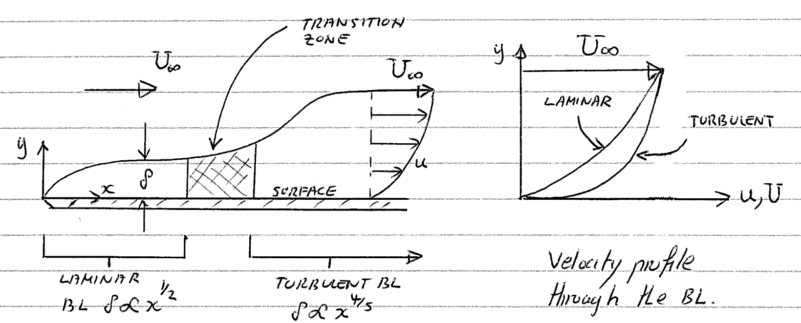{height="380px" fig-align="center"}

As a BL grows, it can become unstable. Turbulent spots form, merge, and cause transition over a finite length, at $Re_x \approx 3$–$5\times 10^5$ on a smooth flat plate.

::: {.notes}
Laminar BL (δ ∝ x^(1/2)), transition zone, turbulent BL (δ ∝ x^(4/5)). The critical Reynolds number is based on the distance from the leading edge, Re_x = U∞x/ν. For hand calculations we usually assume a single, sudden transition at Re_cr = 5×10⁵.
:::

## Mechanisms of transition

Transition can occur via several distinct paths:

::: {.incremental}
- **Natural:** slow instability growth (smooth surfaces, low freestream turbulence).
- **Large disturbance:** rapid breakdown caused by surface roughness or sudden geometry changes.
- **Bypass:** high freestream turbulence "bypasses" the slow natural instability waves.
- **Separation bubble:** adverse pressure gradient causes laminar separation $\to$ transition in the separated shear layer $\to$ turbulent reattachment.
:::

::: {.notes}
Lecturer notes:

- Natural: mention Tollmien–Schlichting (T-S) waves. These are linear instability waves that slowly amplify until they break down into turbulence.
- Large disturbance: this is often intentional in engineering! We "trip" the boundary layer using vortex generators or grit to force turbulence and prevent massive separation.
- Bypass: common in turbomachinery (jet engines) where the incoming flow from upstream blade rows is already highly chaotic. It skips the T-S wave phase entirely.
- Separation bubble: very common on low-Reynolds-number wings (like gliders or drones). The laminar layer separates, becomes turbulent while detached, and the extra mixing energy causes it to reattach to the surface.
:::

## Factors favouring transition

Transition is more likely to occur with:

- increasing Reynolds number ($Re$)
- surface roughness
- high freestream turbulence
- adverse pressure gradient ($dp/dx > 0$)

::: {.fragment}
::: {.callout-important icon=false}
## Crucial distinction
While transition can occur in a *favourable* pressure gradient, boundary-layer separation strictly **requires** an *adverse* pressure gradient.
:::
:::

::: {.notes}
Lecturer notes:

- Reynolds number: the higher the Re, the stronger the inertial forces compared to viscous damping. Viscosity is what keeps the flow "in line". Once Re gets too high, disturbances aren't damped out any more.
- The crucial distinction: really hammer this point home for the students. Transition is just the flow changing its state (from orderly to chaotic) — this can happen even when the flow is accelerating (favourable pressure gradient) if the surface is rough enough.
- Separation, however, is a failure of the near-wall momentum balance. The fluid particles near the wall literally run out of momentum and are pushed backward. This cannot happen unless there is a high-pressure zone ahead pushing back against them (adverse dp/dx). We prove this at the end of today's lecture.
:::

## Combined laminar and turbulent BLs

[[📖 Notes §4.10](../notes/ch4.qmd#sec-combined-bl)]{.notes-link}

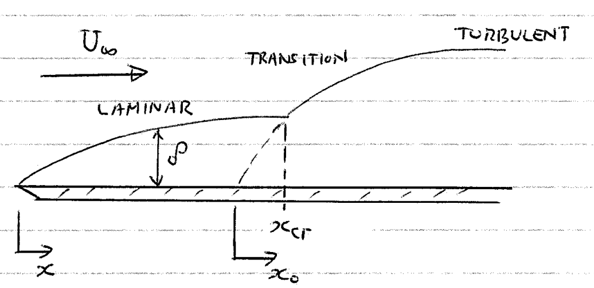{height="360px" fig-align="center"}

Real engineering surfaces often feature a laminar region up to $x_{cr}$, followed by a turbulent region that grows as if it had started from a **virtual origin** $x_0$.

::: {.notes}
x is always measured from the physical leading edge. The virtual origin x₀ lies upstream of the transition point x_cr (between the leading edge and x_cr).
:::

## Combined boundary layers

::: {.incremental}
- **Laminar section** ($x = 0 \to x_{cr}$): $\quad \dfrac{\theta(x)}{x} = 0.664\, Re_x^{-1/2}$
- **Turbulent section** ($x > x_{cr}$): $\quad \dfrac{\theta(x)}{x - x_0} = 0.037\, Re_{x - x_0}^{-1/5}, \qquad Re_{x-x_0} = \dfrac{U_\infty (x - x_0)}{\nu}$
:::

::: {.fragment}
::: {.callout-important icon=false}
## The question
How do we link these two formulas and find the virtual origin $x_0$ for a given $x_{cr}$?
:::
:::

::: {.notes}
Lecturer notes:

- Use the figure (previous slide) to explicitly point out that the turbulent boundary layer is "thicker" and grows faster.
- Emphasize the question in the block: we have two completely different algebraic curves that we need to stitch together at the transition point x_cr. How do we force them to match? (This sets up the θ continuity condition on the next slide.)
:::

## Method of solution (virtual origin)

**Core condition:** the momentum thickness $\theta$ must be continuous: $\;\theta_{\text{LAM}} = \theta_{\text{TURB}}$ at $x = x_{cr}$.

::: {.fragment}
**Step 1:** laminar $\theta_{cr}$ exactly at transition: $\quad \theta_{cr} = 0.664\, x_{cr}\, Re_{cr}^{-1/2}$
:::

::: {.fragment}
**Step 2:** find the virtual origin $x_0$ by equating $\theta_{cr}$ to the turbulent formula:
$$
\theta_{cr} = 0.037\, (x_{cr} - x_0) \left[ \frac{\rho U_\infty (x_{cr} - x_0)}{\mu} \right]^{-1/5}
\;\Longrightarrow\;
\frac{U_\infty (x_{cr} - x_0)}{\nu} = \left(\frac{Re_{\theta,cr}}{0.037}\right)^{5/4}
$$
:::

::: {.fragment}
**Step 3:** turbulent $\theta$ at any downstream position ($x > x_{cr}$):
$$
\theta(x) = 0.037\, (x - x_0) \left[ \frac{\rho U_\infty (x - x_0)}{\mu} \right]^{-1/5}
$$
:::

::: {.notes}
Lecturer notes — the physics of the transition point:

- Explain why θ is continuous: the accumulated drag on the plate cannot change instantaneously, because that would require an infinite point-force.
- Even though the velocity profile drastically changes shape, the total momentum deficit right at the end of the laminar zone must equal the momentum deficit at the very start of the turbulent zone.

Re_θ,cr = U∞θ_cr/ν. The same effective length (x − x₀) must be used in ALL the turbulent formulas (δ, δ*, C_f).
:::

## Total drag: method 1 (piecewise summation)

Total drag (per unit width) combines the laminar and turbulent zones: $\; D_{\text{total}} = D_{\text{LAM}} + D_{\text{TURB}}$

::: {.fragment}
**1. Laminar region ($0 \to x_{cr}$):** momentum deficit at transition:
$$ D_{\text{LAM}} = \rho U_\infty^2\, \theta(x_{cr}) $$
:::

::: {.fragment}
**2. Turbulent region ($x_{cr} \to L$):** additional momentum deficit from $x_{cr}$ to $L$:
$$ D_{\text{TURB}} = \rho U_\infty^2 \left[ \theta(L) - \theta(x_{cr}) \right] $$
[Use the effective length $(x - x_0)$ for the turbulent $\theta$.]{.small}
:::

::: {.fragment}
::: {.callout-important icon=false}
## The mathematical catch
The $\theta(x_{cr})$ terms cancel: $\; D_{\text{total}} = \rho U_\infty^2\, \theta(L)$
:::
:::

::: {.notes}
D_LAM can equally be written C̄f,LAM × ½ρU∞² x_cr with C̄f,LAM = 1.328 Re_cr^(-1/2): it is the same number.
:::

## Total drag: method 2 (the MIE shortcut)

**From the MIE** (flat plate, per unit width):
$$
\require{cancel}
\begin{aligned}
D &= \int_0^L \tau|_{y=0}\, dx = \rho U_\infty^2\int_0^L \frac{C_f}{2}\, dx \\
  &= \rho U_\infty^2 \int_0^L \frac{d\theta}{dx}\, dx = \rho U_\infty^2 \left[ \theta(L) - \cancelto{0}{\theta(0)} \right]
\end{aligned}
$$

::: {.fragment}
::: {.callout-tip icon=false}
## Total drag = trailing-edge momentum loss
::: {style="font-size:1.25em"}
$$
D_{\text{total}} = \rho U_\infty^2\, \theta\big|_{x=L}
$$
:::
:::
:::

::: {.notes}
Why it works: because θ is continuous at transition, θ(L) already "contains" the drag history of the laminar region. Requirement: use the effective length (L − x₀) in the turbulent formula for θ(L).
:::

## Worked example: combined BL

Same plate, **no** trip wire; sudden transition at $Re_{cr} = 5\times10^5$. Find $x_0$ and the drag per unit width.

::: {.fragment}
**1.** $x_{cr} = Re_{cr}\,\nu/U_\infty = 0.375$ m, $\;\; \theta_{cr} = 0.664 \times 0.375/\sqrt{5\times10^5} = 0.352$ mm, $\;\; Re_{\theta,cr} = U_\infty\theta_{cr}/\nu = 470$
:::

::: {.fragment}
**2.** $\dfrac{U_\infty(x_{cr}-x_0)}{\nu} = \left(\dfrac{470}{0.037}\right)^{5/4} = 1.35\times10^5 \;\Rightarrow\; x_{cr}-x_0 = 0.101$ m, $\quad x_0 = 0.274$ m
:::

::: {.fragment}
**3.** $L - x_0 = 2.726$ m, $\; Re_{L-x_0} = 3.63\times10^6$: $\quad \theta(L) = 0.037 \times 2.726 \times (3.63\times10^6)^{-1/5} = 4.92$ mm
:::

::: {.fragment .answer-box}
$$
D_{\text{total}} = \rho U_\infty^2\, \theta(L) = 1.2 \times 20^2 \times 4.92\times10^{-3} \approx 2.36\ \text{N/m}
$$
:::

::: {.notes}
Check with method 1: D_LAM = ρU∞²θ_cr = 480 × 0.352×10⁻³ = 0.169 N/m; D_TURB = 480 × (4.92 − 0.352)×10⁻³ = 2.19 N/m; total 2.36 N/m.

Compared with the fully turbulent plate (2.55 N/m, previous example): only 12.5% of the plate is laminar, and the drag saving is about 7%.
:::

## See it: the virtual origin

::: {.notes}
Live demo with the numbers of the worked example (air, U∞ = 20 m/s, L = 3 m, Re_cr = 5×10⁵). Move Re_cr: the virtual origin moves and the drag changes. Switch the plot to θ: θ is continuous at transition while δ jumps, because the shape of the profile (and hence H) changes.
:::

## Boundary-layer separation

[[📖 Notes §4.11](../notes/ch4.qmd#sec-separation)]{.notes-link}

**Does the BL always adhere to the surface?** [No.]{.fragment}

::: {.fragment}
- In some cases the BL thickens considerably, and the flow within the BL reverses.
- Decelerated fluid elements are forced outwards.
- The BL becomes detached from the wall: **boundary-layer separation (BLS)**.
- Results in the formation of vortices and large energy losses (wakes).
:::

::: {.notes}
We now bring together everything about pressure gradients: the MIE told us an adverse pressure gradient makes the BL grow rapidly; here we see where that leads. Plan for this last section: what separation does (bluff bodies, cylinder), why it happens (adverse pressure gradient), how to predict it (wall shear stress = 0, inflection point), and why turbulent BLs resist it.
:::

## Flow regimes past a cylinder

:::: {.columns}
::: {.column width="33%"}
{height="150px" fig-align="center"}

::: {.small}
**(a) $Re < 1$:** symmetric (Stokes flow). Streamlines hug the body tightly. No separation.
:::
:::
::: {.column width="33%"}
{height="150px" fig-align="center"}

::: {.small}
**(b) $5 < Re < 40$:** the flow separates; a steady pair of vortices sits behind the cylinder. Instability observed at $Re \approx 40$.
:::
:::
::: {.column width="33%"}
{height="150px" fig-align="center"}

::: {.small}
**(c) $100 < Re < 200$:** periodic shedding of vortices (**von Kármán vortex street**). The wake becomes increasingly turbulent beyond $Re \approx 200$.
:::
:::
::::

[$Re = U_\infty d/\nu$, based on the cylinder diameter $d$.]{.small}

::: {.notes}
Mention that BLS is common in bluff bodies, causing large deviations in pressure distribution from ideal fluid models, which explains massive pressure drag.

Beyond Re ≈ 200 the wake becomes three-dimensional and increasingly turbulent, while the BL on the cylinder itself stays laminar up to Re ~ 10⁵.
:::

## The von Kármán street and form drag

::: {.incremental}
- **Vortex street:** regular, alternating shedding from the two sides; frequency $f_s$ given by the Strouhal number $St = f_s d/U_\infty \approx 0.2$ for a circular cylinder ($300 \lesssim Re \lesssim 2\times10^5$).
- The alternating vortices give an **oscillating side force**: chimneys, cables and offshore structures can vibrate when $f_s$ approaches a natural frequency.
- **Form (pressure) drag:** in ideal flow the pressure recovers on the rear of the cylinder and the net pressure force is zero. With separation the rear pressure stays low $\Rightarrow$ large **pressure drag**, much larger than the skin-friction drag for a bluff body.
:::

::: {.notes}
Example for the class: a 0.3 m diameter lamp post in a 10 m/s wind sheds vortices at f_s ≈ 0.2 × 10/0.3 ≈ 7 Hz.
:::

## The impact of pressure gradients

:::: {.columns}
::: {.column width="50%"}
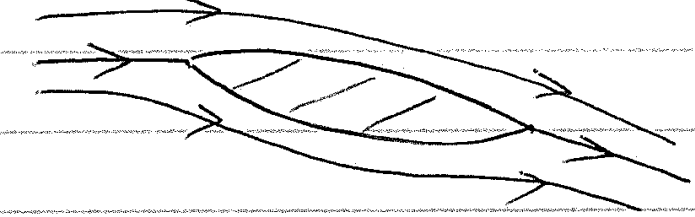{height="160px" fig-align="center"}

[Attached flow]{.small}
:::
::: {.column width="50%"}
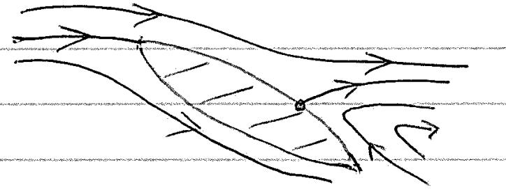{height="160px" fig-align="center"}

[Separated flow (stall)]{.small}
:::
::::

If a BL experiences an **adverse (positive) pressure gradient** ($dp/dx > 0$), the retarded fluid near the wall cannot overcome the rising pressure. The flow stalls and separates, reducing lift and increasing drag.

::: {.fragment}
On the cylinder: the outer flow accelerates over the front ($dp/dx < 0$, favourable) and decelerates over the rear ($dp/dx > 0$, adverse): the BL separates on the **rear** half.
:::

::: {.notes}
Recall the MIE: dθ/dx = C_f/2 + (H + 2)(θ/ρU∞²) dp/dx. An adverse pressure gradient makes the BL grow rapidly; separation is the extreme end of this.
:::

## The point of separation

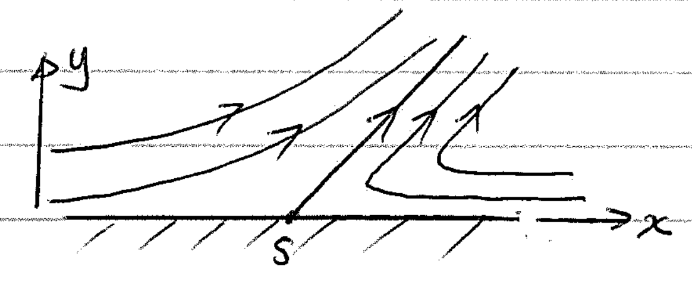{height="180px" fig-align="center"}

The fluid elements behind the point of separation $S$ follow the pressure gradient and move in reverse.

::: {.callout-tip icon=false}
## Mathematical definition of the separation point
::: {style="font-size:1.25em"}
The limit between forward and reverse flow at the surface is
$$
\left. \frac{\partial u}{\partial y} \right|_{y=0} = 0 \qquad (\text{i.e. } \tau|_{y=0} = 0)
$$
:::
:::

::: {.notes}
Strictly speaking, Prandtl's BL equations are only valid up to the point of separation!

To find where separation occurs we must, in general, integrate the BL equations for the given outer velocity U∞(x) (today done numerically, with BL codes or CFD).
:::

## Velocity-profile curvature

Evaluating the BL momentum equation at the wall ($u = v = 0$):
$$
\mu \left. \frac{\partial^2 u}{\partial y^2} \right|_{y=0} = \frac{dp}{dx}
$$

::: {.fragment}
- **Accelerated flow ($dp/dx < 0$):** curvature is negative at the wall and everywhere across the BL. The profile merges smoothly with $U_\infty$.
- **Decelerated flow ($dp/dx > 0$):** curvature starts positive at the wall, but must become negative to merge with $U_\infty$.
:::

::: {.fragment}
$\Longrightarrow$ A decelerated flow **must** have an inflection point ($\partial^2 u/\partial y^2 = 0$) inside the BL. This is a geometric precondition for the wall gradient to reach zero!
:::

::: {.notes}
If the slope at the wall were zero, the profile would need an "S-shape" (first steepening, then flattening to match the free stream): impossible without an inflection point. So separation can only occur where the outer flow is decelerating (dp/dx > 0).
:::

## Velocity profiles: accelerated vs decelerated

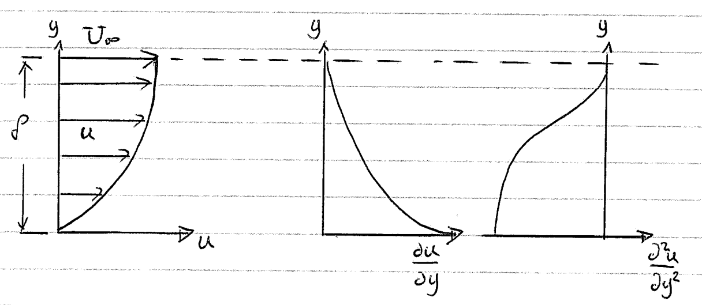{height="215px" fig-align="center"}

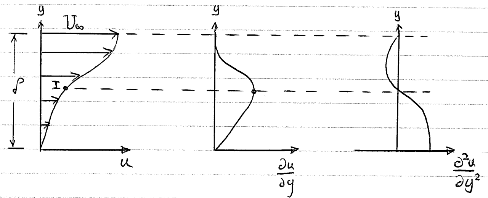{height="215px" fig-align="center"}

[Top: accelerated flow ($dp/dx < 0$). Bottom: decelerated flow ($dp/dx > 0$); I marks the point of inflection.]{.small}

::: {.notes}
Columns: u, ∂u/∂y and ∂²u/∂y² through the BL. In the decelerated case the curvature is positive at the wall, crosses zero at I and becomes negative towards the edge. Note the argument is strictly only true for a BL very close to a solid surface.
:::

## See it: Falkner–Skan profiles

::: {.notes}
Laminar similarity profiles for an outer flow U∞ ∝ x^m (Falkner–Skan; β = 2m/(m+1)). β > 0: favourable (fuller profile, higher wall shear). β = 0: flat plate (Blasius). β < 0: adverse — an inflection point appears, the wall shear falls and H rises. At β = −0.1988 the wall shear is zero (separation, H ≈ 4.0); for more negative β there is no attached solution.

Take-home: a laminar BL tolerates only a very mild deceleration (U∞ ∝ x^(−0.09), about 6% fall in outer velocity each time x doubles). Compare the slope and curvature panels with the previous slide.
:::

## Turbulent BLs resist separation

::: {.incremental}
- Turbulent mixing transfers high-momentum fluid from the outer part of the BL towards the wall: the near-wall fluid can push further into an adverse pressure gradient before $\tau|_{y=0} \to 0$.
- Same idea as the lower shape factor: turbulent $H \approx 1.3$–$1.4$ versus $2.59$ for laminar.
- **Drag crisis** (smooth cylinder): laminar BL separates at about $80^\circ$ from the front stagnation point, $C_D \approx 1.0$–$1.2$. At $Re \approx 2$–$5\times10^5$ the BL becomes turbulent before separating, stays attached to about $120^\circ$, the wake narrows and $C_D$ drops to about $0.3$.
:::

::: {.notes}
A smooth sphere behaves in the same way (C_D ≈ 0.47 falling to roughly 0.1–0.2 near Re ≈ 3×10⁵). Golf-ball dimples trip the BL so that the crisis happens at a lower Re, within the range of a typical drive (next question).
:::

## Quick question {.poll}

A smooth sphere at $Re \approx 2\times10^5$ is given a rough (dimpled) surface. Its **total** drag...

1. increases, because roughness increases the skin friction
2. [decreases, because the turbulent BL separates further back and the wake narrows]{.fragment .highlight-current-green}
3. is unchanged, because the outer flow is the same
4. decreases, because roughness keeps the BL laminar

::: {.fragment}
**B.** Roughness trips the BL. The skin friction does rise, but the pressure (form) drag, which dominates for a bluff body, falls by much more. This is why golf balls have dimples.
:::

::: {.notes}
Vote, discuss in pairs, re-vote. Many students choose A: they are right that friction rises, but for a bluff body the form drag dominates. Follow-up: would dimples help a streamlined aerofoil at a small angle of attack? (No: there the drag is mostly skin friction, so tripping the BL early increases drag.)
:::

## Key takeaways on separation

- **Precondition:** on a smooth surface separation can only occur in an adverse pressure gradient ($dp/dx > 0$). (At a sharp corner the local pressure gradient is extremely adverse.)
- **Consequence:** the flow fails to follow the body contour, causing large form drag and, for aerofoils, loss of lift (**stall**).
- **Turbulence advantage:** turbulent BLs resist separation better because mixing transfers high-momentum fluid from the outer stream down towards the wall.
- **Flow control:** injection (blowing), suction, or boundary-layer tripping (roughness, vortex generators).

::: {.notes}
Wind-energy example: vortex generators are often fitted near the root of wind-turbine blades, where the aerofoils are thick and the angle of attack is high, to delay separation. Active control (blowing, suction) carries energy and cost penalties.
:::

## Part 2: summary

- Turbulent BL equations: an extra Reynolds-stress term; total stress $\tau_{\text{lam}} + \tau_{\text{turb}}$ is constant near the wall.
- Structure: viscous sub-layer $u^+ = y^+$, log layer $u^+ = \frac{1}{\kappa}\ln y^+ + C$, outer defect region.
- 1/7 power law + MIE: $\delta/x = 0.37\,Re_x^{-1/5}$, $\overline{C}_f = 0.074\,Re_L^{-1/5}$ (exp.), $H \approx 1.3$.
- Transition at $Re_x \approx 3$–$5\times10^5$; combined BL: $\theta$ continuous, virtual origin, $D = \rho U_\infty^2\theta(L)$.
- Separation: $\tau|_{y=0} = 0$, needs $dp/dx > 0$ (inflection point); turbulent BLs resist it.

**Before the next session:** try the [Chapter 4 problems](../problems/index.qmd#ch4) and look through the [revision slides](revision.qmd).

::: {.notes}
This completes Chapter 4 and the course content. The revision deck summarises Chapters 1–4; past exam papers are the last thing to try, after the problem bank.
:::

