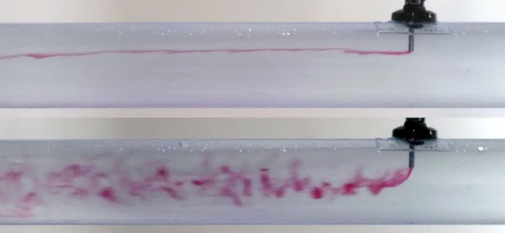
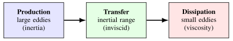
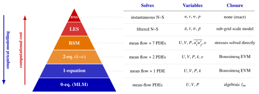
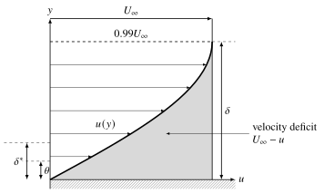
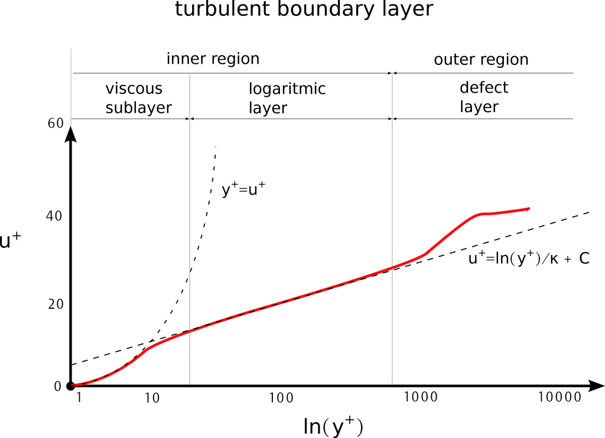

## Available course resources



**Where to find help and study materials for this course:**

- **Detailed course notes:** your first place to start. Full mathematical derivations and detailed physical explanations: [Ch. 1](../notes/ch1.qmd), [Ch. 2](../notes/ch2.qmd), [Ch. 3](../notes/ch3.qmd), [Ch. 4](../notes/ch4.qmd).
- **Slides covered in lectures:** useful for high-level summaries and visualising key concepts.
- **Workshops covered in lectures:** step-by-step application of the theory: [1](../workshops/workshop1.qmd), [2](../workshops/workshop2.qmd), [3](../workshops/workshop3.qmd), [4](../workshops/workshop4.qmd).
- **Problem sheets:** very important for testing your understanding and practising calculations: [problem bank](../problems/index.qmd) ([Ch. 2](../problems/index.qmd#ch2), [Ch. 3](../problems/index.qmd#ch3), [Ch. 4](../problems/index.qmd#ch4), [exam-style practice](../problems/index.qmd#revision)).
- **Past exams:** the last thing to try. Detailed solutions are provided, but only check them after giving it your best shot.

::: {.notes}
OPENING: Revision session for Chapters 1–4. The aim is not to re-teach but to show how the pieces connect: kinematics (Ch. 1) → conservation laws (Ch. 2) → turbulence and time averaging (Ch. 3) → boundary layers (Ch. 4), where everything comes together.

Stress the suggested order of study: notes → slides/workshops → problem bank → past exams (only at the end, and attempt them properly before looking at the solutions).
:::

## Revision outline

1. [**Ch. 1 · Preliminaries:**](../notes/ch1.qmd) continuum, material derivative, convective acceleration, vorticity
2. [**Ch. 2 · Conservation equations:**](../notes/ch2.qmd) continuity, Navier–Stokes, energy
3. [**Ch. 3 · Turbulent flows:**](../notes/ch3.qmd) characteristics, energy cascade, Reynolds averaging, RANS, turbulence models
4. [**Ch. 4 · Boundary layers:**](../notes/ch4.qmd) BL equations, Blasius, MIE, turbulent BLs, transition, separation

::: {.notes}
Each block has a 📖 link (top right of the slides) to the relevant notes section.
:::

## The differential approach & continuum

[[📖 Notes §1.1](../notes/ch1.qmd#sec-intro)]{.notes-link}

**The shift in perspective:** we move from analysing bulk devices (control volume) to examining the pointwise, Eulerian field behaviour of continuous fluid elements.

- **Continuum hypothesis:** we treat the fluid as a continuous medium whose properties are averages over volumes large compared with molecular scales.

::: {.callout-tip icon=false}
## The material derivative
::: {style="font-size:1.25em"}
Links the Eulerian (fixed point) and Lagrangian (following the fluid) views:
$$
\frac{D\vect{q}}{Dt}
= \underbrace{\frac{\partial \vect{q}}{\partial t}}_{\text{local accel.}}
+ \underbrace{(\vect{q}\cdot\del)\vect{q}}_{\text{convective accel.}}
$$
:::
:::

::: {.notes}
The material derivative is the acceleration in Newton's second law for a fluid element: it reappears as the left-hand side of the Navier–Stokes equations.
:::

## Convective acceleration

[[📖 Notes §1.2.1](../notes/ch1.qmd#sec-convective-meaning)]{.notes-link}

:::: {.columns}
::: {.column width="42%"}
Even in **steady flow** ($\partial \vect{q}/\partial t = 0$), a fluid element accelerates if it moves into a region of different velocity.

[$A_A u_A = A_B u_B$ with $A_B < A_A$ $\Rightarrow$ $u_B > u_A$.]{.small}
:::
::: {.column width="58%"}
{height="300px"}
:::
::::

::: {.notes}
Steady does not mean "no acceleration": the convective term (q·∇)q is non-zero whenever the element moves through a spatially varying velocity field.
:::

## Vorticity & rotation

[[📖 Notes §1.3](../notes/ch1.qmd#sec-vorticity)]{.notes-link}

**Vorticity** $\vect{\xi} = \del \times \vect{q}$ measures the local spin (rotation) of a fluid element.

{height="400px" fig-align="center"}

::: {.notes}
Irrotational (ξ = 0): the element's axes keep their orientation as it moves, even along a curved path. Rotational (ξ ≠ 0): the axes rotate with the element. The angular velocity of the element is ξ/2.
:::

## Conservation of mass

[[📖 Notes §2.1](../notes/ch2.qmd#sec-continuity)]{.notes-link}

::: {.callout-tip icon=false}
## The continuity equation
::: {style="font-size:1.25em"}
Mass is neither created nor destroyed in our infinitesimal element:
$$
\frac{\partial \rho}{\partial t} + \del \cdot (\rho \vect{q}) = 0 \qquad \text{(conservative form)}
$$
:::
:::

**Important special cases** [[📖 §2.1.1](../notes/ch2.qmd#sec-continuity-special)]{.small}

- **Steady flow:** $\partial \rho / \partial t = 0 \;\Rightarrow\; \del \cdot (\rho \vect{q}) = 0$
- **Incompressible flow:** $\rho = \text{const}$. The equation becomes purely kinematic (geometric), expressing conservation of volume:
  $$ \del \cdot \vect{q} = 0 $$

::: {.notes}
Remind them of the one-sentence argument from Workshops 1–2: for a unidirectional flow u = u(y, z), continuity gives ∂u/∂x = 0, so the flow is automatically fully developed.
:::

## Equation of motion & stress

[[📖 Notes §2.2](../notes/ch2.qmd#sec-momentum)]{.notes-link}

Applying $F = ma$ to a fluid element gives the general equation of motion ($x$-direction shown):
$$
\rho \frac{Du}{Dt} = \rho F_x - \frac{\partial p}{\partial x} + \frac{\partial \tau_{xx}}{\partial x} + \frac{\partial \tau_{xy}}{\partial y} + \frac{\partial \tau_{xz}}{\partial z}
$$

{height="240px" fig-align="center"}

::: {.notes}
Too many unknowns: 3 velocities, pressure and 6 independent stresses. We need a constitutive law linking stress to motion (next slide). Stress notation: τ_ij acts in direction i on a face whose normal is in direction j.
:::

## Stokes' relations: Newtonian fluids

[[📖 Notes §2.2.1](../notes/ch2.qmd#sec-stresses)]{.notes-link}

To close the equation we use Stokes' relations for a Newtonian fluid: stress is related directly to the **velocity gradients** (rate of strain). For incompressible flows:

::: {.callout-tip icon=false}
## Constitutive law
::: {style="font-size:1.25em"}
$$
\tau_{xy} = \tau_{yx} = \mu \left( \frac{\partial v}{\partial x} + \frac{\partial u}{\partial y} \right), \qquad \tau_{xx} = 2\mu \frac{\partial u}{\partial x}
$$
:::
:::

- $\mu$: dynamic viscosity.
- In general $\tau_{xx}$ contains an extra $-\tfrac{2}{3}\mu\,(\del\cdot\vect{q})$, which vanishes for incompressible flow.

::: {.notes}
Solids: stress ∝ strain (Hooke). Newtonian fluids: stress ∝ strain RATE.
:::

## The Navier–Stokes equations

[[📖 Notes §2.2.2](../notes/ch2.qmd#sec-ns-special)]{.notes-link}

Substituting the stresses into the equation of motion (incompressible flow, constant $\mu$):
$$
\underbrace{\frac{\partial \vect{q}}{\partial t}}_{\text{local accel.}}
+
\underbrace{(\vect{q}\cdot\del)\vect{q}}_{\text{convective accel.}}
=
\underbrace{-\frac{1}{\rho}\del p}_{\text{pressure force}}
+
\underbrace{\nu \del^2 \vect{q}}_{\text{viscous force}}
+
\underbrace{\vect{g}}_{\text{gravity}}
$$

**Physical interpretation** (all terms per unit mass):

- **LHS (inertia):** the acceleration of the fluid element. The **convective term** is non-linear: it makes the PDE very difficult to solve and is the root cause of turbulence.
- **RHS (forces):** the viscous term ($\nu \del^2 \vect{q}$) represents the diffusion of momentum, acting to smooth out velocity differences.

::: {.notes}
Typical exam task: decide which terms vanish for a given flow (steady, unidirectional, no body force…) and integrate what is left with the boundary conditions — exactly as in Workshops 1 and 2.
:::

## Conservation of energy

[[📖 Notes §2.3](../notes/ch2.qmd#sec-energy)]{.notes-link}

Based on the first law of thermodynamics, tracking how a particle's temperature changes as it moves:
$$
\color{#0066CC}{\rho C_v \frac{DT}{Dt}}
=
\color{#CC0000}{k \del^2 T}
+
\color{#006600}{\Phi}
+
\color{#E67800}{\rho \dot{Q}}
$$

- [**Internal energy** ($DT/Dt$): local and convective temperature changes.]{style="color:#0066CC"}
- [**Thermal conduction** ($k \del^2 T$): diffusion of heat driven by temperature gradients (Fourier's law).]{style="color:#CC0000"}
- [**Viscous dissipation** ($\Phi$): friction converting kinetic energy into heat; never negative ($\Phi \ge 0$).]{style="color:#006600"}
- [**Heat generation** ($\rho \dot{Q}$): internal heat sources (e.g. chemical reaction).]{style="color:#E67800"}

::: {.notes}
Valid for an incompressible fluid with constant k and C_v. Worked example in the notes: Couette flow with viscous heating (§2.3.1).
:::

## Characteristics of turbulence

[[📖 Notes §3.3](../notes/ch3.qmd#sec-characteristics)]{.notes-link}

:::: {.columns}
::: {.column width="48%"}
{height="230px"}
:::
::: {.column width="52%"}
**Key features:**

- **3D fluctuations:** chaos in $u', v', w'$.
- **High diffusivity:** eddies mix momentum and heat much faster than molecular diffusion.
- **Fuller profile:** rapid mixing carries fast fluid towards the walls.
- **Self-sustaining:** feeds on the mean-flow shear.
:::
::::

::: {.notes}
The fuller profile is the same feature that reappears in Chapter 4: turbulent BLs have a lower shape factor and resist separation better.
:::

## The energy cascade & length scales

[[📖 Notes §3.4](../notes/ch3.qmd#sec-energy-cascade)]{.notes-link}

Turbulence involves a hierarchy of eddies:

{height="140px" fig-align="center"}

- **Integral scale ($l$):** the largest eddies, size of the geometry; they extract energy from the mean flow.
- **Inertial subrange:** energy is passed to smaller eddies; the spectrum follows the **$-5/3$ law**, $E(\kappa) = C_K\, \varepsilon^{2/3} \kappa^{-5/3}$.
- **Kolmogorov scale ($\eta$):** the smallest eddies, where the energy is dissipated into heat by viscosity: $\eta \sim l\, Re^{-3/4}$.

::: {.notes}
The −5/3 law follows from dimensional analysis: in the inertial subrange E can depend only on the dissipation rate ε and the wavenumber κ (Kolmogorov's second similarity hypothesis). The ratio l/η ~ Re^(3/4) sets the cost of DNS (number of grid points ~ Re^(9/4) in 3D).
:::

## Reynolds decomposition & averaging

[[📖 Notes §3.6](../notes/ch3.qmd#sec-reynolds-averaging)]{.notes-link}

To avoid resolving unsteady turbulent structures (as DNS/LES do), we decompose variables into a time-averaged mean ($U$) and a fluctuation ($u'$):
$$
u = U + u', \qquad v = V + v', \qquad p = P + p', \qquad \overline{u} = \frac{1}{T} \int_{0}^{T} u(t) \, dt = U
$$

**Crucial rules of averaging** [[📖 §3.6.1](../notes/ch3.qmd#sec-averaging-rules)]{.small}

- The average of a fluctuation is zero: $\overline{u'} = 0$.
- The average of a mean times a fluctuation is zero: $\overline{U u'} = U\overline{u'} = 0$.
- [**BUT**]{style="color:#CC0000"} the average of a product of fluctuations is **not** zero: $\overline{u'^2} \neq 0$ and $\overline{u'v'} \neq 0$.

::: {.notes}
T must be long compared with the time scale of the fluctuations (but short compared with any slow change of the mean flow).
:::

## RANS & the closure problem

[[📖 Notes §3.7](../notes/ch3.qmd#sec-rans)]{.notes-link}

Substituting $u = U + u'$ into the N–S equations and time-averaging: the linear terms behave simply (e.g. $\overline{\partial u/\partial x} = \partial U/\partial x$), but the non-linear convective term produces new, unclosed terms because $\overline{u'v'} \neq 0$:

::: {.callout-tip icon=false}
## Reynolds-averaged Navier–Stokes (RANS), $x$-direction
::: {style="font-size:1.25em"}
$$
\rho \frac{DU}{Dt} = -\frac{\partial P}{\partial x} + \mu \del^2 U \underbrace{- \rho \left[ \frac{\partial \overline{u'^2}}{\partial x} + \frac{\partial \overline{u'v'}}{\partial y} + \frac{\partial \overline{u'w'}}{\partial z} \right]}_{\text{Reynolds stresses}}
$$
:::
:::

**The closure problem:** 4 equations (continuity + 3 momentum) but **10 unknowns** (pressure, 3 mean velocities and 6 independent Reynolds stresses)!

::: {.notes}
Here D/Dt is the material derivative following the MEAN flow, ∂/∂t + U ∂/∂x + V ∂/∂y + W ∂/∂z.
:::

## The Boussinesq hypothesis

[[📖 Notes §3.9.2](../notes/ch3.qmd#sec-boussinesq)]{.notes-link}

**The goal:** model the unknown Reynolds stresses.

J. Boussinesq (1877) proposed that momentum transfer by turbulent mixing acts analogously to molecular friction.

::: {.callout-tip icon=false}
## Eddy viscosity model (EVM)
::: {style="font-size:1.25em"}
Relates the Reynolds shear stress directly to the mean velocity gradient:
$$
-\rho\, \overline{u'v'} = \mu_t \frac{\partial U}{\partial y}
$$
:::
:::

**Crucial distinction:**

- **$\mu$ (molecular):** a property of the *fluid* (constant).
- **$\mu_t$ (eddy):** a property of the *flow* (highly variable).

::: {.notes}
μ_t is typically orders of magnitude larger than μ in a fully turbulent flow, and it varies from point to point (it is zero at a wall).
:::

## Linking $\mu_t$ to flow scales

How do we calculate this new unknown, $\mu_t$?

Prandtl (1925) used an analogy with the kinetic theory of gases: the eddy viscosity depends on the large, energy-containing eddies:

::: {.callout-tip icon=false}
## General EVM equation
::: {style="font-size:1.25em"}
$$
\mu_t = C\, \rho\, l_s v_s
$$
:::
:::

- $l_s$: turbulent length scale (size of the eddies); $\;v_s$: turbulent velocity scale (intensity of the mixing); $C$: a constant.

**The grand strategy:** instead of solving for 6 separate Reynolds stresses, turbulence modelling (with an EVM) reduces to finding formulas for $l_s$ and $v_s$!

::: {.notes}
Mixing-length model (0-equation): l_s = l_m prescribed algebraically, v_s = l_m |∂U/∂y|. One-equation model: v_s = √k from a transport equation for k. k–ε model: v_s = √k and l_s = k^(3/2)/ε, both from transport equations.
:::

## Turbulence modelling hierarchy

[[📖 Notes §3.8](../notes/ch3.qmd#sec-modelling)]{.notes-link}

{height="520px" fig-align="center"}

::: {.notes}
Going up the pyramid: less empirical modelling, more computational cost. DNS resolves all scales (no model); LES resolves the large eddies and models the sub-grid scales; RSM solves transport equations for the Reynolds stresses themselves (some terms in those equations still need modelling); k–ε, one-equation and mixing-length models use the Boussinesq EVM.
:::

## Prandtl's boundary-layer concept

[[📖 Notes §4.1](../notes/ch4.qmd#sec-bl-physical)]{.notes-link}

:::: {.columns}
::: {.column width="40%"}
Prandtl (1904) split the flow into:

1. **Inner region:** a thin layer ($\delta \ll L$) where viscous friction is dominant.
2. **Outer region:** frictionless, inviscid flow.
:::
::: {.column width="60%"}
{height="300px"}
:::
::::

::: {.notes}
Because the BL is thin, ∂p/∂y ≈ 0: the pressure inside the BL is imposed by the outer flow, −(1/ρ) dp/dx = U∞ dU∞/dx.
:::

## Definitions of boundary-layer thickness

[[📖 Notes §4.2](../notes/ch4.qmd#sec-bl-thickness)]{.notes-link}

:::: {.columns}
::: {.column width="52%"}
- **Nominal ($\delta$):** velocity reaches 99% of the free stream.
- **Displacement:** $\displaystyle \delta^* = \int_{0}^{\infty} \left(1 - \frac{u}{U_\infty}\right) dy$
- **Momentum:** $\displaystyle \theta = \int_{0}^{\infty} \frac{u}{U_\infty} \left(1 - \frac{u}{U_\infty}\right) dy$
- **Shape factor:** $H = \delta^*/\theta$ [laminar $H \approx 2.6$, turbulent $H \approx 1.3$–$1.4$]{.small}
:::
::: {.column width="48%"}
{height="340px"}
:::
::::

::: {.notes}
For any monotonic profile δ > δ* > θ. θ is the thickness that links directly to drag: D = ρU∞²θ(L) per unit width for a flat plate.
:::

## Simplified boundary-layer equations

[[📖 Notes §4.3](../notes/ch4.qmd#sec-bl-equations)]{.notes-link}

A single order-of-magnitude analysis ($v \ll u$, $\delta \ll L$) of the 2D, steady N–S equations reduces them massively, and gives $\delta/L \sim Re_L^{-1/2}$:

::: {.callout-tip icon=false}
## Prandtl's laminar BL equations
::: {style="font-size:1.25em"}
$$
\begin{aligned}
\text{Continuity:} \quad & \frac{\partial u}{\partial x} + \frac{\partial v}{\partial y} = 0 \\
x\text{-momentum:} \quad & u\frac{\partial u}{\partial x} + v\frac{\partial u}{\partial y} = \underbrace{-\frac{1}{\rho}\frac{dp}{dx}}_{\text{known from outer flow}} + \nu \frac{\partial^2 u}{\partial y^2}
\end{aligned}
$$
:::
:::

- The $y$-momentum equation is discarded ($\partial p/\partial y \approx 0$).
- $dp/dx$ is no longer an unknown; it is a forced input.

::: {.notes}
Inside the BL inertia ~ viscous terms: U∞²/L ~ νU∞/δ², hence δ/L ~ Re_L^(-1/2) and C_f ~ Re^(-1/2). The exact Blasius solution supplies the constants.
:::

## Blasius exact solution (laminar)

[[📖 Notes §4.4](../notes/ch4.qmd#sec-blasius)]{.notes-link}

Flat plate, $dp/dx = 0$ ($U_\infty = \text{const}$). Blasius (1908) solved the BL equations exactly with a **similarity variable**: $u/U_\infty$ looks identical at every $x$ if we scale $y$ appropriately:
$$
\eta = y \sqrt{\frac{U_\infty}{\nu x}}, \qquad \frac{u}{U_\infty} = f'(\eta), \qquad f''' + \tfrac{1}{2} f f'' = 0
$$

- Boundary-layer thickness: $\delta/x = 5.0\, Re_x^{-1/2} \quad (\Rightarrow \delta \propto x^{1/2})$
- Momentum thickness: $\theta/x = 0.664\, Re_x^{-1/2}$
- Local skin friction: $C_f = 0.664\, Re_x^{-1/2}$; average $\overline{C}_f = 1.328\, Re_L^{-1/2}$
- Shape factor: $H = 2.59$

::: {.notes}
The numerical solution (table and interactive plot in the notes, §4.4) gives f''(0) = 0.332, which is where the wall shear stress and C_f come from.
:::

## The momentum integral equation (MIE)

[[📖 Notes §4.5](../notes/ch4.qmd#sec-mie)]{.notes-link}

**Key idea:** exact solutions are impossible for turbulent flows or arbitrary geometries, so we integrate momentum across the entire layer ($y = 0 \to h$) instead of solving the PDEs for every particle.

::: {.callout-tip icon=false}
## The von Kármán MIE
::: {style="font-size:1.25em"}
$$
\frac{d\theta}{dx} + (H+2)\frac{\theta}{U_\infty}\frac{dU_\infty}{dx} = \frac{C_f}{2}
$$
:::
:::

*Valid for BOTH laminar and turbulent boundary layers!* **How to use it:**

1. **Guess** a velocity profile shape (e.g. $u/U_\infty = a\eta^2 + b\eta + c$, $\eta = y/\delta$).
2. Integrate the profile to find $\theta(\delta)$; evaluate the wall gradient for $\tau_w(\delta)$.
3. Substitute into the MIE and solve the resulting ODE for $\delta(x)$.

::: {.notes}
Parabolic profile: δ/x = 5.48 Re_x^(-1/2), within 10% of Blasius. For a flat plate (dU∞/dx = 0) the MIE is simply dθ/dx = C_f/2, which also gives D = ρU∞²θ(L).
:::

## Turbulent boundary-layer equations

[[📖 Notes §4.6](../notes/ch4.qmd#sec-turbulent-bl)]{.notes-link}

By time-averaging (RANS) in a thin boundary layer we obtain the turbulent BL equations.

**Difference from laminar:** the momentum equation gains a Reynolds shear stress term ($-\rho \overline{u'v'}$); the gradients of the normal stresses are neglected.

::: {.callout-tip icon=false}
## Combined stresses in a turbulent BL
::: {style="font-size:1.25em"}
$$
U\frac{\partial U}{\partial x} + V\frac{\partial U}{\partial y} = -\frac{1}{\rho}\frac{dP_\infty}{dx} + \frac{1}{\rho}\frac{\partial}{\partial y}\Big[ \underbrace{\mu \frac{\partial U}{\partial y}}_{\tau_{\text{lam}}} \; \underbrace{- \rho \overline{u'v'}}_{\tau_{\text{turb}}} \Big]
$$
:::
:::

::: {.notes}
Because these equations have no exact analytical solution (even for a flat plate), we rely on empirical profiles and the MIE.
:::

## Structure of a turbulent boundary layer

[[📖 Notes §4.7](../notes/ch4.qmd#sec-log-law)]{.notes-link}

:::: {.columns}
::: {.column width="48%"}
{height="320px"}

[$u^+ = U/u_\tau$, $\;y^+ = u_\tau y/\nu$, $\;u_\tau = \sqrt{\tau|_{y=0}/\rho}$]{.small}
:::
::: {.column width="52%"}
1. **Viscous sub-layer:** viscosity dominates, fluctuations vanish. Linear profile: $\;u^+ = y^+$
2. **Log layer:** Reynolds stresses dominate. Law of the wall: $\;u^+ = \dfrac{1}{\kappa} \ln(y^+) + C$
3. **Outer wake region:** viscosity negligible; large eddies dominate (velocity defect law).
:::
::::

::: {.notes}
κ ≈ 0.4, C ≈ 5.2. The log law can be derived from the mixing-length model with l_m = κy and constant total shear stress near the wall.
:::

## Solving turbulent BLs using the MIE

[[📖 Notes §4.8](../notes/ch4.qmd#sec-turbulent-flat-plate)]{.notes-link}

For a flat plate ($dp/dx = 0$), the MIE is $d\theta/dx = C_f/2$.

**1. Guess a profile:** empirical power law $\;\dfrac{U}{U_\infty} = \left(\dfrac{y}{\delta}\right)^{1/7} \;\Longrightarrow\;$ integrating gives $\theta = \dfrac{7}{72}\,\delta$.

**2. Find the wall shear:** the power law gives infinite $\tau_w$ at $y = 0$, so we use an empirical analogy with smooth-pipe flow instead: $\;C_f = 0.045 \left(\dfrac{U_\infty \delta}{\nu}\right)^{-1/4}$

**3. Result:** substituting both into the MIE gives the growth rate $\;\dfrac{\delta}{x} = 0.3707\, Re_x^{-1/5}\;$ ($\Rightarrow \delta \propto x^{4/5}$): *turbulent BLs grow significantly faster than laminar ones!*

::: {.notes}
Also θ/x = 0.036 Re_x^(-1/5) (experimental fit 0.037) and C̄f = 0.0721 Re_L^(-1/5) (experimental fit 0.074).
:::

## Laminar-to-turbulent transition

[[📖 Notes §4.9](../notes/ch4.qmd#sec-transition)]{.notes-link}

:::: {.columns}
::: {.column width="48%"}
**Transition factors.** Transition from laminar to turbulent is promoted by:

- high Reynolds number ($Re_{cr} \approx 5 \times 10^5$ on a smooth flat plate);
- high freestream turbulence;
- surface roughness;
- adverse pressure gradients ($dp/dx > 0$).
:::
::: {.column width="52%"}
**Combined boundary layers** [[📖 §4.10](../notes/ch4.qmd#sec-combined-bl)]{.small}

- To calculate drag, we model a laminar zone followed by a turbulent zone growing from a "virtual origin" $x_0$.
- **Continuity rule:** the momentum thickness $\theta$ must be continuous at transition ($x_{cr}$).
- **Total drag shortcut:** $D_{\text{total}} = \rho U_\infty^2\, \theta(L)$ (per unit width).
:::
::::

::: {.notes}
Steps: θ_cr from Blasius at x_cr; find x₀ from the turbulent θ formula with length (x_cr − x₀); then θ(L) with length (L − x₀).
:::

## Boundary-layer separation

[[📖 Notes §4.11](../notes/ch4.qmd#sec-separation)]{.notes-link}

- **Separation point:** $\left.\partial u/\partial y\right|_{y=0} = 0$, i.e. $\tau|_{y=0} = 0$; reversed flow downstream.
- At the wall, $\mu\, \partial^2 u/\partial y^2|_{y=0} = dp/dx$: an adverse pressure gradient ($dp/dx > 0$) forces an **inflection point** in the profile, which is a precondition for separation. **No separation without $dp/dx > 0$.**
- **Consequences:** wake, large form (pressure) drag on bluff bodies (cylinder: separation, von Kármán vortex street), loss of lift (stall) on aerofoils.
- **Turbulent BLs resist separation** (mixing brings high-momentum fluid to the wall) — drag crisis of cylinders and spheres, dimpled golf balls.
- **Control:** blowing, suction, tripping / vortex generators.

::: {.notes}
This slide is new compared with last year's revision deck, because separation is now one complete section at the end of Chapter 4 (cylinder regimes, von Kármán street, adverse pressure gradient, separation criterion, aerofoils).
:::

## Where next?

- Work through the [exam-style practice problem](../problems/index.qmd#revision) and the chapter problems: [Ch. 2](../problems/index.qmd#ch2), [Ch. 3](../problems/index.qmd#ch3), [Ch. 4](../problems/index.qmd#ch4).
- Re-do the workshops without looking at the solutions: [Workshop 1](../workshops/workshop1.qmd), [2](../workshops/workshop2.qmd), [3](../workshops/workshop3.qmd), [4](../workshops/workshop4.qmd).
- Use the *summary of key relations* in the notes: [Ch. 1](../notes/ch1.qmd#sec-summary), [Ch. 2](../notes/ch2.qmd#sec-summary).
- Finally, attempt the past exams under timed conditions, then check the solutions.

::: {.notes}
Encourage students to identify which assumptions each problem uses (steady? incompressible? unidirectional? laminar/turbulent?) before writing any equation: that is the key skill the exam tests.
:::
