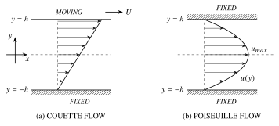
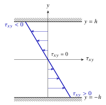



::: {.callout-note icon=false}
## How to use this page
Work through the steps on paper first, exactly as you would with the printed handout. Each blank in a prompt is shown as a highlighted **?** that you can click to reveal that answer on its own, and each **Show step** box opens the worked answer for that step. Only open them after you have had a go.

**Study first:** [Problem-solving recipe](../notes/ch1.qmd#sec-recipe) · [Continuity equation](../notes/ch2.qmd#sec-continuity) · [Navier–Stokes equations](../notes/ch2.qmd#sec-ns-special) · [Newtonian stresses](../notes/ch2.qmd#sec-stresses) · [Boundary conditions](../notes/ch2.qmd#sec-bcs) · [Vorticity](../notes/ch1.qmd#sec-vorticity). See also the [problem-solving strategy for flow problems](../resources/solving-strategy.qmd).
:::

<button type="button" class="reveal-all">Reveal all answers</button>opens every step and fills every blank on this page (click again to hide them)

## Introduction

An important simplification of the equations of motion arises for a class of two-dimensional, steady, unidirectional flows which give rise to closed form analytical solutions. We will compare two distinct physical mechanisms for driving fluid motion:

- **Case I: Plane Couette Flow (Shear Driven).** In this model, the fluid moves solely because the boundary walls are moving. Strictly speaking, we define pure Couette flow as having **zero pressure gradient** in the flow direction. The motion is generated entirely by the viscous drag (shear stress) from the moving top plate.
- **Case II: Plane Poiseuille Flow (Pressure Driven).** In this model, the boundary walls are stationary. The fluid moves solely because there is a **pressure gradient** pushing it through the channel. The fluid flows from high pressure to low pressure.

*Problem Description:* We assume body forces to be negligible, and dynamic viscosity $\mu$ and density $\rho$ to be constant. The flow is steady. We use a two-dimensional Cartesian coordinate system, $x$ in the direction of flow and $y$ perpendicular to it.

{#fig-ws1-flows width=95% fig-alt="Two channels of half-width h. Left: the top plate moves with speed U over a fixed bottom plate and the velocity profile is linear. Right: both plates are fixed and the profile is parabolic with maximum u_max on the centreline."}

## Step 1: Identify characteristics

*Based on the problem description, fill in the table below to define the flow model.*

| Property | Answer | Mathematical consequence |
|:--|:--|:--|
| Is the flow steady or unsteady? | [Steady]{.gap} | $\partial/\partial t =$ [$0$]{.gap} |
| Is it compressible? | [Incompressible]{.gap} | $\rho =$ [constant]{.gap} |
| Dimensions / direction? | [2D, unidirectional]{.gap} | $v =$ [$0$]{.gap}, $w =$ [$0$]{.gap}, $\partial/\partial z =$ [$0$]{.gap} |
| Body forces? | [Negligible]{.gap} | $g_x =$ [$0$]{.gap}, $g_y =$ [$0$]{.gap} |

*Remark:* we assume that the flow is **unidirectional** ($v = w = 0$) but we do **not** need to assume separately that it is *fully developed*: continuity then forces $\partial u/\partial x = 0$, as you will show in Step 3A, so "unidirectional" and "fully developed" are not two independent assumptions.

## Step 2: Geometry & method

The key to solving these problems is to assume the plates are very wide and long. We use a two-dimensional Cartesian coordinate system (see @fig-ws1-flows):

- $x$ is in the direction of flow.
- $y$ is perpendicular to flow.
- Origin $(0,0)$ is located at the centreline between plates separated by distance $2h$.

## Step 3: Governing equations

First, we simplify the governing equations for **unidirectional flows in general**. We will then use these simplified equations in Step 4 to apply boundary conditions for each specific problem (Couette vs Poiseuille).

### A. The continuity equation

The general continuity equation for 3D flow is:
$$
\frac{\partial \rho}{\partial t} + \frac{\partial (\rho u)}{\partial x} + \frac{\partial (\rho v)}{\partial y} + \frac{\partial (\rho w)}{\partial z} = 0
$$

**Task:** Apply the assumptions from Step 1. Simplify the equation to find how the velocity $u$ behaves.

Show step

Applying our assumptions:
$$
\cancelto{0}{\frac{\partial \rho}{\partial t}} + \rho \frac{\partial u}{\partial x} + \cancelto{0}{\frac{\partial (\rho v)}{\partial y}} + \cancelto{0}{\frac{\partial (\rho w)}{\partial z}} = 0
$$

- $\partial \rho / \partial t = 0$: Density is constant (incompressible + steady).
- $v = 0$ and $w = 0$: Unidirectional flow ($v$ term drops) and 2D ($w$ term drops).

**Result:** $\dfrac{\partial u}{\partial x} = 0$ and therefore the flow between the two plates is fully developed (i.e., no change of velocity in the $x$ direction). This is why we did not need to assume it in Step 1: it follows from the unidirectional assumption.

**Conclusion:** From the result above, $u$ is a function of [$y$]{.gap} only.

### B. The Navier–Stokes equations

We examine the full 3D momentum equations in the Cartesian coordinate system.

**1. The $x$-direction momentum equation:**
$$
\begin{aligned}
\rho \left( \frac{\partial u}{\partial t} + u\frac{\partial u}{\partial x} + v\frac{\partial u}{\partial y} + w\frac{\partial u}{\partial z} \right) = {}&-\frac{\partial p}{\partial x} + \mu \left( \frac{\partial^2 u}{\partial x^2} + \frac{\partial^2 u}{\partial y^2} + \frac{\partial^2 u}{\partial z^2} \right) \\
&+ \rho g_x
\end{aligned}
$$

**Task:** Using **only** the assumptions listed in your table in Step 1 and the conclusion from continuity (Step 3A), cross out the terms that are zero and explain why.

Show step

$$
\begin{aligned}
&\rho \left( \cancelto{\text{steady}}{\frac{\partial u}{\partial t}} + \cancelto{\text{cont.}}{u\frac{\partial u}{\partial x}} + \cancelto{v=0}{v\frac{\partial u}{\partial y}} + \cancelto{w=0}{w\frac{\partial u}{\partial z}} \right) \\
&\qquad = -\frac{\partial p}{\partial x} + \mu \left( \cancelto{\text{cont.}}{\frac{\partial^2 u}{\partial x^2}} + \frac{\partial^2 u}{\partial y^2} + \cancelto{2D}{\frac{\partial^2 u}{\partial z^2}} \right) + \cancelto{0}{\rho g_x}
\end{aligned}
$$

**Result:**
$$
\frac{\partial p}{\partial x} = \mu \frac{d^2 u}{dy^2}
$$

**2. The $y$-direction momentum equation:**
$$
\begin{aligned}
\rho \left( \frac{\partial v}{\partial t} + u\frac{\partial v}{\partial x} + v\frac{\partial v}{\partial y} + w\frac{\partial v}{\partial z} \right) = {}&-\frac{\partial p}{\partial y} + \mu \left( \frac{\partial^2 v}{\partial x^2} + \frac{\partial^2 v}{\partial y^2} + \frac{\partial^2 v}{\partial z^2} \right) \\
&+ \rho g_y
\end{aligned}
$$

**Task:** Simplify the equation above based on Step 1. What does this tell you about the pressure $p$?

Show step

Since $v = 0$ everywhere, every term containing $v$ is zero (and $g_y = 0$).
$$
0 = -\frac{\partial p}{\partial y}
$$
This implies pressure does not vary with $y$: $p = p(x)$ only.

**3. The pressure gradient argument:** Look at your reduced $x$-equation and reduced $y$-equation.

> *Question:* The viscous term $\mu\, d^2u/dy^2$ of your $x$-equation depends only on $y$. The pressure gradient term depends only on $x$. How can a function of $y$ equal a function of $x$? What does this imply about $\dfrac{dp}{dx}$?
>
> **Answer:** $\dfrac{dp}{dx} =$ [constant (both sides must equal the same constant)]{.gap}

## Step 4: Solving the problems

### Case I: Plane Couette flow

We explicitly assume there is **no pressure gradient** in the flow direction.

**1. Reduce the equation:** Write the final ODE based on Step 3B.

Show step

$$
\mu \frac{d^2 u}{dy^2} = 0 \implies \frac{d^2 u}{dy^2} = 0
$$

**2. Integrate and apply boundary conditions:** Integrate the ODE twice. Apply the BCs $u(y=-h) = 0$ and $u(y=+h) = U$ to obtain the velocity profile.

Show step

Integration:
$$
u(y) = C_1 y + C_2
$$
Boundary conditions:

- At $y = -h$, $u = 0 \implies -C_1 h + C_2 = 0$
- At $y = +h$, $u = U \implies C_1 h + C_2 = U$

Solving gives $C_1 = U/(2h)$ and $C_2 = U/2$. So the velocity profile is
$$
u(y) = \frac{U}{2} + \frac{U}{2h}y
$$

### Case II: Plane Poiseuille flow

The walls are fixed. The flow is driven by a constant pressure gradient.

**1. The governing equation:** Write the reduced ODE (remembering $\dfrac{dp}{dx}$ is a non-zero constant) obtained from the Navier–Stokes equations.

Show step

$$
\mu \frac{d^2 u}{dy^2} = \frac{dp}{dx}
$$

**2. Integrate and apply boundary conditions:** Integrate twice. Apply BCs ($u = 0$ at $y = \pm h$) to obtain the velocity profile.

Show step

Integration:
$$
u(y) = \frac{1}{2\mu}\frac{dp}{dx}y^2 + C_1 y + C_2
$$
Apply boundary conditions at $y = h$ and $y = -h$:
$$
\begin{aligned}
u(y=h) = 0 &\implies \frac{1}{2\mu}\frac{dp}{dx}h^2 + C_1 h + C_2 = 0 \\
u(y=-h) = 0 &\implies \frac{1}{2\mu}\frac{dp}{dx}h^2 - C_1 h + C_2 = 0
\end{aligned}
$$
Solving these simultaneous equations (adding/subtracting) gives:
$$
C_1 = 0 \quad \text{and} \quad C_2 = -\frac{1}{2\mu}\frac{dp}{dx}h^2
$$
Substituting these back gives the velocity profile:
$$
u(y) = -\frac{dp}{dx}\frac{h^2}{2\mu}\left( 1 - \frac{y^2}{h^2} \right)
$$

### Further analysis of Poiseuille flow

**A. Maximum velocity ($u_{max}$):** Determine the $y$-location where the maximum velocity occurs and find $u_{max}$. Then, express $u(y)$ in terms of $u_{max}$.

Show step

Max velocity occurs at the centreline ($y = 0$):
$$
u_{max} = u(0) = -\frac{dp}{dx}\frac{h^2}{2\mu}
$$
Substituting this back into the main equation:
$$
u(y) = u_{max} \left( 1 - \frac{y^2}{h^2} \right)
$$

**B. Shear stress distribution:** Derive the expression for shear stress as a function of $y$. Calculate its values at the walls ($y = \pm h$) and sketch the variation of shear stress across the channel.

Show step

**1. General expression.** By definition:
$$
\tau_{xy} = \mu \frac{du}{dy}
$$
Substituting $u(y) = u_{max} \left(1 - \dfrac{y^2}{h^2}\right)$:
$$
\tau_{xy} = \mu u_{max} \left( -\frac{2y}{h^2} \right) = -\frac{2\mu u_{max}}{h^2} y
$$

**2. At the walls:**

- At $y = h$: $\tau_w = -\dfrac{2\mu u_{max}}{h}$
- At $y = -h$: $\tau_w = +\dfrac{2\mu u_{max}}{h}$

{width=38% fig-alt="Shear stress varies linearly across the channel, zero on the centreline, negative in the upper half and positive in the lower half."}

**C. Vorticity ($\xi_z$):** Calculate the vorticity vector component $\xi_z = \dfrac{\partial v}{\partial x} - \dfrac{\partial u}{\partial y}$.

Show step

Since $v = 0$, $\dfrac{\partial v}{\partial x} = 0$.
$$
\xi_z = - \frac{du}{dy}
$$
From part B, we know $\dfrac{du}{dy} = -\dfrac{2 u_{max} y}{h^2}$.
$$
\xi_z = - \left( -\frac{2 u_{max} y}{h^2} \right) = \frac{2 u_{max}}{h^2} y
$$
*Interpretation: The fluid rotation is zero at the centreline and maximum (in magnitude) at the walls.*

**D. Average velocity ($u_{ave}$):**
$$
u_{ave} = \frac{1}{2h} \int_{-h}^{h} u(y)\, dy
$$
Evaluate this integral to find the relationship between $u_{ave}$ and $u_{max}$.

Show step

$$
\begin{aligned}
u_{ave} &= \frac{u_{max}}{2h} \int_{-h}^{h} \left(1 - \frac{y^2}{h^2}\right) dy = \frac{u_{max}}{2h} \left[ y - \frac{y^3}{3h^2} \right]_{-h}^{h} \\
&= \frac{u_{max}}{2h} \left( \frac{4h}{3} \right) = \frac{2}{3} u_{max}
\end{aligned}
$$

## Notes & discussion

### 1. Linearity & superposition

Although the Navier–Stokes equations are generally non-linear (due to the convective term), in this specific case of unidirectional (and therefore, by continuity, fully developed) flow, the non-linear terms vanish (as we saw in Step 3). Because the resulting differential equations are **linear**, the principle of superposition applies. This means if we have a flow that is driven by *both* a moving wall (Couette) and a pressure gradient (Poiseuille), the total solution is simply the sum of the two individual solutions:
$$
u_{total}(y) = u_{Couette}(y) + u_{Poiseuille}(y) = \frac{U}{2}\left(1 + \frac{y}{h}\right) - \frac{dp}{dx}\frac{h^2}{2\mu}\left(1 - \frac{y^2}{h^2}\right)
$$

::: {.content-visible when-format="html"}
Use the interactive figure below to explore how changing the wall velocity $U$, the pressure gradient $dp/dx$, or other parameters affects the final profile shape. Try the presets: pure Couette flow reproduces Case I, pure Poiseuille flow Case II (check that $u_{ave} = \tfrac{2}{3}u_{max}$ and $\tau_w = \mp 2\mu u_{max}/h$), and an *adverse* pressure gradient ($dp/dx > 0$) strong enough produces reversed flow next to the fixed wall.

*Optional extra:* the original [Colab notebook](https://colab.research.google.com/drive/12tDqkt66bYLOXYDBTyvfkBl5iUcarVPq?usp=sharing) does the same in Python, if you would like to modify the code yourself.
:::

### 2. The importance of the velocity field

This example enforces the statement made in the notes and reinforced in class that: knowledge of the velocity vector field is essentially **THE SOLUTION** to a fluid mechanics problem, since all other flow properties can be calculated from it!

### 3. Coordinate systems

We defined our coordinate system with the origin at the centre ($y = 0$ is the centreline, walls are at $\pm h$).

- If we had placed the origin at the **bottom wall** ($y = 0$ at bottom, $y = 2h$ at top), the physics would remain exactly the same, but the mathematical form of the equation would change.
- For example, the Couette profile would simply be $u(y) = \dfrac{U}{2h}y$ (where $y$ goes from $0$ to $2h$).
- Always be careful to define your coordinate system clearly before solving the differential equations, as it changes how you apply boundary conditions.

::: {.content-visible when-format="html"}

:::
