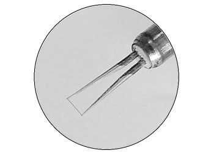
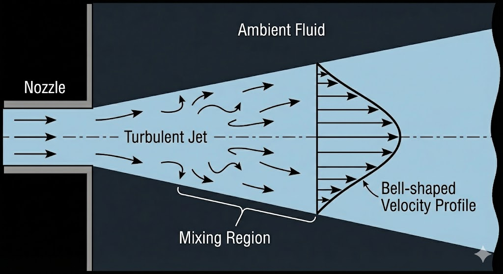
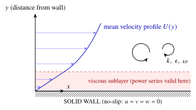



::: {.callout-note icon=false}
## How to use this page
Work through the steps on paper first, exactly as you would with the printed handout. Each blank in a prompt is shown as a highlighted **?** that you can click to reveal that answer on its own, and each **Show step** box opens the worked answer for that step. Only open them after you have had a go.

**Study first:** [Reynolds averaging](../notes/ch3.qmd#sec-reynolds-averaging) · [Averaging rules](../notes/ch3.qmd#sec-averaging-rules) · [Turbulent stresses](../notes/ch3.qmd#sec-turbulent-stresses) · [Energy cascade](../notes/ch3.qmd#sec-energy-cascade) · [Kolmogorov length scales](../notes/ch3.qmd#sec-length-scales) · [DNS, LES and RANS](../notes/ch3.qmd#sec-modelling) · [Boussinesq hypothesis](../notes/ch3.qmd#sec-boussinesq) · [Mixing-length model](../notes/ch3.qmd#sec-mixing-length) · [$k$–$\varepsilon$ model](../notes/ch3.qmd#sec-k-epsilon). For Part B, the viscous sublayer is discussed in [the law of the wall](../notes/ch4.qmd#sec-log-law).
:::

<button type="button" class="reveal-all">Reveal all answers</button>opens every step and blank in both parts (click again to hide)

## Part A: Applied turbulence modelling {#part-a}

::: {.callout-note appearance="simple" icon=false}
## Workshop overview
In lectures, we established the theoretical framework for turbulence, Reynolds averaging, and the Boussinesq Eddy Viscosity Model. Today, we will apply these tools to solve problems. You will:

1. Extract mean values and Reynolds stresses from a raw, fluctuating velocity signal.
2. Calculate Kolmogorov scales for an industrial duct to evaluate DNS feasibility.
3. Apply Prandtl's Mixing Length Model to a turbulent plane jet.
4. See why the mixing-length model fails on the jet centreline and how the $k$–$\varepsilon$ model fixes it.
:::

### A1: Statistical analysis of a turbulent flow signal

{#fig-hotwire width=40% fig-alt="Close-up of a hot-wire anemometer probe: a very thin wire stretched between two prongs."}

A hot-wire anemometer, shown in @fig-hotwire, is placed in a 2D turbulent flow. For a short time interval, the instantaneous velocity components $u(t)$ and $v(t)$ (in m/s) at the measurement point can be approximated by the following synthetic signals, where $\omega = 100 \pi$ rad/s:
$$
\begin{aligned}
u(t) &= 15 + 3 \sin(\omega t) \\
v(t) &= 2 + 1.5 \sin\left(\omega t + \frac{\pi}{4}\right)
\end{aligned}
$$

**1A: Mean flow.** Calculate the time-averaged mean velocities, $U$ and $V$. The averaging time period is $T = 2\pi/\omega$ (one full cycle of the fundamental fluctuation).
*Hint: The time-average is defined as $U = \frac{1}{T}\int_{0}^{T} u(t) \, dt$.*

Show step

By definition, the integral of a sine wave over a full period is zero.
$$
U = \frac{1}{T} \int_{0}^{T} \left( 15 + 3 \sin(\omega t) \right) dt = 15 \text{ m/s}
$$
$$
V = \frac{1}{T} \int_{0}^{T} \left( 2 + 1.5 \sin\left(\omega t + \frac{\pi}{4}\right) \right) dt = 2 \text{ m/s}
$$

**1B: The fluctuations and turbulent kinetic energy.** Identify the fluctuating components $u'(t)$ and $v'(t)$. Assuming the out-of-plane fluctuation $w'(t) = 0$, calculate the specific turbulent kinetic energy, $k$.
*Hint: $k = \frac{1}{2}(\overline{u'^2} + \overline{v'^2})$. You will need the identity $\int_0^T \sin^2(\omega t + \phi)\, dt = T/2$.*

Show step

The fluctuations are the time-dependent parts:
$$
u'(t) = 3 \sin(\omega t), \qquad v'(t) = 1.5 \sin\left(\omega t + \frac{\pi}{4}\right)
$$
Calculate the variance (mean square) of each:
$$
\overline{u'^2} = \frac{1}{T} \int_0^T 9 \sin^2(\omega t) \, dt = \frac{1}{T} \left( 9 \cdot \frac{T}{2} \right) = 4.5 \text{ m}^2\text{/s}^2
$$
$$
\overline{v'^2} = \frac{1}{T} \int_0^T 2.25 \sin^2\left(\omega t + \frac{\pi}{4}\right) dt = \frac{1}{T} \left( 2.25 \cdot \frac{T}{2} \right) = 1.125 \text{ m}^2\text{/s}^2
$$
Calculate the turbulent kinetic energy:
$$
k = \frac{1}{2} (4.5 + 1.125 + 0) = \mathbf{2.8125 \text{ J/kg}}
$$

**1C: The Reynolds shear stress.** Calculate the kinematic Reynolds shear stress, $\overline{u'v'}$. Is it zero?
*Hint: Use the trig identity $\sin(A)\sin(B) =$ $\frac{1}{2}[\cos(A-B) - \cos(A+B)]$.*

Show step

$$
\begin{aligned}
\overline{u'v'} &= \frac{1}{T} \int_0^T \left( 3 \sin(\omega t) \right) \left( 1.5 \sin\left(\omega t + \frac{\pi}{4}\right) \right) dt \\
&= \frac{4.5}{T} \int_0^T \sin(\omega t) \sin\left(\omega t + \frac{\pi}{4}\right) dt
\end{aligned}
$$
Using the identity:
$$
\sin(\omega t) \sin\left(\omega t + \frac{\pi}{4}\right) = \frac{1}{2} \left[ \cos\left(-\frac{\pi}{4}\right) - \cos\left(2\omega t + \frac{\pi}{4}\right) \right]
$$
The integral of the high-frequency cosine term over the period is zero. We are left with the constant term:
$$
\overline{u'v'} = 4.5 \cdot \frac{1}{2} \cos\left(-\frac{\pi}{4}\right) = 2.25 \cdot \frac{\sqrt{2}}{2} \approx \mathbf{1.59 \text{ m}^2\text{/s}^2}
$$
*Conclusion: The Reynolds stress is strictly non-zero because the $u$ and $v$ fluctuations are partially correlated (they have a phase shift of $\pi/4$ in this example). If they were in quadrature (a phase shift of $\pi/2$), the stress would be zero; if they were perfectly out of phase (a phase shift of $\pi$), $\overline{u'v'}$ would be negative and as large as possible, $-\tfrac{1}{2}(3)(1.5) = -2.25$ m²/s².*

### A2: Resolving turbulence in an HVAC system

An engineer wishes to run a Direct Numerical Simulation (DNS) on the airflow through a primary HVAC duct in a commercial building.

- Mean air velocity, $U = 12$ m/s
- Duct diameter, $D = 0.8$ m
- Kinematic viscosity of air, $\nu = 1.5 \times 10^{-5}$ m²/s
- Duct wall surface roughness, $\epsilon_{rough} = 0.15$ mm (galvanised steel)

The integral length scale ($l$) for pipe flow is typically bounded by the geometry; assume $l \approx 0.1 D$.

**2A:** Calculate the Reynolds number and the Kolmogorov length scale ($\eta$) in millimetres.
*Recall: $\eta \sim l\, (Re_l)^{-3/4}$, where $Re_l = \frac{u_l l}{\nu}$. Assume the large eddy velocity $u_l \approx 0.05 U$.*

Show step

**0. Duct Reynolds number:**
$$
Re_D = \frac{U D}{\nu} = \frac{12 \times 0.8}{1.5 \times 10^{-5}} = 6.4 \times 10^5 \quad \text{(fully turbulent)}
$$

**1. Calculate large eddy parameters:**
$$
l = 0.1 \times 0.8 = 0.08 \text{ m}, \qquad u_l = 0.05 \times 12 = 0.6 \text{ m/s}
$$

**2. Calculate the eddy Reynolds number ($Re_l$):**
$$
Re_l = \frac{u_l l}{\nu} = \frac{0.6 \times 0.08}{1.5 \times 10^{-5}} = \frac{0.048}{1.5 \times 10^{-5}} = 3200
$$

**3. Calculate the Kolmogorov scale ($\eta$):**
$$
\begin{aligned}
\eta &\approx l\, (Re_l)^{-3/4} = 0.08 \times (3200)^{-0.75} \\
&\approx 0.08 \times 0.00235 = 0.000188 \text{ m} = \mathbf{0.188 \text{ mm}}
\end{aligned}
$$

**2B:** Compare the Kolmogorov scale ($\eta$) to the wall surface roughness ($\epsilon_{rough}$). What does this imply about the physics of the flow near the wall, and the complexity of meshing this duct for DNS?

Show step

$\eta \approx 0.188$ mm and $\epsilon_{rough} = 0.15$ mm.

**Physics implication:** The smallest turbulent eddies dissipating energy are roughly the same size as the physical bumps and scratches on the duct wall. The roughness can therefore not be treated as "small" compared with the scales the flow (and a DNS) must resolve: the roughness elements are as large as the dissipative eddies and interact directly with the near-wall (viscous) region.
<!-- REVIEW (MB): the original said the duct is "hydraulically rough". In wall units eps+ = eps u_tau/nu ~ 5 here, i.e. at the border between hydraulically smooth and transitionally rough, so that wording was softened; please check. -->

*(Strictly, whether a wall is hydraulically smooth or rough is judged by comparing $\epsilon_{rough}$ with the viscous length $\nu/u_\tau$ rather than with $\eta$; see [the law of the wall](../notes/ch4.qmd#sec-log-law). Here $u_\tau \approx 0.52$ m/s, so $\nu/u_\tau \approx 0.03$ mm and $\epsilon_{rough}^+ = \epsilon_{rough} u_\tau/\nu \approx 5$: the roughness is about as thick as the viscous sublayer, at the border between hydraulically smooth and transitionally rough.)*

**Meshing complexity:** To run a true DNS, the computational mesh must be fine enough to resolve $\eta$. Because the wall roughness is of this size, a flat-wall boundary condition cannot be used. The engineer would physically have to mesh every single microscopic scratch and bump on the galvanised steel surface to accurately simulate the flow! Even ignoring the roughness, resolving $\eta$ in a cube of side $D$ alone would need about $(D/\eta)^3 \approx (4300)^3 \approx 8\times10^{10}$ grid points. This shows that DNS is not a practical option for this industrial application.

### A3: Applying the mixing length model

Consider a turbulent 2D plane jet issuing into a stagnant fluid (see @fig-jet). The mean streamwise velocity profile $U(y)$ at a certain distance $x$ downstream from the nozzle can be approximated by a parabolic function:
$$
U(y) = U_{max} \left[ 1 - \left(\frac{y}{b}\right)^2 \right] \quad \text{for } -b \le y \le b
$$
where $U_{max}$ is the centreline velocity, $y$ is the transverse distance from the centreline, and $b$ is the half-width of the jet.

{#fig-jet width=70% fig-alt="A turbulent jet leaves a nozzle into ambient fluid, spreading with a mixing region at its edges and a bell-shaped velocity profile downstream."}

According to Prandtl's Mixing Length Model (MLM), the turbulent eddy viscosity is given by:
$$
\mu_t = \rho l_m^2 \left| \frac{\partial U}{\partial y} \right|
$$
where the mixing length for a plane jet is purely a function of the geometry: $l_m = 0.09 b$.

**3A: The turbulent eddy viscosity.** Derive an algebraic expression for the turbulent eddy viscosity $\mu_t$ as a function of $y$ in the upper half of the jet ($0 \le y \le b$).

Show step

**1. Find the velocity gradient:**
$$
\frac{\partial U}{\partial y} = \frac{\partial}{\partial y} \left[ U_{max} - U_{max} \frac{y^2}{b^2} \right] = - \frac{2 U_{max} y}{b^2}
$$

**2. Apply the absolute value:** Since we are looking at the upper half ($y \ge 0$), the gradient is negative.
$$
\left| \frac{\partial U}{\partial y} \right| = \frac{2 U_{max} y}{b^2}
$$

**3. Substitute into the MLM equation:** Substitute $l_m = 0.09 b$:
$$
\begin{aligned}
\mu_t &= \rho (0.09 b)^2 \left( \frac{2 U_{max} y}{b^2} \right) = \rho (0.0081 b^2) \left( \frac{2 U_{max} y}{b^2} \right) \\
\Rightarrow\quad \mu_t &= 0.0162\, \rho U_{max} y
\end{aligned}
$$
*Notice that the $b^2$ terms cancel out. In the upper half of the jet, the turbulent viscosity increases linearly with distance from the centreline!*

**3B: The Reynolds shear stress.** Using the Boussinesq Eddy Viscosity Model, derive the expression for the Reynolds shear stress $\tau_{xy} = -\rho \overline{u'v'}$ in the upper half of the jet.

Show step

The Boussinesq EVM relates the Reynolds stress to the eddy viscosity:
$$
\tau_{xy} = \mu_t \frac{\partial U}{\partial y}
$$
Substitute $\mu_t$ from Task 3A and the true (negative) velocity gradient:
$$
\tau_{xy} = \left( 0.0162\, \rho U_{max} y \right) \left( - \frac{2 U_{max} y}{b^2} \right) = - 0.0324\, \rho \frac{U_{max}^2}{b^2} y^2
$$
*The Reynolds shear stress has a quadratic distribution across the jet.*

### A4: The centreline paradox & the need for $k$–$\varepsilon$

The Mixing Length Model (MLM) is computationally very cheap because it is a "zero-equation" model: it requires no extra PDEs to solve. However, it has a fatal flaw in certain regions of the flow.

**4A: The centreline paradox.** Evaluate your expression for the turbulent eddy viscosity ($\mu_t$) from Task 3A at the exact centreline of the jet ($y = 0$). What is the physical implication of this mathematical result? Why is this incorrect in reality?

Show step

From Task 3A: $\mu_t = 0.0162\, \rho U_{max} y$. At the centreline ($y = 0$):
$$
\mu_t = 0
$$

**Physical implication:** If $\mu_t = 0$, the model is stating that there is absolutely **zero turbulent mixing** occurring at the centre of the jet. The fluid behaviour at the centreline is being modelled as purely laminar.

**Why this is incorrect:** In reality, a turbulent jet is highly chaotic everywhere. Massive turbulent eddies generated in the high-shear region (the edges) are *convected* and *diffused* into the centre of the jet. The MLM fails here because it assumes turbulence is only created by the *local* velocity gradient. If the local gradient is zero (the peak of the velocity profile), the MLM blindly predicts zero turbulence.

**4B: The solution ($k$–$\varepsilon$).** To fix the centreline paradox (and similar issues in separated flows), modern CFD codes use two-equation models like the $k$–$\varepsilon$ model. Briefly explain how the formulation of the $k$–$\varepsilon$ model overcomes the limitation of the Mixing Length Model at the jet centreline. Focus specifically on the transport equation for $k$.

Show step

In the $k$–$\varepsilon$ model, the eddy viscosity is defined as:
$$
\mu_t = C_\mu \rho \frac{k^2}{\varepsilon}
$$
Rather than calculating $k$ purely from the local velocity gradient, the model solves a full transport PDE for $k$:
$$
\rho \frac{Dk}{Dt} = \text{Diffusion} + \text{Production} - \text{Dissipation}
$$
Even though the local **production** of $k$ at the jet centreline is zero (because $\partial U / \partial y = 0$), the **diffusion** and **convection** terms mathematically transport the kinetic energy ($k$) from the edges of the jet into the centre. A similar transport equation is also solved for the dissipation rate $\varepsilon$.

Therefore, $k > 0$ at the centreline, ensuring that $\mu_t > 0$. The $k$–$\varepsilon$ model successfully accounts for the "history" and transport of turbulence, solving the centreline paradox!

## Part B: Near-wall turbulence modelling {#part-b .ws-part}

::: {.callout-note icon=false}
## Problem statement: near-wall turbulent flow
**a)** If, in the case of turbulent flow, the instantaneous velocity components close to a wall can be written as a power series in $y$, the distance from the wall, show that $u$ and $w$ vary like $y$, and $v$ varies like $y^2$. Hence show that the Reynolds stress, $-\rho \overline{u'v'}$, and the turbulent kinetic energy, $k$, vary like $y^3$ and $y^2$, respectively.

**b)** In a near-wall flow, where the flow is essentially 1D and mean flow convection is negligible, the steady-state $k$-transport equation can be written as:
$$
0 = \underbrace{-\overline{u'v'}\left( \frac{\partial U}{\partial y} \right)}_{\text{Production}} - \underbrace{\epsilon}_{\text{Dissipation}} + \underbrace{\frac{1}{\rho}\frac{\partial}{\partial y}\left( \frac{\mu_t}{\sigma_k}\frac{\partial k}{\partial y} \right)}_{\text{Turbulent diff.}} + \underbrace{\frac{\mu}{\rho}\frac{\partial^2 k}{\partial y^2}}_{\text{Viscous diff.}}
$$
Using the results of part (a), show that near the wall there must be a balance between dissipation and viscous (molecular) diffusion; hence deduce that $\epsilon(y) \approx 2\nu \left( \dfrac{\partial \sqrt{k}}{\partial y} \right)^2$.

**c)** It is proposed to solve a transport equation for specific dissipation, $\omega = \epsilon/k$:
$$
0 = \underbrace{-C_{\omega 1} \frac{\omega \overline{u'v'}}{k} \left( \frac{\partial U}{\partial y} \right)}_{\text{Production}} - \underbrace{C_{\omega 2} \omega^2}_{\text{Destruction}} + \underbrace{\frac{1}{\rho}\frac{\partial}{\partial y}\left( \frac{\mu_t}{\sigma_\omega}\frac{\partial \omega}{\partial y} \right)}_{\text{Turbulent diff.}} + \underbrace{\frac{\mu}{\rho}\frac{\partial^2 \omega}{\partial y^2}}_{\text{Viscous diff.}}
$$
**i)** Show that $\omega$ should vary like $y^{-2}$ near to a wall.\
**ii)** If dissipation and viscous terms are in balance near the wall, show $\omega = \dfrac{6\nu}{C_{\omega 2} y^2}$.
:::

{#fig-nearwall width=70% fig-alt="Mean velocity profile above a solid wall: linear in the thin viscous sublayer next to the wall (where the power series is valid) and logarithmic further out; eddies carry k, epsilon and omega."}

### Step 1

**A. Assumptions checklist**

- Is the mean flow steady? [Yes, $\partial U/\partial t = 0$]{.gap}
- What is the dimensionality of the flow near the wall? [Basically 1D close to the wall: properties vary only with $y$]{.gap}
- How to mathematically express $u$, $v$ and $w$ close to the wall? [They can be written as a power series in $y$, the distance from the wall]{.gap}
- Which governing equations are provided? [The equations provided are a simplification of the transport equation for $k$ with convection neglected and viscous diffusion included since the flow is close to a wall; the equation for $\omega$, the specific dissipation, is just a variation of the one for $k$.]{.gap}
- What boundary condition applies at $y = 0$? [No-slip: $u = v = w = 0$]{.gap}

### Step 2

Use the equations for the transport of $k$ and $\omega$ given.

### Steps 3 & 4

#### Part (a): Kinematic scaling in the viscous sublayer

Very close to the wall (in the viscous sublayer), turbulent fluctuations are heavily damped by viscosity. We can express the instantaneous velocity components ($u$, $v$, $w$) as Taylor series expansions in $y$.

**1. Set up the power series.** Since $u = v = w = 0$ at $y = 0$, the constant terms are zero. Write out the power series up to the $y^3$ term.

Show step

$$
\begin{aligned}
u &= a_1 y + b_1 y^2 + c_1 y^3 + \dots \\
v &= a_2 y + b_2 y^2 + c_2 y^3 + \dots \\
w &= a_3 y + b_3 y^2 + c_3 y^3 + \dots
\end{aligned}
$$
where $a_i$, $b_i$, $c_i$ are functions of $x$, $z$ and time $t$, but NOT $y$.

**2. Apply the continuity equation.** The instantaneous velocity field must satisfy incompressible continuity: $\del \cdot \vect{q} = 0$. Use this to determine the leading-order scaling (e.g., $\sim y^n$) for $u$, $v$ and $w$.

Show step

Continuity:
$$
\frac{\partial u}{\partial x} + \frac{\partial v}{\partial y} + \frac{\partial w}{\partial z} = 0
$$
Substitute the power series (using $u = a_1 y + \dots$, $v = a_2 y + b_2 y^2 + \dots$, $w = a_3 y + \dots$):
$$
\frac{\partial}{\partial x}(a_1 y + \dots) + \frac{\partial}{\partial y}(a_2 y + b_2 y^2 + \dots) + \frac{\partial}{\partial z}(a_3 y + \dots) = 0
$$
Evaluate the derivatives:
$$
\left(\frac{\partial a_1}{\partial x}\right)y + a_2 + 2b_2 y + \left(\frac{\partial a_3}{\partial z}\right)y + \dots = 0
$$
Group terms by powers of $y$:
$$
(a_2) + y\left( \frac{\partial a_1}{\partial x} + 2b_2 + \frac{\partial a_3}{\partial z} \right) + \mathcal{O}(y^2) = 0
$$
For this equation to hold at $y = 0$, the constant term must vanish:
$$
\implies a_2 = 0
$$
Because $a_2 = 0$, the linear term for $v$ disappears, meaning $v$ is dominated by $y^2$. The components $u$ and $w$ retain their linear terms.
$$
u \sim y, \quad v \sim y^2, \quad w \sim y
$$

**3. Universality of the scaling (instantaneous, mean and fluctuating).** Prove that the mathematical relationship derived above for ($u$, $v$, $w$) applies equally to the mean ($U$, $V$, $W$) and fluctuating ($u'$, $v'$, $w'$) velocity fields.

Show step

**Boundary conditions:** By Reynolds decomposition ($u = U + u'$), and the no-slip condition at $y = 0$, all three velocity fields must be zero at the wall. Therefore, none of their power series expansions have a constant term:
$$
\begin{aligned}
u(0) &= U(0) = u'(0) = 0 \\
v(0) &= V(0) = v'(0) = 0 \\
w(0) &= W(0) = w'(0) = 0
\end{aligned}
$$

**Continuity equations:** The instantaneous flow satisfies $\del \cdot \vect{q} = 0$. Taking the time-average yields the mean continuity equation ($\del \cdot \vect{Q} = 0$). Subtracting the mean from the instantaneous yields the fluctuating continuity equation ($\del \cdot \vect{q}' = 0$):
$$
\begin{aligned}
\text{Instantaneous: } &\frac{\partial u}{\partial x} + \frac{\partial v}{\partial y} + \frac{\partial w}{\partial z} = 0 \\
\text{Mean: } &\frac{\partial U}{\partial x} + \frac{\partial V}{\partial y} + \frac{\partial W}{\partial z} = 0 \\
\text{Fluctuating: } &\frac{\partial u'}{\partial x} + \frac{\partial v'}{\partial y} + \frac{\partial w'}{\partial z} = 0
\end{aligned}
$$

**Conclusion:** Because the mean and fluctuating fields share the exact same boundary conditions *and* the exact same continuity constraint as the instantaneous field, the mathematical proof from Step 2 applies identically to all of them.
$$
\implies v \sim y^2, \quad V \sim y^2, \quad v' \sim y^2
$$

**4. Deduce the scaling for velocities, Reynolds stress and TKE.** Establish the leading-order scaling (e.g., $\sim y^n$) for the fluctuating velocity components, the Reynolds stress ($-\rho \overline{u'v'}$), and the turbulent kinetic energy ($k = \frac{1}{2}(\overline{u'^2} + \overline{v'^2} + \overline{w'^2})$).

Show step

**Fluctuating velocities:** From the proofs above, the fluctuations scale exactly as the instantaneous velocities. $v'$ starts at $y^2$, while $u'$ and $w'$ start at $y$.
$$
u' \sim y \qquad v' \sim y^2 \qquad w' \sim y
$$

**Reynolds stress:**
$$
-\rho \overline{u'v'} \sim (y) \times (y^2) \implies -\rho \overline{u'v'} \sim y^3
$$

**Turbulent kinetic energy ($k$):**
$$
k = \frac{1}{2}(\overline{u'^2} + \overline{v'^2} + \overline{w'^2}) \sim (y)^2 + (y^2)^2 + (y)^2 \sim y^2 + y^4 + y^2
$$
Taking the leading order (lowest power) near $y \to 0$:
$$
\implies k \sim y^2
$$

#### Part (b): Balancing the TKE ($k$) equation

We are given the 1D steady-state $k$-transport equation:
$$
0 = \underbrace{-\overline{u'v'}\left( \frac{\partial U}{\partial y} \right)}_{\text{Production}} - \underbrace{\epsilon}_{\text{Dissipation}} + \underbrace{\frac{1}{\rho}\frac{\partial}{\partial y}\left( \frac{\mu_t}{\sigma_k}\frac{\partial k}{\partial y} \right)}_{\text{Turbulent diff.}} + \underbrace{\nu \frac{\partial^2 k}{\partial y^2}}_{\text{Viscous diff.}}
$$

**1. Determine the order of magnitude of the production and diffusion terms.**
*Hint: From the EVM, $-\overline{u'v'} = \nu_t \frac{\partial U}{\partial y}$. You know how $-\overline{u'v'}$ scales, so you can find how $\nu_t$ scales.*

Show step

**Eddy viscosity ($\nu_t$) scaling:**
$$
-\overline{u'v'} \sim y^3 \quad \text{and} \quad \frac{\partial U}{\partial y} \sim y^0 \sim \mathcal{O}(1) \implies \nu_t \sim y^3
$$

**Production:**
$$
P = -\overline{u'v'} \frac{\partial U}{\partial y} \sim (y^3) \cdot (\mathcal{O}(1)) \implies P \sim y^3
$$

**Turbulent diffusion:**
$$
\begin{aligned}
\frac{\partial}{\partial y}\left( \frac{\nu_t}{\sigma_k}\frac{\partial k}{\partial y} \right) &\sim \frac{\partial}{\partial y}\left( (y^3) \cdot \frac{\partial (y^2)}{\partial y} \right) \sim \frac{\partial}{\partial y}\left( y^3 \cdot y \right) \\
&\sim \frac{\partial}{\partial y}(y^4) \implies \text{Turb. diff.} \sim y^3
\end{aligned}
$$

**Viscous diffusion:**
$$
\nu \frac{\partial^2 k}{\partial y^2} \sim \frac{\partial^2 (y^2)}{\partial y^2} \implies \text{Visc. diff.} \sim \mathcal{O}(1)
$$

**2. Balance the equation to find the scaling of dissipation ($\epsilon$).** Substitute the scalings from Step 1 back into the $k$-equation. As $y \to 0$, which terms dominate, and what does this imply for the order of magnitude of $\epsilon$?

Show step

Substituting the scalings back into the $k$-equation:
$$
0 = \underbrace{\text{Prod}}_{\sim y^3} - \underbrace{\epsilon}_{?} + \underbrace{\text{Turb. diff.}}_{\sim y^3} + \underbrace{\text{Visc. diff.}}_{\sim \mathcal{O}(1)}
$$
As $y \to 0$ (approaching the wall), the $y^3$ terms vanish much faster than the $\mathcal{O}(1)$ term. For the equation to remain balanced and equal zero at the wall, $\epsilon$ MUST balance the viscous diffusion term.
$$
\implies \epsilon \sim \mathcal{O}(1)
$$
Therefore, very close to the wall, the dominant balance is:
$$
\epsilon \approx \nu \frac{\partial^2 k}{\partial y^2}
$$

**3. Derive the near-wall boundary condition for $\epsilon(y)$.** Using the balance established above ($\epsilon \approx \nu\, \partial^2 k/\partial y^2$) and the fact that $k \sim y^2$, prove that $\epsilon(y) \approx 2\nu \left( \dfrac{\partial \sqrt{k}}{\partial y} \right)^2$.

Show step

We know $k \sim y^2$, so we can write it as an exact relation near the wall: $k = C y^2$, where $C$ is a constant (independent of $y$).

First, find the second derivative of $k$:
$$
\frac{\partial k}{\partial y} = 2Cy \implies \frac{\partial^2 k}{\partial y^2} = 2C
$$
Next, look at the target expression involving $\sqrt{k}$:
$$
\sqrt{k} = \sqrt{C y^2} = \sqrt{C}\, y
$$
Differentiating this with respect to $y$:
$$
\frac{\partial \sqrt{k}}{\partial y} = \sqrt{C} \implies \left(\frac{\partial \sqrt{k}}{\partial y}\right)^2 = C
$$
Now, substitute $C$ back into our second derivative expression:
$$
\frac{\partial^2 k}{\partial y^2} = 2 \left( \frac{\partial \sqrt{k}}{\partial y} \right)^2
$$
Finally, substitute this into the dominant balance equation ($\epsilon \approx \nu\, \partial^2 k/\partial y^2$):
$$
\epsilon(y) \approx 2\nu \left( \frac{\partial \sqrt{k}}{\partial y} \right)^2
$$

#### Part (c): The $\omega$-equation

We introduce a new variable, the specific dissipation rate $\omega$, defined as $\omega = \epsilon / k$.

**1. How does $\omega$ scale with $y$?**

Show step

From Part (b), we know $\epsilon \sim \mathcal{O}(1) \sim y^0$. From Part (a), we know $k \sim y^2$.
$$
\omega = \frac{\epsilon}{k} \sim \frac{y^0}{y^2} \implies \omega \sim y^{-2}
$$
Notice that as $y \to 0$, $\omega \to \infty$. This is a crucial feature of near-wall turbulence!

*Check of the balance in the $\omega$-equation:* with $\omega \sim y^{-2}$, destruction $C_{\omega2}\omega^2$ and viscous diffusion $\nu\,\partial^2\omega/\partial y^2$ both scale like $y^{-4}$, whereas production $\sim (\omega/k)\,\overline{u'v'}\,\partial U/\partial y$ $\sim y^{-2}\cdot y^{-2}\cdot y^{3} = y^{-1}$ and turbulent diffusion $\sim \partial(\nu_t\,\partial\omega/\partial y)/\partial y \sim \partial(y^3\cdot y^{-3})/\partial y$, which is at most $\sim y^{-1}$. So as $y \to 0$ only destruction and viscous diffusion survive, which justifies the balance used in part (c)(ii).

**2. Balancing the $\omega$-equation.** The problem states that near the wall, destruction and viscous diffusion are in balance:
$$
C_{\omega 2} \omega^2 = \nu \frac{\partial^2 \omega}{\partial y^2}
$$
Let $\omega = A/y^2$ (since we know it scales as $y^{-2}$). Solve for the constant $A$.

Show step

Substitute $\omega = A y^{-2}$ into the LHS (destruction):
$$
\text{LHS} = C_{\omega 2} (A y^{-2})^2 = \frac{C_{\omega 2} A^2}{y^4}
$$
Substitute $\omega = A y^{-2}$ into the RHS (viscous diffusion):
$$
\text{RHS} = \nu \frac{\partial}{\partial y}\left( \frac{\partial}{\partial y}(A y^{-2}) \right) = \nu \frac{\partial}{\partial y}\left( -2A y^{-3} \right) = \nu (6A y^{-4}) = \frac{6 \nu A}{y^4}
$$
Equate LHS and RHS:
$$
\frac{C_{\omega 2} A^2}{y^4} = \frac{6 \nu A}{y^4}
$$
Cancel $A/y^4$ from both sides (assuming $A \neq 0$):
$$
C_{\omega 2} A = 6 \nu \implies A = \frac{6\nu}{C_{\omega 2}}
$$
Substitute $A$ back into our assumed form for $\omega$:
$$
\omega = \frac{6\nu}{C_{\omega 2} y^2}
$$

::: {.callout-tip icon=false}
## Engineering application: why do we care about $\omega$? ($k$–$\epsilon$ vs $k$–$\omega$ models)
**Context:** In Computational Fluid Dynamics (CFD), solving the Navier–Stokes equations directly (DNS) for high Reynolds numbers is prohibitively expensive. Instead, we use RANS (Reynolds-Averaged Navier–Stokes) models. Two of the most famous are the $k$–$\epsilon$ and $k$–$\omega$ models.

**The $k$–$\epsilon$ near-wall nightmare:** Look at the boundary condition for $\epsilon$ derived in Part (b): $\epsilon = 2\nu (\partial \sqrt{k} / \partial y)^2$. This creates a notoriously unstable "circular dependency" for a computer. To calculate $k$ near the wall, the solver needs $\epsilon$. But to find $\epsilon$, it must calculate the incredibly steep gradient of $k$ as it plummets to zero. This mathematical volatility frequently crashes simulations.

**The $\omega$ superpower (decoupled math):** Now look at the boundary condition derived in Part (c): $\omega = 6\nu / (C_{\omega 2} y^2)$. Notice what is missing? There is no $k$ and there are no fluctuating flow gradients. The value of $\omega$ depends *strictly* on physical constants and $y$ (the geometric distance from the wall). By uncoupling the boundary condition from the flow variables, the $k$–$\omega$ model acts as a mathematical anchor, making it incredibly stable right next to a solid surface.

**The ultimate solution ($k$–$\omega$ SST):** If $\omega$ is so stable at the wall, why is $k$–$\epsilon$ still so popular in industry? Because the $k$–$\omega$ model is notoriously sensitive to the (rather arbitrary) value of $\omega$ specified in the "freestream", away from the wall, where $k$–$\epsilon$ actually excels. To solve this, Menter's **$k$–$\omega$ SST (Shear Stress Transport)** model uses mathematical blending functions to combine both methods. It runs pure $k$–$\omega$ inside the boundary layer, and seamlessly morphs into the $k$–$\epsilon$ equations in the freestream. This gives engineers the best of both worlds!
:::

::: {.content-visible when-format="html"}

:::
