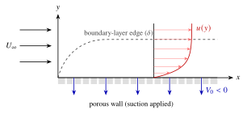

---
format:
  html: default
  pdf:
    documentclass: article
    papersize: a4
    geometry: margin=2cm
    fontsize: 11pt
    toc: false
    colorlinks: true
    include-in-header:
      - ../assets/macros.tex
title: "Workshop 4: Boundary Layer Flow"
subtitle: "Exact and approximate laminar solutions, displacement effects, friction drag and the log law"
toc-depth: 2
---



::: {.callout-note icon=false}
## How to use this page
::: {.content-visible when-format="html"}
**Try every step yourself before looking at the solution.** Write out the full working on paper (📄 [**download the printable handout**](workshop4.pdf), which has space to write under each step), or write it with a stylus or mouse in the *Your attempt* space under each step (use **＋ More space** if you need more room; your writing is kept in this browser). Only then open **Show solution** and compare. Looking at a solution before you have tried makes the workshop far less useful, so please resist the temptation.
:::

::: {.content-visible when-format="pdf"}
**Try every step yourself.** Write out the full working in the space provided. The worked solutions are on the course website, under Workshops; check your answers there after you have had a go.
:::

**Study first:** [Boundary-layer thicknesses](../notes/ch4.qmd#sec-bl-thickness) · [Prandtl's boundary-layer equations](../notes/ch4.qmd#sec-bl-equations) · [Blasius solution](../notes/ch4.qmd#sec-blasius) · [Momentum integral equation](../notes/ch4.qmd#sec-mie) · [Law of the wall and log law](../notes/ch4.qmd#sec-log-law) · [Turbulent flat plate](../notes/ch4.qmd#sec-turbulent-flat-plate) · [Transition](../notes/ch4.qmd#sec-transition) · [Combined laminar–turbulent boundary layers](../notes/ch4.qmd#sec-combined-bl).
:::

## Problem A: Exact solution for a laminar boundary layer

Consider a two-dimensional laminar boundary layer with zero pressure gradient over a flat, porous plate. In industrial aerodynamic applications, active flow control is often achieved via boundary layer suction; by removing low-momentum fluid near the wall, engineers can delay flow separation and reduce drag. To model this, assume a uniform, constant suction velocity at the wall, $v = V_{0} < 0$, resulting in a fully-developed streamwise velocity profile given by $u(y) = U_{\infty}(1 - e^{cy})$.

{#fig-ws4-suction width=70% fig-alt="Uniform stream U_infinity over a porous flat wall through which fluid is sucked with velocity V_0 < 0; the boundary layer grows from the leading edge and then reaches a constant thickness delta, with an exponential velocity profile u(y)."}

Based on this setup, determine the following:

- The value of $c$, in terms of the given flow parameters, such that this profile is an exact solution to the laminar boundary layer equations.
- Whether the standard boundary conditions are satisfied by this velocity profile.
- The thickness of the boundary layer in terms of $c$.

### Assumptions, setup and method

**A. Assumptions checklist**

- Is the flow steady? [Yes, steady flow.]{.gap}
- Is the flow 2D? [Yes, two-dimensional.]{.gap}
- What is the pressure gradient? [Zero pressure gradient ($dp/dx = 0$).]{.gap}
- Is the wall impermeable? [No, $v = V_0 < 0$ at the wall.]{.gap}

**B. Find:** the value of $c$ given that $u(y)$ is a solution, satisfying boundary conditions, and the nominal boundary layer thickness ($\delta$).

**C. Method:** write out the continuity and momentum equations, substitute the given velocity profiles, simplify, and solve for $c$.

### Governing equations

Write out the 2D steady boundary layer equations for continuity and $x$-momentum. Cross out the terms that are zero based on the problem description and state the boundary conditions at the wall ($y = 0$) and in the free stream ($y \rightarrow \infty$).

Show step

**Continuity equation:**
$$
\frac{\partial u}{\partial x} + \frac{\partial v}{\partial y} = 0
$$

**$x$-momentum equation:**
$$
\cancelto{0}{u\frac{\partial u}{\partial x}} + v\frac{\partial u}{\partial y} = -\frac{1}{\rho}\cancelto{0}{\frac{dp}{dx}} + \nu \frac{\partial^2 u}{\partial y^2}
$$

**Cancellations:**

- $dp/dx = 0$ because the problem states a zero pressure gradient.
- The $u\,\partial u/\partial x$ term is zero because the flow is "fully-developed" (meaning $u$ depends only on $y$, not $x$).

*(The streamwise diffusion term $\nu\,\partial^2 u/\partial x^2$ is already neglected in the boundary-layer equations; here it would vanish anyway because $u = u(y)$, so this profile is in fact an exact solution of the full Navier–Stokes equations.)*

**Boundary conditions (BCs):**

- At the wall ($y = 0$): $u = 0$ (no-slip) and $v = V_0 < 0$.
- In the free stream ($y \rightarrow \infty$): $u = U_\infty$.

### Analysis and solution

**1. Verify continuity:** Calculate the partial derivatives of the given velocity components $u$ and $v$ with respect to $x$ and $y$. Substitute them into the continuity equation to verify that it holds true.

Show step

Given the streamwise velocity profile $u(y) = U_{\infty}(1 - e^{cy})$. Since $u$ only depends on $y$, its spatial derivative with respect to $x$ is zero: $\partial u/\partial x = 0$.

Substitute this into the continuity equation:
$$
\cancelto{0}{\frac{\partial u}{\partial x}} + \frac{\partial v}{\partial y} = 0 \implies \frac{\partial v}{\partial y} = 0
$$
Integrating with respect to $y$ reveals that $v$ must be a constant everywhere (at a given $x$). Applying the wall boundary condition ($v = V_0$ at $y = 0$), we can mathematically conclude that $v = V_0$ everywhere in the boundary layer.

**2. Solve for $c$ using the momentum equation:** Calculate the necessary spatial derivatives for $u(y)$. Substitute these, along with $v$, into the simplified momentum equation from earlier. Solve the resulting algebraic equation for the constant $c$.

Show step

First, find the required $y$-derivatives of $u(y)$:
$$
\frac{\partial u}{\partial y} = -c U_{\infty} e^{cy}, \qquad \frac{\partial^2 u}{\partial y^2} = -c^2 U_{\infty} e^{cy}
$$
Based on our cancellations, the $x$-momentum equation simplified to: $v\,\dfrac{\partial u}{\partial y} = \nu\dfrac{\partial^2 u}{\partial y^2}$. Substitute $v = V_0$ and the calculated derivatives into this simplified equation:
$$
\underbrace{V_0}_{v} \underbrace{(-c U_{\infty} e^{cy})}_{\partial u/\partial y} = \underbrace{\nu}_{\mu/\rho} \underbrace{(-c^2 U_{\infty} e^{cy})}_{\partial^2 u/\partial y^2}
$$
Simplify the non-zero terms:
$$
-c V_0 U_{\infty} e^{cy} = -\nu c^2 U_{\infty} e^{cy}
$$
Divide both sides by $-c U_{\infty} e^{cy}$ (assuming $c \neq 0$):
$$
V_0 = \nu c \implies c = \frac{V_0}{\nu}
$$
*Note:* Since $V_0 < 0$ and the kinematic viscosity ($\nu$) is positive, we confirm that $c < 0$.

**3. Verify boundary conditions:** Verify if the given profile $u(y)$ satisfies the boundary conditions stated earlier.

Show step

**Checking BCs:**

- At $y = 0$: $u(0) = U_\infty(1 - e^{c(0)})$ $= U_\infty(1 - 1) = 0$. (Satisfied)
- At $y \rightarrow \infty$: Since $c < 0$, the exponential term $e^{cy} \rightarrow 0$. Therefore, $u \rightarrow U_\infty(1 - 0) = U_\infty$. (Satisfied)

(Without suction, $V_0 = 0$ gives $c = 0$ and $u \equiv 0$, which cannot satisfy the free-stream condition: the suction is essential for this solution.)

**4. Boundary layer thickness ($\delta$):** The nominal boundary layer thickness $\delta$ is defined as the vertical distance $y$ where the fluid velocity reaches 99% of the free-stream velocity. Set $u(\delta) = 0.99U_\infty$ and use the velocity profile to find an expression for $\delta$ in terms of $c$.

Show step

Set $u(\delta) = 0.99U_{\infty}$:
$$
0.99U_{\infty} = U_{\infty}(1 - e^{c\delta})
$$
Divide by $U_\infty$ and rearrange:
$$
0.99 = 1 - e^{c\delta} \implies 0.01 = e^{c\delta}
$$
Take the natural logarithm of both sides:
$$
\ln(0.01) = c\delta \implies -4.605 = c\delta
$$
Solve for $\delta$:
$$
\delta = \frac{-4.605}{c} = \frac{4.605\,\nu}{|V_0|}
$$
*(Note: Because $c$ is negative, $\delta$ evaluates to a positive distance, as physically expected! Stronger suction gives a thinner boundary layer.)*

::: {.callout-tip icon=false}
## Fun fact: the asymptotic suction boundary layer
**Why is $u = u(y)$ a physically realistic assumption here?**

In a standard boundary layer over a solid flat plate (like the Blasius solution), the boundary layer continuously grows thicker as it moves downstream due to viscous diffusion. Because the profile is stretching out, the velocity $u$ must be a function of both $x$ and $y$.

However, in this specific problem, we have uniform **wall suction** ($V_0 < 0$). Viscosity is constantly trying to diffuse momentum outward (growing the boundary layer), while the suction is continuously pulling fluid inward toward the plate.

Far enough downstream, these two competing effects perfectly balance each other! The boundary layer stops growing and achieves a constant thickness. In this "fully developed" state, the velocity profile no longer changes in the flow direction ($\partial u/\partial x = 0$), making $u$ strictly a function of $y$. This fascinating physical phenomenon is known as the **asymptotic suction boundary layer**.
:::

## Problem B: Momentum integral equation with a linear profile {.ws-part}

Replace the typical parabolic boundary layer velocity profile with a simple linear profile $u/U_{\infty} = y/\delta$. Determine the expressions for the dimensionless boundary layer thickness ($\delta/x$), momentum thickness ($\theta/x$), displacement thickness ($\delta^*/x$), shape factor ($H$), and the average skin friction coefficient ($\overline{C}_f$). Compare these expressions with the exact Blasius solution for a laminar boundary layer past a flat plate with constant mainstream velocity $U_\infty$.

### Assumptions, setup and method

**A. Assumptions checklist**

- Flow regime? [Laminar boundary layer.]{.gap}
- Plate geometry? [Flat plate.]{.gap}
- Mainstream velocity? [Constant $U_\infty$, implying zero pressure gradient ($dp/dx = 0$).]{.gap}

**B. Find:** expressions for $\delta/x$, $\delta^*/x$, $\theta/x$, $H$ and $\overline{C}_f$, and their comparison against the Blasius exact solution.

**C. Method:** use the Momentum Integral Equation (MIE) with the assumed linear velocity profile and evaluate the necessary integrals to find the boundary layer parameters.

### Governing equation

Write out the von Kármán Momentum Integral Equation (MIE) simplified for a zero pressure gradient flow over a flat plate.

Show step

The full Momentum Integral Equation is:
$$
\frac{d\theta}{dx} + (2\theta + \delta^*)\frac{1}{U_\infty}\cancelto{0}{\frac{dU_\infty}{dx}} = \frac{\tau_w}{\rho U_\infty^2}
$$
Since $U_\infty$ is constant, $dU_\infty/dx = 0$, reducing the equation to:
$$
\frac{d\theta}{dx} = \frac{C_f}{2} = \frac{\tau|_{y=0}}{\rho U_\infty^2}
$$

### Analysis and solution

**1. Momentum thickness ($\theta$) and wall shear stress ($\tau_w$):** Introduce the dimensionless variable $\eta = y/\delta$. Substitute the linear profile into the integral definition of momentum thickness and evaluate the integral. Next, use Newton's law of viscosity to find an expression for the wall shear stress.

Show step

Let $\eta = y/\delta$. The linear profile is $u/U_\infty = \eta$, and $dy = \delta\, d\eta$.

**Momentum thickness $\theta$:**
$$
\begin{aligned}
\theta &= \int_0^\delta \left(1 - \frac{u}{U_\infty}\right)\frac{u}{U_\infty}\, dy = \delta \int_0^1 (1 - \eta)\eta \, d\eta \\
&= \delta \left[\frac{\eta^2}{2} - \frac{\eta^3}{3}\right]_0^1 = \delta \left(\frac{1}{2} - \frac{1}{3}\right) = \frac{\delta}{6}
\end{aligned}
$$

**Wall shear stress $\tau|_{y=0}$:**
$$
\tau|_{y=0} = \mu \frac{\partial u}{\partial y}\bigg|_{y=0} = \mu \frac{U_\infty}{\delta} \frac{d(u/U_\infty)}{d\eta}\bigg|_{\eta=0}
$$
Since $u/U_\infty = \eta$, its derivative is $1$:
$$
\tau|_{y=0} = \mu \frac{U_\infty}{\delta} (1) = \frac{\mu U_\infty}{\delta}
$$

**2. Boundary layer thickness ($\delta/x$):** Substitute your expressions for $\theta$ and $\tau|_{y=0}$ back into the Momentum Integral Equation. Separate the variables ($x$ and $\delta$) and integrate to find $\delta(x)$. Rewrite the result in terms of the local Reynolds number, $Re_x$.

Show step

Substitute into the MIE:
$$
\frac{d}{dx}\left(\frac{\delta}{6}\right) = \frac{1}{\rho U_\infty^2} \left(\frac{\mu U_\infty}{\delta}\right)
\implies \frac{1}{6} \frac{d\delta}{dx} = \frac{\nu}{U_\infty \delta} \implies \delta \, d\delta = \frac{6\nu}{U_\infty} \, dx
$$
Integrate both sides:
$$
\int \delta \, d\delta = \int \frac{6\nu}{U_\infty} \, dx \implies \frac{\delta^2}{2} = \frac{6\nu x}{U_\infty} + C
$$
Apply the boundary condition at the leading edge ($x = 0$, $\delta = 0$) $\implies C = 0$.
$$
\delta^2 = \frac{12\nu x}{U_\infty} \implies \delta = \sqrt{12} \sqrt{\frac{\nu x}{U_\infty}}
$$
To introduce $Re_x = U_\infty x/\nu$, divide both sides by $x$:
$$
\frac{\delta}{x} = \sqrt{12} \sqrt{\frac{\nu}{U_\infty x}} = \sqrt{12}\, Re_x^{-1/2} \approx 3.46\, Re_x^{-1/2}
$$
*(For comparison, the Blasius exact solution gives $\delta/x \approx 5.0\, Re_x^{-1/2}$.)*

**3. Displacement thickness ($\delta^*/x$) and shape factor ($H$):** Use the integral definition of displacement thickness and the linear profile to find $\delta^*$. Then, calculate the shape factor $H = \delta^*/\theta$. Compare both results to the Blasius exact solution.

Show step

**Displacement thickness $\delta^*$:**
$$
\delta^* = \int_0^\delta \left(1 - \frac{u}{U_\infty}\right) dy = \delta \int_0^1 (1 - \eta) \, d\eta = \delta \left[\eta - \frac{\eta^2}{2}\right]_0^1 = \frac{\delta}{2}
$$
Substitute our expression for $\delta$:
$$
\frac{\delta^*}{x} = \frac{\delta}{2x} = \frac{\sqrt{12}}{2}\, Re_x^{-1/2} = 1.732\, Re_x^{-1/2}
$$
*(Blasius exact solution gives $1.7208\, Re_x^{-1/2}$.)*

**Shape factor $H$:**
$$
H = \frac{\delta^*}{\theta} = \frac{\delta/2}{\delta/6} = \frac{6}{2} = 3.0
$$
*(Blasius exact solution gives $H = 2.59$.)*

**4. Momentum thickness ($\theta/x$) and average skin friction coefficient ($\overline{C}_f$):** Calculate the dimensionless momentum thickness $\theta/x$. Then, use the relationship between the average skin friction coefficient over a plate of length $L$ and the momentum thickness at the trailing edge ($x = L$) to find $\overline{C}_f$. Compare them to the Blasius solution.

Show step

**Dimensionless momentum thickness $\theta/x$:** Since $\theta = \delta/6$ and $\delta/x = \sqrt{12}\, Re_x^{-1/2}$:
$$
\frac{\theta}{x} = \frac{\sqrt{12}}{6}\, Re_x^{-1/2} = 0.577\, Re_x^{-1/2}
$$
*(Blasius exact solution gives $0.664\, Re_x^{-1/2}$.)*

**Average skin friction coefficient $\overline{C}_f$:** The average skin friction coefficient over a plate of length $L$ is related to the momentum thickness at the trailing edge by $\overline{C}_f = 2\theta|_{x=L}/L$.
$$
\overline{C}_f = \frac{2}{L} \left( \frac{L}{6} \times \sqrt{12}\, Re_L^{-1/2} \right) = \frac{\sqrt{12}}{3}\, Re_L^{-1/2} = 1.155\, Re_L^{-1/2}
$$
*(Blasius exact solution gives $1.328\, Re_L^{-1/2}$.)*

| | $\delta/x$ | $\delta^*/x$ | $\theta/x$ | $\overline{C}_f$ | $H$ |
|:--|:-:|:-:|:-:|:-:|:-:|
| Linear profile | [$3.46$]{.gap} | [$1.732$]{.gap} | [$0.577$]{.gap} | [$1.155$]{.gap} | [$3.0$]{.gap} |
| Blasius (exact) | $5.00$ | $1.7208$ | $0.664$ | $1.328$ | $2.59$ |

: Summary: fill in the linear-profile row and compare with Blasius (coefficients of $Re_x^{-1/2}$ or $Re_L^{-1/2}$; $H$ is a pure number). {#tbl-ws4-linear}

## Problem C: Internal flow and displacement thickness {.ws-part}

Air at 20°C ($\mu = 1.8\times 10^{-5}$ kg m⁻¹ s⁻¹; $\rho = 1.2$ kg m⁻³) and 1 atmosphere enters a 0.4 m $\times$ 0.4 m square duct. The inlet uniform velocity is $U_\infty = 2$ m s⁻¹. Using the "displacement thickness" estimate:

- Find the mean velocity in the core flow at the position $x = 3.0$ m.
- Find the mean pressure in the core flow at $x = 3.0$ m.
- What is the average pressure gradient, in Pa m⁻¹, in this section?

*(Note: Although the Blasius solution strictly assumes a zero pressure gradient, we will use it here as a first-order engineering approximation for the boundary layer growth to estimate the resulting pressure drop.)*

{#fig-ws4-duct width=80% fig-alt="Uniform flow at 2 m/s enters a 0.4 m square duct of length 3 m. Boundary layers grow on the walls, squeezing an inviscid core, and the exit profile is flat in the middle."}

### Assumptions, setup and method

**A. Assumptions checklist**

- What is the boundary-layer flow regime at $x = 3.0$ m? [Calculate $Re_x = \dfrac{\rho U_\infty x}{\mu}$ $= \dfrac{1.2 \times 2.0 \times 3.0}{1.8 \times 10^{-5}} = 4 \times 10^5$. This is $< 5 \times 10^5$, so we can assume **laminar** flow.]{.gap}
- Core flow assumption? [The core flow outside the boundary layers is essentially frictionless ($\mu = 0$). Bernoulli's equation applies.]{.gap}
- Boundary layer approximation? [Use the Blasius exact solution for a flat plate to estimate $\delta^*$ growth, despite the mild favourable pressure gradient.]{.gap}

**B. Find:** the mean velocity and mean pressure in the core flow at $x = 3.0$ m, and the average pressure gradient in the duct section.

**C. Method:** use the Blasius solution to estimate the displacement thickness $\delta^*$ at $x = 3.0$ m. Apply conservation of mass to the reduced effective area to find the exit core velocity. Finally, use Bernoulli's equation to find the pressure drop and calculate the average pressure gradient.

### Analysis and solution

**1. Mean velocity in the core at $x = 3.0$ m:** Use the Blasius laminar correlation for displacement thickness ($\delta^*$) to find how much the effective flow area has shrunk at $x = 3.0$ m. Then, apply the conservation of mass (continuity) to find the accelerated core velocity $U_{exit}$.

Show step

Using the Blasius solution for displacement thickness:
$$
\frac{\delta^*}{x} = 1.7208\, Re_x^{-1/2}
$$
$$
\delta^*|_{x=3.0} = 3.0 \times 1.7208 \times (4 \times 10^5)^{-1/2} = \frac{5.1624}{632.46} = 0.00816 \text{ m}
$$
(The boundary-layer thickness itself is $\delta = 5.0\,x\,Re_x^{-1/2} \approx 0.024$ m, small compared with the 0.2 m half-width, so an inviscid core does exist.)

The boundary layer grows on all four walls of the duct. The "effective" area for the inviscid core flow is reduced by $\delta^*$ on each side:
$$
\begin{aligned}
A_{effective} &= (W - 2\delta^*)(H - 2\delta^*) = (0.4 - 2 \times 0.00816)^2 \\
&= (0.4 - 0.01632)^2 = (0.38368)^2 \text{ m}^2
\end{aligned}
$$
By conservation of mass (continuity): $U_{exit} A_{effective} = U_{inlet} A_{inlet}$
$$
U_{exit} = U_{inlet} \frac{A_{inlet}}{A_{effective}} = 2.0 \times \left(\frac{0.4}{0.38368}\right)^2 = 2.0 \times 1.0869 = 2.174 \text{ m s}^{-1}
$$

**2. Mean pressure in the core flow and average gradient:** Apply Bernoulli's equation along a streamline in the frictionless core from the inlet to $x = 3.0$ m to find the pressure drop. Because $\delta^*$ grows non-linearly ($\propto \sqrt{x}$), the actual local pressure gradient $dp/dx$ is not constant. Compute the *average* pressure gradient by dividing the total pressure difference between the initial (inlet) and end ($x = 3.0$ m) points by the total length $\Delta x$.

Show step

Applying Bernoulli's equation:
$$
p_{inlet} + \frac{1}{2}\rho U_{inlet}^2 = p_{exit} + \frac{1}{2}\rho U_{exit}^2
$$
Rearrange to solve for $p_{exit}$ (given $p_{inlet} = 1 \text{ atm} = 101\,325$ Pa):
$$
p_{exit} = p_{inlet} + \frac{1}{2}\rho (U_{inlet}^2 - U_{exit}^2)
$$
$$
\begin{aligned}
p_{exit} &= 101\,325 + \frac{1.2}{2} (2.0^2 - 2.174^2) \\
&= 101\,325 + 0.6 \times (4.0 - 4.726) = 101\,325 - 0.435 \text{ Pa}
\end{aligned}
$$
i.e. $p_{exit} \approx 101\,324.6$ Pa: the core pressure falls by only about $0.44$ Pa.

The average pressure gradient over the 3 m length using the start and end points is:
$$
\frac{dp}{dx}\bigg|_{ave} = \frac{p_{exit} - p_{inlet}}{\Delta x} = \frac{-0.435}{3.0} = -0.145 \text{ Pa m}^{-1}
$$

## Problem D: Flat plate friction drag {.ws-part}

A thin flat plate 0.55 m by 1.1 m is immersed in a 6 m s⁻¹ stream of SAE oil at 20°C ($\rho = 891$ kg m⁻³; $\mu = 0.29$ kg m⁻¹ s⁻¹). Find the total friction drag if the stream is parallel (a) to the long side, (b) to the short side. Repeat the above calculation if the fluid involved is water ($\rho = 998$ kg m⁻³, $\mu = 0.001$ kg m⁻¹ s⁻¹).

### Assumptions, setup and method

**A. Assumptions checklist**

- Transition criterion? [Assume the critical Reynolds number for transition to turbulence is $Re_c = 5 \times 10^5$.]{.gap}
- Wetted area? [The plate is immersed in the stream, so friction acts on **both** sides (top and bottom).]{.gap}
- Fluid properties? [Constant $\rho$ and $\mu$ for each respective fluid.]{.gap}

**B. Find:** the total friction drag force on the plate for both SAE oil and water, in two different orientations (flow parallel to the long side vs. the short side).

**C. Method:** calculate the Reynolds number at the trailing edge ($Re_L$) for each case. Compare $Re_L$ to the critical Reynolds number ($5 \times 10^5$) to determine if the boundary layer is laminar or turbulent. Select the appropriate average skin friction coefficient ($\overline{C}_f$) formula (Blasius for laminar, power law for turbulent) and compute the total drag force using the total wetted area.

### Analysis and solution

**1. SAE oil calculations:** First, check the Reynolds number at the trailing edge ($Re_L$) for both orientations to determine the flow regime. Select the appropriate skin friction coefficient ($\overline{C}_f$) formula, and calculate the total drag force (remembering the plate has two sides!).

Show step

**(a) Parallel to long side ($L = 1.1$ m, $W = 0.55$ m):**
$$
Re_L = \frac{\rho U_\infty L}{\mu} = \frac{891 \times 6.0 \times 1.1}{0.29} = 20\,278
$$
Since $Re_L < 5 \times 10^5$, the flow is purely **laminar**. Use the Blasius relation for average skin friction:
$$
\overline{C}_f = \frac{1.328}{\sqrt{Re_L}} = \frac{1.328}{\sqrt{20\,278}} = 0.00933
$$
Total drag:
$$
F = \overline{C}_f \left(\tfrac{1}{2}\rho U_\infty^2\right) A_{wetted} = \overline{C}_f \left(\tfrac{1}{2}\rho U_\infty^2\right) (2 \times L \times W)
$$
$$
F = 0.00933 \times \frac{891}{2} \times 6.0^2 \times (2 \times 1.1 \times 0.55) = 181 \text{ N}
$$

**(b) Parallel to short side ($L = 0.55$ m, $W = 1.1$ m):**
$$
Re_L = \frac{891 \times 6.0 \times 0.55}{0.29} = 10\,139 \text{ (laminar)}
$$
$$
\overline{C}_f = \frac{1.328}{\sqrt{10\,139}} = 0.0132
$$
$$
F = 0.0132 \times \frac{891}{2} \times 6.0^2 \times (2 \times 0.55 \times 1.1) = 256 \text{ N}
$$
(For a laminar boundary layer the drag is $\propto W\sqrt{L}$, so turning the plate so that the flow runs along the short side increases the drag by a factor $\sqrt{1.1/0.55} = \sqrt{2}$: the boundary layer is thinner, and the wall shear stress higher, near the leading edge.)

**2. Water calculations:** Repeat the process using the properties of water. Check $Re_L$ again, as the drastically lower viscosity will likely change the flow regime.

Show step

**(a) Parallel to long side ($L = 1.1$ m, $W = 0.55$ m):**
$$
Re_L = \frac{\rho U_\infty L}{\mu} = \frac{998 \times 6.0 \times 1.1}{0.001} = 6\,586\,800
$$
Since $Re_L > 5 \times 10^5$, the flow is predominantly **turbulent**. Using the power-law profile correlation (assuming a turbulent boundary layer from the leading edge):
$$
\overline{C}_f = 0.074\, Re_L^{-1/5} = 0.074 \times (6\,586\,800)^{-0.2} = 0.00320
$$
$$
F = \overline{C}_f \left(\tfrac{1}{2}\rho U_\infty^2\right) (2LW) = 0.00320 \times \frac{998}{2} \times 6.0^2 \times (2 \times 1.1 \times 0.55) = 69.6 \text{ N}
$$

**(b) Parallel to short side ($L = 0.55$ m, $W = 1.1$ m):**
$$
Re_L = \frac{998 \times 6.0 \times 0.55}{0.001} = 3\,293\,400 \text{ (turbulent)}
$$
$$
\overline{C}_f = 0.074 \times (3\,293\,400)^{-0.2} = 0.00368
$$
$$
F = 0.00368 \times \frac{998}{2} \times 6.0^2 \times (2 \times 0.55 \times 1.1) = 80.0 \text{ N}
$$

::: {.content-visible when-format="html"}
::: {.callout-note collapse="true" icon=false}
## Going further: accounting for the laminar leading-edge region
With $Re_c = 5\times10^5$ the boundary layer in water is laminar for the first $x_{cr} = Re_c\,\mu/(\rho U_\infty) = 0.084$ m. Using the virtual-origin method of the notes ([combined laminar–turbulent boundary layers](../notes/ch4.qmd#sec-combined-bl)): $\theta_{cr} = 0.664\,x_{cr}Re_c^{-1/2} = 7.8\times10^{-5}$ m, and matching $\theta_{cr} = 0.037(x_{cr}-x_0)Re_{x_{cr}-x_0}^{-1/5}$ gives a virtual origin $x_0 \approx 0.061$ m. The drag then follows from $D = \rho U_\infty^2\,\theta(L)$ per side with $\theta(L) = 0.037(L-x_0)Re_{L-x_0}^{-1/5}$:

- (a) $L = 1.1$ m: $\theta(L) = 1.68\times10^{-3}$ m, $\overline{C}_f = 2\theta(L)/L = 0.00306$, total drag $\approx 66.5$ N;
- (b) $L = 0.55$ m: $\theta(L) = 9.2\times10^{-4}$ m, $\overline{C}_f = 0.00335$, total drag $\approx 72.8$ N.

These are about 4.5% and 9% below the fully turbulent estimates, because the laminar region has lower skin friction; the effect is larger for the shorter plate, where the laminar part is a bigger fraction of the length.
:::
:::

## Problem E: Atmospheric boundary layer (log law) {.ws-part}

Atmospheric BLs are very thick but follow formulas very similar to flat plate theory. Consider wind blowing at 10 m s⁻¹ at a height of 80 m above a beach. Show that a friction velocity of $u_\tau \approx 0.254$ m s⁻¹ satisfies the log-law condition at this height, and use it to estimate the wind shear stress in Pa if the air is at standard sea level conditions ($\rho = 1.2$ kg m⁻³; $\mu = 1.8\times 10^{-5}$ kg m⁻¹ s⁻¹). What will be the wind velocity striking a person if:
(a) they are standing up and their nose is 1.7 m off the ground;
(b) they are lying on the beach and their nose is 0.17 m off the ground?

### Assumptions, setup and method

**A. Assumptions checklist**

- Boundary layer profile? [Assume the turbulent log-law velocity profile applies throughout the region of interest.]{.gap}
- Standard constants? [Use the Kármán constant $\kappa = 0.41$ and smooth-wall constant $C = 5.0$.]{.gap}

**B. Find:** verify the given friction velocity ($u_\tau$), calculate the wind shear stress ($\tau_w$) on the beach, and find the local wind velocities at $y = 1.7$ m and $y = 0.17$ m.

**C. Method:** set up the log-law equation using the known velocity at $y = 80$ m and plug in $u_\tau = 0.254$ m s⁻¹ to verify it balances. Use this $u_\tau$ to calculate the wall shear stress ($\tau_w = \rho u_\tau^2$). Finally, plug $u_\tau$ back into the log-law equation to calculate the velocities at the two specified heights.

### Analysis and solution

**1. Verify $u_\tau$ and calculate the wind shear stress ($\tau_w$):** Assume the boundary layer follows the turbulent log-law velocity profile with constants $\kappa = 0.41$ and $C = 5$. Write the log-law equation, plug in the given $u_\tau$, and show that both sides of the equation are approximately equal. Finally, use the definition of friction velocity to calculate the wall shear stress.

Show step

The log-law profile is:
$$
u^+ = \frac{1}{\kappa}\ln(y^+) + C \implies \frac{u}{u_\tau} = \frac{1}{\kappa}\ln\left(\frac{y u_\tau}{\nu}\right) + 5
$$
Kinematic viscosity $\nu = \dfrac{\mu}{\rho}$ $= \dfrac{1.8 \times 10^{-5}}{1.2} = 1.5 \times 10^{-5} \text{ m}^2\text{s}^{-1}$.

At $y = 80$ m, the velocity $u = 10$ m s⁻¹. Let's test $u_\tau = 0.254$ m s⁻¹:

**Left hand side (LHS):**
$$
\text{LHS} = \frac{u}{u_\tau} = \frac{10}{0.254} \approx 39.37
$$
**Right hand side (RHS):**
$$
\begin{aligned}
\text{RHS} &= \frac{1}{0.41}\ln\left(\frac{80 \times 0.254}{1.5 \times 10^{-5}}\right) + 5 = 2.439\ln(1\,354\,667) + 5 \\
&= 2.439 \times 14.119 + 5 = 34.44 + 5 \approx 39.44
\end{aligned}
$$
LHS $\approx$ RHS, confirming $u_\tau \approx 0.254$ m s⁻¹ is correct.

The friction velocity is defined as $u_\tau = \sqrt{\tau_w/\rho}$. Rearranging for shear stress:
$$
\tau_w = \rho u_\tau^2 = 1.2 \times (0.254)^2 = 0.0774 \text{ Pa}
$$

**2. Wind velocity at specific heights:** Now that you have confirmed $u_\tau$, use the log-law equation directly to calculate the local velocity $u$ at the two specified heights.

Show step

**(a) Standing up ($y = 1.7$ m):**
$$
\begin{aligned}
u &= u_\tau \left[ \frac{1}{0.41}\ln\left(\frac{y u_\tau}{\nu}\right) + 5 \right] \\
&= 0.254 \left[ \frac{1}{0.41}\ln\left(\frac{1.7 \times 0.254}{1.5 \times 10^{-5}}\right) + 5 \right]
\end{aligned}
$$
$$
u = 0.254 \left[ \frac{1}{0.41}\ln(28\,787) + 5 \right] = 0.254 \times [25.04 + 5] = 7.6 \text{ m s}^{-1}
$$

**(b) Lying down ($y = 0.17$ m):**
$$
\begin{aligned}
u &= 0.254 \left[ \frac{1}{0.41}\ln\left(\frac{0.17 \times 0.254}{1.5 \times 10^{-5}}\right) + 5 \right] \\
&= 0.254 \left[ \frac{1}{0.41}\ln(2878.7) + 5 \right] = 0.254 \times [19.43 + 5] = 6.2 \text{ m s}^{-1}
\end{aligned}
$$

::: {.content-visible when-format="html"}

:::
